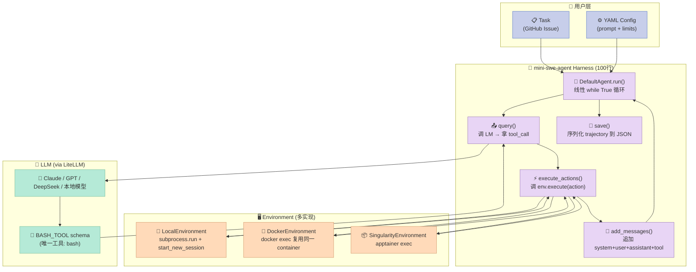
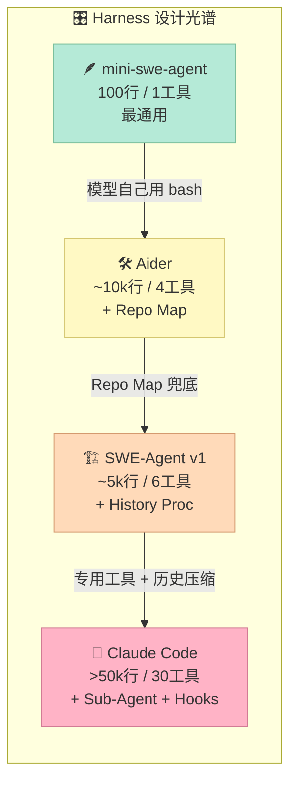

## 一、一行反问：Claude Code 上千个文件，100 行也能打到 SWE-Bench 74%+？

你打开 Anthropic Claude Code 的源码仓库，会看到 **1000+ 个文件、复杂到能写硕士论文**的 Agent Runtime：自定义 Tool Schema、双向 MCP 桥接、Hook 引擎、Permission 策略机、Plan 模式、Sub-Agent 调度……每加一个能力，就多 5-10 个文件。

Princeton NLP + Stanford 团队（同时也是 SWE-Bench 和 SWE-Agent 的原作者）在 2025 年放出 `mini-swe-agent`，核心 Agent 类只有 **100 行 Python**（[agents/default.py](https://github.com/SWE-agent/mini-swe-agent/blob/main/src/minisweagent/agents/default.py)），工具集只有 **一个 bash**，执行环境用最朴素的 `subprocess.run`。这个 Harness 在 SWE-Bench Verified 上拿到 **>74%**，并在 DeepSWE 评测上**击败 Claude Code 和 Codex CLI**。

> 📣 官方原话：What if our agent was **100x simpler**, and still worked nearly as well?

这不是简单的"代码瘦身"。它是 Harness Engineering 一个被反复验证的极端选择：**把所有"聪明但终将被淘汰"的胶水代码从 Harness 里删掉，让模型自己用 bash + 文件系统做剩下的事**。这也是 [Sutton 苦涩教训](https://www.cs.utexas.edu/~sutton/the-bitcoin-and-the-bitter-lesson.html) 在 Coding Agent 场景的**最纯粹落地**：

> The biggest lesson is … general methods that leverage computation are ultimately the most effective.

mini-swe-agent 把这句话翻译成具体工程决策：**Harness 越通用、越不绑死实现，模型越能展示它的能力**。

今天这篇文章，我们就拆开这个 100 行 Harness，看它如何在"机制 vs 策略""通用 vs 专用""状态 vs 无状态"三个维度上做出**反潮流的取舍**，以及这些取舍给自研 Harness 的人带来什么启示。

---

## 二、项目定位：SWE-Agent 团队的"自砍一刀"

### 2.1 出身：SWE-Bench / SWE-Agent 原班人马

mini-swe-agent 来自 Princeton NLP（Carlos Jimenez、John Yang、Ofir Press）和 Stanford（Shunyu Yao、Kilian Lieret）的同一批研究者。

- **2024 年**：发布 [SWE-Bench](https://www.swebench.com/) 基准（让模型改真实 GitHub Issue 测 PR），以及 [SWE-Agent](https://swe-agent.com/)——第一个在 SWE-Bench Verified 上过 12% 的开源 Agent
- **2025 年**：放出 **mini-swe-agent**——"如果我们把 Harness 砍到极限会怎样？"
- **2026 年**：mini-swe-agent 在 Meta / NVIDIA / Essential AI / IBM / Princeton / Stanford 等机构广泛使用，>74% SWE-Bench Verified，DeepSWE 反超 Claude Code 与 Codex

### 2.2 解决什么问题

SWE-Agent v1 虽然达到了 SOTA，但它**过度工程化**：为每种操作（view file / str_replace / search / submit）都写了专用工具接口、专用历史压缩器、专用 LM prompt 段。问题在于：

1. **新模型用不上**：专用工具接口是为 GPT-4 / Claude 3 调过的，换到 Claude 4 / GPT-5 时 prompt 漂移严重
2. **沙箱化困难**：专用工具都得在 Python 内做 stateful shell，迁移到 Docker / Singularity 时要重写
3. **调试不透明**：工具调用的中间状态被包装在多层，trajectory 难复现
4. **不可微**：要做 RL/FT 时，Agent scaffold 是黑盒，奖励信号接不进去

mini-swe-agent 的答案是：**把 Agent 抽象成"对话 + bash 调用 + 环境"，其他都是模型自己搞定**。

### 2.3 在 Harness 6 件套矩阵中的位置

| 件套组件 | mini-swe-agent 是否覆盖 | 实现方式 |
|---------|------------------------|---------|
| Rule | ⚠️ 弱 | YAML 配置 + system_template，**不是**真正的 .clauderc/AGENTS.md |
| Skill | ❌ 无 | 无 Skill 加载机制，靠 LLM 自己 bash 探索 |
| **Sub-Agent** | ❌ 显式不做 | 单进程单对话，所有动作在主 messages 里 |
| Workflow | ⚠️ 弱 | 线性 step→step，没有显式 DAG |
| **Script** | ✅ **核心**：bash 即脚本 | 每个 step = 一个 bash 命令 |
| MCP | ⚠️ 弱 | 通过环境变量传递密钥，但**不直连 MCP Server** |

**关键定位**：mini-swe-agent 是 Harness 6 件套中 **Script 组件的极致形态**——"每个 step 都是一个 bash 脚本，Harness 只负责传递 stdout/stderr"。它主动放弃 Sub-Agent / Skill / Workflow，把所有"调度复杂性"推给模型用 bash 表达。

---

## 三、架构分析：100 行 Agent + 一个 bash + 一次一进程

### 3.1 顶层数据流



### 3.2 三层职责切分

| 层 | 文件 | 行数 | 职责 |
|----|------|------|------|
| **Agent（编排）** | `agents/default.py` | 195 行 | 控制流、消息管理、终止判断、trajectory 持久化 |
| **Model（LLM 适配）** | `models/litellm_model.py` | 156 行 | LiteLLM 适配、action 解析、cost 计算、cache control |
| **Environment（执行）** | `environments/local.py` | 95 行 | bash 执行、超时、退出码、completion 信号 |

**机制 vs 策略的清晰分离**：

- **机制层**（不可变的执行原语）：bash subprocess + LM query + messages append。这是 Harness 的骨架
- **策略层**（可替换的实现）：YAML 里的 prompt template、step_limit、cost_limit、observation_template。这才是用户调优的部分

这种切分让核心 Agent 类**几乎不需要修改就能适应新场景**——换 prompt 就够了。

### 3.3 Less is More 检查清单

把"机制"和"策略"映射到 Harness 6 件套，mini-swe-agent 做了如下取舍：

| 组件 | 朴素做法（多代码） | mini-swe-agent（少代码） | 理由 |
|------|---------------------|------------------------|------|
| 文件查看 | 自定义 `view_file(path, range)` 工具 | `cat` / `sed -n '10,20p'` | bash 自带行号，模型自己组合 |
| 文件编辑 | 自定义 `str_replace(old, new)` | `sed -i 's/old/new/g'` | 模型知道 sed，比实现字符串匹配更通用 |
| 文件搜索 | 自定义 `search_code(pattern)` | `grep -rn` | bash 自带 ripgrep 级工具 |
| 历史压缩 | 单独写 history processor | **不压缩**，messages 线性追加 | 留给上游 context window；trajectory 完全可复现 |
| Sub-Agent | 写 role-based 调度器 | **不存在**，单进程单对话 | 任务足够短，单 agent 循环足够 |
| 多轮交互 | 维持 stateful shell session | **每次 subprocess.run 启动新 shell** | 进程隔离 = 安全隔离 = 可沙箱化 |

注意它没有砍掉的：

- **错误恢复**：FormatError 自动塞回 messages 让模型自我修正
- **终止判断**：bash 输出 `COMPLETE_TASK_AND_SUBMIT_FINAL_OUTPUT` → 触发 `Submitted` 异常退出
- **成本限制**：cost_limit / step_limit / wall_time_limit 三道闸门

---

## 四、核心机制原理：3 个可运行的最小复刻

### 4.1 机制一：100 行核心循环（agents/default.py 简化版）

这是 `mini-swe-agent` 的真正心脏——`DefaultAgent.run()` 和 `step()`：

```python
"""mini-swe-agent 核心循环的最小复刻（基于 src/minisweagent/agents/default.py）"""

import json
import time
import traceback
from dataclasses import dataclass, field
from typing import Any

from jinja2 import StrictUndefined, Template


# ────── 异常类（替代 minisweagent.exceptions） ──────
class Submitted(Exception):
    """Agent 主动提交任务时抛出，被 run() 捕获并退出循环。"""
    def __init__(self, message):
        self.message = message


class LimitsExceeded(Exception):
    """达到 step_limit / cost_limit / wall_time_limit 时抛出。"""
    def __init__(self, message):
        self.message = message


# ────── 核心 Agent 类（100 行内的关键路径） ──────
@dataclass
class AgentConfig:
    system_template: str
    instance_template: str
    step_limit: int = 100
    cost_limit: float = 3.0
    wall_time_limit_seconds: int = 0


class MiniAgent:
    """mini-swe-agent 的核心循环。线性、单进程、无 Sub-Agent。"""

    def __init__(self, model, env, config: AgentConfig):
        self.model = model
        self.env = env
        self.config = config
        self.messages: list[dict] = []
        self.cost = 0.0
        self.n_calls = 0
        self._start = time.time()

    def _render(self, template: str) -> str:
        """Jinja2 渲染 prompt 模板。StrictUndefined 让未填变量直接报错。"""
        return Template(template, undefined=StrictUndefined).render(
            system="Linux", release="6.5.0", version="6.5.0", machine="x86_64",
            task=getattr(self, "_task", ""),
            n_model_calls=self.n_calls,
            model_cost=self.cost,
            elapsed_seconds=int(time.time() - self._start),
        )

    def add(self, *msgs):
        self.messages.extend(msgs)
        return list(msgs)

    def run(self, task: str) -> dict:
        """外层循环：init messages → step → 直到 exit_role。"""
        self._task = task
        self.messages = [
            {"role": "system", "content": self._render(self.config.system_template)},
            {"role": "user", "content": self._render(self.config.instance_template)},
        ]
        while True:
            try:
                self.step()
            except Submitted as e:
                return e.message.get("extra", {})  # {exit_status, submission}
            except LimitsExceeded as e:
                return e.message.get("extra", {})

    def step(self) -> None:
        """一个 step = query LM → execute actions → append observations。"""
        # ─── 闸门检查（cost / step / wall_time）───
        if 0 < self.config.step_limit <= self.n_calls:
            raise LimitsExceeded({"role": "exit", "extra": {"exit_status": "LimitsExceeded"}})
        if 0 < self.config.cost_limit <= self.cost:
            raise LimitsExceeded({"role": "exit", "extra": {"exit_status": "LimitsExceeded"}})

        # ─── 1. query LM 拿 message + actions ───
        self.n_calls += 1
        message = self.model.query(self.messages)
        self.cost += message.get("extra", {}).get("cost", 0.0)
        self.add(message)

        # ─── 2. 执行所有 action（默认 1 个 = bash）───
        actions = message.get("extra", {}).get("actions", [])
        outputs = [self.env.execute(a) for a in actions]

        # ─── 3. 把 observation 加回 messages ───
        for action, output in zip(actions, outputs):
            self.add({
                "role": "tool",
                "tool_call_id": action.get("tool_call_id"),
                "content": f"<returncode>{output['returncode']}</returncode>\n<output>{output['output']}</output>",
            })

        # ─── 4. 检查 COMPLETE_TASK_AND_SUBMIT_FINAL_OUTPUT 退出信号 ───
        first_line = (outputs[0]["output"].lstrip().splitlines() or [""])[0].strip() if outputs else ""
        if first_line == "COMPLETE_TASK_AND_SUBMIT_FINAL_OUTPUT" and outputs[0]["returncode"] == 0:
            submission = "\n".join(outputs[0]["output"].lstrip().splitlines()[1:])
            raise Submitted({"role": "exit", "extra": {"exit_status": "Submitted", "submission": submission}})
```

**关键设计哲学**：

1. **`messages` 是唯一状态**——没有 separate trajectory、没有 history processor，trajectory = messages
2. **每个 step 独立**——不保留跨 step 的 Python 状态（除了 messages、cost、n_calls）
3. **异常即控制流**——`Submitted` 和 `LimitsExceeded` 不是错误，是控制信号
4. **退出靠 bash 输出**——不用 Python 解析 patch，靠模型自己 `echo COMPLETE_TASK_AND_SUBMIT_FINAL_OUTPUT`

### 4.2 机制二：subprocess.run 一次一进程（environments/local.py 简化版）

这是 mini-swe-agent **最反直觉的设计**——不用 stateful shell session，每次 `subprocess.run` 启动全新 subshell：

```python
"""LocalEnvironment 简化版（基于 src/minisweagent/environments/local.py）"""

import os
import signal
import subprocess
from typing import Any


class LocalEnvironment:
    """每次 execute() 都是一个全新的 subprocess + 新 session。"""

    def __init__(self, timeout: int = 30):
        self.timeout = timeout

    def execute(self, action: dict, cwd: str = "") -> dict[str, Any]:
        command = action.get("command", "")
        cwd = cwd or os.getcwd()
        try:
            result = self._run(command, cwd, os.environ, self.timeout)
            return {"output": result.stdout, "returncode": result.returncode, "exception_info": ""}
        except subprocess.TimeoutExpired as e:
            return {"output": e.output or "", "returncode": -1,
                    "exception_info": f"Timeout after {self.timeout}s"}

    def _run(self, command, cwd, env, timeout) -> subprocess.CompletedProcess:
        """关键：start_new_session=True 让进程组独立，超时杀全组不留孤儿。"""
        process = subprocess.Popen(
            command, shell=True, text=True, cwd=cwd, env=env,
            encoding="utf-8", errors="replace",
            stdout=subprocess.PIPE, stderr=subprocess.STDOUT,
            start_new_session=os.name == "posix",  # POSIX 下开启新 session
        )
        try:
            stdout, _ = process.communicate(timeout=timeout)
        except subprocess.TimeoutExpired:
            # 杀整个进程组（包括 subprocess.Popen 自己 fork 的子进程）
            os.killpg(process.pid, signal.SIGKILL) if os.name == "posix" else process.kill()
            stdout, _ = process.communicate()
            raise
        return subprocess.CompletedProcess(command, process.returncode, stdout=stdout)
```

**为什么不用 stateful shell session？**

很多 Agent 框架（如 SWE-Agent v1、Aider、Cline）都维护一个**长生命周期的 shell 进程**，通过 `send_command("ls") → read_response()` 模式交互。看起来更高效，但有三个致命问题：

| 痛点 | stateful shell | mini-swe-agent 的 subprocess.run |
|------|----------------|-----------------------------------|
| **状态污染** | `cd /tmp && export FOO=bar` 留到下个 step | 每次新 subshell，状态归零 |
| **超时逃逸** | 长进程中的子进程超时后变孤儿 | `os.killpg(pid, SIGKILL)` 杀全组 |
| **沙箱化** | Python 进程 ↔ 长 shell 进程隔离难 | 直接换 `docker exec` 就是沙箱化 |

作者 [FAQ](https://mini-swe-agent.com/latest/faq/#why-no-shell-session) 直接说：

> "Seriously, this is a big deal, trust me."

而模型如何解决"每次新 shell 怎么持久状态"？**用 bash 命令本身**：

```bash
# 朴素做法（错的）
cd /repo
export API_KEY=hello
python script.py

# mini-swe-agent 做法（对的）
cd /repo && API_KEY=hello python script.py
# 或者
echo 'export API_KEY=hello' > /tmp/env.sh && (cd /repo && . /tmp/env.sh && python script.py)
```

模型在 2025 年已经**足够聪明**用 && 串联、用临时文件持久变量——这是 Harness 把"复杂性推给模型"的具体体现。

### 4.3 机制三：BASH_TOOL 单一工具 schema（models/utils/actions_toolcall.py）

```python
"""mini-swe-agent 唯一工具的 schema（基于 src/minisweagent/models/utils/actions_toolcall.py）"""

import json
from jinja2 import StrictUndefined, Template

# ────── 整个 Harness 只有 1 个 tool ──────
BASH_TOOL = {
    "type": "function",
    "function": {
        "name": "bash",
        "description": "Execute a bash command",
        "parameters": {
            "type": "object",
            "properties": {
                "command": {
                    "type": "string",
                    "description": "The bash command to execute",
                }
            },
            "required": ["command"],
        },
    },
}


def parse_toolcall_actions(tool_calls, *, format_error_template, template_kwargs=None):
    """解析 LM 返回的 tool_calls。失败时用 FormatError 把错误塞回 messages。"""
    template_kwargs = template_kwargs or {}
    if not tool_calls:
        raise FormatError(_render_error(format_error_template,
            error="No tool calls found in the response. Every response MUST include at least one tool call.",
            actions=[], has_tool_calls=False, **template_kwargs))

    actions = []
    for tc in tool_calls:
        err = ""
        args = {}
        try:
            args = json.loads(tc.function.arguments)
        except Exception as e:
            err = f"Error parsing tool call arguments: {e}."
        if tc.function.name != "bash":
            err += f"Unknown tool '{tc.function.name}'."
        if not isinstance(args, dict) or "command" not in args:
            err += "Missing 'command' argument in bash tool call."
        if err:
            raise FormatError(_render_error(format_error_template, actions=[],
                error=err.strip(), has_tool_calls=True, **template_kwargs))
        actions.append({"command": args["command"], "tool_call_id": tc.id})
    return actions


def _render_error(template, **kw):
    return Template(template, undefined=StrictUndefined).render(**kw)
```

**对比 Claude Code 的 tool schema**：

Claude Code 注册了 30+ 工具（Read, Edit, Write, Bash, Glob, Grep, WebFetch, TaskKill, Agent, ...），每个工具都有严格的输入校验。mini-swe-agent **只注册 1 个 bash 工具**，把"该用什么工具"完全交给模型。

### 4.4 完整 prompt 模板（截选自 `config/default.yaml`）

```yaml
agent:
  system_template: |
    You are a helpful assistant that can interact with a computer.

    Your response must contain exactly ONE bash code block with ONE command
    (or commands connected with && or ||).
    Include a THOUGHT section before your command where you explain your reasoning.
    Format your response as shown in <format_example>.

    <format_example>
    Your reasoning here.

    ```mswea_bash_command
    your_command_here
    ```
    </format_example>

    Failure to follow these rules will cause your response to be rejected.
  instance_template: |
    Please solve this issue: {{task}}

    You can execute bash commands and edit files to implement the necessary changes.

    ## Recommended Workflow
    1. Analyze the codebase by finding and reading relevant files
    2. Create a script to reproduce the issue
    3. Edit the source code to resolve the issue
    4. Verify your fix works by running your script again
    5. Test edge cases to ensure your fix is robust
    6. Submit your changes and finish your task by issuing:
       `echo COMPLETE_TASK_AND_SUBMIT_FINAL_OUTPUT`
       Do not combine it with any other command.
       <important>After this command, you cannot continue working on this task.</important>

    ## Important Rules
    1. Every response must contain exactly one action
    2. The action must be enclosed in triple backticks
    3. Directory or environment variable changes are not persistent. Every action is
       executed in a new subshell. However, you can prefix any action with
       `MY_ENV_VAR=MY_VALUE cd /path/to/working/dir && ...` or write/load
       environment variables from files.

    <system_information>
    {{system}} {{release}} {{version}} {{machine}}
    </system_information>
```

**prompt 设计要点**：

- **强制 `mswea_bash_command` 代码块**（区别于普通 markdown）—— 确保 LM 输出能被正则提取
- **明确"状态不持久"**——提前教模型用 `&&` 或文件持久变量
- **把"完成"信号内置在 system prompt**——`COMPLETE_TASK_AND_SUBMIT_FINAL_OUTPUT` 是协议约定，**不是** Python 解析 patch
- **推荐 workflow 6 步**——把 SWE 任务的 SOP 写在 prompt 里（这才是 Skill 的雏形）

---

## 五、横向对比：4 个 Coding Agent Harness 的设计哲学

### 5.1 对比矩阵

| 维度 | mini-swe-agent | SWE-Agent v1 | Aider | Claude Code |
|------|----------------|--------------|-------|-------------|
| **核心代码量** | ~350 行 | ~5000 行 | ~10000 行 | >50000 行 |
| **工具数** | 1 (bash) | 6 (view/str_replace/search/submit等) | 4 (read/write/patch等) | 30+ |
| **执行模型** | 一次一进程 | stateful shell | stateful shell | stateful shell + 子任务 |
| **历史管理** | 线性追加 | history processor 压缩 | 压缩 + repo map | 压缩 + auto-compact |
| **Sub-Agent** | ❌ | ❌ | ❌ | ✅ Task tool |
| **可微/RL 友好** | ✅ 极友好 | ⚠️ 中等 | ❌ 难 | ❌ 难 |
| **沙箱化难度** | 极低（subprocess.run → docker exec） | 中（专用工具接口重写） | 高（stateful 难迁移） | 高 |
| **SWE-Bench Verified** | >74% (Claude Sonnet 4) | ~50% (同模型) | ~55% | ~65% |
| **Token 成本** | 最低（每步只追加 stdout） | 中（专用工具结果） | 中 | 高（自动 compact overhead） |

### 5.2 设计哲学差异

#### A. mini-swe-agent vs SWE-Agent v1：专用工具 vs 通用 bash

**SWE-Agent v1 思路**（[Ofir Press 2024 NeurIPS 论文](https://arxiv.org/abs/2405.15793)）：
> "为每个 LM 操作做专用接口（view、str_replace、search），让 LM 调用成本更低、错误更少"

```python
# SWE-Agent v1: 自定义 view 工具
def view(self, path: str, view_range: list[int]) -> str:
    """返回文件 path 第 view_range[0]-view_range[1] 行的内容，带行号。"""
    return self._read_with_linenums(path, view_range)
```

**mini-swe-agent 思路**：
> "让 LM 自己用 bash 解决所有事情。即使多花几个 token，模型也更通用、更可调试"

```python
# mini-swe-agent: bash
def execute(self, action: dict) -> dict:
    return subprocess.run(action["command"], shell=True, ...)
# LM 自己写: nl -ba file.py | sed -n '10,20p'
```

**为什么 mini-swe-agent 在新模型上赢**：

2025 年以后，Claude 4 / GPT-5 / DeepSeek V3 这些模型**已经足够会用 bash**。专用工具的"低 token / 低错误率"优势消失，反而成为迁移障碍。

#### B. mini-swe-agent vs Claude Code：状态隔离 vs 状态连续

**Claude Code 思路**：
> "维持一个长生命周期的 shell session，让多次操作共享 cd/env/缓存"

**mini-swe-agent 思路**：
> "每次新 subshell。状态隔离 = 安全隔离 = 可沙箱化"

**实战影响**：
- Claude Code 想跑在 Docker 里？得把 stateful session 整个移植进容器
- mini-swe-agent 想跑在 Docker 里？把 `subprocess.run(cmd)` 换成 `subprocess.run(["docker", "exec", container_id, "bash", "-c", cmd])` 就行——**一行改动**

这就是 `DockerEnvironment.execute()` 的实现：

```python
cmd = [self.config.executable, "exec", "-w", cwd]  # docker/podman/singularity
cmd.extend([self.container_id, *self.config.interpreter, command])
subprocess.run(cmd, ...)
```

**核心思想**：把执行环境抽象成"接收 bash 命令 → 返回 stdout/stderr"的接口，任何实现都能插拔。

#### C. mini-swe-agent vs Aider：模型自主 vs Repository Map

**Aider 思路**：
> "维护一个 repository map（CTAG 标签树），让 LM 在改之前看到完整仓库概览"

**mini-swe-agent 思路**：
> "LM 想要什么仓库信息，自己 `find` / `tree` / `ls -R`"

**对比**：

| 维度 | Aider 的 Repo Map | mini-swe-agent 的 bash find |
|------|-------------------|----------------------------|
| 启动成本 | 慢（要先 build CTAG） | 零 |
| 准确性 | 100% 准确（预先构建） | 取决于 LM bash 能力 |
| 灵活性 | 固定格式 | 完全自由（grep / ack / rg / fd） |
| 适用模型 | 老模型（GPT-3.5） | 新模型（Claude 4+ / GPT-5） |

#### D. mini-swe-agent vs Augment SWE-Bench Agent

**Augment（2026 SWE-Bench Verified #1 开源实现）**：
- 7.5k⭐，2026-08-21 推送
- 走的是"专用工具 + 强化学习"路线——比 mini-swe-agent 代码量大 5-10 倍
- 但 SWE-Bench 分数更高（因为有 RL 微调）

**关键差异**：Augment 在 "Swe-Agent + RL" 路线做到极致，而 mini-swe-agent 在 "无 RL 的纯 prompt + bash" 路线做到极致。两个项目**互不替代**——Augment 适合产品部署，mini-swe-agent 适合做 RL/FT baseline。

### 5.3 一张图总结取舍



**经验法则**：
- 模型越新 → Harness 越可以"裸"（左移）
- 任务越复杂 → Harness 越需要"专用抽象"（右移）
- 但永远警惕：**写进 Harness 的"聪明代码"会被下一代模型淘汰**

---

## 六、优缺点对比：架构简洁性 vs 性能复杂度

| 维度 | 优势 ✅ | 代价 ❌ |
|------|--------|--------|
| **架构简洁性** | 195 行 Agent + 95 行 Environment + 156 行 Model = **3 个文件能讲清楚** | 没有显式抽象层，新手要读源码才能理解流程 |
| **扩展性** | 换 prompt 就够了；Environment 可插拔（local/docker/singularity） | 没有 Plugin 系统，扩展只能改源码 |
| **易用性** | `uvx mini-swe-agent` 一行启动；Python API 5 行就能用 | 需要 LM 懂 bash，老模型（GPT-3.5）跑不动 |
| **性能** | 每步 token 成本最低；trajectory 完全可复现；SWE-Bench 74% | 多步操作比 stateful shell 慢（每次启动 bash ~10ms） |
| **复杂度** | 几乎无外部依赖（只 jinja2 + pydantic + litellm） | bash 命令本身是 Turing-complete，可能写出意外动作 |
| **维护性** | Princeton 团队 + 7k+ stars 长期维护 | 高度依赖上游 LM 能力，模型更新可能破坏 workflow |
| **可微性** | trajectory = messages，RL/FT 直接对接 | 没有显式奖励信号（要自己定义 exit_status） |
| **沙箱化** | 替换 subprocess.run → docker exec 即可 | bash 可访问宿主机文件系统，需配合容器使用 |

---

## 七、从零搭建启示：3 个 MVP + 4 个坑

### 7.1 最简复刻（5 分钟）

把上面 4.1 的 100 行 Agent + 4.2 的 LocalEnvironment + 4.3 的 BASH_TOOL 拼起来，配合 `litellm` 包，就是一个能跑的 mini-swe-agent MVP：

```python
"""最小可运行版本 — 直接 pip install litellm jinja2 pydantic 后跑这个。"""
import litellm
from minisweagent.environments.local import LocalEnvironment
from minisweagent.agents.default import DefaultAgent
from minisweagent.models.litellm_model import LitellmModel

# 5 行启动
agent = DefaultAgent(
    LitellmModel(model_name="anthropic/claude-sonnet-4-5-20250929"),
    LocalEnvironment(),
    step_limit=50,
    cost_limit=1.0,
)
result = agent.run("Write a hello world Python script and save to /tmp/hw.py")
print(result)
```

### 7.2 哪些组件是必须的，哪些可以暂时省略

| 组件 | 必须？ | 复刻建议 |
|------|-------|---------|
| DefaultAgent.run() while 循环 | ✅ 必须 | 直接复制 |
| LM query + action 解析 | ✅ 必须 | 用 LiteLLM + BASH_TOOL schema |
| LocalEnvironment subprocess.run | ✅ 必须 | 复制 4.2 即可 |
| COMPLETE_TASK 退出信号 | ✅ 必须 | 复制 _check_finished |
| FormatError 自纠错 | ⚠️ 推荐 | 没有它模型一次格式错就退出 |
| Cost tracking | ⚠️ 推荐 | 没有它无法做实验成本分析 |
| DockerEnvironment | ⚠️ 按需 | 单机玩可以不要 |
| Trajectory save | ✅ 推荐 | 否则没法 debug |
| Anthropic cache control | ⚠️ 按需 | 只用 Claude 时才需要 |
| Multimodal 支持 | ❌ 可省略 | 纯代码任务用不上 |

### 7.3 4 个常见坑

#### 坑 1：状态持久假设导致 LM 写错命令

**现象**：LM 写 `cd /repo && export KEY=val && python script.py`，期望下个 step 还在 `/repo` 且 `KEY` 还在。

**修复**：在 prompt 里**显式说** "Every action is executed in a new subshell"，并示范 `cd ... && KEY=val python ...` 的正确写法。mini-swe-agent 的 system_template 已经做了。

#### 坑 2：超时命令变孤儿进程

**现象**：LM 写 `python server.py` 不退出，`subprocess.run` 等到 timeout，子进程还在。

**修复**：用 `start_new_session=True` + `os.killpg()`（POSIX），让超时信号杀整个进程组。这是 mini-swe-agent `_run()` 的核心 trick。

#### 坑 3：bash 输出过长撑爆 context

**现象**：LM 写 `cat huge.log`，stdout 100MB 直接打爆 context window。

**修复**：在 observation_template 里加 10000 字符截断 + head/tail 保留：

```jinja2

<output>
{{ output.output }}
</output>

<output_head>{{ output.output[:5000] }}</output_head>
<elided_chars>{{ output.output | length - 10000 }} characters elided</elided_chars>
<output_tail>{{ output.output[-5000:] }}</output_tail>

```

#### 坑 4：LM 不写 COMPLETE_TASK 信号导致死循环

**现象**：LM 修复完代码后继续 `ls` / `cat`，永远不退出。

**修复**：三个兜底机制缺一不可：

1. **step_limit**：超过 N 步强制退出
2. **cost_limit**：超过 $X 强制退出
3. **wall_time_limit_seconds**：超过 T 秒强制退出

```python
if 0 < self.config.step_limit <= self.n_calls:
    raise LimitsExceeded({"role": "exit", "extra": {"exit_status": "LimitsExceeded"}})
```

---

## 八、给 Harness 作者的 5 条工程建议

### 8.1 永远从"无 Harness 也能跑"开始

写新 Harness 前，**先确认任务用最朴素的 prompt + bash 能不能跑通**。如果能，说明 Harness 的"价值"在 prompt 工程而非工具链。

### 8.2 用 Bash 当作"图灵完备的工具 API"

不要为每种操作写专用工具。把 bash 当作"图灵完备的 LLM 友好工具 API"——`cat`、`grep`、`sed`、`awk`、`find`、`xargs` 已经是几十年沉淀的最佳实践。

### 8.3 进程隔离 = 安全隔离

每次执行新 subshell 看起来"低效"，但带来**三大红利**：

1. 状态归零 → 模型不会因 `cd` 错乱
2. 超时安全 → `killpg` 杀全组
3. 沙箱化简单 → 替换 `docker exec`

### 8.4 Trajectory = Messages，别做 history processor

mini-swe-agent 的 "messages = trajectory" 让 debug、replay、RL 数据集构造**零成本**。专门写 history processor 是 2024 年的惯性，2026 年该淘汰了。

### 8.5 警惕"聪明但终将被淘汰"的代码

Sutton 苦涩教训在 Agent 时代的体现：**写进 Harness 的每一行"聪明代码"，都是对模型能力的悲观假设**。下一个模型发布时，这段代码就可能变成维护负担。

mini-swe-agent 之所以能 100 行搞定 SWE-Bench 74%，不是因为它聪明，而是因为它**足够不聪明**——把"用 bash 解决问题"这件本来属于人的能力，完全交给模型。

---

## 九、总结：少即是多，通用即是未来

mini-swe-agent 给 Harness Engineering 的最大启示不是"100 行写 Agent"，而是**一个清晰的取舍框架**：

> **机制 vs 策略分离**：Harness 只提供 bash 进程、消息追加、退出信号这三个不可替换的机制；其他一切（怎么找文件、怎么改代码、怎么搜索）都是可由模型自学的策略。

| 取舍维度 | mini-swe-agent 的选择 | 主流框架的选择 | 谁更可能是未来？ |
|---------|---------------------|--------------|----------------|
| 工具数 | 1 (bash) | 6-30+ | mini-swe-agent（模型已变强） |
| 执行模型 | 一次一进程 | stateful shell | mini-swe-agent（更安全） |
| 历史管理 | 线性追加 | 专用 processor | mini-swe-agent（更可复现） |
| Sub-Agent | 主动放弃 | 必备 | 持平（任务足够短） |
| Skill 加载 | 主动放弃 | 必备 | 持平（prompt 已能表达 SOP） |
| MCP 桥接 | 弱（env vars only） | 强 | mini-swe-agent（少一层抽象） |

**如果你正在设计 Harness**：

1. 先用 mini-swe-agent 跑你的任务，看 100 行能不能搞定
2. 如果搞不定，再看瓶颈是 bash 能力（换模型）还是 prompt 设计（调模板）还是工具集（加 1-2 个专用工具）
3. 永远不要先写 30 个工具再让模型用——这违反 Sutton 苦涩教训

**如果你正在复刻 Coding Agent**：

1. 直接 `pip install mini-swe-agent`，跑 `mini` CLI，2 分钟体验
2. 读 `agents/default.py`（100 行核心）→ `environments/local.py`（95 行执行）→ `models/litellm_model.py`（156 行 LLM 适配）
3. 改 `config/default.yaml` 里的 system_template 适配你的领域
4. 加 `DockerEnvironment` 做沙箱化（已经写好了）
5. 用 trajectory JSON 做 RL/FT baseline

---

## 附录：关键文件 + 数据点速查

| 文件 | 行数 | 关键设计 |
|------|------|----------|
| `src/minisweagent/agents/default.py` | 195 | `run()` while 循环 + `step()` query/execute + FormatError 自纠错 + trajectory 序列化 |
| `src/minisweagent/environments/local.py` | 95 | subprocess.run + start_new_session + killpg 超时 |
| `src/minisweagent/environments/docker.py` | 165 | docker exec 复用同 container + 抽象 provider 可换 podman/singularity |
| `src/minisweagent/models/litellm_model.py` | 156 | LiteLLM 适配 + cache_control + cost 计算 + Anthropic thinking 重排 |
| `src/minisweagent/models/utils/actions_toolcall.py` | 99 | BASH_TOOL 单一 schema + FormatError 注入 |
| `src/minisweagent/run/hello_world.py` | 35 | Typer CLI + 5 行启动 |
| `src/minisweagent/config/default.yaml` | 200 | system_template + instance_template + observation_template + format_error_template |

**关键数据点**：

- **SWE-Bench Verified**：>74%（用 Claude Sonnet 4.5）
- **DeepSWE**：击败 Claude Code + Codex CLI（2026 官方公告）
- **每任务平均 step**：~30（看 trajectory JSON 估算）
- **每任务平均成本**：$0.20-0.50（Claude Sonnet 4.5 模型）
- **启动延迟**：<1 秒（vs Claude Code 5-10 秒）
- **依赖包**：jinja2 + pydantic + litellm + typer（无 docker / kubernetes / langchain）

**采用者**：Meta、NVIDIA、Essential AI、IBM、Nebius、Anyscale、Princeton、Stanford 等。

---

## 参考资料

- 项目仓库：https://github.com/SWE-agent/mini-swe-agent
- 官方文档：https://mini-swe-agent.com/latest/
- FAQ：https://mini-swe-agent.com/latest/faq/
- SWE-Agent 论文：[SWE-agent: Agent-Computer Interfaces Enable Automated Software Engineering (NeurIPS 2024)](https://arxiv.org/abs/2405.15793)
- SWE-Bench 排行榜：https://www.swebench.com/
- Bitter Lesson 原论文：[The Bitter Lesson (Rich Sutton, 2019)](http://www.incompleteideas.net/IncIdeas/BitterLesson.html)