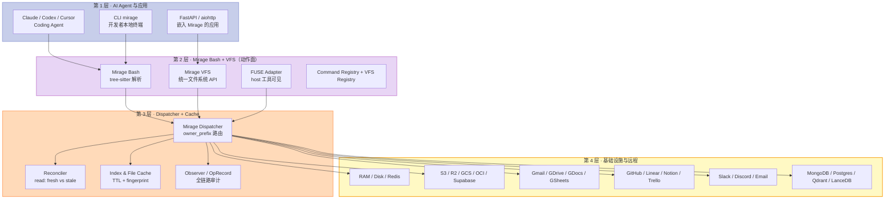
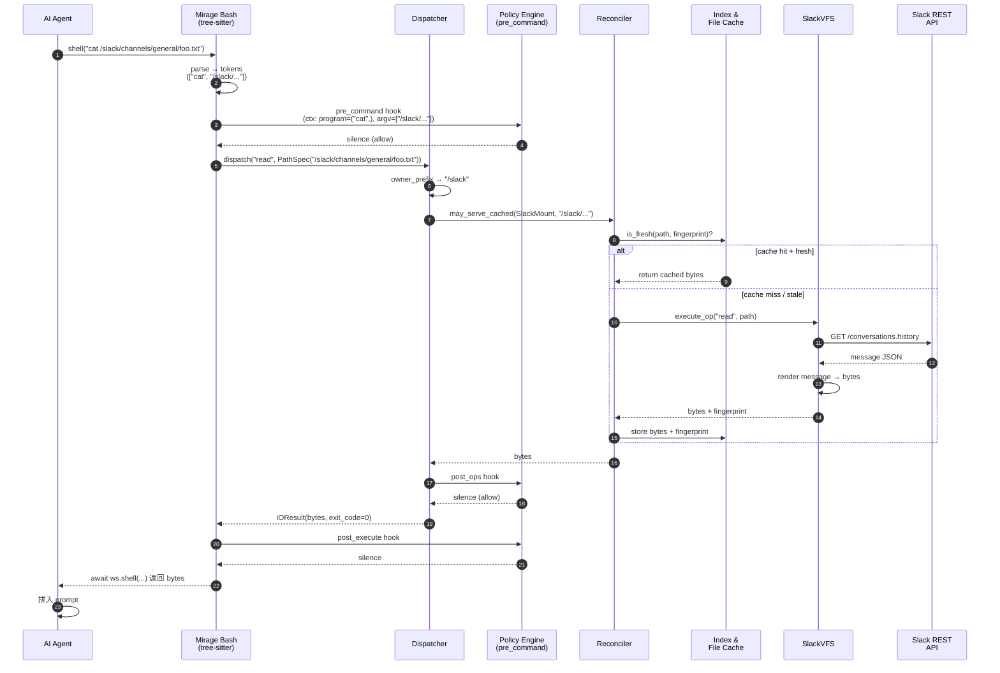

## 引子：当 Agent 面对 60+ 后端时

假设你正在写一个 AI Agent，需要让 Claude 在一个 workspace 里做下面这些事：

- 从 **GitHub** 仓库读取最近 30 个 commit 的文件
- 把结果写入 **Slack** 的 `#deploys` 频道
- 用 **Qdrant** 向量库搜索最匹配的 issue
- 用 **Postgres** 写一行审计日志
- 最后用 `tar` 把 `/tmp/audit/` 目录打包上传到 **S3**

最朴素的实现：调用 5 个不同的客户端库，处理 5 套认证、5 套错误码、5 套重试策略，最后用 `subprocess.run()` 把 tar 命令跑在 host 进程——所有凭证泄露、所有路径穿越、所有 RBAC 都要靠应用代码去兜底。

更糟的是：每个新后端（Slack → Discord、Postgres → MongoDB）都要重写一遍，Agent 切换工具的 prompt 也要重写，整个项目变成胶水代码。

**Mirage（strukto-ai/mirage）选择了一条完全不同的路**：它不让你"调用 N 个 SDK"，而**让所有后端变成同一个 Unix 文件系统下的一棵树**。S3、Slack、Qdrant、Notion、Postgres、MongoDB 都是 `/s3`、`/slack`、`/qdrant`、`/notion`、`/pg`、`/mongo` 这些挂载点；Agent 用 `ls /slack/channels`、`cat /qdrant/collections`、`grep -rl session /github /s3` 这类 Unix 命令去操作它们。

这种设计不是简单的"统一 API 包装"，而是把 **Bash + VFS + Runtime + Policy** 四层抽象叠在一起：

1. **VFS**：60+ 后端都遵循同一套 POSIX 语义（read/write/readdir/stat/rename/...），凭证和连接由 mount 持有，Agent 看不到；
2. **Bash**：tree-sitter 解析命令，pipe/redirect/`$(...)` 都能跨挂载工作；
3. **Runtime**：把 `python`、`node`、`bash`、`wasm` 路由到不同执行引擎，每个声明 `reach: workspace|process|remote`——只有 `workspace` 维度的 runtime 保证 Agent 不能"绕过" policy；
4. **Policy Engine**：5 个钩子（pre_command/pre_ops/pre_session/post_ops/post_execute）+ Profile YAML + 编程式 Policy，可拒绝/Ask、限字节、记录决策——一切状态变更都被拦。

我用了一个下午读了 Mirage 仓库（11.7k 节点、Python + TypeScript 两套实现 spec parity 的 60+ 后端）的核心源码，今天这篇文章把它拆给你看。

---

## 一、项目定位与核心价值

### 1.1 一句话定义

**Mirage 是 "Virtual Terminal for AI Agents"——一个把 AI Agent 工作环境里所有外部服务（云存储、协作工具、向量库、消息、邮件、GitHub、Notion）合并到同一棵虚拟文件系统下、用 bash 命令操作的运行时。**

更具体地说：

> Mirage 是一个 Python / TypeScript / CLI 三形态的 Runtime Library。它把 **60+ 后端**（RAM / Disk / Redis / S3 / R2 / GCS / OCI / Ceph / Supabase / Cloudflare R2 / Aliyun OSS / Tencent COS / Slack / Discord / Email / Gmail / GDocs / GDrive / GitHub / GitLab / Linear / Notion / Trello / MongoDB / Postgres / LanceDB / Qdrant / Chroma / Mem0 / Langfuse / Jaeger / WandB / SSH / HuggingFace Hub / MinIO / SeaweedFS / Wasabi / Backblaze / Scaleway / QingStor / NextCloud / OneDrive / SharePoint / Box / Dropbox / HF Datasets / HF Models / HF Spaces / Dify / Databricks Volume / GridFS 等）挂载到一棵虚拟文件系统树里，让 Agent 用 `ls`、`cat`、`grep`、`find`、`tar`、`jq`、`python`、`node`、`bash` 这套 Unix 工具操作它们。

### 1.2 仓库统计

| 维度 | 数据 |
|---|---|
| ⭐ Stars | 3,647 |
| 🚀 Latest push | 2026-09-21 (yesterday) |
| 📅 Created | 2026-05-06 (~4 个月) |
| 🌿 Default branch | `main` |
| 📝 License | Apache-2.0 |
| 🌲 Tree size | 11,687 nodes (4400 Python + 3898 TS + 2060 integ + 548 examples + 342 docs + 292 spec) |
| 📦 Source LOC | Python: `mirage/` 22+ modules；TypeScript: `packages/{core,node,browser,server,cli,dsh,agents,opencode}` |
| 🔧 Implementations | Python 100%（async）+ TypeScript 100%（Node + Browser 两条 runtime 路径）|
| 📜 Spec system | 每条命令 `command_io` + VFS `capabilities` + `configs` + `command_vfs_names` 4 张表做 parity 检查 |

**为什么选 Mirage 而不是其他**：它不是简单的 "MCP / function calling 包装"，而是用 **POSIX 文件系统语义 + Bash 解析器**做底座。这种设计带来三个独特能力：

1. **可组合性**：`grep -rl session /slack /s3 | xargs -I{} tar -czf /tmp/report.tar.gz {}` 这种跨挂载管线，所有现有 Unix 工具立即可用——Agent 不必学新 API。
2. **可观测性**：每个 op 都走 Dispatcher → Observer，记录 `OpRecord`（op、路径、字节数、来源 mount、cache 命中 / 失败原因），可以回放。
3. **可执行性隔离**：Runtime `reach: "workspace"` 是显式承诺——只要所有 runtime 都声明 `workspace`，policy 才真有效。这是其他 Agent 框架（OpenAI Agents SDK / LangChain）默认做不到的。

---

## 二、整体架构：四层抽象

Mirage 的官方架构图把整个系统拆成 **四层**，从 Agent 到基础设施依次为：



### 2.1 四层的职责切分

| 层 | 模块 | 职责 |
|---|---|---|
| **第 1 层：AI Agent 与应用** | Claude / Codex / Cursor / FastAPI / CLI | 发起 `bash` 命令、读 / 写文件、调 Python / Node |
| **第 2 层：Bash + VFS（动作面）** | `mirage.shell`、`mirage.vfs`、`mirage.commands`、`mirage.vfs.registry` | 解析命令、暴露统一 API、声明有哪些动词和 mount |
| **第 3 层：Dispatcher + Cache** | `mirage.workspace.dispatcher`、`Reconciler`、`CacheManager`、`OpRecord` | 路由 op 到 mount 拥有者、缓存重复读、记录审计 |
| **第 4 层：基础设施与远程** | 60+ VFS 实现 | 实际持有连接、调用 REST API、序列化为文件系统操作 |

### 2.2 与 MCP / function calling 的根本差异

| 维度 | MCP / function calling | Mirage |
|---|---|---|
| **抽象对象** | Tool / Function | File / Command |
| **可组合性** | 需 LLM 选 tool，LLM 失误率随 tool 数 ↑ | Unix 管线天然组合 |
| **状态** | 无状态（每次 call 重传） | 有持久 cwd、虚拟 env、cache |
| **可观测** | Tool 调用的输入 / 输出 | 全链路 OpRecord + fingerprint + cache hit / miss |
| **隔离** | 需自己实现 sandbox | MountMode + Profile + Policy 五钩子 |
| **学习曲线** | 每加一个 tool 要写 schema | 加新 mount 只需注册一个 `BaseVFS` 子类 |

---

## 三、虚拟文件系统（VFS）：60+ 后端的统一抽象

### 3.1 BaseVFS：所有 mount 的根类

VFS 的抽象核心是 `BaseVFS`，位于 `python/mirage/vfs/base.py`（10 KB）。它不强制任何具体实现，只通过 4 个 class attribute 让子类声明"我能做什么、不能做什么"：

```python
# 来自 python/mirage/vfs/base.py:25-95
class BaseVFS:
    name: str = "base"
    caches_reads: bool = False
    accessor: Accessor = Accessor()
    _ops: dict[str, Callable[..., Any]] = {}

    # 标记该 VFS 是否携带足够版本信息用于 snapshot + replay drift 检测
    SUPPORTS_SNAPSHOT: bool = False

    # stat() 是否对每个 regular file 都有真实 size（False 表示 mount 不查实际内容）
    SIZES_ALWAYS_KNOWN: bool = False

    # `read: fresh` mount 是否能用 fingerprint 重新校验
    READ_REVALIDATABLE: bool = False
```

这 4 个 bool 不只是 metadata——它们是 **runtime 的 gate**：

- `SUPPORTS_SNAPSHOT=False` 时，snapshot 时不记录 fingerprint，replay 时不做 drift 检查；
- `SIZES_ALWAYS_KNOWN=False` 时，FSKit（macOS） backend 会拒绝挂载——避免 silent empty file bug；
- `READ_REVALIDATABLE=False` 时，`read: fresh` 策略在 mount time 被直接拒绝而不是降级，避免"声明 fresh 实际 bounded"的逻辑坑。

注释里特别提到：`onedrive` 和 `sharepoint` 看起来都满足条件，但其实不行——它们的 read record 用了 `path.vfs_path`（无前导斜杠），导致 `record()` 构造的 key 永远是 `/oda/b.txt` 而不是 `/od/a/b.txt`，**fingerprint 永远匹配不上 cache**。这种 corner case 在文件里有详细解释，是 agent 框架里少见的"认真记错过的失败"。

### 3.2 REGISTRY：60+ 后端的声明

`python/mirage/vfs/registry.py`（15 KB）的核心是一个 `dict[str, VFSEntry]`，每个 entry 形如 `"s3": VFSEntry("mirage.vfs.s3:S3VFS", "mirage.vfs.s3:S3Config")`：

```python
# 来自 python/mirage/vfs/registry.py:36-90 (节选)
REGISTRY: dict[str, VFSEntry] = {
    "ram":     VFSEntry("mirage.vfs.ram:RAMVFS", None),
    "disk":    VFSEntry("mirage.vfs.disk:DiskVFS", None),
    "redis":   VFSEntry("mirage.vfs.redis:RedisVFS", None),
    "s3":      VFSEntry("mirage.vfs.s3:S3VFS", "mirage.vfs.s3:S3Config"),
    "r2":      VFSEntry("mirage.vfs.r2:R2VFS", "mirage.vfs.r2:R2Config"),
    "gcs":     VFSEntry("mirage.vfs.gcs:GCSVFS", "mirage.vfs.gcs:GCSConfig"),
    "oci":     VFSEntry("mirage.vfs.oci:OCIVFS", "mirage.vfs.oci:OCIConfig"),
    "supabase":VFSEntry("mirage.vfs.supabase:SupabaseVFS",
                        "mirage.vfs.supabase:SupabaseConfig"),
    # ... 60+ 后端
    "slack":   VFSEntry("mirage.vfs.slack:SlackVFS", "mirage.vfs.slack:SlackConfig"),
    "discord": VFSEntry("mirage.vfs.discord:DiscordVFS", "mirage.vfs.discord:DiscordConfig"),
    "gmail":   VFSEntry("mirage.vfs.gmail:GmailVFS", "mirage.vfs.gmail:GmailConfig"),
    "github":  VFSEntry("mirage.vfs.github:GitHubVFS", "mirage.vfs.github:GitHubConfig"),
    "linear":  VFSEntry("mirage.vfs.linear:LinearVFS", "mirage.vfs.linear:LinearConfig"),
    "notion":  VFSEntry("mirage.vfs.notion:NotionVFS", "mirage.vfs.notion:NotionConfig"),
    "mongodb": VFSEntry("mirage.vfs.mongodb:MongoDBVFS", "mirage.vfs.mongodb:MongoDBConfig"),
    "postgres":VFSEntry("mirage.vfs.postgres:PostgresVFS", "mirage.vfs.postgres:PostgresConfig"),
    "qdrant":  VFSEntry("mirage.vfs.qdrant:QdrantVFS", "mirage.vfs.qdrant:QdrantConfig"),
    "lancedb": VFSEntry("mirage.vfs.lancedb:LanceDBVFS", "mirage.vfs.lancedb:LanceDBConfig"),
    "chroma":  VFSEntry("mirage.vfs.chroma:ChromaVFS", "mirage.vfs.chroma:ChromaConfig"),
    "mem0":    VFSEntry("mirage.vfs.mem0:Mem0VFS", "mirage.vfs.mem0:Mem0Config"),
    "langfuse":VFSEntry("mirage.vfs.langfuse:LangfuseVFS", "mirage.vfs.langfuse:LangfuseConfig"),
    # ... SSH, HuggingFace, Dropbox, Box, SharePoint, OneDrive 等
}
ENTRY_POINT_GROUP = "mirage.vfs"
```

注册表本身是简单的字符串字典，但 `ENTRY_POINT_GROUP = "mirage.vfs"` 暗示了扩展点：通过 setuptools entry_points，第三方包可以注册自己的 VFS（**Plug-in 模式**），不需要改 Mirage 源码。

### 3.3 VFS 接口：13 个核心 op

每个 VFS 通过 `_ops` 字典挂上 op 实现。一个 `RAMVFS` 子类的核心结构：

```python
# 来自 python/mirage/vfs/ram/ram.py:27-65
_RAM_OPS = {
    "read_bytes":  read_bytes,
    "write":       write_bytes,
    "readdir":     readdir,
    "stat":        ram_stat,
    "unlink":      unlink,
    "rmdir":       rmdir,
    "copy":        copy,
    "rename":      rename,
    "mkdir":       mkdir,
    "read_stream": read_stream,
    "rm_recursive":rm_r,
    "du_size":     du_size,
    "du_entries":  du_entries,
    "create":      create,
    "truncate":    truncate,
    "exists":      exists,
    "find_flat":   find,
    "append":      append_bytes,
}

class RAMVFS(BaseVFS):
    accessor: RAMAccessor
    name: str = VFSName.RAM
    SIZES_ALWAYS_KNOWN: bool = True   # byte store：stat() 直接给 size
    index_ttl: float = 0
    _ops: dict[str, Any] = _RAM_OPS
    PROMPT: str = PROMPT
```

13 个 op 是 `RAMVFS` 的实现，其它后端（如 `S3VFS`、`SlackVFS`）只需要实现这些 op 的子集。未实现的 op 在 mount time 被发现，调用时抛 `OperationNotSupportedError`。

### 3.4 三个 Backend 类的对比

| 后端 | read | write | stat size | fingerprint | notes |
|---|---|---|---|---|---|
| `RAMVFS` / `DiskVFS` / `RedisVFS` | ✅ | ✅ | ✅ 已知 | 内存 hash | byte store |
| `S3VFS` / `R2VFS` / `GCSVFS` | ✅ | ✅ | ✅ 已知 | ETag | REST 协议，boto3 客户端 |
| `SlackVFS` / `GmailVFS` / `DiscordVFS` | ✅ | ✅ | ❌ 未知 | message id | render-on-read |
| `QdrantVFS` / `LanceDBVFS` / `ChromaVFS` | ✅ | ✅ | ❌ 未知 | version stamp | 向量库 mock 文件系统 |
| `GitHubVFS` / `LinearVFS` / `NotionVFS` | ✅ | ✅ | ❌ 未知 | commit SHA / updated_at | issue / doc 树状结构 |
| `PostgresVFS` / `MongoDBVFS` | ✅ | ✅ | ❌ 未知 | xmin / _id | row JSONL 形式 |
| `SSHVFS` | ✅ | ✅ | ✅ 已知 | mtime / size | sshfs-like |
| `Mem0VFS` / `LangfuseVFS` / `JaegerVFS` | ✅ | ✅ | ❌ 未知 | timestamp | AI infra mock 文件系统 |
| `DifyVFS` / `DatabricksVolumeVFS` | ✅ | ✅ | ❌ 未知 | — | niche 后端，按需启用**

最妙的是 `SlackVFS` 这类"渲染型"后端：Slack 频道里每条消息是一个文件，路径形如 `/slack/channels/general/files/example__F....txt`，`stat()` 返回消息元数据，`read_bytes()` 把消息内容渲染为可读文本，Agent 可以 `grep "error" /slack/channels/*/files/*.txt`。

`NotionVFS` 类似：每个 page 是一个文件，page block tree 渲染为 markdown——Agent 可以 `cat /notion/pages/<page-id>` 拿到干净的 page 内容。

**这不是简单的"把 API 包成函数"**——是把每个 SaaS 的"对象层级"翻译成"文件树层级"，让 Unix 工具链天然适用。

---

## 四、Runtime 抽象：Process / Line / Evaluator 三层

### 4.1 为什么需要 Runtime 抽象

Mirage 的 bash 不止能跑"shell 命令"——它还可以路由 `python`、`node`、`bash`、`wasm` 到不同 backend。这就是 **Runtime 抽象**：

```python
# 来自 python/mirage/runtime/base.py:31-65
class Runtime(ABC):
    """引擎：workspace 把命令或整行路由给它"""

    name: str
    captures: tuple[str, ...] = ()         # 这个 runtime 声明接哪些命令
    reach: RuntimeReach = "process"        # 默认 "process"——最不安全
    filesystem: ClassVar[tuple[FilesystemOperation, ...]] = ()
    script: Callable[..., Any] | ScriptSource | None = None
    config_cls: ClassVar[type[RuntimeConfig]] = RuntimeConfig
    config: RuntimeConfig = RuntimeConfig()
```

关键设计：**每个 runtime 显式声明 `reach`（"workspace" | "process" | "remote"）**——这决定了 runtime 执行的代码能"绕过多远"的 policy gate。

- `reach="workspace"`：runtime 只能通过 `RuntimeVFS` 跟 workspace 交互，所有 op 都受 mount mode / policy 限制；
- `reach="process"`：runtime 可以直接 spawn subprocess、读 host 文件系统——**绕过 policy**；
- `reach="remote"`：runtime 可以发任意 HTTP——更宽松。

```python
# 来自 python/mirage/runtime/base.py:60-75 (节选注释)
# reach: RuntimeReach = "process"
# Which doors this runtime's code has to the outside world:
# "workspace" when the workspace dispatch is its only one, as the
# bridged engines (monty, quickjs, wasi) and the vfs routing marker
# declare, "process" or "remote" when the code can act around that
# gate.
# The default is "process", the no-promise claim, so a custom runtime
# must declare a narrower reach explicitly rather than inherit it.
# Embedders read the aggregate: only a world in which every runtime
# reaches "workspace" makes "agent code cannot bypass mount modes and
# policy" a true statement; one wider runtime voids it.
```

**这是 Mirage 的核心安全设计**：默认 reach 是 `process`（最不安全），custom runtime 必须显式声明更窄的 reach。当所有 runtime 都声明 `reach="workspace"` 时，"agent 代码不能绕过 mount mode 和 policy" 才是个真命题。

### 4.2 Mixin：3 种执行范式

Runtime 通过 mixin 区分三种执行范式：

```python
# 来自 python/mirage/runtime/base.py:14-19
from mirage.runtime.mixin import (EvaluatorMixin, LineExecutorMixin,
                                  ProcessExecutorMixin)
```

| Mixin | 能力 | 例子 |
|---|---|---|
| `EvaluatorMixin` | 表达式求值 `eval()` | `MontyRuntime` 的 Python REPL |
| `LineExecutorMixin` | 整行执行 `run_line()` | `BashRuntime` |
| `ProcessExecutorMixin` | 子进程 `subprocess.run()` | `LocalRuntime` |

每个 runtime 通过 type-detected mixin 自动获得能力——不需要 `isinstance` 判断。代码注释明确说："detected by type and never by probing"。

### 4.3 内置 Runtime 清单

`python/mirage/runtime/` 下的子目录：

| 目录 | Runtime | Reach | 备注 |
|---|---|---|---|
| `python/monty/` | `MontyRuntime` | workspace | 用 [pydantic/monty](https://github.com/pydantic/monty) 沙箱化 Python eval |
| `python/local.py` | `LocalRuntime` | process | 直接 subprocess 跑 Python——**绕过 policy** |
| `python/wasi.py` | WASI-based | workspace | 走 WASI ABI |
| `wasm/` | `WasmRuntime` | workspace | WASM module 沙箱 |
| `wasm/abi.py` (6.4KB) | WASI ABI 适配层 | workspace | preview1 host functions |
| `wasm/vfs.py` (13KB) | WASM VFS 暴露 | workspace | 13 个 op → WASI syscalls |
| `wasm/host.py` (24KB) | WASM host functions | workspace | read/write/readdir/stat 等 |
| `js/` | JavaScript runtime | workspace | quickjs 桥 |
| `sandbox/daytona/` | `DaytonaRuntime` | remote | Daytona 云沙箱 |
| `sandbox/docker/` | `DockerRuntime` | remote | 本地 Docker |
| `sandbox/e2b/` | `E2BRuntime` | remote | E2B 云沙箱 |
| `sandbox/sandlock/` | `SandlockRuntime` | remote | sandlock 沙箱 |
| `sandbox/smolvm/` | `SmolvmRuntime` | remote | smolvm 沙箱 |
| `sandbox/ssh/` | `SSHRuntime` | remote | 远程 SSH 主机 |

**这种分层让 Mirage 同时支持本地 in-process 沙箱（monty / quickjs）和远程 microVM 沙箱（Docker / E2B / Daytona）**——Agent 在 `/tmp` 跑 Python 用 `MontyRuntime`，跑重计算用 `E2BRuntime`，跑需要 native binary 的 build job 用 `DockerRuntime`。

### 4.4 RuntimeVFS：guest code 看得到的 VFS

每个 runtime 暴露给 guest code 的 VFS 表面是 `RuntimeVFS`（17 KB）。它的核心是把 13 个 op 同步化：

```python
# 来自 python/mirage/runtime/vfs.py:55-67
class RuntimeVFS:
    """The mount-facing op vocabulary a sandboxed runtime encodes into.

    One instruction set (read/write/append/stat/readdir/create/truncate/
    unlink/mkdir/rmdir/rename/symlink/readlink/setattr), one routing
    table, one place that knows an append may have to become a
    whole-file write.
    """
```

注释里特别提到了一个隐蔽的 bug：

```python
# 来自 python/mirage/runtime/vfs.py:38-54 (节选)
# The surface is sync on purpose: guest calls arrive on a worker
# thread (wasm) or the binding's own thread (monty), so every op hops
# to the workspace loop with `run_coroutine_threadsafe` and blocks
# that caller. The hop cannot carry the launching task's contextvars:
# what travels is the calling thread's context, and the threads guest
# calls arrive on (monty's tokio workers, wasmtime's run thread) never
# had the session bound. So the VFS captures the session and the op
# recorder on the launching task at construction — every runtime
# builds one per run, and monty builds one per eval — and re-binds
# both around each dispatched op, the same bracket FUSE's
# ``MountCore`` puts around its ops.
```

**Session 和 Recorder 必须以 launching task 的 context 为准，不能拿 calling thread 的 contextvars**——因为 guest code 跑在 worker thread 上，contextvars 是不一致的。这种细节是 Agent framework 经常忽略的"正确性 trap"。

---

## 五、Dispatcher 与 Reconciler：路由 + 一致性

### 5.1 owner_prefix：mount 路由的最长前缀

当 Agent 跑 `cat /slack/channels/general/foo.txt` 时，Dispatcher 需要找到这条路径属于哪个 mount。这就是 `owner_prefix`：

```python
# 来自 python/mirage/utils/path.py (核心算法)
def owner_prefix(prefixes: list[str], path: str) -> str | None:
    """The mount prefix owning ``path`` by longest match, or None."""
    best = None
    best_len = -1
    for prefix in prefixes:
        if path == prefix or path.startswith(prefix + "/"):
            if len(prefix) > best_len:
                best = prefix
                best_len = len(prefix)
    return best
```

最长前缀匹配，让 `/slack/channels/...` 命中 `SlackVFS` 而 `/slack_archive/...` 命中另一个 mount（如果存在）。这种简单算法在 mount 列表很短时 O(N)，但因为 mount 列表一般 < 100，可以接受。

### 5.2 Reconciler：read: fresh 的 stale 检测

`Reconciler`（`python/mirage/workspace/reconcile.py`，12 KB）是 Mirage 的**唯一** reconcile 点——所有 read path 共享它。核心是一个 4 状态机：

```python
# 来自 python/mirage/workspace/reconcile.py:16-22
class Verdict(Enum):
    FRESH = "fresh"      # fingerprint 匹配，缓存可用
    STALE = "stale"      # fingerprint 不匹配，缓存失效
    GONE = "gone"        # 404，缓存和 overlay 都删
    UNKNOWN = "unknown"  # 没有 fingerprint 或 stat 失败，无法验证
```

```python
# 来自 python/mirage/workspace/reconcile.py:73-91
async def _probe(self, mount: MountEntry, path: str) -> Verdict:
    try:
        remote_stat = await mount.execute_op("stat", path, index=RAMIndexCacheStore())
    except FileNotFoundError:
        await self.on_missing(path)
        await mount.index.clear()
        return Verdict.GONE
    except OperationNotSupportedError:
        # 没有 stat op 的 backend 不能 revalidate
        await self._cache.remove(path)
        await mount.index.clear()
        return Verdict.UNKNOWN
    if remote_stat is None or remote_stat.fingerprint is None:
        await self._cache.remove(path)
        await mount.index.clear()
        return Verdict.UNKNOWN
    if not await self._cache.is_fresh(path, remote_stat.fingerprint):
        await self._cache.remove(path)
        await mount.index.clear()
        return Verdict.STALE
    return Verdict.FRESH
```

注意这里**没有显式的 cache hit 路径**——Reconciler 只负责"告知缓存失效"，真正决定"用不用 cache" 的是上层 `_MountChannel` 和 `may_serve_cached`。

### 5.3 三处 reconcile 的设计权衡

注释里详细讲了 **3 个 read path 都调 Reconcile** 的设计：

```python
# 来自 python/mirage/workspace/reconcile.py:38-50 (节选)
# Three read paths call in: the cached-read gate (``may_serve_cached``),
# which the dispatcher and the file cache's own door both run, its main-op
# catch (``on_op_missing``) for cross-mount and programmatic reads, and
# the mount registry's per-command reconcile (``reconcile_read``) for
# single-mount shell reads.
#
# The gate and ``reconcile_read`` overlap deliberately: a warm named
# operand is probed once at routing and again at the gate. Deduplicating
# them needs a fact neither tier owns -- routing runs before any handler,
# the gate inside one -- so the cheap version was a flag on the command
# that went stale the moment a backend registered its own reader. Paying
# the second probe is the honest price until the two tiers share a scope.
```

这是 Mirage 工程哲学的小切片：**deduplicate 需要两个 tier 都看不到的 fact，宁可付二次 probe 的代价也不引入隐藏共享**。

### 5.4 异常处理的精妙细节

`_probe_or_unknown` 用 `try/except` 区分"backend 不能答"和"probe 路径有 bug"：

```python
# 来自 python/mirage/workspace/reconcile.py:99-128 (节选)
async def _probe_or_unknown(self, mount, path) -> Verdict:
    try:
        return await self._probe(mount, path)
    except FileNotFoundError:
        raise
    except (TypeError, AttributeError, NameError):
        # A backend that cannot answer is one thing; a bug in the probe
        # path is another, and degrading it to "cannot verify" would
        # hide it behind a log line and a lifetime of cold reads.
        raise
    except Exception as exc:
        await self._cache.remove(path)
        await mount.index.clear()
        logger.debug("probe failed for %s: %s", path, exc)
        return Verdict.UNKNOWN
```

- `TypeError/AttributeError/NameError` → 当作 bug 处理，**re-raise 不吞**；
- 其它 `Exception` → 当作 transient error，log + 走 cold read；
- 注释明确说 `RuntimeError` **不能**放进 generic except——`asyncio` 用它表示 "Event loop is closed" 和 "cannot reuse already awaited coroutine"，re-raise 会 abort 整个 traversal；只在 probe 路径里吞掉 asyncio errors 就违背了 CLAUDE.md 的 "loud failure" 原则。

这种注释驱动的工程实践是 Mirage 最值得学习的地方。

---

## 六、Policy Engine：5 钩子 + Profile + 编程式 Policy

### 6.1 5 个钩子的责任切分

Policy Engine 是 Mirage 的安全核心。从 `docs/home/policy-engine.mdx` 的定义：

```python
# 来自 docs/home/policy-engine.mdx (5 钩子)
# pre_command    — 每条命令运行前（hot path 但语义重）
# pre_ops        — 每个 VFS op 在 dispatcher / facade 门前（hot path，千次/秒）
# pre_session    — 每个 session 状态写（export / 赋值 / ${X:=default}）
# post_ops       — 每个 op 完成后（可 Limit）
# post_execute   — 每条 execute() line 完成后（可 Limit）
```

| 钩子 | 频率 | 答案 |
|---|---|---|
| `pre_command` | 1/line | `Deny` / `Ask` / silence |
| `pre_ops` | 千次/line | `Deny` |
| `pre_session` | 多次/line | `Deny` |
| `post_ops` | 千次/line | `Deny` / `Limit` |
| `post_execute` | 1/line | `Limit` |

**关键设计**：所有 hook 都是 fail-closed——抛错就 deny，因为 policy raise 而非 fail open 是 Mirage 的安全承诺。

### 6.2 编程式 Policy：custom 业务规则

```python
# 来自 docs/home/policy-engine.mdx
from mirage import Workspace
from mirage.policy import CommandContext, Deny, Policy

class NoForcePush(Policy):
    async def pre_command(self, ctx: CommandContext) -> Deny | None:
        if ctx.program[:2] == ("git", "push") and "--force" in ctx.argv:
            return Deny("force pushes go through an operator")
        return None

ws = Workspace(mounts, policies=[NoForcePush()])
```

TypeScript 版本完全对偶：

```typescript
const noForcePush: Policy = {
  async preCommand(ctx) {
    if (ctx.program?.[0] === 'git' && ctx.program?.[1] === 'push' &&
        ctx.program?.includes('--force')) {
      return { kind: 'deny', reason: 'force pushes go through an operator' }
    }
    return null
  },
}
const ws = new Workspace(mounts, { policies: [noForcePush] })
```

### 6.3 Profile YAML：声明式权限

除了编程式 Policy，Mirage 还支持 **Profile YAML**——一个声明式权限文件，描述"允许/询问/拒绝哪些命令、哪些路径可见/隐藏"。

从 `python/mirage/policy/profile.py`（29 KB）可以看到对 YAML 输入做了**大量防御性校验**：

```python
# 来自 python/mirage/policy/profile.py:75-100 (节选)
def _string_list(value: Any, where: str, names: str | None = None) -> tuple[str, ...]:
    """A document list field, refused unless every item is a string.

    A scalar ``commands: rm`` would otherwise ``tuple()`` into
    ``('r', 'm')`` and the command it meant to refuse stay allowed, so
    the document fails to load instead, as it does in TypeScript. An
    entry that names something must also hold a token: a blank command
    pattern is a prefix of every line, so a stray ``""`` would allow,
    ask about or deny every command, and a blank path entry is the
    root, so it would hide or deny the whole tree.
    """
    entries = _list(value, where, "a list of strings")
    for i, entry in enumerate(entries):
        if not isinstance(entry, str):
            raise ValueError(f"{where}[{i}] must be a string")
        if names is not None and not entry.split():
            raise ValueError(f"{where}[{i}] must name {names}")
    return entries
```

每个验证函数都有详尽注释解释"为什么这条规则存在"——比如：

- `commands: rm`（标量）会被 `tuple("rm")` 变成 `('r', 'm')`，原意是拒绝 `rm`，但实际什么都没拒。所以强制要求 list；
- 空字符串 `""` 是所有模式的前缀，会 allow/ask/deny 全部命令，所以强制要求非空；
- 相对路径会从 mount root rebase（`/repo/secret` 在 `/repo` 下变成 `/repo/repo/secret`），所以强制要求绝对路径或 name pattern。

这种"错过的失败写进注释"的工程哲学值得每一个 Agent framework 学习。

### 6.4 Policy 评估顺序

```python
# 来自 docs/home/policy-engine.mdx
# 1. MountRootPolicy    -- POSIX EBUSY 规则 + mount root 拒绝
# 2. OutputCapPolicy    -- 每命令输出 cap
# 3. PermissionsPolicy  -- profile YAML 编译后的权限
# 4. ScriptPolicy       -- profile.yaml 里的 `policy:` 文件
# 5. policies=[NoForcePush()]  -- 用户传的 list 顺序
# 6. ws.policies.add(...)       -- 后续动态添加
```

"first Deny wins"——在 pre hook 上，第一个拒绝的 policy 决定结果；Ask 在循环中累积，**只有没找到 Deny 时第一个 Ask 才被采纳**（防止 Deny 被 Ask 重新打开）。

---

## 七、端到端数据流：从 `cat /slack/foo.txt` 到 bytes

让我用一个具体例子走一遍完整流程。假设 Agent 跑：

```bash
cat /slack/channels/general/foo.txt
```



**整个流程 7 个阶段，每个阶段都有 Policy 钩子**——这就是 Mirage "agent 代码不能绕过 mount mode 和 policy" 的工程承诺。

---

## 八、与同类项目对比

### 8.1 Mirage vs Composio

| 维度 | Mirage | Composio |
|---|---|---|
| **抽象对象** | File / Command | Tool / Function (MCP / function calling) |
| **可组合性** | Unix 管线天然组合 | 需 LLM 选 tool |
| **后端数** | 60+（VFS Registry） | 1000+（Toolkits） |
| **状态** | VFS 持久 cwd / env / cache | 无状态（每次 call 重传） |
| **可观测** | OpRecord 全链路审计 | Tool call log |
| **隔离** | MountMode + Profile + Policy 5 钩子 | 需用户自己实现 |
| **适用场景** | 数据工程、自动化 ops、workspace 级别 AI | SaaS 集成、轻量级 tool use |

**核心差异**：Mirage 把后端翻译为**文件系统树**，Composio 把后端翻译为**函数调用**。前者适合"Agent 长时间在 workspace 里工作"（数据分析师、DevOps），后者适合"Agent 偶尔调一个外部 API"（聊天机器人、客服）。

### 8.2 Mirage vs Agent-S / Computer-Use Agent

| 维度 | Mirage | Agent-S (computer-use) |
|---|---|---|
| **操作对象** | API / VFS / 文件 | OS GUI（鼠标 / 键盘） |
| **抽象** | POSIX 文件 + Bash | 屏幕截图 + a11y 树 |
| **可观测** | OpRecord | 截屏序列 |
| **延迟** | API 延迟（毫秒） | GUI 渲染延迟（百毫秒-秒） |
| **可重复** | 命令幂等 | GUI 状态依赖 |
| **适用** | 后端 API 主导的 workspace | 浏览器 / 桌面 app 主导的 workspace |

Mirage 和 computer-use agent **正交**——前者是"backend-first"，后者是"GUI-first"。一个 Mirage 用户可以同时跑 Claude Code（computer-use）操作浏览器，同时用 `Monday (cat /s3/foo)` 操作 S3。

### 8.3 Mirage vs MCP（Model Context Protocol）

| 维度 | Mirage | MCP |
|---|---|---|
| **协议** | VFS / Bash API | JSON-RPC over stdio / SSE |
| **Tool 数量** | 1（cat/grep/...）→ 后端 mount | 1 tool = 1 action |
| **可组合** | 任意 Unix 管线 | 需 LLM 编排 |
| **状态** | VFS + session | 无 |
| **安全** | MountMode + Profile + 5 hooks | 需 host 实现 |

MCP 的设计目标是"标准化 tool 暴露"，Mirage 的设计目标是"统一 tool 调用形式"。两者不冲突——MCP server 可以包装成 Mirage 的 VFS mount（事实上 Mirage 自己也支持 `mcp` mount）。

---

## 九、优缺点分析

### 9.1 架构简洁性 vs 性能复杂度

| 维度 | 评价 |
|---|---|
| **抽象统一性** | ✅ 强——60+ 后端都用同一套 op；Bash 是统一调用形式 |
| **学习曲线** | ⚠️ 中——必须懂 POSIX + Bash + YAML profile + 编程式 Policy |
| **可组合性** | ✅ 强——Unix 管线天然组合，跨 mount 无缝 |
| **可观测性** | ✅ 强——OpRecord 全链路审计，cache hit/miss 可量化 |
| **性能** | ⚠️ 中——每次 op 走 dispatcher + reconcile + policy 三层，热点路径要 `keep it cheap` |
| **复杂度** | ❌ 高——11.7k 节点、22+ Python 模块、60+ VFS 实现、3 种 Runtime、5 钩子 Policy |
| **维护性** | ⚠️ 中——双语言 spec parity 检查保证一致性，但新增一个 VFS 要 Python + TypeScript 都实现 |

### 9.2 适用 vs 不适用

**✅ Mirage 最适合的场景**：
- 多后端数据工程（Agent 在 S3 + Postgres + Slack + GDrive 之间搬运数据）
- Ops 自动化（Agent 跑命令 + 触发 webhook + 写审计）
- Workspace 级别 AI 助手（Claude Code / Codex / Cursor 的执行层）
- AI infra 编排（Qdrant + Langfuse + Jaeger + Mem0 全部走 VFS）

**❌ Mirage 不适合的场景**：
- 聊天机器人偶发调外部 API（用 function calling / MCP 更轻）
- GUI-only 桌面 app 自动化（用 Agent-S / computer-use）
- 单后端纯 CRUD（直接调 SDK 更简单）
- 强实时音视频（VFS 抽象不适用）

### 9.3 几个"工程哲学"陷阱

| 名称 | 现象 | Mirage 的解 |
|---|---|---|
| **N×M 集成陷阱** | N 个后端 × M 个工具 = N×M 适配 | 1×N 翻译（每个后端 → 1 VFS）+ Unix 工具复用 |
| **Policy 透明度陷阱** | policy 决策不可回放 | OpRecord + 决策 ledger + 5 钩子都记录 |
| **Sandbox 边界陷阱** | runtime 沙箱绕过 policy | `reach` 显式声明 + 必须所有 runtime 都 `"workspace"` |
| **Cache 一致性陷阱** | 缓存陈旧 | Reconciler 4 状态 + fingerprint 强校验 |
| **Context Window 爆炸** | tool call 把 50KB 数据 dump 进 context | bash + Unix 管线让 Agent 用 grep / head / jq 处理 |
| **YAML 反模式陷阱** | `commands: rm` 被解析成 `('r', 'm')` | 强制 list + 强制非空 + 强制绝对路径 |

---

## 十、实践：5 分钟跑通 Mirage

### 10.1 安装

```bash
# Python
pip install mirage-ai
# 装上 redis 后端（可选）
pip install "mirage-ai[redis]"
# 装上 S3 后端（可选）
pip install "mirage-ai[s3]"
# 装上 Slack 后端（可选）
pip install "mirage-ai[slack]"

# TypeScript
npm install @mirage/core
# 或 pnpm
pnpm add @mirage/core
```

### 10.2 最小例子

```python
# 来自 docs/home/introduction.mdx (简化)
from mirage import Workspace
from mirage.vfs import RAMVFS, MountMode

ws = Workspace(
    mounts={
        "/tmp":    (RAMVFS(),        MountMode.WRITE),
        "/redis":  (RedisVFS(url=...), MountMode.READ),
        "/slack":  (SlackVFS(token=...), MountMode.READ),
    },
    runtimes=[MontyRuntime(captures=["python", "python3"])],
)

# 跨挂载 grep
result = await ws.shell("grep -rln session /redis /tmp")
print(result.stdout)

# 跨挂载 tar
result = await ws.shell(
    "python3 /slack/channels/general/files/example__F....py > /redis/report.txt"
)

# 装 CLI（head word 路由）
ws.register_cli("slack", SLACK, {"token": "..."})
result = await ws.shell('slack send-message --channel general --text "report is up"')
```

### 10.3 Profile YAML 示例

```yaml
# ~/.mirage/profiles/strict.yaml
version: 1
allow:
  - ls
  - cat
  - grep
  - head
  - tail
ask:
  - rm
  - mv
  - chmod
deny:
  - "rm -rf /"
  - ":(){:|:&};"
hide:
  - "*.pem"
  - "*.key"
  - "/secrets/*"
show:
  - "/workspace/**"
mounts:
  /s3:
    deny:
      paths:
        - /s3/secrets-bucket/*
  /github:
    ask:
      commands:
        git push: ["--force", "--force-with-lease"]
```

### 10.4 CLI 形态

```bash
# 起 daemon
mirage server start

# 列出 workspace
mirage workspace list

# 跑命令
mirage execute -w demo -c "ls /slack/channels"

# 后台 job + 取消
JOB_ID=$(mirage execute -w demo -c "sleep 60" --bg)
mirage job cancel "$JOB_ID"

# 装 head word CLI
mirage cli install slack --profile demo
mirage shell -w demo -c 'slack send-message --channel general --text "hi"'
```

### 10.5 双语 parity

Mirage 的 spec 系统**强制** Python 和 TypeScript 两套实现行为一致：

```bash
# 重新生成 spec
./python/.venv/bin/python scripts/gen_specs.py
node --experimental-strip-types typescript/scripts/gen-specs.ts

# 检查 parity
./python/.venv/bin/python scripts/check_spec_parity.py
```

CI 里有两个 gate：`Spec drift`（重新生成的 spec 不能变）和 `Spec parity`（Python vs TypeScript 必须一致）。这种**spec-driven dual-implementation** 模式让 Mirage 在保持 API 一致性的同时能跑在 Python（async/await）和 TypeScript（Node + Browser）三种 runtime 上。

---

## 十一、关键源文件索引

我把这次深读的核心源文件列在下面，方便追溯：

| 文件 | 行数 | 用途 |
|---|---|---|
| `python/mirage/vfs/base.py` | 10 KB | VFS 根类 + 4 个 metadata bool |
| `python/mirage/vfs/registry.py` | 15 KB | 60+ 后端注册表 |
| `python/mirage/vfs/ram/ram.py` | 4 KB | 字节 store VFS 实现范例 |
| `python/mirage/runtime/base.py` | 7 KB | Runtime 根类 + reach 声明 |
| `python/mirage/runtime/vfs.py` | 17 KB | guest 看到的 VFS 表面（同步 op） |
| `python/mirage/runtime/wasm/host.py` | 24 KB | WASM host functions（24KB 是大头） |
| `python/mirage/workspace/dispatcher/dispatcher.py` | 47 KB | 主调度器（最大文件） |
| `python/mirage/workspace/workspace/workspace.py` | 67 KB | Workspace 主类（最大文件） |
| `python/mirage/workspace/reconcile.py` | 12 KB | 4 状态 Reconciler |
| `python/mirage/policy/profile.py` | 29 KB | Profile YAML 校验 |
| `python/mirage/policy/decisions.py` | 35 KB | 决策 ledger |
| `python/mirage/policy/types.py` | 30 KB | Policy 类型系统 |
| `python/mirage/policy/script.py` | 21 KB | 编程式 Policy 入口 |
| `docs/home/architecture.mdx` | 2 KB | 官方 4 层架构图 |
| `docs/home/policy-engine.mdx` | 7 KB | 5 钩子 + 答案 + 评估顺序 |
| `docs/home/permissions.mdx` | 19 KB | Profile YAML + asks + decide ledger |
| `docs/home/bash.mdx` | 23 KB | Bash 语义（cwd/env/取消/scope） |
| `docs/home/vfs-matrix.mdx` | 17 KB | VFS 能力矩阵（哪些 op 哪些 backend 实现） |

---

## 十二、趋势与总结

### 12.1 Mirage 揭示的 4 个趋势

**1. "Filesystem as the universal Agent interface"**
2024-2025 年 MCP / function calling 主导；2026 年开始出现 "**把 API 翻译成文件树**" 的范式——Mirage、ArcBox（microVM）、Strukture AI 的 dsh（distributed shell）都在这个方向。优势：可组合性、可观测性、Unix 工具复用。

**2. "Reach declaration as security primitive"**
传统 sandbox 用 syscall 拦截（seccomp、Landlock），Mirage 用**声明式 `reach`**——runtime 说自己能到 "process" / "workspace" / "remote"，policy 才可信。类似的想法在 WASI capability-based security 里也有，但 Mirage 是第一个把"reach 声明"做成一等公民的 Agent runtime。

**3. "Profile YAML + 编程式 Policy 双轨"**
Profile YAML 给业务方声明式控制（"deny rm -rf"），编程式 Policy 给开发者扩展（"force push 必须走 operator"）。两种形式可以混用——Mirage 的 Policy 评估顺序保证 first Deny wins，业务规则和代码规则不冲突。

**4. "Spec-driven dual-implementation"**
传统 framework 一个语言写一次，Mirage 强制 Python + TypeScript 两套实现 spec parity。代价是开发量 2 倍，但收益是**同一份文档可读，两套生态可接入**（Node 用户和 Python 用户用同一份 profile YAML）。

### 12.2 Mirage 的工程哲学提炼

读 Mirage 源码，给我印象最深的不是某个具体 op 的实现，而是**注释里反复出现的几个原则**：

1. **"Prefer failsafe / loud over silent"**——policy raise 是 deny，YAML 反模式 load-time 失败而不是运行时降级，cache fingerprint 不匹配直接清缓存而不是"先 serve 旧的等下次再更新"。
2. **"Refuse early, name the reason"**——`read: fresh` 不能用就 REJECT mount 而不是 silently degrade；`deny` 必须带 reason 而不是返回空。
3. **"Dedupe needs a fact neither tier owns"**——3 个 reconcile path 都跑 Reconcile，二次 probe 的代价换"dedup 不引入隐藏共享"。
4. **"Document the bug you almost shipped"**——每个 metadata bool、每个 YAML 校验函数都有详尽注释解释"为什么这条规则存在"。这种"错过的失败写进注释"的实践，比 TDD 更有效。

这些原则不是 Mirage 独创，但 Mirage 是 2026 年第一个把全部 4 条原则贯彻到 Agent Runtime 层的项目。

### 12.3 给读者的建议

- 如果你正在写一个 **workspace 级别 AI Agent**（Claude Code / Codex / Cursor 的执行层），先评估 Mirage 作为执行 runtime——它能让你少写 60+ 个 SDK wrapper。
- 如果你正在写 **Agent observability / sandbox / policy** 工具，研究 Mirage 的 Reconciler + Policy Engine + OpRecord——这是 2026 年最成熟的 3 件套。
- 如果你只是偶尔调外部 API 的轻量级 Agent，**用 MCP 就够了**——Mirage 太重。

### 12.4 总结

Mirage 把 "**让 AI Agent 拥有 Unix 工作环境**" 这件事做到了开源世界第一个严肃落地的程度。它不靠 1000 个 tool 包装，而是把 60+ 后端翻译成**一棵 POSIX 文件系统树**，用 **Bash + tree-sitter** 做统一调用形式，用 **3 层 Runtime 抽象**（Process / Line / Evaluator）支持 in-process / WASM / 远程 sandbox，用 **5 钩子 Policy Engine + Profile YAML** 做声明式 + 编程式安全隔离，用 **11.7k 节点**的双语实现 spec parity 保证行为一致。

这是 2026 H2 值得追的赛道之一——**Agent Filesystem**。

---

## 附录：关键资源

| 资源 | 链接 |
|---|---|
| GitHub 仓库 | https://github.com/strukto-ai/mirage |
| 官方文档 | https://docs.mirage.strukto.ai |
| 架构概览 | https://docs.mirage.strukto.ai/home/architecture |
| Policy Engine | https://docs.mirage.strukto.ai/home/policy-engine |
| VFS Matrix | https://docs.mirage.strukto.ai/home/vfs-matrix |
| Python Quickstart | https://docs.mirage.strukto.ai/python/quickstart |
| TypeScript Quickstart | https://docs.mirage.strukto.ai/typescript/quickstart |
| PyPI | https://pypi.org/project/mirage-ai/ |
| NPM | https://www.npmjs.com/package/@struktoai/mirage-node |
| License | Apache-2.0 |

**核心模块路径（Python）**：
- `mirage.vfs.base`（VFS 根类）
- `mirage.vfs.registry`（60+ 后端注册表）
- `mirage.runtime.base`（Runtime 根类 + reach 声明）
- `mirage.runtime.vfs`（guest code 看到的 VFS 表面）
- `mirage.workspace.dispatcher`（47 KB 主调度器）
- `mirage.workspace.workspace.workspace`（67 KB Workspace 主类）
- `mirage.workspace.reconcile`（4 状态 Reconciler）
- `mirage.policy.profile`（29 KB Profile YAML 校验）
- `mirage.policy.script`（编程式 Policy 入口）

**核心模块路径（TypeScript）**：
- `packages/core/src/vfs/`（与 Python 同构）
- `packages/core/src/policy/`（5 钩子实现）
- `packages/core/src/workspace/`（Workspace 主类 TS 版）
- `packages/node`（Node runtime 适配）
- `packages/browser`（Browser runtime 适配）
- `packages/server`（HTTP server）
- `packages/cli`（CLI 形态）
- `packages/dsh`（distributed shell，跨 workspace 编排）