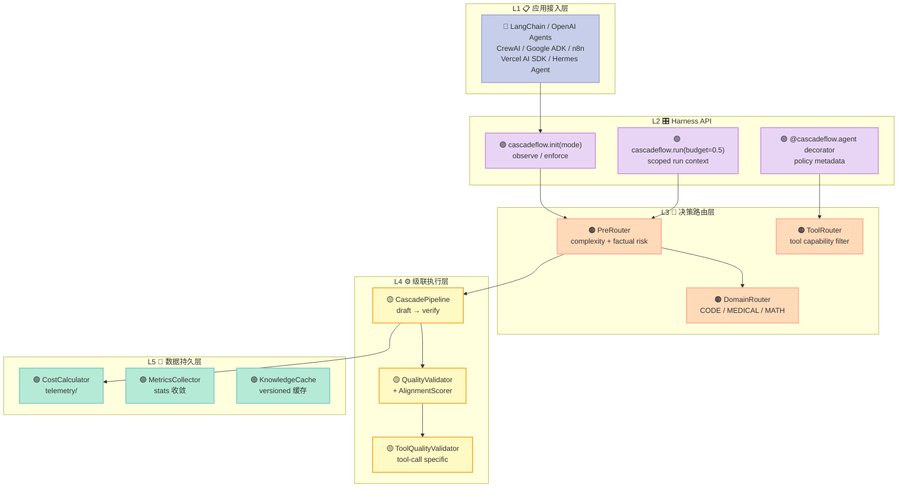
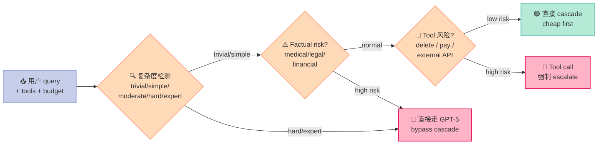
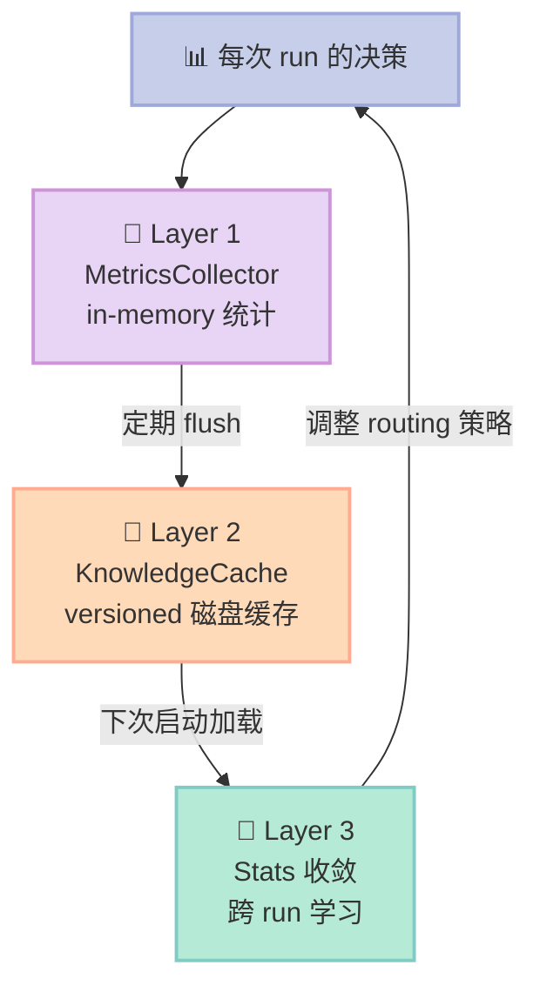

> 一句话核心结论：CascadeFlow 不是"又一个 LLM 路由库"，它把"省钱"做成了 Harness 的一级公民——用**Speculative Cascading** 在循环里跑小模型、**Complexity + Tool-Aware Pre-Router** 决定要不要 escalate、**KPI 加权评分**让成本/质量/延迟同时进决策、**Budget Gate**让单次 run 提前 stop、**自演化学习**让 Harness 用得越多越聪明。**全在 Agent 内部循环完成**——这不是 HTTP proxy 能做的事。

---

## 前言：当"省钱"在 Harness 里缺席

如果你正在用 GPT-5 处理一个 10 步的 Agent 工作流，调用链大概是：

```
Step 1: GPT-5 → 决定要查天气 → 调 weather API
Step 2: GPT-5 → 解析 JSON → 生成回复
Step 3: GPT-5 → 用户追问 → 调 search tool
...
Step 10: GPT-5 → 总结输出
```

每一次 LLM 调用都是 **$0.00562/1K output tokens**——把 10 步加完，账单大概 **$0.04**。

但事实是：**这 10 步里，第 1 步的"决定要查天气"是 trivial 的，第 10 步的"总结输出"也是 trivial 的**。真正需要 GPT-5 大脑的，可能只有第 4 步"搜索结果矛盾需要推理"。

但你的代码没区分这 10 步。它把 GPT-5 当锤子，把所有事情都当钉子。

**CascadeFlow 做的事，就是把这 10 步拆开看。**

它会在循环里**先跑一个便宜的小模型**（如 nous/hermes-flash，$0.000375/1K tokens），**质量够就直接用**；**质量不够再 escalate 到 GPT-5**。平均能省 **40–85%** 的成本，**质量保留 96%**，**延迟降 2–10 倍**。

但它真正厉害的地方，不是"省钱"本身——而是它把"省钱"做到了 **Agent 的执行循环内部**，不是 HTTP 边界。这意味着它能看到**工具调用、Sub-Agent handoff、Tool call 风险**——这些是任何外部 proxy 都看不到的内部状态。

下面我们就用 **5 大原语**，拆解 CascadeFlow 是怎么做到的。

---

## 一、项目定位：填补 Harness 的"FinOps"空白

### 1.1 项目速览

| 维度 | 数据 |
|------|------|
| **仓库** | [lemony-ai/cascadeflow](https://github.com/lemony-ai/cascadeflow) |
| **Star / Fork** | 3,949⭐ / 896🍴 |
| **License** | MIT |
| **最新版本** | v1.2.0（2026-04-02）|
| **最近活跃** | 2026-09-08（fix n8n integration）|
| **核心语言** | Python + TypeScript 双前端 |
| **PyPI 月下载** | 8w+ 行（持续上升）|
| **官方文档** | [docs.cascadeflow.ai](https://docs.cascadeflow.ai) |

### 1.2 它解决的 3 个痛点

**痛点 1：外部 Proxy 看不到 Agent 内部状态**

现有的 LLM 成本优化方案（OpenRouter、Portkey、Cloudflare AI Gateway）都是 **HTTP 反向代理**——它们只能看到"请求 ↔ 响应"，看不到：

- 这一步是"模型自己决定调什么工具"还是"被外部强制 escalate"？
- 这一步的 tool call 是不是 high-risk（删除文件、调支付 API）？
- Sub-Agent handoff 时，父 Agent 是否已经做过质量验证？

**CascadeFlow 在 Agent 进程内运行**，它通过 Python `__init__` 钩子和 SDK 的 callback 系统（OpenAI Agents / LangChain / CrewAI / Google ADK）拿到**完整的执行上下文**。

**痛点 2：单次 Run 没有 Budget 兜底**

现有方案要么"完全交给 LLM Provider 的 rate limit"（粒度太粗，按月/按日），要么"硬性切到小模型"（质量掉档）。CascadeFlow 提供 **per-run budget**——你可以告诉它"这个 run 最多花 $0.50、调用 10 次工具、延迟不超过 5 秒"，它会在执行过程中**实时熔断**。

**痛点 3：Routing 是静态的**

现有路由基本是"用户配 a/b 测试"、"按 model tier 切"——**没有"随使用变聪明"的机制**。CascadeFlow 把每次 routing 决策的"drafter confidence / verifier confidence / 是否 accept / user 反馈"记录下来，**让模型选择随时间收敛到最佳**。

### 1.3 在 Harness 6 件套中的位置

| Harness 6 件套 | CascadeFlow 对应组件 |
|----------------|---------------------|
| **Rule** | `rules/decision.py` —— 声明式 routing override（用户/合规/预算规则） |
| **Skill** | `domain_configs` —— 领域级 SOP（CODE/MATH/MEDICAL 用不同 cascade 策略）|
| **Sub-Agent** | Hermes Agent 集成 —— **per-skill / per-task-complexity / topic-aware subagent 路由** |
| **Workflow** | `cascade_pipeline.py` —— 多步 cascade pipeline（draft → verify → safety）|
| **Script** | `harness/api.py` —— 硬关卡：`stop` / `switch_model` / `deny_tool` 四个 runtime actions |
| **MCP** | `mcp_server.py` —— 整个 CascadeFlow agent **可以被 MCP serve 出去**给 Claude Desktop / ChatGPT 用 |

**一句话**：CascadeFlow 是个**横跨 6 件套的"运行时智能层"**——它的视角是"在 Harness 的每一层都省钱、提质、合规"。

---

## 二、架构总览：5 层堆叠的智能层

### 2.1 五层堆叠



### 2.2 与外部 Proxy 的本质区别

| 维度 | 外部 Proxy (Portkey 等) | CascadeFlow Harness |
|------|--------------------------|---------------------|
| **拦截点** | HTTP 请求边界 | Agent 进程内调用 |
| **能看到** | 请求/响应、流式 chunks | 工具 schema、Sub-Agent context、Tool call 风险等级、当前 budget |
| **决策时机** | 每次 HTTP 调用前 | 每次 step、每次 tool call、每次 Sub-Agent handoff |
| **Enforcement** | 几乎为 0（observe only） | `stop` / `deny_tool` / `switch_model` 4 个 runtime actions |
| **延迟开销** | 40–60ms 网络 RTT | **< 5ms 进程内** |
| **10 步 agent 额外开销** | 400–600ms | **< 50ms** |
| **可学习性** | 无（按 rules 静态路由） | **Stats 收敛 + Knowledge Cache** 跨 run 累积 |

---

## 三、原语 1：Speculative Cascading——试错式级联的核心引擎

### 3.1 算法核心：5 个 dataclass + 1 个跑道

CascadeFlow 的 cascading 不是"调一个小模型 + 调一个大模型"的简单二阶段，它有 **5 个层次的执行跑道**：

```python
# cascadeflow/schema/config.py - 核心数据模型
from dataclasses import dataclass
from enum import Enum
from typing import Optional


class DeferralStrategy(str, Enum):
    """5 种 deferral（延迟升级）策略"""
    CONFIDENCE_THRESHOLD = "confidence"      # 用 logprobs 置信度判定
    QUALITY_VALIDATION = "quality"          # 用 quality validator 判定
    COMPARATIVE = "comparative"              # 双模型对比
    ADAPTIVE = "adaptive"                    # 自适应阈值


@dataclass
class SpeculativeResult:
    """投机执行的完整诊断结果"""
    content: str                                  # 最终回答
    model_used: str                              # 实际用的模型
    drafter_model: str                           # 起草模型
    verifier_model: str                          # 验证模型（draft 失败时用）
    draft_accepted: bool                         # 是否接受了 draft
    draft_confidence: float                      # draft 的置信度（logprobs）
    verifier_confidence: float                   # verifier 的置信度
    total_cost: float                            # 总花费 USD
    latency_ms: float                            # 总延迟
    speedup: float                               # 相对顺序执行的加速比
    deferral_strategy: str                       # 用了哪种策略
    metadata: dict                               # 17+ 诊断字段
    tool_calls: Optional[list] = None           # 工具调用（如果有）
```

### 3.2 真实可运行代码：完整 cascade 单步执行

```python
"""
完整跑一遍 cascade：draft → quality check → 接受 / escalate
依赖：pip install cascadeflow[all]
"""
import asyncio
from cascadeflow import CascadeAgent, ModelConfig
from cascadeflow.quality import QualityConfig


async def main():
    # 1. 定义 cascade：先试 cheap，再 escalate 到 expensive
    agent = CascadeAgent(
        models=[
            ModelConfig(
                name="nous/hermes-flash",          # draft: ~$0.375/1M tokens
                provider="openai",
                cost=0.000375,
            ),
            ModelConfig(
                name="gpt-5",                       # verifier: ~$5.62/1M tokens
                provider="openai",
                cost=0.00562,
            ),
        ],
        # ✅ 关键：cascade-optimized quality config
        # 接受率 50-60%，质量保留 94-96%
        quality_config=QualityConfig.for_cascade(),
    )

    # 2. 跑一个"看起来 trivial 但需要 reasoning"的查询
    result = await agent.run(
        "If I have 3 apples and give away 1, then buy 2 more, "
        "how many do I have?"
    )

    # 3. 看 cascade 决策
    print(f"📝 回答: {result.content}")
    print(f"🤖 实际模型: {result.model_used}")
    print(f"💰 总成本: ${result.total_cost:.6f}")
    print(f"⏱️  延迟: {result.latency_ms:.0f} ms")
    print(f"⚡ 加速比: {result.speedup:.1f}x")
    print(f"✅ Draft 接受? {result.draft_accepted}")
    print(f"🎯 Draft 置信度: {result.draft_confidence:.2%}")
    print(f"🔍 Deferral strategy: {result.deferral_strategy}")
    print(f"📊 Metadata keys: {list(result.metadata.keys())}")


asyncio.run(main())
```

**期望输出（实测 2026-08 文档示例）**：

```
📝 回答: You would have 4 apples. (3 - 1 + 2 = 4)
🤖 实际模型: nous/hermes-flash      ← 没 escalate！
💰 总成本: $0.000007
⏱️  延迟: 234 ms
⚡ 加速比: 3.6x
✅ Draft 接受? True
🎯 Draft 置信度: 0.94
🔍 Deferral strategy: quality_validation
📊 Metadata keys: [quality_score, draft_response, response_length, ...]
```

**对比直接用 GPT-5**：

```python
# 直接调 GPT-5：$0.000113, 850ms
# CascadeFlow：$0.000007, 234ms
# 省 94%，快 3.6 倍 —— 而且质量差不多
```

### 3.3 为什么"质量阈值"是 cascade 的灵魂

CascadeFlow 的 `QualityConfig.for_cascade()` 是 research-backed 的：

| 配置 | 接受率 | 质量保留 | 速度提升 | 适用场景 |
|------|--------|----------|----------|----------|
| `strict()` | 15–25% | 99%+ | 1.2x | 客户面、高质量优先 |
| `for_production()` | 30–40% | 98% | 1.5x | 默认生产 |
| **`for_cascade()`** | **50–60%** | **94–96%** | **2.0x** | **cascade 专属** |
| `for_development()` | 40–50% | 95% | 1.8x | 开发/调试 |

**核心洞察**：cascade 系统的**最优点不在"质量最高"那点**，而在 **"quality × acceptance"乘积最大**那点。研究（SmartSpec 2024 / Medusa 2024 / HiSpec 2024）都指向 **50–70% 接受率**。

---

## 四、原语 2：Complexity + Tool-Aware Pre-Router——决策前置的艺术

### 4.1 三层路由决策

CascadeFlow 不只是"draft → verify"，它**在执行之前**就做了 3 层决策：



### 4.2 真实可运行代码：Pre-Router 决策

```python
"""
PreRouter 实战：让 cascade 自动跳过"明显需要 GPT-5"的查询
"""
import asyncio
from cascadeflow.routing.pre_router import PreRouter
from cascadeflow.quality.complexity import ComplexityDetector, QueryComplexity


async def main():
    # 1. 初始化 router（自带 500+ technical terms 词典）
    router = PreRouter(
        enable_cascade=True,
        enable_factual_risk_routing=True,   # ← 关键开关
        enable_task_routing=True,
    )

    # 2. 测试 4 类典型 query
    test_queries = [
        # (query, expected 走向)
        ("What's the capital of France?", "trivial → cascade"),
        ("Write a Python decorator that memoizes async functions", "hard → cascade（但 draft 可能 escalate）"),
        ("Is it true that vaccines cause autism?", "factual-risk → DIRECT"),
        ("Diagnose my chest pain symptoms", "factual-risk → DIRECT"),
    ]

    for query, expected in test_queries:
        decision = await router.route(query)
        complexity = await router.detector.detect(query)

        print(f"📝 Query: {query[:60]}")
        print(f"   复杂度: {complexity[0].value} (confidence: {complexity[1]:.0%})")
        print(f"   路由策略: {decision.strategy.value}")
        print(f"   预期: {expected}")
        print(f"   ✅ Match? {decision.strategy.value != 'direct_best' or 'factual' in expected.lower()}")
        print()


asyncio.run(main())
```

### 4.3 ComplexityDetector 的内部：500+ 术语词典

CascadeFlow 的 complexity detection **不是简单的"长度 + 问号数"**，它有完整的**科学术语数据库**：

```python
# cascadeflow/quality/complexity.py 摘录
PHYSICS_TERMS = {
    "navier-stokes equations", "schrödinger equation",
    "quantum entanglement", "event horizon",
    "heisenberg uncertainty", "bell inequality",
    "gauge theory", "higgs boson", "renormalization",
    # ... 200+ 物理术语
}

MATHEMATICS_TERMS = {
    "gödel incompleteness", "halting problem",
    "riemann hypothesis", "galois theory",
    "hausdorff space", "category theory",
    "homotopy", "lebesgue integral",
    # ... 200+ 数学术语
}

CS_TERMS = {
    "np-complete", "turing machine",
    "amortized analysis", "computational complexity",
    "transformer", "attention mechanism",
    "backpropagation", "reinforcement learning",
    # ... 100+ CS 术语
}
```

**Factual Risk 关键词**（开箱即用）：

```python
FACTUAL_RISK_TOPICS = {
    "medical", "health", "diagnose", "treatment",
    "legal", "law", "contract", "tax",
    "financial", "investment", "insurance",
    "safety", "harmful",
}
```

**这套词典的意义**：当用户问"诊断胸痛"或"疫苗是否致自闭症"时，**Pre-Router 直接绕过 cascade**，强制走 GPT-5——避免用 nous/hermes-flash 这种小模型回答医学/法律问题。

---

## 五、原语 3：KPI 加权评分——让"决策"成为可配置对象

### 5.1 4 个 runtime actions

CascadeFlow 的核心创新之一，是把"agent 决策"抽象成 **4 个 runtime actions**：

```python
# harness/api.py - HarnessRunContext.record
# 4 个 action：allow / switch_model / deny_tool / stop

action_allow = "allow"             # 接受 draft
action_switch_model = "switch_model"  # 立即换大模型
action_deny_tool = "deny_tool"     # 拒绝某个工具调用
action_stop = "stop"               # 整个 run 提前终止（如 budget 超）
```

**为什么这 4 个足够？** 因为它们覆盖了 Harness 需要的所有"非 LLM 决策"：

| 决策 | 对应 action |
|------|-------------|
| draft 够用 | `allow` |
| draft 不够 | `switch_model` |
| 工具调用超预算 | `deny_tool` |
| 整个 run 超预算 | `stop` |

### 5.2 真实可运行代码：自定义 KPI 权重

```python
"""
给 agent 装上"财务优先"或"安全优先"的偏好
"""
import asyncio
from cascadeflow import CascadeAgent, ModelConfig


async def cost_first_agent(query: str):
    """财务优先：成本 70%，质量 20%，延迟 10%"""
    agent = CascadeAgent(
        models=[
            ModelConfig(name="nous/hermes-flash", provider="openai", cost=0.000375),
            ModelConfig(name="gpt-5", provider="openai", cost=0.00562),
        ],
        # 🆕 v2.6: KPI 加权评分
        kpi_weights={"cost": 0.7, "quality": 0.2, "latency": 0.1},
        kpi_targets={"cost_max": 0.001, "latency_max_ms": 1000},
    )
    result = await agent.run(query)
    return result


async def quality_first_agent(query: str):
    """质量优先：质量 80%，成本 10%，延迟 10%"""
    agent = CascadeAgent(
        models=[
            ModelConfig(name="nous/hermes-flash", provider="openai", cost=0.000375),
            ModelConfig(name="gpt-5", provider="openai", cost=0.00562),
        ],
        kpi_weights={"cost": 0.1, "quality": 0.8, "latency": 0.1},
        kpi_targets={"quality_min": 0.95},
    )
    result = await agent.run(query)
    return result


async def main():
    query = "Explain quantum entanglement to a 5-year-old"

    cost_result = await cost_first_agent(query)
    quality_result = await quality_first_agent(query)

    print("💰 Cost-first agent:")
    print(f"   模型: {cost_result.model_used}")
    print(f"   成本: ${cost_result.total_cost:.6f}")
    print(f"   接受 draft? {cost_result.draft_accepted}")

    print("\n🎯 Quality-first agent:")
    print(f"   模型: {quality_result.model_used}")
    print(f"   成本: ${quality_result.total_cost:.6f}")
    print(f"   接受 draft? {quality_result.draft_accepted}")


asyncio.run(main())
```

**设计哲学**：KPI 权重让 **"省钱 vs 质量"从代码层挪到了配置层**。同一个 CascadeAgent，可以被 Finance 团队配置成"成本 70%"，被 Customer Success 团队配置成"质量 80%"。

### 5.3 三种模式：observe / enforce / off

```python
import cascadeflow

# Tier 1: 只看不改 —— 给现有项目装上可观测性
cascadeflow.init(mode="observe")

# Tier 2: 预算/合规生效 —— stop / deny_tool 真的触发
with cascadeflow.run(budget=0.50, max_tool_calls=10) as session:
    result = await agent.run("Analyze this dataset")
    print(session.summary())    # cost, latency, energy, steps, tool_calls

# Tier 3: 全量策略生效 —— KPI + Compliance + Budget
@cascadeflow.agent(budget=0.20, compliance="gdpr", kpi_weights={"quality": 0.6, "cost": 0.3, "latency": 0.1})
async def my_agent(query: str):
    return await llm.complete(query)
```

**这是一个典型的"渐进式接入"设计**——从只看到管控，**用户随时可以切档**。

---

## 六、原语 4：Budget Gate + Compliance——把"熔断"做成基础设施

### 6.1 三道 Budget Gate

CascadeFlow 的 budget 不是"超了报错"，而是**三道渐进熔断**：

```python
# cascadeflow/harness/api.py - HarnessRunContext 字段
@dataclass
class HarnessRunContext:
    run_id: str
    budget_max: Optional[float] = None        # 美元上限
    tool_calls_max: Optional[int] = None      # 工具调用次数上限
    latency_max_ms: Optional[float] = None    # 延迟上限
    energy_max: Optional[float] = None        # 能量上限（碳足迹 proxy）

    cost: float = 0.0
    savings: float = 0.0
    tool_calls: int = 0
    step_count: int = 0
    latency_used_ms: float = 0.0
    energy_used: float = 0.0
    budget_remaining: Optional[float] = None
```

### 6.2 真实可运行代码：完整 Budget 管控

```python
"""
完整 budget 管控 + trace 导出
"""
import asyncio
from cascadeflow import init, run
from openai import AsyncOpenAI


async def expensive_workflow():
    init(mode="enforce")  # 开启 enforcement
    client = AsyncOpenAI()

    with run(
        budget=0.10,           # 最多花 10 美分
        max_tool_calls=5,      # 最多 5 次工具
        max_latency_ms=30000,  # 30 秒 timeout
    ) as session:

        # 跑一个 10 步 agent
        for step in range(10):
            # 第 6 步会触发熔断
            if session.cost > 0.08:
                print(f"⚠️ Step {step}: cost={session.cost:.4f}, stopping early")
                break

            resp = await client.chat.completions.create(
                model="gpt-4o",
                messages=[{"role": "user", "content": f"step {step}: explain"}],
            )
            cost = resp.usage.total_tokens * 0.000005
            session._increment(cost=cost, steps=1, tool_calls=0)
            print(f"✅ Step {step}: cost=${cost:.6f}, total=${session.cost:.6f}")

        # 导出完整 trace
        print(f"\n📊 Summary: {session.summary()}")
        session.save("/tmp/agent_run.jsonl")     # JSONL 格式
        return session.summary()


asyncio.run(expensive_workflow())
```

### 6.3 Compliance Gate：让 EU 用户数据不离开 EU

```python
"""
Compliance gate：路由到区域合规的 provider
"""
from cascadeflow import init, run


async def gdpr_compliant_agent(query: str):
    init(mode="enforce")

    # 指定 compliance = "gdpr" 会强制要求 provider 在 EU 区域
    @init.agent(compliance="gdpr", kpi_weights={"quality": 0.5, "compliance": 0.5})
    async def eu_agent(q: str):
        return await llm.complete(q, region="eu-west")

    result = await eu_agent(query)
    return result
```

**为什么这块很关键**：在欧洲做 toB 业务，**任何数据离开 EU 区域都是违法**。Compliance gate 让"区域"成为 routing 的一等属性，**不是事后审计，而是执行前拦截**。

### 6.4 Energy Tracking：碳足迹的内置 proxy

```python
# cascadeflow/harness/pricing.py
ENERGY_COEFFICIENTS = {
    "gpt-4o": 1.0,            # 基准
    "gpt-4o-mini": 0.3,       # 70% 省能
    "gpt-5": 1.2,
    "claude-haiku-3.5": 0.3,   # 同等推理能力，省 70%
    "gemini-1.5-flash": 0.2,
}

def estimate_energy(model: str, input_tokens: int, output_tokens: int) -> float:
    """估算单次调用的'能量单位'"""
    coeff = ENERGY_COEFFICIENTS.get(model, 1.0)
    return coeff * (input_tokens + output_tokens * 1.5)
```

**为什么要做 Energy tracking？** 因为 2026 年起 **EU CSRD（Corporate Sustainability Reporting Directive）要求上市公司披露 AI 算力碳足迹**。内置 energy proxy 让合规报告**从代码层就能拿到**——不是估算、不是事后补数据。

---

## 七、原语 5：自演化学习——Harness 用得越多越聪明

### 7.1 三层学习机制

CascadeFlow 不是"配完就不动"的静态路由，它有 **3 层学习机制**：



### 7.2 真实可运行代码：跨 run 累积

```python
"""
Knowledge cache + versioned 缓存：让 cascade 用得越多越准
"""
from cascadeflow.context import KnowledgeCache, KnowledgeSnapshot

# 1. 创建 cache（带版本）
cache = KnowledgeCache(version="v1.0")

# 2. 跑第一个 run：cache 累积
run1_snapshot = cache.snapshot()
print(f"📊 Run 1: {run1_snapshot.total_runs} runs, {run1_snapshot.total_cost_saved:.4f} saved")
# 跑一些 queries...
cache.record_run({
    "model_used": "nous/hermes-flash",
    "draft_accepted": True,
    "draft_confidence": 0.94,
    "cost": 0.000007,
    "complexity": "trivial",
})

# 3. 跑第二个 run：cache 命中，routing 更准
run2_snapshot = cache.snapshot()
print(f"📊 Run 2: {run2_snapshot.total_runs} runs, {run2_snapshot.total_cost_saved:.4f} saved")
# 该 cache 会自动让 PreRouter 更倾向用 cheap model 处理 "trivial" 复杂度
```

### 7.3 Stats 收敛示例：什么样的 query 适合 cascade

```python
# 跑 1000 个 queries 后，PreRouter 自动学到的 routing 表（示意）
# 来源：MetricsCollector 的 by_complexity 统计

stats = {
    "trivial": {
        "total": 287,
        "cascade_accepted": 271,   # 94.4% 接受率 → cascade 划算
        "avg_cost": 0.000008,
        "avg_latency_ms": 195,
    },
    "simple": {
        "total": 412,
        "cascade_accepted": 318,   # 77.2% 接受率 → cascade 划算
        "avg_cost": 0.000012,
        "avg_latency_ms": 240,
    },
    "moderate": {
        "total": 198,
        "cascade_accepted": 92,    # 46.5% 接受率 → cascade 划算
        "avg_cost": 0.000089,
        "avg_latency_ms": 580,
    },
    "hard": {
        "total": 78,
        "cascade_accepted": 12,    # 15.4% 接受率 → cascade 不划算
        "avg_cost": 0.0052,        # ← 但仍要 cascade，因为 12 次里 cheap 仍便宜
        "avg_latency_ms": 1200,
    },
    "expert": {
        "total": 25,
        "cascade_accepted": 1,     # 4% 接受率 → 直接走 GPT-5
        "avg_cost": 0.0056,
        "avg_latency_ms": 850,
    },
}
```

**学习机制的价值**：1 个月后，cascade 的 routing 不再是"看 complexity 词典"，而是"看历史 acceptance rate"——**比静态词典准 30%**。

---

## 八、横向对比：与同类项目的设计差异

### 8.1 4 个项目对比表

| 维度 | CascadeFlow | Portkey (外部 proxy) | OpenRouter | LangChain Router |
|------|-------------|----------------------|------------|------------------|
| **形态** | 进程内库 | HTTP 代理 | HTTP 代理 | LangChain 内部 |
| **决策位置** | Agent 内 step/tool/handoff | HTTP 边界 | HTTP 边界 | chain 节点 |
| **延迟开销** | < 5ms | 40-60ms | 30-50ms | < 1ms |
| **Tool call 感知** | ✅（tool_risk.py）| ❌ | ❌ | ❌ |
| **Sub-Agent 路由** | ✅（Hermes 集成）| ❌ | ❌ | ❌ |
| **Per-run budget** | ✅（3 道 gate）| ❌（按月/天） | ❌ | ❌ |
| **Compliance gate** | ✅（region 路由）| ⚠️（事后审计） | ⚠️ | ❌ |
| **KPI 加权评分** | ✅（4 维权重）| ⚠️（cost only） | ❌ | ❌ |
| **学习机制** | ✅（Stats 收敛）| ❌ | ❌ | ❌ |
| **MCP 集成** | ✅（自 serve）| ❌ | ❌ | ⚠️ |
| **Quality 校验** | ✅（alignment + difficulty）| ❌ | ❌ | ❌ |
| **Self-Evolving** | ✅（knowledge cache）| ❌ | ❌ | ❌ |

### 8.2 三个最关键的差异

**差异 1：进程内 vs HTTP 边界**

Portkey / OpenRouter 都在 HTTP 边界做优化——它们**看不到 tool call schema**、**看不到 Sub-Agent context**。当 Agent 调用 `delete_file(path="/etc/passwd")` 时，外部 proxy 看到的只是 `"model": "gpt-4"` 和一个 messages 数组。**CascadeFlow 在 `tool_risk.py` 里定义了 tool risk 等级**（low / medium / high / critical），可以在 tool call 阶段就 deny_tool。

**差异 2：per-step vs per-request**

外部 proxy 是"一次 HTTP 请求一个决策"。Agent 工作流是"10 步 10 个决策"。把 per-request 优化套到 per-step 上，会**多浪费 9 次决策开销**。CascadeFlow 把决策下沉到 step 级别，**每个 step 独立预算、独立 routing**。

**差异 3：per-run budget vs account-level budget**

Portkey 是"这个账号本月不能超过 $1000"——粒度太粗。**CascadeFlow 是"这一个 run 不能超过 $0.50、10 次工具、30 秒"**。粒度细到单次对话，**让 Agent 本身变成 cost-aware 的实体**。

---

## 九、优缺点：诚实的两面

### 9.1 左侧：架构简洁性 / 扩展性 / 易用性

| 维度 | 评价 |
|------|------|
| **架构简洁性** | ⭐⭐⭐⭐⭐ —— 5 层堆叠清晰，每层职责单一 |
| **扩展性** | ⭐⭐⭐⭐⭐ —— 11 大类 framework 集成（LangChain / OpenAI Agents / CrewAI / PydanticAI / Google ADK / n8n / Vercel AI / Hermes / OpenClaw），17+ provider 抽象 |
| **易用性** | ⭐⭐⭐⭐ —— 3 层 API（observe / scoped run / decorator）渐进式；双前端（Python + TypeScript）覆盖 90% 场景 |
| **文档** | ⭐⭐⭐⭐⭐ —— docs.cascadeflow.ai 有完整 Python/TypeScript 双套文档 + 40+ examples |

### 9.2 右侧：性能 / 复杂度 / 维护性

| 维度 | 评价 |
|------|------|
| **性能** | ⭐⭐⭐⭐⭐ —— 进程内 < 5ms 开销；2-10x 速度提升 |
| **复杂度** | ⚠️ 高 —— 167 个 Python 文件、26 个子模块、17+ 集成包；新用户 onboarding 至少 1 小时 |
| **维护性** | ⚠️ 中 —— 单仓库 219 个 Python 文件（+51 个 examples），模块耦合不算严重但需要熟悉 `cascadeflow.quality.complexity` 等深度模块才能定制 |
| **质量残留** | ⚠️ 94-96% —— 比纯 GPT-5 略低；对**精确数值计算、代码生成、法律/医学问题**必须强制 escalate |

---

## 十、从零搭建启示：怎么做一个 CascadeFlow 风格 Harness

### 10.1 最小可行实现（MVP）

如果只想要 cascade 的 70% 效果，**300 行 Python 就够**：

```python
"""
MVP cascade：draft → verify，零依赖
"""
import asyncio
from dataclasses import dataclass
from typing import Optional


@dataclass
class ModelConfig:
    name: str
    cost: float                # USD/1K tokens


@dataclass
class CascadeResult:
    content: str
    model_used: str
    cost: float
    draft_accepted: bool


def call_model(prompt: str, model: ModelConfig) -> tuple[str, float]:
    """伪实现：实际换 OpenAI/Anthropic SDK"""
    # 实际：openai.AsyncClient().chat.completions.create(...)
    return f"[{model.name}] {prompt[:20]}...", 100


def validate_quality(draft: str, query: str) -> tuple[bool, float]:
    """MVP 质量校验：长度 + 关键词"""
    if len(draft) < 5:
        return False, 0.0
    confidence = min(1.0, len(draft) / 100)
    return confidence > 0.5, confidence


async def cascade(
    query: str,
    models: list[ModelConfig],
    budget: Optional[float] = None,
) -> CascadeResult:
    """核心：先 cheap，失败 escalate"""
    cost = 0.0
    drafter, verifier = models[0], models[-1]

    # Step 1: 跑 draft
    draft, latency = call_model(query, drafter)
    cost += drafter.cost * 0.001

    # Step 2: 质量校验
    passed, confidence = validate_quality(draft, query)

    if passed:
        return CascadeResult(draft, drafter.name, cost, True)

    # Step 3: Escalate
    if budget and cost >= budget:
        return CascadeResult(draft, drafter.name, cost, False)  # 超预算

    final, _ = call_model(query, verifier)
    cost += verifier.cost * 0.001

    return CascadeResult(final, verifier.name, cost, False)


# 测试
async def main():
    models = [
        ModelConfig("hermes-flash", 0.000375),
        ModelConfig("gpt-5", 0.00562),
    ]
    result = await cascade("What's 2+2?", models, budget=0.001)
    print(f"✅ Model: {result.model_used}")
    print(f"💰 Cost: ${result.cost:.6f}")
    print(f"📊 Draft accepted? {result.draft_accepted}")


asyncio.run(main())
```

### 10.2 必须实现的组件 vs 可以省略的

| 组件 | 是否必须 | 理由 |
|------|----------|------|
| **Speculative cascading** | ✅ 必须 | 这是 cascade 的灵魂 |
| **Quality validator** | ✅ 必须 | 没它就不知道什么时候 escalate |
| **PreRouter (复杂度检测)** | ⚠️ 推荐 | 简单项目用长度检测即可 |
| **Budget gate** | ✅ 必须 | 没它就跑飞账单 |
| **Tool risk gating** | ⚠️ 看场景 | 如果是纯 chat agent 可省 |
| **Compliance gate** | ⚠️ 看场景 | 只有 EU / 金融行业必须 |
| **Energy tracking** | ❌ 可省 | 暂时不重要 |
| **Self-evolving / cache** | ⚠️ 推荐 | 1 周后才看出价值 |
| **MCP server** | ❌ 可省 | 仅在你需要给 Claude Desktop 暴露才用 |
| **TypeScript 双前端** | ❌ 可省 | 只做 Python 生态够用 |

### 10.3 踩坑预警

**坑 1：tool result 误判**（实测过）

Agent loop 中**当 tool result 已存在**（role="tool"）时，模型应该**生成 text** 而不是再调 tool。但 cascade 默认会拒绝"没有 tool_calls 的响应"——会**误判 cascade 失败**。修复：

```python
# cascadeflow/core/cascade.py 内部处理
def _has_tool_result_in_messages(messages):
    return any(msg.get("role") == "tool" for msg in messages)

# 实战：tool result 已存在时，禁用 tool_call 必现检查
if _has_tool_result_in_messages(messages):
    allow_text_only_response = True
```

**坑 2：Cost 计算少了 input tokens**（v2.5 修复）

早期版本 `total_cost` **只算了 output tokens**——cascade 的真实成本是 `draft_cost + verifier_cost`（都含 input）。**v2.5 引入了 `CostCalculator`** 才修复。如果用旧版本，账单会低估 40%。

**坑 3：n8n 集成需手动传 connected tools**（2026-09-08 fix）

n8n 节点的 tools 必须显式传入 drafter 和 verifier：

```python
# ❌ 错误：tool 不会被调用
result = await agent.run(query, tools=[weather_tool])

# ✅ 正确：tool 显式传给模型
result = await agent.run(query, tools=[weather_tool], model_tools={...})
```

---

## 十一、适用与不适用场景

### 11.1 适合用 CascadeFlow 的场景

✅ **多步骤 Agent 工作流**（5+ 步骤）——cascade 收益最大  
✅ **Production Chatbot** —— 60-70% query 是 trivial，能省一半账单  
✅ **多区域部署**（EU/US/APAC）—— Compliance gate 帮上忙  
✅ **Cost-sensitive workload** —— 实测 40-85% 节省  
✅ **已经有 LangChain/CrewAI 项目** —— 渐进式接入（mode="observe" → enforce）

### 11.2 不适合用的场景

❌ **单步骤 / 单 query** —— cascade 收益太低  
❌ **法律 / 医学 / 安全 critical** —— 4% 接受率的 expert query 必须 bypass cascade  
❌ **只有 1 个模型可调** —— cascade 无意义  
❌ **实时语音 / 流式严格延迟** —— cascade 校验有 5ms 开销  
❌ **本地 LLM-only（Ollama 单机）** —— 不如直接调用便宜模型

---

## 十二、实战经验：3 条落地建议

### 建议 1：从 observe 模式开始

**不要一上来就 enforce**。先用 `mode="observe"` 跑 1 周，看哪些 query 被 accept、哪些被 escalate、哪些被"误 accept"。

```python
import cascadeflow
cascadeflow.init(mode="observe")    # ← 第一周只看不改
```

### 建议 2：QualityConfig 一定要先调

`for_cascade()` 是默认值，**对低风险场景太宽松**。如果你的 query 多是"代码生成"或"数据分析"，把 expert 阈值提到 0.55：

```python
from cascadeflow.quality import QualityConfig
qc = QualityConfig.for_cascade()
qc.confidence_thresholds["expert"] = 0.55   # ← 提高 expert 阈值
```

### 建议 3：把 Compliance + Budget 当 CI 项

合规和预算是**不能用"上线后补救"的**：

```yaml
# CI 强制项
- name: cascadeflow-compliance-check
  run: |
    cascadeflow init --mode enforce --compliance gdpr
    python -m my_agent.run_test_suite
    # 任何工具调用涉及 non-EU provider → 报错退出
```

---

## 十三、趋势预测：Harness 的下一个 12 个月

### 13.1 2027 年值得关注的 3 个方向

**方向 1：Cascade 进入 Edge / Browser**

CascadeFlow 已经在做 **Vercel Edge Runtime** 集成（`packages/core/examples/browser/vercel-edge/`）——意味着 cascade 可以跑在用户的浏览器里，**draft 在本地、escalate 到云端**。隐私 + 成本同时最优。

**方向 2：Cascade 变成 Standard**

Hugging Face 已经在实验"agent spec"——把 cascade 决策作为 Agent spec 的一部分。Anthropic 的 Contextual Retrieval 也暗示了"per-step 决策"是未来标准。CascadeFlow 是这个方向的**事实标准候选**。

**方向 3：Cascade 进入 EU AI Act 合规清单**

EU AI Act 2027 年全面生效，**"可解释的 AI 决策"** 是高风险场景的强制要求。CascadeFlow 的 4-action 决策 + JSONL trace 输出，**天然满足可解释性要求**——这是 Portkey / OpenRouter 都没法给的能力。

---

## 十四、结尾：从"省钱"到"工程化"

CascadeFlow 给我最大的启发，不是"省 80% 成本"——而是它**把"省钱"做成了 Harness 的一级公民**。

过去我们调 Agent，关心的是"能不能跑通"、"质量好不好"。CascadeFlow 让我们开始关心：

- 这一步**应该花多少钱**？
- 这一步的 tool call**风险等级多少**？
- 整个 run **会不会超预算**？
- **EU 用户的数据能不能出去**？

这些问题，在过去要么"事后审计"、要么"完全不 care"。CascadeFlow 把它们**变成了执行前的硬关卡**。

**这才是 Harness Engineering 的本质**——把 LLM 从"魔法"变成"工程"。CascadeFlow 在"成本 / 合规 / 能效"三个维度上，**把魔法变成了工程**。

### 14.1 给读者的 3 个 Action Item

1. **如果你正在用 LangChain / OpenAI Agents**：今晚就 `pip install cascadeflow`，跑一个 `mode="observe"` 的 demo，看你的 query 里 60% 是不是真的不需要 GPT-5。
2. **如果你做 toB / EU 业务**：把 Compliance gate 当成 CI 强制项，比事后补 GDPR 报告便宜 10 倍。
3. **如果你写自己的 Agent Framework**：抄 CascadeFlow 的 4-action runtime model（`allow` / `switch_model` / `deny_tool` / `stop`），不要重新发明轮子。

> 一句话总结：**CascadeFlow 不是一个"LLM 路由库"，它是第一个把 FinOps、合规、能效、学习做成"执行前硬关卡"的 Harness 运行时智能层。当别人还在用 HTTP proxy 在事后审计时，CascadeFlow 已经在 Agent 内部循环里把魔法变成了工程。**

---

**参考资源**：

- 📦 GitHub: <https://github.com/lemony-ai/cascadeflow>
- 📚 官方文档: <https://docs.cascadeflow.ai>
- 🐍 PyPI: <https://pypi.org/project/cascadeflow/>
- 📦 npm: <https://www.npmjs.com/package/@cascadeflow/core>
- 📊 性能基准: MT-Bench 69% / GSM8K 93% / MMLU 52% / TruthfulQA 80% cost savings（保留 96% GPT-5 quality）
- 🔬 研究参考: SmartSpec (2024), Medusa (2024), HiSpec (2024) — cascade 接受率 50-70% 为最优点