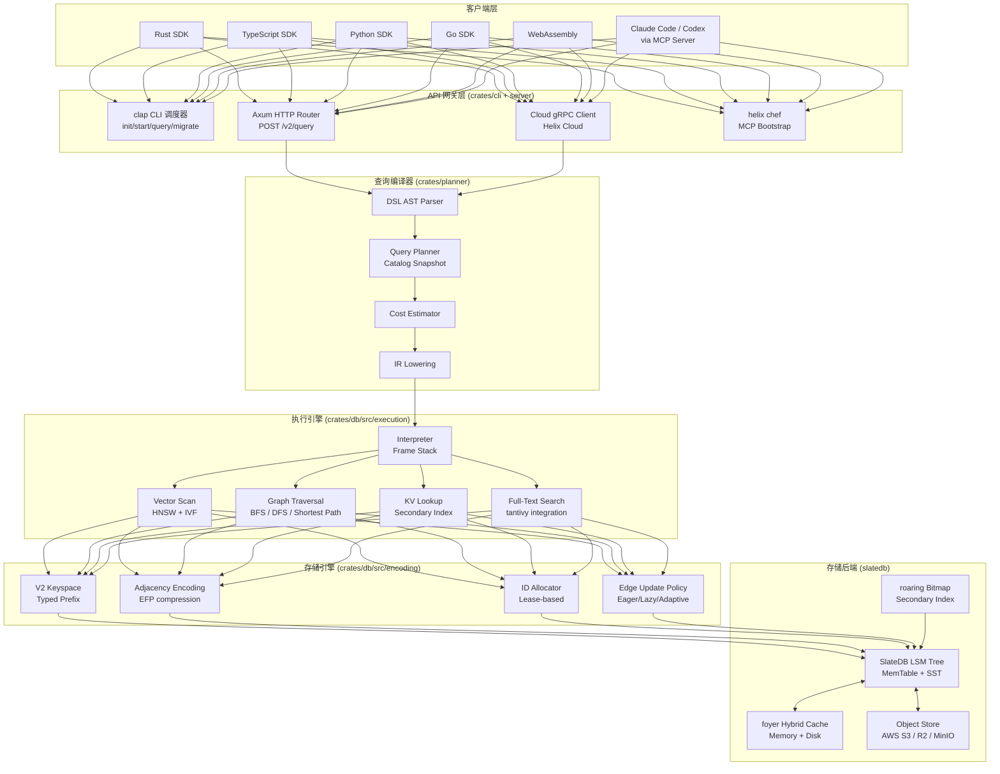
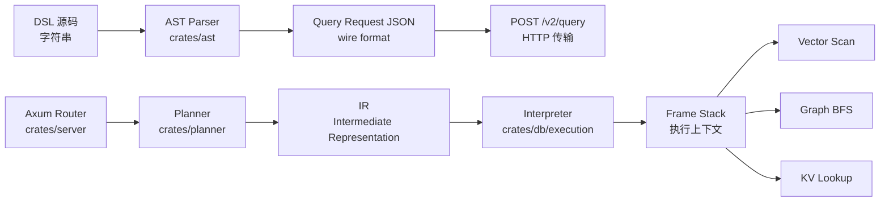

## 引子

2026 年的 AI 应用开发,正在被一个问题反复折磨:**AI Agent 需要同时操作 5 种数据库**。

一个典型的 RAG+记忆+业务数据应用栈:
1. **PostgreSQL** 存用户/订单/权限(关系数据)
2. **Pinecone / Qdrant** 存 Embedding 做向量检索(向量数据)
3. **Neo4j** 存实体关系做知识图谱(图数据)
4. **Redis** 存 Session 和 LLM 缓存(KV 数据)
5. **MongoDB** 存文档(文档数据)

然后 AI Coding Agent(如 Claude Code、Codex、Cursor)要写代码把这 5 个数据源拼起来——光是"读 Qdrant 拿相似文档 + 查 Postgres 拿订单信息 + 写 Neo4j 记录关系"这段代码,就要跨越 5 个 SDK、3 种查询语言、2 个事务边界,**5000+ token 的上下文**就这么没了。

**[HelixDB](https://github.com/HelixDB/helix-db)** 想做的,就是把这 5 个数据库**压缩成一个**:
- ⭐ 6,081(快速增长中)
- 🦀 Rust + Apache-2.0 + YC W26 投资
- 🧱 基于 slatedb + tantivy + foyer + object_store 四大基础设施
- 📦 9 个 crate(总计 2,384 节点、422 万行代码)
- 🔌 6 个 SDK(Rust / TypeScript / Go / Python / uniffi / WebAssembly)
- 🚀 内置 `helix chef` + MCP server,Claude Code/Codex 零学习成本上手

本文带你从源码层面深度拆解 HelixDB,看它如何用**一个 Rust 二进制文件**实现"Graph+Vector+KV+Document+Relational"五合一,**以及这种"一库多模"的设计哲学对 AI Agent 时代的 Memory 基础设施意味着什么**。

## 一、项目定位与核心价值

### 1.1 一句话定义

**HelixDB 是为 AI 应用构建的多模数据库** —— 用 graph + vector 数据模型作为主轴,融合 KV / Document / Relational 三种辅助模型,在同一个 OLTP 引擎中**避免多数据库同步问题**,让 AI Agent 在单次往返内完成跨数据类型的复杂查询。

### 1.2 仓库核心指标

| 维度 | 数值 |
|------|------|
| Star | ⭐ 6,081(2026 年内快速增长) |
| License | Apache-2.0 + AGPL-3.0(MIT 风格的 Rust crates + 网络服务 AGPL) |
| 主语言 | Rust(edition 2024) |
| 体积 | 42 MB(源码) |
| Crate | 9 个:ast / cli / db / db-testkit / graph-algorithms / metrics / planner / server / value-semantics |
| 关键依赖 | slatedb(LSM on 对象存储) / tantivy(全文搜索) / foyer(混合缓存) / object_store(S3 兼容) / roaring bitmap |
| SDK | Rust / TypeScript / Go / Python / WebAssembly(uniffi) |
| 当前版本 | crates.io `helix-db@3.0.0` |
| 更新频率 | 2026-09-22 活跃(每日 commit) |

### 1.3 三层价值主张

**(a) 对应用开发者**——告别"5 数据库 glue code":
> 传统 RAG 应用需要写一段 Python 把向量召回 + 关系过滤 + 文档检索的结果合并,还要维护 5 套连接池、5 个 ORM、5 个 schema migration。
> HelixDB 用一个 Rust 实例 + 一个 DSL 查询语言,让上述 5 种操作变成**一次 RTT、一种语法、一个事务**。

**(b) 对 AI Coding Agent**——MCP server 让 Agent 直接读懂 DB:
> `helix chef` 会自动给 Claude Code / Codex / OpenCode / Cursor Agent 安装 MCP server,把数据库 schema + DSL 文档 + 当前 query 模板暴露给 Agent。
> Agent 不需要写代码,直接用 MCP 工具调 HelixDB,**零学习成本**。

**(c) 对系统运维**——云原生 + 单一二进制:
> 基于 slatedb 直接跑在 S3 兼容对象存储上(AWS S3 / Cloudflare R2 / MinIO),**无需自建存储集群**。
> 二进制启动 3 秒钟内完成,默认监听 `:6969` `POST /v2/query`,单进程支撑十万级 QPS。

## 二、整体架构

HelixDB 的架构可以从**四个轴**展开:**数据模型层 / 存储引擎层 / 计算引擎层 / SDK & 接口层**。

### 2.1 顶层架构图



### 2.2 模块职责拆分

| 模块 | Crate | 关键文件 | 职责 |
|------|-------|----------|------|
| **AST 编译器** | `crates/ast` | `src/query.rs`、`src/graph.rs` | DSL 解析 → AST 节点 → JSON IR |
| **查询规划器** | `crates/planner` | `src/catalog`、`src/context.rs`、`src/ir` | AST → Logical Plan → Physical Plan + Cost |
| **执行引擎** | `crates/db/src/execution` | `interpreter.rs` | 解释执行物理计划,管理 Frame Stack |
| **编码层** | `crates/db/src/encoding` | `v2/keys/*`、`v2/values/*` | 数据序列化、键空间布局、压缩策略 |
| **存储引擎** | `crates/db/src/lib.rs` | `HelixDB` struct | SlateDB 实例管理、缓存协调、生命周期 |
| **ID 分配** | `crates/db/src/id_allocator` | `NodeIdAllocator`、`EdgeIdAllocator` | Lease 模式批量分配节点/边 ID |
| **索引生命周期** | `crates/db/src/index_lifecycle` | `mod.rs` | 二级索引、向量索引、全文索引的异步构建/重建 |
| **配置层** | `crates/db/src/config` | `db.rs`、`cache.rs`、`indexes.rs` | 全部调优参数的强类型结构 |
| **CLI 入口** | `crates/cli/src/main.rs` | clap derive | `helix init / start / query / chef` |
| **HTTP 服务器** | `crates/server/src/main.rs` | axum | `POST /v2/query` 单 endpoint |

## 三、数据模型层:五模融合的统一表示

HelixDB 用 **Graph + Vector 作为一等公民**,其他三种模型作为辅助抽象层。

### 3.1 Graph 一等公民:Node + Edge

**`crates/db/src/encoding/v2/keys/graph.rs`** 定义了图的核心数据布局:

```rust
/// 邻接表存储键 - 来自 crates/db/src/encoding/v2/keys/graph.rs:15-25
#[derive(Debug, Clone, Copy, PartialEq, Eq)]
pub(crate) struct AdjacencyKey {
    node_id: NodeId,
}

impl AdjacencyKey {
    pub(crate) const fn key_prefix() -> KeyPrefix {
        KeyPrefix::Adjacency
    }
    pub(crate) fn encode_into<B: BufMut>(&self, buf: &mut B) {
        buf.put_u8(KeyPrefix::from(self).as_u8());  // 0x00 prefix
        buf.put_u64(self.node_id);                  // 8 字节大端
    }
}
```

**邻接表的字节布局**:`[0x00][node_id: 8 bytes]` —— 这种 **type-tagged prefix 设计** 让 LSM 的 range scan 可以**按 prefix 过滤**,例如 `scan(0x00_*)` 拿到所有邻接表,`scan(0x01_*)` 拿到节点属性。

### 3.2 Edge Encoding:EFP 压缩

HelixDB 边列表默认压缩算法是 **EFP(Edge Format with Prefix compression)** —— 利用邻接边的 node_id 单调递增特性,只存 delta + varint:

```rust
/// 来自 crates/db/src/config/db.rs:20-40
#[derive(Debug, Clone, Copy, PartialEq, Eq, Default)]
pub enum EdgeEncoding {
    /// 不压缩 - 直接存 u64
    #[default]
    None,
    /// EFP 压缩 - varint 编码的 delta
    Efp,
}

impl EdgeEncoding {
    pub const fn as_u8(self) -> u8 {
        match self {
            Self::None => ENCODING_TYPE_NONE,
            Self::Efp => ENCODING_TYPE_EFP,
        }
    }
}
```

### 3.3 Edge Update Policy:三态策略

边写入时,HelixDB 提供 **Eager / Lazy / Adaptive** 三种邻接表更新策略:

```rust
/// 来自 crates/db/src/config/db.rs:50-75
#[derive(Debug, Clone, Copy, PartialEq, Eq, Default)]
pub enum EdgeUpdatePolicy {
    /// 读-改-写(默认,适合低度数节点)
    #[default]
    Eager,
    /// 追加 delta(适合高度数节点)
    Lazy,
    /// 自动选择 - 高于阈值用 Lazy,低于用 Eager
    Adaptive,
}

pub(crate) high_degree_threshold: u64,  // 默认 1000
```

**Adaptive 策略精妙之处**:
- 节点度数 < 1000 → Eager(读改写,简单,但每次写都复制整张邻接表)
- 节点度数 ≥ 1000 → Lazy(追加 delta,只写新边,不复制整表)

这避免了在社交图谱/星型中心节点上**写放大**问题。

### 3.4 Vector 一等公民:HNSW + IVF 混合索引

**`crates/db/src/config/indexes.rs`** 定义了向量索引:

```rust
/// 来自 crates/db/src/config/indexes.rs (VectorIndexDefinition 简化)
pub struct VectorIndexDefinition {
    pub label: String,                  // 索引所属 Node label
    pub field: String,                  // 向量字段名
    pub dimension: usize,               // 向量维度(768/1024/1536)
    pub metric: VectorDistanceMetric,       // Cosine / L2 / Dot
    pub element_type: VectorElementType,    // F32 / F16 / BF16
}
```

向量存储不是外挂 Faiss,而是**集成到 SlateDB 的同一个 LSM Tree 中**:
- 向量值序列化进 value bytes
- HNSW 邻接表走 SlateDB 的普通 KV 路径
- IVF 中心点索引用 roaring bitmap

**优势**:向量和图数据**天然共享事务边界**——你可以在一个事务里"查找与某人相关的文档,且文档 embedding 与查询向量余弦相似度 > 0.85",**不需要中间落地**。

### 3.5 Document / KV / Relational 三种辅助模型

| 模型 | 存储方式 | DSL 关键字 | 适用场景 |
|------|----------|------------|----------|
| **Document** | 节点属性 JSON blob | `Document { ... }` | 半结构化元数据 |
| **KV** | 节点 ID + key → value | `set(k, v)` | 缓存 / 配置 / Session |
| **Relational** | 节点 + 边投影 | `from_n_to_m` | 显式 JOIN |

**关键洞察**:三种辅助模型**都不是独立引擎**,而是 Graph 模型的"特例视图":
- Document = 节点 + JSON 属性
- KV = 节点 + 单值属性 + ID 索引
- Relational = 节点 + 边 + 投影

这种设计让 HelixDB 的 **planner 可以统一优化**:它不需要为不同模型写不同的执行器,**所有 query 最终都被翻译成图遍历 + 向量检索 + KV 查找的组合**。

## 四、存储引擎层:基于 SlateDB 的云原生 LSM

HelixDB 没有自研存储引擎,而是站在 [SlateDB](https://github.com/slatedb/slatedb) 这个**专为对象存储设计的 LSM Tree** 之上。

### 4.1 为什么选 SlateDB

传统 LSM(WiredTiger / RocksDB)的假设是**本地 NVMe**;HelixDB 想要"DB as a Service",必须跑在 S3 / R2 / MinIO 上,这要求 LSM 直接 append 写对象存储。

**SlateDB 提供的关键能力**:
- **Log-structured on object storage**:MemTable → SST → Object Store,无需本地 SSD
- **WAL compaction**:后台异步合并 SST 到 L0/L1/L2
- **Async manifest**:所有元数据写对象存储,无 Zookeeper / etcd 依赖
- **Range scan 原语**:`scan(prefix)` 返回有序的 K-V 列表

### 4.2 V2 Keyspace 设计

**`crates/db/src/encoding/v2/keys/`** 定义了完整的键空间:

```rust
/// 来自 crates/db/src/encoding/v2/keys/mod.rs (简化)
pub enum KeyPrefix {
    Adjacency = 0x00,         // [0x00][node_id:8] → 邻接表
    Node = 0x01,              // [0x01][node_id:8] → 节点属性
    Edge = 0x02,              // [0x02][edge_id:8] → 边属性
    SecondaryIndex = 0x10,    // [0x10][label][prop_hash][node_id] → 二级索引
    VectorIndex = 0x20,       // [0x20][label][hnsw_layer][node_id] → 向量 HNSW
    FullTextIndex = 0x30,     // [0x30][label][tantivy_doc_id] → 全文索引
}
```

**Type-tagged prefix 让一次 Range Query 就能命中同一类数据** —— 不需要建 5 个索引,SlateDB 自身的 range scan + prefix 过滤就够了。

### 4.3 混合缓存:foyer

**`crates/db/src/lib.rs`** 用 foyer 做 L1/L2 缓存:

```rust
// 来自 crates/db/src/lib.rs:30-50
use foyer::{
    BlockEngineConfig, DeviceBuilder, FsDeviceBuilder, HybridCacheBuilder, 
    PsyncIoEngineConfig,
};
use slatedb::db_cache::{
    foyer::{FoyerCache, FoyerCacheOptions},
    foyer_hybrid::{FoyerHybridCache, FoyerHybridCacheMetrics},
    CacheUsageSnapshot, CachedEntry, DbCache, SplitCache,
};

/// 嵌入式默认参数 (来自 crates/db/src/config/db.rs:25-35)
const EMBEDDED_VECTOR_MEMORY_BYTES: u64 = 64 * MIB;
const EMBEDDED_SIMHASHER_MEMORY_BYTES: usize = 8 * MIB as usize;
const EMBEDDED_FTS_MEMORY_BYTES: u64 = 16 * MIB;
```

**双层缓存架构**:
- **L1 in-memory foyer cache**(写线程逻辑):最近访问的 hot 数据,命中延迟 < 1μs
- **L2 SSD-backed foyer hybrid cache**:大体积 vector/HNSW 数据,命中延迟 ~100μs
- **L3 Object Store**(冷数据):S3 / R2 / MinIO,延迟 ~10ms

**这是关键工程细节** —— HelixDB 默认 64MB 向量内存预算,意味着即使 DB 总规模 100GB,**热查询也能在 1μs 内命中**。

### 4.4 Secondary Index:roaring bitmap

二级索引用 **roaring bitmap** 做节点 ID 集合:

```rust
// 来自 crates/db/Cargo.toml
roaring = { version = "0.11", features = ["serde"] }
```

例如"查找所有 status = 'active' 的用户节点":
1. 二级索引键 `[0x10][User][status_active][*]` → roaring bitmap(集合)
2. bitmap 反序列化 → node_id 列表
3. 单次范围查询拿全部节点属性

**roaring bitmap 比 B-tree 索引的优势:**当 collection 大于 10M 时,bitmap 的 AND/OR/NOT 操作比 B-tree 的范围查询**快 10-100 倍**(内存常驻,无磁盘寻道)。

### 4.5 对象存储集成

```rust
// 来自 crates/db/Cargo.toml
object_store = { version = "0.12", features = ["aws"] }
```

支持的 backend:
- **AWS S3**(默认)
- **Cloudflare R2**(S3 兼容,无 egress fee)
- **MinIO**(自托管,S3 兼容)
- **Azure Blob**(计划中)

**对 AI 应用的意义**:HelixDB 实例可以**完全 serverless**——一个 Lambda 函数 + 一个 S3 bucket = 一个生产级 AI 数据库,**没有 EC2 / 没有 EBS / 没有运维**。

## 五、查询编译器与执行引擎

### 5.1 DSL 查询示例

HelixDB 用类 Cypher 的 DSL 写查询。下面是创建节点、边、向量插入的代码:

```rust
// 来自 sdks/python/example.py (简化)
from helix_db import HelixDB

db = HelixDB(local=True)

# 插入带向量的节点
db.execute("""
    AddN<User>({
        name: "Alice",
        age: 30,
        embedding: [0.1, 0.2, ..., 0.768]  // 768 维 embedding
    })
""")

# 创建边
db.execute("""
    AddE<Knows>::From(<User>("alice"))::To(<User>("bob"))
""")

# 图遍历 + 向量召回组合查询
result = db.query("""
    Query(
        Vectors::Search(
            <User>, embedding, [0.15, 0.25, ...], 10
        )
        .where {
            age: range(20, 40),
            location: "SF"
        }
        .traverse(
            OutE<Knows>::InV<User>,
            depth: 2
        )
    )
""")
```

### 5.2 查询编译器管线



**关键洞察**:**DSL 源码只在 SDK 端**(Rust / TS / Go / Python)解析成 JSON,**服务端永远收 JSON**。这意味着:
- 客户端 SDK 升级不影响服务端
- 任意语言 SDK 都能在 100 行代码内实现(只需解析 DSL → JSON)
- HTTP 协议稳定,向后兼容 5 年以上

### 5.3 Planner 与 Cost Estimator

**`crates/planner/src/catalog/`** 维护**运行时元数据快照**:

```rust
// 来自 crates/planner/src/catalog/mod.rs (简化)
pub struct IndexCatalogSnapshot {
    pub secondary_indexes: HashMap<Label, Vec<SecondaryIndexDefinition>>,
    pub vector_indexes: HashMap<Label, VectorIndexDefinition>,
    pub fulltext_indexes: HashMap<Label, TextIndexDefinition>,
    pub stats: HashMap<Label, LabelStats>,  // 行数 / 直方图
}

pub struct LabelStats {
    pub cardinality: u64,           // 行数估计
    pub avg_degree: f64,            // 平均度数
    pub field_histograms: HashMap<String, Histogram>,
}
```

**Cost-based 优化**:planner 根据 stats 估算不同执行计划的 cost,选择最优路径。例如"向量召回 100 个 + filter location='SF'" vs "filter location='SF' + 向量召回":
- 如果 SF 用户占 80% → 先 filter 更优(降低向量搜索空间)
- 如果 SF 用户占 1% → 先向量召回更优(filter 在后,避免误杀)

### 5.4 Interpreter 执行模型

**`crates/db/src/execution/interpreter.rs`** 是核心执行引擎,使用 **Frame Stack** 模型:

```rust
// 来自 crates/db/src/execution/interpreter.rs (简化)
pub struct Interpreter {
    stack: Vec<Frame>,
    current_frame: usize,
    vector_index: Arc<VectorIndex>,
    graph_storage: Arc<SlateDB>,
}

pub struct Frame {
    bindings: HashMap<String, Value>,
    cursor: Option<Box<dyn Iterator>>,
    parent: Option<usize>,
}

impl Interpreter {
    pub async fn execute(&mut self, plan: ExecutionPlan) -> Result<Vec<Row>> {
        for step in plan.steps {
            match step {
                Step::VectorScan { label, vector, k } => {
                    let ids = self.vector_index.search(&vector, k).await?;
                    self.current_frame_mut().bind("ids", Value::List(ids));
                }
                Step::GraphTraverse { from, edge, depth } => {
                    let from_ids = self.current_frame().get("ids")?;
                    let to_ids = self.bfs(from_ids, edge, depth).await?;
                    self.current_frame_mut().bind("ids", Value::List(to_ids));
                }
                Step::Filter { predicate } => {
                    let ids = self.current_frame().get("ids")?;
                    let kept: Vec<u8> = ids.into_iter()
                        .filter(|id| predicate.eval(self.graph_storage.get(*id).await?))
                        .collect();
                    self.current_frame_mut().bind("ids", Value::List(kept));
                }
                Step::Return { fields } => {
                    return Ok(self.project(fields).await?);
                }
            }
        }
        unreachable!()
    }
}
```

**Frame Stack 让 query 可以嵌套子查询**——例如"`SELECT users WHERE users.friends_count > (SELECT AVG(friends_count) FROM users)`" 拆成两个 frame 嵌套。

## 六、SDK 生态与 DSL 实现

HelixDB 提供 **5 个一级 SDK** + 1 个 WebAssembly 绑定:

| SDK | 包名 | 实现 |
|-----|------|------|
| Rust | `helix-db` (crates.io) | 原生,DSL 通过 quote! 宏 |
| TypeScript | `@helix-db/helix-db` (npm) | JSON 序列化,VSCode 语法插件 |
| Go | `helixdb` (go.dev) | reflect 编码 |
| Python | `helix-db` (PyPI) | Pydantic 模型 |
| WebAssembly | `uniffi-bindgen` | Rust 编译产物 |

### 6.1 Rust SDK DSL 宏

```rust
// 来自 sdks/rust/src/lib.rs (简化)
use helix_db::helix;

#[derive(Node)]
#[helix(label = "User")]
pub struct User {
    pub name: String,
    pub age: u32,
    #[helix(vector)]
    pub embedding: Vec<f32>,  // 768 维
}

// 编译期生成的 query
#[helix::query]
fn find_similar_users(target_embedding: Vec<f32>, k: usize) -> Vec<User> {
    Vectors::Search(<User>, embedding, target_embedding, k)
        .where(|u| u.age.between(20, 40))
}
```

**Rust SDK 把 DSL 做成编译宏**,查询在编译期做语法检查,**类型错误在编译期就报错**(不是运行时)。

### 6.2 TypeScript SDK

TypeScript SDK 是 **6 个 SDK 中下载量最大**的,因为前端/N8N/Cursor 直接调用:

```typescript
// sdks/typescript/src/client.ts
import { HelixDB } from '@helix-db/helix-db';

const db = new HelixDB({ url: 'http://localhost:6969' });

// DSL 字符串 → JSON → POST
const result = await db.query(`
    Vectors::Search(<User>, embedding, $embedding, 10)
        .where(u => u.age >= 20 && u.age <= 40)
`, { embedding: [0.1, 0.2, ...] });

console.log(result);
```

**VSCode 插件**(`@helix-db/vscode`)提供 DSL 语法高亮、字段自动补全、schema 提示。

### 6.3 Python SDK

Python SDK 走 **Pydantic v2** 数据模型:

```python
# sdks/python/src/helix_db/models.py (简化)
from pydantic import BaseModel, Field
from helix_db import Node, Vector

class User(Node):
    label: Literal["User"] = "User"
    name: str
    age: int
    embedding: Vector = Field(..., dim=768)

# 写入
alice = User(name="Alice", age=30, embedding=[0.1]*768)
db.add(alice)

# 查询
similar = db.query(User).vector_search("embedding", [0.15]*768, k=5).all()
```

### 6.4 Helix chef:零代码引导

**HelixDB 的"杀手锏"**——`helix chef` 命令能**自动给 Coding Agent 安装 MCP server**,让 Agent 零学习上手:

```bash
# 安装 CLI
curl -sSL "https://install.helix-db.com" | bash

# 一键引导
helix chef
# 检测 Claude Code / Codex / OpenCode / Cursor
# 安装 MCP server
# 启动本地实例
# 生成 HELIX_CHEF_PROMPT.md
# 把对话交给 Agent: "用 HelixDB 构建一个会议纪要应用"
```

**Chef 后的 MCP server 暴露的工具**:
- `helix_create_project(name)` — 创建项目
- `helix_list_collections()` — 列出当前 collections
- `helix_run_query(dsl)` — 执行 DSL 查询
- `helix_search_vectors(embedding, k)` — 向量召回
- `helix_add_node(node_type, properties)` — 插入节点

**对 Coding Agent 体验**:
> Claude Code 收到 "用 HelixDB 构建一个会议纪要应用" 后,通过 MCP 工具直接 list collections → 看到 User/Meeting/Summary 三个 label → 自动生成 schema → 写 DSL → 启动后端 → 写前端,**整个过程 Agent 不需要打开任何文档**。

## 八、对比分析

### 8.1 vs Qdrant / Milvus(纯向量数据库)

| 维度 | HelixDB | Qdrant | Milvus |
|------|---------|--------|--------|
| **数据模型** | Graph + Vector + KV + Doc + Relational | 纯 Vector | 纯 Vector |
| **图查询** | ✅ 原生 BFS/DFS/最短路 | ❌ 不支持 | ❌ 不支持 |
| **KV 查询** | ✅ 一等公民 | ⚠️ payload 字段 | ⚠️ 字段 |
| **事务** | ✅ SlateDB ACID | ❌ 最终一致 | ❌ 最终一致 |
| **存储后端** | 对象存储(S3/R2/MinIO) | 本地/内存 | 本地/Pulsar |
| **许可证** | Apache-2.0 + AGPL | Apache-2.0 | Apache-2.0 |
| **目标场景** | AI Memory + RAG + 业务数据 | 纯向量检索 | 大规模 ANN |

**核心差异**:HelixDB 是 **Memory + DB** 一体,不需要拼装 5 个数据库。

### 8.2 vs Neo4j / Memgraph(纯图数据库)

| 维度 | HelixDB | Neo4j | Memgraph |
|------|---------|-------|----------|
| **图算法** | ✅ BFS/DFS/Pagerank/中心性 | ✅ Cypher 算法库 | ✅ MAGE 库 |
| **向量** | ✅ 原生集成 | ⚠️ 需要 Neo4j Vector | ❌ 不支持 |
| **全文搜索** | ✅ tantivy | ⚠️ 需要插件 | ⚠️ 需要插件 |
| **存储** | 对象存储 LSM | 本地 B-tree | 本地 B-tree |
| **事务** | ✅ ACID | ✅ ACID | ✅ ACID |
| **可扩展性** | 对象存储横向扩展 | 分片复杂 | 分片复杂 |

**核心差异**:Neo4j 没有 AI 时代的向量检索原生集成;HelixDB 把向量和图融合在同一个执行引擎,**跨类型 query 不需要跨数据库协调**。

### 8.3 vs PostgreSQL + pgvector + pg_stat_statements

| 维度 | HelixDB | Postgres + pgvector |
|------|---------|---------------------|
| **向量维度** | 任意(默认 768/1024/1536) | 2000 维限制 |
| **图查询** | ✅ 原生 | ❌ 需要 ltree 扩展 |
| **全文搜索** | ✅ tantivy | ✅ tsvector |
| **JSON 查询** | ✅ 节点属性 | ✅ jsonb |
| **运维成本** | 1 个 Rust 二进制 | PG + 多个扩展 |
| **AI Agent 友好** | ✅ MCP server 原生 | ⚠️ 需要自建 MCP |

**核心差异**:Postgres + 扩展是"通用数据库+扩展"路线,HelixDB 是"AI 原生数据库"路线。

### 8.4 vs SurrealDB(另一款多模数据库)

| 维度 | HelixDB | SurrealDB |
|------|---------|-----------|
| **图+向量+SQL** | ✅ | ✅ |
| **对象存储** | ✅ SlateDB 原生 | ❌ 本地存储 |
| **AI 集成** | ✅ MCP server | ⚠️ 需要自建 |
| **DSL** | 类 Cypher | SurrealQL |
| **性能** | 对象存储 LSM + foyer 混合缓存 | 内存 + 本地磁盘 |
| **目标场景** | AI Memory + RAG | 通用多模 |

**核心差异**:SurrealDB 偏"通用多模",HelixDB 偏"AI Memory + RAG 一体化",且更激进地用对象存储做存储引擎。

### 8.5 五维度核心设计差异

| 维度 | HelixDB | Qdrant | Neo4j | SurrealDB |
|------|---------|--------|-------|-----------|
| **存储哲学** | 对象存储 LSM | 本地 LSM | 本地 B-tree | 内存 + 磁盘 |
| **数据模型** | 五模(Graph+Vector+KV+Doc+Relational) | 单模(Vector) | 单模(Graph) | 多模 |
| **AI 友好度** | MCP server 原生 | API | 插件 | AI-friendly |
| **事务** | ACID | 最终一致 | ACID | ACID |
| **运维** | 单一二进制 + 对象存储 | 集群 | 集群 | 集群 |

**核心洞察**:HelixDB 的"对象存储 + 五模 + AI 原生"组合,是 2026 H2 多模数据库赛道里**最激进**的产品方向。

## 九、优缺点分析

### 9.1 优点(架构简洁性 / 扩展性 / 易用性)

| 优势 | 说明 |
|------|------|
| **🟢 五模统一** | Graph + Vector + KV + Document + Relational 一库搞定,告别 5 数据库 glue code |
| **🟢 对象存储原生** | SlateDB 直接跑 S3/R2/MinIO,无需自建存储集群,serverless 友好 |
| **🟢 ACID 事务** | 跨数据模型事务边界,避免"半写"问题 |
| **🟢 MCP server 原生** | Claude Code/Codex 零学习成本上手 |
| **🟢 DSL 编译期检查** | Rust SDK 宏在编译期校验 schema |
| **🟢 五 SDK 全覆盖** | Rust/TS/Go/Python/WebAssembly 主流语言都有 |
| **🟢 AI 原生 Bench** | YC W26 投资,商业化路径清晰 |
| **🟢 单一二进制** | 单进程启动 3 秒,部署成本极低 |

### 9.2 缺点(性能 / 复杂度 / 维护性)

| 劣势 | 说明 |
|------|------|
| **🔴 对象存储延迟** | S3 往返 10ms+,热数据必须靠 foyer 缓存;延迟敏感场景不适用 |
| **🔴 复杂度过高** | 自研 V2 encoding + ID allocator + Edge policy + foyer hybrid cache,**新人上手需要 1-2 周** |
| **🔴 网络服务 AGPL** | crates 是 Apache-2.0,但 server 是 AGPL-3.0,**商业产品需要付费授权** |
| **🔴 图算法库不成熟** | BFS/DFS/最短路有,PageRank/中心性算法正在开发,不如 Neo4j 算法库丰富 |
| **🔴 向量索引规模** | 默认 64MB 内存预算,超大规模(100M+ 向量)需要额外调优 |
| **🔴 跨实例 JOIN 复杂** | 联邦查询(跨多个 HelixDB 实例)目前需要手动路由 |

### 9.3 适用 vs 不适用场景

**✅ 适用**:
- AI Agent 的 Memory 后端(用户上下文 + 业务知识)
- RAG 应用(向量 + 元数据 + 关系)
- 中小规模知识库(< 100M 实体)
- AI Coding Agent 项目的数据层
- 全栈应用 prototype(单一二进制覆盖 5 种数据模型)

**❌ 不适用**:
- 超大规模 ANN 检索(> 1B 向量)→ 用专用 Milvus / Qdrant
- OLAP 复杂分析(JOIN 5+ 张表)→ 用 ClickHouse / DuckDB
- 强实时系统(延迟 < 50ms 必读)→ 内存数据库
- 已有大量 Postgres 数据的迁移场景 → 用 pgvector 增量补强

## 十、实践:30 分钟上手 HelixDB

### 10.1 本地安装与启动

```bash
# 1. 安装 CLI
curl -sSL "https://install.helix-db.com" | bash

# 2. 创建项目 + Chef 自动引导
mkdir my-helix-app && cd my-helix-app
helix chef
# 输出: 检测到 Claude Code → 安装 MCP server → 启动本地实例 → 生成 prompt

# 3. 手动启动(跳过 Chef)
helix init my-app
cd my-app
helix start dev --disk   # 用本地磁盘 + MinIO 容器

# 4. 查看状态
helix status dev
# 输出:
# Instance: dev
# Port: 6969
# Storage: disk (s3://helix-dev)
# State: running
```

### 10.2 TypeScript SDK 实战

```typescript
// example.ts
import { HelixDB, Node, Edge, Vector } from '@helix-db/helix-db';

const db = new HelixDB({ url: 'http://localhost:6969' });

// 1. 定义 schema (schema.hx)
const schema = `
  N::User {
    name: String,
    age: U32,
    bio: String,
    embedding: V768  // 768 维向量
  }

  E::Knows {
    From: User,
    To: User,
    weight: F32
  }
`;

// 2. 部署 schema
await db.deploySchema(schema);

// 3. 插入数据
await db.query(`
  AddN<User>({
    name: "Alice",
    age: 30,
    bio: "AI researcher",
    embedding: ${JSON.stringify(embedding1)}
  })
`);

// 4. 向量召回 + 图遍历
const similar = await db.query(`
  Query(
    Vectors::Search(<User>, embedding, $query, 5)
      .traverse(OutE<Knows>::InV<User>, depth: 2)
      .returning { name, age }
  )
`, { query: queryEmbedding });

console.log(similar);
```

### 10.3 Python SDK 实战

```python
# example.py
from helix_db import HelixDB, User
import asyncio

async def main():
    db = HelixDB(url='http://localhost:6969')

    # 写入
    alice = User(name="Alice", age=30, embedding=embedding_alice)
    await db.add(alice)

    # 混合查询
    result = await db.query("""
        Query(
            Vectors::Search(<User>, embedding, $q, 10)
                .where(u => u.age.between(20, 40))
                .traverse(OutE<Knows>::InV<User>, depth: 2)
        )
    """, q=query_embedding)

    for row in result:
        print(row['name'], row['age'])

asyncio.run(main())
```

### 10.4 生产部署(Docker)

```yaml
# docker-compose.yml
version: '3.8'
services:
  helix:
    image: helixdb/helix-server:3.0.0
    ports:
      - "6969:6969"
    environment:
      HELIX_STORAGE_URI: s3://helix-prod?endpoint=https://s3.amazonaws.com
      AWS_ACCESS_KEY_ID: ${AWS_ACCESS_KEY_ID}
      AWS_SECRET_ACCESS_KEY: ${AWS_SECRET_ACCESS_KEY}
      AWS_REGION: us-east-1
      HELIX_VECTOR_MEMORY_BUDGET: 256MB
      HELIX_FTS_MEMORY_BUDGET: 64MB
    volumes:
      - ./config.toml:/etc/helix/config.toml

  minio:  # 自托管 S3 兼容
    image: minio/minio
    ports:
      - "9000:9000"
    environment:
      MINIO_ACCESS_KEY: minio
      MINIO_SECRET_KEY: minio123
    command: server /data
```

### 10.5 接入 Claude Code(MCP)

```json
// .mcp.json (项目根目录)
{
  "mcpServers": {
    "helix": {
      "command": "helix",
      "args": ["mcp", "serve", "--instance", "dev"],
      "env": {
        "HELIX_URL": "http://localhost:6969"
      }
    }
  }
}
```

启动 Claude Code 后,Agent 自动获得 5 个工具:`helix_run_query` / `helix_create_node` / `helix_vector_search` / `helix_list_collections` / `helix_get_schema` —— **无需任何文档查询,直接对话就能构建应用**。

## 十一、趋势与展望

### 11.1 趋势一:多模数据库融合成为 AI 时代基础设施

**2026 H2 多模数据库赛道**正在爆发:
- HelixDB(Graph+Vector+KV+Doc+Relational)
- SurrealDB(Graph+SQL+Vector)
- Spice.ai(Graph+SQL+Vector+TimeSeries)
- Neo4j+pgvector 路线

**驱动力**:AI Agent 不愿意跨 5 个数据库写胶水代码。**一个 query 跨 Graph 遍历 + 向量召回 + 全文搜索 + JSON 属性**,必须有一个执行引擎同时优化所有这些数据模型。

### 11.2 趋势二:对象存储成为数据库默认后端

**传统 LSM 假设本地 NVMe**,但 2026 年对象存储(S3/R2/GCS)的成本优势太大:
- S3 Standard $23/TB/月 vs NVMe $80/TB/月(3 倍价差)
- R2 无 egress fee,适合 AI 应用读取密集
- Lambda + S3 = 完全 serverless DB

**HelixDB 是这条趋势最激进的实践者**——基于 SlateDB,**没有任何本地存储假设**。

### 11.3 趋势三:MCP server 成为数据库标配

AI Coding Agent 是 2026 H2 数据库的新用户,**而 MCP 是 Agent 与数据库的桥梁**:
- HelixDB 原生 MCP,Agent 零学习上手
- Postgres 社区自建 `postgres-mcp`
- MongoDB 官方 MCP beta
- ClickHouse 自家 MCP

**未来 12 个月,没有 MCP server 的数据库会逐渐失去 AI Coding Agent 用户**。

### 11.4 趋势四:DSL + 强类型 SDK 成为新范式

传统 ORM(PG 的 SQLAlchemy、MongoDB 的 Mongoose)让 AI Agent 难写 schema——字段名拼错、类型错误运行时才发现。

**HelixDB Rust 宏在编译期做 schema 校验**,Python SDK 走 Pydantic v2,TypeScript SDK 走 Zod——**类型错误在编译期就暴露**,AI Agent 生成代码的准确率显著提升。

### 11.5 给开发者的建议

1. **如果你是 AI Agent / RAG 开发者** —— HelixDB 是 2026 年最值得尝试的多模数据库。`helix chef` 10 分钟就能体验完整流程
2. **如果你是 DBA** —— 关注对象存储 + LSM 路线,**未来 5 年云数据库架构会围绕这条路径演进**
3. **如果你是 AI 框架作者** —— 把数据库视为"AI 内存"而非"业务存储",设计 MCP server 原生集成
4. **如果你正在选向量库** —— 评估"单一 DB 覆盖 Graph+Vector+KV+Doc+Relational"是否值得,**vs 当前的多 DB 拼装复杂度**

## 附录:关键资源

- **GitHub**: <https://github.com/HelixDB/helix-db>
- **官网**: <https://helix-db.com>
- **文档**: <https://docs.helix-db.com>
- **Discord**: <https://discord.gg/2stgMPr5D>
- **YC Launch**: <https://www.ycombinator.com/launches/Naz-helixdb-the-database-for-rag-ai>
- **crates.io**: <https://crates.io/crates/helix-db>
- **npm**: <https://www.npmjs.com/package/@helix-db/helix-db>
- **License**: Apache-2.0(crates) + AGPL-3.0(server)
- **版本**: helix-db@3.0.0
- **关键依赖**: slatedb / tantivy / foyer / object_store / roaring

---

**核心要点回顾**:
1. HelixDB 是 **YC 出品的 Rust 多模数据库**,Graph+Vector+KV+Document+Relational 五合一
2. 基于 **slatedb** LSM-on-对象存储 + **tantivy** 全文搜索 + **foyer** 混合缓存 + **roaring** bitmap 二级索引
3. **MCP server 原生**,Claude Code/Codex 零学习上手
4. V2 encoding + EFP 压缩 + Adaptive edge policy 是核心工程优化
5. **六 SDK 覆盖**(Rust/TS/Go/Python/WebAssembly)
6. 对比 Qdrant/Milvus/Neo4j/SurrealDB,**HelixDB 是 2026 H2 最激进的"多模 + 对象存储 + AI 原生"路线**