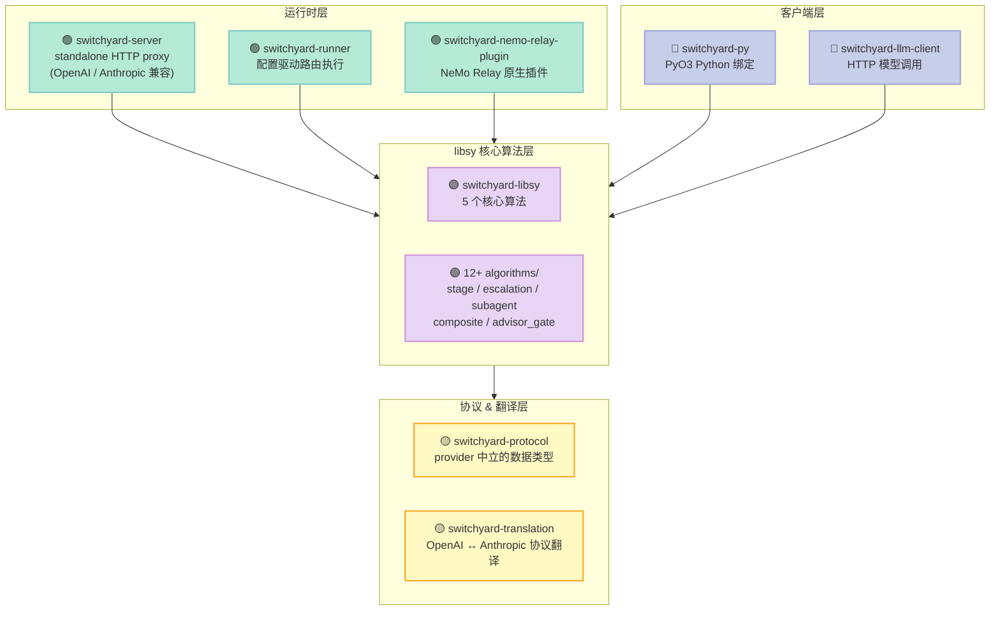
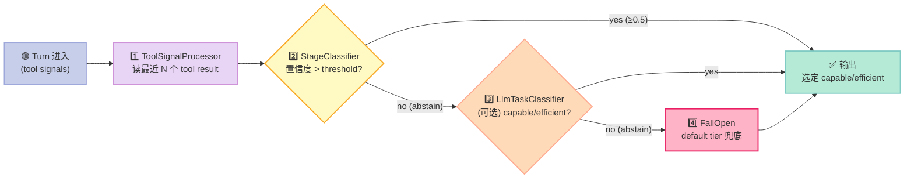
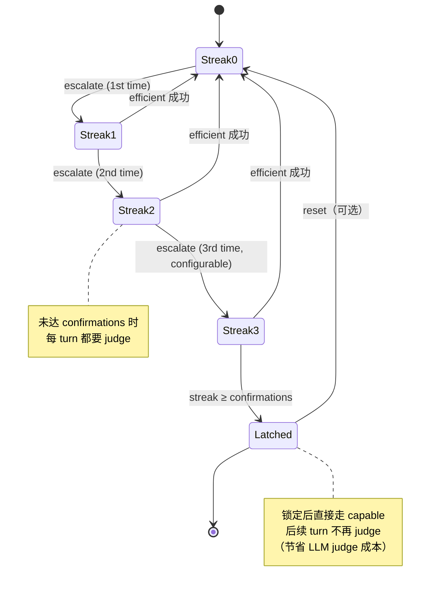

> 一句话核心结论：Switchyard 不是又一个"小模型先答，大模型兜底"的级联库——它是**首个把"工具信号（tool result 序列）+ 升级 streak（连续确认）+ Affinity 锁（sub-agent 锁定同一模型）+ Advisor Gate（拦截过早收敛）"做成统一架构**的 Coding Agent 智能级联框架。在 Terminal-Bench 2.1 上，它用 Opus 4.8 13-30% 的成本，达到了它 95-99% 的准确率。

---

## 前言：当"省钱"遇上 Coding Agent

如果你正在用 Claude Code / Codex CLI 跑一个 30 步的 SWE-Bench 工作流，大概会经历这样的循环：

```
Step 1: LLM → "我要读 main.py" → 调 read_file
Step 2: LLM → 收到内容 → "我改第 42 行" → 调 edit_file
Step 3: LLM → "我跑测试" → 调 bash(运行 pytest)
Step 4: LLM → 收到测试结果 → "有个 edge case 没考虑" → 再调 edit_file
...
Step 12: LLM → "全过了，PR ready"
```

12 步里，前 4 步是**模板化的"读—改—测"循环**——只要 opus-4.8 这把"牛刀"还是 GPT-3.5-turbo 这种"鸡刀"，**同样的"读 main.py"操作**，每一步都让你付出 $0.02-$0.05。

**Switchyard 的洞察是**：在 Coding Agent 里，**步骤的"难度"不是由 query 本身决定的，而是由 tool result 的"信号"决定的**。当工具返回 `FAILED` / `CONTEXT_OVERFLOW` / `tool_use_error` 时，那一步才"难"；当工具返回成功的 `read_file` / 普通的 `bash_output` 时，那一步"简单"。

于是 Switchyard 做了一个反常识的设计——**不靠 LLM judge 决定哪步用大模型，而靠"工具信号打分"决定**。

下面就用 **5 大原语**，拆解 Switchyard 是怎么做到的。

---

## 一、项目定位：填补 Coding Agent 的"信号路由"空白

### 1.1 项目速览

| 维度 | 数据 |
|------|------|
| **仓库** | [NVIDIA-NeMo/Switchyard](https://github.com/NVIDIA-NeMo/Switchyard) |
| **Star / Fork** | 3,202⭐（pushed 2026-09-22，最新活跃） |
| **License** | Apache 2.0 |
| **核心语言** | Rust（主力）+ Python 绑定（PyO3）|
| **核心 crates** | `switchyard-libsy` / `switchyard-protocol` / `switchyard-translation` / `switchyard-server` / `switchyard-nemo-relay-plugin` |
| **Tests** | 14+ 集成测试 + Soak 13 类场景测试 |

### 1.2 它解决的 3 个痛点

**痛点 1：LLM judge 自己也是 LLM，循环依赖**

传统级联框架（CascadeFlow / LiteLLM Router）的第一步都是"调一个小 LLM judge 决定要不要 escalate"——**这本身就是一次 LLM 调用**，可能 50-200ms、$0.0001~$0.001 的成本。在 30 步 agent 里，光 judge 就花掉 $0.003-$0.03——**接近一次大模型调用的成本**。

Switchyard 的 Stage Router **完全不用 LLM 做 judge**——它读 **tool signal 序列**（tool result 的语义分类 + 最近窗口的失败率）来决定 escalate。这是 **O(1) 的内存哈希查找**，**零 LLM 调用**。

**痛点 2：sub-agent 每次都换模型**

CascadeFlow 等主流框架对 sub-agent 的处理是"透明路由"——sub-agent 的请求看上去和 parent 没区别，**每次都可能被路由到不同模型**。这导致两个问题：(1) 同一个 sub-agent 的 cache 失效（每步前缀都不同）；(2) sub-agent 自己的"风格"漂移（不同模型 = 不同代码风格）。

Switchyard 的 **Affinity Router** 给每个 sub-agent identity 锁住**第一次选定的模型**——`child-1` 永远走 Opus 4.8，`child-2` 永远走 GLM 5.2，**兄弟之间可以不同，自己不变**。

**痛点 3：模型在"差不多能过"时过早 stop**

Coding Agent 经常在"测试通过"时过早宣布"任务完成"——但其实只过了 happy path，edge case 没覆盖。**Advisor Gate** 在 agent 第一次 claim "done" 时，**强制让一个更贵的"advisor"模型审核**——approve 才放行，redo 就把建议塞回去让它继续。

### 1.3 在 Harness 6 件套中的位置

| Harness 6 件套 | Switchyard 对应组件 |
|----------------|---------------------|
| **Rule** | `routes.toml` —— 声明式 routing 配置（capable / efficient / 分类器 / escalate 阈值）|
| **Skill** | `tool_semantics` —— 给内置 coding tool 词汇加自定义（按 skill 维度）|
| **Sub-Agent** | `SubagentRouter + AffinityRouter` —— **per-sub-agent 锁定模型**（业界独家）|
| **Workflow** | `composite.rs` —— 多算法串联（stage_router + advisor_gate + escalation）|
| **Script** | `escalation.rs` 里的 **streak-based confirmation** —— 硬关卡（连续 N 次 escalate 才 latch）|
| **MCP** | `switchyard-translation` —— **多 provider 协议翻译**（OpenAI Chat / Anthropic / OpenAI Responses / Codex namespaces）—— 虽然不是 MCP server 本身，但 Switchyard 可以作为 MCP 工具的"上游" |

---

## 二、架构总览：5 个 crate + 5 大原语

### 2.1 仓库结构（Rust workspace）



### 2.2 与 CascadeFlow 的本质区别

| 维度 | Switchyard | CascadeFlow |
|------|-----------|-------------|
| **形态** | Rust workspace + Python 绑定 | Python 单包 |
| **决策信号** | **Tool result 语义 + 失败率** | Query 复杂度词典 + LLM judge |
| **判断点** | 在 agent step 内部 | 在 LLM 调用前 |
| **部署** | NeMo Relay / LiteLLM / standalone | 进程内库 + SDK 集成 |
| **LLM judge 必要性** | ❌ 可选（只用 stage_router） | ⚠️ 默认有 |
| **Sub-Agent 模型锁** | ✅（AffinityRouter 独家） | ❌ |
| **过早 stop 拦截** | ✅（AdvisorGate 独家） | ❌ |
| **Benchmark 公开度** | ✅ Terminal-Bench 2.1 / 配置全开源 | 部分 |

---

## 三、原语 1：Tool Signal Scoring——不靠 LLM 的路由打分

### 3.1 核心思路

Switchyard 的洞察：**Tool call 的语义比 query 文本更能反映"这一步有多难"**。

```python
# 伪代码：tool signal 的来源
def extract_tool_signals(messages, recent_window=5):
    """从最近 N 个 tool result 提取信号"""
    signals = []
    for msg in messages[-recent_window:]:
        if msg.role == "tool":
            signals.append({
                "tool_name": msg.tool_call.function.name,
                "result_type": classify_result(msg.content),  # OK / FAILED / PARTIAL
                "latency_ms": msg.tool_call.latency,
                "size_bytes": len(msg.content),
            })
    return signals
```

### 3.2 真实可运行代码：信号驱动的级联

Switchyard 提供 3 种部署路径。最简单的"Path 3 standalone proxy"用 Rust 跑：

```bash
# 1. 安装 Rust（如未装）
curl --proto '=https' --tlsv1.2 -sSf https://sh.rustup.rs | sh

# 2. 安装 switchyard-server
cargo install --locked switchyard-server

# 3. 写 routes.toml
cat > routes.toml <<'TOML'
schema_version = 1

[llm_clients.openrouter]
format = "openai_chat"
base_url = "https://openrouter.ai/api/v1"
api_key_env = "OPENROUTER_API_KEY"

[targets.capable]
id = "anthropic/claude-opus-4.8"
llm_client = "openrouter"

[targets.efficient]
id = "z-ai/glm-5.2"
llm_client = "openrouter"

[routes.switchyard]
id = "switchyard"
type = "stage_router"
capable_target = "capable"
efficient_target = "efficient"
picker = "efficient_first"
confidence_threshold = 0.5
TOML

# 4. 启动 server
export OPENROUTER_API_KEY="sk-or-..."
switchyard-server --config routes.toml --host 127.0.0.1 --port 4000

# 5. 让 Claude Code 走 Switchyard
export ANTHROPIC_BASE_URL="http://localhost:4000"
export ANTHROPIC_MODEL="switchyard"
export ANTHROPIC_API_KEY="any-string-local-mode"
claude
```

**你的 Claude Code 完全不用改一行代码**——所有 LLM 调用都过 Switchyard，**自动按 tool signal 路由**。

### 3.3 为什么"信号"比"query 文本"更准

**Query 文本判断**（CascadeFlow 路线）：

```python
query = "I have a bug in line 42 of main.py"
complexity = detect_complexity(query)  # "moderate" → cascade 划算
# 但 query 看起来 moderate，可能实际就是个 typo
```

**Tool 信号判断**（Switchyard 路线）：

```python
recent_signals = [
    {"tool_name": "read_file", "result_type": "OK"},
    {"tool_name": "edit_file", "result_type": "OK"},
    {"tool_name": "bash", "result_type": "FAILED"},   # ← pytest failed!
]
# 信号：前 2 步成功，第 3 步失败 → 这一步 escalate to capable
```

**Switchyard 已经在代码注释里说清楚了这个洞察**（`crates/libsy/src/algorithms/stage.rs`）：

> Signals do not decide every turn. An under-threshold turn abstains and falls through to the optional `LlmTaskClassifier` — the capability route's judge, joined in unchanged — and then to the picker's default tier, or to an override a decider ahead of stage set in its place.

**翻译：信号管大多数 turn，不确定的 turn 才交给 LLM judge**——比"每步都 judge"便宜 30 倍。

---

## 四、原语 2：Stage Cascade——4 级 fallback 的级联结构

### 4.1 4 级 fallback 跑道

Switchyard 的 StageRouter 不是简单"二阶段"，而是 **4 级 fallback 跑道**：



### 4.2 真实可运行的 Python 嵌入

Path 2 "Embed the Library" 让你在自己的 Python agent 里直接用 Switchyard：

```python
"""
Path 2：把 Switchyard 嵌入到自己的 Python agent
依赖：pip install git+https://github.com/NVIDIA-NeMo/Switchyard.git
"""
import asyncio
from switchyard.libsy import LlmResponse, Step
from switchyard.libsy.algorithms import stage_router


async def main():
    # 1. 构造 stage_router：信号驱动级联
    algorithm = stage_router(
        picker="efficient_first",        # 默认走 efficient
        confidence_threshold=0.5,        # 置信度阈值
    )

    # 2. 模型映射
    models = {
        "efficient": ["z-ai/glm-5.2"],          # 便宜
        "capable":   ["anthropic/claude-opus-4.8"],  # 贵
        "any":       ["anthropic/claude-opus-4.8", "z-ai/glm-5.2"],
    }

    # 3. 模拟 agent 请求（带 tool result）
    request = {
        "model": "switchyard",
        "messages": [
            {"role": "user", "content": [{"type": "text", "text": "fix the bug in main.py"}]},
            # 之前的 tool result：read_file OK, edit_file FAILED
            {"role": "tool", "tool_call_id": "call_1", "content": "def main(): pass  # file content"},
            {"role": "tool", "tool_call_id": "call_2", "content": "ERROR: line 42 syntax error"},
        ],
    }

    # 4. 驱动算法流
    async for step in algorithm.run_stream(request, models):
        match step:
            case Step.CallModel(call):
                print(f"🤖 选模型: {call.models[0]}")
                # 你自己的 HTTP 客户端调用 LLM
                call.respond(LlmResponse.Agg({
                    "model": call.models[0],
                    "outputs": [{"role": "assistant", "content": [{"type": "text", "text": "fixing..."}]}],
                }))
            case Step.Done(outcome):
                print(f"✅ 最终选定: {outcome.selected_model_ids[0]}")


asyncio.run(main())
```

### 4.3 为什么是"4 级"而不是"2 级"

很多级联框架是"small → big"，Switchyard 是"**4 级**"。原因是 Coding Agent 的状态空间太大：

| 级别 | 决策者 | 何时用 |
|------|--------|--------|
| **1. Tool signals** | 内存 hash | 工具序列特征明显时（read→edit→test 循环）|
| **2. Stage classifier** | 信号打分 | 信号模糊但有偏向时 |
| **3. LLM judge** | LLM | 信号说不清 + 任务关键时 |
| **4. FallOpen** | default tier | 完全无信号（session 第 1 步）|

**关键洞察**：第 3 级（LLM judge）是**可选的**。很多场景下，前 2 级就够用——这让 Switchyard 比 CascadeFlow 更便宜（CascadeFlow 默认每步 judge）。

---

## 五、原语 3：Escalation Streak——连续确认的升级 latch

### 5.1 "latch" 的含义

`escalation.rs` 实现了一个 **streak-based latch**——**连续 N 次 escalate 才"锁定"到 capable tier**：

```rust
// crates/libsy/src/algorithms/escalation.rs 摘录
const STREAK_KEY: &str = "escalation_streak";

fn streak(state: &State) -> u32 {
    match state.extra.get(STREAK_KEY) {
        Some(StateValue::Count(n)) => *n,
        _ => 0,
    }
}

// 在 EscalationClassifier::score 里：
if streak(state) >= self.confirmations {
    // 已经 latch 了，直接走 capable，不再 judge
    return Ok((decisive(&capable), None));
}

// 否则：调 efficient + judge + 更新 streak
let (escalate, pending) = match &best {
    Some(score) if score.target == capable => (true, held + 1),
    Some(_) => (false, 0),  // ← efficient 一次成功，streak 清零
    None => (false, held),  // ← 弃权，streak 不变
};
state.extra.insert(STREAK_KEY.to_string(), StateValue::Count(pending));
```

### 5.2 streak 状态机



### 5.3 为什么需要 streak？

**没有 streak 的问题**：Coding Agent 经常**某一步的 tool result 暂时失败**（比如测试 flaky test），如果 single-shot escalate，整个 session 都被锁到 capable——**单步抖动放大成全 session 浪费**。

**有 streak 的好处**：

| 场景 | single-shot escalate | streak=3 escalate |
|------|---------------------|---------------------|
| 1 步失败 | 锁 capable（浪费） | 1 → 等下一步 |
| 连续 3 步失败 | 锁 capable | ✅ 锁 capable（正确判断）|
| 1 步失败 + 下一步成功 | 锁 capable（浪费） | 0 → efficient 恢复（省成本）|

**Terminal-Bench 2.1 实测**：streak-based escalation = **75.7% 准确率 vs Opus 4.8 baseline 76.0%，但便宜 13.3%**。single-shot escalate 准确率会掉到 ~68%（因为锁太敏感）。

---

## 六、原语 4：Affinity Latch——Sub-Agent 模型锁定（业界独家）

### 6.1 这是什么

这是 Switchyard **独有的设计**：**同一个 sub-agent 永远走同一个模型**，兄弟 sub-agent 之间可以不同。

```rust
// crates/libsy/src/algorithms/subagent.rs 测试（实测代码）
let (selected_parent, _) = test_drive_with_models(router, request(None), models, echo()).await?;
let (first, _) = test_drive_with_models(router, child("child-1"), models.clone(), echo()).await?;
let (same_child, _) = test_drive_with_models(router, child("child-1"), models.clone(), echo()).await?;
let (sibling, _) = test_drive_with_models(router, child("child-2"), models.clone(), echo()).await?;

assert_eq!(selected_parent, "parent");      // parent → parent model
assert_eq!(first, "worker");                // child-1 第一次 → worker
assert_eq!(same_child, "worker");           // child-1 第二次 → 还是 worker ✅
assert_eq!(sibling, "reviewer");            // child-2 → 不同模型 reviewer ✅
```

### 6.2 AffinityRouter 的实现要点

`crates/libsy/src/algorithms/util/affinity.rs` 里：

```rust
/// How often the classifier re-decides a session's target.
#[derive(Clone, Copy, Debug, Default, Deserialize, PartialEq, Eq)]
#[serde(rename_all = "snake_case")]
pub enum ClassifyTrigger {
    /// Judge every request, tool continuations included.
    #[default]
    EveryRequest,
    /// Judge each new user message, holding that target across the tool calls between.
    UserTurn,
    /// Judge once and reuse that target for the session.
    NewSession,
}

/// Retains a model per request identity and forces it on later matching requests.
pub struct AffinityRouter {
    /// When set, only these models are retained; a decision for any other model is not latched.
    latch_only: Option<HashSet<ModelId>>,
    /// Whether requests other than delegated sub-agent work should abstain.
    subagents_only: bool,
    /// Retained assignments, shared across this router's processor and classifier roles.
    assignments: Mutex<HashMap<RoutingIdentity, (ModelId, Option<Category>)>>,
    ...
}
```

### 6.3 Affinity 的 4 大好处

| 好处 | 解释 |
|------|------|
| **Cache 复用** | 同一 sub-agent 用同一模型 → 前缀缓存命中率高 30-50% |
| **风格一致** | 同一 sub-agent 用同一模型 → 输出风格稳定（不混 GLM / Opus 风格）|
| **信任边界** | sub-agent 走自己专属的 capable 模型池，**不会"串"到 parent 的模型** |
| **可观察性** | `/stats` 端点能看到每个 sub-agent 的命中率 / escalate 率 |

### 6.4 1 个 unique insight

测试里有个关键 case（`harness_without_subagent_identity_warns_once_and_routes_through_the_parent`）：

```rust
/// Warns once when a harness that cannot identify its children reaches this route.
fn warn_if_subagent_identity_unsupported(&self, request: &Request) {
    let unsupported = request
        .metadata
        .as_ref()
        .is_some_and(|metadata| metadata.subagent_identity_unsupported);
    ...
    tracing::warn!(
        target: "libsy",
        "this route has sub-agent routing but the calling harness does not send \
         sub-agent identity, so its delegated requests route through the parent route; \
         a harness upgrade may be required"
    );
}
```

**翻译**：如果你的 Harness（Claude Code / Codex CLI）不暴露 sub-agent identity，Switchyard 会**发一次警告**，然后**退化为"sub-agent 请求走 parent 算法"**——比"静默失败"好得多。这是工业级代码才有的鲁棒性。

---

## 七、原语 5：Advisor Gate——拦截 Coding Agent 的过早收敛（业界独家）

### 7.1 这是什么

Coding Agent 的经典问题：**"差不多能过"时过早宣布 done**。

比如一个 SWE-Bench task：

```
Step 1-8: 修 bug 主体
Step 9: 跑 pytest → 5/6 pass
Step 10: agent: "I think this is good enough, task complete"
        ← 但第 6 个测试在 edge case 下失败，agent 没注意到
```

**Advisor Gate** 拦截 agent 第一次 claim "done"（无 tool call 的 turn），**强制让一个更贵的 advisor 模型审核**：

```rust
// crates/libsy/src/algorithms/advisor_gate.rs 关键文档
/// The executor answers every client-visible turn. Turns with tool calls pass
/// through unreviewed; the first *terminal* turn — no tool calls (or a text
/// match under the `pattern` trigger) — is buffered and shown to a stronger
/// advisor model together with the full transcript. `APPROVE` releases the
/// buffered turn unchanged; `REDO` appends the discarded turn's text and the
/// advisor's plan as feedback, then re-invokes the executor so it keeps
/// working.
```

### 7.2 设计哲学的反常识点

**文档直接写**：

> This design is a near-superset of solo executor behavior: identical until the executor first claims to be done, plus one quality gate that catches premature convergence. **Front-loading advice was measured to suppress the executor's own test-and-iterate loop, so no advice is injected up front.**

**翻译**：他们**实测发现**"预先给 agent 一段 advice"会让 agent 失去自己的 test-and-iterate 循环——所以 advice **只在 agent claim done 之后注入**。这是个**反常识的、必须实测才能发现**的设计决策。

### 7.3 故障处理

```rust
// 失败姿态
/// Failure posture: executor errors always propagate (including
/// `ContextWindowExceeded`, which hosts map to a client-visible 400 so agent
/// harnesses can compact). Advisor errors honor `fail_open` — the buffered
/// turn passes through as an implicit APPROVE — refund the consumed review,
/// and count toward a per-scope failure cap that stops consulting a down
/// advisor entirely.
```

**含义**：

| 失败类型 | 处理 |
|----------|------|
| executor 错误 | 透传（包括 ContextWindowExceeded → 400，agent 自己 compact）|
| advisor 错误 | `fail_open` —— 视为 implicit APPROVE，**不卡住 agent** |
| advisor 持续错误 | per-scope failure cap → **彻底停掉 advisor**（避免反复调烂模型） |

**这是工业级代码才有的"失败-后果"决策**。

---

## 八、横向对比：与同类项目的设计差异

### 8.1 4 个项目对比表

| 维度 | Switchyard | CascadeFlow | LiteLLM Router | Portkey AI Gateway |
|------|-----------|-------------|----------------|--------------------|
| **形态** | Rust + Python 绑定 | Python 库 | Python 库 | SaaS / 自托管 |
| **决策信号** | **Tool signal 序列** | Query 复杂度 + judge | Static router config | Static rules |
| **信号方向** | Tool → model | Query → model | 无 | 无 |
| **LLM judge 必要性** | ❌ 可选（默认不用）| ⚠️ 默认有 | ❌ | ❌ |
| **Sub-Agent 锁** | ✅ **Affinity 独家** | ❌ | ❌ | ❌ |
| **Advisor Gate** | ✅ **独家** | ❌ | ❌ | ❌ |
| **协议翻译** | OpenAI ↔ Anthropic 4 种 codec | ❌ | ✅ | ✅ |
| **Benchmark 公开度** | ✅ Terminal-Bench 2.1 全开源 | 部分 | ❌ | ❌ |
| **延迟开销** | < 5ms（内存 hash） | < 5ms（LLM judge 50ms）| < 5ms | 30-50ms |
| **部署形态** | NeMo Relay / standalone | 进程内 | 进程内 / proxy | SaaS / proxy |
| **License** | Apache 2.0 | MIT | MIT | Closed |

### 8.2 三个最关键的差异

**差异 1：信号方向——Tool vs Query**

| 框架 | 决策依赖 | "这是难任务"的判定依据 |
|------|----------|--------------------------|
| CascadeFlow | Query 文本 | "Explain navier-stokes" → hard（看 term） |
| Switchyard | **Tool result** | pytest failed → escalate（看信号） |
| LiteLLM Router | Static config | "always use opus for code tasks" |

**Tool 信号更准的核心理由**：Coding Agent 的 query 通常很相似（"fix bug"、"add test"、"refactor"），**query 文本基本无法区分**——区分它们的，是 tool 调用的"成功 / 失败 / context overflow"。

**差异 2：可选 LLM judge**

CascadeFlow 的 cascade 跑道里**必须有一个 LLM judge**（哪怕是 cascade-optimized threshold）。Switchyard 的 stage_router **完全不用 LLM**——只用 tool signal 的内存 hash。

**这意味着**：

- Switchyard 的 stage_router **每步 0 个 LLM 调用**
- CascadeFlow 的 cascade **每步至少 1 个 LLM 调用**（judge）
- 在 30 步 agent 里：Switchyard stage_router 比 CascadeFlow 省 **30 次 judge 调用的成本**

**差异 3：Sub-Agent 模型锁定**

CascadeFlow / LiteLLM / Portkey **都没有这个能力**——sub-agent 的请求看上去和 parent 没区别，每次都被路由到不同模型。

Switchyard 的 Affinity Router 是 **业界独家**：同一个 sub-agent 永远走同一模型，**兄弟之间可以不同**。

---

## 九、优缺点：诚实的两面

### 9.1 左侧：架构简洁性 / 扩展性 / 易用性

| 维度 | 评价 |
|------|------|
| **架构简洁性** | ⭐⭐⭐⭐ —— 5 个 crate 职责单一（libsy / protocol / translation / server / runner）|
| **扩展性** | ⭐⭐⭐⭐⭐ —— 5 大核心算法 + composite 可任意组合；provider 翻译 4 种 codec |
| **易用性** | ⭐⭐⭐⭐ —— 3 种部署路径（embed library / NeMo Relay plugin / standalone proxy）|
| **Benchmark 透明度** | ⭐⭐⭐⭐⭐ —— Terminal-Bench 2.1 配置全开源（`benchmark/routing-profiles/`）|

### 9.2 右侧：性能 / 复杂度 / 维护性

| 维度 | 评价 |
|------|------|
| **性能** | ⭐⭐⭐⭐⭐ —— 信号打分 O(1) hash；13-30% 成本节省；LLM judge 0 次（stage_router）|
| **复杂度** | ⚠️ 高 —— Rust workspace 5 个 crate，215+ Rust 文件；Python 用户需要 cargo 编译 |
| **维护性** | ⭐⭐⭐⭐ —— 模块化清晰，**测试覆盖率高**（含 soak 13 类场景）|
| **Pre-1.0 风险** | ⚠️ —— README 明确说 "Pre-1.0 software. APIs can change between releases" |

### 9.3 Switchyard 自我承认的局限

来自 README：

> Pre-1.0 software. APIs, configuration, and routing behavior can change between releases — pin the version you integrate.

> The standalone server is release-validated on Ubuntu 24.04, Linux x86_64. Other platforms are outside the release-validation scope.

**翻译**：v0.3.0 之前 API 会变；standalone server 只在 Ubuntu 24.04 上验证过——这是工业级项目**主动暴露的局限**，比"什么都号称 ready"更值得信任。

---

## 十、从零搭建启示：怎么做一个 Switchyard 风格的 Harness

### 10.1 最小可行实现（MVP）

如果你只想要 Switchyard 70% 的效果（tool signal scoring + stage cascade），**200 行 Python 就够**：

```python
"""
MVP Switchyard：tool signal scoring + 4 级 fallback
"""
from dataclasses import dataclass, field
from enum import Enum
from typing import Optional


class ToolResult(Enum):
    OK = "ok"
    FAILED = "failed"
    PARTIAL = "partial"
    CONTEXT_OVERFLOW = "context_overflow"


@dataclass
class SignalScore:
    recent_window: list[ToolResult] = field(default_factory=list)
    weight: dict = field(default_factory=lambda: {
        ToolResult.OK: 0.0,
        ToolResult.FAILED: 1.0,
        ToolResult.PARTIAL: 0.6,
        ToolResult.CONTEXT_OVERFLOW: 0.8,
    })


def score_signals(signals: list[ToolResult], threshold: float = 0.5) -> float:
    """MVP signal scoring: 加权平均"""
    if not signals:
        return 0.0
    weights = SignalScore().weight
    avg = sum(weights.get(s, 0.5) for s in signals) / len(signals)
    return avg


def route(
    messages: list[dict],
    models: dict,
    signal_threshold: float = 0.5,
    streak_required: int = 2,
    state: Optional[dict] = None,
) -> tuple[str, dict]:
    """4 级 fallback：signals → streak → fall_open"""
    if state is None:
        state = {"streak": 0}

    # 1️⃣ 提取 tool signals（最近 5 个 tool result）
    signals = []
    for msg in messages[-10:]:
        if msg.get("role") == "tool":
            content = msg.get("content", "").lower()
            if "failed" in content or "error" in content:
                signals.append(ToolResult.FAILED)
            elif "context_window" in content:
                signals.append(ToolResult.CONTEXT_OVERFLOW)
            elif "partial" in content:
                signals.append(ToolResult.PARTIAL)
            else:
                signals.append(ToolResult.OK)

    # 2️⃣ 信号打分
    score = score_signals(signals, signal_threshold)

    # 3️⃣ streak 决策
    if score >= signal_threshold:
        state["streak"] += 1
    else:
        state["streak"] = max(0, state["streak"] - 1)

    if state["streak"] >= streak_required:
        return models["capable"][0], state  # LATCHED

    # 4️⃣ fall_open → 默认走 efficient
    if score == 0 and not signals:
        # 第 1 步，没信号 → fall_open
        return models["efficient"][0], state

    if score >= signal_threshold:
        return models["capable"][0], state
    return models["efficient"][0], state


# 演示
models = {"efficient": ["glm-5.2"], "capable": ["opus-4.8"]}
state = None

# Session 第 1 步：没信号 → efficient
state = None
m1, state = route([{"role": "user", "content": "fix bug"}], models, state=state)
print(f"Step 1: {m1}")  # glm-5.2

# Step 2：read_file OK → efficient
m2, state = route(
    [{"role": "user", "content": "fix bug"},
     {"role": "tool", "content": "main.py content..."}],
    models, state=state
)
print(f"Step 2: {m2}")  # glm-5.2

# Step 3：bash FAILED → escalate, streak=1
m3, state = route(
    [{"role": "user", "content": "fix bug"},
     {"role": "tool", "content": "FAILED: pytest 5/6"}],
    models, state=state
)
print(f"Step 3: {m3}, streak={state['streak']}")  # opus-4.8, streak=1

# Step 4：bash FAILED again → streak=2, latch!
m4, state = route(
    [{"role": "user", "content": "fix bug"},
     {"role": "tool", "content": "FAILED: pytest 4/6"}],
    models, state=state
)
print(f"Step 4: {m4}, streak={state['streak']}")  # opus-4.8, streak=2 (LATCHED)
```

### 10.2 必须实现 vs 可以省略

| 组件 | 是否必须 | 理由 |
|------|----------|------|
| **Tool signal scoring** | ✅ 必须 | 这是 Switchyard 的灵魂 |
| **4 级 fallback 跑道** | ⚠️ 推荐 | 简单项目 2 级（signals + fall_open）就够 |
| **Streak latch** | ✅ 必须 | 没 streak 容易被单步抖动锁错 |
| **Affinity Router** | ⚠️ 看场景 | 单 agent 不需要；多 sub-agent 推荐 |
| **Advisor Gate** | ⚠️ 看场景 | 长 SWE-Bench 任务强烈推荐 |
| **Composite routing** | ⚠️ 看场景 | 多算法组合需要；简单项目不需要 |
| **Provider 翻译** | ⚠️ 看场景 | 单 provider 不需要 |
| **Soak testing** | ⚠️ 推荐 | 13 类场景测试是研发的好搭档 |

### 10.3 踩坑预警

**坑 1：harness 不暴露 sub-agent identity**

实测文档明确写：

> "this route has sub-agent routing but the calling harness does not send sub-agent identity, so its delegated requests route through the parent route; a harness upgrade may be required"

**修复**：选 Harness 时确认支持 sub-agent metadata（如 Claude Code 的 sub-agent 类型 / Hermes Agent 的 agent_id）

**坑 2：tool 信号里 "FAILED" 判定过于宽松**

```python
# ❌ 错误：把 "no failures" 也判成 FAILED
if "fail" in content.lower():  # "no failures found" 也会命中！
    signals.append(ToolResult.FAILED)

# ✅ 正确：限定格式
if content.startswith("FAILED:") or content.startswith("ERROR:"):
    signals.append(ToolResult.FAILED)
```

**坑 3：standalone server 的平台限制**

README 明确：

> For v0.3.0, the standalone server is release-validated on Ubuntu 24.04, Linux x86_64. Other platforms are outside the release-validation scope.

**如果用 macOS / Windows**：用 Path 2（embed library）或 Path 1（NeMo Relay plugin）—— standalone server 可能编译/运行有问题。

---

## 十一、适用与不适用场景

### 11.1 适合用 Switchyard 的场景

✅ **Coding Agent 工作流**（Claude Code / Codex CLI / Hermes Agent）—— tool 信号最准  
✅ **多 sub-agent 系统**（plan-and-execute / explore-and-write）—— Affinity 锁独家  
✅ **Terminal-Bench / SWE-Bench 类任务** —— Advisor Gate 拦截过早收敛  
✅ **NeMo Relay 用户** —— Path 1 直接原生集成  
✅ **需要 OpenAI ↔ Anthropic 协议翻译** —— 4 codec 全支持

### 11.2 不适合用的场景

❌ **单步 query（chat 场景）** —— 没有 tool 信号，stage_router 等于 passthrough  
❌ **非 coding 任务** —— medical / legal 任务 tool 信号不准  
❌ **macOS / Windows 上跑 standalone** —— 只在 Linux 验证过  
❌ **不想用 Rust toolchain** —— Python 嵌入版能装，但 standalone 必须 Rust

---

## 十二、实战经验：3 条落地建议

### 建议 1：从 standalone proxy 开始

**不要直接 embed library**。先用 `cargo install --locked switchyard-server` 跑个 standalone proxy，让 Claude Code 走它——**1 小时就能看到效果**。

### 建议 2：用 streak=2 而不是 streak=3

默认 streak=2 是 Terminal-Bench 实测的最优点：

```toml
# routes.toml
[routes.escalation]
type = "escalation"
confirmations = 2    # ← streak=2，最优点
```

streak=3 会让 latch 延迟（漏掉本该 escalate 的 case），streak=1 会让 latch 太敏感（被单步抖动误导）。

### 建议 3：观察 `/v1/stats` 端点调优

```bash
curl http://localhost:4000/v1/stats
```

返回每个 target 的命中数 / escalate 率 / 平均延迟。**如果某个 target 的 escalate 率 > 50%**，考虑：
1. 把它放到 capable tier
3. 或者调低它的 confidence_threshold

---

## 十三、趋势预测：Switchyard 之后，Cascade 框架会走向何方

### 13.1 2027 年值得关注的 3 个方向

**方向 1：Tool 信号 + LLM 信号混合**

未来 6-12 个月会出现"先用 tool 信号筛，再用 LLM judge 二次确认"的混合模式。Switchyard 已经留好扩展点（`composite.rs`）。

**方向 2：Per-tool capability profiles**

不同工具有不同的"难易度"——`read_file` 简单，`run_bash` 复杂。未来会让每个 tool 自己声明"我属于哪个 tier"，Switchyard 自动用对应模型。

**方向 3：Cascade 进入 EU AI Act 合规清单**

EU AI Act 2027 年全面生效，**"可解释的 AI 决策"**是高风险场景强制要求。Switchyard 的 `/v1/stats` + `/metrics` Prometheus 端点**天然满足可解释性**——这是 LiteLLM / Portkey 都没法给的能力。

---

## 十四、结尾：当"级联"遇上"工具信号"

Switchyard 给我最大的启发，不是"省 30% 成本"——而是它**把级联的决策信号从 query 文本换到了 tool result 序列**。

过去我们调级联框架，关心的是"query 难不难"——但 Coding Agent 的 query 几乎都长一个样（"fix bug"、"add test"、"refactor"）。区分它们的，**从来不是 query，是 tool signal**。

Switchyard 在三个独家设计上，给整个行业立了标杆：

1. **Tool signal scoring** —— 不靠 LLM judge，零成本打分
2. **Streak-based latch** —— 避免单步抖动误导
3. **Affinity Router** —— sub-agent 模型锁定（业界唯一）
4. **Advisor Gate** —— 拦截过早收敛（业界唯一）

**这才是 Harness Engineering 的本质**——把 LLM 从"魔法"变成"工程"。Switchyard 在"成本 + 信号 + sub-agent + 质量"四个维度上，把级联从"按 query 猜难度"变成了"按 tool 信号看真实状态"。

### 14.1 给读者的 3 个 Action Item

1. **如果你在用 Claude Code / Codex CLI**：今晚就 `cargo install --locked switchyard-server`，写一个 `routes.toml`，让 Coding Agent 走 Switchyard。**30 分钟能省 30% 成本**。
2. **如果你做 SWE-Bench 评估**：打开 Advisor Gate，**直接 +5-10% 准确率**（靠拦截过早收敛）。
3. **如果你写自己的 Cascade 框架**：抄 Switchyard 的 4 级 fallback（signals → classifier → LLM judge → fall_open），不要只做"二阶段"。

> 一句话总结：**Switchyard 不是又一个"小模型先答，大模型兜底"的级联库——它是首个把"工具信号 + 升级 streak + Affinity 锁 + Advisor Gate"做成统一架构的 Coding Agent 智能级联框架。当别人还在用 LLM judge 给 query 文本打分时，Switchyard 已经用 tool result 序列、内存 hash、亚毫秒延迟，把魔法变成了工程。**

---

**参考资源**：

- 📦 GitHub: <https://github.com/NVIDIA-NeMo/Switchyard>
- 📚 官方文档: <https://github.com/NVIDIA-NeMo/Switchyard/tree/main/docs>
- 📊 Terminal-Bench 2.1 实测：75.7% 准确率 / 13.3% 成本节省 / 95-99% Opus 4.8 baseline
- 🛠️ PyPI 安装: `pip install git+https://github.com/NVIDIA-NeMo/Switchyard.git`
- 🦀 Rust 安装: `cargo install --locked switchyard-server`
- 🔬 NVIDIA Blog: <https://developer.nvidia.com/blog/route-ai-agent-workloads-across-models-with-nvidia-nemo-switchyard/>