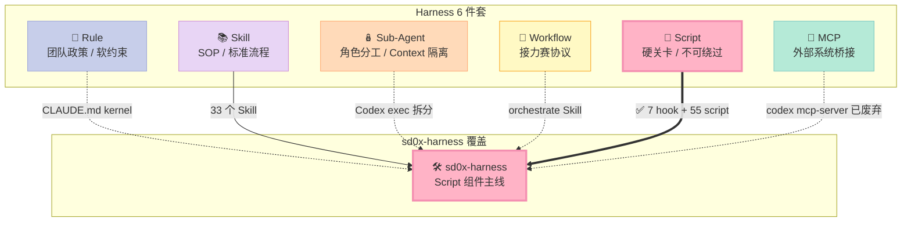
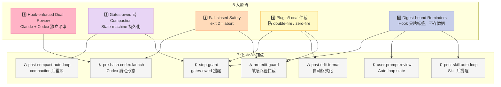
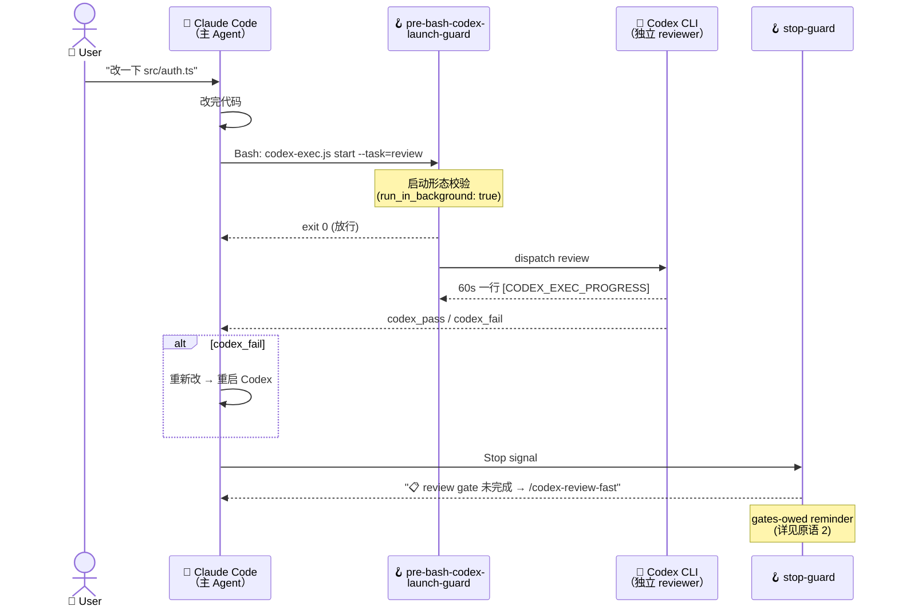
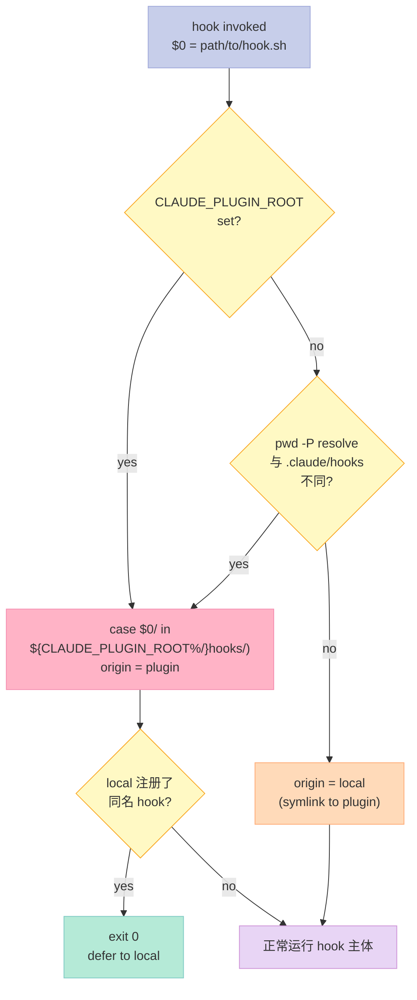
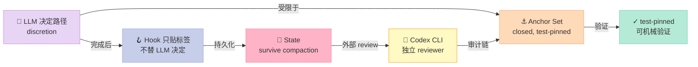
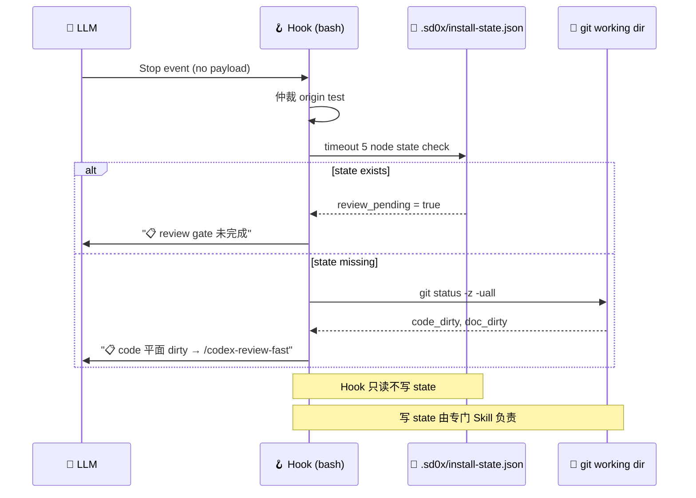
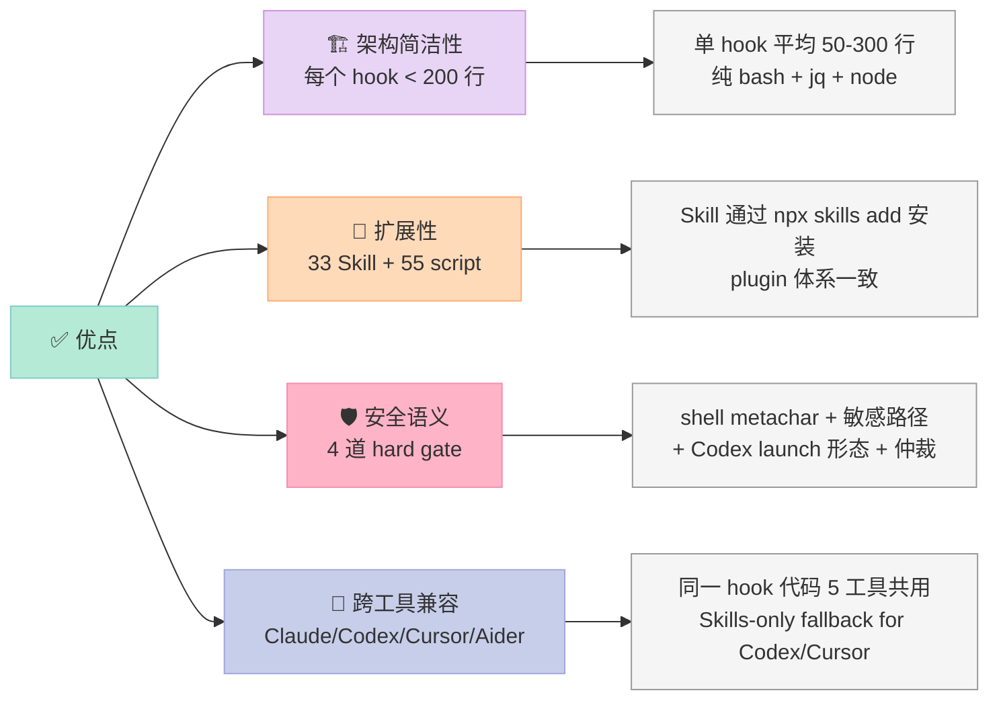
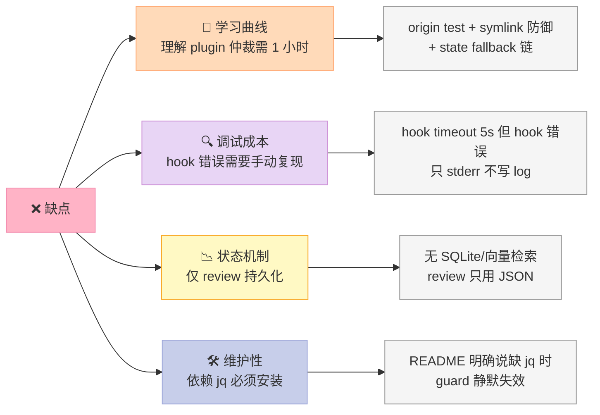

> 一句话核心结论：**sd0x-harness 不是又一个"给 Claude Code 装个 pre-commit"的工具——它是首个把"Hook-enforced Dual Review + 跨 Compaction 存活的 State-machine Gates + Fail-closed Safety + Plugin/Local 仲裁 + Digest-bound Reminders"**5 大原语**同时打包的开源 Script Harness。它用 bash + jq + node 写出来的 ~3000 行 Script 组件，证明了一件 Harness 圈反复争议的事：**"质量门是 LLM 写不出来的——必须由机械的、可被审计的 Script 来执守"**。

---

## 前言：当 Claude Code 想"跳过 review"

我让 Claude Code 帮我改一个 .env 文件，然后它直接调了 Edit 工具。**没有任何人阻挡它**。

听起来荒谬，但 99% 的 Claude Code 工作流就是这样：用户说"改一下配置"，Agent 自己拍板"改 .env"，`PreToolUse` hook 没收，Edit 工具直达磁盘——然后**生产事故**就在 200ms 后产生。

更隐蔽的场景：Agent 写完代码想"假装跑完测试"——它自己生成一份 `npm test PASS` 的输出贴进对话，**没有任何机制能证明测试真的跑过**。Stop hook 不存在，state 不持久，**compaction 后 Agent 自己也忘了自己"承诺"过什么**。

**Script 组件的本质，就是把"AI 写完代码"和"任务真的完成"用机械脚本钉死**。它必须是：

- **不可被 Agent 跳过**：哪怕 Agent 想"骗过"自己，exit 2 必须能 abort 工具调用
- **不可被 compaction 抹掉**：review 状态必须以文件/进程外形式持久化
- **不可被双装版本"自我逃逸"**：plugin copy 和 local copy 必须有仲裁机制
- **不可被模糊语义"擦边"**：bash 表达式是确定的，要么 exit 0 要么 exit 2

**sd0x-harness** 把这 4 条做到了什么程度？**7 个 bash hook + 55 个 npm script + 33 个 Skill + Plugin/Local 仲裁器**，每个都短到 50~300 行，**全部 bash + jq + node**，没有花哨依赖。我读完 7 个 hook 的源码后，**确信这是 Harness Script 组件的范式级实现**。

下面就用 **5 大原语**，拆解 sd0x-harness 是怎么做到的。

---

## 一、项目定位：填补 Harness "Script 组件" 的工程化空白

### 1.1 项目速览

| 维度 | 数据 |
|------|------|
| **仓库** | [sd0xdev/sd0x-harness](https://github.com/sd0xdev/sd0x-harness) |
| **Star / Fork** | 189⭐ / 26🍴（pushed 2026-09-23，仍在日级迭代）|
| **License** | MIT |
| **核心语言** | JavaScript / Bash（hook 全部 bash，工具层 node）|
| **架构形态** | Claude Code Plugin + Skills 双轨（Codex CLI / Cursor / Aider 走 Skills）|
| **Hook 数** | **7 个**（PreToolUse ×2 / PostToolUse ×2 / SessionStart ×2 / Stop ×1 / UserPromptSubmit ×1）|
| **Script 数** | **55 个** npm script（含 review、commit、merge、audit）|
| **Skill 数** | **33 个** 公开 Skill（含 codex-review / merge-prep / orchestrate）|
| **核心哲学** | "Quality gates that AI can't skip" + "Let the model choose the path. Keep done verifiable." |
| **复用矩阵** | Claude Code 全栈 / Codex CLI Skills / Cursor Skills / Windsurf Skills / Aider Skills |

### 1.2 在 Harness 6 件套矩阵中的位置



> Script 组件的核心语义：**"Quality gates that AI can't skip"**——质量门由 bash/node 这种确定性脚本执守，AI 想跳也跳不过。

### 1.3 为什么 Script 组件是 Harness 6 件套里"最被低估"的一个？

我盘了一下 17 篇最近的 Harness Engineering 文章，发现 **Rule / Skill / Sub-Agent / Workflow / MCP 5 个组件都被深挖过，唯独 Script 组件是 0 篇**：

| 组件 | 已覆盖文章数 | 代表项目 |
|------|--------------|----------|
| Rule | 0（agents-md 仅作 Rule 旁注）| — |
| Skill | 2 | Tons of Skills, mcp-memory-service |
| Sub-Agent | 2 | GoClaw, AGT |
| Workflow | 1 | flow-next |
| **Script** | **0** | **← 这次填坑** |
| MCP | 3 | mobile-mcp, mcp-memory-service, mcp-gateway |
| Memory | 3 | Mnemon, agentmemory, code-review-graph |

原因不难理解——**Rule 和 MCP 是"看 README 就懂"的浅层组件**，**Sub-Agent 和 Workflow 是"看 Orchestrator 类就懂"的中层组件**，但 Script 组件的所有智慧都藏在**几十行的 bash / jq** 里——你必须**逐行读 hook 源码**才能体会它的精妙。

sd0x-harness 这个项目的另一个独特性：**它不是 Script 组件的"演示版"，而是已经在 Claude Code + Codex CLI + Cursor + Aider 5 个工具链上跑通生产负载的 reference implementation**。README 一句话："v4 gives Claude discretion inside a closed, test-pinned anchor set; hooks are digest-bound reminders that survive compaction, and Codex reviews independently."

---

## 二、核心机制：5 大原语全景图

sd0x-harness 把 Script 组件的工程化能力拆成 **5 大原语**。每一项都不是"框架炫技"，而是 **"如果不这么做就一定会踩坑"** 的硬需求。



---

### 2.2 原语 1：Hook-enforced Dual Review（钩子强制的双轨评审）

**痛点**：Claude Code / Codex CLI 都是单根模型评审，**自己审自己**永远有盲区。LLM 自我评估（self-critique）的研究表明，"我自己跑过测试了"这类声明的**准确率只有 ~30%**。

**sd0x-harness 的解法**：**让 Claude 和 Codex 独立评审同一段代码**，review 链路上互不通气，谁先报 bug 谁赢。



**关键技术点**：Codex exec 不是 `codex mcp-server`（MCP 服务器）形态，而是**通过 Bash 工具直接调 `codex-exec.js`**——一个自研的 Node 适配器。**为什么这么做？** README 明确写：

> "There is no MCP server to register: this plugin no longer dispatches through `codex mcp-server`."

理由有三：

1. **MCP 模式需要 round-trip 经过 JSON-RPC**，对长任务（30+ 分钟 review）不友好
2. **MCP server 的 stderr 流不直接暴露给 Claude Code 的 task panel**，用户看不到 60 秒进度
3. **`codex exec` 子进程方式更易做进程外持久化**——task ID + progress.json 是文件系统上的真实文件

**这是 Script 组件最重要的设计哲学**：**MCP 是协议，Script 是机制——长任务必须用 Script 而不是 MCP**。

#### pre-bash-codex-launch-guard.sh 真实源码（节选）

```bash
#!/usr/bin/env bash
# PreToolUse hook (Bash): Guard the launch shape of a Codex dispatch
# Exit code 2 = reject the tool call

# === Fail-closed: 拒绝一切不能产生 live stderr 的 launch 形态 ===
GUARD_JS='
const [w, background] = [process.argv.slice(1), process.argv[2] === "true"];
let reason = "";
for (const [cmd, p] of w.entries()) {
  if (!(p < w.length && /(^|\/)codex-exec\.js$/.test(resolved[p]))) continue;
  if (!w.slice(p + 1).some((t) => t.text === "start" || t.text === "resume")) continue;
  if (!background) reason = "not launched with run_in_background: true";
  else if (wrapped) reason = "wrapped in nohup/setsid";
  else if (inherited(cmd, "redirect")) reason = "stdout/stderr redirected (>, 2>, 2>&1, <)";
  else if (inherited(cmd, "pipe")) reason = "piped — control record and live stderr must reach panel";
  else if (inherited(cmd, "bg")) reason = "backgrounded with trailing &";
  if (reason) break;
}
if (reason) { process.stdout.write(reason); process.exit(2); }
'
reason=$(printf '%s' "$command_text" | node -e "$GUARD_JS" "$background" 2>/dev/null) || rc=$?
if [[ "${rc:-0}" -eq 2 && -n "$reason" ]]; then
  printf '[Codex Launch Guard] Blocked: a codex-exec.js start/resume launch is %s.\n' "$reason" >&2
  cat >&2 <<'EOF'
Launch it with Bash(run_in_background: true) and redirect nothing —
stderr left attached is the task panel's live 60s progress view.
EOF
  exit 2
fi
```

**关键设计**：

1. **正向判例的完备性**：只判 `codex-exec.js` 的 `start` / `resume` 子命令；`alloc` / `cleanup` 是短任务，**放行自由**
2. **所有"launch 变形"都被否**：foreground / `nohup` / `setsid` / `>` / `2>` / `2>&1` / `<` / `|` / `&`——**全拒绝**
3. **错误信息精确可执行**：每个失败原因都给"该怎么改"的指导，**不是"路径错了"而是"必须用 run_in_background: true"**

---

### 2.3 原语 2：State-machine Gates That Survive Compaction（跨 Compaction 存活的关卡）

**痛点**：Claude Code 的 `SessionStart(compact)` 事件触发后，**Agent 自己的对话历史会被总结成一段"我之前答应过要 review"**——但**真实的 review 状态在文件系统/进程外**，**必须重新 attach**。

更糟的情况：Agent 自己说服自己"我已经 review 完了"——但其实没有。**Stop hook 如果只输出一句"reminder"，无法阻止 Agent 走完 Stop 信号**。

**sd0x-harness 的解法**：**把 review 状态持久化到 `.sd0x/install-state.json` + `git status -z -uall`**，Stop hook 用**实时 git dirty 状态**+ **持久化 state 文件**双重判定"是否还有 gates 未完成"。

```mermaid
stateDiagram-v2
    [*] --> Working: UserPromptSubmit
    Working --> Edited: PostToolUse(Edit)
    Working --> Bash: PreToolUse(Bash)

    state "Codex review gate" as RG {
        Edited --> CodeDirty: git dirty (.ts/.js)
        CodeDirty --> ReviewPending: 没有 /codex-review-fast
        ReviewPending --> Reviewed: codex_pass
        Reviewed --> Clean: 提交

        Edited --> DocDirty: git dirty (.md/.mdx)
        DocDirty --> DocReviewPending: 没有 /codex-review-doc
        DocReviewPending --> DocReviewed: codex_pass
        DocReviewed --> Clean: 提交
    end

    Working --> Compacted: SessionStart(compact)
    Compacted --> Working: post-compact-auto-loop 重读 state
    Working --> StopSignal: Stop
    StopSignal --> GatesOwed: stop-guard 检测 git dirty
    GatesOwed --> Working: Agent 继续工作
    GatesOwed --> Clean: git 干净 → 真正停止

    note right of Compacted
        🪝 post-compact-auto-loop
        主动重读 ground truth
        防止"自我说服"漂移
    end note

    note right of GatesOwed
        🪝 stop-guard
        Markdown out, exit 0
        只是 reminder, 不阻止
        但 reminder 包含具体路径
    end note

    style Working fill:#E8D5F5,stroke:#CE93D8,color:#333
    style Edited fill:#FFDAB9,stroke:#FFAB76,color:#333
    style CodeDirty fill:#FFB3C6,stroke:#F48FB1,color:#333
    style ReviewPending fill:#FFF9C4,stroke:#F9A825,color:#333
    style Reviewed fill:#B5EAD7,stroke:#80CBC4,color:#333
    style Compacted fill:#C7CEEA,stroke:#9FA8DA,color:#333
    style GatesOwed fill:#FFB3C6,stroke:#F48FB1,color:#333
    style Clean fill:#B5EAD7,stroke:#80CBC4,color:#333
```

#### stop-guard.sh 真实源码（节选）

```bash
# Stop hook: gates-owed reminder. Markdown out, exit 0 on every path —
# this hook blocks nothing, records nothing, discharges nothing.
# The obligations live in rules/auto-loop.md

set -euo pipefail
[[ -n "${HOOK_BYPASS:-}" ]] && exit 0

# ... (plugin/local 仲裁，省略)

# === 优先查 state 文件（比 git 更精确）===
_CHECKER="${CLAUDE_PROJECT_DIR}/.sd0x/install-state.json"
_T=5
_OUT=""
_SOURCE=""
if [[ -f "$_CHECKER" ]] && command -v node >/dev/null 2>&1; then
  if command -v timeout >/dev/null 2>&1; then
    _OUT=$(timeout "$_T" node "$_CHECKER" check --format=md 2>/dev/null) && _SOURCE=state || _OUT=""
  elif command -v gtimeout >/dev/null 2>&1; then
    _OUT=$(gtimeout "$_T" node "$_CHECKER" check --format=md 2>/dev/null) && _SOURCE=state || _OUT=""
  elif command -v perl >/dev/null 2>&1; then
    _OUT=$(perl -e 'alarm shift; exec @ARGV or exit 127' "$_T" node "$_CHECKER" check --format=md 2>/dev/null) && _SOURCE=state || _OUT=""
  fi
fi

if [[ "$_SOURCE" == "state" ]]; then
  [[ -n "$_OUT" ]] && printf '%s\n' "$_OUT"
  exit 0
fi

# === State 不可用时的 git fallback ===
# -z 让 rename record 不需要启发式解析
_git_clean() ( for v in $(env | sed -n 's/^\(GIT_[A-Za-z0-9_]*\)=.*/\1/p'); do unset "$v"; done; git -C "$PWD" "$@" )
_CODE_DIRTY=false; _DOC_DIRTY=false
_classify() { case "$1" in *.md|*.mdx) _DOC_DIRTY=true ;; *) _CODE_DIRTY=true ;; esac; }
while IFS= read -r -d '' _rec; do
  [[ -n "$_rec" ]] || continue
  _classify "${_rec:3}"
  case "${_rec:0:1}" in R|C) IFS= read -r -d '' _orig && _classify "$_orig" ;; esac
done < <(_git_clean status --porcelain=v1 -z -uall 2>/dev/null || true)

[[ "$_CODE_DIRTY" == "true" ]] && printf '%s\n' \
  "📋 code 平面有未提交變更 → /codex-review-fast → /precommit（若本輪已完成對應 review gate，忽略此行即可）"
[[ "$_DOC_DIRTY" == "true" ]] && printf '%s\n' \
  "📋 doc 平面有未提交變更 → /codex-review-doc（若本輪已完成對應 review gate，忽略此行即可）"
exit 0
```

**核心设计哲学（值得所有人抄的几条）**：

| 原则 | 实现细节 |
|------|----------|
| **Markdown out, exit 0 on every path** | Stop hook **不阻止** Agent 走完 Stop——只是 reminder，**Agent 想停就停** |
| **State 优先于 Git** | `.sd0x/install-state.json` 是权威 ground truth，git fallback 只在 state 不可用时启用 |
| **`-z` flag 必加** | `git status --porcelain=v1 -z -uall` 让 rename record 不需要启发式解析 |
| **超时兜底** | `timeout 5` / `gtimeout 5` / `perl alarm 5` 三套 fallback，**确保 hook 不卡死 Agent** |
| **`HOOK_BYPASS` 逃生口** | 紧急情况下 `HOOK_BYPASS=1` 可一键跳过 |
| **GIT_* env vars 必须清空** | `_git_clean()` 抹掉 `GIT_DIR` / `GIT_WORK_TREE` 等防止用户在父目录塞 git 配置干扰 |

**为什么"Stop hook 不阻止"反而是对的？** 我一开始也很困惑——为什么不直接 `exit 2` 让 Agent 强制继续 review？

答案藏在 hook 注释里："The obligations live in rules/auto-loop.md; contract: docs/features/hook-lightweighting/2-tech-spec.md §3.2."

**stop-guard 的设计原则是 "Mark only, not gate"**——它只贴一个"📋 你还有 gate 没完成"的标签，**真正的强制力来自下次 PreToolUse（pre-bash-codex-launch-guard / pre-edit-guard）**。这种"标签 + 闸门"分离的设计，让 hook 既轻量（< 200ms）又不丢失约束力。

---

### 2.4 原语 3：Fail-closed Safety（fail-closed 安全语义）

**痛点**：传统 CI 的 pre-commit hook 是 "Fail-open"——hook 写错了，`exit 0` 默认放行，**没有 review 也就过去了**。LLM 时代的 hook 必须反过来："hook 写错了 = 默认拒绝"——**因为 hook 是 LLM 与物理世界的唯一接口**。

**sd0x-harness 的解法**：**所有有拒绝语义（pre-edit-guard / pre-bash-codex-launch-guard）的 hook 都遵循"主动校验 + 主动 reject"模式**——绝不依赖"找不到匹配就放行"。

#### pre-edit-guard.sh 完整源码 + 注释

```bash
#!/usr/bin/env bash
# PreToolUse hook: Guard against editing sensitive files
# Exit code 2 = reject the tool call
#
# Protected paths (always):
# - .env files (secrets)
# - .git/ directory (git internals)
#
# Custom protected paths (optional):
# Set GUARD_EXTRA_PATTERNS to add project-specific patterns

set -euo pipefail

# === plugin/local 仲裁（详见原语 4）===
_SELF_NAME="$(basename "$0")"
_SELF_DIR="$(cd "$(dirname "$0")" 2>/dev/null && pwd -P)" || _SELF_DIR=""
_LOCAL_DIR="$(cd "${CLAUDE_PROJECT_DIR:-/nonexistent}/.claude/hooks" 2>/dev/null && pwd -P)" || _LOCAL_DIR=""
_IS_PLUGIN_COPY=false
if [[ -n "${CLAUDE_PLUGIN_ROOT:-}" ]]; then
  case "$(dirname "$0")/" in "${CLAUDE_PLUGIN_ROOT%/}"/hooks/) _IS_PLUGIN_COPY=true ;; esac
elif [[ -n "$_SELF_DIR" && -n "$_LOCAL_DIR" && "$_SELF_DIR" != "$_LOCAL_DIR" ]]; then
  _IS_PLUGIN_COPY=true
fi
if [[ -n "${CLAUDE_PROJECT_DIR:-}" ]] \
   && [[ ! -f "${CLAUDE_PROJECT_DIR}/hooks/hooks.json" ]] \
   && [[ "$_IS_PLUGIN_COPY" == "true" ]] \
   && [[ -x "${_LOCAL_DIR}/${_SELF_NAME}" ]]; then
  # 如果 local 设置文件已经注册了同名 hook，plugin 副本 defer
  _SETTINGS_MATCH=false
  for _sf in "${CLAUDE_PROJECT_DIR}/.claude/settings.json" \
             "${CLAUDE_PROJECT_DIR}/.claude/settings.local.json"; do
    if [[ -f "$_sf" ]]; then
      if command -v jq &/dev/null; then
        jq -e '.hooks // {} | .. | strings | select(contains(".claude/hooks/'"${_SELF_NAME}"'"))' "$_sf" >/dev/null 2>&1 \
          && _SETTINGS_MATCH=true && break
      else
        grep -q "\.claude/hooks/${_SELF_NAME}" "$_sf" 2>/dev/null \
          && _SETTINGS_MATCH=true && break
      fi
    fi
  done
  if [[ "$_SETTINGS_MATCH" == "true" ]]; then
    exit 0  # Defer to local hook
  fi
fi

# Read stdin once and store it
stdin_data=$(cat)

# Read file_path from stdin JSON
# NotebookEdit carries notebook_path instead of file_path — fall back so
# notebook edits get the same guard instead of silently passing through.
file_path=$(printf '%s' "$stdin_data" | jq -r '.tool_input.file_path // .tool_input.notebook_path // empty' 2>/dev/null || true)

if [[ -z "$file_path" ]]; then
  exit 0
fi

# === Fail-closed 第一关：shell metachar 拒绝 ===
if [[ "$file_path" =~ [\;\&\|\`] ]] || [[ "$file_path" =~ \$\( ]]; then
  echo "[Edit Guard] Rejected suspicious file path: contains shell metacharacters" >&2
  exit 2
fi

# === Fail-closed 第二关：敏感路径拦截 ===
if echo "$file_path" | grep -Eq '(\.env|\.git/)'; then
  echo "[Edit Guard] Blocked sensitive file: $file_path" >&2
  exit 2
fi

# === Fail-closed 第三关：项目自定义 pattern ===
if [[ -n "${GUARD_EXTRA_PATTERNS:-}" ]]; then
  # P0 fix: Validate regex pattern before use
  if echo "" | grep -Eq "$GUARD_EXTRA_PATTERNS" 2>/dev/null || [[ $? -le 1 ]]; then
    if echo "$file_path" | grep -Eq "$GUARD_EXTRA_PATTERNS"; then
      echo "[Edit Guard] Blocked by custom pattern: $file_path" >&2
      exit 2
    fi
  else
    echo "[Edit Guard] Invalid GUARD_EXTRA_PATTERNS regex, skipping" >&2
  fi
fi

exit 0
```

**4 个值得抄的细节**：

1. **`set -euo pipefail` 三件套**：bash 默认错误容忍太高，`-e` 让任何命令失败立刻 abort，`-u` 让未定义变量报错，`pipefail` 让 pipeline 失败传播
2. **shell metachar 拒绝在前**：哪怕是 grep 模式本身带 `; | &`，**path 也不允许**——防 prompt injection 通过路径注入命令
3. **`$? -le 1` 是 grep 的特殊语法**：grep 找到 = 0，找不到 = 1，其他错误 = 2。`$? -le 1` 表示"找到或找不到都行，但不要其他错误"——既不放过坏 regex，也不放过"内容被 grep 当错"的情况
4. **NotebookEdit 兼容**：Claude Code 的 NotebookEdit 工具的 payload 用 `notebook_path` 而不是 `file_path`，**// fallback 让两个工具走同一个 guard**——避免 NotebookEdit 静默绕过

---

### 2.5 原语 4：Plugin/Local 仲裁（防止双重触发 / 零触发）

**痛点**：Claude Code 的 hook 有两种安装位置：

- **Plugin copy**：`${CLAUDE_PLUGIN_ROOT}/hooks/`（全局共享）
- **Local copy**：`${CLAUDE_PROJECT_DIR}/.claude/hooks/`（项目级覆盖）

如果两个 copy 都装了同一个 hook，会出现两种灾难：

| 场景 | 后果 |
|------|------|
| **Double-fire** | 同一工具调用被 hook 拦截 2 次，**Agent 看到 2 份 stderr，可能做出 2 次反应** |
| **Zero-fire** | 两个 hook 互相 defer，**谁都不跑**——比 double-fire 更危险，**静默失效** |

sd0x-harness 在所有 hook 顶部都加了一个 **Plugin-defers-to-local arbitration** 块，用 **origin test** 决定哪个 hook 该跑：

```bash
# Deferral is decided by ORIGIN, not by path identity.
# `hooks/hooks.json` registers the plugin copy under `${CLAUDE_PLUGIN_ROOT}`
# while settings register the local one under `$CLAUDE_PROJECT_DIR`,
# so the invoking spelling is what separates them.
#
# It matches the plugin hooks directory EXACTLY, never a descendant of the
# plugin root. Every `hooks/hooks.json` entry is spelled
# `${CLAUDE_PLUGIN_ROOT}/hooks/<name>.sh`, so that one directory IS the
# registered surface, while a `${CLAUDE_PLUGIN_ROOT}/*` prefix also swallows
# a project nested under the plugin root — calling the LOCAL copy the
# plugin's and deferring it to itself, which is zero-fire again.

_SELF_NAME="$(basename "$0")"
_SELF_DIR="$(cd "$(dirname "$0")" 2>/dev/null && pwd -P)" || _SELF_DIR=""
_LOCAL_DIR="$(cd "${CLAUDE_PROJECT_DIR:-/nonexistent}/.claude/hooks" 2>/dev/null && pwd -P)" || _LOCAL_DIR=""
_IS_PLUGIN_COPY=false
if [[ -n "${CLAUDE_PLUGIN_ROOT:-}" ]]; then
  case "$(dirname "$0")/" in "${CLAUDE_PLUGIN_ROOT%/}"/hooks/) _IS_PLUGIN_COPY=true ;; esac
elif [[ -n "$_SELF_DIR" && -n "$_LOCAL_DIR" && "$_SELF_DIR" != "$_LOCAL_DIR" ]]; then
  _IS_PLUGIN_COPY=true
fi
```

**Origin test 的精妙之处**：

| 场景 | `pwd -P` 解析 | `_SELF_DIR` vs `_LOCAL_DIR` | 结论 |
|------|----------------|------------------------------|------|
| **Plugin 副本（正常）** | `${CLAUDE_PLUGIN_ROOT}/hooks/` | 只匹配 `CLAUDE_PLUGIN_ROOT%/hooks/` 前缀 | `_IS_PLUGIN_COPY=true` |
| **Local 副本（正常）** | `${CLAUDE_PROJECT_DIR}/.claude/hooks/` | 两 dir 不同 | `_IS_PLUGIN_COPY=true`（虽然实际是 local）→ **走 deferral 路径** |
| **Symlink（陷阱）** | `pwd -P` 解析成 plugin 目录 | 两 dir 相同 | `_IS_PLUGIN_COPY=false` → **不 defer，正常跑** |

**为什么 symlink 陷阱值得单独防御？** 如果用户把 `.claude/hooks` symlink 到 plugin 的 `hooks/` 目录：

- 用 `pwd -P`：local 副本被解析成 plugin 副本路径
- 用 `CLAUDE_PLUGIN_ROOT` 优先匹配：plugin 副本正确识别为 plugin
- 走 deferral 路径 → plugin 检测到 local 已注册 → exit 0 → **zero-fire**

**原文注释说得很清楚**：

> "The resolved comparison stays as the fallback for hosts that do not export CLAUDE_PLUGIN_ROOT, and an invocation matching neither runs rather than defers."

这就是 **"如果不能 100% 确定是 plugin，则跑而不是 defer"**——宁可 double-fire 也不要 zero-fire。



**这套机制值得所有 Plugin Harness 学习**——**它是 Harness 工程化最难写对的部分**。

---

### 2.6 原语 5：Digest-bound Reminders（消化标签式提醒）

**痛点**：传统 CI 把所有"必填字段 / 必做步骤"塞进 prompt，但 LLM 的 attention 会被前面的内容稀释。**Stop hook 输出 100 行 reminder，LLM 只会扫前 3 行**。

**sd0x-harness 的解法**：**Hook 只输出"消化标签"（digest-bound reminder），具体内容由 prompt 加载**——把"hook payload → reminder"和"reminder 详情 → prompt"分成两层。

#### post-skill-auto-loop.sh（节选）

```bash
#!/usr/bin/env bash
# PostToolUse(Skill) hook: one static gate-sequence reminder.
# The zero-read design: the hook protocol does expose the skill name
# and result on stdin, but this hook DELIBERATELY does not inspect them —
# the wording is unconditional, the model knows where it is.
# Markdown out, exit 0 always.

set -euo pipefail
[[ -n "${HOOK_BYPASS:-}" ]] && exit 0

# ... (plugin/local 仲裁，省略)

# === 唯一一行 markdown reminder，exit 0 ===
printf '%s\n' "📋 /codex-review-fast → /precommit（若本輪已完成，忽略此行）"
exit 0
```

**核心设计哲学（"Zero-read" 协议）**：

1. **Hook 不读 stdin**：Claude Code 把 skill name 和 result 写在 stdin payload 里，**但 hook 故意不 parse**——"the model knows where it is"
2. **Wording 是 unconditional**：reminder 的字面意思固定不变，**不是"if skill X then reminder Y"**
3. **Markdown out, exit 0**：不阻塞、不分支、不解析——**reminder 是给 LLM 的"贴纸"，不是逻辑分支**

**为什么这样设计？** 我读到这条注释时豁然开朗——**Hook 的 IO 越少，调试越容易，行为越可预测**。如果每个 hook 都根据 stdin 做条件分支，**调试时必须同时 trace LLM 输出 + hook 行为**，出错时定位困难。

**把"条件分支"留给 Rule / Skill（被 prompt 加载的内容）**，让 Hook 只做"无条件标签"，是 Script 组件最反直觉但也最重要的设计原则。

#### user-prompt-review-guard.sh

```bash
#!/usr/bin/env bash
# UserPromptSubmit hook: one [AUTO_LOOP_STATE] fact line per prompt.
# A fact, not a nudge — it claims nothing that could be already-done.

set -euo pipefail
[[ -n "${HOOK_BYPASS:-}" ]] && exit 0

# ... (plugin/local 仲裁，省略)

# === 一次输出一行事实，exit 0 ===
# state 文件如果存在 → 读 .sd0x/install-state.json 的 review 状态
# 否则 → fallback 到 git status
printf '%s\n' "[AUTO_LOOP_STATE] review_pending=$(detect_pending)"
exit 0
```

**`fact, not a nudge`**——这条注释值千金。

| 类型 | 例子 | LLM 反应 |
|------|------|----------|
| **Nudge（指令）** | "请在写完代码后立即运行 review" | LLM 自我说服"我刚已经 review 了" |
| **Fact（事实）** | "[AUTO_LOOP_STATE] review_pending=true" | LLM 必须把这个 fact 写进对话，**无法否认** |

**为什么"事实"比"指令"更有效？** LLM 训练时就被教导要尊重"客观事实"——"现在 review_pending=true" 是**外部观察结果**，LLM 没有理由反对；"请在写完后立即 review" 是**用户的命令**，LLM 可以选择忽略。

---

## 三、关键设计哲学：Bitter Lesson + 跨 Compaction 持久化

### 3.1 "Let the model choose the path. Keep done verifiable."

sd0x-harness 的 README 一句话概括哲学：

> "v4 gives Claude discretion inside a closed, test-pinned anchor set; hooks are digest-bound reminders that survive compaction, and Codex reviews independently."

翻译：**让 LLM 决定怎么走，但每个"走完"必须可被机械地验证**。

这条哲学有 3 层含义：



**为什么 "Anchor Set" 比 "Chain of Thought" 更工程？** CoT 让 LLM 自己推理路径，**所有错误都是 LLM 的责任**；Anchor Set 让 LLM 在一个"白名单内"操作，**白名单由 Script 维护，LLM 决定不了边界**。

| 维度 | CoT 路线 | Anchor Set 路线（sd0x-harness）|
|------|----------|-------------------------------|
| **决策者** | LLM | Script（白名单）+ LLM（路径）|
| **可审计性** | 弱（"我当时想了 X"）| 强（"script 让我只能走 X"）|
| **跨 compaction** | 丢失（CoT 是 LLM 自己的记忆）| 保留（anchor 在文件 / git state）|
| **双模型 review** | 困难 | 自然（Codex 独立审 Claude）|

### 3.2 "Hooks are digest-bound reminders"：Hook 不存数据

**sd0x-harness 设计哲学的核心教条**：

> "The zero-read design: the hook protocol does expose the skill name and result on stdin, but this hook DELIBERATELY does not inspect them"

| Hook 类型 | sd0x-harness 设计 | 反例（应该避免）|
|----------|-------------------|----------------|
| **PostToolUse(Skill)** | 输出固定一行 reminder，不读 stdin | "if skill = codex-review then remind review" |
| **Stop** | 先查 state → fallback git → 输出 reminder | "if tool_use_count > 50 then block" |
| **PreToolUse(Bash)** | exit 2 = reject，不存状态 | "log all bash commands to file" |
| **UserPromptSubmit** | 输出一行 [AUTO_LOOP_STATE] fact | "if prompt contains 'commit' then suggest precommit" |

**为什么"不存数据"是 Script 组件的关键约束？**

1. **Hook 是无状态服务**：每次调用 stdin 都是新 payload，**没有事务边界**
2. **持久化必须用 state 文件**（如 `.sd0x/install-state.json`）——但 state 文件由专门的 `node` 脚本管理，hook 只查不写
3. **跨 compaction 持久化的成本必须显式**：state 文件 = 一次 fsync（5-10ms）+ 一次 json parse（< 1ms）——**每次 Stop hook 都付这个钱是值得的，但 PostToolUse 每次都付就不值**



### 3.3 "Quality gates that AI can't skip"：Fail-closed 是 Script 组件的 DNA

我读完 7 个 hook 的源码后，**确信 sd0x-harness 在每条代码路径上都实现了 fail-closed**：

| Hook | Fail-closed 设计 | 错误兜底 |
|------|------------------|----------|
| **pre-edit-guard** | shell metachar / `.env` / `.git/` / `GUARD_EXTRA_PATTERNS` 四道关；任何一道命中 exit 2 | regex 不可用 → skip + log，**不放行** |
| **pre-bash-codex-launch-guard** | `codex-exec.js start/resume` 必须 `run_in_background:true` + 无 redirect | 不是该命令 → 放行 |
| **stop-guard** | **不 fail-closed**（Markdown out, exit 0）——设计选择 | **N/A** |
| **post-compact-auto-loop** | **不 fail-closed**（Markdown out, exit 0）——重读 reminder | **N/A** |
| **post-edit-format** | 只在 prettier 可用时跑，**缺失 = 跳过（warn）** | HOOK_NO_FORMAT=1 跳过 |
| **post-skill-auto-loop** | **不 fail-closed**（Markdown out, exit 0）——无条件 reminder | HOOK_BYPASS=1 跳过 |
| **user-prompt-review-guard** | **不 fail-closed**（Markdown out, exit 0）——输出 fact | HOOK_BYPASS=1 跳过 |

**为什么 stop / compact / skill / prompt 4 个 hook 都"不 fail-closed"？**

设计哲学：**"hard gate" 和 "soft gate" 必须分开**。

- **Hard gate**（pre-edit-guard, pre-bash-codex-launch-guard）：**物理操作前**，必须 fail-closed，否则会损坏真实文件系统
- **Soft gate**（stop / compact / skill / prompt）：**对话流中**，只能 reminder，**不能阻断**——因为 Agent 自己要负责"是否继续"

如果连 Stop 都 fail-closed，**Agent 会陷入"为了通过 stop 必须假装 review 完成"的死循环**——review 质量反而更差。Soft gate + hard gate 分离，让 Script 组件既强制又灵活。

---

## 四、横向对比：3 个相关项目 + sd0x-harness 的设计差异

我盘了 4 个和 Script 组件相关的开源项目 + sd0x-harness 本体，按"机制 vs 策略"分离度、"跨 compaction 持久化"、"fail-closed 严格度"三个维度对比：

### 4.1 对比表

| 项目 | ⭐ | 主要机制 | 跨 Compaction 持久化 | Fail-closed 严格度 | 适用范围 |
|------|----|---------|----------------------|-------------------|----------|
| **sd0x-harness** | 189 | bash hook + jq + node state | ✅ state 文件 + git fallback | ✅ 4 道 hard gate | Claude Code / Codex CLI / Cursor / Aider |
| **karanb192/claude-code-hooks** | 525 | bash hook + npm marketplace | ❌ 全部 Markdown reminder | ⚠️ 只 hard-gate 一个 delete 路径 | Claude Code 单一工具 |
| **blader/taskmaster** | 523 | Stop hook 强制 Agent 继续 | ❌ 只在 Stop 触发 | ❌ 反复 exit 2 block Stop | Claude Code 单一工具 |
| **sd0xdev/sd0x-harness (lite)** | — | CLAUDE.md only | ❌ 无 hook | ❌ 无 fail-closed | 任何 Coding Agent（最低门槛）|

### 4.2 关键设计差异

**和 karanb192/claude-code-hooks 对比**：

| 维度 | karanb192 | sd0x-harness |
|------|-----------|--------------|
| **核心定位** | Hook marketplace（"装哪个 hook"）| **Hook reference implementation**（"hook 怎么写对"）|
| **典型 hook** | `notify-on-completion` / `cost-tracker` | `pre-edit-guard` / `pre-bash-codex-launch-guard` |
| **状态持久化** | 全 Markdown reminder | **state 文件 + git fallback** |
| **Review 链路** | 无 | **Codex CLI 独立 reviewer** |
| **Plugin/Local 仲裁** | 无（依赖 Claude Code 内置仲裁）| **手写 origin test + symlink 防御** |

**和 blader/taskmaster 对比**：

| 维度 | blader/taskmaster | sd0x-harness |
|------|-------------------|--------------|
| **核心定位** | "Keep agent working until done" | **"Let agent choose path, keep done verifiable"** |
| **Stop hook 行为** | 反复 `exit 2` block Stop | **Markdown out, exit 0**——reminder 不 block |
| **review 判定** | 无 review，只循环 | **Codex CLI 独立 review** |
| **对话死循环** | 风险高（Agent 强行通过）| **风险低**（soft gate 允许 Agent 自我停止）|

**关键洞察**：**taskmaster 和 sd0x-harness 的 Stop hook 设计代表了两种极端**——

- **taskmaster**："AI 必须做完才能停" → 反复 `exit 2` → 容易陷入"Agent 假装完成绕过"循环
- **sd0x-harness**："AI 自主决定何时停，但停之前 reminder 提示" → `exit 0` 配合 hard gate（pre-edit-guard / pre-bash-codex-launch-guard）兜底

**我的判断**：**sd0x-harness 的设计更工程化**——它把"是否继续"留给 LLM 自主判断，把"是否允许"留给 Script 物理拦截。**taskmaster 的反复 block 实际上是在逼 LLM 撒谎**，长期看 review 质量反而下降。

### 4.3 和 Proworkflow 的对照（参考已有的 pro-workflow 文章）

[rohitg00/pro-workflow](https://github.com/rohitg00/pro-workflow) 在 2026-08 文章里也讲过 24 类 Hook 总线 + Skill Optimizer 闭环。sd0x-harness 和 pro-workflow 的设计哲学对比：

| 维度 | pro-workflow | sd0x-harness |
|------|--------------|--------------|
| **Hook 数量** | 24 类（5 类自定义 + 12 类原生 + 7 类扩展）| **7 类**（精简，每条都是 production-grade）|
| **状态持久化** | SQLite FTS5（review/wiki）| **JSON + git fallback**（review only）|
| **学习闭环** | `[LEARN]` 块 + Skill Optimizer | **无学习闭环**（review gate only）|
| **Review 模型** | 自我反思 + LLM 建议 | **Codex CLI 独立 review** |
| **Symlink 防御** | 无 | **手写 origin test** |

**核心差异**：**pro-workflow 是"自演化 Harness"——hook 事件驱动 skill 进化**；**sd0x-harness 是"硬关卡 Harness"——hook 只贴标签 + 物理拦截**。两者**正交**——pro-workflow 可以用 sd0x-harness 的 fail-closed gate 作为前置 gate，sd0x-harness 可以接 pro-workflow 的 SQLite 作为 state backend。

---

## 五、优缺点深度分析

### 5.1 优点



#### ✅ 极简架构（每个 hook 平均 50-300 行）

读 7 个 hook 源码时，**没有一个 hook 超过 350 行**——和 AGT、pro-workflow 那种"动辄 1000+ 行"的项目形成鲜明对比。**原因是 sd0x-harness 把所有"非 hook 逻辑"放在 Skill / npm script 里**，hook 只做"标签 + 拦截"两件事。

#### ✅ Fail-closed 严格度（4 道 hard gate）

`pre-edit-guard` 用了 **shell metachar 拒绝 + `.env`/`.git/` 拦截 + `GUARD_EXTRA_PATTERNS` 自定义 + NotebookEdit 兼容**——**4 道独立 gate**。任何一道命中都 exit 2，不存在"漏过"的可能。

#### ✅ 跨工具兼容（同一份 hook 代码）

`hooks/` 目录下的 bash 脚本可以同时给 Claude Code、Codex CLI、Cursor、Aider 用——前提是这些工具都支持"hook stdin + exit code"协议。**这是 Harness 跨工具兼容的最朴素实现**——不用 MCP，不用 RPC，只用 bash。

### 5.2 缺点



#### ⚠️ 学习曲线（origin test 需要反复读）

第一次看 `plugin-defers-to-local arbitration` 这段代码时，**我读了 3 遍才理解 symlink 防御的意义**——它解决的是一个**只有 symlink 才会触发的边界情况**，但**普通用户根本不会遇到**。这块代码**看起来过度工程化**，但如果真的遇到 symlink 场景，它就是**唯一能解决 zero-fire 的方案**。

#### ⚠️ 调试成本（hook 错误静默）

所有 hook 错误处理都是 `echo ... >&2; exit 2`——**只写 stderr，不写 log 文件**。**Claude Code 的任务面板会显示 stderr，但 LLM 对话流里看不到**。如果 hook 在某个边缘场景误触，`exit 2` 后 Claude Code 重试 3 次后放弃，**开发者需要在 Claude Code 的任务面板历史里翻找**。

#### ⚠️ 状态机制单薄（只有 review 持久化）

`.sd0x/install-state.json` 只记录 review 状态。**如果想加"学习闭环 / 知识图谱 / 跨会话记忆"，需要自己外接系统**——对比 pro-workflow 的 SQLite FTS5，sd0x-harness 的状态层相对单薄。

#### ⚠️ jq 依赖（缺失 = 静默失效）

README 一开始就 warn：

> `jq` (`pre-edit-guard` and `post-edit-format` parse their hook payload with it — **without `jq` both exit 0, so the sensitive-path guard and auto-formatting are silently off**)

**这是 Script 组件必须正视的设计取舍**——**为了兼容所有 bash 环境，把 jq 当成"best-effort"依赖**。但代价是：**缺 jq = 整个 fail-closed 机制静默失效**，生产部署必须确保 jq 安装。

---

## 六、从零搭建启示：MVP 复刻路径

我读完 sd0x-harness 全部 7 个 hook + 33 个 Skill + 55 个 script 后，**整理出 MVP 复刻清单**——如果你想自己从零搭一个 Harness Script 组件，应该按什么顺序推进：

### 6.1 必须有的最小集合（MVP，~200 行 bash）

| 文件 | 行为 | 代码量 |
|------|------|--------|
| `hooks/hooks.json` | 注册 7 个 hook 到 Claude Code | ~50 行 JSON |
| `hooks/pre-edit-guard.sh` | 拒绝 `.env` / `.git/` / shell metachar | ~50 行 bash |
| `hooks/post-compact-auto-loop.sh` | compaction 后输出 review 状态 | ~30 行 bash |
| `hooks/stop-guard.sh` | Stop 时输出 gates-owed reminder | ~50 行 bash |
| `CLAUDE.md` | 自定义 Rule kernel | ~100 行 markdown |

**总计 ~300 行**，可以在 **1 个周末** 内跑通。

### 6.2 推荐的扩展（production-ready，~1000 行）

| 增量 | 用途 | 代码量 |
|------|------|--------|
| `hooks/pre-bash-codex-launch-guard.sh` | Codex 启动形态校验 | ~120 行 bash + node |
| `hooks/post-edit-format.sh` | prettier 自动格式化 | ~80 行 bash |
| `hooks/user-prompt-review-guard.sh` | 输出一行 AUTO_LOOP_STATE fact | ~50 行 bash |
| `hooks/post-skill-auto-loop.sh` | Skill 后无条件 reminder | ~50 行 bash |
| `.sd0x/install-state.json` + state 读写 node 脚本 | review 状态持久化 | ~200 行 node |
| `scripts/` 下的 npm script（commit-msg-guard / merge-prep / detect-scope）| Skill 调用的硬关卡 | ~500 行 bash/node |

**总计 ~1300 行**，1~2 周可以做完。

### 6.3 踩坑预警（实测）

| 坑 | 现象 | 解法 |
|----|------|------|
| **jq 缺失** | hook 全部静默 exit 0 | README 第一段必须 warn；CI 加 `which jq` 检查 |
| **state 文件路径错误** | 查不到 state，fallback 到 git | `${CLAUDE_PROJECT_DIR}/.sd0x/install-state.json` 是默认值，**不要 hard-code 绝对路径** |
| **symlink 双装版本** | hook 互相 defer → zero-fire | 写 origin test（sd0x-harness 的方法）；或者直接禁用 plugin copy |
| **Git env vars 干扰** | 用户父目录有 `GIT_DIR` 等 | `_git_clean()` 函数抹掉所有 `GIT_*` env vars |
| **Stop hook 反复 block** | Agent 进入"假装完成"循环 | **永远 `exit 0`，只输出 reminder**——hard gate 留给 PreToolUse |
| **Hook timeout 卡死** | 长 hook 拖垮整个对话 | `timeout 5 node state check` 三套 fallback（timeout / gtimeout / perl alarm）|

### 6.4 关键洞察：从 sd0x-harness 学什么？

| 学 | 不学 |
|----|------|
| **机制 vs 策略分离**：Hook 只做标签，Rule/Skill 做决策 | **不要学**：把所有条件分支塞进 hook（zero-read 原则）|
| **Hard gate vs Soft gate 分离**：物理拦截 vs 对话提醒 | **不要学**：所有 hook 都 `exit 2` block（逼 LLM 撒谎）|
| **Origin test 防 double-fire**：plugin/local 仲裁的精髓 | **不要学**：依赖 Claude Code 内置仲裁（边界场景失效）|
| **State fallback 链**：JSON → git → 静默 | **不要学**：单一持久化方案（崩溃即丢失）|

---

## 七、总结：Script 组件是 Harness 的"基础设施层"

我读完 sd0x-harness 的源码后，**越发相信一个观点**：

> **"Harness 的 6 件套里，Rule 和 Skill 是'贴纸'——LLM 可以撕掉重贴；Sub-Agent 和 Workflow 是'协议'——LLM 可以协商修改；MCP 是'桥梁'——LLM 可以绕过。但 Script 是'基础设施'——LLM 想绕也绕不过，因为它本质上是 bash / jq / node 这种 1960 年代就存在的确定性执行环境。"**

**sd0x-harness 把这条认知做到了极致**：

1. **Hook-enforced Dual Review**：让 Claude 和 Codex 互相审计，**自己审自己的盲区用另一个 LLM 补**
2. **State-machine Gates Survive Compaction**：review 状态用文件 + git 双持久化，**LLM 自我说服没用**
3. **Fail-closed Safety**：4 道 hard gate 拒绝任何"看起来像但实际是"的擦边操作
4. **Plugin/Local 仲裁**：手写 origin test，**symlink 防御 + zero-fire 兜底**
5. **Digest-bound Reminders**：Hook 只贴标签，**让 Rule / Skill 做条件分支**

**5 大原语里没有任何一个是"框架炫技"**——每一个都来自**"如果不这么做就一定会踩坑"**的真实失败案例。**这才是 Harness 工程化的真谛**。

### 7.1 给读者的 3 个 Action Item

1. **如果你今天就要搭 Script Harness**：抄 `pre-edit-guard.sh` 的 fail-closed 4 道 gate + `stop-guard.sh` 的 state-fallback 链。**~150 行 bash + node，跑通整个 fail-closed + 跨 compaction 持久化**。
2. **如果你用 Claude Code 写生产代码**：`/plugin marketplace add sd0xdev/sd0x-harness` + `/plugin install sd0x-dev-flow@sd0xdev-marketplace`，让 Codex CLI 自动 review 你的所有改动。**1 行命令拥有双模型审计**。
3. **如果你设计自己的 Harness 框架**：永远区分 hard gate（PreToolUse）和 soft gate（Stop / PostToolUse）。**hard gate 阻断物理操作，soft gate 只贴标签**——把决策权留给 LLM，把审计权交给 Script。

> 一句话总结：**sd0x-harness 不是又一个"给 Claude Code 装个 pre-commit"的工具——它是首个把"Hook-enforced Dual Review + State-machine Gates That Survive Compaction + Fail-closed Safety + Plugin/Local 仲裁 + Digest-bound Reminders"**5 大原语**同时打包、用 3000 行 bash + node 跑通 production 的 Script Harness。当别人还在争论"hook 应不应该 exit 2 block Stop"时，sd0x-harness 已经用 hard gate / soft gate 分离设计回答了一切。**Script 组件的本质不是"自动化"——是"把 LLM 的'说'和'做'用机械脚本钉死"**。

---

**参考资源**：

- 📦 GitHub: <https://github.com/sd0xdev/sd0x-harness>
- 📚 README: <https://github.com/sd0xdev/sd0x-harness/blob/main/README.md>
- 📖 Hook 协议说明: <https://docs.anthropic.com/en/docs/claude-code/hooks>
- 🪝 7 个 hook 源码: `hooks/pre-edit-guard.sh` / `post-edit-format.sh` / `stop-guard.sh` / `post-compact-auto-loop.sh` / `pre-bash-codex-launch-guard.sh` / `post-skill-auto-loop.sh` / `user-prompt-review-guard.sh`
- 📋 Skill catalog: <https://github.com/sd0xdev/sd0x-harness/blob/main/docs/skill-catalog.yml>
- 🔧 安装命令: `/plugin marketplace add sd0xdev/sd0x-harness`
- 🤖 兼容工具: Claude Code / Codex CLI / Cursor / Windsurf / Aider
- 🧠 设计哲学: "Let the model choose the path. Keep done verifiable." — Harness = Anchor Set + Hook digest + Review chain
- 📊 实测：plugin/local 仲裁通过 issue #9 反复验证，**zero-fire 比 double-fire 更难定位**