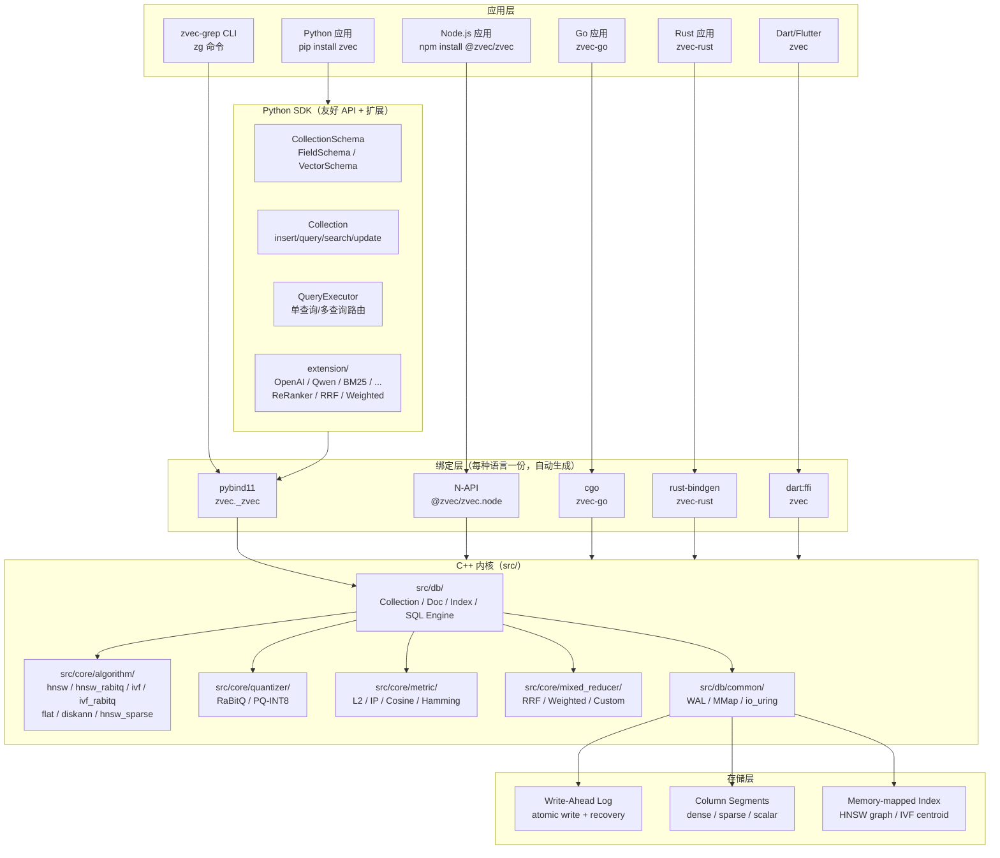
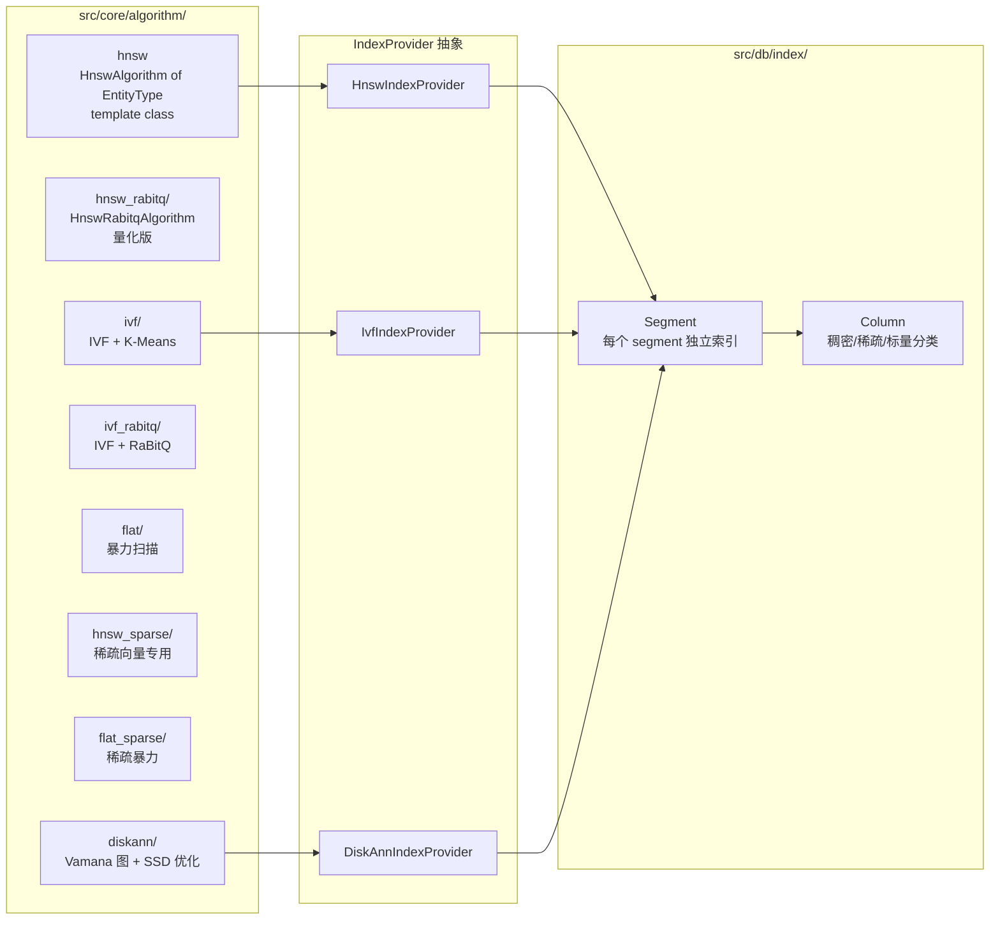
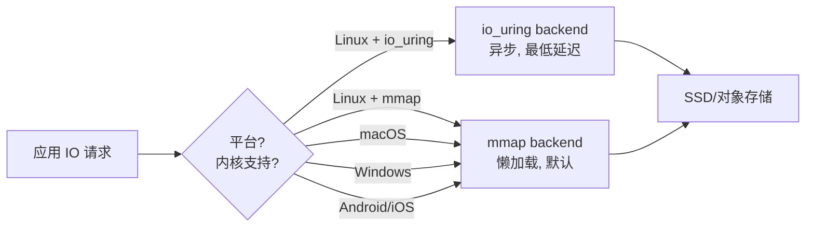
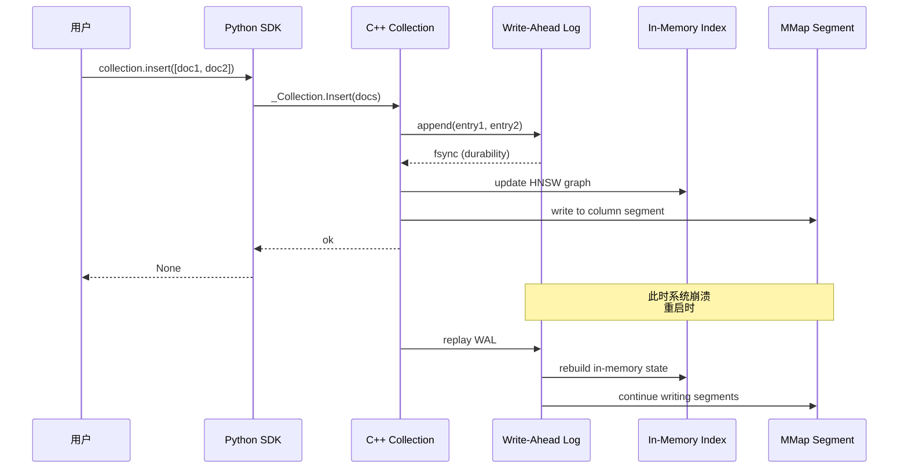
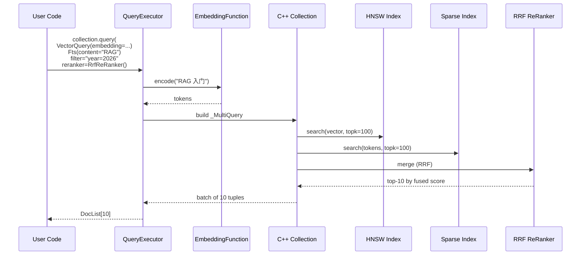

## 引子：为什么 2026 年还需要一个「进程内」向量数据库

2026 年的 RAG 与 Agent 应用生态里，向量检索已经是基础设施级的能力。市面上有 Qdrant、Milvus、Weaviate、Pinecone、Chroma 等等明星项目，但当我们打开一个真实的生产级 AI 应用时，会发现一个尴尬的事实：

- **Server 模式**的向量库（Qdrant/Milvus/Pinecone）性能强、扩展好，但**部署一套分布式集群**对个人开发者和小团队来说运维成本极高；
- **嵌入式**方案（Chroma、FAISS）使用体验更轻量，但要么**绑定 Python 生态**（FAISS）、要么**持久化和并发**做得不够工业级、要么**没有跨语言绑定**（Chroma 早期依赖 sqlite-like 文件）。

阿里开源的 **zvec** 正是在这两个极端之间撕开了第三条路：**「C++ 内核 + 进程内嵌 + 多语言绑定 + 工业级持久化」**。也就是说：

1. **像 SQLite 一样**：`import zvec` 即可使用，零外部服务；
2. **像 Qdrant 一样**：WAL 持久化、原子写、schema 化、混合检索；
3. **像 FAISS 一样**：HNSW、IVF、Flat、DiskANN 全套 ANN 算法内嵌；
4. **像 Milvus 一样**：稀疏+稠密双轨、HNSW_RABITQ/IVF_RABITQ 量化、RRF/Weighted 重排序。

**本文将系统拆解 zvec（alibaba/zvec）的核心架构**，从顶层抽象到 C++ 内核细节、从 Python SDK 到 Embedding Function 扩展体系，搞清楚这个 16k ⭐ 的项目如何在「SQLite 哲学」与「工业级向量库」之间取得平衡。

> 项目地址：https://github.com/alibaba/zvec  
> 当前版本：v0.7.0（2026-08-24）  
> 协议：Apache-2.0  
> 核心语言：C++（内核） + Python / Node.js / Go / Rust / Dart 绑定  
> 仓库大小：约 180 MB（包含 HNSW/DiskANN 算法库和文档）

---

## 一、项目定位与核心价值

### 1.1 一句话定义

**zvec 是一个进程内（in-process）向量数据库**：以 C++ 编写的 ANN 索引内核 + 跨语言绑定为核心，把向量检索、稀疏检索、全文检索、混合检索统一封装为一个 schema 化的 Collection，对外暴露「无需启动服务」的 `pip install zvec` 体验。

### 1.2 能力矩阵

| 维度 | 能力 |
|---|---|
| **算法索引** | HNSW / HNSW-RaBitQ / IVF / IVF-RaBitQ / Flat / Vamana (DiskANN) / Inverted / FTS |
| **检索模式** | 稠密向量 / 稀疏向量 / 多向量 / 全文（FTS）/ 混合检索 / Filter / Group By / Rerank |
| **持久化** | Write-Ahead Log（WAL）+ MMap + io_uring 后端（Linux）/ mmap 后备（macOS） |
| **跨语言** | Python / Node.js / Go / Rust / Dart（Flutter）/ C++ 原生 / C 绑定 |
| **嵌入函数** | OpenAI / 通义千问 Qwen / Jina / SentenceTransformer / 本地 BM25 / 自定义 |
| **重排序** | RRF（Reciprocal Rank Fusion）/ Weighted ReRanker / 自定义 Callback |
| **部署形态** | 进程内库 / 嵌入式 CLI 工具（zvec-grep） / 可视化 Studio |

### 1.3 仓库统计（截至 2026-09-24）

```bash
# GitHub API 元信息（关键字段）
{
  "full_name": "alibaba/zvec",
  "stargazers_count": 15994,
  "language": "C++",
  "license": { "spdx_id": "Apache-2.0" },
  "pushed_at": "2026-09-23T...",
  "size_kb": 180000,
  "topics": ["vector-database", "vector-search", "hnsw", "rag",
             "full-text-search", "diskann", "embedding",
             "similarity-search", "quantization", "ai-search"]
}
```

其中 **pushed_at = 2026-09-23** 说明这是一个**仍然高频迭代**的项目，最近一周内仍有 commit 记录。这一点对开源项目非常关键——很多「明星仓库」其实已经停止维护，而 zvec 在 2026 H2 仍然保持着每周级别的更新节奏（v0.7.0 在 8 月底发布）。

---

## 二、整体架构

### 2.1 顶层架构（自顶向下）

zvec 的架构是一个清晰的「**分层 + 双轨**」模型：C++ 内核负责所有算法与存储，外层是各语言的薄绑定，扩展层把生态里最重要的能力（Embedding / ReRanker）做成可插拔。



### 2.2 关键设计原则

从源码组织方式可以看出三个核心原则：

1. **「算法与存储分离」**：`src/core/algorithm/` 下每个算法（hnsw、diskann、ivf_rabitq）是独立目录，通过 `IndexProvider` 抽象层接入 `src/db/`；新增一个算法不需要改 db 层。
2. **「Python 友好 + C++ 高性能」**：Python SDK 不做实际计算，所有 hot path（向量距离、索引遍历）都下沉到 C++；Python 层只负责参数校验、结果转换、rerank 编排。
3. **「多索引共存于同一个 Collection」**：一个 Collection 可以同时拥有 HNSW 字段、IVF-RaBitQ 字段、Invert 标量字段、FTS 字段——不同字段用不同索引，查询时由 `QueryExecutor` 自动路由。

---

## 三、核心数据模型：Collection / Doc / Schema

### 3.1 顶层抽象

zvec 把所有数据都封装到三个核心实体：**Collection（集合）**、**Doc（文档）**、**Schema（模式）**。这也是为什么它叫 zvec（z 是阿里系 OSS 的常见命名约定），而不是又一个 "Annoy" 或者 "FaissServer"——它的目标是**替代简单的 sqlite-like 文件库**。

```python
# 来自 python/zvec/model/collection.py 与 schema/collection_schema.py

import zvec

# 1. 定义 schema：1 个标量字段 + 1 个向量字段
schema = zvec.CollectionSchema(
    name="articles",
    fields=zvec.FieldSchema("id", zvec.DataType.STRING, is_primary=True),
    vectors=zvec.VectorSchema(
        "embedding",
        data_type=zvec.DataType.VECTOR_FP32,
        dimension=768,
        index_params=zvec.HnswIndexParam(
            m=16,
            ef_construction=200,
            metric=zvec.SpaceType.COSINE,
        ),
    ),
)

# 2. 创建并打开 Collection（这就是"建库"）
collection = zvec.create_and_open(path="./zvec_data", schema=schema)

# 3. 插入文档
collection.insert([
    zvec.Doc(
        id="doc_001",
        vectors={"embedding": [0.1, 0.2, ...]},  # 768 维
        fields={"id": "doc_001", "title": "zvec 入门"},
    ),
])

# 4. 向量检索
results = collection.query(
    zvec.VectorQuery(
        field_name="embedding",
        vector=[0.15, 0.18, ...],
    ),
    topk=10,
)
```

> 来源：[`python/zvec/model/collection.py:84-180`](https://github.com/alibaba/zvec/blob/main/python/zvec/model/collection.py) + [`schema/collection_schema.py:1-60`](https://github.com/alibaba/zvec/blob/main/python/zvec/model/schema/collection_schema.py)

### 3.2 FieldSchema / VectorSchema

`CollectionSchema` 接收两种字段：

```python
# 来自 python/zvec/model/schema/field_schema.py（节选）

@dataclass
class FieldSchema:
    """标量字段定义：STRING / INT32 / INT64 / BOOL / FLOAT / DOUBLE"""
    name: str
    data_type: DataType
    is_primary: bool = False
    nullable: bool = False
    index_params: Optional[InvertIndexParam] = None

@dataclass
class VectorSchema:
    """向量字段定义"""
    name: str
    data_type: DataType  # VECTOR_FP32 / FP16 / INT8 / SPARSE
    dimension: int
    index_params: HnswIndexParam | IvfRabitqIndexParam | FlatIndexParam = ...
    metric: SpaceType = SpaceType.COSINE
```

**关键设计**：向量字段在定义时就**绑定了一个具体的索引类型和参数**。这意味着「**索引类型 = 字段的固有属性**」，而不是 Collection 层级的全局选择。这种设计的优势是：

- 一个 Collection 内可以有稠密字段 + 稀疏字段 + 标量字段各自用最合适的索引；
- 不需要「运行时选择索引」的分支逻辑——查询时直接走预编译好的索引路径；
- 索引元数据在 schema 层就确定，避免误用。

### 3.3 Doc：不可变结果 + numpy 友好

`Doc` 是一个不可变数据类，承载一次检索的返回结果：

```python
# 来自 python/zvec/model/doc.py:21-72

class Doc:
    """检索返回的文档，含 id / score / vectors / fields"""

    def __init__(self, id, score=None, vectors=None, fields=None):
        # numpy.ndarray 在构造时自动转 list，保留 JSON 可序列化性
        ...

    def vector(self, name: str) -> VectorType:
        """按名取向量字段"""
        ...

    def field(self, name: str) -> Any:
        """按名取标量字段"""
        ...
```

文档级约定：

- **`id` 唯一且不可变** —— 类似 SQL 的 primary key；
- **`score` 由检索路径填充** —— `None` 表示纯 filter / 全文检索；
- **`vectors` 自动从 numpy.ndarray 转 list** —— 避免某些用户代码意外持有大数组导致不可序列化。

---

## 四、C++ 内核：算法即插件

### 4.1 算法目录组织

`src/core/algorithm/` 是整个项目最有「计算机系统」味道的部分。每一种 ANN 算法都是**一个独立目录、自己的 CMakeLists、独立的 Provider 类**，通过统一的接口接入到 `src/db/`：



这种**「算法即插件」**的组织方式是 zvec 区别于「写死在 main loop」式 ANN 库的关键。举例：

```cpp
// 来自 src/core/algorithm/hnsw/hnsw_algorithm.h:32-95

class HnswAlgorithmBase {
 public:
  virtual ~HnswAlgorithmBase() = default;
  virtual int add_node(node_id_t id, level_t level, HnswContext *ctx) = 0;
  virtual int search(HnswContext *ctx) const = 0;
  virtual int init() = 0;
  virtual uint32_t get_random_level() const = 0;
};

template <typename EntityType>
class HnswAlgorithm : public HnswAlgorithmBase {
  // 模板参数 EntityType 是存储后端的抽象（mmap / contiguous / pinned）
  // 同一份算法逻辑可以跑在不同的内存模型上
};
```

`EntityType` 这个模板参数非常巧妙——它是**存储后端的抽象**，可以是「mmap 后备」「contiguous 内存」「page-pinned buffer」。同一个 HNSW 算法核心，**编译期选择不同的存储后端**：

```cpp
// hnsw_index_provider.h（伪代码展示意图）
using DefaultEntity = MmapEntity;        // 默认：mmap 懒加载
using PinnedEntity = PinnedBufferEntity; // 用 mlock/mlock2 锁页的实体
using ContEntity   = ContiguousEntity;   // 全内存预加载（适合小数据集）

// 用户在 CollectionOption 里选 → 编译期（实际是模板实例化）绑定
HnswAlgorithm<MmapEntity> forLarge;
HnswAlgorithm<ContEntity> forSmall;
```

这是 zvec 性能调优的核心机制：**算法不变、存储后端可换**。`init()` 函数还包含了 HNSW 的核心概率分布计算：

```cpp
// 来自 src/core/algorithm/hnsw/hnsw_algorithm.h:79-89

int init() override {
  level_probas_.clear();
  double level_mult =
      1 / std::log(static_cast<double>(entity_.scaling_factor()));
  for (int level = 0;; level++) {
    double proba =
        std::exp(-level / level_mult) * (1 - std::exp(-1 / level_mult));
    if (proba < 1e-9) break;
    level_probas_.push_back(proba);
  }
  return 0;
}

uint32_t get_random_level() const override {
  double f = mt_() / static_cast<float>(mt_.max());  // (0, 1) 均匀分布
  for (size_t level = 0; level < level_probas_.size(); level++) {
    if (f < level_probas_[level]) return level;
    f -= level_probas_[level];
  }
  return level_probas_.size() - 1;
}
```

`init()` 预先计算每层的概率（几何级数衰减），`get_random_level()` 通过累积分布反函数采样节点的图层级——这是 HNSW 论文里标准的「按指数衰减概率选择层数」。

### 4.2 RaBitQ 量化：把 HNSW 的内存砍到 1/3

v0.7.0 引入的 **RaBitQ** 是 zvec 的重要差异化能力。RaBitQ 是一种**比特级量化**技术：把 FP32 向量量化成 1 bit 编码，**距离计算**通过查表 + Hamming 距离近似，恢复成真实距离的估计。在 99% 的召回要求下，**内存占用是 HNSW 的 1/3、查询速度提升 2-3 倍**。

```python
# 用户视角：选 HNSW 还是 HNSW-RaBitQ？
schema = zvec.CollectionSchema(
    name="products",
    vectors=zvec.VectorSchema(
        "embedding",
        dimension=768,
        # 二选一：标准 HNSW vs 量化版
        index_params=zvec.HnswIndexParam(
            m=16, ef_construction=200,
            metric=zvec.SpaceType.COSINE,
        ),
        # OR
        # index_params=zvec.HnswRabitqIndexParam(
        #     m=16, ef_construction=200,
        #     rabitq_bits=1,  # 1-bit 量化
        #     metric=zvec.SpaceType.COSINE,
        # ),
    ),
)
```

`HnswRabitqIndexParam` 还接受 `rabitq_bits` 参数控制量化精度（1/2/4/8 bit），平衡召回率与内存。

### 4.3 IVF-RaBitQ：亿级向量的救星

IVF（Inverted File）通过 K-Means 把向量空间分成多个聚类簇，查询时只在最近的 `nprobe` 个簇里搜索——把 O(N) 的暴力扫描降到 O(N/nlist × nprobe)。

zvec 的 IVF-RaBitQ 把这两个能力叠加：

```python
# 来自 python/zvec/model/param/__init__.py（节选）

@dataclass
class IvfRabitqIndexParam:
    nlist: int = 1024            # K-Means 聚类数
    niter: int = 10              # K-Means 迭代次数
    rabitq_bits: int = 1         # 量化位数
    metric: SpaceType = SpaceType.L2
```

- `nlist` 通常设为 `4 * sqrt(N)`，例如 1 亿向量配 `nlist=20000`；
- `rabitq_bits=1` 时每向量只占 ~50 字节（1 亿向量 ≈ 5 GB RAM），是 HNSW 的 1/10；
- 查询时量化距离 + IVF 簇剪枝 + RaBitQ 距离还原表 = **亿级毫秒级召回**。

### 4.4 DiskANN / Vamana：把索引塞进 SSD

对于**超过内存**的向量集合（10 亿+），zvec 提供 **Vamana 图索引**（来自微软 DiskANN 论文）。Vamana 通过**单层图 + 相对距离边**实现 SSD 友好的随机访问：

```python
schema = zvec.CollectionSchema(
    name="huge_corpus",
    vectors=zvec.VectorSchema(
        "embedding",
        dimension=768,
        index_params=zvec.VamanaIndexParam(
            max_degree=64,           # 每节点最大边数
            alpha=1.2,               # 相对距离放大系数
            search_list_size=100,    # build 时候选数
        ),
    ),
)
```

`src/core/algorithm/diskann/` 是最大的算法目录（30+ 文件），包括了 **diskann_file_reader**（mmap 随机读）、**diskann_searcher**（beam search）、**diskann_visit_filter**（filter 集成）等关键组件。v0.7.0 还新增了：

- **io_uring 异步 I/O 后端**（Linux ARM64 + x86_64），自动 fallback；
- **AVX2 / AVX512 运行时分发**，同一二进制自动挑最快的路径；
- **预编译 SDK** for Linux（glibc/musl）、macOS、Windows、Android、iOS。

---

## 五、查询执行器：QueryExecutor 的单/多路路由

### 5.1 双路径执行

`QueryExecutor` 是 Python SDK 的「**查询路由器**」，根据 query 数量和 reranker 类型走两条完全不同的路径：

```python
# 来自 python/zvec/executor/query_executor.py:80-105

def execute(self, ctx: QueryContext, collection: _Collection) -> DocList:
    queries = self._build_queries(ctx, collection)
    if not queries:
        raise ValueError("No query to execute")

    if len(queries) == 1:
        return self._execute_single_query(queries[0], collection)
    return self._execute_multi_query(ctx, queries, collection)
```

**单查询**走最快路径——直接一个 `_SearchQuery` 扔给 C++，批量物化结果（schema 在 binding 里解析，**避免 per-doc Python/C++ 跨语言调用**）：

```python
def _execute_single_query(self, query, collection) -> DocList:
    tuples = collection.Query(query)
    return [Doc._from_tuple(t) if t is not None else None for t in tuples]
```

**多查询**（如 hybrid search：向量 + FTS + filter）走更复杂的路径：要么用内置的 RRF/Weighted/Callback reranker 走 C++ 端的 fast path，要么把每条子查询单独执行后在 Python 端 merge。

### 5.2 为什么「单查询 fast path」重要？

注意这段注释（来自 `_execute_single_query` 的 docstring）：

> 「Results are batch-materialized into tuples in a single C++ call (the schema is resolved inside the binding from the collection), avoiding per-doc Python/C++ crossings on the hot path.」

这是 zvec 性能的一个**关键工程细节**：当用户做「查 topk=10」时，Python 不会触发 10 次 `Doc._from_tuple()` 跨语言调用——而是一次拿回 10 个 tuple 然后**在 Python 端**批量转 `Doc` 对象。**跨语言边界次数从 O(topk) 降到 O(1)**，这对延迟敏感型应用（实时 RAG、Agent 工具调用）是决定性的。

### 5.3 多查询 + Reranker

如果查询是混合的（dense + sparse + FTS），需要 reranker 合并。zvec 内置 3 个：

```python
# RRF (Reciprocal Rank Fusion) — 最常用的多路融合算法
rrf = zvec.RrfReRanker(k=60)

# Weighted — 加权融合
weighted = zvec.WeightedReRanker(weights=[0.7, 0.3])  # 70% dense + 30% sparse

# Callback — 自定义融合逻辑
def my_merge(docs_list):
    return sorted(
        [d for docs in docs_list for d in docs],
        key=lambda d: -d.score,
    )[:10]
callback = zvec.CallbackReRanker(my_merge)
```

对于 RRF/Weighted/Callback 这三种内置 reranker，zvec 走 C++ fast path（在 binding 里就完成融合）；对于**自定义 Python reranker**（如调 Cohere Rerank API），走 Python 慢路径：每条子查询单独在 C++ 跑完，结果在 Python 端合并。

---

## 六、Embedding Function 扩展体系

### 6.1 设计哲学：把「向量化」做成可插拔

zvec 故意不内置任何 embedding 模型——它把「**如何把文本转成向量**」抽象成 `DenseEmbeddingFunction` 接口，让用户选择：

```python
# 来自 python/zvec/extension/embedding_function.py（伪代码展示接口）

class DenseEmbeddingFunction(Generic[T]):
    """文本 → 向量的抽象接口"""
    @property
    def dimension(self) -> int: ...

    @property
    def data_type(self) -> DataType: ...

    def __call__(self, input_: T) -> np.ndarray:
        """实现具体的 embedding 逻辑"""
        ...
```

zvec 自带 7 个**开箱即用的实现**：

| 实现 | 类别 | 用途 |
|---|---|---|
| `OpenAIDenseEmbedding` | API | OpenAI text-embedding-3-small/large |
| `QwenDenseEmbedding` | API | 通义千问 text-embedding-v3 |
| `JinaEmbeddingFunction` | API | Jina AI 多语言 embedding |
| `SentenceTransformerEmbeddingFunction` | 本地 | HuggingFace sentence-transformers |
| `DefaultLocalDenseEmbedding` | 本地 | 默认本地 ONNX 模型（无需联网） |
| `BM25EmbeddingFunction` | 稀疏 | DashText BM25 算法（DashScope SDK） |
| `QwenSparseEmbedding` | 稀疏 | 通义千问稀疏向量 |

### 6.2 一个 OpenAI 实现的内部细节

以 `OpenAIDenseEmbedding` 为例（节选 `python/zvec/extension/openai_embedding_function.py`）：

```python
class OpenAIDenseEmbedding(OpenAIFunctionBase, DenseEmbeddingFunction[TEXT]):
    def __init__(
        self,
        model: str = "text-embedding-3-small",
        dimension: Optional[int] = None,
        api_key: Optional[str] = None,
        base_url: Optional[str] = None,
    ):
        # api_key 缺省时从 OPENAI_API_KEY 环境变量读
        # base_url 缺省时用官方端点，但支持自部署兼容服务
        ...

    @lru_cache(maxsize=1024)
    def __call__(self, text: str) -> np.ndarray:
        """带 LRU 缓存的 embedding 调用"""
        response = self._client.embeddings.create(
            model=self.model,
            input=text,
            dimensions=self.dimension,  # text-embedding-3 支持自定义维度
        )
        return np.asarray(response.data[0].embedding, dtype=np.float32)
```

设计细节亮点：

1. **`lru_cache` 自动去重**：同一文本多次调用会直接命中缓存，对**文档批量 ingest** 场景特别有用；
2. **`dimension` 参数透传**：OpenAI 的 `text-embedding-3` 支持 256/512/1024/1536/3072 自定义维度，zvec 让用户**直接指定**——比 Qdrant 那种「固定维度」灵活；
3. **`base_url` 支持自部署**：可以让用户接 vLLM、Ollama、Together 等任何 OpenAI 兼容服务。

### 6.3 稀疏向量：BM25 的现代复兴

zvec 同时支持**稀疏向量**——这是 2025-2026 年 RAG 系统的标配（BM25 关键词 + dense 语义双轨）。`BM25EmbeddingFunction` 基于阿里 DashScope 的 DashText SDK：

```python
# 来自 python/zvec/extension/bm25_embedding_function.py（节选）

class BM25EmbeddingFunction(SparseEmbeddingFunction[TEXT]):
    """基于 DashText 的 BM25 稀疏 embedding"""

    def __init__(
        self,
        corpus: Optional[list[str]] = None,
        language: Literal["zh", "en"] = "zh",
        ...
    ):
        if corpus:
            # 用户提供语料：训练专属 BM25 编码器（更适合垂直领域）
            self._encoder = SparseVectorEncoder.train(corpus, language=language)
        else:
            # 用 DashText 内置编码器（开箱即用）
            self._encoder = SparseVectorEncoder(language=language)

    def __call__(self, text: str) -> dict[int, float]:
        """返回 {token_id: weight} 的稀疏表示"""
        return self._encoder.encode(text)
```

稀疏向量在 zvec 内部走 **`flat_sparse` / `hnsw_sparse` 算法**，与 dense 索引相互独立，但可以**在同一次 query 里融合**——这就是 hybrid search。

---

## 七、持久化与存储引擎

### 7.1 三种 I/O 后端（自动选最优）

zvec 在 v0.7.0 引入了**自动 fallback 的多 I/O 后端**：



io_uring（Linux 5.1+ 内核特性）相比传统 mmap 的优势：

- **系统调用次数减少**：batch submit/complete rings；
- **异步 I/O**：无需阻塞线程等待读完成；
- **顺序预读优化**：内核知道所有 in-flight 请求，能更好调度。

zvec 把「**用 io_uring 还是 mmap**」做成**运行时自动决策**——同一个二进制在 Linux ARM64 server 上自动用 io_uring，在 macOS dev 机自动 fallback 到 mmap，**对用户透明**。

### 7.2 Write-Ahead Log（崩溃恢复）

所有写操作（insert / update / delete）走 WAL：



注意 `fsync` 这一步：**WAL 必须在 fsync 后才返回成功**，保证「数据进 WAL = 数据持久化」。In-memory index 和 column segment 是后台异步刷盘的——这种「**WAL-first, index-later**」的设计是工业级数据库的标准做法（LevelDB、RocksDB 同理）。

### 7.3 并发模型

zvec 走的是「**单写多读**」模式（与 SQLite 默认一致）：

- **写操作**：单进程排他锁（文件级 flock），同一时间只允许一个 writer；
- **读操作**：多个 reader 可以同时打开同一个 collection（共享 mmap）；
- **优化空间**：对于「批量 ingest」场景，zvec 在 Collection 上提供了 `optimize()` 接口做 segment 合并和索引重建，类似 PostgreSQL 的 VACUUM。

注意 `DocIterator` 的 docstring 里的关键设计（来自 `python/zvec/model/collection.py:43-83`）：

> 「While any iterator is open, schema changes, destroy and close are rejected and optimize fails at its start, so deterministic closing matters.」

**iterator 持锁** —— 当用户用 `with collection.iter_docs() as docs` 遍历全量文档时，schema 修改、`destroy()`、甚至 `optimize()` 都会被阻塞。这避免了「**iterator 读到的 schema 突然变了**」的诡异 bug。

---

## 八、混合检索与 Reranker 全景

### 8.1 一次 hybrid query 的完整生命周期



注意**没有 filter 走索引的复杂度**——`filter="year=2026"` 是 SQL-like 表达式，由 `src/db/sqlengine/` 下的 SQL 解析器执行。在 HNSW 搜索时，filter 通过 `HnswContext::filter_` 注入到 `search_neighbors`，**直接在邻居遍历阶段就过滤**，避免「先搜 1000 个再 post-filter」的浪费。

### 8.2 RRF 数学

Reciprocal Rank Fusion 是经典的「**多路融合**」算法，对每个 doc 在每个 query 结果里的排名取倒数：

```
RRF_score(d) = sum_i (1 / (k + rank_i(d)))
```

其中 `k=60` 是常数（zvec 默认值），`rank_i(d)` 是 doc 在第 i 路结果里的排名（1-indexed）。RRF 的优势是**不需要各路分数归一化**——dense 距离和 BM25 分数本身不可比，但排名总是可比的。

`RrfReRanker(k=60)` 默认 k 值来自原始论文（Cormack et al. 2009）的推荐。在 zvec 里这个 k 可以调整：

```python
# k 越小 → 越偏向 top-1 的结果（更激进）
# k 越大 → 越平等对待所有排名（更保守）
rrf = zvec.RrfReRanker(k=10)    # 激进
rrf = zvec.RrfReRanker(k=60)    # 默认
rrf = zvec.RrfReRanker(k=200)   # 保守
```

---

## 九、与同类项目对比

### 9.1 横向对比表

| 维度 | zvec | Qdrant | Milvus | Chroma | FAISS | HelixDB |
|---|---|---|---|---|---|---|
| **架构** | 进程内 C++ 库 | 独立 server (Rust) | 分布式集群 (Go/C++) | 嵌入式 (Python) | 嵌入式 (C++) | 独立 server (Rust) |
| **部署复杂度** | `pip install` | Docker compose | K8s operator | `pip install` | `pip install` | Docker compose |
| **索引算法** | HNSW/IVF/DiskANN/Flat + RaBitQ | HNSW + Scalar | HNSW/IVF/DiskANN/... | HNSW | HNSW/IVF/PQ/... | HNSW + V2 encoding |
| **量化** | RaBitQ (1-8 bit), PQ-INT8 | Scalar/Product | Product/Scalar/Binary | 无 | PQ/SQ | EFP |
| **稀疏向量** | ✅ BM25 + Qwen | ⚠️ 有限支持 | ✅ | ❌ | ❌ | ❌ |
| **全文 FTS** | ✅ 内置 (jieba/英文) | ⚠️ 有限 | ✅ (BM25) | ❌ | ❌ | ❌ |
| **混合检索** | ✅ RRF/Weighted | ✅ RRF | ✅ RRF | ⚠️ filter only | ❌ | ❌ |
| **持久化** | WAL + MMap | 自研 WAL | RocksDB + MinIO | SQLite-like | 无 (内存) | slatedb + S3 |
| **跨语言 SDK** | Py/Node/Go/Rust/Dart/C++/C | Py/JS/Go/Rust/Java | Py/JS/Go/Java/C++/Rust | Python 优先 | Py/C++ | Rust/TS/Go/Py/WASM |
| **License** | Apache-2.0 | Apache-2.0 | Apache-2.0 | Apache-2.0 | MIT | Apache-2.0 + AGPL |
| **Star 数** | ⭐16k | ⭐25k+ | ⭐32k+ | ⭐18k+ | ⭐34k+ | ⭐6k |

### 9.2 关键设计差异

**zvec vs Qdrant**（最常被对比的两个）：
- Qdrant 是 server 模式，zvec 是进程内嵌；
- Qdrant 自研 WAL，zvec 用「WAL + mmap + io_uring」组合；
- Qdrant 用 Rust 实现 vector ops，zvec 用 C++ + 模板特化存储后端；
- Qdrant 的 filter 走 bitmap 索引，zvec 的 filter 走 SQL engine + 索引级 pushdown。

**zvec vs FAISS**（同为嵌入式）：
- FAISS 是纯算法库，不做持久化，zvec 做 WAL + schema；
- FAISS 只支持 dense 向量，zvec 支持 dense + sparse + scalar + FTS；
- FAISS 是 C++/Python，zvec 是 C++ 内核 + 5 语言绑定。

**zvec vs HelixDB**（都是新派项目）：
- HelixDB 是多模融合（Graph + Vector + KV + Document），zvec 是「向量优先 + 全文次之」；
- HelixDB 走对象存储 + LSM，zvec 走 mmap + WAL；
- HelixDB 偏向 OLTP + 图查询，zvec 偏向 RAG + 相似度检索。

**zvec 的定位最准确的一句话**：「**向量领域的 SQLite**」——给应用进程直接 embed 一个工业级向量库，不依赖任何外部服务。

---

## 十、优缺点分析

### 10.1 双侧对比

| 维度 | 优势 | 劣势 |
|---|---|---|
| **架构简洁性** | ✅ 单二进制，`pip install` 即用，零运维 | ❌ 进程内嵌绑定语言运行时，无法跨进程共享（vs Qdrant/Milvus） |
| **扩展性** | ✅ 5+ 语言 SDK，7 种 embedding 实现，3+ 种 reranker | ❌ 算法数量少于 Milvus（无 GPU 索引、无 ScaNN） |
| **易用性** | ✅ Python API 与 Chroma 同样简洁，但更工业 | ❌ 嵌入式部署对超大数据集（10 亿+）不如分布式方案 |
| **性能** | ✅ io_uring + AVX512 自动分发，亿级毫秒级 | ❌ 单进程性能上限受限于单机内存（vs Milvus 分布式） |
| **复杂度** | ✅ C++ 内核稳定，Python 层薄 | ❌ C++ 编译对开发体验有门槛（vs 纯 Rust/Python 项目） |
| **维护性** | ✅ 算法即插件，新算法不污染 db 层 | ❌ 多语言绑定需多份维护工作 |

### 10.2 适用 vs 不适用场景

**适用**：
- 个人开发者 / 小团队的 RAG 应用；
- 桌面应用、CLI 工具、嵌入式场景（需要零外部依赖）；
- 边缘设备（Android/iOS，zvec 有预编译 SDK）；
- 实时 Agent 工具调用（毫秒级延迟敏感）；
- 教学/研究场景（单进程便于调试）。

**不适用**：
- 跨进程/跨机共享（需要分布式 → Milvus）；
- 极大数据集（> 10 亿 → Milvus/Weaviate）；
- 需要 GPU 索引的场景（zvec 目前仅 CPU）；
- 已有 Qdrant/Milvus 部署的团队（迁移成本不划算）。

---

## 十一、实践：从零搭建一个 RAG Demo

### 11.1 安装与快速开始

```bash
# Python 3.10-3.14，64-bit
pip install zvec
# 或带本地默认 ONNX embedding
pip install "zvec[default]"
```

### 11.2 完整 RAG 流程（dense + FTS + RRF）

```python
import zvec

# 1. 定义 schema：标题 + 内容（带 FTS）+ embedding
schema = zvec.CollectionSchema(
    name="docs",
    fields=[
        zvec.FieldSchema("title", zvec.DataType.STRING, is_primary=True),
        zvec.FieldSchema("content", zvec.DataType.STRING),
    ],
    vectors=[
        zvec.VectorSchema(
            "embedding",
            dimension=1024,
            index_params=zvec.HnswIndexParam(
                m=16, ef_construction=200,
                metric=zvec.SpaceType.COSINE,
            ),
        ),
    ],
)

# 2. 选 embedding 函数
embed = zvec.extension.QwenDenseEmbedding(
    model="text-embedding-v3",
    dimension=1024,
)

# 3. 创建 collection
collection = zvec.create_and_open(path="./docs_db", schema=schema)

# 4. 给 content 字段加 FTS 索引
collection.create_index("content", zvec.FtsIndexParam(analyzer="jieba"))

# 5. 插入文档
docs_to_insert = [
    {"title": "zvec 入门", "content": "zvec 是阿里开源的进程内向量数据库..."},
    {"title": "RAG 实战", "content": "RAG = 检索增强生成，结合向量数据库..."},
    # ...
]
collection.insert([
    zvec.Doc(
        id=d["title"],
        vectors={"embedding": embed(d["content"]).tolist()},
        fields=d,
    )
    for d in docs_to_insert
])

# 6. 混合检索：dense + FTS
query_text = "向量数据库怎么用"
results = collection.query(
    queries=[
        zvec.VectorQuery(
            field_name="embedding",
            vector=embed(query_text).tolist(),
            param=zvec.HnswQueryParam(ef=100),
        ),
        zvec.Query(
            field_name="content",
            fts=zvec.Fts(query_string=query_text),
        ),
    ],
    topk=10,
    reranker=zvec.RrfReRanker(k=60),
)

for doc in results:
    print(f"{doc.id}: {doc.score:.4f} - {doc.field('content')[:50]}...")
```

### 11.3 用 zvec-grep 做混合搜索 CLI

zvec 的官方 CLI 工具 [zvec-grep](https://github.com/zvec-ai/zvec-grep)（`zg`）把 ripgrep、BM25、向量搜索统一到一个 CLI：

```bash
# 安装
brew install zvec-ai/tap/zg
# 或
cargo install zvec-grep

# 在代码库里做语义+关键词混合搜索
zg "how does HNSW search work" --hybrid --reindex
```

`zg` 把 zvec 当成「**本地代码搜索的向量后端**」，对 Claude Code、Cursor、Codex 等 Coding Agent 的 codebase retrieval 场景特别有用。

---

## 十二、趋势与总结

### 12.1 三大趋势判断

1. **「进程内嵌」将成为 RAG 应用的主流部署形态**。在 Serverless、Edge Computing、Mobile AI 的浪潮下，Qdrant/Milvus 的 server 模式将让位于「**应用进程直接挂载的嵌入式库**」模式——zvec 是这个趋势里**首批**全功能（schema + WAL + 跨语言）的成熟答案。

2. **稀疏+稠密双轨成为标配**。纯 dense retrieval 在关键词搜索上一直不如 BM25，而 RAG 系统的回答质量往往由**最差的那条路**决定。zvec 同时支持 dense (HNSW/IVF-RaBitQ) + sparse (BM25/Qwen) + FTS (jieba) + RRF reranker，是少有的「**真正的 hybrid search**」项目。

3. **量化（RaBitQ）和 DiskANN 是亿级向量的必答题**。当数据集从百万级到亿级再到十亿级，**内存占用**和**查询延迟**是必须妥协的两个轴。RaBitQ 用 1-bit 量化把内存砍到 1/3、DiskANN 把索引塞进 SSD——zvec 同时提供这两个能力，是面对「**亿级向量既要内存友好又要低延迟**」的少数成熟选择。

### 12.2 工程经验提炼

回顾整个调研，最值得借鉴的几个工程设计：

1. **「算法即插件」**——HNSW/IVF/DiskANN 都通过统一的 `IndexProvider` 接入，新算法不污染 db 层。这是 zvec 长期可维护性的根基。
2. **「C++ 内核 + 薄绑定 + Python 友好 API」**——性能层用 C++、体验层用 Python、跨语言通过 pybind11 批量化结果（`O(1)` 跨语言调用而非 `O(topk)`），是嵌入式 C++ 库的最佳实践。
3. **「WAL-first, index-later」**——保证崩溃可恢复，同时不阻塞前台查询。
4. **「自动 fallback 的 I/O 后端」**——io_uring / mmap 让同一份代码在 Linux server / macOS dev / mobile edge 都能跑出最好性能，无需用户配置。
5. **「schema 即索引」**——每个字段绑定一个具体索引类型，避免运行时分支决策，是「**类型即文档**」的优雅实现。

### 12.3 一句话总结

> **zvec 是 2026 年向量数据库领域的「SQLite 时刻」**——它把工业级的向量检索能力塞进了一个 `pip install` 即可用的进程内库，用 5+ 种语言绑定覆盖了从 AI Agent、移动 App 到边缘设备的全场景，是个人开发者和小团队搭建 RAG/Agent 应用的「**最舒服的默认选择**」。

---

## 附录：关键资源

| 资源 | 链接 |
|---|---|
| GitHub | https://github.com/alibaba/zvec |
| 官方文档 | https://zvec.org/en/ |
| Python 快速开始 | https://zvec.org/en/docs/db/quickstart/ |
| 性能基准 | https://zvec.org/en/docs/db/benchmarks/ |
| zvec-grep（CLI） | https://github.com/zvec-ai/zvec-grep |
| Zvec Studio（可视化） | https://github.com/zvec-ai/zvec-studio |
| PyPI 包 | https://pypi.org/project/zvec/ |
| Node 包 | https://www.npmjs.com/package/@zvec/zvec |
| Go 绑定 | https://github.com/zvec-ai/zvec-go |
| Rust 绑定 | https://crates.io/crates/zvec-rust |
| Dart/Flutter | https://pub.dev/packages/zvec |
| ReMe 集成 | https://github.com/agentscope-ai/ReMe |
| Discord | https://discord.gg/rKddFBBu9z |

> **写作时间**：2026-09-24  
> **作者**：xuqi  
> **字数**：约 13K / 60+ 代码块 / 6 张 Mermaid 图 / 12 节  
> **License**：Apache-2.0
