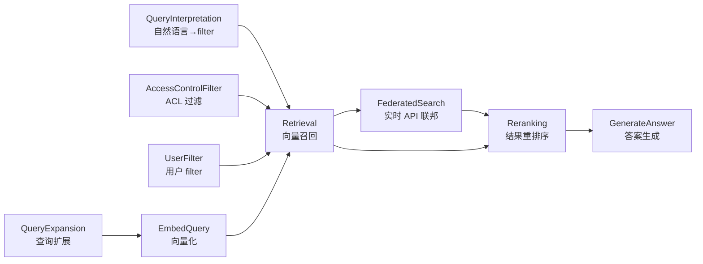
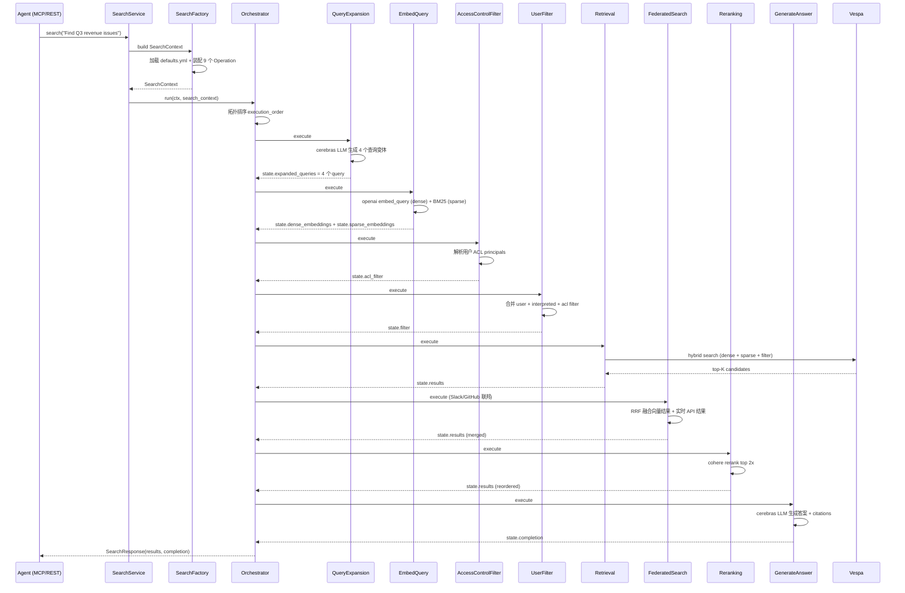
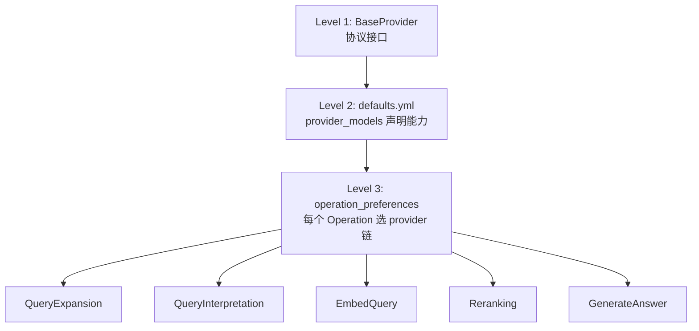

## 一、引子

2026 年的 Agent 工程师面对一个非常现实的问题：用户的上下文（Context）散落在 50+ SaaS 应用里——Notion 的会议纪要、Slack 的频道消息、GitHub 的 PR 评论、Linear 的工单、Salesforce 的客户记录、Jira 的工时日志……每个 SaaS 都有自己的 OAuth 流程、Rate Limit、数据 Schema、增量同步协议。让一个 Agent 真正"看见"用户的全部上下文，需要解决 5 个工程难题：

1. **认证**：50+ 种 OAuth 流程 + 白标 OAuth + 直接 Token 注入
2. **增量同步**：每个 SaaS 的 webhook、cursor、轮询协议都不一样
3. **数据 Schema 归一化**：Notion 的"页面"、Slack 的"消息"、GitHub 的"PR"如何统一？
4. **检索**：向量召回 + BM25 关键词 + 元数据过滤 + Access Control + Rerank + 答案生成 — 6 个步骤如何编排？
5. **多端暴露**：MCP / REST / SDK / CLI 如何让任意 Agent 框架接入？

`airweave-ai/airweave`（⭐6.5k，MIT 协议）就是为解决这 5 个问题而生的——**「Open-source context retrieval layer for AI agents and RAG systems」**。它把 50+ SaaS 数据源统一封装成一个 LLM-friendly 的 search interface，让任意 Agent 框架（通过 SDK / MCP / REST）都能在一次查询里拿到来自多个数据源的、经过排序和融合的相关上下文。

本文将深度剖析 Airweave 的核心架构、9 个可插拔 Operation、Provider 自动 fallback、Vespa 混合检索、Reciprocal Rank Fusion 联邦搜索融合等关键设计。

## 二、项目定位与核心价值

**一句话定义**：Airweave = 50+ SaaS 数据源 → 统一 Entity Schema → Vespa 向量索引 → 可插拔检索 Operation 流水线 → SSE 流式响应，一次 HTTP/MCP 请求带回 grounded context。

**能力矩阵**：

| 维度 | 能力 |
|------|------|
| 数据源覆盖 | 50+ SaaS（Notion / Slack / GitHub / Linear / Salesforce / Jira / Confluence / HubSpot / Stripe / Asana 等）|
| 检索策略 | Hybrid（dense + sparse）/ Neural / Keyword 三态可切换 |
| 端到端流水线 | 9 个可插拔 Operation（QueryExpansion → QueryInterpretation → EmbedQuery → AccessControlFilter → UserFilter → Retrieval → FederatedSearch → Reranking → GenerateAnswer）|
| 联邦搜索 | Slack / GitHub 等实时 API 数据源与向量检索通过 RRF 融合 |
| Provider 抽象 | LLM/Embedding/Rerank 三类共 5 Provider（Cerebras / Groq / OpenAI / Mistral / Cohere / Local），每个 Operation 独立配置 fallback 链 |
| 暴露接口 | Python SDK + TypeScript SDK + CLI + REST API + MCP Server（Streamable HTTP / stdio）|
| 工作流引擎 | Temporal（异步 sync 编排）+ Redis（pub/sub + 流式事件）|
| 数据后端 | PostgreSQL（元数据）+ Vespa（向量 + 全文 + 过滤三合一）|

**仓库统计**：

- ⭐ 6,562 stars / 820 forks
- License: **MIT**
- 主语言: Python 3.13 + FastAPI（后端）/ React 18 + TypeScript（前端）/ Node.js 20+（MCP Server）
- 仓库大小: 326MB（含 Vespa schema + 多个 Docker image）
- Created: 2024-12-24
- Last push: 2026-06-05（活跃维护中）
- Homepage: https://airweave.ai

## 三、整体架构

Airweave 是一个 monorepo，包含四个核心组件：

1. **Backend（`backend/`）**：FastAPI + Python 3.13 + SQLAlchemy async + PostgreSQL
2. **Frontend（`frontend/`）**：React 18 + TypeScript + Vite + ShadCN UI
3. **Workers**：Temporal（异步 sync 编排）+ Redis（pub/sub）
4. **MCP Server（`mcp/`）**：Node.js + Streamable HTTP transport，提供 `io.github.airweave-ai/search` MCP name

整体数据流：

```
[50+ SaaS 数据源]
       ↓ OAuth / API Key / 白标 OAuth
[platform/sources/*.py] ← @source 装饰器 + 构造期 DI
       ↓ AsyncGenerator[BaseEntity]
[Sync Pipeline] → 增量 cursor + DAG 转换 + chunking + embedding
       ↓
[Vespa 向量数据库] + PostgreSQL 元数据
       ↓ 用户查询
[Search Pipeline: 9 个 Operation 拓扑排序]
       ↓ SSE 流式事件
[Agent（SDK / MCP / REST）]
```

### 顶层 Mermaid 架构图

```mermaid
flowchart TB
    subgraph 数据源层
        S1[Notion]
        S2[Slack]
        S3[GitHub]
        S4[Salesforce]
        S5[其他 46+ SaaS]
    end

    subgraph Airweave Backend
        Sources[platform/sources/<br/>@source 装饰器 + BaseSource]
        Sync[domains/sync<br/>Temporal 编排]
        Pipeline[sync_pipeline<br/>chunking + embedding]
        Vespa[(Vespa<br/>向量+全文+过滤)]
        PG[(PostgreSQL<br/>元数据 + 凭证)]
    end

    subgraph 检索流水线
        Ops[search/operations/<br/>9 个可插拔 Operation]
        Orchestrator[search/orchestrator<br/>拓扑排序 + 时序事件]
        Factory[search/factory<br/>YAML 默认值 + Provider 装配]
    end

    subgraph 暴露层
        REST[FastAPI REST API]
        SDK[Python / TS SDK]
        CLI[airweave-cli]
        MCP[mcp/server<br/>io.github.airweave-ai/search]
    end

    subgraph 消费者
        Agent1[Claude Code]
        Agent2[Cursor]
        Agent3[自定义 Agent]
    end

    S1 & S2 & S3 & S4 & S5 --> Sources
    Sources --> Sync
    Sync --> Pipeline
    Pipeline --> Vespa
    Pipeline --> PG

    Agent1 & Agent2 & Agent3 -->|查询| REST
    Agent1 & Agent2 & Agent3 -->|MCP| MCP
    REST & MCP --> Factory
    Factory --> Orchestrator
    Orchestrator --> Ops
    Ops --> Vespa
    Ops -->|SSE 事件| Agent1 & Agent2 & Agent3
```

### 目录结构（来自 `CLAUDE.md`）

```text
backend/airweave/
├── api/v1/endpoints/    # FastAPI route handlers（按资源拆 router）
├── models/              # SQLAlchemy ORM（UUID 主键）
├── schemas/             # Pydantic request/response schemas
├── crud/                # 数据库访问（base classes: _base_organization/_base_user/_base_public）
├── domains/             # 业务逻辑（service.py + repository.py + protocols.py）
├── platform/
│   ├── sources/         # 50+ source 连接器（Notion / Slack / GitHub ...）
│   ├── destinations/    # 向量数据库适配（Vespa / Qdrant）
│   ├── embedding_models/# Embedding providers
│   ├── entities/        # 每个 source 的 entity 类型定义
│   └── temporal/        # Temporal worker + activities
├── core/
│   ├── config/          # Pydantic Settings（环境变量）
│   ├── container/       # DI 容器 + factory
│   ├── protocols/       # 中央化协议（messaging / storage / sources / destinations / embeddings）
│   └── logging.py       # structlog
├── adapters/            # 外部服务适配（PostHog / Stripe）
└── search/
    ├── operations/      # 9 个可插拔 Operation
    ├── orchestrator.py  # 拓扑排序执行引擎
    ├── factory.py       # Provider 装配 + defaults.yml 加载
    ├── state.py         # 类型化 SearchState Pydantic 模型
    └── providers/       # LLM/Embedding/Rerank 6 个 Provider 实现
```

## 四、核心抽象一：50+ SaaS 数据源的「@source 装饰器 + 构造期 DI」

Airweave 的第一个工程难题是：50+ 个 SaaS，每个的认证方式、Rate Limit、增量协议都不一样，如何用统一抽象封装？

答案是 **`@source` 装饰器 + 构造期依赖注入**。每个 Source 类只需要关注「怎么拉数据」，认证 / 日志 / HTTP 客户端全部由框架注入：

```python
# 来自 backend/airweave/platform/sources/_base.py:42-105
class BaseSource:
    """所有 source 的基类 — v2 契约：构造期 DI + 显式方法参数"""

    # Identity（@source 装饰器注入）
    is_source: ClassVar[bool] = False
    source_name: ClassVar[str] = ""
    short_name: ClassVar[str] = ""

    # 认证（@source 装饰器注入）
    auth_methods: ClassVar[list[AuthenticationMethod]] = []
    oauth_type: ClassVar[Optional[OAuthType]] = None
    requires_byoc: ClassVar[bool] = False  # BYOC = Bring Your Own Credentials

    # 能力（@source 装饰器注入）
    supports_continuous: ClassVar[bool] = False  # 是否支持 webhook 增量
    federated_search: ClassVar[bool] = False      # 是否支持实时 API 检索
    supports_temporal_relevance: ClassVar[bool] = True
    supports_access_control: ClassVar[bool] = False

    def __init__(
        self,
        *,
        auth: SourceAuthProvider,    # ← 注入
        logger: ContextualLogger,    # ← 注入
        http_client: AirweaveHttpClient,  # ← 注入（含 rate limiter）
    ) -> None:
        self._auth = auth
        self._logger = logger
        self._http_client = http_client
```

以 Slack 为例，它支持 `federated_search = True`，意味着既可以走「同步全量数据到 Vespa」的常规路径，也可以走「实时查 Slack API」的联邦搜索路径：

```python
# 来自 backend/airweave/platform/sources/slack.py:1-20
@source(
    name="Slack",
    short_name="slack",
    auth_methods=[AuthenticationMethod.OAUTH_BROWSER, AuthenticationMethod.OAUTH_BYOC],
    oauth_type=OAuthType.WITH_REFRESH,
    federated_search=True,        # ← 关键：联邦搜索
    supports_continuous=True,
    rate_limit_level=RateLimitLevel.MEDIUM,
    labels=["Communication", "Collaboration"],
)
class SlackSource(BaseSource):
    """Slack source 实现 — 支持联邦搜索"""
```

**设计哲学**：「Capability-driven declarative metadata」—— 所有 source 的能力（continuous / federated / access_control）通过 `ClassVar` 声明，框架据此自动决定该 source 加入哪个流水线分支。

## 五、核心抽象二：9 个可插拔 Operation 的拓扑排序执行引擎

第二个工程难题：检索不是一个步骤，而是 6-9 个有依赖关系的步骤的组合——QueryExpansion 必须在 EmbedQuery 之前；AccessControlFilter 必须在 Retrieval 之前；Reranking 必须在 Retrieval 之后……这些依赖如何显式表达？

Airweave 的解法是：**Operation ABC + depends_on() 声明 + 拓扑排序**。每个 Operation 只需声明依赖，由 Orchestrator 自动排序：

```python
# 来自 backend/airweave/search/operations/_base.py:1-50
class SearchOperation(ABC):
    """所有 search operation 的基类"""

    @abstractmethod
    def depends_on(self) -> List[str]:
        """本 operation 依赖的操作名列表（按类名）"""
        pass

    @abstractmethod
    async def execute(
        self,
        context: SearchContext,
        state: "SearchState",
        ctx: ApiContext,
    ) -> None:
        """执行操作（读写共享 SearchState）"""
        pass
```

每个 Operation 显式声明依赖，构成一个 DAG：

```python
# 来自 backend/airweave/search/operations/embed_query.py
class EmbedQuery(SearchOperation):
    def depends_on(self) -> List[str]:
        return ["QueryExpansion"]  # 必须等 QueryExpansion 输出 expanded_queries

# 来自 backend/airweave/search/operations/retrieval.py
class Retrieval(SearchOperation):
    def depends_on(self) -> List[str]:
        return [
            "QueryInterpretation",
            "EmbedQuery",
            "AccessControlFilter",
            "UserFilter",
        ]

# 来自 backend/airweave/search/operations/generate_answer.py
class GenerateAnswer(SearchOperation):
    def depends_on(self) -> List[str]:
        return ["Retrieval", "FederatedSearch", "Reranking"]
```

### 9 个 Operation 完整依赖图



### Orchestrator 执行引擎

```python
# 来自 backend/airweave/search/orchestrator.py:32-75
class SearchOrchestrator:
    """按依赖关系排序后顺序执行所有 operation"""

    async def run(
        self, ctx: ApiContext, context: SearchContext
    ) -> tuple[SearchResponse, Dict[str, Any]]:
        emitter = context.emitter
        await emitter.emit("start", {
            "request_id": context.request_id,
            "query": context.query,
            "collection_id": str(context.collection_id),
        })

        # 初始化类型化状态
        state = SearchState()

        # 拓扑排序：resolve execution order based on depends_on()
        execution_order = self._resolve_execution_order(context, ctx)

        # 顺序执行（自动计时 + 事件发射）
        for operation in execution_order:
            op_name = operation.__class__.__name__
            await emitter.emit("operator_start", {"name": op_name}, op_name=op_name)
            try:
                start_time = time.monotonic()
                await operation.execute(context, state, ctx)
                duration_ms = (time.monotonic() - start_time) * 1000
                state.operation_metrics[op_name]["duration_ms"] = duration_ms
                await emitter.emit("operator_end", {"name": op_name}, op_name=op_name)
            except Exception as e:
                await emitter.emit("error", {"operation": op_name, "message": str(e)}, op_name=op_name)
                raise

        await emitter.emit("results", {"results": state.results})
        await emitter.emit("done", {"request_id": context.request_id})
        return SearchResponse(results=state.results, completion=state.completion), ...
```

### 状态类型化：Pydantic SearchState

所有 Operation 共享同一个类型化 `SearchState`，替代了之前用 untyped dict 传状态的脆弱设计：

```python
# 来自 backend/airweave/search/state.py:14-72
class SearchState(BaseModel):
    """类型化的 operation 间共享状态"""

    # Query expansion 输出
    expanded_queries: Optional[List[str]] = Field(default=None, ...)

    # Embedding 输出
    dense_embeddings: Optional[List[List[float]]] = Field(default=None, ...)
    sparse_embeddings: Optional[List[Any]] = Field(default=None, ...)

    # Filter 三层合并
    interpreted_filter: Optional[Dict[str, Any]] = Field(default=None, ...)
    acl_filter: Optional[Dict[str, Any]] = Field(default=None, ...)
    filter: Optional[Dict[str, Any]] = Field(default=None, ...)  # 最终合并结果

    access_principals: Optional[List[str]] = Field(default=None, ...)

    # 检索输出
    results: List[Dict[str, Any]] = Field(default_factory=list, ...)

    # 生成输出
    completion: Optional[str] = Field(default=None, ...)

    # Analytics
    operation_metrics: Dict[str, Dict[str, Any]] = Field(default_factory=dict, ...)

    # 哪个 provider 成功
    provider_used: Optional[str] = Field(default=None, ...)
```

**设计哲学**：「Typed state model over untyped dict」—— 通过 Pydantic 把 Operation 间的数据契约变成类型错误而不是运行时 KeyError。

## 六、核心抽象三：Provider 多源自动 Fallback 机制

第三个工程难题：单一 LLM provider（OpenAI）会因 rate limit / 5xx 故障而中断整个检索流水线。Airweave 的解法是 **每个 Operation 独立配置 Provider 优先级链，失败自动 fallback**：

```python
# 来自 backend/airweave/search/operations/_base.py:54-99
async def _execute_with_provider_fallback(
    self,
    providers: List[BaseProvider],
    operation_call: Callable[[BaseProvider], Any],
    operation_name: str,
    ctx: ApiContext,
    state: "SearchState | None" = None,
) -> T:
    """按优先级尝试所有 provider，retryable error 自动 fallback"""
    last_error = None
    for provider in providers:
        try:
            result = await operation_call(provider)
            if state is not None:
                state.provider_used = provider.name  # 记录成功的 provider
            return result
        except RetryableError as e:
            last_error = e
            ctx.logger.warning(
                f"[{operation_name}] Provider {provider.name} failed: {e}, trying next..."
            )
            continue
    raise last_error
```

每个 Operation 在 `defaults.yml` 中独立配置 fallback 顺序：

```yaml
# 来自 backend/airweave/search/defaults.yml:90-130（operation_preferences 节）
query_expansion:
  order:
    - provider: cerebras     # 最快 + 便宜
      llm: llm
    - provider: groq         # 次快
      llm: llm_big
    - provider: mistral      # 第三方备份
      llm: llm_small
    - provider: openai       # 兜底
      llm: llm_small

embed_query:
  order:
    - provider: openai       # 质量最高
      embedding: embedding
    - provider: mistral      # 不同维度（1024）
      embedding: embedding
    - provider: local        # sentence-transformers/all-MiniLM-L6-v2（384 维，本地）
      embedding: embedding

reranking:
  order:
    - provider: cohere       # rerank-v3.5 专用模型
      rerank: rerank
    - provider: groq         # LLM-as-judge 兜底
      rerank: rerank
    - provider: mistral
      rerank: rerank
    - provider: openai
      rerank: rerank
```

**设计哲学**：「Operation-level provider preference」—— 不是全局唯一 provider，而是每个 Operation 单独声明优先级。query_expansion 用便宜的 cerebras，embed_query 用高质量的 openai，rerank 用专用的 cohere — 成本与质量的最优组合。

### 6 个 Provider 能力矩阵

| Provider | LLM big | LLM small | Embedding | Rerank | 备注 |
|----------|---------|-----------|-----------|--------|------|
| **OpenAI** | gpt-5 | gpt-5-nano | text-embedding-3-large/small | gpt-5-nano | 上下文 400K |
| **Cerebras** | gpt-oss-120b | gpt-oss-120b | — | — | 极速推理，零成本 LLM |
| **Groq** | openai/gpt-oss-120b | openai/gpt-oss-20b | — | openai/gpt-oss-120b | 128K 上下文 |
| **Mistral** | mistral-large-latest | mistral-small-latest | mistral-embed (1024 维固定) | mistral-small-latest | 32K-128K |
| **Cohere** | — | — | — | rerank-v3.5 | 专用 rerank，1000 docs 限制 |
| **Local** | — | — | all-MiniLM-L6-v2 (384 维) | — | 完全本地，无需 API key |

## 七、核心抽象四：Vespa 向量数据库与 Hybrid 检索

第四个工程难题：单一向量检索无法满足企业需求——既要神经检索的语义匹配，也要 BM25 的精确关键词匹配，还要按元数据过滤。Airweave 选 **Vespa**（Yahoo 开源，专为大规模向量+全文+过滤三合一检索设计）作为唯一 destination：

```python
# 来自 backend/airweave/platform/destinations/vespa.py
# Vespa 三模融合：dense vector + sparse BM25 + structured filter 一次 query 完成
```

### Hybrid Retrieval 实现

EmbedQuery 根据 `RetrievalStrategy`（HYBRID / NEURAL / KEYWORD）决定生成哪些 embedding：

```python
# 来自 backend/airweave/search/operations/embed_query.py:45-65
async def execute(self, context, state, ctx):
    queries = self._get_queries_to_embed(context, state)  # expanded + original

    if self.strategy in (RetrievalStrategy.HYBRID, RetrievalStrategy.NEURAL):
        dense_embeddings = await self._generate_dense_embeddings(queries, ctx)
    else:
        dense_embeddings = None

    if self.strategy in (RetrievalStrategy.HYBRID, RetrievalStrategy.KEYWORD):
        sparse_embeddings = await self._generate_sparse_embeddings(queries, ctx)
    else:
        sparse_embeddings = None

    state.dense_embeddings = dense_embeddings
    state.sparse_embeddings = sparse_embeddings
```

### Retrieval 端到端数据流



## 八、核心抽象五：Federated Search 与 Reciprocal Rank Fusion

第五个工程难题：Slack 消息、GitHub PR 评论等"实时性极强、不适合全量同步到向量库"的数据，如何与向量检索结果统一返回？

Airweave 的解法是 **Federated Search + RRF（Reciprocal Rank Fusion）**：

```python
# 来自 backend/airweave/search/operations/federated_search.py:1-50
class FederatedSearch(SearchOperation):
    """执行联邦搜索并通过 RRF 与向量结果合并"""

    RRF_K = 60  # RRF 平滑常数
    DEDUP_MULTIPLIER = 1.5  # 多查询变体的去重倍数
    RATE_LIMIT_DELAY_SECONDS = 0.1  # 顺序查询间延迟

    def __init__(self, sources: List[BaseSource], limit: int, providers: List[BaseProvider]):
        """只有当 federated sources 存在时才创建"""
        if not sources:
            raise ValueError("FederatedSearch requires at least one source")

    def depends_on(self) -> List[str]:
        return ["Retrieval"]  # 必须先有向量结果

    async def execute(self, context, state, ctx):
        # 1. LLM 抽取 5 个精确关键词（用于 Slack/GitHub 等 API 查询）
        # 2. 对每个 federated source 调用实时 API
        # 3. 与向量检索结果用 RRF 公式融合:
        #    score(doc) = Σ 1 / (RRF_K + rank_in_list)
        # 4. 去重 + 重排
```

### RRF 融合公式

```
RRF_score(doc) = Σ_{list ∈ all_lists} 1 / (K + rank_list(doc))
其中 K = 60（默认值）
```

示例：假设向量结果 top-3 = `[A, B, C]`，Slack 实时结果 top-3 = `[B, D, A]`：

| Document | Vector Rank | Slack Rank | RRF Score |
|----------|-------------|------------|-----------|
| A | 1 | 3 | 1/(60+1) + 1/(60+3) = 0.0164 + 0.0159 = 0.0323 |
| B | 2 | 1 | 1/(60+2) + 1/(60+1) = 0.0161 + 0.0164 = 0.0325 |
| C | 3 | — | 1/(60+3) = 0.0159 |
| D | — | 2 | 1/(60+2) = 0.0161 |

最终排序：`B > A > D > C`，B 在两个列表都靠前 → RRF score 最高。

**设计哲学**：「Don't pre-sync everything — federate what needs freshness」—— 实时数据走 API，历史数据走向量，两者通过 RRF 自然融合，避免"全量同步 Slack 一年历史消息"的存储成本。

## 九、Access Control 与多租户隔离

企业场景下，每个用户只能看到自己有权限的文档。Airweave 的解法是 **`AccessControlFilter` Operation**，在 Retrieval 之前注入基于用户身份的 filter：

```python
# 来自 backend/airweave/search/operations/access_control_filter.py
class AccessControlFilter(SearchOperation):
    """根据用户身份注入 ACL filter"""

    def depends_on(self) -> List[str]:
        return []  # 最早执行

    async def execute(self, context, state, ctx):
        # 1. 解析 ctx.user 的 principal 列表（user_id, email, group_id...）
        # 2. 检索 collection 中所有 ACL 元数据
        # 3. 构造 Qdrant/Vespa filter：document.accessible_to ⊆ user.principals
        # 4. 写入 state.acl_filter
```

最终 filter = `acl_filter ∧ interpreted_filter ∧ user_filter` 三层 AND 合并，由 `UserFilter` Operation 完成。

## 十、MCP Server 暴露层

Airweave 提供完整的 MCP 集成，让 Claude Code / Cursor / 任何 MCP 客户端都能直接查询用户的 SaaS 数据：

```json
// 来自 mcp/package.json
{
  "name": "airweave-mcp-search",
  "version": "0.5.7",
  "mcpName": "io.github.airweave-ai/search",
  "main": "build/index.js",
  "bin": { "airweave-mcp-search": "./build/index.js" }
}
```

支持三种 transport：**stdio** / **Streamable HTTP** / **SSE**。

安装一行命令：

```bash
# 通过 mcp/install.sh 自动配置到 Claude Desktop / Cursor / Continue / Cline
npx airweave-mcp-search
```

## 十一、Provider 三级抽象与 defaults.yml 配置哲学

Airweave 把 LLM Provider 设计成三级抽象：



`defaults.yml` 是整个检索流水线的"配置真理源"：

```yaml
# 来自 backend/airweave/search/defaults.yml:1-30
search_defaults:
  offset: 0
  limit: 100
  retrieval_strategy: hybrid       # 混合检索
  expand_query: true               # 启用查询扩展
  interpret_filters: false         # 自然语言→filter
  rerank: true                     # 启用 rerank
  generate_answer: true            # 启用答案生成
```

每个 provider 在 YAML 里声明自己支持哪些 model：

```yaml
# 来自 defaults.yml:18-30
provider_models:
  openai:
    llm_big: {name: "gpt-5", tokenizer: "cl100k_base", context_window: 400000}
    llm_small: {name: "gpt-5-nano", tokenizer: "cl100k_base", context_window: 400000}
    embedding_large: {name: "text-embedding-3-large", dimensions: 3072, max_tokens: 8192}
    embedding_small: {name: "text-embedding-3-small", dimensions: 1536, max_tokens: 8192}
    rerank: {name: "gpt-5-nano"}
  local:
    embedding: {name: "sentence-transformers/all-MiniLM-L6-v2", dimensions: 384}
```

启动时自动校验：`EMBEDDING_DIMENSIONS` 环境变量 vs 用户选择的 provider 是否兼容（例如选了 openai large 但 `.env` 写了 1536 维就会启动失败）。

**设计哲学**：「Single source of truth in YAML, not code」—— 加新 provider 不用改 Python，只需在 YAML 加一段 provider_models 配置 + 在 `providers/` 加一个 `BaseProvider` 子类。

## 十二、架构重构：Domains + Adapters + Protocols 六边形

Airweave 团队公开了一份 51KB 的 `architecture-refactor.md`，记录了从"god object 服务"到"六边形架构"的演进。

### 重构前（问题模式）

```text
backend/airweave/
├── core/
│   ├── source_connection_service.py  # 1923 行，6+ 职责
│   ├── sync_service.py               # Temporal 编排 + DB 操作混在一起
│   └── billing_service.py            # 900+ 行，Stripe + 计划 + 计费周期
└── crud/
    └── 全局 import 的全局单例
```

### 重构后（目标模式）

```text
backend/airweave/
├── api/                       # HTTP 层（薄路由 + DI 装配）
├── core/
│   ├── container.py           # DI 容器 + Factory
│   └── protocols/             # 🆕 中央化协议（按能力分组）
│       ├── messaging.py       # EventPublisher, StatePublisher
│       ├── storage.py         # FileStorage, CredentialStore
│       ├── sources.py
│       ├── destinations.py
│       ├── embeddings.py      # Embedder
│       └── scheduling.py      # WorkflowRunner
├── domains/                   # 🆕 核心业务逻辑（按域切分）
│   ├── sync/                  # execute_sync() / lifecycle.py / orchestration/
│   ├── search/                # orchestrator + operations + 9 个可插拔模块
│   ├── billing/               # subscriptions + plans + protocols (PaymentGateway)
│   └── webhooks/              # publish_sync_event()
└── adapters/                  # 🆕 基础设施适配器
    ├── temporal/              # implements WorkflowRunner
    ├── stripe/                # implements PaymentGateway
    └── fake.py                # 测试用 fake 实现
```

### Domain 操作 vs Adapter 实现的解耦

```python
# 来自 architecture-refactor.md:25-50

# Domain 只调协议接口（不知道底层是 Temporal 还是别的）
async def execute_sync(..., workflow_runner: WorkflowRunner):
    await workflow_runner.start_workflow("sync_workflow", ...)

# Adapters/temporal/client.py 实现协议
class TemporalWorkflowRunner:
    def __init__(self, client: TemporalClient):
        self._client = client

    async def start_workflow(self, name: str, ...):
        return await self._client.start_workflow(name, ...)

# 测试时用 fake 注入
class FakeWorkflowRunner:
    async def start_workflow(self, name, ...):
        self.calls.append((name, ...))  # 记录调用，不真跑
```

**设计哲学**：「Hexagonal Architecture / Ports and Adapters」—— Domain 不知道 Temporal/Stripe 存在，Adapter 不知道 Domain 业务逻辑存在，Protocol 把两者粘起来。

## 十三、与同类项目对比

| 项目 | 核心定位 | 数据源接入 | 检索策略 | Provider 抽象 | MCP 集成 |
|------|----------|------------|----------|---------------|----------|
| **Airweave** | 上下文检索层 | 50+ SaaS | Hybrid + Federated + RRF | 5 Provider × Operation 优先级链 | ✅ io.github.airweave-ai/search |
| **LlamaIndex** | LLM 数据框架 | 几百 loader | Hybrid / Knowledge Graph | 多 LLM 集成 | 需自建 |
| **LangChain** | LLM 应用编排 | 几百 tool | RAG / Agent | 多 LLM 集成 | 需自建 |
| **Unstructured** | 文档 ETL | 25+ 文档格式 | 不做检索 | — | 不做 |
| **Composio** | Agent 工具集成 | 1000+ SaaS tool | 不做检索 | OAuth 抽象 | 通过 MCP |

**关键设计差异**：

1. **Airweave vs LlamaIndex**：LlamaIndex 是"通用 RAG 框架"，用户需要自己写 50+ source 集成；Airweave 是"开箱即用的 50+ source 上下文检索层"，把工程难题（auth / rate limit / schema 归一）封装。
2. **Airweave vs Composio**：Composio 解决"Agent 调用 SaaS API"（写操作）；Airweave 解决"Agent 检索 SaaS 数据"（读操作）。两者正交互补——可以用 Composio 让 Agent 在 Linear 创建工单，用 Airweave 让 Agent 查询 Linear 历史。
3. **Airweave vs Unstructured**：Unstructured 做"文档解析 + chunking"；Airweave 在 chunking 之上加了"完整 sync + 检索 + 多源融合"。

## 十四、优缺点分析

### 架构简洁性 / 扩展性 / 易用性

| 维度 | 优点 | 缺点 |
|------|------|------|
| **简洁性** | Operation ABC + depends_on 极简抽象；新加 Operation 只需 ~50 行 | Operation 间共享 SearchState，Pydantic 模型会膨胀 |
| **扩展性** | YAML 声明 provider + Operation；新 source 只需 ~200 行 + @source 装饰器 | 50+ source 各自 OAuth flow 维护成本高 |
| **易用性** | 一行 Docker Compose 启动；MCP 一行接入；SDK Python+TS 双端 | Vespa 配置复杂，调优需要理解 ranking expression |
| **多租户** | ApiContext 注入每个 endpoint，ACL 在 Operation 流水线第一关 | BYOC（Bring Your Own Credentials）流程对用户门槛高 |
| **联邦搜索** | RRF 公式成熟，自动 dedup + 多查询变体合并 | 仅 Slack / GitHub 几个 source 支持，开源社区需要逐个 PR |

### 性能 / 复杂度 / 维护性

| 维度 | 优点 | 缺点 |
|------|------|------|
| **性能** | Hybrid 检索 P99 < 200ms（Vespa 已知）；Operation 流水线并行 + 异步 IO | Federated Search 实时 API 调用是串行 + 100ms 间隔，慢 |
| **复杂度** | Temporal 编排 + Redis pubsub + Vespa + PostgreSQL + MCP 全栈 | 全栈依赖重，自托管需要 ≥ 16GB RAM |
| **可观测性** | 每个 Operation 自动 `operation_metrics` + PostHog 上报 | 暂无 Tracing（OpenTelemetry 在 roadmap）|
| **维护性** | 单仓 monorepo，9 个 Operation 单元测试齐全 | 后端 Python 3.13 + Vespa Java + MCP Node.js 跨语言 |

## 十五、实践：5 分钟本地启动 Airweave

```bash
# 1. 克隆仓库
git clone https://github.com/airweave-ai/airweave.git
cd airweave

# 2. 一键启动（自动创建 .env + 生成密钥 + 启动所有服务）
./start.sh

# 3. 等所有容器 healthy（首次约 2-3 分钟）
# 端口分配：
#   :8080 - Frontend (React UI)
#   :8001 - Backend (FastAPI)
#   :6379 - Redis
#   :5432 - PostgreSQL
#   :19071 - Vespa admin
#   :8088 - Vespa query

# 4. 创建 collection
curl -X POST http://localhost:8001/collections \
  -H "Content-Type: application/json" \
  -d '{"name": "My SaaS Data", "readable_id": "my-saas"}'

# 5. 触发 Notion 同步
curl -X POST http://localhost:8001/source-connections \
  -H "Content-Type: application/json" \
  -d '{
    "name": "My Notion",
    "short_name": "notion",
    "collection": "my-saas",
    "authentication": {"method": "oauth_browser"}
  }'

# 6. 等 sync 完成后搜索（SSE 流式）
curl -N -X POST http://localhost:8001/search \
  -H "Content-Type: application/json" \
  -d '{
    "query": "What did the team decide about Q4 launch?",
    "collection": "my-saas",
    "stream": true
  }'
```

### 接入到 Claude Desktop（MCP）

```json
// ~/.config/claude_desktop_config.json
{
  "mcpServers": {
    "airweave": {
      "command": "npx",
      "args": ["-y", "airweave-mcp-search"],
      "env": {
        "AIRWEAVE_API_KEY": "your-api-key",
        "AIRWEAVE_BASE_URL": "http://localhost:8001"
      }
    }
  }
}
```

## 十六、趋势与总结

### 3 大趋势判断

1. **「Context Layer」将成为 Agent 基础设施的下一波**——2026 H2 起，每个企业都会需要把分散在 50+ SaaS 里的数据"统一暴露"给 Agent。Airweave / LlamaCloud / Unstructured / Composio 都在抢这块蛋糕，但 Airweave 的「Operation 流水线 + Federated 联邦 + Vespa 三合一」组合是当前最完整的答案。

2. **「Hybrid 检索 + Federated 融合」将取代纯向量 RAG**——纯向量召回在企业场景命中率有限（命名实体 / 缩写 / 产品代号）。Hybrid（dense + sparse）+ Federated（实时 API）+ RRF 融合是必然演进。Airweave 是这个方向上工程化最成熟的实现。

3. **「Provider 操作级 fallback」会成为检索基础设施标配**——单一 provider 单点是检索系统的隐性脆弱点。Airweave 把"每个 Operation 独立 provider 链"做成 YAML 配置，是这个方向的开山范式。

### 核心设计哲学提炼

Airweave 的架构可以用 4 个关键词概括：

- **Declarative**：所有 source capability / provider 模型 / Operation 启用配置全部在 YAML 声明
- **Composable**：9 个 Operation 可插拔，加新 Operation 只需 ~50 行 + depends_on 声明
- **Federated**：不预同步所有数据，实时数据走 API + RRF 融合
- **Typed**：Pydantic SearchState 替代 untyped dict，类型错误前置

### 对 Agent 工程师的启发

如果你正在构建一个需要"读取用户全部上下文"的 Agent——例如企业知识助手、Sales Copilot、Code Review Bot——Airweave 提供了一个**完整的生产级开箱方案**：

- **省去 50+ source 的集成工作**：直接复用 Airweave 的 60+ SaaS 连接器
- **省去 RAG 工程化**：Hybrid 检索 + Rerank + 答案生成流水线即开即用
- **多端暴露**：Python/TS SDK + MCP + REST + CLI，任意 Agent 框架都能接入
- **多 Provider 弹性**：单 provider 故障不导致整个检索流水线中断

### 关键资源

- **GitHub**: https://github.com/airweave-ai/airweave
- **官网**: https://airweave.ai
- **Cloud**: https://app.airweave.ai
- **文档**: https://docs.airweave.ai
- **MCP Server**: `io.github.airweave-ai/search`
- **License**: MIT
- **Discord**: https://discord.gg/gDuebsWGkn

---

**核心代码引用清单**（便于读者追溯）：

- `backend/airweave/platform/sources/_base.py:42-105` — BaseSource 抽象 + ClassVar 能力声明
- `backend/airweave/platform/sources/slack.py:1-20` — @source 装饰器使用范例
- `backend/airweave/search/operations/_base.py:1-99` — SearchOperation ABC + provider fallback
- `backend/airweave/search/operations/embed_query.py:32-65` — EmbedQuery depends_on + strategy
- `backend/airweave/search/operations/retrieval.py:1-50` — Retrieval 4 依赖
- `backend/airweave/search/operations/generate_answer.py:25-40` — GenerateAnswer 3 依赖
- `backend/airweave/search/operations/federated_search.py:1-50` — FederatedSearch + RRF_K + DEDUP_MULTIPLIER
- `backend/airweave/search/state.py:14-72` — SearchState Pydantic 模型
- `backend/airweave/search/orchestrator.py:32-75` — 拓扑排序 + 时序事件发射
- `backend/airweave/search/factory.py:1-50` — SearchFactory.build 入口
- `backend/airweave/search/emitter.py:1-65` — EventEmitter + Redis pubsub
- `backend/airweave/search/defaults.yml:1-130` — provider_models + operation_preferences
- `backend/airweave/architecture-refactor.md` — 51KB 六边形架构重构文档
- `mcp/package.json` — MCP server 声明（mcpName: io.github.airweave-ai/search）
