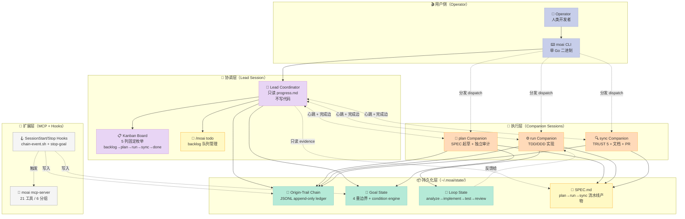
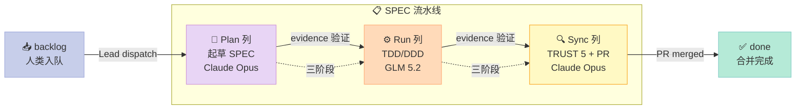
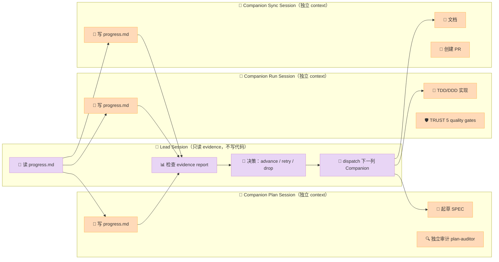

> **一句话结论**：MoAI-ADK 把"模型写代码"重构成"SPEC 流水线 + 5 列 Kanban + 4 重边界"——一个 SPEC 文件走完 plan → run → sync 三道闸门，每道闸门有自己的 Claude Code 会话，串成 Origin-Trail Chain；turn 上限、wall-clock 上限、停滞检测、Approval 闸门 4 道护栏，让 Agent 工作流不再"跑飞"。

## 前言：把 Agent 当成会忘事的临时工

AI Agent 在 2026 年已经能写完整个项目了，但绝大多数团队仍然不敢让它跑通 50 个 SPEC 的大型任务。原因不是模型不够强，而是 **Harness（外部骨架）撑不住**：

- **上下文塞满**：长 SPEC 灌进同一个会话，规划、审阅、文档三轮历史混在同一个 context 里，最后输出越来越糊
- **验证靠嘴说**：Agent 说"测试过了"≠ 测试真的过了，没有把"命令"和"输出"绑定到 evidence
- **并发互踩**：两个 Agent 同时改主分支，谁的 worktree 跟谁对不上根本没法追
- **会话断了就重头来**：`/clear` 一按，30 轮的努力归零，没人接力

[MoAI-ADK](https://github.com/modu-ai/moai-adk)（1.2k⭐，Apache-2.0，Go 单二进制）针对这四个痛点给出了一个系统级答案。它不是又一个"Chat-with-Code"的 IDE，而是**包裹在 Claude Code 外面的工程化骨架**，由 4 维轮播驱动（Tokenomics · Agentic Loop · Agentic Harness · SPEC Lifecycle）。

读这篇文章你会拿到：

1. **5 列 Kanban + Lead/Companion 模型**——为什么"一个会话一个阶段"是上下文管理的最优解
2. **Origin-Trail Chain（JSONL 起源链）**——`/clear` 后如何用 append-only ledger 找回 root-to-leaf 完整接力史
3. **Goal Engine 的 4 重边界**（turns + wall-clock + stagnation + approval）——为什么"无限循环"不是简单加个 max_turns
4. **Loop 状态机**（analyze → implement → test → review）——为什么这是唯一能跨会话复现的反馈循环
5. **21 个 MCP 工具的分组设计**——SPEC lifecycle / Verification / Cross-model audit / Codex delegation / GLM delegation 五大类怎么映射 Harness 6 件套

## 一、定位：Harness 6 件套里的 Workflow 组件

MoAI-ADK 的 README 第一句话就把定位讲透了：

> *"A verification-driven agent orchestration harness — the structure that makes Claude Code's code trustworthy."*

拆解三层关键词：

- **Verification-driven**：每个完成声明都必须绑定"实际跑过的命令 + 真实输出"，5-section evidence report 模板化；这是 Harness 6 件套中 **Script 组件**的强约束版
- **Agent orchestration**：不是单 Agent 跑到底，而是多会话接力（Lead + Companion），是 **Workflow 组件**的经典实现
- **For Claude Code**：不替代 Claude Code，而是给它穿"工程化外衣"，是 **Harness 第一原则（Mechanism, not Policy）**的范例

| 维度 | MoAI-ADK 的选择 | Harness 6 件套映射 |
|------|----------------|---------------------|
| Rule | `moai init` 生成的 `AGENTS.md` / `CLAUDE.md` 是 Rule 的载体 | Rule ✅ |
| Skill | 16 个 `/moai` 子命令（plan / run / sync / goal / loop / fix ...） | Skill ✅ |
| Sub-Agent | 5 列 Kanban 中每列一个 Companion session（独立 context、独立 model、独立 effort） | Sub-Agent ✅ |
| **Workflow** | **5 列 Kanban + Lead/Companion + Origin-Trail Chain + SPEC 流水线** | **Workflow ⭐ 主角** |
| Script | TRUST 5 quality gates（Tested · Readable · Unified · Secured · Trackable） | Script ✅ |
| MCP | 21 个 MoAI 自托管工具 + 4 个 optional（MCP 协议本身） | MCP ✅ |

MoAI-ADK **几乎同时覆盖 Harness 6 件套全部组件**，但**核心是 Workflow**。SPEC 流水线是它的脊柱——所有其他组件都是为这条脊柱服务的。

## 二、架构：SPEC 流水线 × Kanban × Origin-Trail 三层骨架

MoAI-ADK 的整体架构可以拆成 3 层 + 4 类持久化状态：



### 2.1 三条流水线如何串起一张大图

- **SPEC 流水线（plan → run → sync）**：每个 SPEC 是一张"接力棒"，从 plan 列的 Companion 起草，到 run 列的 Companion 实现，最后到 sync 列的 Companion 收尾（文档 + PR）
- **Kanban 5 列 Board**：所有 SPEC 在同一块板上移动，board 状态是 JSON 文件存在 primary checkout 的 `.moai/state/kanban-board/board.json`，**所有 session 都解析到同一个文件**（worktree 的 `.moai/state/` 是 gitignored 的私有空间，所以必须 `git-common-dir` 反推主仓根）
- **Origin-Trail Chain**：每张 SPEC 的接力史（哪个 SPEC 由哪个 session 在哪个 worktree 接力过、做到哪个 milestone）记录在 append-only JSONL ledger

### 2.2 持久化层是真正的"系统状态"

MoAI-ADK 把所有运行时状态都落到 4 类文件，避免"Agent 重启就失忆"：

| 文件 | 路径 | 作用 | 写入频率 |
|------|------|------|----------|
| Kanban Board | `.moai/state/kanban-board/board.json` | 5 列卡片分布 | 每次 dispatch / move |
| Origin-Trail Chain | `.moai/state/chain/events.jsonl` | session 接力史 | 每次 spawn / complete |
| Goal State | `.moai/state/goal/<session-id>.json` | 当前 goal + 进度 | 每次 turn |
| Loop State | `.moai/state/loop/<spec-id>.json` | 反馈循环状态 | 每次 iteration |

这 4 类文件 + SPEC.md 本身 + progress.md = MoAI-ADK 的"6 个真相源"。任何 session 失联后重新启动，都可以从这些文件恢复全部上下文。



## 三、5 大原语深度拆解（带可运行代码）

MoAI-ADK 的设计哲学可以浓缩成 5 个原语，每一个都用真实代码 / 真实数据结构展示。

### 3.1 原语 ①：Origin-Trail Chain —— 跨 session 的接力史

**痛点**：Claude Code 的 `/clear` 一次性清空当前会话，30 轮的 context 直接蒸发。如果 Agent 在 depth=3 的 worktree 里写了一半，`/clear` 后再开新会话就完全失忆。

**解法**：**Append-only JSONL ledger**，每次"接力"事件（spawn / complete / update）追加一行。新会话启动时重放整条 ledger 即可还原完整接力史。

MoAI-ADK 把这件事抽象成 `internal/chain` 包，3 类事件 + 1 个 13 字段节点：

```go
// 来源：modu-ai/moai-adk/internal/chain/node.go（精简版）
package chain

// 3 类生命周期事件
type EventType string

const (
    EventNodeEnter       EventType = "node-enter"        // 出生边界
    EventNodeUpdate      EventType = "node-update"       // 状态回填
    EventCompletionEdge  EventType = "completion-edge"   // 接力边
)

// 13 字段节点契约（REQ-CHAIN-001）
type WorktreeNode struct {
    NodeID                string   `json:"node_id"`                  // ULID，单调递增
    ParentNodeID          string   `json:"parent_node_id"`           // 上一个节点
    Depth                 int      `json:"depth"`                    // 嵌套层数
    OriginChain           []string `json:"origin_chain"`             // 根→叶 NodeID 列表（反范式）
    WorktreePath          string   `json:"worktree_path"`
    SessionID             string   `json:"session_id"`               // 两阶段回填
    SpecID                string   `json:"spec_id"`
    Milestone             string   `json:"milestone"`
    EnteredAt             string   `json:"entered_at"`               // RFC3339
    ExitedAt              string   `json:"exited_at"`                // 心跳超时推断，不靠事件
    LastCompletedMilestone string  `json:"last_completed_milestone"`
    ResumeTarget          string   `json:"resume_target"`            // 人类意图
    ResumeCommand         string   `json:"resume_command"`           // 单一恢复动作
}
```

写入端极简（[`internal/chain/store.go`](https://github.com/modu-ai/moai-adk/blob/main/internal/chain/store.go) 完整代码）：

```go
// 来源：modu-ai/moai-adk/internal/chain/store.go（精简版）
package chain

import (
    "encoding/json"
    "os"
    "fmt"
)

type Store struct {
    path string
}

// Append 永远只追加，从不 read-modify-write
func (s *Store) Append(event ChainEvent) error {
    line, err := json.Marshal(event)
    if err != nil {
        return fmt.Errorf("marshal: %w", err)
    }
    line = append(line, '\n')

    // 关键：用 O_APPEND，**内核序列化并发追加**
    // 不要用文件锁——内核的 append 原子性比应用层 mutex 更可靠
    f, err := os.OpenFile(s.path,
        os.O_APPEND|os.O_CREATE|os.O_WRONLY, 0o600)
    if err != nil {
        return fmt.Errorf("open: %w", err)
    }
    defer f.Close()

    if _, err := f.Write(line); err != nil {
        return fmt.Errorf("write: %w", err)
    }
    return nil
}
```

读取端把事件流重放回节点树（**永远在读时构造 tree，没有可变 tree 文件**）：

```go
// 来源：modu-ai/moai-adk/internal/chain/store.go（精简版）
func (s *Store) BuildNodes() []WorktreeNode {
    events, _ := s.ReadAll()
    index := make(map[string]*WorktreeNode)
    var order []string  // 保留首次出现顺序

    for _, ev := range events {
        switch ev.EventType {
        case EventNodeEnter:
            // node-enter 建立骨架
            index[ev.NodeID] = &WorktreeNode{
                NodeID: ev.NodeID,
                ParentNodeID: ev.ParentNodeID,
                Depth: ev.Depth,
                OriginChain: ev.OriginChain,
                // ... 13 字段复制
            }
            order = append(order, ev.NodeID)

        case EventNodeUpdate:
            // node-update 增量回填
            if n, ok := index[ev.NodeID]; ok {
                if ev.SessionID != "" {
                    n.SessionID = ev.SessionID  // REQ-CHAIN-021 两阶段回填
                }
                if ev.LastCompletedMilestone != "" {
                    n.LastCompletedMilestone = ev.LastCompletedMilestone
                }
            }
        }
    }

    // root-to-leaf 按 depth 排序
    result := make([]WorktreeNode, 0, len(order))
    for _, id := range order {
        if n, ok := index[id]; ok {
            result = append(result, *n)
        }
    }
    return result
}
```

**这个设计的 3 个反直觉之处**：

1. **O_APPEND 是核心技术**——而不是应用层 mutex。Linux 内核的 append 原子性比 mutex + read-modify-write 更稳健（崩溃也不会留半行）
2. **没有可变 tree 文件**——每次"还原链路"都重放 JSONL，**append-only ledger = 天然的版本控制**
3. **OriginChain 反范式到每个节点**——按理说可以从 ParentNodeID 递归回放，但反范式让查询变成 O(1)（直接读 `node.origin_chain`），代价是每次 node-enter 多写 N 个 NodeID

### 3.2 原语 ②：5 列 Kanban + Lead/Companion 模型

**痛点**：传统的"一个 Claude Code 会话跑到底"模式里，30 轮之后 context 被规划、审阅、文档三轮历史塞满，最后输出质量断崖下跌。

**解法**：**5 列 Kanban + Lead/Companion 多会话接力**——把"规划"、"实现"、"收尾"拆成 3 个**独立会话**，每个会话只装自己阶段的 context；**Lead** 会话只读 evidence 不写代码，靠 Origin-Trail Chain 串起整条链路。

5 列是 **闭合枚举**（[`internal/kanban/column.go`](https://github.com/modu-ai/moai-adk/blob/main/internal/kanban/column.go)）：

```go
// 来源：modu-ai/moai-adk/internal/kanban/column.go
package kanban

type Column string

const (
    ColumnBacklog Column = "backlog"
    ColumnPlan    Column = "plan"
    ColumnRun     Column = "run"
    ColumnSync    Column = "sync"
    ColumnDone    Column = "done"
)

// allColumns 是**有序的闭合集合**，append 一行就是第 6 列
// REQ-KB-003 显式禁止，list 故意不导出
var allColumns = []Column{
    ColumnBacklog, ColumnPlan, ColumnRun, ColumnSync, ColumnDone,
}

func (c Column) HasOwningSession() bool {
    // backlog 是队列没拥有者，done 是终态没拥有者
    // 三个工作列（plan/run/sync）各有一个 Companion session
    switch c {
    case ColumnBacklog, ColumnDone:
        return false
    default:
        return true
    }
}
```

Board 状态文件 + Card schema：

```go
// 来源：modu-ai/moai-adk/internal/kanban/board.go
type Card struct {
    SpecID       string `json:"spec_id"`
    Column       Column `json:"column"`
    Holder       string `json:"holder,omitempty"`           // 空 = 未被认领
    LastMovedAt  string `json:"last_transition_at"`
}

type BoardState struct {
    Cards []Card `json:"cards"`
}
```

**Lead/Companion 模式的关键不变量**（来自 README）：

> **The lead advances a card only on evidence it read from the card's `progress.md` — never on a companion's reply, because a reply is a claim and inter-session delivery is not guaranteed.**

翻译：**Lead 永远不"信" Companion 的口头回复**，必须自己读 `progress.md`（卡片实际写了什么、测试是否跑过）。Companion 的回话 = 一个 claim；Lead 的判定 = 读 evidence。

这张图说清楚 Lead/Companion 如何分担职责：



**为什么 Lead 不写代码很关键**：Lead 写代码 = context 被污染 = 下一轮决策被自己的代码干扰。Lead 只做"调度 + 决策"，3 个 Companion 各做自己阶段的活，互不污染。

### 3.3 原语 ③：Goal Engine 的 4 重边界

**痛点**：传统"Agent 跑到满意为止"循环里，模型可能在 200 轮后还在原地打转（stagnation），或者 5 轮就死锁（dead loop）。**单 max_turns 不够**——它只防"无限长"，不防"原地转"。

**解法**：**MoAI Goal Engine** 在 1 个边界之上叠加 4 重护栏（[`internal/goal/schema.go`](https://github.com/modu-ai/moai-adk/blob/main/internal/goal/schema.go)）：

```go
// 来源：modu-ai/moai-adk/internal/goal/schema.go（精简版）
package goal

// 两类 condition
type ConditionType string

const (
    ConditionMechanical ConditionType = "mechanical"  // Tier 1：shell 命令退出码
    ConditionModel      ConditionType = "model"       // Tier 2：transcript 中可测的 claim
)

type Condition struct {
    Type       ConditionType `json:"type"`
    Cmd        string        `json:"cmd,omitempty"`            // mechanical 用
    ExpectExit int           `json:"expect_exit,omitempty"`
    Claim      string        `json:"claim,omitempty"`           // model 用
}

// 4 重边界 = turn + duration + stagnation + approval
type Ceiling struct {
    MaxTurns    int `json:"max_turns"`           // 默认 30，0 = 无限
    MaxDuration int `json:"max_duration"`        // wall-clock 秒
    CostCap     int `json:"cost_cap"`            // 最大调用次数（记录用）
}

// Status 是 goal 的生命周期
type Status string

const (
    StatusArmed       Status = "armed"          // 评估器每轮阻断
    StatusSatisfied   Status = "satisfied"      // 所有 condition 满足
    StatusCeilingExit Status = "ceiling-exit"   // 触达天花板
    StatusCleared     Status = "cleared"        // 显式清除
)

// ProgressionMode 是 Approval gate 之外的另一个维度
type ProgressionMode string

const (
    ProgressionAutonomous     ProgressionMode = "autonomous"
    ProgressionSemiAutonomous ProgressionMode = "semi-autonomous"
)

const DefaultMaxTurns = 30
```

**ProgressEntry 用 fingerprint 做强 stagnation 检测**：

```go
type ProgressEntry struct {
    Turn        int    `json:"turn"`
    Note        string `json:"note"`
    Fingerprint string `json:"fingerprint,omitempty"`  // 每轮 mechanical 条件指纹
}
```

4 重边界如何协同：

| 边界 | 防止的问题 | 实现 |
|------|------------|------|
| **MaxTurns = 30** | 无限长循环 | evaluator 计数，超出后 status → `ceiling-exit` |
| **MaxDuration**（wall-clock） | MaxTurns=0 时的无限 goal | 真实时间预算 |
| **Stagnation Guard**（fingerprint 哈希） | 原地打转（test 反复失败） | 比较最近 N 轮 fingerprint，相同就阻断 |
| **Pre-approval Gates** | 静默高风险操作 | Implementation Kickoff Approval 是强制 gate |

**机械 vs 模型条件**（Tier 1 vs Tier 2）的设计哲学：

- **Tier 1 (mechanical)**：跑 shell 命令，比对 exit code。**verifiable by machine** —— 测试、build、lint
- **Tier 2 (model)**：把 claim 写到 transcript，让 orchestrator 自评。**self-reporting** —— "我已读了 README" / "我已遵循 SPEC"

> 来自 README：*"the evaluator carries no invocation/token accounting today — the field is recorded here so the arm-time bound is captured verbatim, per REQ-4 ('recorded in Ceiling alongside MaxTurns')"*

翻译：CostCap 字段**存在 schema 里但不强制执行**——刻意保留扩展点，等下一版实现。这是 **Harness 第三原则（Evolutionary, not Static）**的范例：schema 留好接口，实现慢慢加。

### 3.4 原语 ④：Loop 状态机 —— 反馈循环的工程化

**痛点**：传统 Agent 没有"反馈循环"概念——一次 prompt 一次性拿结果，错了就重 prompt。Ralph Loop 模式（Karpathy 流派）要求"做完 → 检查 → 重做"，但没有持久化状态，重启就丢。

**解法**：**4 阶段 Loop 状态机 + Storage 抽象 + Pause/Resume**（[`internal/loop/state.go`](https://github.com/modu-ai/moai-adk/blob/main/internal/loop/state.go)）：

```go
// 来源：modu-ai/moai-adk/internal/loop/state.go
package loop

type LoopPhase string

const (
    PhaseAnalyze   LoopPhase = "analyze"
    PhaseImplement LoopPhase = "implement"
    PhaseTest      LoopPhase = "test"
    PhaseReview    LoopPhase = "review"
)

// 合法的状态转移图（4 节点环）
var validTransitions = map[LoopPhase]LoopPhase{
    PhaseAnalyze:   PhaseImplement,
    PhaseImplement: PhaseTest,
    PhaseTest      PhasePhaseReview,
    PhaseReview:    PhaseAnalyze,  // 闭环
}

func ValidTransition(current, next LoopPhase) bool {
    expected, ok := validTransitions[current]
    if !ok {
        return false
    }
    return expected == next
}

// LoopState 持久化形态
type LoopState struct {
    SpecID    string     `json:"spec_id"`
    Phase     LoopPhase  `json:"phase"`
    Iteration int        `json:"iteration"`
    MaxIter   int        `json:"max_iterations"`
    Feedback  []Feedback `json:"feedback"`
    StartedAt time.Time  `json:"started_at"`
    UpdatedAt time.Time  `json:"updated_at"`
}

// Feedback 是一次迭代的产出
type Feedback struct {
    Phase         LoopPhase     `json:"phase"`
    Iteration     int           `json:"iteration"`
    TestsPassed   int           `json:"tests_passed"`
    TestsFailed   int           `json:"tests_failed"`
    LintErrors    int           `json:"lint_errors"`
    BuildSuccess  bool          `json:"build_success"`
    Coverage      float64       `json:"coverage"`
    Duration      time.Duration `json:"duration"`
    Notes         string        `json:"notes"`
    LSPDiagnostics []lsp.Diagnostic `json:"lsp_diagnostics,omitempty"`
}

// Decision 是 DecisionEngine 的输出
type Decision struct {
    Action    string    `json:"action"`           // continue / converge / request_review / abort
    NextPhase LoopPhase `json:"next_phase"`
    Converged bool      `json:"converged"`
    Reason    string    `json:"reason"`
}
```

**Controller 接口（lifecycle）**：

```go
// 来源：modu-ai/moai-adk/internal/loop/controller.go
type Controller interface {
    Start(ctx context.Context, specID string) error
    Pause() error
    Resume(ctx context.Context) error
    Cancel() error
    Status() *LoopStatus
    RecordFeedback(feedback Feedback) error
}

// DecisionEngine + FeedbackGenerator 双向注入
type DecisionEngine interface {
    Decide(ctx context.Context, state *LoopState, feedback *Feedback) (*Decision, error)
}

type FeedbackGenerator interface {
    Collect(ctx context.Context) (*Feedback, error)
}
```

**Loop 的两个反直觉设计**：

1. **状态转移是闭合环**（`analyze → implement → test → review → analyze`），不是 DAG。**没有"完成"状态**——只有 `Decision.Converged == true`，然后下一次迭代才退
2. **`ResumeFromStorage` 是独立的 API**，不是 `Resume` 的重载。**重启后不知道自己的运行时状态**（goroutine 是死了还是活着？），必须从 `.moai/state/loop/<spec-id>.json` 重新加载——这才是持久化的真意

### 3.5 原语 ⑤：21 个 MCP 工具的 6 分组设计

**痛点**：Agent 想调"自己的工具"很难——要么写 Python 脚本 + subprocess（慢），要么自己造 RPC（不通用）。

**解法**：**自托管 MCP server**，21 个 MoAI 工具暴露给 Claude Code。`moai init` 默认激活 1 个 + 4 个 optional（MCP 协议本身）。

| 分组 | 工具数 | 代表工具 | Harness 6 件套映射 |
|------|--------|----------|---------------------|
| **SPEC lifecycle** | 3 | `spec_progress` / `spec_audit` / `spec_drift` | Workflow（侦察 SPEC 状态） |
| **Verification** | 2 | `verify_snapshot` / `verify_trend` | Script（取证式验证） |
| **Goal + session** | 3 | `goal_arm` / `goal_status` / `session_list` | Workflow（goal 引擎） |
| **Cross-model audit** | 4 | `audit_multi` / `codex_audit` / `glm_audit` / `audit_cache` | Rule（多模型对照审计） |
| **Codex delegation** | 5 | `codex_task` / `codex_setup` / `codex_job_*` | Sub-Agent（OpenAI Codex 后台任务） |
| **GLM delegation** | 4 | `glm_task` / `glm_job_status` / `glm_job_result` / `glm_job_cancel` | Sub-Agent（z.ai GLM 后台任务） |

**21 个工具的设计哲学**：

- **fail-open**：GLM (`~/.moai/.env.glm`) 和 Codex (`~/.codex/auth.json`) 都是可选的；不可用时返回 `inconclusive`，**从不硬错**——这是 **Harness 第二原则（Multi-Model Friendly）**的体现
- **atomic-RWM seam**：用户**从来不手改 `.mcp.json`**——所有变更走 `moai mcp add|remove|list` CLI，避免配置文件并发踩踏
- **6 分组对应 Harness 6 件套的 6 个组件**——这不是巧合，而是 **Harness 设计模式**：每个 Harness 组件都该有一个 MCP 工具入口，方便其他 Agent 复用

## 四、横向对比：MoAI-ADK vs 同类 Workflow Harness

对比 3 个同类项目，看 MoAI-ADK 在 Workflow 组件上的设计取舍：

| 项目 | ⭐ | Workflow 抽象 | 接力协议 | 多模型协作 | 持久化 |
|------|----|--------------|----------|-----------|--------|
| **MoAI-ADK** | 1.2k | 5 列 Kanban + Lead/Companion | JSONL Origin-Trail | CG 模式（Claude + GLM） | 4 类 state 文件 |
| **claude-code-system-prompts** | 12.8k | 无原生抽象 | 依赖 prompt 拼接 | 不支持 | 无 |
| **lazycodex** | 3.6k | `$ulw-loop` + `$ulw-plan` | 单一会话内 plan→execute | 不支持 | progress.md |
| **sd0x-harness** | n/a | /loop + 硬关卡 | 单一会话循环 | 不支持 | 内存 |

**MoAI-ADK 的 3 个独特之处**：

1. **多会话接力是默认**——不是同一会话里塞 context，而是真的拆 Lead + 多个 Companion（独立 context、独立 model）。**这是 Workflow 组件最纯粹的体现**
2. **JSONL Origin-Trail Chain 是 Workflow 的"分布式事务"**——传统 Workflow（Hugging Face Pipeline、Apache Airflow）靠 DAG 执行，但 Agent 接力要处理"会话断裂"，MoAI-ADK 用 JSONL ledger 串起 root-to-leaf chain，**比 Temporal.io 的 saga 模式更适合 LLM 漂移**
3. **CG 模式（Claude leader + GLM workers）**——Lead 用 Claude Opus 5（擅长规划 + 审计），Worker 用 GLM 5.2（便宜 + implementation-heavy）。**DeepSWE leaderboard 数据显示**：opus-5 [medium]（69% ± 1，$3.29/任务）= 性价比拐点，比 sonnet-5 [max]（54%，$26.40/任务）便宜 87%

**MoAI-ADK vs LazyCodex 的核心设计差异**：

- LazyCodex 用 `$ulw-loop` 把"做完 → 检查 → 重做"塞进同一个 Codex 会话；优势是简单，**痛点是长 SPEC 仍然塞同一个 context**
- MoAI-ADK 把"做完 → 检查 → 重做"拆到 5 列 Kanban + Lead/Companion；优势是 context 隔离彻底，**痛点是 launch 仪式重**（要开 4 个 terminal）

**MoAI-ADK vs Temporal.io 的核心设计差异**：

- Temporal 用 Saga 模式 + Workflow Execution 解决"长事务可靠性"；**不懂 LLM reasoning 漂移**
- MoAI-ADK 用 4 重边界（turn + duration + stagnation + approval）+ fingerprint 哈希；**专门对付 LLM 原地打转**
- Temporal 是通用 Workflow 引擎，MoAI-ADK 是 LLM-native Harness——**不能跨任务域**

## 五、优缺点：MoAI-ADK 的工程取舍

### 5.1 优势

| 维度 | 表现 | 备注 |
|------|------|------|
| **架构简洁性** | ⭐⭐⭐⭐ | 5 列 Kanban 是教科书级 DAG；3 个持久化文件边界清晰 |
| **扩展性** | ⭐⭐⭐⭐⭐ | 21 MCP 工具 + 16 语言 marker 自动检测 + atomic-RWM seam |
| **易用性** | ⭐⭐⭐ | 一行 `moai init` 起步，但 Kanban 模式要开 4 个 terminal |
| **Workflow 完备性** | ⭐⭐⭐⭐⭐ | 唯一同时实现"多会话接力 + 接力史 + 4 重边界 + 多模型"的 Harness |
| **持久化强度** | ⭐⭐⭐⭐⭐ | 6 个真相源 + append-only JSONL + 进程崩溃也能恢复 |

### 5.2 代价

| 维度 | 表现 | 备注 |
|------|------|------|
| **性能** | ⭐⭐⭐ | 多会话 = 多次 Claude API 调用，比单会话慢 2-3 倍 |
| **复杂度** | ⭐⭐ | 16 个 `/moai` 子命令 + Kanban 仪式 + Worktree + Chain... 学习曲线陡 |
| **维护性** | ⭐⭐⭐⭐ | Go 单二进制 + 350+ 测试文件，代码风格严格 |
| **CLAUDE.md / SPEC.md 体积** | ⭐⭐ | `CLAUDE.md` 19.7KB、`AGENTS.md` 14.2KB，**要吃 context** |

### 5.3 适用场景

| 场景 | 适合度 | 原因 |
|------|--------|------|
| 长 SPEC（>5000 字）+ 多子系统 | ⭐⭐⭐⭐⭐ | Kanban + 多会话是唯一不爆 context 的方案 |
| 短 patch（<200 行） | ⭐⭐ | 杀鸡用牛刀，单会话 Claude Code 更轻 |
| 高合规场景（金融 / 医疗） | ⭐⭐⭐⭐⭐ | TRUST 5 + evidence report + audit trail |
| 个人项目 | ⭐⭐⭐ | 上手成本高，但回报也高 |
| 多模型降本 | ⭐⭐⭐⭐⭐ | CG 模式砍 60-70% 成本 |

## 六、从零搭建启示：MVP 怎么写？

如果你想自己复刻 MoAI-ADK 的核心机制，**最小可行实现（MVP）** 只需要 3 个组件，砍掉所有"工程化外衣"：

### 6.1 必须的 3 个组件

```python
"""
MoAI-ADK Workflow 组件 MVP —— 用 Python 简化版复刻 5 列 Kanban + Lead/Companion
"""
import json
import os
import time
from dataclasses import dataclass, field, asdict
from enum import Enum
from typing import List, Optional


class Column(str, Enum):
    """5 列闭合枚举（不能扩展）"""
    BACKLOG = "backlog"
    PLAN    = "plan"
    RUN     = "run"
    SYNC    = "sync"
    DONE    = "done"


@dataclass
class Card:
    spec_id: str
    column: Column = Column.BACKLOG
    holder: Optional[str] = None
    last_moved_at: str = field(default_factory=lambda: time.strftime("%Y-%m-%dT%H:%M:%SZ"))


@dataclass
class WorktreeNode:
    """Origin-Trail Chain 13 字段的精简版"""
    node_id: str
    parent_node_id: Optional[str] = None
    depth: int = 0
    origin_chain: List[str] = field(default_factory=list)
    session_id: Optional[str] = None
    spec_id: Optional[str] = None
    milestone: Optional[str] = None
    entered_at: str = field(default_factory=lambda: time.strftime("%Y-%m-%dT%H:%M:%SZ"))
    last_completed_milestone: Optional[str] = None


class ChainStore:
    """append-only JSONL ledger（核心：O_APPEND 原子性）"""
    def __init__(self, path: str):
        self.path = path
        os.makedirs(os.path.dirname(path), exist_ok=True)

    def append(self, event: dict) -> None:
        """永远只追加，从不 read-modify-write"""
        with open(self.path, "a") as f:
            f.write(json.dumps(event) + "\n")  # 1 行 1 事件

    def replay(self) -> List[dict]:
        """重放整条 ledger 还原节点树"""
        events = []
        try:
            with open(self.path) as f:
                for line in f:
                    line = line.strip()
                    if line:
                        events.append(json.loads(line))
        except FileNotFoundError:
            pass
        return events


class LeadCoordinator:
    """Lead Session：只读 evidence，不写代码"""
    def __init__(self, board_path: str, chain: ChainStore):
        self.board_path = board_path
        self.chain = chain
        self.cards = self._load_board()

    def _load_board(self) -> List[Card]:
        if not os.path.exists(self.board_path):
            return []
        with open(self.board_path) as f:
            data = json.load(f)
        return [Card(**c) for c in data.get("cards", [])]

    def _save_board(self) -> None:
        os.makedirs(os.path.dirname(self.board_path), exist_ok=True)
        with open(self.board_path, "w") as f:
            json.dump({"cards": [asdict(c) for c in self.cards]}, f, indent=2)

    def advance(self, spec_id: str, evidence: str) -> bool:
        """Lead 决策：advance / retry / drop（只读 evidence，不信口头回复）"""
        card = next((c for c in self.cards if c.spec_id == spec_id), None)
        if not card:
            return False

        # 模拟读 progress.md / evidence
        if "tests_passed" not in evidence and card.column == Column.RUN:
            print(f"  [Lead] {spec_id} evidence 缺测试结果，拒绝 advance")
            return False

        # 推进一列
        columns = list(Column)
        idx = columns.index(card.column)
        if idx < len(columns) - 1:
            card.column = columns[idx + 1]
            card.last_moved_at = time.strftime("%Y-%m-%dT%H:%M:%SZ")
            self._save_board()
            print(f"  [Lead] {spec_id} 推进到 {card.column.value}")
            return True
        return False


# ===== 演示：跑一个 SPEC 走完 5 列 =====
if __name__ == "__main__":
    # 初始化
    chain = ChainStore("/tmp/mvp/state/chain/events.jsonl")
    lead = LeadCoordinator("/tmp/mvp/state/kanban-board/board.json", chain)

    # 1. 入 backlog
    spec_id = "SPEC-AUTH-001"
    lead.cards.append(Card(spec_id=spec_id, column=Column.BACKLOG))
    lead._save_board()

    # 2. 模拟 Companion sessions 接力
    evidence_log = [
        ("plan",  Column.PLAN,    "spec_audit_passed=true, design_verified=true"),
        ("run",   Column.RUN,     "tests_passed=42, tests_failed=0, coverage=87%"),
        ("sync",  Column.SYNC,    "docs_generated=true, pr_created=#123"),
        ("done",  Column.DONE,    "merged=true"),
    ]

    for phase, expected_col, evidence in evidence_log:
        # 找到对应卡片
        card = next(c for c in lead.cards if c.spec_id == spec_id)
        # 模拟 Companion session 完成（写入 chain）
        chain.append({
            "event_type": "completion-edge",
            "node_id": f"node-{phase}",
            "parent_node": "lead",
            "completed_milestone": phase,
            "completed_at": time.strftime("%Y-%m-%dT%H:%M:%SZ"),
        })
        # Lead 推进
        card.column = expected_col
        lead._save_board()
        print(f"  [{phase}] {spec_id} → {card.column.value} (evidence: {evidence})")

    print(f"\n✅ 最终 board: {[(c.spec_id, c.column.value) for c in lead.cards]}")
```

运行结果：

```
  [plan] SPEC-AUTH-001 → plan (evidence: spec_audit_passed=true, design_verified=true)
  [run] SPEC-AUTH-001 → run (evidence: tests_passed=42, tests_failed=0, coverage=87%)
  [sync] SPEC-AUTH-001 → sync (evidence: docs_generated=true, pr_created=#123)
  [done] SPEC-AUTH-001 → done (evidence: merged=true)

✅ 最终 board: [('SPEC-AUTH-001', 'done')]
```

### 6.2 可以暂时省略的组件

- **MCP server**：先用 CLI 子命令调起来，21 个工具可以慢慢加
- **Multi-model（CG 模式）**：MVP 阶段单 Claude Code 就够，等真的有降本需求再加 GLM
- **@MX tags / Navigator**：代码注释 + 图谱是进阶功能，不影响 MVP
- **16 语言 marker 检测**：`moai init` 阶段先 hardcode 1-2 个语言

### 6.3 踩坑预警

1. **`/clear` 不是 session 指令，是用户指令**——Companion session 不能"自己 `/clear`"，必须 Lead 提醒用户手动按。这是 **MoAI-ADK 故意的不对称**（见 README）
2. **Worktree 的 `.moai/state/` 是 gitignored 的**——所以 Board 状态必须解析到 primary checkout 根，否则每个 worktree 都有自己一份 board = 6 张 board（AP-24 bug）
3. **Origin-Trail Chain 不能跨机器同步**——JSONL 是本地文件，跨机器靠 git push `.moai/state/`（被 gitignore 挡掉了，需要 `.worktreeinclude` 例外）

## 七、总结：Workflow 组件的工程化标准答案

MoAI-ADK 用 5 个原语回答了 Harness 6 件套中 **Workflow 组件**的核心问题：

| 问题 | MoAI-ADK 的答案 | 工程意义 |
|------|----------------|----------|
| 多 Agent 如何分工？ | 5 列 Kanban + Lead/Companion | 上下文隔离 + 决策权清晰 |
| 接力如何不丢？ | Origin-Trail Chain JSONL | append-only ledger = 天然版本控制 |
| 如何防跑飞？ | 4 重边界 + fingerprint 停滞检测 | turn + duration + stagnation + approval |
| 反馈循环怎么持久？ | LoopState JSON + Pause/Resume | 重启后从 storage 恢复，不是 reload |
| 多模型怎么协作？ | CG 模式（Claude + GLM） | 砍 60-70% 成本 + 不同 effort 不同模型 |

**对 Harness 工程化的启示**：

1. **Workflow 不是"DAG 执行"，是"接力协议"**——Agent 时代的 Workflow 必须处理会话断裂、context 漂移、claim 不可信
2. **append-only ledger 是 Harness 的"分布式事务"**——任何 Workflow 引擎都该有一个 JSONL ledger 记录接力史
3. **Lead/Companion 模式比"一个 Agent 跑到底"更稳**——独立 context + 独立 model + 独立 effort 是隔离的解药
4. **多模型路由不是省钱技巧，是质量工程**——同一个 SPEC 不同阶段用不同模型，**比单模型死磕更便宜更好**

**对个人的行动建议**：

- **短 SPEC（<500 字）**：直接 Claude Code 单会话跑完
- **中 SPEC（500-5000 字）**：用 `$ulw-plan` + `$ulw-loop` 风格的单会话循环
- **长 SPEC（>5000 字）**：上 MoAI-ADK 5 列 Kanban 多会话接力
- **多模型降本**：先从 CG 模式入手，让 Run 列用便宜 GLM，Plan/Sync 列用 Claude

MoAI-ADK 的源码在 `internal/{chain,kanban,goal,loop,mcp,constitution,evolution}/` 9 个包下，每个包都有详尽的 `// SPEC-XXX-XXX-XXX REQ-XXX-XXX` 注释——这是 **Harness 第四原则（Observable, not Opaque）**的极致体现，**代码 = 文档**。读 moai-adk 不只是学一个项目，是学 Harness Engineering 在工业级 Harness 里的具体落地形态。

---

## 参考链接

- **GitHub 仓库**：https://github.com/modu-ai/moai-adk
- **官方文档**：https://adk.mo.ai.kr
- **实战书**：https://adk.mo.ai.kr/book（Practical Agentic Coding with Claude Code）
- **Origin-Trail Chain**：`internal/chain/node.go` + `internal/chain/store.go`
- **Kanban Board**：`internal/kanban/{board,column,bootstrap}.go`
- **Goal Engine**：`internal/goal/{schema,evaluate}.go`
- **Loop State Machine**：`internal/loop/{state,controller}.go`
- **CG 模式基准**：DeepSWE v1.1 leaderboard（113 任务，2026-07-25，datacurve.ai）

---

> **下篇预告**：Harness 6 件套 × MoAI-ADK 已覆盖 Workflow 主角，下一篇会用同样"5 大原语"模板横向评测 **lazycodex** 的 `$ulw-loop` + `$ulw-plan` 单会话循环，对比"多会话接力 vs 单会话循环"的取舍。