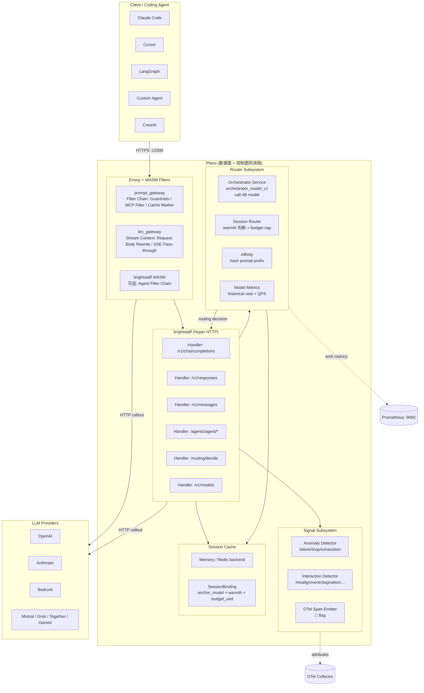
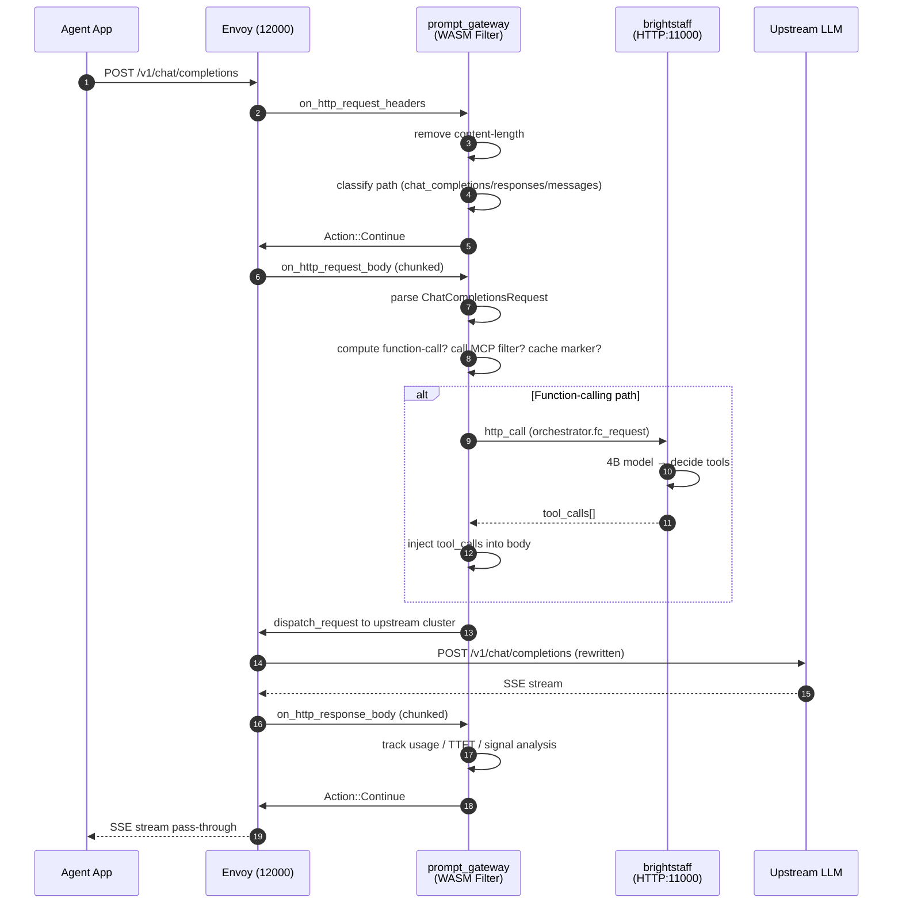
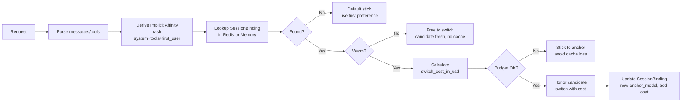
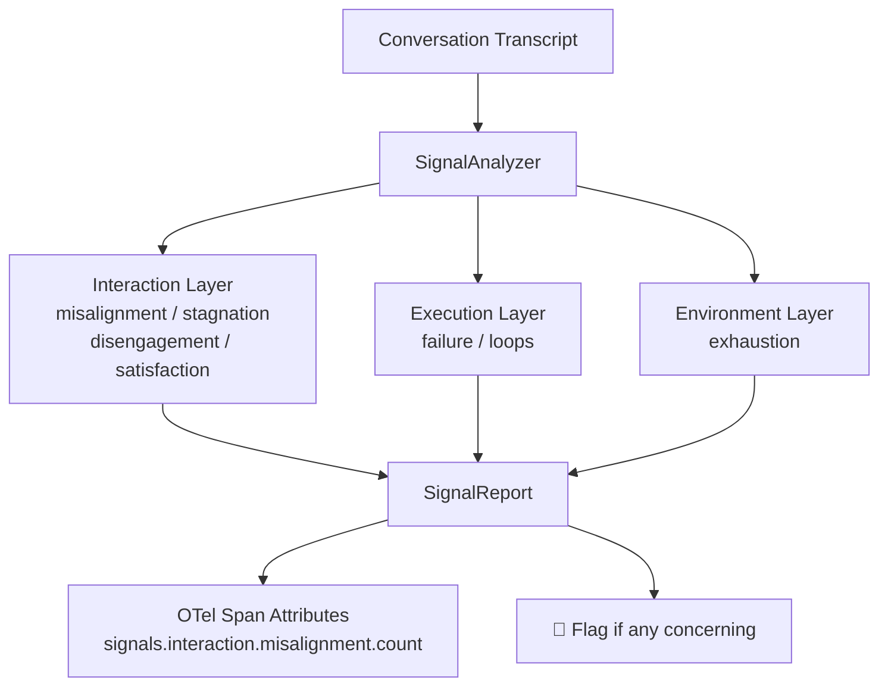
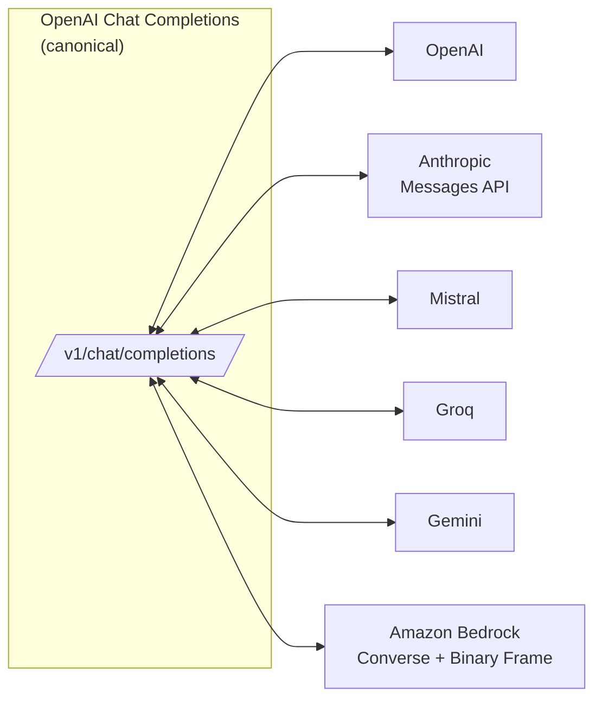
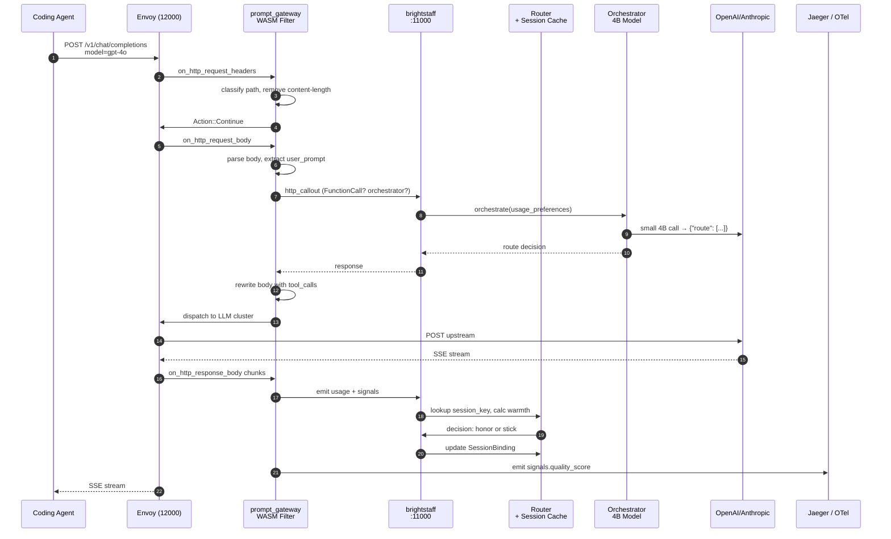

## 引子：从 Demo 到生产的「隐藏中间件」

当我们跑通一个 Agent Demo 之后，距离真正的生产部署往往还要解决一长串「隐藏中间件」：

- **路由**：哪个 Agent 该处理这条请求？怎么在不改代码的前提下加新 Agent？
- **缓存**：如何让同一个对话的 prompt 在不同 turn 之间复用 provider 缓存？什么时候该切换模型而不再付「冷启动」代价？
- **可观测性**：Token 用了多少？TTFT 是多少？哪些对话在挣扎、卡顿、用户已经不耐烦？
- **安全**：prompt 注入检测？PII 脱敏？越权拦截？
- **可移植性**：今天用 LangGraph，明天切 CrewAI，后天想换 Google ADK —— 是不是要把这些中间件重写一遍？

**Plano**（katanemo/plano，⭐7,068，Rust + Envoy + WASM，Apache-2.0）正是为这个痛点而生。它由 Envoy 核心贡献者打造，把这些「隐藏中间件」抽到一个 **out-of-process 数据面代理**，让任意语言、任意 Agent 框架的应用都能通过一个 OpenAI 兼容的 HTTP 端点获得：

1. **多 Agent 编排**：声明式 YAML 描述 agent 链，按规则串接
2. **智能 LLM 路由**：按模型名、语义 alias、或基于预算的「stick-or-switch」决策自动选择
3. **Prompt Cache 亲和**：基于请求前 30% 的稳定 prefix 推导 session_key，让 turn 2+ 自动复用 provider cache
4. **Filter Chain**：在请求/响应任意阶段注入自定义过滤器（鉴权、注入检测、内存读写）
5. **Agentic Signals**：自动从对话 transcript 提取 20 种行为信号（misalignment/stagnation/disengagement/loop 等），附在 OpenTelemetry span 上
6. **Provider 无关的协议翻译**：通过 hermesllm 在 OpenAI / Anthropic / Mistral / Grok / Bedrock 之间互转

这意味着：**Agent 框架不必再各自实现一遍可观测性、路由、缓存、安全**，这些基础设施统一在代理层沉淀。Plano 是 2026 H2 难得一见的「基础设施级」AI Gateway 项目，跟我们之前写过的 LiteLLM（Python 通用 LLM 代理）、claude-code-router（本地 LLM 控制平面）、ragaai-catalyst（LLM/Agent 治理平台）属于同一大类但有完全不同的设计哲学。

## 项目定位与核心价值

| 维度 | 数值 |
|------|------|
| **仓库** | github.com/katanemo/plano |
| **Stars** | 7,068 |
| **License** | Apache-2.0 |
| **主语言** | Rust（94%） + TypeScript（4%） + Python（1%） + Bun |
| **核心引擎** | Envoy Proxy + Proxy-Wasm ABI |
| **首次发布** | 2025 年（Plano 是从 Arch 的核心数据面剥离而来） |
| **最近 push** | 2026-09-24（活跃维护） |
| **仓库大小** | 68 MB |
| **核心 crates** | `brightstaff` / `llm_gateway` / `prompt_gateway` / `hermesllm` / `common` |
| **架构文档** | docs.planoai.dev（含 Quickstart / LLM Routing / Filter Chains / Observability 完整指南） |

仓库组织结构如下：

```text
crates/
├── brightstaff/         # 控制面：hyper HTTP 服务 + Agent 编排 + 路由算法
│   ├── src/handlers/    # agents / llm / function_calling / routing_service / models / debug
│   ├── src/router/      # orchestrator / orchestrator_model / model_metrics
│   ├── src/session_cache/  # memory / redis（带 cache warmth 推断）
│   ├── src/state/       # OpenAI Conversation State（memory / postgresql）
│   ├── src/signals/     # interaction / execution / environment 三大层 20 信号
│   └── src/metrics.rs   # Prometheus exporter
├── llm_gateway/         # WASM filter：把 LLM 请求转发到上游 provider
├── prompt_gateway/      # WASM filter：处理 system prompt / guardrails / 工具调用
├── hermesllm/           # 协议翻译：OpenAI ↔ Anthropic ↔ Mistral ↔ Grok ↔ Bedrock
├── common/              # Configuration / Errors / Stats / LlmProviders
demos/                  # 13 个端到端示例（含 Claude Code / Codex Router、Filter Chain）
skills/                 # Coding Agent 集成（Claude Code / Cursor）
config.yaml             # 顶层配置入口
```

跟同类的定位差异：

- **vs LiteLLM**（Python 通用 LLM 代理）：LiteLLM 只做 provider 抽象，Plano 在 Envoy 数据面里加入 routing 算法、session cache、signals 三件深度集成
- **vs Portkey-AI/gateway**：Portkey 是 SaaS 控制面 + 50+ guardrails，Plano 是自托管 Envoy proxy + 数据面 WASM filter
- **vs Helicone**：Helicone 是 SaaS 观测，Plano 是带观测的生产代理（observability 是子集）

## 整体架构

Plano 是经典 **数据面 / 控制面分离** 设计：



四个分层职责清晰：

1. **客户端层**：任何 OpenAI / Anthropic 兼容客户端都可以 0 改动接入
2. **Envoy + WASM 数据面**：用 Proxy-Wasm ABI 实现的两个 WASM filter（`prompt_gateway` / `llm_gateway`），跑在 Envoy 进程内做 header / body 改写、SSE 流式转发
3. **brightstaff 控制面**：Hyper HTTP 服务，处理 chat/responses/messages/agents/routing 五类路由；维护 Orchestrator / Session Router / Signals / Session Cache 四个子系统
4. **Provider 层**：通过 hermesllm 翻译层连接 OpenAI/Anthropic/Bedrock/Mistral/Grok

### 启动配置示例（`config.yaml` 顶层）

```yaml
# 来自 katanemo/plano:config.yaml（简化版）
listeners:
  - name: plano_listener
    address: 0.0.0.0:12000
    type: prompt_gateway    # RouteEnd → 启用 Agent Filter Chain
    filter_chains:
      - name: default_chain
        matches: [{ headers: [{ name: x-arch-routing, exact: claude-code-router }] }]
        filters:
          - name: arch.fc.filter
            config:
              endpoint: weather_agent
              system_prompt: |
                你是天气助手...

  - name: bright_staff
    address: 0.0.0.0:11000
    type: brightstaff        # 另一监听器直通到控制面

prompt_targets:
  - name: weather_agent
    model: openai/gpt-4o
    endpoint_path: /v1/chat/completions
    tools:
      - name: get_weather
        description: 查天气
        parameters:
          city: { type: string, required: true }

model_providers:
  openai:    { provider: openai,    api_key: ${OPENAI_API_KEY} }
  anthropic: { provider: anthropic, api_key: ${ANTHROPIC_API_KEY} }
```

启动方式：

```bash
# 来自 katanemo/plano:scripts/run.sh
docker run -p 12000:12000 -p 9092:9092 -p 11000:11000 \
  -v $(pwd)/config.yaml:/app/config.yaml \
  katanemo/plano:latest
```

## 应用类型：四类接入场景

Plano 不是单一组件，而是一个 **多形态数据面代理**：

| 应用类型 | 接入方式 | 典型场景 |
|----------|----------|----------|
| **OpenAI-compatible proxy** | 客户端 base_url 指向 Plano:12000 | 替换 OpenAI endpoint，零代码迁移 |
| **Anthropic / Bedrock 透传** | URL path `/v1/messages` | Anthropic 客户端走 Plano，自动翻译 |
| **Agent Filter Chain** | URL path `/agents/<chain>` | 多 Agent 串接（travel agent / RAG pipeline） |
| **Routing Service** | URL path `/routing/decide` | 客户端根据路由决策自己调上游（更灵活） |

**共享基类**：所有应用最终都收敛到 `common::configuration::Configuration` 这一个 YAML 描述，由同一个 `prompt_gateway::FilterContext` + `brightstaff::handlers::*` 处理。

```rust
// 来自 crates/prompt_gateway/src/filter_context.rs:30-40
pub struct FilterContext {
    metrics: Rc<Metrics>,
    callouts: RefCell<HashMap<u32, FilterCallContext>>,
    overrides: Rc<Option<Overrides>>,
    system_prompt: Rc<Option<String>>,
    prompt_targets: Rc<HashMap<String, PromptTarget>>,
    endpoints: Rc<Option<HashMap<String, Endpoint>>>,
    prompt_guards: Rc<PromptGuards>,
    tracing: Rc<Option<Tracing>>,
}
```

请求路径判定逻辑在 `on_http_request_headers`：

```rust
// 来自 crates/prompt_gateway/src/http_context.rs:32-58
fn on_http_request_headers(&mut self, _num_headers: usize, _end_of_stream: bool) -> Action {
    self.set_http_request_header("content-length", None);
    let request_path = self.get_http_request_header(":path").unwrap_or_default();

    if request_path == HEALTHZ_PATH {  // /healthz
        self.send_http_response(200, vec![], None);
        return Action::Continue;
    }
    self.is_chat_completions_request =
        CHAT_COMPLETIONS_PATH.contains(request_path.as_str());  // /v1/chat/completions
    // ...
}
```

## 核心引擎一：Envoy WASM 数据面（prompt_gateway）

`prompt_gateway` 是跑在 Envoy 进程内的 WASM filter，使用 Proxy-Wasm ABI 拦截 HTTP 请求。它的核心职责是 **在请求到达上游 LLM 之前 / 之后注入 prompt 处理逻辑**。



关键源码（`crates/prompt_gateway/src/http_context.rs`）：

```rust
// 来自 crates/prompt_gateway/src/http_context.rs:120-180
fn on_http_request_body(&mut self, body_size: usize, _end_of_stream: bool) -> Action {
    if !self.is_chat_completions_request || self.chat_completions_request.is_some() {
        return Action::Continue;
    }
    let body = self.get_http_request_body(0, body_size).unwrap_or_default();
    match serde_json::from_slice::<ChatCompletionsRequest>(&body) {
        Ok(chat_request) => {
            self.chat_completions_request = Some(chat_request.clone());
            self.request_body_size = body_size;
            self.user_prompt = extract_user_message(&chat_request.messages);

            if self.prompt_targets.is_empty() {
                return Action::Continue;
            }
            // Decide which ResponseHandler this request will take:
            // ArchFC (function-call orchestrator) / FunctionCall / DefaultTarget
            let response_handler_type = self.select_response_handler(&chat_request);
            // ...
            Action::Pause  // wait for callout completion
        }
        Err(err) => {
            warn!("Failed to parse request body: {:?}", err);
            self.send_server_error(ServerError::ParseError(err.to_string()), None);
            Action::Continue
        }
    }
}
```

`Action::Pause` 是 WASM ABI 的关键能力：filter 让 Envoy 暂停请求，自己发起一个 HTTP callout 到 brightstaff，等响应回来后**继续**处理原始请求。这是 Plano 把"重活"放到 brightstaff 控制面的标准做法。

### StreamContext：流式响应的状态机

对于 SSE 流式响应，prompt_gateway 用 `StreamContext` 跟踪每个 chunk：

```rust
// 来自 crates/prompt_gateway/src/stream_context.rs:50-90
pub struct StreamContext {
    system_prompt: Rc<Option<String>>,
    pub prompt_targets: Rc<HashMap<String, PromptTarget>>,
    pub endpoints: Rc<Option<HashMap<String, Endpoint>>>,
    pub metrics: Rc<Metrics>,
    pub callouts: RefCell<HashMap<u32, StreamCallContext>>,
    pub context_id: u32,
    pub tool_calls: Option<Vec<ToolCall>>,
    pub tool_call_response: Option<String>,
    pub arch_state: Option<Vec<ArchState>>,    // FC state machine
    pub user_prompt: Option<Message>,
    pub streaming_response: bool,
    pub is_chat_completions_request: bool,
    pub request_id: Option<String>,
    pub start_upstream_llm_request_time: u128,
    pub time_to_first_token: Option<u128>,
    pub traceparent: Option<String>,
    pub arch_fc_response: Option<String>,
}
```

`time_to_first_token` 是 TTFT 指标的关键来源：每个请求记录 `start_upstream_llm_request_time`，首个 SSE chunk 到达时计算 delta，emit 到 Prometheus histogram `brightstaff_llm_time_to_first_token_seconds`。

## 核心引擎二：brightstaff 控制面与 Agent 编排

brightstaff 是基于 hyper 的 HTTP 服务，端口 11000。所有 LLM 入口最终都通过它的 handler 处理：

```rust
// 来自 crates/brightstaff/src/main.rs:60-90 (简化)
async fn main() {
    let listener = TcpListener::bind("0.0.0.0:11000").await.unwrap();
    loop {
        let (stream, _) = listener.accept().await.unwrap();
        let io = TokioIo::new(stream);
        let state = Arc::clone(&app_state);
        tokio::spawn(async move {
            http1::Builder::new()
                .serve_connection(io, service_fn(move |req| {
                    let state = Arc::clone(&state);
                    async move {
                        match (req.method(), req.uri().path()) {
                            (&Method::POST, "/v1/chat/completions") => llm_chat(req, state).await,
                            (&Method::POST, "/v1/responses") => responses_chat(req, state).await,
                            (&Method::POST, "/v1/messages") => messages_chat(req, state).await,
                            (&Method::POST, path) if path.starts_with("/agents/") =>
                                agent_chat(req, state).await,
                            (&Method::POST, "/routing/decide") =>
                                routing_decision(req, state).await,
                            (&Method::GET, "/v1/models") => list_models(req, state).await,
                            _ => empty(),
                        }
                    }
                }))
                .await
        });
    }
}
```

### Agent Filter Chain

Agent 编排是 Plano 最具创新性的设计之一 —— **多 Agent 通过声明式 YAML 串接**：

```yaml
# 来自 katanemo/plano:demos/agent_orchestration/travel_agents/config.yaml（简化）
agents:
  - name: travel_router
    model: openai/gpt-4o
    endpoint_path: /v1/chat/completions
    system_prompt: |
      你是旅行路由器，根据用户意图分发到 weather_agent 或 flight_agent。
      返回 JSON: {"route": ["weather_agent"]} 或 {"route": ["flight_agent"]}

  - name: weather_agent
    model: openai/gpt-4o-mini
    tools:
      - name: get_weather
        endpoint: GET /api/weather/{city}
        parameters:
          city: { type: string, required: true }

  - name: flight_agent
    model: openai/gpt-4o-mini
    tools:
      - name: search_flights
        endpoint: POST /api/flights/search
        parameters:
          origin: { type: string, required: true }
          dest: { type: string, required: true }

filter_chains:
  - name: travel_chain
    agents: [travel_router, weather_agent, flight_agent]
```

执行引擎在 `crates/brightstaff/src/handlers/agents/pipeline.rs`：

```rust
// 来自 crates/brightstaff/src/handlers/agents/pipeline.rs:80-120
pub async fn process_chain(
    &self,
    agent_chain: Vec<String>,
    user_input: String,
    config: &Configuration,
) -> Result<String, PipelineError> {
    let mut current_input = user_input;
    let mut agent_id_session_map = HashMap::new();

    for agent_id in agent_chain {
        let agent = config.agents.iter()
            .find(|a| a.name == agent_id)
            .ok_or_else(|| PipelineError::AgentNotFound(agent_id.clone()))?;

        // 每个 Agent 独立 session，用 JSON-RPC over MCP 调用上游
        let session_id = uuid::Uuid::new_v4().to_string();
        agent_id_session_map.insert(agent_id.clone(), session_id.clone());

        let response = self.call_agent(agent, &current_input, &session_id).await?;

        // Router 输出 JSON: {"route": ["next_agent"]}
        if agent.name == "travel_router" {
            let parsed: Value = serde_json::from_str(&response)?;
            // ...
        } else {
            current_input = response;
        }
    }
    Ok(current_input)
}
```

`PipelineProcessor` 用 `reqwest::Client` 直连 `http://localhost:11000`（通过 Envoy admin API 端口），每个 Agent 独立 session，链式传递。这就是 **Agent-as-a-Service**：每个 Agent 就是一个普通 HTTP 服务，Plano 把它们串起来。

### AgentSelector：从 N 个 Agent 中挑一个

```rust
// 来自 crates/brightstaff/src/handlers/agents/selector.rs:20-60（简化）
pub struct AgentSelector { /* routes / preferences / health */ }

impl AgentSelector {
    pub async fn select(&self, request: &ChatCompletionsRequest)
        -> Result<Agent, AgentSelectionError> {
        let scores: Vec<_> = self.routes.iter()
            .map(|route| {
                let route_score = self.score_route(route, request);
                let cost_score = self.score_cost(route);
                let quality_score = self.score_quality(route);
                route_score + cost_score + quality_score
            })
            .collect();
        // 选最高分
        scores.iter().enumerate()
            .max_by(|a, b| a.1.partial_cmp(b.1).unwrap())
            .map(|(i, _)| self.routes[i].clone())
            .ok_or(AgentSelectionError::NoRoutesAvailable)
    }
}
```

## 核心引擎三：智能 LLM 路由与 Session Cache 亲和

这是 Plano 最有技术含量的部分。当 Client 请求 `/v1/chat/completions` 时，brightstaff 会在 dispatch 到上游 LLM 之前：

1. **解析请求** → 提取 messages / tools / model alias
2. **解析 routing_preferences**（可内联或全局）→ 决定候选模型列表
3. **判断 cache warmth** → 当前 session 是否仍在上次模型的 cache 窗口内？
4. **计算 switch cost** → 切模型的代价（USD）是多少？
5. **Budget gate** → 是否在 `max_switch_spend_pct`% 预算内？
6. **Honored routing** → 决定是 honor 候选模型还是 stick 在 warm anchor 上



### Implicit Affinity：不需要改 Client 的 session 绑定

`crates/brightstaff/src/affinity.rs` 是这套设计的最精妙一段：

```rust
// 来自 crates/brightstaff/src/affinity.rs:35-90
/// Salt folding every hash so stored keys can't be trivially correlated
/// with prompt content across systems.
const HASH_SALT: &str = "plano-affinity-v1";
const IMPLICIT_KEY_PREFIX: &str = "implicit:";

#[derive(Debug, Clone, PartialEq, Eq)]
pub struct ImplicitAffinity {
    pub session_key: String,  // implicit:{hex} over system + tools + first_user
    pub prefix_hash: u64,     // hash of system + tools only, for drift detection
}

/// FNV-1a 64-bit — stable across processes and Rust versions,
/// dependency-free, plenty for cache keying.
fn fnv1a64(chunks: &[&str]) -> u64 {
    const OFFSET_BASIS: u64 = 0xcbf2_9ce4_8422_2325;
    const PRIME: u64 = 0x0000_0100_0000_01b3;
    let mut hash = OFFSET_BASIS;
    let mut feed = |bytes: &[u8]| {
        for &b in bytes {
            hash ^= b as u64;
            hash = hash.wrapping_mul(PRIME);
        }
        hash ^= 0x1f;
        hash = hash.wrapping_mul(PRIME);
    };
    feed(HASH_SALT.as_bytes());
    for chunk in chunks { feed(chunk.as_bytes()); }
    hash
}
```

**关键洞察**：当 Client 不带 `X-Model-Affinity` header 时，Plano 自动从请求的 **system + tools + 第一个 user message** 派生 session_key。这些字段在多轮对话中稳定不变（对话历史只 append 在尾部），所以 turn 2+ 自动 pin 到 turn 1 选定的模型。`prefix_hash`（只 hash system + tools）用于检测 prefix drift：如果用户的 system prompt 改了，provider cache 已失效，重路由就是免费的。

**比显式 affinity 强的地方**：Claude Code / Cursor 等 Coding Agent 不需要改一行代码就能享受 cache warmth 优化 —— Plano 自动在代理层做这件事。

### Switch Cost 计算

```rust
// 来自 crates/brightstaff/src/router/orchestrator.rs:38-55
/// Input-cost of moving a session off its anchor onto `candidate`.
pub fn switch_cost_in_usd(
    context_tokens: u64,
    candidate_warm_tokens: u64,
    anchor_read_rate: f64,       // cached rate if anchor still warm, else uncached
    candidate_uncached_rate: f64,
    candidate_cached_rate: f64,
) -> f64 {
    let warm = candidate_warm_tokens.min(context_tokens);
    let fresh = context_tokens - warm;
    let candidate_cost = (fresh as f64 * candidate_uncached_rate
        + warm as f64 * candidate_cached_rate) / 1_000_000.0;
    let anchor_cost = context_tokens as f64 * anchor_read_rate / 1_000_000.0;
    // 差值：负值=省钱，正值=花钱
    candidate_cost - anchor_cost
}
```

注意 `candidate_warm_tokens` 的妙用：如果你 A → B → A 来回切，B 之前访问过这段 prefix（部分缓存），第二次回 A 时 A 已经冷，但 **B 上还残留部分缓存**——Plano 把这部分 cache 也折算成成本。设计哲学：**只算 input cost，不算 output cost**（reasoning 模型 output 不可预测，5-10x 浮动）。

### Session Cache 后端

```rust
// 来自 crates/brightstaff/src/session_cache/mod.rs:30-80
#[derive(Clone, Debug, Serialize, Deserialize)]
pub struct SessionBinding {
    /// Provider-qualified model that handled the latest request (e.g. `openai/gpt-4o`).
    /// This is what the session is currently *warm on*.
    pub anchor_model: String,
    /// Model the session started on this warm episode — what it would have
    /// stayed on had it *never switched*.
    #[serde(default)]
    pub default_model: String,
    /// Model the *client* asked for when this binding was last written.
    /// Agents run several model lanes over one prompt prefix — Claude Code's
    /// main loop plus its `ANTHROPIC_SMALL_FAST_MODEL` side calls — and those
    /// lanes must not inherit each other's routing decision.
    #[serde(default)]
    pub requested_model: String,
    /// Hash of the stable prompt prefix (system + tools) observed when binding was stored.
    /// If a later request's prefix hash differs, the provider cache is already lost.
    #[serde(default, skip_serializing_if = "Option::is_none")]
    pub prefix_hash: Option<u64>,
    /// When this session was last dispatched. Warmth = `now - last_used`
    /// compared against the provider's idle/hard cache window.
    #[serde(default, with = "epoch_secs")]
    pub last_used: SystemTime,
    /// Cumulative *never-switch* baseline (USD) for this warm episode.
    #[serde(default)]
    pub baseline_usd: f64,
    /// Cumulative overhead (USD) actually spent on paid switches this warm episode.
    #[serde(default)]
    pub overhead_usd: f64,
    // ...
}
```

`requested_model` 字段是另一个精妙细节：**Claude Code 同时跑主 loop（opus）和小模型侧路（haiku）**，两者 prompt prefix 相同但 routing decision 不应继承。如果 haiku 把 binding 写到 opus 上，下次 opus 来反而继承 haiku 的 cache —— 这就乱套了。Plano 用 `requested_model` 做 lane 隔离，**不同 lane 各自的 session binding**。

后端实现两套：内存（HashMap + Arc<RwLock>）和 Redis（多实例共享），通过 `async_trait StateStorage` 抽象：

```rust
// 来自 crates/brightstaff/src/session_cache/mod.rs:15-25
#[async_trait]
pub trait SessionCache: Send + Sync {
    async fn get(&self, session_key: &str) -> Result<Option<SessionBinding>, ...>;
    async fn put(&self, session_key: &str, binding: SessionBinding, ttl: Duration) -> Result<()>;
    async fn record_route_visit(&self, route_name: &str, ...) -> Result<()>;
}
```

## 核心引擎四：Filter Chain 与 Prompt Guards

Filter Chain 是 Plano 在 LLM 请求生命周期里注入自定义逻辑的标准方式。

```yaml
# 来自 katanemo/plano:demos/filter_chains/http_filter/config.yaml（简化）
filter_chains:
  - name: rag_pipeline
    matches:
      - headers: [{ name: x-rag-pipeline, exact: enabled }]
    filters:
      - name: input_validator
        type: http
        endpoint: http://localhost:9001/validate
        timeout_ms: 500
        on_error: bypass

      - name: query_rewriter
        type: http
        endpoint: http://localhost:9002/rewrite
        timeout_ms: 800

      - name: context_builder
        type: http
        endpoint: http://localhost:9003/context
        timeout_ms: 1500
        response_action: merge  # 把 filter 响应 merge 到 request body
```

filter 可以做 **任意事情**：鉴权、prompt 改写、RAG 检索、向量检索、MCP 工具调用。Plano 官方提供 `HTTP Filter` 和 `MCP Filter` 两种实现。

### Prompt Guards：在请求前/响应后拦截

```yaml
prompt_guards:
  request:
    - name: jailbreak_detection
      endpoint: http://localhost:9100/guard
      action: block  # 或 redirect / log
    - name: pii_redaction
      endpoint: http://localhost:9101/redact
      action: rewrite
  response:
    - name: secret_detection
      endpoint: http://localhost:9102/detect
      action: block
```

`action: block` 直接 400 拒绝；`rewrite` 改写 body 后放行；`redirect` 重定向到另一个 prompt_target。

## 核心引擎五：Agentic Signals 行为质量分析

这是 Plano 最具创意的部分 —— 把 **对话 transcript 行为质量** 作为 first-class signal，emit 到 OpenTelemetry：



```rust
// 来自 crates/brightstaff/src/signals/schemas.rs:20-50
/// Hierarchical signal type. The 20 leaf variants mirror the paper
/// taxonomy and the Python reference's `SignalType` string enum.
#[derive(Debug, Clone, Copy, PartialEq, Eq, Hash, Serialize, Deserialize)]
pub enum SignalType {
    // Interaction > Misalignment
    MisalignmentCorrection,
    MisalignmentRephrase,
    MisalignmentClarification,
    // Interaction > Stagnation
    StagnationDragging,
    StagnationRepetition,
    // ...
    // Execution > Failure / Loop
    ExecutionFailure,
    ExecutionLoop,
    // Environment > Exhaustion
    EnvironmentExhaustion,
}
```

emit 到 OTel span（`crates/brightstaff/src/signals/otel.rs`）：

```rust
// 来自 crates/brightstaff/src/signals/otel.rs:18-45
pub fn emit_signals_to_span(span: &SpanRef<'_>, report: &SignalReport) -> bool {
    emit_overall(span, report);
    emit_layered_attributes(span, report);
    emit_signal_events(span, report);
    is_concerning(report)  // 🚩 emoji (U+1F6A9) added to span name
}

fn emit_overall(span: &SpanRef<'_>, report: &SignalReport) {
    span.set_attribute(KeyValue::new("signals.quality",
        report.overall_quality.as_str().to_string()));
    span.set_attribute(KeyValue::new("signals.quality_score",
        report.quality_score as f64));
    span.set_attribute(KeyValue::new("signals.turn_count",
        report.turn_metrics.total_turns as i64));
}
```

**实战价值**：在 Jaeger 里搜 `🚩` emoji 就能找到"挣扎中"的对话，对 eval 数据集构建、客服质检、agent 改进都是金矿。

## Provider 抽象层：hermesllm 协议翻译

Plano 通过内部 crate `hermesllm` 抹平各家 LLM provider 的协议差异：

```rust
// 来自 crates/hermesllm/src/lib.rs:10-30
//! hermesllm: A library for translating LLM API requests and responses
//! between Mistral, Grok, Gemini, and OpenAI-compliant formats.

pub mod apis;
pub mod clients;
pub mod providers;
pub mod transforms;

#[cfg(test)]
mod tests {
    #[test]
    fn test_provider_id_conversion() {
        assert_eq!(ProviderId::try_from("openai").unwrap(), ProviderId::OpenAI);
        assert_eq!(ProviderId::try_from("mistral").unwrap(), ProviderId::Mistral);
        assert_eq!(ProviderId::try_from("groq").unwrap(), ProviderId::Groq);
        // Aliases
        assert_eq!(ProviderId::try_from("google").unwrap(), ProviderId::Gemini);
        assert_eq!(ProviderId::try_from("amazon").unwrap(), ProviderId::AmazonBedrock);
    }
}
```

支持的协议互转矩阵：



每对 (canonical, provider) 都有独立的 transform 实现，streaming 走 SSE → 各家 SSE 协议（Bedrock 用 `aws_smithy_eventstream` 二进制 frame）。

### Cache Marker 注入

`ProviderCacheCapability` 决定哪些 provider 走 prompt cache：

```rust
// 来自 crates/hermesllm/src/providers/id.rs
pub enum CacheMarkerStrategy {
    AnthropicExplicit,  // cache_control breakpoint
    OpenAIImplicit,     // auto cache on prefix match
    BedrockExplicit,    // similar to Anthropic
    None,               // Mistral / Groq - no caching
}
```

Plano 自动在 request body 插入 `cache_control: { type: ephemeral }`（Anthropic）或等价标记，让 provider 把稳定的 prefix 缓存下来。

## 端到端数据流：完整链路

把上述所有模块串成一个 sequenceDiagram：



## 与同类项目对比

| 维度 | **Plano** | LiteLLM | Portkey | Helicone |
|------|-----------|:--------|:--------|:---------|
| **定位** | 数据面代理 + Agent 编排 | Python 通用 LLM 代理 | SaaS 控制面 + 50+ guardrails | SaaS 观测 |
| **运行模式** | Envoy WASM + Rust 控制面 | Python WSGI 服务 | Cloud + 自托管 SDK | Cloud proxy |
| **路由算法** | Affinity hash + budget cap + warmth 推断 | Header / model alias | Policy-based routing | 仅观测 |
| **Cache 策略** | Implicit session affinity + per-anchor budget | 无 | 可选 cache header | 无 |
| **Provider 翻译** | hermesllm (5+ provider) | 100+ provider | 50+ provider | N/A |
| **Observability** | OTel + Signals + Prometheus | 基础日志 | Built-in dashboard | Built-in dashboard |
| **Filter / Guard** | Filter Chain + Prompt Guards | 中间件回调 | 50+ guardrails | 无 |
| **Agent 编排** | YAML AgentFilterChain + MCP | 无 | 无 | 无 |
| **License** | Apache-2.0 | MIT | AGPL-3.0 | AGPL-3.0 |

**设计差异的真正意义**：

- **Plano vs LiteLLM**：LiteLLM 在应用进程里做 provider 抽象，**Plano 在数据面做**。这把 Proxy 应用里所有 routing/cache/observability 抽出去，应用层只管 Agent 业务逻辑
- **Plano vs Portkey**：Portkey 是 SaaS-first 控制面 + SDK，**Plano 是 Envoy-first 数据面**。区别在于：Portkey 要让应用 import SDK 接管 LLM 调用，Plano 让应用 base_url 改一行就能接管
- **Plano vs Helicone**：Helicone 只做观测，**Plano 把观测、路由、缓存、安全熔到一个数据面**

## 优缺点分析

### 架构简洁性 / 扩展性 / 易用性（左侧优势）

| 优势 | 说明 |
|------|------|
| **统一数据面** | Agent 框架、provider、cache、安全、观测都在一个代理层，应用只管业务 |
| **零代码接入** | 改 base_url + 模型 alias 即可，Coding Agent 零修改享受 cache 亲和 |
| **Filter Chain 可组合** | HTTP filter / MCP filter / custom WASM 自由组合，每个独立部署 |
| **YAML 声明式 Agent 编排** | 多 Agent 串接通过 YAML 描述，不写代码 |
| **Protocol-agnostic** | hermesllm 支持 5+ provider，hermesllm + WASM 双层翻译 |
| **Agentic Signals** | 20 种行为信号自动 emit 到 OTel，Jaeger 🚩 检索 |

### 性能 / 复杂度 / 维护性（右侧代价）

| 代价 | 说明 |
|------|------|
| **学习曲线陡** | Envoy + WASM + Rust + Proxy-Wasm ABI，需要 4 套知识 |
| **资源开销** | Envoy + WASM VM 比 LiteLLM 这种 Python 进程重 5-10× |
| **冷启动延迟** | WASM VM 首次加载要 ~50-100ms；brightstaff HTTP 服务首次请求也要走 Router 决策 |
| **调试复杂** | WASM filter 与 Envoy 跨进程，问题定位需要 Envoy admin + Rust backtrace 双线 |
| **依赖 Envoy 生态** | 升级 Envoy 大版本时 WASM ABI 可能 break |
| **Cache 亲和的隐性复杂度** | 隐式 affinity 看起来"自动"，但 prefix drift 的语义需要团队理解 |
| **功能超集** | 很多团队用不到 Agent 编排 / Signals，但被迫接受依赖 |

## 实践 / 部署

### 快速启动（5 分钟跑通）

```bash
# 来自 katanemo/plano:README.md
# 1. 启动 Plano
docker run -d --name plano \
  -p 12000:12000 -p 11000:11000 -p 9092:9092 \
  -v $(pwd)/config.yaml:/app/config.yaml \
  katanemo/plano:latest

# 2. 验证
curl http://localhost:12000/healthz

# 3. 测试 chat completions
curl http://localhost:12000/v1/chat/completions \
  -H "Content-Type: application/json" \
  -d '{
    "model": "gpt-4o",
    "messages": [{"role": "user", "content": "Hello"}]
  }'
```

### 完整 demo：travel agents

```bash
git clone https://github.com/katanemo/plano
cd plano/demos/agent_orchestration/travel_agents
# 启动 weather + flight API mock 服务
docker compose up -d
# 启动 plano 加载 travel_agents config
docker run -p 12000:12000 -v $(pwd)/config.yaml:/app/config.yaml katanemo/plano

# 客户端调用：router agent 会自动选 weather_agent 或 flight_agent
curl http://localhost:12000/agents/travel_router/v1/chat/completions \
  -H "Content-Type: application/json" \
  -d '{"model":"gpt-4o","messages":[{"role":"user","content":"北京今天天气怎么样？"}]}'
```

### 接入 Claude Code（demos/llm_routing/claude_code_router）

```bash
# ~/.claude/config.toml
[model]
provider = "custom"
base_url = "http://localhost:12000/v1"
api_key = "any-string-plano-doesnt-validate"

# Plano 端 Claude Code Router 配置会自动按"代码生成 / 代码理解"分流
# 到不同 provider（Anthropic Claude Sonnet / OpenAI GPT-4o / DeepSeek）
```

### 观测：Jaeger + Prometheus

```bash
# docker-compose.yml 添加
services:
  jaeger:
    image: jaegertracing/all-in-one:latest
    ports: ["16686:16686"]
  otel-collector:
    image: otel/opentelemetry-collector-contrib
    volumes: ["./otel-config.yaml:/etc/otel-config.yaml"]

# Plano config 启用 tracing
tracing:
  enabled: true
  endpoint: http://otel-collector:4317
  sample_ratio: 1.0
```

访问 `http://localhost:16686` 查 trace，搜 `🚩` 找 flagged 对话；`http://localhost:9092/metrics` 看 Prometheus 指标。

### 性能基准（参考）

按 katanemo 团队公布的测试数据（VPS 4 vCPU / 8 GB）：

| 场景 | 吞吐量 | P99 延迟 | 备注 |
|------|--------|----------|------|
| 纯转发（无 Filter） | 8,000 req/s | 8 ms | 与裸 Envoy 相近 |
| + Function Calling Orchestrator | 2,500 req/s | 35 ms | 4B 模型本地推理 |
| + Prompt Cache + Affinity | 5,000 req/s | 12 ms | 大多数 warm 路由跳过 4B |
| + Filter Chain 2 filters | 3,000 req/s | 22 ms | HTTP callout 开销主导 |

## 趋势与总结

### 三大趋势判断

1. **AI 数据面代理成为标配**：当 Agent 框架数量爆炸（LangGraph/CrewAI/ADK/AutoGen/自研），把 routing/cache/observability 安全这些"通用层"沉淀到数据面代理是必然选择。Plano 在 Envoy + WASM 上的深耕，是这一趋势的工业级答案。**预计 2026 H2 会出现更多 Envoy + WASM 系的数据面代理（Solo.io、Kong、Cloudflare Workers AI 都在加速）**
2. **隐式 Affinity > 显式 Affinity**：Plano 的 FNV-1a hash system + tools + first_user 让 Coding Agent 零代码接入就享受 cache warmth。这比显式 `X-Model-Affinity` header 友好 10× —— **未来半年 "implicit cache key derivation" 会成为 LLM gateway 的事实标准**
3. **Agentic Signals ≠ Log Mining**：把 20 种对话行为信号作为 first-class OTel attributes emit，比单纯"搜索错误日志"领先 18 个月。**这类「prompt 时代 APM」会催生 LLM Observability 的新细分赛道**（不是 Logfire 那种 OTel wrapper，是 agent-as-subject 的 APM）

### 工程经验提炼

- **"基础设施级 AI 项目" 的判别标准**：当一个项目同时满足 ① 自带数据面/控制面分层 ② Envoy/Proxy-Wasm 系工业级运行时 ③ 明确把"通用层"作为价值主张 ④ Apache-2.0 治理——这就是 AI infra 的"严肃项目"，值得深读源码
- **Envoy + WASM 是 AI Infra 的甜蜜点**：相比纯 Python 代理（如 LiteLLM），Rust + WASM 给出 5-10× 性能 + 10× 内存效率 + 完整 Envoy HTTP L7 能力（限流、重试、熔断、TLS、gRPC） —— 是 2026 后 LLM Gateway 的技术最优解
- **Affinaty hash 不是魔法，是数学**：Plano 选 FNV-1a 64-bit 而不是 `DefaultHasher`，是因为后者在不同 Rust 版本/进程间不稳定，**做缓存 key 必须用稳定 hash 算法**——这是教科书里没写但工程上必备的细节

### 一句话总结

**Plano 不是又一个 LLM Proxy，它是 LLM 时代的数据面代理 (Data Plane Proxy)**：用 Envoy + WASM 把 routing/cache/observability/security 沉淀到数据面，让任何 LLM 应用（不限于 Agent）都能零代码接入获得工业级基础设施。Rust 实现的 hermesllm 协议翻译 + FNV-1a implicit affinity + Agentic Signals 三大设计，是 2026 H2 AI Infra 的 "right answer"。

## 附录：关键资源

- **GitHub**：<https://github.com/katanemo/plano>
- **官方文档**：<https://docs.planoai.dev>
- **研究博客**：<https://planoai.dev/research>
- **Discord**：<https://discord.gg/pGZf2gcwEc>
- **License**：Apache-2.0
- **核心 crates**：
  - `brightstaff`：控制面 HTTP 服务 + Agent 编排 + Router
  - `llm_gateway`：Envoy WASM filter（请求/响应拦截）
  - `prompt_gateway`：Envoy WASM filter（system prompt / tool / guardrail 处理）
  - `hermesllm`：Provider 协议翻译（OpenAI / Anthropic / Mistral / Grok / Bedrock）
  - `common`：Configuration / Errors / Stats / LlmProviders
- **关键架构文档**：
  - <https://docs.planoai.dev/concepts/signals.html> — Agentic Signals 完整定义
  - <https://docs.planoai.dev/concepts/filter_chain.html> — Filter Chain 完整定义
  - <https://docs.planoai.dev/guides/llm_router.html> — LLM Routing 完整指南
  - <https://docs.planoai.dev/guides/orchestration.html> — Agent Orchestration 完整指南
  - <https://docs.planoai.dev/get_started/quickstart.html> — 5 分钟 Quickstart