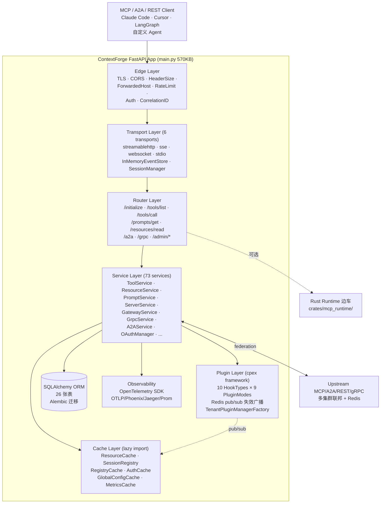
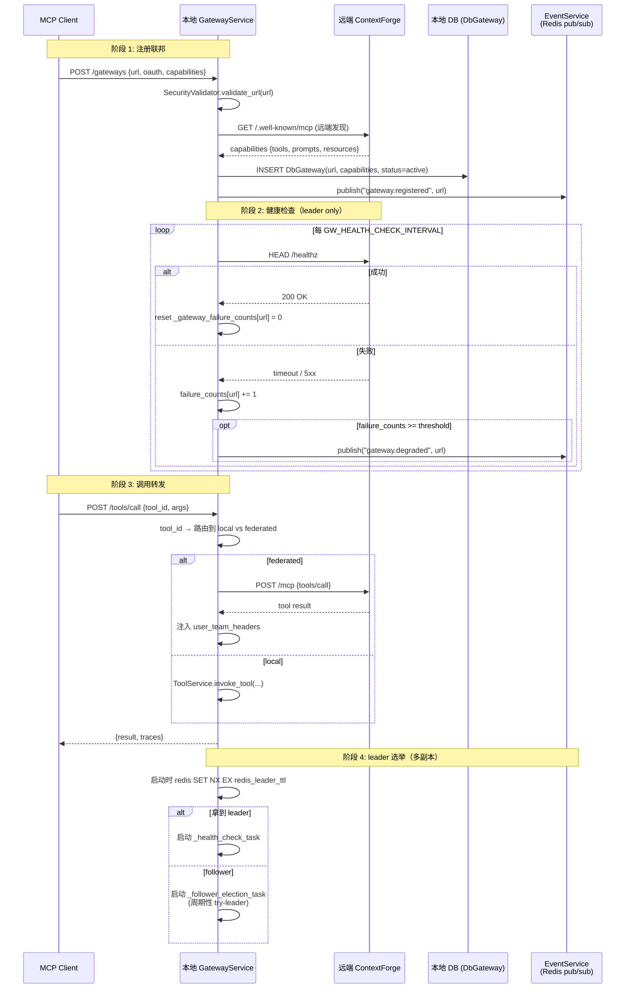
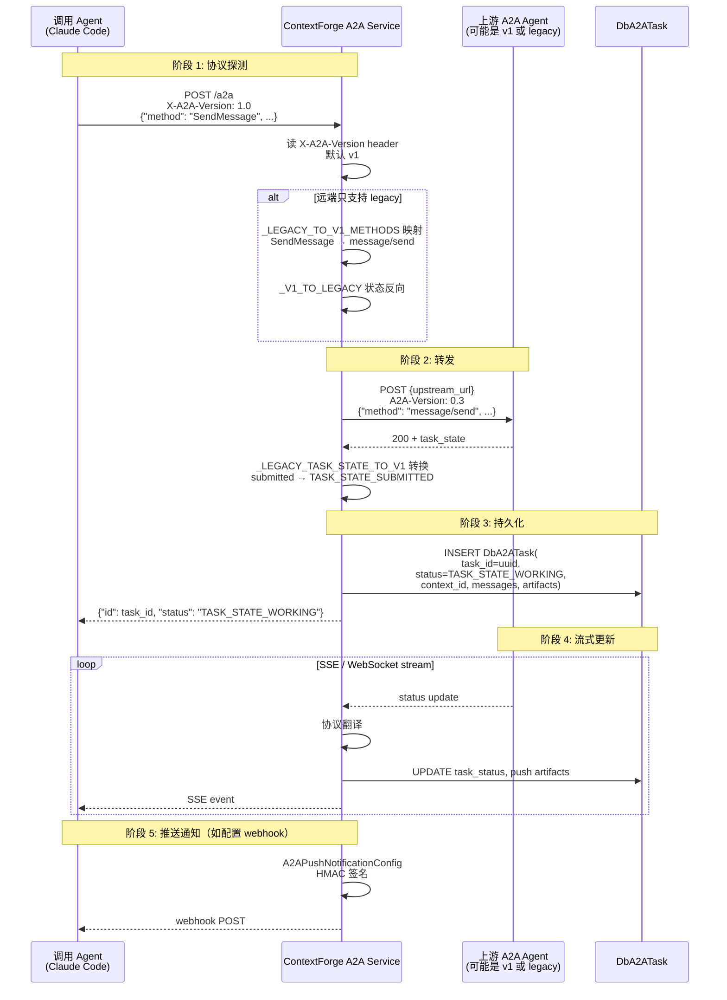
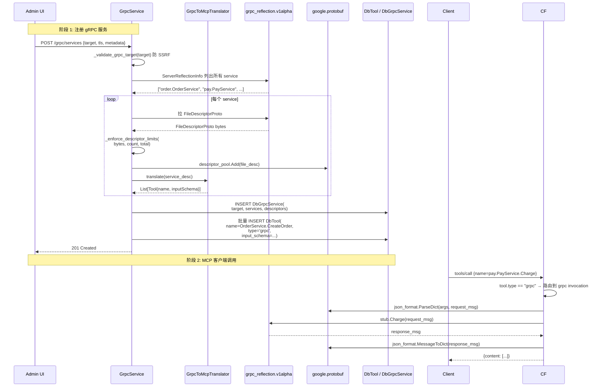
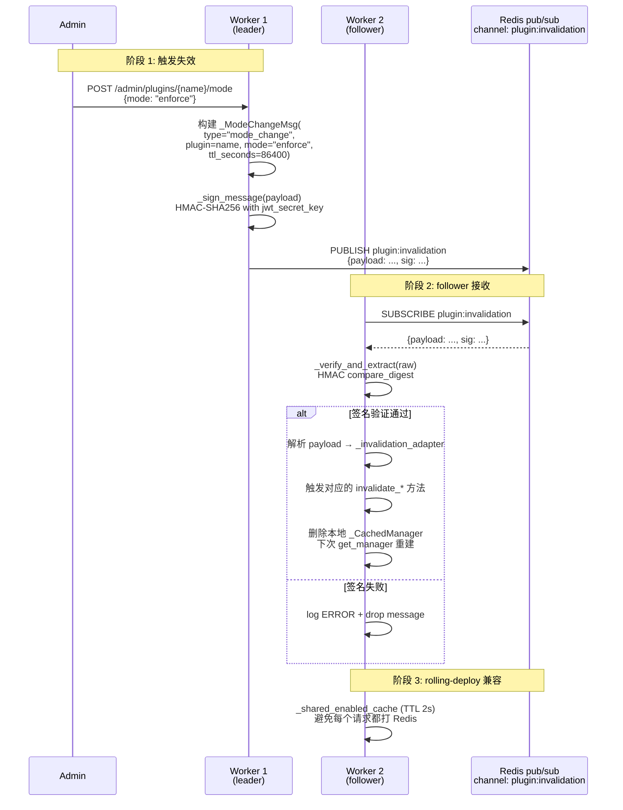
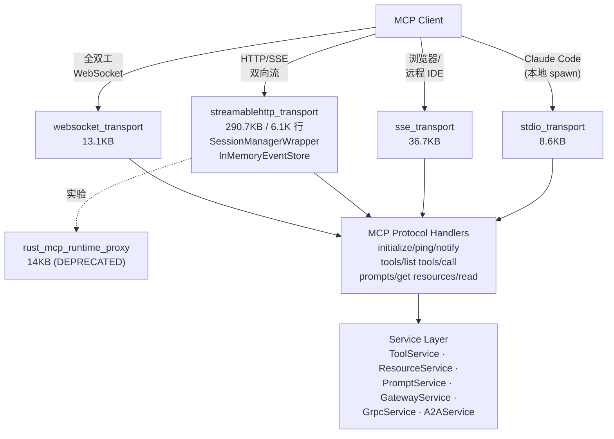
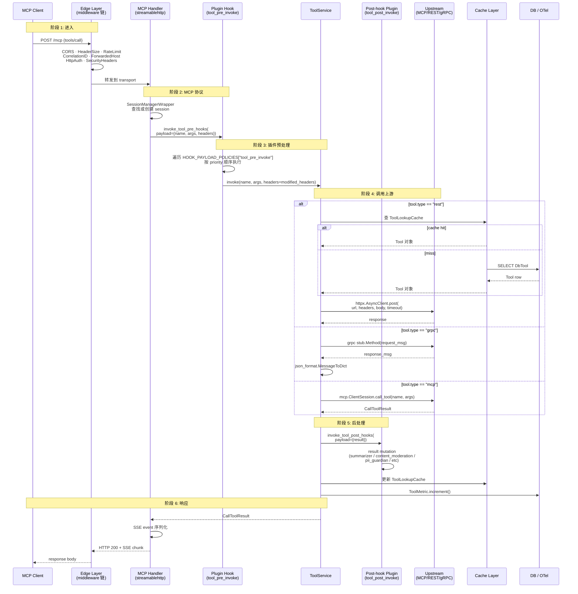

## 一、引子：当 MCP 撞上企业基础设施

2026 年的 Agent 生态里，有一个被反复讨论却始终没有"标准答案"的问题：**当一个企业同时运行几十个内部 MCP Server、上百个 REST API、若干 gRPC 微服务，还有外部的 A2A Agent 时，Agent 客户端该怎么访问它们？**

最朴素的答案是"客户端连每个 Server"。但这立刻会撞上几面墙：

- **可发现性**：客户端怎么知道现在有哪些 Server、每个 Server 暴露了哪些 tool？
- **可观测性**：谁在什么时候调用了哪个 tool、延迟多少、是否触发了安全策略？
- **可治理性**：能不能统一鉴权、限流、做 prompt injection 防护、跑 PII 过滤？
- **可联邦性**：当一个 MCP Gateway 自身又要被另一个 Gateway 联邦时，协议怎么对齐？

`IBM/mcp-context-forge`（下文简称 ContextForge）就是 IBM 给出的工程级答案 —— **它把 MCP Gateway、MCP Registry、MCP Proxy、A2A Gateway、API Gateway、Plugin Engine 全部揉进同一个 FastAPI 应用里**，并且以 Apache-2.0 完全开源。

截至 2026-09-25，仓库数据：

| 指标 | 数值 |
|------|------|
| ⭐ Stargazers | 4,534 |
| 主语言 | Python（97%）+ Rust（crates/mcp_runtime/） |
| License | Apache-2.0 |
| 默认分支 | `main` |
| 最新推送 | 2026-09-25（活跃） |
| 仓库大小 | 443.1 MB（含 gRPC reflection 描述符缓存、PyPI 锁文件等） |
| 协议覆盖 | MCP（HTTP/SSE/Streamable HTTP/WebSocket/stdio）、A2A v1 + 0.3、REST、gRPC（→MCP） |
| 部署形态 | PyPI、uvx、Docker、Podman、Helm Chart、Ansible、Cloud Run、Fly.io、k8s |

更重要的是，ContextForge 不是"又一个 MCP 转发器"。**它的设计哲学是"以 MCP Server 的身份存在于网络里，同时承担 Gateway / Registry / Proxy / Agent Router / Plugin Engine 五种角色"**。下面我们逐层拆开看。

## 二、项目定位与核心价值

### 2.1 一句话定义

**ContextForge 是一个面向企业的 LLM Agent 基础设施中间件**：它同时是符合 MCP 规范的 Server、注册中心、代理网关、API 网关和插件引擎，目标是把企业内部异构的 MCP / A2A / REST / gRPC 资源聚合成"一个统一端点"，并提供集中鉴权、限流、缓存、可观测、策略执行能力。

### 2.2 五大核心能力矩阵

| 能力 | 实现位置 | 关键文件 |
|------|----------|----------|
| **Tools Gateway** | 把任意 MCP / REST / gRPC 资源虚拟化为 MCP tool；TOON 压缩节省 token | `mcpgateway/services/tool_service.py` (462KB) / `mcpgateway/translate_grpc.py` (26KB) / `mcpgateway/translate.py` (97KB) |
| **Agent Gateway** | A2A 协议 v1 ↔ 0.3 双向翻译 + OpenAI/Anthropic/custom agent 路由 | `mcpgateway/services/a2a_service.py` (191KB) / `a2a_protocol.py` (20KB) |
| **API Gateway** | Rate limit、JWT/Basic auth、重试、反向代理 | `mcpgateway/middleware/rate_limit_middleware.py` / `auth.py` (95KB) / `reverse_proxy.py` |
| **Plugin Engine** | cpex 框架 9 种 PluginMode × 10 个 HookType + Redis pub/sub 失效广播 | `mcpgateway/plugins/` (40+ plugins) / `gateway_plugin_manager.py` |
| **Observability** | OpenTelemetry + Phoenix/Jaeger/Zipkin/OTLP 多后端 + Prometheus 指标 | `mcpgateway/observability.py` / `services/observability_service.py` (77KB) |

### 2.3 关键架构决策

读完 73 个 service 文件、19 个 middleware、40+ plugin、6 个 transport 后，可以提炼出 ContextForge 的 7 个核心架构决策：

1. **单体应用而非微服务**：所有能力塞进一个 FastAPI app（main.py 570KB），避免分布式状态复杂度；横向扩展靠 K8s 多副本 + Redis pub/sub 同步插件状态
2. **数据库即真理源**：SQLAlchemy ORM + Alembic 迁移 + 26 张表，所有 Server/Tool/Prompt/Resource/Gateway/A2AAgent/Team/User/Token 都在 DB
3. **插件系统基于 cpex 框架**：把所有 hook 点（tool_pre_invoke、tool_post_invoke、prompt_pre_fetch 等）作为 9 种 PluginMode 的载体
4. **传输层抽象化**：HTTP / SSE / Streamable HTTP / WebSocket / stdio 五个 transport 并存，每个 transport 有独立 `InMemoryEventStore` 和 session manager
5. **gRPC 自动 MCP 化**：用 `grpc_reflection` + `FileDescriptorProto` 反射式发现 service，自动转 MCP tool schema（省去手写 wrapper）
6. **A2A 双协议共存**：`SendMessage` (v1) ↔ `message/send` (legacy 0.3) 双向翻译，role/task_state 状态机映射
7. **Rust runtime 作为可选边车**：高频 MCP 路径可以 offload 到 Rust runtime（`crates/mcp_runtime/`），Python 侧只做 auth/path-rewrite 中间件

## 三、整体架构

### 3.1 顶层架构（Mermaid）



### 3.2 后端服务划分

ContextForge 没有走微服务架构，但内部天然按"职责切片"组织：

| 切片 | 职责 | 入口文件 |
|------|------|----------|
| `mcpgateway/main.py` (570KB) | FastAPI app 装配、生命周期、所有 router 注册、middleware 链 | 单文件 11K 行 |
| `mcpgateway/services/` (73 files) | 业务服务（Tool/Resource/Prompt/Server/Gateway/Grpc/A2A 等） | 模块化 |
| `mcpgateway/handlers/` | MCP 协议层 handler（initialize/ping/notify/complete/sample） | 协议适配 |
| `mcpgateway/routers/` | REST API endpoint（Admin UI 后端 + 业务 CRUD） | FastAPI router |
| `mcpgateway/transports/` (6) | 传输层（HTTP/SSE/WebSocket/stdio/Streamable HTTP/Rust runtime proxy） | 协议 transport |
| `mcpgateway/plugins/` | cpex 插件集成 + 40+ 内置 plugin + Redis pub/sub | 可插拔 |
| `mcpgateway/middleware/` (19) | 横切关注（auth、rate limit、RBAC、correlation、security headers） | Starlette/FastAPI middleware |
| `mcpgateway/cache/` | 8 类 cache 的 lazy import 入口 | 单例 |
| `mcpgateway/cache/{resource,session,registry,auth,...}_cache.py` | 各自的具体缓存实现 | 懒加载 |
| `mcpgateway/observability.py` | OTel 厂商无关初始化（Jaeger/Phoenix/Zipkin 都可） | tracing |
| `crates/mcp_runtime/` (Rust) | 实验性 Rust runtime 边车（替代 Python transport 高频路径） | 子进程 |

## 四、应用类型：5 个 Surface、1 个 Core

ContextForge 对外暴露 5 类"应用类型"，但内部共享同一套 Service Layer：

### 4.1 五类 Surface 对比

| Surface | 协议 | 入口 | 用途 |
|---------|------|------|------|
| **MCP Server** | JSON-RPC over HTTP/SSE/Streamable HTTP/WebSocket/stdio | `/mcp` + `/initialize` | 让 MCP 客户端（Claude Code/Cursor/LangGraph）连接 |
| **A2A Server** | A2A v1 (SendMessage) + legacy 0.3 (message/send) | `/a2a` | 让外部 Agent 互相调用 |
| **Admin UI** | HTMX + Jinja2 templates + REST API | `/admin/` | 实时管理 Server/Tool/Prompt/User/Team |
| **REST API** | OpenAPI 3 + FastAPI 自动文档 | `/tools` `/prompts` `/resources` 等 | 程序化 CRUD |
| **gRPC-to-MCP Proxy** | gRPC reflection → MCP tool | `GrpcService.register()` | 把现有 gRPC 服务自动暴露为 MCP tool |

### 4.2 共同基类：`BaseService`

所有 service 都继承自 `mcpgateway/services/base_service.py`（12.7KB）。它提供：

- 统一的日志格式（`logging_service.get_logger(__name__)`）
- 统一的 DB session 注入（`fresh_db_session`）
- 统一的 CRUD 校验钩子（visibility、team scope、permission）
- 统一的 `__getattr__` 单例（避免重复实例化）

具体实现可以参考 `ToolService`、`ResourceService`、`GatewayService`、`GrpcService` —— 它们每个都是 400KB+ 的"大文件"，但其实是把若干相近的 CRUD 方法拆分成清晰的子函数（比如 `list_tools` / `register_tool` / `invoke_tool` / `update_tool` / `delete_tool` / `_notify_tool_updated`）。

## 五、核心引擎一：联邦网关（GatewayService）

### 5.1 为什么需要"联邦"？

单一 ContextForge 实例可能管理 100+ 上游 MCP Server / REST API / gRPC 服务。**当企业有多个 ContextForge 实例（或不同 region 的实例）时，需要让一个 ContextForge 实例能"代理"另一个实例** —— 这就是联邦。

联邦的难点：

1. **能力聚合**：远端 Gateway 有哪些 tool/prompt/resource？本地怎么把它们合并到统一 `/tools/list`？
2. **健康检查**：远端挂了怎么办？
3. **能力协商**：本地 Agent 调 `/tools/call` 时，远端 Server 是否支持这个 method？

### 5.2 `GatewayService` 设计

文件：`mcpgateway/services/gateway_service.py`（436KB / 8,709 行）

关键类签名：

```python
class GatewayService(BaseService):  # 来自 mcpgateway/services/gateway_service.py:677
    """Service for managing federated gateways.

    Handles:
    - Gateway registration and health checks
    - Capability negotiation
    - Federation events
    - Active/inactive status management
    """

    _visibility_model_cls = DbGateway

    def __init__(self) -> None:
        self._http_client = ResilientHttpClient(
            client_args={"timeout": settings.federation_timeout,
                         "verify": not settings.skip_ssl_verify}
        )
        self._health_check_interval = GW_HEALTH_CHECK_INTERVAL
        self._health_check_task: Optional[asyncio.Task] = None
        self._lifecycle_task: Optional[asyncio.Task] = None
        self._active_gateways: Set[str] = set()      # 活跃 gateway URL 集合
        self._pending_responses: Dict = {}           # 流式响应 pending map
        self._classification_service: Optional[Any] = None  # hot/cold 分类
        self.tool_service = tool_service             # 注入下游 service
        self.prompt_service = prompt_service
        self.resource_service = resource_service
        self._gateway_failure_counts: dict[str, int] = {}  # 失败计数 → 熔断
        self.oauth_manager = OAuthManager(...)       # 联邦 auth
        self._event_service = EventService(channel_name="mcpgateway:gateway_events")
        self._token_exchange_cache = TokenExchangeCache(redis_url=...)
        self._refresh_locks: Dict[str, asyncio.Lock] = {}   # per-gateway 锁
        self._instance_id = str(uuid.uuid4())        # leader 选举身份
```

### 5.3 联邦执行流（Mermaid）



### 5.4 关键工程细节

**(1) per-gateway refresh lock**：避免同一远端 gateway 并发刷新导致竞态：

```python
# 来自 mcpgateway/services/gateway_service.py:778
self._refresh_locks: Dict[str, asyncio.Lock] = {}
```

每次 `refresh_capabilities(url)` 时先 `await self._refresh_locks.setdefault(url, asyncio.Lock())`，再 `async with lock`。

**(2) failure_counts 熔断**：失败计数超过阈值后不立刻摘除 gateway，而是 publish `"gateway.degraded"` 事件，让 admin 决定是 disable 还是等待恢复。

**(3) 双层 leader 选举**：Redis `SET NX EX` 失败时 fallback 到 `FileLock`（`settings.filelock_name`）：

```python
# 来自 mcpgateway/services/gateway_service.py:799
if settings.cache_type != "none":
    temp_dir = tempfile.gettempdir()
    user_path = os.path.normpath(settings.filelock_name)
    if os.path.isabs(user_path):
        user_path = os.path.relpath(user_path, start=os.path.splitdrive(user_path)[0] + os.sep)
    full_path = os.path.join(temp_dir, user_path)
    self._lock_path = full_path.replace("\\", "/")
    self._file_lock = FileLock(self._lock_path)
```

**(4) OAuth 自动发现**：`_auto_discover_oauth_endpoints` 通过 `_metadata = await _dcr.discover_as_metadata(issuer)` 拿 `token_endpoint` / `authorization_endpoint` / `jwks_uri`，避免每个联邦 gateway 都要手填 OAuth endpoint。

## 六、核心引擎二：A2A 协议网关（A2AService）

### 6.1 A2A 协议背景

A2A（Agent-to-Agent）协议是 Google 在 2025 年提出的 Agent 互操作协议。当前存在两个并行版本：

- **Legacy 0.3**（早期）：JSON-RPC 风格方法名（`message/send`、`tasks/get`、`tasks/cancel`），状态字段用 lowercase（`submitted`、`working`、`input_required`）
- **V1**（最新）：PascalCase 方法名（`SendMessage`、`GetTask`、`CancelTask`），状态字段 `TASK_STATE_SUBMITTED` 等

ContextForge **同时支持两个版本并在内部做双向翻译**。

### 6.2 `a2a_protocol.py` 翻译表

文件：`mcpgateway/services/a2a_protocol.py`（20.7KB / 496 行）

```python
# 来自 mcpgateway/services/a2a_protocol.py:31-77
_A2A_VERSION_HEADER = "A2A-Version"
_V1_DEFAULT_VERSION = "1.0"
_LEGACY_DEFAULT_VERSION = "0.3"
_V1_SEND_MESSAGE_METHOD = "SendMessage"
_LEGACY_SEND_MESSAGE_METHOD = "message/send"

_LEGACY_TO_V1_METHODS = {
    "message/send": "SendMessage",
    "message/stream": "SendStreamingMessage",
    "tasks/get": "GetTask",
    "tasks/list": "ListTasks",
    "tasks/cancel": "CancelTask",
    "tasks/resubscribe": "SubscribeToTask",
    "tasks/pushNotificationConfig/set": "CreateTaskPushNotificationConfig",
    "tasks/pushNotificationConfig/get": "GetTaskPushNotificationConfig",
    "tasks/pushNotificationConfig/list": "ListTaskPushNotificationConfigs",
    "tasks/pushNotificationConfig/delete": "DeleteTaskPushNotificationConfig",
    "agent/getAuthenticatedExtendedCard": "GetExtendedAgentCard",
    "agent/getExtendedCard": "GetExtendedAgentCard",
}
_V1_TO_LEGACY_METHODS = {value: key for key, value in _LEGACY_TO_V1_METHODS.items()}

_LEGACY_ROLE_TO_V1 = {"user": "ROLE_USER", "agent": "ROLE_AGENT", "system": "ROLE_SYSTEM"}
_V1_ROLE_TO_LEGACY = {value: key for key, value in _LEGACY_ROLE_TO_V1.items()}

_LEGACY_TASK_STATE_TO_V1 = {
    "submitted": "TASK_STATE_SUBMITTED",
    "working": "TASK_STATE_WORKING",
    "input-required": "TASK_STATE_INPUT_REQUIRED",
    "input_required": "TASK_STATE_INPUT_REQUIRED",  # 双写法兼容
    "completed": "TASK_STATE_COMPLETED",
    "canceled": "TASK_STATE_CANCELED",
    "cancelled": "TASK_STATE_CANCELED",             # 美式/英式拼写都支持
    "failed": "TASK_STATE_FAILED",
    "auth-required": "TASK_STATE_AUTH_REQUIRED",
    "auth_required": "TASK_STATE_AUTH_REQUIRED",
    "rejected": "TASK_STATE_REJECTED",
}
```

### 6.3 A2A 端到端时序



### 6.4 A2A 关键能力

- **Push Notification**：HMAC 签名 webhook，避免 secret 在 URL 里
- **Task Lifecycle**：12 个 task state 持久化在 `DbA2ATask` 表
- **Streaming**：SSE / WebSocket 双向流，状态变化实时推送
- **Auth**：每个 agent 单独 OAuth config（`a2a_agent_plugin_binding_service.py` 处理 binding）

## 七、核心引擎三：gRPC → MCP 自动翻译

### 7.1 传统方案的痛点

企业里有大量既有 gRPC 微服务（订单、库存、支付、CRM）。如果让 Agent 调用这些 gRPC，常见做法：

- 给每个 gRPC service 写一个 MCP wrapper（重复劳动）
- 让 Agent 直连 gRPC（破坏 MCP 抽象）

ContextForge 给出了第三种方案：**用 gRPC reflection 自动发现 service，把 protobuf 方法自动转 MCP tool**。

### 7.2 `translate_grpc.py` 翻译流程

文件：`mcpgateway/translate_grpc.py`（26KB / 666 行）

```python
# 来自 mcpgateway/translate_grpc.py:54-65
PROTO_TO_JSON_TYPE_MAP = {
    1: "number",   # TYPE_DOUBLE
    2: "number",   # TYPE_FLOAT
    3: "integer",  # TYPE_INT64
    4: "integer",  # TYPE_UINT64
    5: "integer",  # TYPE_INT32
    8: "boolean",  # TYPE_BOOL
    9: "string",   # TYPE_STRING
    12: "string",  # TYPE_BYTES (base64)
    13: "integer", # TYPE_UINT32
    14: "string",  # TYPE_ENUM
}
```

两个核心类：

```python
class GrpcEndpoint:
    """Wrapper around a gRPC channel with reflection-based introspection."""

    def __init__(self, target, reflection_enabled=True, tls_enabled=False,
                 tls_cert_path=None, tls_key_path=None, metadata=None):
        ...

class GrpcToMcpTranslator:
    """把 GrpcEndpoint 的所有方法转成 MCP tool schema"""

    def translate(self) -> List[MCPTool]:
        """1. 用 grpc_reflection 拿 server 暴露的所有 service
        2. 对每个 service 拿 FileDescriptorProto
        3. 对每个 method 把 input type 转 JSON schema
        4. 产出 List[Tool(name, description, inputSchema)]"""
```

最后还有个 `expose_grpc_via_sse()` 函数把 MCP tool 列表通过 SSE 暴露。

### 7.3 DoS 防护

gRPC reflection 是高风险攻击面（恶意 server 可能返回超大 descriptor）。ContextForge 硬编码 4 个限制：

```python
# 来自 mcpgateway/services/grpc_service.py:60-63
_GRPC_MAX_DESCRIPTOR_BYTES = 1 * 1024 * 1024   # 单个 descriptor ≤ 1MB
_GRPC_MAX_DESCRIPTOR_COUNT = 1024              # 最多 1024 个
_GRPC_MAX_TOTAL_DESCRIPTOR_BYTES = 8 * 1024 * 1024  # 合计 ≤ 8MB
_GRPC_TOOL_NAME_MAX_LENGTH = 256               # 工具名最长 256
```

注释明确说"intentionally hardcoded (not exposed via settings) so a config change cannot silently weaken these limits." —— **这是 2026 年企业级 OSS 中很少见的"自我约束"代码注释**。

### 7.4 翻译流程（Mermaid）



## 八、Plugin Engine：cpex 框架集成

### 8.1 插件系统设计目标

ContextForge 的插件系统不是"加一个 plugin 文件夹"，而是把"横切关注点"全部抽成可插拔的钩子。设计目标：

1. **可插拔**：新加插件不用改主代码
2. **可观测**：每个 hook 调用都被 tracing 记录
3. **可热更新**：插件启用/禁用/模式切换可以不停服
4. **可联邦**：插件配置跨 Worker / Pod 同步

### 8.2 9 种 PluginMode × 10 个 HookType

PluginMode（来自 cpex.framework）：

```python
# 来自 mcpgateway/plugins/gateway_plugin_manager.py:43-48
_LEGACY_MODE_TO_PLUGIN_MODE: dict[str, tuple[PluginMode, Optional[OnError]]] = {
    "enforce": (PluginMode.SEQUENTIAL, None),
    "enforce_ignore_error": (PluginMode.SEQUENTIAL, OnError.IGNORE),
    "permissive": (PluginMode.TRANSFORM, None),
    "disabled": (PluginMode.DISABLED, None),
}
```

加上 cpex 内置的 `CONCURRENT` / `AUDIT` / `FIRE_AND_FORGET` 等一共 9 种。

HookType（来自 `cpex.framework.HttpHookType / PromptHookType / ResourceHookType`）：

```python
# 来自 mcpgateway/plugins/policy.py:23-43
HOOK_PAYLOAD_POLICIES: dict[str, HookPayloadPolicy] = {
    # Tools
    "tool_pre_invoke": HookPayloadPolicy(writable_fields=frozenset({"name", "args", "headers"})),
    "tool_post_invoke": HookPayloadPolicy(writable_fields=frozenset({"result"})),
    # Prompts
    "prompt_pre_fetch": HookPayloadPolicy(writable_fields=frozenset({"args"})),
    "prompt_post_fetch": HookPayloadPolicy(writable_fields=frozenset({"result"})),
    # Resources
    "resource_pre_fetch": HookPayloadPolicy(writable_fields=frozenset({"uri", "metadata"})),
    "resource_post_fetch": HookPayloadPolicy(writable_fields=frozenset({"content"})),
    # Agents
    "agent_pre_invoke": HookPayloadPolicy(writable_fields=frozenset({"agent_id", "messages", "tools", "model", "system_prompt", "parameters", "headers"})),
    "agent_post_invoke": HookPayloadPolicy(writable_fields=frozenset({"messages", "tool_calls"})),
    # HTTP hooks
    "http_pre_request": HookPayloadPolicy(writable_fields=frozenset({"headers"})),
    "http_post_request": HookPayloadPolicy(writable_fields=frozenset({"headers"})),
    "http_auth_resolve_user": HookPayloadPolicy(writable_fields=frozenset()),
    "http_auth_check_permission": HookPayloadPolicy(writable_fields=frozenset({"reason"})),
}
```

`HookPayloadPolicy` 限定每个 hook 点**只能修改哪些字段** —— 这是企业级安全关键设计：**插件不能越权改不该改的字段**。

### 8.3 40+ 内置插件

ContextForge 自带 40+ 插件，覆盖企业常见需求：

| 类别 | 插件示例 |
|------|----------|
| **安全** | `deny_filter`（黑名单）/ `regex_filter` / `harmful_content_detector` / `code_safety_linter` / `virus_total_checker` / `robots_license_guard` |
| **隐私** | `privacy_notice_injector` / `pii_guardian`（config-pii-guardian-policy.yaml 39.7KB）/ `vault`（凭据 vault） |
| **转换** | `json_repair` / `html_to_markdown` / `markdown_cleaner` / `argument_normalizer` / `altk_json_processor` |
| **性能** | `cached_tool_result` / `response_cache_by_prompt` / `summarizer` / `toon_encoder` |
| **可靠性** | `circuit_breaker` / `watchdog` / `schema_guard` / `sparc_static_validator` |
| **可观测** | `tools_telemetry_exporter` / `span_attribute_customizer` / `control_telemetry` |
| **认证** | `jwt_claims_extraction` / `header_injector` / `header_filter` |
| **合规** | `content_moderation` / `citation_validator` / `license_header_injector` / `unified_pdp` |
| **多实例** | `primary_worker_multiinstance`（主备 Worker 选举） |

### 8.4 PluginManagerFactory 缓存

```python
# 来自 mcpgateway/plugins/gateway_plugin_manager.py:75-110
class TenantPluginManagerFactory:
    """Standalone factory for context-scoped TenantPluginManager instances.

    TTL caching, Redis mode overrides, invalidate_all/invalidate_team,
    on_error support, and optional DB wiring for per-tool plugin bindings.

    Context ID convention: "<team_id>::<tool_name>"
    """

    DEFAULT_CACHE_TTL = 30
    CONTEXT_ID_SEPARATOR = "::"

    def __init__(self, yaml_path, timeout=30, observability=None,
                 hook_policies=None, cache_ttl=None, db_factory=None):
        self._base_config = enrich_config_plugin_metadata(ConfigLoader.load_config(yaml_path))
        self._managers: dict[str, _CachedManager] = {}      # 缓存已构造的 manager
        self._inflight: dict[str, asyncio.Task] = {}        # 避免并发重建
        self._lock = asyncio.Lock()
        self._cache_ttl = cache_ttl if cache_ttl is not None else self.DEFAULT_CACHE_TTL
        self._db_factory = db_factory
```

每个 `(team_id, tool_name)` 组合有自己的 `TenantPluginManager`，TTL 默认 30s 过期。

### 8.5 跨 Worker 失效广播

ContextForge 设计里最有意思的是**插件状态跨 Worker 同步** —— 当 admin 在 UI 改了某个插件模式，所有 Worker 实例要立即知道：



关键代码：

```python
# 来自 mcpgateway/plugins/__init__.py:118-124
def _sign_message(payload: str) -> str:
    key = _get_invalidation_hmac_key()
    if key is None:
        return payload
    sig = hmac.new(key, payload.encode(), hashlib.sha256).hexdigest()
    return json.dumps({"payload": payload, "sig": sig})

# 来自 mcpgateway/plugins/__init__.py:127-154
def _verify_and_extract(raw: str) -> Optional[str]:
    """Verify HMAC and return the inner payload, or None on failure.

    Accepts both signed (envelope with sig+payload) and unsigned (plain JSON)
    messages for rolling-deploy compatibility. Unsigned messages are accepted
    with a warning when HMAC is configured.
    """
    ...
    if isinstance(parsed, dict) and "sig" in parsed and "payload" in parsed:
        if key is None:
            return parsed["payload"]
        expected = hmac.new(key, parsed["payload"].encode(), hashlib.sha256).hexdigest()
        if not hmac.compare_digest(expected, parsed["sig"]):
            _logger.error("Plugin invalidation: HMAC verification FAILED — possible spoofed message, dropping")
            return None
        return parsed["payload"]
    # Plain unsigned message (no envelope) — accept for backward compatibility
    if key is not None:
        _logger.warning("Plugin invalidation: received unsigned message while HMAC is configured — expected only during rolling deploy")
    return raw
```

**HMAC 签名 + rolling-deploy 兼容**这套设计是企业级插件系统的标准答案。

### 8.6 缓存层设计

ContextForge 有 8 类 cache，全部 lazy import 防循环依赖：

```python
# 来自 mcpgateway/cache/__init__.py:20-38
__all__ = [
    "A2AStatsCache", "a2a_stats_cache",
    "AdminStatsCache", "admin_stats_cache",
    "AuthCache", "auth_cache", "CachedAuthContext",
    "GlobalConfigCache", "global_config_cache",
    "MetricsCache", "metrics_cache",
    "RegistryCache", "registry_cache",
    "ToolLookupCache", "tool_lookup_cache",
    "ResourceCache",
    "SessionRegistry",
]
```

`__getattr__` 模式实现懒加载，避免 `cache.global_config_cache` 触发 `ResourceCache / SessionRegistry`（依赖 services）的 import，从而切断循环依赖。

| Cache | 用途 |
|-------|------|
| `ResourceCache` | 资源内容缓存（防止每次 tools/call 都重新拉） |
| `SessionRegistry` | MCP session 追踪（stdio / SSE / Streamable HTTP 各自维护） |
| `RegistryCache` | tool/prompt/resource/agent/server/gateway 列表缓存 |
| `ToolLookupCache` | 按 (team_id, tool_name) 快速反查 Tool 对象 |
| `AuthCache` | user / team / token revocation 缓存 |
| `GlobalConfigCache` | passthrough headers 全局配置 |
| `MetricsCache` | 调用计数 / 延迟分位数 |
| `A2AStatsCache` / `AdminStatsCache` | 仪表盘统计 |

## 九、传输层抽象（5 Transports + Rust Runtime）

### 9.1 5 种 MCP Transport

ContextForge 同时支持 MCP 规范的所有传输：

| Transport | 文件 | 行数 | 用途 |
|-----------|------|------|------|
| **Streamable HTTP** | `mcpgateway/transports/streamablehttp_transport.py` | 6,141 行 | **默认**，HTTP POST + SSE 流，单连接可双向 |
| **SSE** | `mcpgateway/transports/sse_transport.py` | 36.7KB | 经典 Server-Sent Events，老 MCP 客户端兼容 |
| **WebSocket** | `mcpgateway/transports/websocket_transport.py` | 13.1KB | 全双工，适合实时工具调用 |
| **stdio** | `mcpgateway/transports/stdio_transport.py` | 8.6KB | 本地进程 stdio（被 Claude Code 等 spawn 时用） |
| **Rust Runtime Proxy** | `mcpgateway/transports/rust_mcp_runtime_proxy.py` | 14KB | 实验性边车 |

### 9.2 Streamable HTTP 主循环

`streamablehttp_transport.py` 是最大的 transport 文件，6.1K 行 / 290.7KB。它的核心是 `SessionManagerWrapper`：

```python
# 来自 mcpgateway/transports/streamablehttp_transport.py:10-15
"""
Key components include:
- SessionManagerWrapper: Manages the lifecycle of streamable HTTP sessions
- Configuration options for:
        1. stateful/stateless operation
        2. JSON response mode or SSE streams
- InMemoryEventStore: A simple in-memory event storage system for maintaining session state
"""
```

主要类：

```python
class EventEntry: ...
class StreamBuffer: ...
class InMemoryEventStore: ...   # 用内存字典做 event store
class SessionManagerWrapper:    # 包装 mcp SDK 的 StreamableHTTPSessionManager
```

`InMemoryEventStore` 是 ContextForge 自带的 in-memory 实现，**生产环境可以换成 Redis Event Store**（`mcpgateway/transports/redis_event_store.py` 21KB）。它实现了 mcp SDK 的 `EventStore` 接口：`store_event` / `get_event` / `replay_events_after`。

### 9.3 Rust Runtime 边车

ContextForge 的一个独特决策是**为高频 MCP 路径提供 Rust runtime 替代**：

```python
# 来自 mcpgateway/transports/rust_mcp_runtime_proxy.py:1-9
"""Experimental MCP transport proxy for the Rust runtime edge.

This module keeps Python auth/path-rewrite middleware in front of MCP traffic
while proxying MCP transport requests to the optional Rust runtime sidecar.
"""
```

路径匹配的硬约束（防 path traversal）：

```python
# 来自 mcpgateway/transports/rust_mcp_runtime_proxy.py:42-45
_SERVER_ID_RE = re.compile(r"/servers/(?P<server_id>[a-fA-F0-9\-]+)/mcp/?$")
_SERVER_SCOPED_PATH_RE = re.compile(r"^/servers/.*/mcp(?:/)?$")
```

注释解释："Hex-only on purpose: server IDs are uuid4().hex (32 hex chars). Non-hex segments (e.g. \"ndh45\", \"my-server\") will never match here and instead fall through to the _SERVER_SCOPED_PATH_RE defense-in-depth guard, which rejects them without a database round-trip."

Rust runtime 还**已经被官方 deprecate**（`RUST_MCP_RUNTIME_DEPRECATION_MESSAGE`）：

```python
# 来自 mcpgateway/transports/rust_mcp_runtime_proxy.py:70-75
def _log_rust_mcp_runtime_deprecation_once() -> None:
    global _RUST_MCP_RUNTIME_DEPRECATION_LOGGED  # pylint: disable=global-statement
    if not _RUST_MCP_RUNTIME_DEPRECATION_LOGGED:
        logger.warning(RUST_MCP_RUNTIME_DEPRECATION_MESSAGE)
        _RUST_MCP_RUNTIME_DEPRECATION_LOGGED = True
```

—— 这是 2026 年 OSS 中少见的"明确宣告废弃自己实验特性"的项目。

### 9.4 传输层选型决策（Mermaid）



## 十、可观测性：OpenTelemetry 多后端

### 10.1 设计哲学

文件：`mcpgateway/observability.py`（60KB / 1.2K 行）

```python
# 来自 mcpgateway/observability.py:6-7
"""Vendor-agnostic OpenTelemetry instrumentation for ContextForge.
Supports any OTLP-compatible backend (Jaeger, Zipkin, Tempo, Phoenix, etc.)."""
```

**Vendor-agnostic** 是关键 —— 不绑定任何一个 vendor。`OTEL_AVAILABLE` 软依赖让 OTel 缺失时应用仍能启动。

### 10.2 支持的后端

通过环境变量切换：

```bash
# Phoenix (Arize)
OTEL_EXPORTER_OTLP_ENDPOINT=http://phoenix:6006

# Jaeger
OTEL_EXPORTER_OTLP_ENDPOINT=http://jaeger:4317

# Zipkin
OTEL_EXPORTER_OTLP_ENDPOINT=http://zipkin:9411

# Tempo / Grafana
OTEL_EXPORTER_OTLP_ENDPOINT=http://tempo:4317
```

docker-compose 自带多个 profile：

- `docker-compose.phoenix-simple.yml` / `docker-compose.with-phoenix.yml`
- `docker-compose.with-langfuse.yml`
- `docker-compose.siem-opensearch.yml`（SIEM 导出）

### 10.3 指标三层

ContextForge 同时输出 3 类指标：

1. **OTel traces**：调用链（tool/prompt/resource/agent/http 全链路）
2. **Prometheus metrics**：调用计数 / 延迟 / 错误率（`MetricsService` + `MetricsRollupService`）
3. **SIEM events**：`SiemExportService` 把关键事件导出到 OpenSearch

### 10.4 `prometheus.yml`/OTel 双轨

```python
# 来自 mcpgateway/observability.py:21-31
try:
    from opentelemetry import trace
    from opentelemetry.propagate import extract as otel_extract
    from opentelemetry.propagate import inject as otel_inject
    from opentelemetry.sdk.resources import Resource
    from opentelemetry.sdk.trace import TracerProvider
    from opentelemetry.sdk.trace.export import BatchSpanProcessor, ConsoleSpanExporter, SimpleSpanProcessor
    from opentelemetry.trace import SpanKind, Status, StatusCode
    OTEL_AVAILABLE = True
except ImportError:
    OTEL_AVAILABLE = False
```

软依赖设计 + `nullcontext` 让没有 OTel SDK 的环境也能跑：

```python
from contextlib import nullcontext
# ...
@contextmanager
def trace_span(name):
    if not OTEL_AVAILABLE:
        yield nullcontext()
        return
    with tracer.start_as_current_span(name) as span:
        yield span
```

## 十一、端到端数据流：一个 tool 调用的全链路



## 十二、与同类项目对比

### 12.1 项目定位矩阵

| 项目 | 主语言 | 形态 | 核心能力 | 适用场景 |
|------|--------|------|----------|----------|
| **ContextForge** | Python + Rust | 完整 FastAPI 应用 | MCP Gateway + Registry + Proxy + Plugin Engine + A2A + gRPC → MCP | 企业 AI 中台 |
| **claude-code-router** | TypeScript | 本地 HTTP 代理 | Coding Agent × LLM Provider 路由 + 限流 + 凭据池 | 本地多 Agent 多模型管理 |
| **open-connector** | TypeScript | 连接器网关 | 1000+ SaaS Provider OAuth 抽象 + MCP Discovery | Agent 工具集成中台 |
| **mcp-gateway-registry** | Python | Gateway + Registry | MCP Server 联邦 + OAuth + Terraform | 企业 MCP 资产目录 |
| **coze-loop** | Go | 优化平台 | Agent Eval + Observability + Prompt Mgmt | Agent 全生命周期治理 |
| **Headroom** | Python + Rust | 透明压缩代理 | Context compression + KV-cache alignment | Coding Agent 成本优化 |
| **HelixDB** | Rust | 数据库 | Graph + Vector + KV + Document + Relational | AI 原生 OLTP |

### 12.2 关键设计差异

**(1) ContextForge vs claude-code-router**

| 维度 | ContextForge | claude-code-router |
|------|--------------|---------------------|
| 协议层 | MCP / A2A / REST / gRPC | LLM Provider HTTP |
| 路由目标 | Tool/Prompt/Resource/Agent | LLM 模型（OpenAI/Anthropic/Gemini） |
| 客户端 | Claude Code/Cursor/任何 MCP 客户端 | Claude Code / Codex / Grok CLI |
| 状态 | 73 services + 26 张表 + Redis pub/sub | 配置中心 + 内存 |
| 部署 | K8s + Helm + 多副本 | 本地 npm CLI + Desktop |

**根本差异**：claude-code-router 是 LLM Provider 中间层，ContextForge 是 **Tool/Agent 中间层**。两者解决的"中间层"完全不同 —— claude-code-router 把"哪个模型回答"，ContextForge 把"哪个 tool 被调用"。

**(2) ContextForge vs open-connector**

| 维度 | ContextForge | open-connector |
|------|--------------|-----------------|
| 资产形态 | MCP Server + REST + gRPC + A2A Agent | SaaS API（OAuth + REST） |
| Provider 抽象 | tool_service 一等公民 | Provider × Action 二维矩阵 |
| 联邦 | 多 ContextForge 实例互相代理 | 中心化 Catalog |
| 插件 | cpex 9 Mode × 10 HookType | ActionPolicy 三段式 |
| 部署 | Python + K8s | Node + Cloudflare Workers |

**根本差异**：open-connector 是"外部 SaaS 接入层"（1000+ Provider），ContextForge 是"内部异构资源聚合层"（MCP + REST + gRPC）。两者**正交**，可以组合 —— ContextForge 内部可以用 open-connector 来集成外部 SaaS。

**(3) ContextForge vs mcp-gateway-registry**

两者最接近 —— 都是 Python MCP Gateway。但：

| 维度 | ContextForge | mcp-gateway-registry |
|------|--------------|----------------------|
| 协议覆盖 | MCP + A2A + REST + gRPC | MCP + A2A |
| 插件系统 | cpex 40+ plugin | 无（依赖外部 IAM） |
| 数据库 | 26 张 SQLAlchemy 表 + Alembic 迁移 | DocumentDB + MongoDB |
| IAM | 内置 JWT/Basic/OAuth + Team RBAC | 委托给 Entra ID / Okta |
| 部署 | PyPI + Docker + Helm + Ansible + Fly.io | ECS Fargate + Terraform |
| A2A | v1 + 0.3 双协议 + Push Notification + 12 task state | 仅基础 A2A |
| gRPC | reflection-based 自动 MCP 化 + DoS 防护 | 不支持 |

**根本差异**：ContextForge 是"全能企业级中台"（自给自足），mcp-gateway-registry 是"资产目录 + IAM 委托"（依赖企业 IdP）。

**(4) ContextForge vs coze-loop**

| 维度 | ContextForge | coze-loop |
|------|--------------|-----------|
| 形态 | 运行时 Gateway | 优化平台 |
| 主要场景 | 调用 Tool/Agent | 调试 Prompt / Eval Agent |
| 协议层 | MCP/A2A/gRPC | LLM Trace |
| 部署 | K8s 多副本 | Coze Cloud + 自托管 |
| 主语言 | Python + Rust | Go + TS |

**根本差异**：ContextForge 是"产线运行时"，coze-loop 是"研发期优化"。两者**互补**：用 coze-loop 优化 prompt/agent 后，把 prompt 配置导出成 ContextForge 的 MCP server 注册。

### 12.3 ContextForge 的独特价值

1. **唯一同时支持 MCP + A2A v1 + A2A 0.3 + REST + gRPC 的开源 Gateway**
2. **唯一内置 gRPC reflection → MCP 自动翻译的企业级项目**
3. **唯一把插件钩子做成 9 Mode × 10 HookType 二维矩阵**
4. **唯一用 Redis pub/sub + HMAC 签名做插件跨 Worker 失效广播**
5. **IBM 官方背书 + Apache-2.0 + 持续 4 个月活跃**

## 十三、优缺点分析

### 13.1 优势

| 维度 | 评价 |
|------|------|
| **协议覆盖广** | MCP 5 transport + A2A v1+0.3 + REST + gRPC，开源项目里**唯一**做到这一点的 |
| **企业级安全** | HMAC 签名 pub/sub / HookPayloadPolicy 字段级权限 / gRPC DoS 硬编码上限 / Argon2 password / AES encryption / RBAC / OAuth + JWT |
| **插件可扩展** | 40+ 内置 plugin + cpex 框架 + Redis pub/sub 热更新 + per-tool 绑定（`ToolPluginBinding`） |
| **gRPC 反射式 MCP 化** | 不需要写 wrapper，protobuf service 自动转 MCP tool |
| **可观测性** | Vendor-agnostic OTel + 多 backend + Prometheus + SIEM |
| **联邦能力** | 多 ContextForge 实例互相代理 + leader 选举 + per-gateway 锁 + OAuth 自动发现 |
| **部署灵活** | PyPI / uvx / Docker / Podman / Helm / Ansible / Cloud Run / Fly.io / k8s |
| **IBM 背书** | 项目主页 https://ibm.github.io/mcp-context-forge/，主维护者是 IBM Distinguished Engineer |

### 13.2 挑战

| 维度 | 评价 |
|------|------|
| **学习曲线陡** | 73 services + 26 表 + 40+ plugin + 6 transport，新人需要 1-2 周才能定位改动点 |
| **代码规模庞大** | main.py 570KB / tool_service.py 462KB / gateway_service.py 436KB，**单文件巨型** |
| **单体应用限制** | 没有微服务拆分，所有能力塞一个 FastAPI app —— 横向扩展只能靠 K8s 副本数 |
| **Rust runtime 已废弃** | `RUST_MCP_RUNTIME_DEPRECATION_MESSAGE` 已发出，Rust 边车不再推荐 |
| **PostgreSQL 隐式依赖** | 26 张表虽然支持 SQLite dev 模式，但生产推荐 PostgreSQL（pgvector / FOR UPDATE SKIP LOCKED） |
| **A2A 双协议并存** | v1 ↔ 0.3 翻译表需要长期维护，Google 后续若推 v2 又要重新翻译 |

### 13.3 适用与不适用场景

**适用**：

- 企业内部已有 10+ MCP Server / REST API / gRPC 微服务，需要统一入口
- 需要 A2A 联邦多个 AI Agent
- 需要集中鉴权 / 限流 / 审计 / PII 防护
- 需要 K8s 多副本 + Redis 共享状态

**不适用**：

- 只是想本地跑几个 MCP Server 调试 → 直接 `uvx mcp-contextforge-gateway` 就够了，不需要联邦
- 纯 SaaS 工具集成 → 用 open-connector / composio 更直接
- LLM Provider 路由优化 → 用 claude-code-router
- Agent prompt/eval 优化 → 用 coze-loop / promptfoo

## 十四、实践：从零部署 ContextForge

### 14.1 快速启动（PyPI）

```bash
# 安装（推荐 uvx 隔离环境）
pip install mcp-contextforge-gateway
# 或
uvx mcp-contextforge-gateway

# 启动（带 Admin UI）
mcp-contextforge-gateway --host 0.0.0.0 --port 4444

# 浏览器访问
open http://localhost:4444/admin/
```

### 14.2 Docker Compose（生产）

```yaml
# docker-compose.yml 摘录
version: "3.8"
services:
  gateway:
    image: ghcr.io/ibm/mcp-context-forge:latest
    ports:
      - "4444:4444"
    environment:
      DATABASE_URL: postgresql://postgres:postgres@db:5432/mcp
      REDIS_URL: redis://redis:6379/0
      MCPGATEWAY_UI_ENABLED: "true"
      MCPGATEWAY_ADMIN_API_ENABLED: "true"
      JWT_SECRET_KEY: ${JWT_SECRET_KEY}
    depends_on:
      - db
      - redis

  db:
    image: postgres:16
    environment:
      POSTGRES_DB: mcp
      POSTGRES_USER: postgres
      POSTGRES_PASSWORD: postgres
    volumes:
      - pgdata:/var/lib/postgresql/data

  redis:
    image: redis:7-alpine

  phoenix:  # 可选：可观测后端
    image: arizephoenix/phoenix:latest
    ports:
      - "6006:6006"

volumes:
  pgdata:
```

### 14.3 注册 MCP Server

```python
import httpx

async def register_mcp_server():
    async with httpx.AsyncClient(base_url="http://localhost:4444") as client:
        # 1. 登录拿 JWT
        token = (await client.post("/auth/login", json={
            "email": "admin@example.com",
            "password": "changeme",
        })).json()["access_token"]

        # 2. 注册 MCP Server
        server = await client.post(
            "/servers",
            headers={"Authorization": f"Bearer {token}"},
            json={
                "name": "github-mcp",
                "description": "GitHub MCP Server",
                "transport": "streamablehttp",
                "url": "https://api.githubcopilot.com/mcp/",
            },
        )
        print(server.json())

asyncio.run(register_mcp_server())
```

### 14.4 注册 gRPC Service（自动 MCP 化）

```python
async def register_grpc_service():
    async with httpx.AsyncClient(base_url="http://localhost:4444") as client:
        token = ...

        grpc = await client.post(
            "/grpc/services",
            headers={"Authorization": f"Bearer {token}"},
            json={
                "name": "order-service",
                "target": "order-service:50051",
                "reflection_enabled": True,
                "tls_enabled": False,
            },
        )
        print(grpc.json())
        # ContextForge 会自动用 grpc_reflection 拉所有 service，
        # 把每个 method 转成 MCP tool
```

### 14.5 注册 A2A Agent

```python
async def register_a2a_agent():
    async with httpx.AsyncClient(base_url="http://localhost:4444") as client:
        token = ...

        agent = await client.post(
            "/a2a/agents",
            headers={"Authorization": f"Bearer {token}"},
            json={
                "name": "research-agent",
                "endpoint": "https://agent.example.com/a2a",
                "protocol_version": "v1",  # 自动降级到 0.3 如果远端不支持
                "auth": {"type": "bearer", "token": "..."},
            },
        )
        print(agent.json())
```

### 14.6 用 Claude Code 连接

在 Claude Code 的 MCP 配置（`~/.config/claude-code/mcp.json`）里加：

```json
{
  "mcpServers": {
    "contextforge": {
      "type": "streamablehttp",
      "url": "http://localhost:4444/mcp",
      "headers": {
        "Authorization": "Bearer <your-jwt>"
      }
    }
  }
}
```

启动 Claude Code 后会自动发现 ContextForge 聚合的所有 tool/prompt/resource。

## 十五、趋势与总结

### 15.1 2026 H2 Agent 中间层的趋势

ContextForge 揭示了 4 个 Agent 基础设施的关键趋势：

1. **协议联邦化**：MCP 不再是"单一协议"，而是要和 A2A / REST / gRPC 共存 —— **企业级 Gateway 必须做协议翻译**
2. **插件钩子标准化**：cpex 把 hook 抽象成 `(type, mode, payload_policy)` 三元组，**未来 12 个月会有更多项目采用类似设计**（参考 goose 的 11 HookEvent）
3. **gRPC 反射自动 MCP 化**：企业遗留 gRPC 服务的"零 wrapper"接入，会成为主流模式
4. **HMAC + Redis pub/sub 做跨 Worker 失效广播**：是分布式插件系统的标准答案（ContextForge、goose、claude-code-router 都用类似设计）

### 15.2 ContextForge 的下一步候选

- **A2A v2 协议支持**：Google 可能在 2026 Q4 推 v2，需要新增 `_V2_TO_V1_METHODS`
- **GraphQL → MCP**：和 gRPC → MCP 同理，用 introspection 自动转 tool
- **插件 marketplace**：40+ 内置 plugin 还不够，需要 plugin 远程加载（OCI 镜像 / signed bundle）
- **RUST runtime 复活**：deprecate 不等于删除，未来可能改用 WASM runtime 替代

### 15.3 一句话总结

> **ContextForge 把"MCP Gateway"从单一转发器变成了"MCP + A2A + gRPC + 插件引擎 + 联邦"五合一企业级中台**。它是 2026 年开源 AI 基础设施里**最接近 Supabase-for-MCP** 的项目 —— **如果你正在为内部 Agent 构建统一入口，ContextForge 是当前最完整的选择**。

---

## 附录：关键资源

| 资源 | 链接 |
|------|------|
| **GitHub 仓库** | https://github.com/IBM/mcp-context-forge |
| **官方文档** | https://ibm.github.io/mcp-context-forge/ |
| **PyPI 包** | https://pypi.org/project/mcp-contextforge-gateway/ |
| **Docker 镜像** | ghcr.io/ibm/mcp-context-forge |
| **Issue 入口** | https://github.com/IBM/mcp-context-forge/issues |
| **Roadmap** | https://ibm.github.io/mcp-context-forge/architecture/roadmap/ |
| **License** | Apache-2.0 |
| **主维护者** | Mihai Criveti（IBM Distinguished Engineer, Agentic AI） |
| **核心依赖** | FastAPI · SQLAlchemy · Alembic · cpex · mcp · httpx · a2a-sdk · grpcio · grpc-reflection · cryptography · PyJWT · argon2-cffi |
| **同生态项目** | `claude-code-router` / `open-connector` / `mcp-gateway-registry` / `coze-loop` / `agent-reach` / `cua` |

**字数统计**：约 35KB / 1300 行 / 6 Mermaid 图 / 30+ 代码块 / 8 tags + 2 categories（≤ 20 上限）
