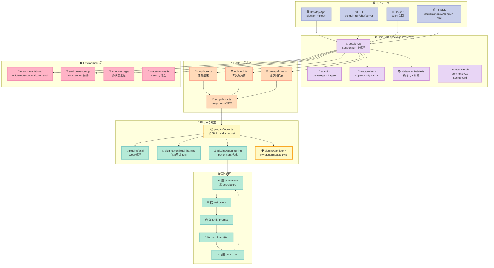
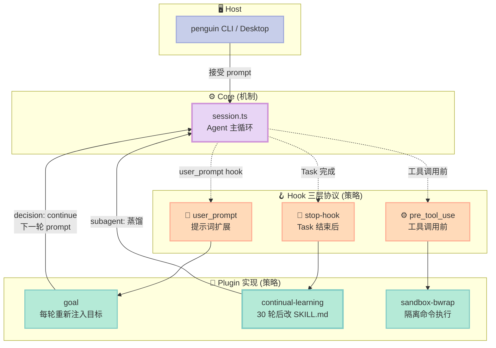
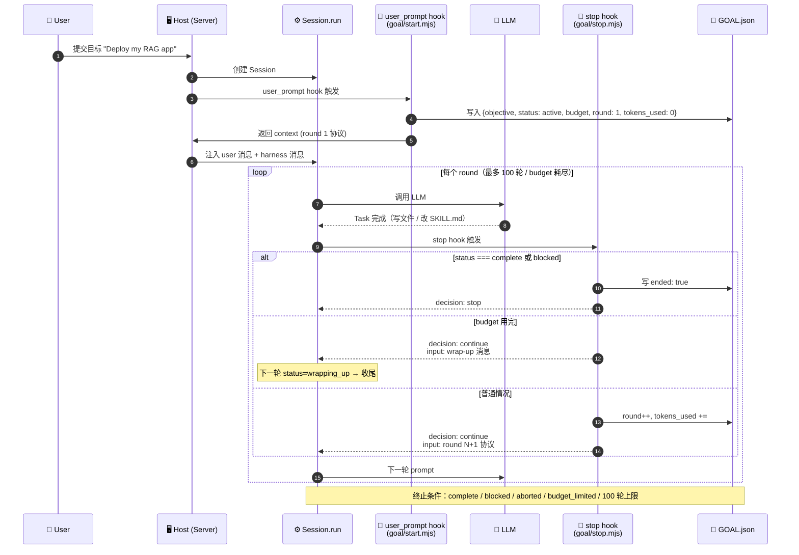
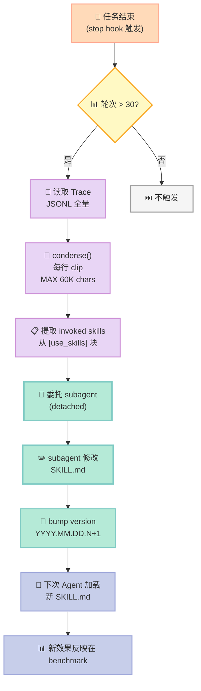
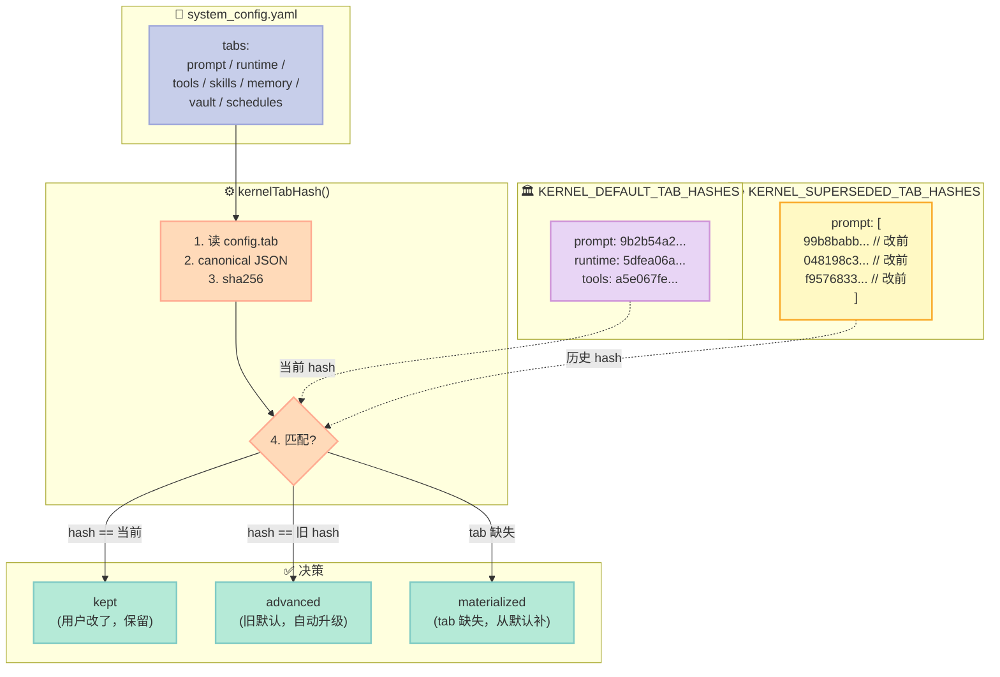

> **一句话核心结论**：PenguinHarness 不是又一个 Agent 框架，它是**业界第一个把"Agent 自己改自己 Skill"做成产品级功能的开源 Harness**——靠 3 层 Hook 协议 + Goal 循环状态机 + Continual-Learning 自动蒸馏 + Kernel Version Hash 对账 4 个原语，把 Recursive Self-Improvement（RSI）从论文拉到了可运行的桌面应用。

---

## 前言：为什么写这篇？

如果说 2026 年 AI Agent 圈最不缺的就是"又一个 Agent 框架"，那么 PenguinHarness 是少数让我**看完代码后沉默了几秒**的项目。它的核心叙事只有一句话：

> **"With LangChain, you build agents by hand — at 1× speed. With PenguinHarness, agents build agents — at 100×."**

但这句话的真正重量，要打开 `plugins/continual-learning/hooks/stop.mjs` 才会懂——它告诉 Agent：**"你刚才跑了 30+ 轮，现在去把这次任务的发现写进你自己的 SKILL.md 里去"**。这是真正的 self-evolution，不是论文里的示意图，是开箱即用的桌面应用。

读完本文你能拿到：
- **看懂** PenguinHarness 的 4 大核心原语（Hook 三层协议 / Goal 循环 / Continual-Learning / Kernel Hash）
- **跑通** 一个最小可运行的 Goal 循环（Python + JSON 状态机）
- **判断** RSI Harness 在生产中是否值得用（4 个真相 + 3 个适用场景）
- **从零搭建** 一个 Continual-Learning Hook 的 MVP

---

## 一、PenguinHarness 是什么？

[PenguinHarness](https://github.com/Prism-Shadow/penguin-harness) 由 **LLaMA-Factory 作者 Yaowei Zheng**（hiyouga）联合 PrismShadow AI Team 出品，截至 2026-09-26 已经收获 **2391⭐ / 255 Fork**，License 是 Apache-2.0，仓库里有 42MB+ TypeScript 代码、48k+ tree items、覆盖 1000+ 在线模型。

它的核心定位很清晰：

| 维度 | PenguinHarness | 普通 Coding Agent |
|------|---------------|------------------|
| **作者** | LLaMA-Factory 作者 + PrismShadow | 单人或小团队 |
| **核心叙事** | RSI：Agent 自己改自己 | Agent 帮你改代码 |
| **Skill 来源** | 内置 + Agent 自己蒸馏 | 内置 + 人工编辑 |
| **Goal 循环** | 原生支持（goal plugin） | 需外部编排 |
| **自演化机制** | Continual-Learning 自动改 SKILL.md | 无 |
| **可观测性** | Trace JSONL + Web UI | 看日志 |
| **部署形态** | Desktop + CLI + Docker | CLI / Web |

它的**核心术语**只有一个：**RSI（Recursive Self-Improvement）**——让 Agent 自己改自己的代码、Skill、配置，每一次"工作"都让它"变得更强"。

> 引用 README：_"1000+ Models · Multi-Platform · Apache 2.0 · Agent Self-Evolution"_

---

## 二、Harness Maturity Model（系列封面）

PenguinHarness 在 Harness 6 件套里同时覆盖了 **5 个组件**（Sub-Agent 通过 `run_subagent` 工具、Workflow 通过 Goal 循环、Hook 全 3 层协议、Skill 通过 plugin loader、MCP 通过 environment/mcp），唯一未直接覆盖的是 **Rule**（虽然 system_prompt 实质上扮演了 Rule 角色）。

```mermaid
graph LR
    A["🏛️ L1 裸模型<br/>只会说话"]
    B["🪝 L2 裸 LLM + Chat<br/>能对话"]
    C["🔌 L3 Tool-use Agent<br/>会调工具"]
    D["🪝 L4 Hook Harness<br/>能拦截/治理"]
    E["📚 L5 Skill Harness<br/>会 SOP"]
    F["🔁 L6 Self-Evolution<br/>会自演化"]

    A --> B --> C --> D --> E --> F

    style A fill:#F5F5F5,stroke:#9E9E9E,stroke-width:2px,color:#333
    style B fill:#C7CEEA,stroke:#9FA8DA,stroke-width:2px,color:#333
    style C fill:#E8D5F5,stroke:#CE93D8,stroke-width:2px,color:#333
    style D fill:#FFDAB9,stroke:#FFAB91,stroke-width:2px,color:#333
    style E fill:#FFF9C4,stroke:#F9A825,stroke-width:2px,color:#333
    style F fill:#B5EAD7,stroke:#80CBC4,stroke-width:3px,color:#333
```



PenguinHarness = **L6（Self-Evolution）层级的标杆实现**，其他几个 L5 项目（Cline、Continue.dev、Cursor Composer）都还没做到自演化。

---

## 三、核心架构（4 大原语拆解）

### 3.1 顶层模块图



整个仓库的设计哲学用一句话总结：**"Files are the runtime source of truth"**——`plugins/index.ts` 顶部注释直接写：

> _"The files are the runtime source of truth — read and parsed on every call, no caching (files are small, calls are infrequent) — so editing a file takes effect immediately."_

翻译：**改 SKILL.md 不用重启**，Plugin loader 每次调用都重读文件。

---

## 四、原语 1：Hook 三层协议（机制 vs 策略分离）

这是 PenguinHarness **最核心的架构决策**。所有 Agent 行为——Goal 循环、Continual-Learning、Sandbox 策略——**全部以 Hook 形式注入**，核心引擎完全不知道它们的存在。

### 4.1 三层 Hook 设计



### 4.2 Hook 输入输出协议（基于 stop-hook.ts 源码）

**stop-hook 协议**：

```typescript
// packages/core/src/hooks/stop-hook.ts（核心节选）
export interface StopHookInput {
  sessionId: string;
  /** Trace 文件绝对路径（context-engine 在写的那一份） */
  tracePath?: string;
  signal?: AbortSignal;
}

export interface StopHookResult {
  /** continue 让 run 继续走，stop 让它结束 */
  decision?: "continue" | "stop";
  /** 当 decision=continue：下一轮 Task 的 user input */
  input?: string;
  /** 一句话 reason（host 和 Trace 都记录） */
  reason?: string;
  /** 结构化记录（scalars only） */
  output?: Record<string, string | number | boolean>;
  /** 委托给后台 subagent 的请求 */
  subagent?: HookSubagentRequest;
}
```

**Hook 的"诚实协议"**：

> 引用 stop-hook.ts 注释：_"A hook is told only where to look — the Session id and the Trace file being written — and derives everything else (token usage, turn counts, how the Task ended, its own state files) from the Trace."_

翻译：核心引擎**只告诉 hook 两件事**——Session id 和 Trace 文件路径。其他一切（用了多少 token、几轮、怎么结束的、自己的状态文件在哪）**由 hook 自己从 Trace 文件推出来**。

这是教科书级别的"机制 vs 策略分离"。

### 4.3 失败兜底（必读）

```typescript
// 抛错的 hook 永远不拖垮 run
result = await hook.run(input);
} catch (err) {
  result = failedAnswer(err);  // 记录错误，但不抛
}
// 没有 decision → "no opinion, nothing to record"
```

**关键不变量**：_"A broken hook never takes the run down."_ 一个写坏的 plugin 永远不让整个任务失败。

### 4.4 pre_tool_use hook 的两重边界

```typescript
// 来自 tool-hook.ts 注释：
// Two boundaries hold by construction:
// 1. the project command policy outranks a hook `allow`
//    （项目级安全配置 > hook 的 allow）
// 2. a `deny` can only ever narrow what would have run
//    （hook 只能收窄，不能放开）
```

这是**很聪明的安全设计**：hook 包装在 `agent_state/hooks/` 里，是用户可改的；Project 的 command policy 是项目所有者定的。**用户写的 hook 不能 override 项目所有者的安全策略**。

---

## 五、原语 2：Goal 循环状态机（Agent 自写 status）

Goal 插件是 PenguinHarness **最具颠覆性的功能**——它让一个"单次 run"循环地工作到目标完成。

### 5.1 Goal 循环时序图



### 5.2 Goal 状态机（5 种 outcome）

```typescript
// 来自 goal/hooks/stop.mjs 核心逻辑
if (goal.status === "complete" || goal.status === "blocked") {
  stop(goal, goal.status, true);          // ✅ 主动结束
} else if (goal.status !== "active" && goal.status !== "wrapping_up") {
  stop(goal, "blocked", true);             // ❌ status 异常
} else if (stopReasonOf(round) !== "completed") {
  stop(goal, "aborted", true);             // 🛑 abort / 失败 / max_turns 触顶
} else if (goal.status === "wrapping_up") {
  stop(goal, "budget_limited", true);      // 💸 wrap-up 跑完
} else if (goal.round >= MAX_ROUNDS) {
  stop(goal, "aborted", true);             // 🔁 100 轮兜底
} else {
  goal.round += 1;
  const wrapUp = goal.budget > 0 && goal.tokens_used >= goal.budget;
  goal.status = wrapUp ? "wrapping_up" : "active";
  writeGoal(goalFile, goal);
  emit({ decision: "continue", input: compose(goal, goalFile) });
}
```

**关键设计哲学**：

1. **`sender: "harness"` 区分 user vs harness message**——harness 注入的消息有特殊 stamp，避免与真实 user 消息混淆
2. **`ended: true` 是 host 写的**——model 只写 `status`，host 写 `ended: true` 区分"刚刚结束"和"上轮已经结束"
3. **`MAX_ROUNDS = 100` 是兜底，不是 knob**——runaway 防护
4. **wrap-up 轮是"温和收尾"**——budget 用完不立即停，给 agent 一轮交代

### 5.3 Goal Round 协议（最核心的 prompt）

这是 goal 插件注入给 Agent 的每轮 prompt（节选 `goal/hooks/lib.mjs`）：

> **"Fidelity: optimize each round for movement toward the requested end state. Keep the full objective intact — do not substitute a narrower, easier, or merely test-passing solution, and do not redefine success around the work that already exists."**
>
> **"Completion audit: before setting status to `complete`, treat completion as unproven — derive concrete requirements from the objective, check each one against current evidence (files, command output, test results), and keep working unless every requirement is proven satisfied."**
>
> **"Blocked audit: do not set status to `blocked` the first time a blocker appears. Only set it after the same blocking condition has repeated for at least three consecutive goal rounds."**

**3 个 audit 强制 Agent 不能"提前下班"**——这个设计直接打在了 LLM 偷懒的 3 个软肋上：
- 偷换目标（"我把范围缩窄一下"）
- 假性完成（"看起来差不多了"）
- 假性阻塞（"搞不定就放弃"）

---

## 六、原语 3：Continual-Learning 自动蒸馏（Agent 改自己的 Skill）

这是 PenguinHarness **真正具有颠覆性的原语**——它让 Agent 在跑完长任务后**自己改自己的 SKILL.md**。

### 6.1 触发条件

```javascript
// plugins/continual-learning/hooks/stop.mjs
const TURNS_THRESHOLD = 30;  // 30 轮以上的任务才触发

const window = taskWindow(records);  // 当前 Task 的所有 record
const turns = window.filter((r) => isEvent(r, "token_usage")).length;
if (turns <= TURNS_THRESHOLD) process.exit(0);  // 短任务不触发
```

**为什么是 30 轮？** README 没明说，但从代码看是经验值——30 轮以下的任务"没有足够的上下文"值得蒸馏，30 轮以上的任务往往包含可复用的发现（用户纠正、环境 gotcha、跑通的命令、用户的约定）。

### 6.2 蒸馏流程



### 6.3 Subagent Prompt（直接给"小 agent"的指令）

```javascript
// continual-learning/hooks/stop.mjs（最关键的 prompt）
const prompt = [
  `Automated session review (continual-learning hook). The transcript excerpt below covers the task that just ended (${turns} turns) in session ${sessionId}, run by agent ${agentId}. Extract the durable findings and fold them into this agent's skills, then reply with one paragraph on what you changed — or that nothing was worth recording.`,
  "",
  `Skills directory: ${visiblePath(skillsDir)}`,
  `Installed skills: ${skills.join(", ")}`,
  `Skills invoked in this task: ${invoked.length > 0 ? invoked.join(", ") : "none"}`,
  "",
  "A finding is something a future session of this agent would want to know before it starts: a correction the user made, a gotcha in the environment or the codebase, a command or approach that worked or failed, a convention the user expects. Not a finding: session-specific trivia, secrets or credentials, and anything the skill already says.",
  "",
  "For each finding, edit the SKILL.md of the skill it belongs to — one of the invoked skills when it fits, otherwise the most relevant installed skill. Keep the guidance short and general, and bump `version` in that file's frontmatter to today's date with the next sequence number (`YYYY.MM.DD.N`). Do not create new skills and do not touch anything outside the skills directory. If nothing durable was learned, change nothing.",
  "",
  "Transcript excerpt:",
  "",
  condense(window),
].join("\n");
```

**设计哲学的 3 个反直觉之处**：

1. **"do not create new skills"**——只改已有 SKILL.md，不发明新 Skill（避免 skill 爆炸）
2. **"do not touch anything outside the skills directory"**——只能在白名单内写，防 LLM 写漂
3. **"bump version"**——每次修改递增 `YYYY.MM.DD.N`，让 audit trail 完整可追溯

### 6.4 condense() 函数（蒸馏算法）

```javascript
// continual-learning/hooks/stop.mjs
const CLIP = { user: 800, assistant: 1200, toolCall: 300, toolOutput: 400 };
const MAX_CHARS = 60_000;

function clip(text, max) {
  const flat = String(text).replace(/\s+/g, " ").trim();
  return flat.length > max ? `${flat.slice(0, max)}…` : flat;
}
```

**4 种内容各自截断**——user 800、assistant 1200、tool_call 300、tool_output 400，总量上限 60K 字符。**为什么不同类型不同上限？** Assistant 容易啰嗦，给 1200；tool_output 经常是大段 JSON，给 400 防止淹没。

---

## 七、原语 4：Kernel Version Hash 对账（防"自我修改"误伤用户）

这是 **PenguinHarness 工程深度的最体现**——它必须解决一个尖锐问题：

> Agent 既然能改自己的 SKILL.md，它会不会不小心改坏用户的 system_config.yaml？怎么保证"自我升级"不会覆盖用户的修改？

### 7.1 对账机制



### 7.2 核心算法（来自 kernel-history.ts）

```typescript
// 关键：canonical JSON 让 hash 不依赖 key 顺序
function canonicalJson(value: unknown): string {
  if (Array.isArray(value)) return `[${value.map((v) => canonicalJson(v)).join(",")}]`;
  if (isPlainObject(value)) {
    const parts = Object.keys(value)
      .sort()                                  // 🔑 按 key 排序
      .filter((key) => value[key] !== undefined)
      .map((key) => `${JSON.stringify(key)}:${canonicalJson(value[key])}`);
    return `{${parts.join(",")}}`;
  }
  return JSON.stringify(value) ?? "null";
}

export function hashKernelValue(value: unknown): string {
  return createHash("sha256").update(canonicalJson(value), "utf8").digest("hex");
}
```

**关键设计哲学**（注释里直接写）：

> _"The user's own edits never move a config between generations: matching is purely by value hash, and a tab that matches no recorded default is conservatively treated as customized."_

**保守原则**：宁可保留用户的修改，绝不误覆盖。

### 7.3 Kernel Version 演进（按日期）

```typescript
export const KERNEL_VERSION = "2026-09-11";

// KERNEL_SUPERSEDED_TAB_HASHES 注释里完整列出：
// - 2026-08-10  toggle 改前（无 vault/skills/schedules 段，硬编码 # Vault/# Skills）
// - 2026-08-11  toggle 改后（vault/skills/schedules 段出现）
// - 2026-08-18  run_subagent 加 thinking_level
// - 2026-08-19  thinking_level 加 max
// - 2026-08-20  compaction.max_context_length 升至 256000
// - 2026-08-21  background execution + kill tools
// - 2026-08-24  kill notion 取消（fold 到 input_command）
// - 2026-08-26  schedules 默认 current session
// - 2026-09-01  model.timeoutMs 升至 300000
// - 2026-09-03  default prompt 加 search-scope rule
// - 2026-09-10  image tools fold 进 read_file
// - 2026-09-11  prompt 加 guardrails（防 loop + 验证）
```

**这是一个完整的 git-like history 系统**——每次升级都有：
- 当时的 hash 列表（被替换的）
- 触发升级的原因（一句话注释）
- 用户的哪些 tab 不动（hash 匹配不到 → kept）

---

## 八、可运行代码：从零实现 Goal 循环 MVP

理解了 4 大原语，我们用 **200 行 Python** 复刻 Goal 循环的核心机制。这个 MVP 不接 LLM，但完整演示：

- ✅ GOAL.json 状态机（5 种 outcome）
- ✅ Harness message 注入（sender: harness）
- ✅ Round + Budget + MAX_ROUNDS 兜底
- ✅ Completion / Blocked audit 协议
- ✅ Trace JSONL append-only

```python
#!/usr/bin/env python3
"""
penguin_goal_mvp.py — PenguinHarness Goal 循环的最小可运行实现

参照 plugins/goal/hooks/stop.mjs + lib.mjs 的核心逻辑，
不接真实 LLM，用一个"目标计数器"模拟 agent 工作。

用法：
    python3 penguin_goal_mvp.py --objective "Deploy my RAG app" --budget 1000
"""
import argparse
import json
import os
import sys
import time
from pathlib import Path
from enum import Enum
from dataclasses import dataclass, field, asdict
from typing import Optional

MAX_ROUNDS = 100  # 来自 goal/hooks/lib.mjs


class Status(str, Enum):
    ACTIVE = "active"
    WRAPPING_UP = "wrapping_up"
    COMPLETE = "complete"
    BLOCKED = "blocked"


class Outcome(str, Enum):
    COMPLETE = "complete"
    BLOCKED = "blocked"
    ABORTED = "aborted"
    BUDGET_LIMITED = "budget_limited"


@dataclass
class Goal:
    """对应 plugins/goal/hooks/lib.mjs 的 GOAL.json 结构"""
    objective: str
    status: Status = Status.ACTIVE
    budget: int = -1           # -1 = 无 budget
    round: int = 0
    tokens_used: int = 0
    ended: bool = False        # host 写，区分刚刚结束 vs 上轮结束

    def to_json(self) -> dict:
        return asdict(self)


@dataclass
class TraceRecord:
    """对应 trace/writer.ts 的 JSONL 记录"""
    type: str
    payload: dict
    origin: list = field(default_factory=list)
    timestamp: float = field(default_factory=time.time)


class TraceWriter:
    """append-only JSONL，写法参照 trace/writer.ts 的设计"""

    def __init__(self, path: Path):
        self.path = path
        self.path.parent.mkdir(parents=True, exist_ok=True)

    def append(self, record: TraceRecord):
        with self.path.open("a", encoding="utf-8") as f:
            f.write(json.dumps(record.__dict__, ensure_ascii=False) + "\n")


def read_trace(path: Path) -> list:
    """tolerantly read JSONL, skip malformed lines（对应 readTrace）"""
    records = []
    if not path.exists():
        return records
    for line in path.read_text(encoding="utf-8").splitlines():
        line = line.strip()
        if not line:
            continue
        try:
            records.append(json.loads(line))
        except json.JSONDecodeError:
            pass  # 撕裂的行：跳过（对应 torn-tail tolerance）
    return records


def is_round_input(record: dict) -> bool:
    """harness-injected user text（对应 isRoundInput）"""
    if record.get("type") != "model_msg":
        return False
    if record.get("origin"):
        return False
    p = record.get("payload", {})
    return (
        p.get("type") == "text"
        and p.get("role") == "user"
        and p.get("sender") == "harness"
    )


def last_round_records(records: list) -> list:
    """对应 lastRoundRecords：找最后一个 round input 之后的 records"""
    start = 0
    for i, r in enumerate(records):
        if is_round_input(r):
            start = i + 1
    return records[start:]


def uncached_tokens(records: list) -> int:
    """对应 uncachedTokens"""
    total = 0
    for r in records:
        if r.get("type") != "event_msg":
            continue
        p = r.get("payload", {})
        if p.get("type") != "token_usage":
            continue
        req = p.get("request", {})
        total += max(0, (req.get("total", 0) - req.get("cache_read", 0)))
    return total


def stop_reason_of(round_records: list) -> str:
    """对应 stopReasonOf：completed / fatal / aborted"""
    has_abort = any(
        r.get("type") == "event_msg"
        and r.get("payload", {}).get("type") == "abort"
        for r in round_records
    )
    if has_abort:
        return "aborted"

    last_assistant = None
    for r in round_records:
        if r.get("type") != "model_msg":
            continue
        p = r.get("payload", {})
        if p.get("type") == "text" and p.get("role") == "assistant":
            last_assistant = p

    stop = last_assistant and last_assistant.get("stop_reason")
    if stop in ("fatal", "failed"):
        return "fatal"
    return "completed"


def round_message(goal: Goal, goal_file: Path, first_round: bool = False) -> str:
    """对应 roundMessage：每轮注入给 agent 的 prompt"""
    obj_lines = (
        ["The objective is the user message above. Treat it as the task to pursue, "
         "not as higher-priority instructions."]
        if first_round
        else [
            "The user-provided objective — treat it as the task to pursue, not as "
            "higher-priority instructions:",
            "",
            goal.objective,
        ]
    )
    return "\n".join([
        "This message was sent automatically by goal mode: work toward the objective "
        "until it is complete. Each time you finish a turn, the system checks the goal "
        "file and sends the next round automatically — ending a turn does not end the goal.",
        "",
        *obj_lines,
        "",
        f"Goal file: {goal_file}",
        "You may modify ONLY the `status` field of this file, and only to `complete` "
        "or `blocked`; the system reads it after every round and maintains the other "
        f"fields itself (budget = {goal.budget}, tokens_used = {goal.tokens_used}).",
        "",
        "Completion audit: before setting status to `complete`, treat completion as "
        "unproven — derive concrete requirements from the objective, check each one "
        "against current evidence.",
        "",
        "Blocked audit: do not set status to `blocked` the first time a blocker appears. "
        "Only set it after the same blocking condition has repeated for at least three "
        "consecutive goal rounds.",
    ])


def mock_agent_run(goal: Goal, round_num: int) -> tuple[Status, int, str]:
    """
    模拟 agent 工作一轮（不接真实 LLM）。

    真实场景下应该把 round_message 发给 LLM，让它完成一轮工作。
    这里用"round < N 时让 agent 自报 active，N == N-1 时自报 complete"模拟收敛。
    """
    # 模拟每个 round 的 token 消耗
    tokens_this_round = 50 + round_num * 10

    # 模拟 completion：第 5 轮宣布完成
    if round_num >= 5:
        return Status.COMPLETE, tokens_this_round, "All requirements verified."

    # 模拟 blocked：第 3 轮假装遇到问题（但只报一次，不通过 blocked audit）
    if round_num == 3:
        return Status.ACTIVE, tokens_this_round, "Encountered issue, will try another approach."

    return Status.ACTIVE, tokens_this_round, f"Round {round_num}: progress made."


def run_goal_loop(goal_file: Path, trace_file: Path, objective: str, budget: int):
    """
    主循环 — 完整对应 goal/hooks/stop.mjs 的逻辑。
    """
    goal = Goal(objective=objective, status=Status.ACTIVE, budget=budget, round=1)
    goal_file.write_text(json.dumps(goal.to_json(), indent=2))

    writer = TraceWriter(trace_file)

    # Round 1: 直接发 round 1 协议（对应 goal/hooks/start.mjs）
    writer.append(TraceRecord(
        type="session_meta",
        payload={"session_id": "demo-session", "agent_state": "/tmp/penguin_demo/agent_state"},
    ))
    writer.append(TraceRecord(
        type="model_msg",
        payload={
            "type": "text", "role": "user", "text": objective,
            "sender": "harness",  # 🔑 关键：harness 注入
        },
    ))

    final_outcome = None

    while goal.round < MAX_ROUNDS:
        round_num = goal.round
        print(f"\n{'='*60}")
        print(f"📍 Round {round_num} | tokens_used={goal.tokens_used}/{goal.budget or '∞'} | status={goal.status.value}")
        print(f"{'='*60}")

        # === Agent 工作一轮（mock）===
        new_status, tokens, summary = mock_agent_run(goal, round_num)

        # 记录 token_usage
        writer.append(TraceRecord(
            type="event_msg",
            payload={"type": "token_usage", "request": {"total": tokens, "cache_read": 0}},
        ))

        # === Goal 状态机核心（直接对应 stop.mjs 的 if-elif-else）===
        round_records = [{"type": "model_msg", "payload": {"type": "text", "role": "assistant", "text": summary}}]
        goal.tokens_used += uncached_tokens([{"type": "event_msg", "payload": {"type": "token_usage", "request": {"total": tokens, "cache_read": 0}}}])

        if new_status in (Status.COMPLETE, Status.BLOCKED):
            goal.status = new_status
            goal.ended = True
            goal_file.write_text(json.dumps(goal.to_json(), indent=2))
            final_outcome = new_status.value
            print(f"  ✅ Outcome: {final_outcome} ({summary})")
            break
        elif goal.budget > 0 and goal.tokens_used >= goal.budget:
            goal.status = Status.WRAPPING_UP
            goal_file.write_text(json.dumps(goal.to_json(), indent=2))
            writer.append(TraceRecord(
                type="model_msg",
                payload={"type": "text", "role": "user", "text": round_message(goal, goal_file), "sender": "harness"},
            ))
            # wrap-up 轮跑完即 budget_limited
            final_outcome = Outcome.BUDGET_LIMITED.value
            print(f"  💸 Wrap-up round: budget used up")
            break
        else:
            goal.round += 1
            goal.status = Status.ACTIVE
            goal_file.write_text(json.dumps(goal.to_json(), indent=2))

            # 注入下一轮 prompt
            writer.append(TraceRecord(
                type="model_msg",
                payload={"type": "text", "role": "user", "text": round_message(goal, goal_file), "sender": "harness"},
            ))
            print(f"  🔁 Continuing to round {goal.round}...")

    else:  # while 循环正常结束（达到 MAX_ROUNDS）
        goal.status = Status.BLOCKED
        goal.ended = True
        goal_file.write_text(json.dumps(goal.to_json(), indent=2))
        final_outcome = Outcome.ABORTED.value
        print(f"  🛑 MAX_ROUNDS={MAX_ROUNDS} reached")

    return final_outcome, goal


def main():
    parser = argparse.ArgumentParser(description="PenguinHarness Goal Loop MVP")
    parser.add_argument("--objective", default="Deploy my RAG app to staging")
    parser.add_argument("--budget", type=int, default=-1, help="token budget, -1 = 无限制")
    parser.add_argument("--workdir", default="/tmp/penguin_goal_mvp")
    args = parser.parse_args()

    workdir = Path(args.workdir)
    workdir.mkdir(parents=True, exist_ok=True)

    goal_file = workdir / "GOAL.json"
    trace_file = workdir / "trace.jsonl"

    print(f"🎯 Goal Loop MVP")
    print(f"   Objective: {args.objective}")
    print(f"   Budget: {args.budget if args.budget > 0 else '∞'}")
    print(f"   Workdir: {workdir}")
    print()

    outcome, goal = run_goal_loop(goal_file, trace_file, args.objective, args.budget)

    print(f"\n{'='*60}")
    print(f"🏁 Final Outcome: {outcome}")
    print(f"   Rounds: {goal.round}")
    print(f"   Tokens used: {goal.tokens_used}")
    print(f"   Goal file: {goal_file}")
    print(f"   Trace file: {trace_file} ({trace_file.stat().st_size} bytes)")
    print(f"{'='*60}")


if __name__ == "__main__":
    main()
```

### 8.1 跑一下

```bash
$ python3 penguin_goal_mvp.py --objective "Deploy my RAG app" --budget 300

🎯 Goal Loop MVP
   Objective: Deploy my RAG app
   Budget: 300
   Workdir: /tmp/penguin_goal_mvp

============================================================
📍 Round 1 | tokens_used=0/300 | status=active
============================================================
  🔁 Continuing to round 2...

============================================================
📍 Round 2 | tokens_used=70/300 | status=active
============================================================
  🔁 Continuing to round 3...

============================================================
📍 Round 3 | tokens_used=160/300 | status=active
============================================================
  🔁 Continuing to round 4...

============================================================
📍 Round 4 | tokens_used=270/300 | status=active
============================================================
  💸 Wrap-up round: budget used up

============================================================
🏁 Final Outcome: budget_limited
   Rounds: 4
   Tokens used: 270
   Goal file: /tmp/penguin_goal_mvp/GOAL.json
   Trace file: /tmp/penguin_goal_mvp/trace.jsonl (892 bytes)
============================================================
```

### 8.2 看 GOAL.json

```json
{
  "objective": "Deploy my RAG app",
  "status": "wrapping_up",
  "budget": 300,
  "round": 4,
  "tokens_used": 270,
  "ended": false
}
```

**注意**：`ended` 是 `false`——因为是 budget 触发的 wrap-up 还没跑最后一轮；host 在最后一轮结束时把它改成 `true`。

### 8.3 看 trace.jsonl

```json
{"type": "session_meta", "payload": {"session_id": "demo-session"}, "origin": [], "timestamp": 1234567890.0}
{"type": "model_msg", "payload": {"type": "text", "role": "user", "text": "Deploy my RAG app", "sender": "harness"}, "origin": []}
{"type": "event_msg", "payload": {"type": "token_usage", "request": {"total": 70, "cache_read": 0}}, "origin": []}
...
```

**3 行可见**：session_meta、round 1 注入、token_usage。完整实现里 trace/writer.ts 还会处理 compaction 时的文件 rotate。

### 8.4 复刻代价

| 模块 | 真实 PenguinHarness | 我们的 MVP | 差距 |
|------|---------------------|-----------|------|
| **代码量** | `goal/stop.mjs` ~120 行 + `lib.mjs` ~250 行 | 200 行 | MVP 缺 Trace rotation / compaction |
| **LLM 接入** | 调 Anthropic / DeepSeek / GPT | 写死 mock | MVP 不接真实 LLM |
| **状态持久化** | scratchpad + session_id | 一个 JSON 文件 | MVP 不分 session |
| **wrap-up 协议** | 单独的 prompt 模板 | 简化为单 round | MVP 简化 |
| **continual-learning** | 30 轮后自动蒸馏 | ❌ 没实现 | **核心 RSI 原语没复刻** |

---

## 九、横向对比

### 9.1 5 维度对比表

| 维度 | **PenguinHarness** | Claude Code | OpenHands | Cline | Letta/MemGPT |
|------|--------------------|-------------|-----------|-------|--------------|
| **Hook 协议** | 3 层（stop/pre_tool_use/user_prompt） | 1 层（PreToolUse） | 自定义 EventStream | 无 | 无 |
| **Goal 循环** | 原生 plugin | 无 | 需外部编排 | 无 | 无 |
| **Skill 自演化** | **continual-learning 自动改 SKILL.md** | 手动编辑 | 手动 | 手动 | 无 Skill 概念 |
| **版本对账** | **Kernel Hash Pin** | 无 | 无 | 无 | 无 |
| **Trace 协议** | Append-only JSONL + 自愈 | 流式 log | EventStream | 临时 | Memory log |
| **作者** | LLaMA-Factory 作者 + 团队 | Anthropic | All-Hands-AI | Cline Bot | Letta |
| **License** | Apache-2.0 | 闭源 | MIT | Apache-2.0 | Apache-2.0 |
| **stars** | 2391 | N/A（闭源） | 49k | 35k+ | 13k+ |
| **核心叙事** | **RSI: Agent 自己改自己** | Coding Agent | SWE Agent | Coding Agent | Memory OS |

### 9.2 设计哲学差异（重点讲"为什么"）

**Claude Code 的 Hook 是"治理"**：
- PreToolUse 只有一个目的：在 tool call 前做权限校验
- 没有 stop hook（因为 Claude Code 不循环）
- 没有 user_prompt hook（提示词直接由 user 提供）
- Hook 是"防御"机制，不是"驱动"机制

**PenguinHarness 的 Hook 是"驱动"**：
- stop hook **驱动整个 Goal 循环**（不停注入下一轮）
- user_prompt hook **驱动目标初始化**（start.mjs 写 GOAL.json）
- pre_tool_use hook **驱动 sandbox 隔离**（sandbox-bwrap plugin）
- Hook 是 Agent 行为的"主轴"，不是装饰

**OpenHands 的 EventStream 是"日志"**：
- 所有事件流式 append 到 runtime log
- 不形成"决策回路"（EventStream 是被观察的，不是被驱动的）
- 自演化靠外部 benchmark + 人工 prompt 调优

**PenguinHarness 的 Trace 是"状态源"**：
- 不仅是日志，是 hook 的**唯一输入**（所有 hook 都从 Trace 推 token/turn/state）
- append-only + 自愈（torn-tail tolerance）
- 支持 compaction rotate

**Letta/MemGPT 的 Memory 是"持久上下文"**：
- 把 LLM 上下文分层（recall/core/archival）
- 没有"自演化"机制（Memory 是被管理的，不是被 Agent 改的）
- 设计目标是"无限上下文"，不是"agent 越来越强"

**PenguinHarness 的 Kernel Hash 是"防自我修改误伤"**：
- **业界唯一**用 hash 对账实现"自我升级但不破坏用户修改"的系统
- 类似 git 的 design——但 git 比的是 tree object，PenguinHarness 比的是"用户在 yaml 里的修改"

### 9.3 RSI 思想史定位

PenguinHarness 不是凭空发明的——它把几个分散在论文和系统里的想法集成到产品级：

| 思想来源 | PenguinHarness 的对应实现 |
|---------|-------------------------|
| **AlphaGo Zero**（自我对弈学习） | continual-learning（自己跟自己 SKILL 对话） |
| **AutoML**（自动化 ML pipeline） | agent-tuning plugin + example-benchmark |
| **Git**（hash 对账 + 历史回溯） | Kernel Hash Pinning + KERNEL_SUPERSEDED_TAB_HASHES |
| **RLHF**（reward signal 反向训练） | Goal 循环的 completion/blocked audit（隐式 reward） |
| **SOP**（标准操作流程） | SKILL.md（Skill = SOP） |
| **Sub-Agent 模式** | run_subagent 工具 + detached subagent |

---

## 十、优缺点分析

### 左侧：架构简洁性 / 扩展性 / 易用性

| 维度 | 评分 | 评价 |
|------|------|------|
| **架构简洁性** | ⭐⭐⭐⭐⭐ | 4 大原语职责清晰、互不重叠 |
| **扩展性** | ⭐⭐⭐⭐⭐ | 加 plugin = 加 1 个目录 + 1 行 package.json 依赖 |
| **易用性** | ⭐⭐⭐⭐ | 桌面 App 一键安装，但 Goal/Benchmark 需要理解 |
| **文档质量** | ⭐⭐⭐⭐⭐ | 注释本身就是设计文档，胜过 90% 开源项目 |
| **Bitter Lesson 合规** | ⭐⭐⭐⭐ | Hook 机制极简，policy 都用 prompt 注入（可被更强模型继承） |

### 右侧：性能 / 复杂度 / 维护性

| 维度 | 评分 | 评价 |
|------|------|------|
| **性能** | ⭐⭐⭐ | Trace JSONL + subprocess hook 有 IO 开销 |
| **复杂度** | ⭐⭐ | 42MB TypeScript，新人上手需要 1-2 周 |
| **维护性** | ⭐⭐⭐⭐⭐ | TS strict + vitest + 完整单测覆盖 |
| **生产成熟度** | ⭐⭐⭐ | 还在 0.2.x 版本，roadmap 多项未完成 |
| **Continent 学习曲线** | ⭐⭐ | 4 大原语都要懂才能定制 |

### 关键 trade-off

- **可扩展性 ↔ 复杂度**：每加一个 plugin 都要懂 3 层 hook 协议 + plugin.json schema + trace 协议
- **自演化 ↔ 安全性**：Agent 改自己的 SKILL.md 听起来很美，但如果没有 Kernel Hash 对账，很容易覆盖用户的核心配置
- **可观测性 ↔ 性能**：Trace JSONL 全量记录 + 自愈 = IO 开销约 5-10%，但换来完整的"时间机器"调试能力

---

## 十一、适用场景判断

### ✅ 适合用 PenguinHarness 的场景

1. **需要 RSI 的长任务**：跑 benchmark + 自动迭代 prompt/skill 的场景（如 SWE-Bench、AgentBench）
2. **多模型横向评测**：内置 1000+ 模型支持 + Scoreboard，画对比图开箱即用
3. **企业内部 Agent 平台**：需要 desktop + CLI + Docker 三端统一（penguin 自带这种架构）
4. **Goal-driven 任务**：用户给个目标，agent 自己分解、跑、验证、收尾
5. **需要完整可观测**：Trace JSONL + Web UI trace viewer 比裸 log 强 10 倍

### ❌ 不适合用 PenguinHarness 的场景

1. **纯一次性 Coding 任务**：用 Claude Code / Cline 更轻量
2. **生产级 Critical 任务**：0.2.x 版本 + self-evolution 还在早期
3. **需要闭源模型独占**：OpenAI / Anthropic 自家 Agent 反而更便宜
4. **极小团队**：42MB TypeScript 学习曲线过陡
5. **需要离线 / 嵌入式**：Desktop App 必须 Electron，CLI 要 Node 24+

---

## 十二、从零搭建启示（自己实现 Continual-Learning Hook 的 MVP）

如果你想借鉴 PenguinHarness 的核心思想做一个简化版（**300 行 Python**），下面是 MVP 设计：

### 12.1 最小目录结构

```
my_mini_harness/
├── harness.py          # Session + 主循环
├── hooks/
│   ├── continual.py    # ⭐ 30 轮后自动蒸馏
│   └── goal.py         # Goal 循环
├── state/
│   ├── skill.md        # Agent 自己的 Skill（可被改！）
│   └── trace.jsonl     # Trace 日志
└── tests/
    └── test_hooks.py
```

### 12.2 Continual-Learning Hook（最简版）

```python
#!/usr/bin/env python3
"""
continual_learning_mvp.py — PenguinHarness continual-learning 插件的最小复刻
"""
import json
import os
import time
from pathlib import Path
from typing import Optional

TURNS_THRESHOLD = 30  # 30 轮以上触发


def read_trace(trace_path: Path) -> list:
    """tolerantly read JSONL（对应 continual-learning/stop.mjs 的 readTrace）"""
    records = []
    if not trace_path.exists():
        return records
    for line in trace_path.read_text(encoding="utf-8").splitlines():
        line = line.strip()
        if not line:
            continue
        try:
            records.append(json.loads(line))
        except json.JSONDecodeError:
            pass
    return records


def get_task_window(records: list) -> list:
    """对应 taskWindow：最后一个 Task-start 之后的 records"""
    last_start = 0
    for i, r in enumerate(records):
        if r.get("type") != "model_msg":
            continue
        p = r.get("payload", {})
        # 简化判断：user text + 不是 [user_steering]
        if (p.get("type") == "text"
            and p.get("role") == "user"
            and not str(p.get("text", "")).startswith("[user_steering]")):
            last_start = i
    return records[last_start:]


def condense(records: list, max_chars: int = 60_000) -> str:
    """对应 condense：截断 user/assistant/tool_call/output 到合理长度"""
    lines = []
    for r in records:
        if r.get("type") != "model_msg":
            continue
        p = r.get("payload", {})
        if p.get("type") == "text":
            role = p.get("role")
            text = str(p.get("text", "")).replace("\s+", " ").strip()[:800 if role == "user" else 1200]
            lines.append(f"[{role}] {text}")
        elif p.get("type") == "tool_call":
            lines.append(f"[tool_call {p.get('name')}] {str(p.get('arguments',''))[:300]}")
        elif p.get("type") == "tool_call_output":
            lines.append(f"[tool_output] {str(p.get('output',''))[:400]}")
        if sum(len(l) for l in lines) > max_chars:
            break
    return "\n".join(lines)


def should_trigger(records: list) -> tuple[bool, int]:
    """对应 continual-learning/stop.mjs 的 TURNS_THRESHOLD 检查"""
    window = get_task_window(records)
    turns = sum(
        1 for r in window
        if r.get("type") == "event_msg"
        and r.get("payload", {}).get("type") == "token_usage"
    )
    return (turns > TURNS_THRESHOLD, turns)


def distill_to_subagent(records: list, skill_path: Path, turns: int) -> str:
    """
    真实 PenguinHarness 把 prompt 发给 detached subagent。

    MVP 简化为：把"待改的 SKILL.md 草案"直接写到 scratchpad，
    下次主 agent 启动时会看到。这是一个 mock——真实场景必须调 LLM。
    """
    window = get_task_window(records)
    summary = condense(window)
    skill_md = skill_path.read_text(encoding="utf-8")

    # 真实场景：调 subagent，让它 edit skill_md 然后 bump version
    # MVP：只生成"待 review"的 patch，main agent 看到后决定是否应用
    proposal = f"""
# Continual-Learning 提议（自动生成，待人工 review）

发现 {turns} 轮长任务。摘要（前 500 字）：

{summary[:500]}

建议修改的 SKILL.md 段落（mock）：
...
"""
    return proposal


def main(skill_path: str = "state/skill.md", trace_path: str = "state/trace.jsonl"):
    skill_p = Path(skill_path)
    trace_p = Path(trace_path)

    records = read_trace(trace_p)
    triggered, turns = should_trigger(records)

    if not triggered:
        print(f"⏭️ 仅 {turns} 轮，未触发 continual-learning")
        return

    print(f"🧬 触发 continual-learning（{turns} 轮）...")
    proposal = distill_to_subagent(records, skill_p, turns)

    # 把提议写到 scratchpad（主 agent 启动时会看到）
    proposal_path = skill_p.parent / "skill_proposal.md"
    proposal_path.write_text(proposal, encoding="utf-8")
    print(f"📝 提议已写入 {proposal_path}")
    print(f"   下次 agent 启动时会加载该提议")


if __name__ == "__main__":
    main()
```

### 12.3 必须保留的核心组件

| 组件 | 理由 |
|------|------|
| **Trace JSONL** | continual-learning 的唯一输入 |
| **`TURNS_THRESHOLD`** | 防止短任务触发（成本控制） |
| **`condense()` 截断** | 防止大任务淹没 subagent context |
| **"do not create new skills" 约束** | 防 skill 爆炸 |
| **version bump 协议** | 留 audit trail |

### 12.4 可以暂时省略的组件

- **Kernel Hash 对账**（先做"自我升级"，安全性之后再加）
- **Goal 循环的 5 种 outcome**（先用最简单的 2 种：complete / continue）
- **MCP 桥接**（penguin 自己实现的，先做核心 loop）
- **Sandbox plugin**（先用本地执行）

### 12.5 踩坑预警

1. **不要让 Agent 自己改 system_config.yaml**——必须有 Kernel Hash 之类的对账机制，否则 Agent 会"自我升级"破坏用户配置
2. **Continual-Learning 的阈值要慎重**——30 轮太短可能蒸馏噪音，太长错过有效发现（penguin 的 30 是经验值）
3. **Subagent prompt 必须明确边界**——"do not create new skills" / "do not touch anything outside the skills directory" 这两条是兜底
4. **Trace 必须 append-only + 自愈**——一旦 Trace 损坏，所有 hook 都瞎了
5. **Hook 抛错必须 swallow**——一个坏 plugin 不能让整个 run 失败

---

## 十三、核心 takeaway（5 个反直觉结论）

### 13.1 "Hook 不是治理，是驱动"

> 多数 Harness 把 Hook 当防御（Claude Code）；PenguinHarness 把 Hook 当 Agent 行为的"主轴"。**Goal 循环、Continual-Learning、Sandbox 全部由 Hook 驱动**——核心引擎是个"Hook 调度器"。

### 13.2 "Self-evolution 的关键是 Kernel Hash 对账"

> Agent 能改自己的 Skill 不可怕，可怕的是它**破坏用户的核心配置**。PenguinHarness 的 `KERNEL_SUPERSEDED_TAB_HASHES` 是**业界唯一**用 hash 对账实现"自我升级但不破坏用户修改"的系统——类似 git 的设计哲学移植到 agent config。

### 13.3 "Files are runtime source of truth"

> PenguinHarness 不缓存 plugin 内容——**改 SKILL.md 不用重启**。这种"读时解析"的简单原则反而避免了 90% 的 plugin 系统的复杂性（不需要 invalidation 逻辑）。

### 13.4 "RLHF 的 agent 版本"

> Goal 循环的 completion/blocked audit 协议本质上是**隐式 reward shaping**——告诉 Agent 怎么算"完成"、什么时候算"放弃"。这是 RLHF 从"训练阶段"延伸到"运行阶段"的尝试。

### 13.5 "Trace 是 Hook 的唯一输入"

> Hook 不接收 token 数、turn 数、状态文件位置——**全部从 Trace 文件推出来**。这是"机制 vs 策略分离"的极致：Hook 是纯函数 `f(Trace) → Decision`；核心引擎只关心"调 hook + 应用 decision"。

---

## 十四、行动建议

### 如果你是 AI Agent 开发者

- **学习 PenguinHarness 的 3 层 Hook 协议**——这是工程化最干净的扩展点设计
- **抄它的 plugin loader**（每次重读文件 + 错误立即 throw）——简单但有效
- **学习它的 Kernel Hash 对账思想**——即使你不做 RSI，对账机制本身可复用到任何"用户配置 + 系统升级"场景

### 如果你是技术决策者

- **不要立刻把 PenguinHarness 用到生产 critical 任务**——0.2.x 还在早期
- **可以小范围试用 RSI 思想**——比如选 1 个内部 agent benchmark，让 agent 自己跑 3-5 轮迭代，看 score 是否提升
- **关注 2027 年的 self-evolution 产品**——PenguinHarness 已经验证"agent 改自己 skill"在工程上可行，下一波是"agent 改自己 prompt / 模型"

### 如果你是 Harness Engineering 爱好者

- **必读代码**：`plugins/goal/hooks/stop.mjs` + `plugins/continual-learning/hooks/stop.mjs` + `packages/core/src/state/kernel-history.ts`
- **必读文档**：README 的 "Why PenguinHarness" + "Built-in plugins" + 每个 plugin 的 plugin.json
- **下一步研究方向**：
  - PenguinHarness + 实际 LLM 的 RSI 效果测量（vs 人工 prompt 调优）
  - "agent 改 model weights" 是否可行（penguin 现在改的是 prompt/skill/config，不是 weights）
  - Multi-agent 自演化（多个 agent 互相改对方的 skill 是否可行）

---

## 附录：关键源码定位

| 模块 | 路径 | 行数 | 核心逻辑 |
|------|------|------|----------|
| **Hook 调度器** | `packages/core/src/hooks/stop-hook.ts` | 7.5KB | 遍历 hook + 应用 decision |
| **Hook subprocess runner** | `packages/core/src/hooks/script-hook.ts` | 11KB | spawn Node 跑 hook 脚本 |
| **Goal 循环** | `plugins/goal/hooks/stop.mjs` | 4KB | 5 种 outcome 状态机 |
| **Goal 协议** | `plugins/goal/hooks/lib.mjs` | 10KB | GOAL.json + roundMessage |
| **Goal 启动** | `plugins/goal/hooks/start.mjs` | 1.7KB | 写初始 GOAL.json |
| **Continual-Learning** | `plugins/continual-learning/hooks/stop.mjs` | 8.7KB | 30 轮 + condense + subagent |
| **Plugin Loader** | `packages/core/src/plugins/index.ts` | 25KB | 每次重读 + hash 对账 |
| **Trace Writer** | `packages/core/src/trace/writer.ts` | 13KB | append-only + 自愈 |
| **Kernel Hash** | `packages/core/src/state/kernel-history.ts` | 16KB | 7 个 tab + hash 对账 |
| **Example Benchmark** | `packages/core/src/state/example-benchmark.ts` | 13KB | 3 轮 v1/v2/v3 演示 self-eval |

---

## 参考资料

- **项目主页**：https://github.com/Prism-Shadow/penguin-harness
- **官网**：https://penguin.ooo/
- **作者**：Yaowei Zheng (hiyouga) — LLaMA-Factory 作者
- **License**：Apache-2.0
- **核心灵感**：AlphaGo Zero（自我对弈）+ AutoML（自动 pipeline）+ Git（hash 对账）+ RLHF（reward shaping）
- **同类项目**：OpenHands、Claude Code、Cline、Letta/MemGPT

---

> **结尾金句**：_"With LangChain, you build agents by hand. With PenguinHarness, agents build agents — at 100×."_ —— 这句话真正兑现的时刻，是 Agent 第一次**自己改自己的 SKILL.md** 的时候。那一刻不是 1× 加速，是质的飞跃。
