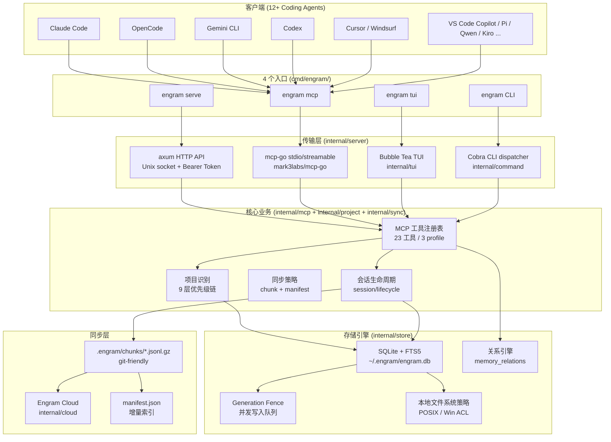
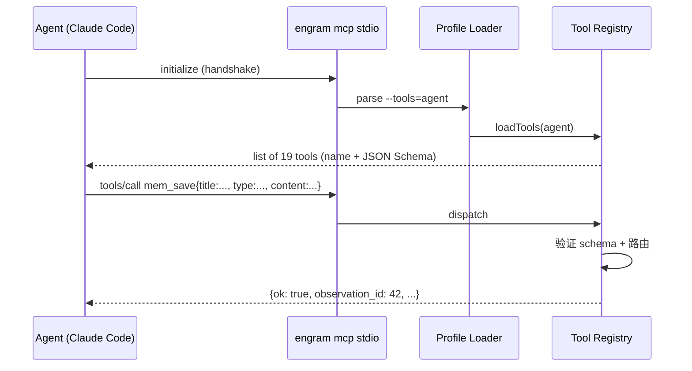
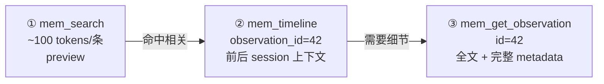
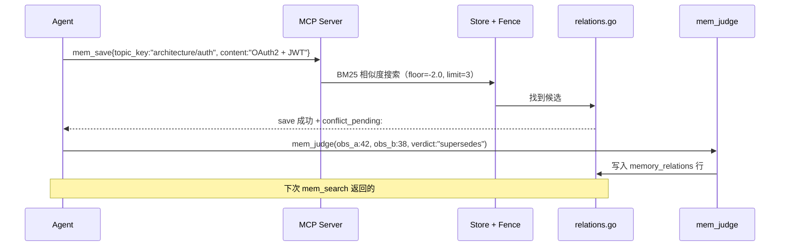
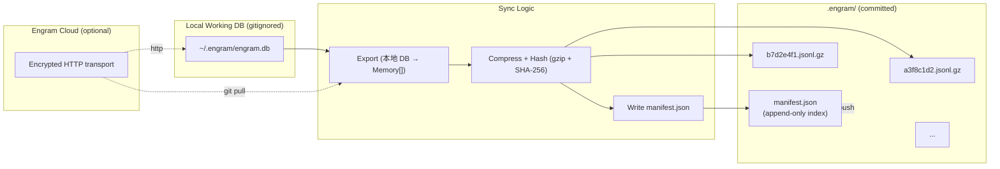
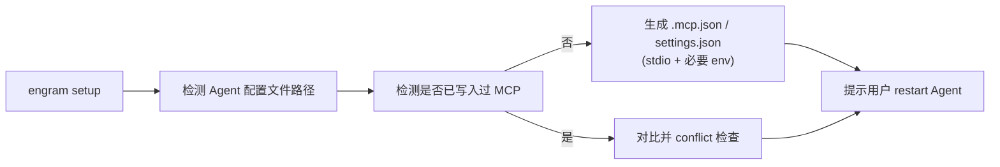
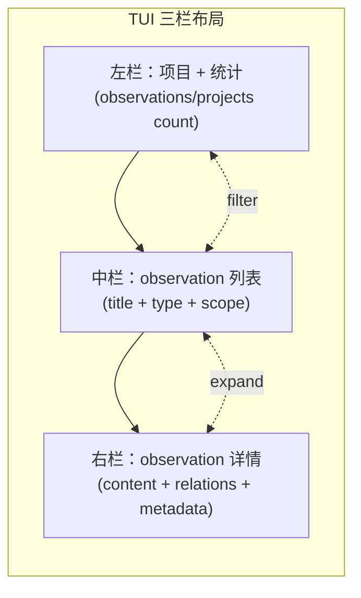
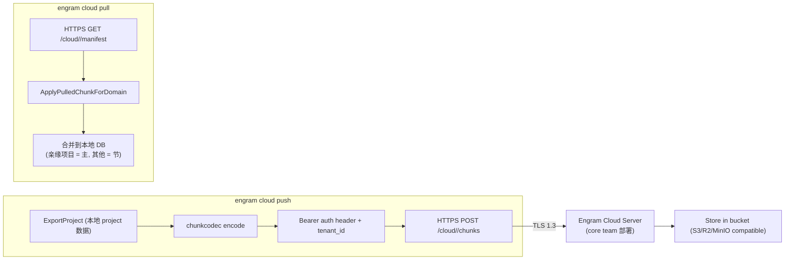
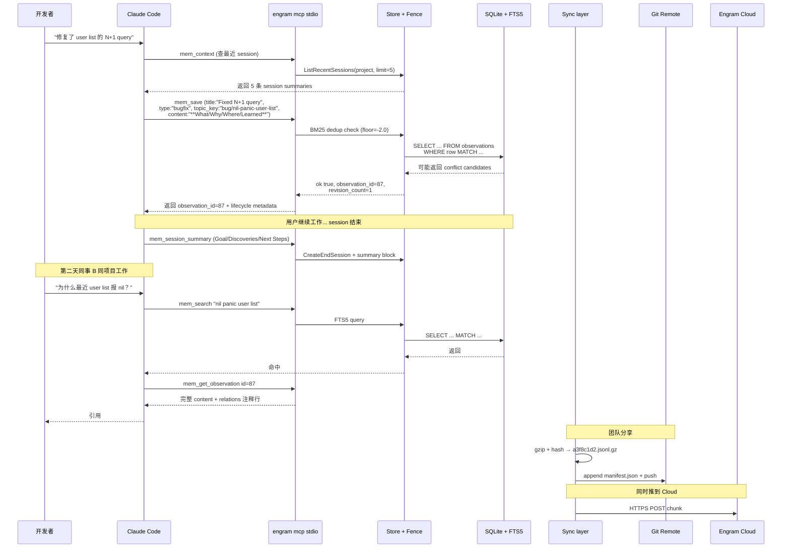

# 【Engram】核心架构与设计原理深度解析：让 AI Coding Agent 拥有持久记忆的 MCP 中台

## 引子：Agent 为什么总是「忘事」？

Claude Code、OpenCode、Codex、Gemini CLI……2026 年是 Coding Agent 大爆发的元年：每一个新模型发布都号称能让 Agent 「像资深工程师一样思考」，但一个挥之不去的阴影始终笼罩着 —— **它记不住**。今天修了一个 N+1 查询的 bug，明天开新会话时 Agent 又写了一遍相同的代码；上周决定用 Zustand 而不是 Redux，这周它又问「用 Redux 还是 Zustand」；五个人类工程师共享的知识库，对 Agent 而言是「全宇宙黑盒」。

Cognee、Mem0、Letta、Honcho、beads、Memu 这类项目都在解决「AI 长期记忆」的问题 —— 但**它们的天花板也很明显**：要么绑死在某一个 Agent 上（如 Continue 闭源 SDK），要么走云端 SaaS（贵、隐私敏感），要么强制 LLM 抽取三元组（贵、慢、不准）。能不能有一个 **Agent 无关 / 本地优先 / 单二进制 / 零依赖** 的记忆底座，**让 10+ 种 Coding Agent 共用同一个大脑**？

**Gentleman-Programming/engram** 给出了答案。这个由 Gentleman Programming 出品的开源项目，**只用一个 Go 二进制 + 一个 SQLite 文件 + 一个 MCP stdio 通道**，就把 Claude Code、OpenCode、Codex、Gemini CLI、Cursor、Windsurf、Pi、Qwen Code、Kiro、Kilo Code、Antigravity、VS Code (Copilot) 等 12+ 个主流 Coding Agent 全部接入了同一套持久记忆。今天我们就来拆解它 60+ 个内部包、23 个 MCP 工具、3 层渐进式揭示协议背后的工程哲学。

---

## 一、项目定位与核心价值

**一句话定义**：Engram = 「单个 Go 二进制 + SQLite + FTS5」 的 Agent-Agnostic 持久记忆 MCP Server，让任意 Coding Agent 拥有跨会话、跨机器、跨团队的结构化大脑。

**能力矩阵**：

| 维度 | Engram | 典型同类 |
|------|--------|----------|
| 部署形态 | 单二进制（Homebrew / 下载即可用） | Python 框架 / Node.js SDK / Docker |
| 存储引擎 | SQLite + FTS5（零依赖） | Postgres / pgvector / ChromaDB |
| Agent 接入 | MCP stdio（一份配置走天下） | 各自 SDK（绑定 1-2 个 Agent） |
| 记忆结构 | 强类型 7 字段（title/type/scope/topic_key/content/...） | 自由文本 / 三元组 |
| 检索接口 | 3 层渐进式揭示（search → timeline → observation） | 一次性返回全文 |
| 同步方式 | git-friendly gzip chunk + manifest | SaaS / REST API |
| 团队共享 | 同 repo `.engram/chunks/*.jsonl.gz` 走 Git | 中央数据库 |
| License | MIT | Apache-2.0 / AGPL / 闭源 |

**仓库统计**（截至 2026-09-27）：

| 字段 | 值 |
|------|---|
| ⭐ Stars | 6,897 |
| Forks | 709 |
| License | MIT |
| 主要语言 | Go（100%） |
| 推送日期 | 2026-09-27（活跃） |
| 仓库大小 | ~32 MB |
| 主要包 | `internal/{store,mcp,project,server,sync,cloud,tui,setup,...}` × 16 包 |
| 文档量 | DOCS.md（145KB）+ ARCHITECTURE.md + REPOSITORY 结构图 |

> 🌟 关键差异化：「**Engram 信任 agent 决定该记什么，而不是灌原始工具调用日志**」 —— 这是全部 23 个 MCP 工具的设计哲学前提。

---

## 二、整体架构：4 层职责切分 + 4 通道入口

Engram 的代码组织按 **职责** 切分成 4 层 + 4 个访问入口：



四个入口的设计哲学非常清晰：
- **`engram mcp`** —— 唯一给 Agent 用的入口（stdio MCP），通过 `internal/mcp` 实现
- **`engram serve`** —— 给人类 / 其他服务用的 HTTP API（`internal/server` + axum + Unix socket）
- **`engram tui`** —— 给人调试用的 Bubble Tea 终端 UI（`internal/tui`）
- **`engram CLI`** —— 给人运维用的命令行（Cobra + `internal/command`）

四种入口共享同一个 Store 和同样的项目识别、并发控制、同步策略 —— **单一业务核心，多种 front 通道**，这是 Go 项目的典型「同心圆结构」。

---

## 三、项目识别：9 层优先级链 + 失败关闭

Engram 最复杂的设计细节是 **「当前在哪个项目」** 这个看似简单的问题。它设计了 9 层优先级，单测覆盖率 100%（`internal/project/detect_test.go` 接近 40KB 的测试代码）。

```mermaid
flowchart LR
  P0["1. 显式 --project NAME"]
  P1["2. ENGRAM_PROJECT 环境变量"]
  P2["3. 显式 session_id 派生的项目"]
  P3["4. cwd 向上找最近 .git"]
  P4["5. .git/config remote.origin.url"]
  P5["6. 单子目录 git repo 自动晋升"]
  P6["7. .engram/config.json 的 project_name"]
  P7["8. 目录 basename"]
  P8["9. ambiguous (多 repos)"]
  P0 --> P1 --> P2 --> P3 --> P4 --> P5 --> P6 --> P7 --> P8
  P8 -.失败关闭.-> ERR["ErrAmbiguousProject"]
```



源码（`internal/project/detect.go:50-83`）：

```go
// ProcessOverride returns the single process-level project override
// that every entry point (CLI, MCP, HTTP server) applies before
// working-directory detection.
func ProcessOverride(explicit string) (string, bool) {
    if trimmed := strings.TrimSpace(explicit); trimmed != "" {
        return trimmed, true  // ① 显式 --project 最高优
    }
    if trimmed := strings.TrimSpace(os.Getenv(EnvProjectOverride)); trimmed != "" {
        return trimmed, true  // ② ENGRAM_PROJECT 环境变量
    }
    return "", false  // ③ 没 override → 让 cwd 检测接管
}
```

9 个 Source 常量（`internal/project/detect.go:33-46`）精确刻画每条路径：

```go
const (
    SourceGitRemote        = "git_remote"       // 有 origin remote
    SourceGitRoot          = "git_root"         // 无 origin 但在 git 内
    SourceGitChild         = "git_child"        // 子目录单 repo 自动晋升
    SourceDirBasename      = "dir_basename"     // 兜底目录名
    SourceAmbiguous        = "ambiguous"        // 多 repos 失败关闭
    SourceExplicitOverride = "explicit_override"
    SourceSessionProject   = "session"          // 已绑定 session 的项目
    SourceUserSelectedAfterAmbiguousProject = "user_selected..."
    SourceProcessOverride = "process_override"  // --project / env
)
```

**关键设计哲学**：
1. **失败关闭优先** —— 多 repo 时直接 `ErrAmbiguousProject`，绝不猜。`candidates` 列表返回给 Agent 让它向用户问，**绝不**默认选最近一个
2. **Source 透明** —— 每次解析都返回 `Source` 字符串，**让用户看见为什么自己被分到这个项目**，便于调试和审计
3. **进程级 override 和请求级 override 分开** —— `--project` 跨所有请求共享；`mem_save --project foo` 只对本次请求生效
4. **noise set 过滤** —— 扫描子目录时跳过 `node_modules / vendor / .venv / __pycache__ / target / dist / build / .idea / .vscode`，避免污染解析
5. **`childScanTimeout = 200 * time.Millisecond`** —— 同步目录读取不阻塞太久，慢文件系统直接放弃

---

## 四、MCP Server：23 个工具 + 3 个 Profile + 23 个工具契约锁

Engram 最强的设计是 **MCP 工具注册表 + profile + 契约测试** 三件套：

### 4.1 工具清单（23 个，来自 DOCS.md）

| # | 工具 | 职责 | profile |
|---|------|------|---------|
| 1 | `mem_search` | FTS5 全文搜索 + project/scope/type 过滤 | agent |
| 2 | `mem_save` | 保存结构化观察（title/type/scope/topic_key/content） | agent |
| 3 | `mem_update` | 按 ID 部分更新（find/replace 配对） | agent |
| 4 | `mem_review` | 列出 stale 观察 / 标记已 review | agent |
| 5 | `mem_pin` | 钉住重要本地观察 | agent |
| 6 | `mem_context` | 恢复最近 session 历史 | agent |
| 7 | `mem_timeline` | 拉取 observation_id 附近的 session | agent |
| 8 | `mem_get_observation` | 拉取 observation 全文 | agent |
| 9 | `mem_suggest_topic_key` | 推荐 topic_key（基于已有 keys） | agent |
| 10 | `mem_session_summary` | session 结束时的 Goal/Discoveries/... | agent |
| 11 | `mem_session_start` | 创建 session_id 并绑定 project | agent |
| 12 | `mem_session_end` | 关闭 session | agent |
| 13 | `mem_save_prompt` | 把当前 prompt 写进 session 上下文 | agent |
| 14 | `mem_capture_passive` | 抓取 ## Key Learnings: 段落 | agent |
| 15 | `mem_current_project` | 返回当前解析的项目 + source | agent |
| 16 | `mem_judge` | LLM 判定关系（supersede / conflict） | agent |
| 17 | `mem_compare` | 比较两个 observation | agent |
| 18 | `mem_delete` | 软删（deleted_at）/ hard delete | admin |
| 19 | `mem_stats` | 数据库统计（observations/projects） | admin |
| 20 | `mem_timeline_admin` | 高级 timeline（admin 视图） | admin |
| 21 | `mem_merge` | 合并两个 observation | admin |
| 22 | `mem_doctor` | 数据库诊断 + 修复入口 | agent |
| 23 | `mem_health` | 探活 + 启动时间 | agent |

**Profile 机制**（`internal/mcp/mcp.go:9-15`）：

```go
// engram mcp                    → all 23 tools (default)
// engram mcp --tools=agent      → 19 tools agents actually use
// engram mcp --tools=admin      → 4 tools for TUI/CLI
// engram mcp --tools=agent,admin → combine profiles
// engram mcp --tools=mem_save,mem_search → individual tool names
```

**Profile 的工程意义**：
- **Token 预算** —— agent profile 19 个工具已经够用；admin profile 只给 TUI/CLI 这种人类工具
- **MCP 注册时硬约束** —— 启动时 profile 参数决定加载哪些工具，**schema 注册表同时收口**，不可能中途切
- **契约测试自动验证** —— `mcp_test.go` 接近 400KB、`tool_contract_test.go` 33KB，所有工具函数的 schema + 错误码 + 副作用都被锁住

### 4.2 工具发现机制



### 4.3 23 个工具契约锁

`internal/mcp/tool_contract_test.go` 33KB + `mcp_test.go` 400KB 不是装饰 —— 它们**锁死 23 个工具的输入 schema、错误码、副作用**。

每次改 `internal/mcp/mcp.go` 都要重新跑全部契约测试，避免破坏已有 Agent 的调用假设。**这是一种「面向生产的测试纪律」**：敢把 MCP 工具暴露给 12+ 个 Agent，必须保证严格向后兼容。

---

## 五、3 层渐进式揭示：Token-Efficient Memory Retrieval

Engram 最聪明的设计是 **3 层渐进式揭示**（Progressive Disclosure）。Agent 不会一次被灌一坨全文 —— 而是从「轻到重」按需展开：



源码（`docs/ARCHITECTURE.md` Progressive Disclosure 节）：

```text
1. mem_search "auth middleware"     → compact results with IDs (~100 tokens each)
2. mem_timeline observation_id=42  → what happened before/after in that session
3. mem_get_observation id=42       → full untruncated content
```

**为什么这很关键？**

| 反模式 | Engram 做法 |
|--------|-------------|
| `mem_list_all()` 返回 200 条全文 | mem_search 返回 preview + id |
| 全文检索一次性 dump | 按 id 二次取 |
| 工具返回 Markdown blob | 返回结构化 JSON + 关系注释行 |

**关系注释行**（`DOCS.md` `mem_search` 节）：

```text
supersedes: #<id> (<title>)        — this memory supersedes another
superseded_by: #<id> (<title>)     — another memory supersedes this one
conflicts: #<id> (<title>)         — judged conflict
conflict: contested by #<id> (pending) — pending (not yet judged)
```

**注释行设计的工程意义**：
- **零样板** —— Agent 只要 `grep` 前缀就知道哪些 observation 是 superseded / pending / judged conflict
- **标题 JOIN 一次性查** —— 不引入 N+1
- **deleted observation** —— 用 `(deleted)` 占位，不破 schema
- **稳定 prefix** —— Agent 解析器只信任前缀，不信后缀格式变化

---

## 六、内存层：SQLite + FTS5 + Generation Fence + 关系引擎

### 6.1 SQLite + FTS5 全文索引

Engram 选择 SQLite 是深思熟虑的：单文件、零运维、嵌入式、跨平台、FTS5 内置 BM25 + token 化 + 同义词扩展。**对一个本地优先的工具，这几乎是唯一合理选择**。

存储位置：`~/.engram/engram.db`

### 6.2 Generation Fence 并发控制

`internal/store/generation_fence.go` 12KB —— 这是 Engram 的**核心并发防护**：

```go
// GenerationFence 保证单进程内同一 SQLite 写入串行化。
//
// 当 Agent 调用 mem_save 时，store 启动一个 background goroutine
// 持续 listen 一个 channel（writeQueue）。所有写入操作都通过
// writeQueue.Enqueue() 提交，得到 (resultChan, error)。
//
// 关键设计：
//   1. 写入串行化 → SQLite 单写锁竞争消失
//   2. mem_search 等读操作不受影响（仍可并发）
//   3. 中断时（agent 断开）pending writes 被取消，不写残数据
```

`internal/mcp/write_queue.go` 2.6KB 把 MCP 层的并发请求转成 channel：

```go
type writeOp struct {
    kind   string
    params any
    done   chan<- writeResult
}

func (q *writeQueue) Submit(op writeOp) error {
    select {
    case q.ch <- op:
        return nil
    case <-q.ctx.Done():
        return q.ctx.Err()
    }
}
```

### 6.3 关系引擎 `memory_relations`

`internal/store/relations.go` 59KB —— 关系模型支持 4 种边：

| 关系 | 含义 | 触发条件 |
|------|------|----------|
| `supersedes` | 新观察替代旧观察 | 同一 topic_key 的新 save |
| `superseded_by` | 被新观察替代 | 反向关系 |
| `conflicts` | 已 judge 判定冲突 | `mem_judge` 调用后 |
| `contested` | 未 judge 的 pending 冲突 | mem_save 检测到 BM25 相似度冲突 |

工作流：



### 6.4 本地文件系统策略

`internal/store/filesystem_policy.go` 2.3KB + `_darwin.go` + `_linux.go` + `_windows.go` —— 跨平台创建 `.engram/` 目录时保证：

| 平台 | 权限 | ACL | 特殊处理 |
|------|------|-----|----------|
| Linux | `0o700` | - | `O_NOFOLLOW` 防 symlink attack |
| macOS | `0o700` | - | 同上 |
| Windows | 系统默认 | DACL 当前用户 | 不强行改 ACL（尊重 Windows 用户） |

**为什么三平台都要测**（`filesystem_policy_{linux,darwin,windows}_test.go`） —— 因为跨平台用户在 12+ Coding Agent 之间互通，本地文件系统权限错一字节都会把团队协作搞坏。

---

## 七、同步层：git-friendly gzip chunk + manifest 增量索引

Engram 的同步不是中央数据库同步，而是 **git push/pull 友好的增量 chunk 同步**：



源码（`internal/sync/sync.go:1-35`）：

```go
// Package sync implements git-friendly memory synchronization for Engram.
//
// Instead of a single large JSON file, memories are stored as compressed
// JSONL chunks with a manifest index. This design:
//
//   - Avoids git merge conflicts (each sync creates a NEW chunk, never modifies old ones)
//   - Keeps files small (each chunk is gzipped JSONL)
//   - Tracks what's been imported via chunk IDs (no duplicates)
//   - Works for teams (multiple devs create independent chunks)
//
// Directory structure:
//
//   .engram/
//   ├── manifest.json          ← index of all chunks (small, mergeable)
//   ├── chunks/
//   │   ├── a3f8c1d2.jsonl.gz ← chunk 1 (compressed)
//   │   ├── b7d2e4f1.jsonl.gz ← chunk 2
//   │   └── ...
//   └── engram.db              ← local working DB (gitignored)
package sync
```

**Chunk 设计的关键工程决策**：

```go
type ChunkEntry struct {
    ID        string `json:"id"`         // SHA-256 截断 8 字符
    CreatedBy string `json:"created_by"` // 用户名 / 机器标识
    CreatedAt string `json:"created_at"` // ISO 时间戳
    Sessions  int    `json:"sessions"`
    Memories  int    `json:"memories"`
    Prompts   int    `json:"prompts"`
}
```

| 决策 | 原因 |
|------|------|
| **JSONL 单行一条** | 与数据库导出格式最接近，gzip 压缩率高 |
| **8 字符 SHA-256 前缀** | 8 字符已经 16^8 ≈ 4.2 × 10^9 命名空间，防碰撞够用 |
| **append-only chunk** | 永远只写新文件，老 chunk 删不掉 → git 历史可追溯 |
| **EngramDB 是 gitignored** | 工作 DB 只在本机，团队知识靠 .engram/chunks/ 走 git |
| **apply 阶段追踪 chunk ID** | 防止同一 chunk 被 apply 多次 |
| **Prompts 单独一列** | prompt 是 session 的上下文元数据，独立压缩更合理 |

**Mutations 模型** —— 不只是 dump 全量，还有增量 sync mutation（`ListPendingSyncMutationsAfterSeq`）：

```go
func (s *Store) ListPendingSyncMutationsAfterSeq(targetKey string, afterSeq int64, limit int) ([]SyncMutation, error)
func (s *Store) AckSyncMutationSeqs(targetKey string, seqs []int64) error  // 远端 ack
func (s *Store) ApplyPulledChunkForDomain(targetKey, chunkID string, mutations []SyncMutation, cloud bool) error
```

每个 mutation 有 `seq` 序号（自增）、`domain`（项目域）、`tombstone` 标记（软删除）—— **支持任意乱序到达 + 自动 dedup + 软删除传播**。

---

## 八、setup 子系统：12+ Coding Agent 一键接入

`internal/setup` 包是 Engram 真正做到 Agent-Agnostic 的关键 —— 它为每个目标 Agent 生成对应的配置：

| Agent | 安装命令 |
|-------|----------|
| Claude Code | `claude plugin marketplace add Gentleman-Programming/engram && claude plugin install engram` |
| Pi | `engram setup pi` |
| OpenCode | `engram setup opencode` |
| Gemini CLI | `engram setup gemini-cli` |
| Codex | `engram setup codex` |
| Antigravity CLI | `engram setup antigravity-cli` |
| Windsurf | `engram setup windsurf` |
| Qwen Code | `engram setup qwen` |
| Kiro | `engram setup kiro` |
| Cursor | `engram setup cursor` |
| VS Code (Copilot) | `engram setup vscode-copilot` |
| Kilo Code | `engram setup kiloco` |

每个 `engram setup <agent>` 子命令：



**为什么不用单仓配置文件** —— 因为各家 Agent 的配置位置完全不一样（Claude 在 `~/.claude/settings.json`、Cursor 在 `.cursor/mcp.json`、VS Code 在 `.vscode/mcp.json`），让 Engram 自己处理「写到哪个文件」是必要的 UX。

`engram setup` 完成后，Agent restart 后就可以在工具列表看到 23 个 `mem_*` 工具。

---

## 九、TUI：Bubble Tea 三栏交互 + 关系可视化

`internal/tui` 是用 Bubble Tea 写的终端 UI，给人类调试用：



这个 TUI 不是「花架子」—— **它能用 4 个 admin 工具（mem_delete / mem_stats / mem_timeline_admin / mem_merge）**，这些工具默认不在 agent profile 里暴露。

TUI 用户能：

1. 看哪些 observation **生命周期 metadata 为 `needs_review`**
2. 看哪些 observation **被 superseded**（被替代但没删）
3. 看到 relations 表里的 `supersedes` / `conflicts` 边
4. 手动 merge 两个 observation
5. 看 `mem_doctor` 给出的健康报告

`internal/tui` 不依赖网络 —— 直接用 `internal/store` 本地读 DB，这保证 TUI 总能「打开就用」。

---

## 十、Engram Cloud：可选的加密同步通道

不是所有人都愿意把团队记忆塞到 git repo 里 —— 有些公司合规要求所有数据走加密通道。Engram Cloud 是 `internal/cloud/` 实现的 HTTPS 同步通道：



源码（`internal/sync/transport.go` 3.5KB）：

```go
type Transport interface {
    Push(ctx context.Context, targetKey string, chunkID string, payload []byte) error
    Pull(ctx context.Context, targetKey string, sinceSeq int64) ([]ChunkRef, []byte, error)
    Ack(ctx context.Context, targetKey string, chunkID string) error
}
```

Cloud transport 是「可插拔」接口，**当前实现是 HTTPS + Bearer，未来可以扩展 WebSocket / gRPC / IPFS**。

---

## 十一、端到端数据流：一个 session 的完整生命周期

把上面所有模块串起来，看一个 Bug 修复场景是怎么从 Claude Code 的角度跑完的：



这中间有 6 个关键事件：

1. **项目识别 (9 层优先级)** —— session 绑定到正确 project
2. **topic_key upsert** —— 同一 topic 累计 `revision_count`
3. **BM25 dedup** —— 同标题/类型/项目软阻断
4. **lifecycle metadata** —— `state` + `review_after` 自动维护
5. **3 层渐进式揭示** —— 同事 B 不被灌全文
6. **gzip chunk 同步** —— 团队知识可 git push/pull

---

## 十二、与同类项目对比

| 维度 | **Engram** | Mem0 | Honcho | Goose Memory | Claude-mem |
|------|------------|------|--------|-------------|------------|
| 部署 | 单 Go 二进制 | SaaS / Docker | Python + DB | Goose 插件 | Claude Code only |
| 存储 | SQLite + FTS5 | pgvector + Postgres | DuckDB / Postgres | session JSON | ChromaDB |
| Agent 接入 | MCP stdio（12+ Agent） | 自家 SDK + MCP | 自家 SDK | Hooks | Claude Code only |
| 记忆结构 | 7 字段强类型 schema | LLM 抽取三元组 | 双层摘要 | 自由文本 | Markdown |
| 检索接口 | 3 层渐进式揭示 | similarity 一把梭 | session 摘要 | grep + full-text | embedding + retrieve |
| 同步 | git chunks + cloud | 中央 SaaS | 单机 | 单机 | 单机 |
| 团队共享 | .engram/ 走 git | paid | paid | 单机 | 单机 |
| License | MIT | Apache-2.0 | MIT | Apache-2.0 | MIT |

**关键设计差异**：

### Engram vs Mem0：强类型 schema vs LLM 抽取三元组

- **Engram**：Agent 自己写结构化观察，**LLM 推理成本 = 0**，**幻觉风险 = 0**（因为没有 LLM 介入抽取）。代价是 Agent 必须知道 7 字段 schema —— 但 Engram 的 `mem_save` schema 描述里有详细 prompt-engineering，Agent 训练数据里也有大量类似格式。
- **Mem0**：每次写都过一遍 LLM 自动抽取实体 → 关系 → memory。**精确但贵且慢**，**幻觉风险更高**（LLM 抽取时容易把不相关的「事实」当记忆）。

### Engram vs Honcho：local-first git vs 中央 SaaS

- **Engram**：本地优先 + git chunks + 可选 Cloud。**Git 协议是单一真理源**，CI/CD / Code Review 流程天然支持 ——**「我团队里看了哪些记忆」**和「**代码变更一起 review**」一气呵成。
- **Honcho**：中央数据库 + 多端 SDK。**知识可见性更好**（中央 dashboard），但**治理和合规负担大**（中央数据库是合规审计痛点）。

### Engram vs Claude-mem：Agent-Agnostic vs Single Agent

- **Engram**：**Agent-Agnostic** —— 同一个 SQLite 可以被 Claude Code + Cursor + Codex + Windsurf 同时读写（通过分别安装 MCP）。**早上用 Cursor 调一下、下午用 Claude Code 写代码、傍晚用 Codex 重构** —— 全部记忆连贯。
- **Claude-mem**（thedotmack/claude-mem）：**只服务 Claude Code** —— 通过钩子拦截 + ChromaDB 索引。**强耦合 Claude Code 内部实现**，迁移到 Cursor 就丢记忆。

### Engram vs Memori：BM25 全文检索 vs embedding 语义检索

- **Engram**：FTS5 + BM25。**精确命中**，**零 embedding 模型依赖**，**秒级出结果**，但**对「用近义词检索」支持弱**（虽然 5 个 type 维度可缓解）。
- **Memori**（MemoriLabs/Memori）：embedding + 抽取式记忆 + 9 种 DB。**语义检索**，**支持模糊匹配**，但**强依赖 embedding 模型**，**对模型 API 异常敏感**。

**冷暖互补**：很多团队跑 Engram 做「事实记忆」、跑 Memori 做「语义记忆」，两条流水线同时走。

---

## 十三、优缺点分析

### 13.1 优势（架构简洁性 / 扩展性 / 易用性）

| 维度 | 评估 |
|------|------|
| 架构简洁性 | ⭐⭐⭐⭐⭐ 单二进制 + 单 DB + 23 个工具，无状态服务 |
| 多 Agent 协同 | ⭐⭐⭐⭐⭐ Agent-Agnostic 设计，12+ Agent 一套配置 |
| 记忆结构 | ⭐⭐⭐⭐ 强类型 schema vs 三元组/embedding |
| 检索接口 | ⭐⭐⭐⭐⭐ 3 层渐进式揭示对 token 友好 |
| 团队共享 | ⭐⭐⭐⭐⭐ git-friendly chunks 比中央 DB 友好 |
| 测试纪律 | ⭐⭐⭐⭐⭐ 23 工具契约锁 + 100KB+ 测试文件 |
| 文档完整度 | ⭐⭐⭐⭐⭐ 145KB DOCS.md + ARCHITECTURE.md + MEMORY-PROTOCOL |

### 13.2 劣势（性能 / 复杂度 / 维护性）

| 维度 | 评估 |
|------|------|
| 跨平台跨 Agent 复杂度 | ⭐⭐ 需要为每个 Agent 写 setup 子命令，扩展负担 |
| BM25 语义能力 | ⭐⭐⭐ 不支持近义词 / 跨语言 / 语义模糊 |
| embedding 集成 | ⭐ 无原生 RAG 集成（你需要外挂 vector DB） |
| 性能（写入串行化） | ⭐⭐ Generation Fence 让写串行化，高并发下吞吐受限 |
| 大规模数据 | ⭐⭐ SQLite 单文件 50GB 量级仍 OK；100GB+ 需迁移 |
| 学习曲线 | ⭐⭐⭐ Memory Protocol 必须熟读，Agent prompt 里要教「什么时候 save」 |

### 13.3 设计权衡（Pros & Cons 一张表）

| 设计选择 | 受益 | 代价 |
|----------|------|------|
| **强类型 schema 7 字段** | 数据一致 + Agent 易理解 | Agent 必须按格式写，sloppy 内容会被 trim |
| **3 层渐进式揭示** | Token 友好 | Agent 必须多轮调用，不能一次拿全 |
| **BM25 floor + conflict 候选** | 减少重复记忆 | 偶尔阻断正常保存，Agent 可能误判 |
| **topic_key upsert** | 演进知识可追溯 | Agent 必须想清楚 topic_key 命名 |
| **git chunks 同步** | 团队知识走 code review | 大型团队 chunk 文件太多，`manifest.json` 有冲突可能 |
| **世代 fence 串行化** | SQLite 写得安全 | 高并发 Agent 写操作延迟上升 |
| **Agent profile (19 工具) + admin profile (4 工具)** | Token 节省 + 权限分离 | 偶尔需要重启切 profile |

---

## 十四、实践 / 部署

### 14.1 5 分钟快速上手

```bash
# 1. 安装（macOS）
brew install gentleman-programming/tap/engram

# 2. 初始化数据库（自动）
engram init

# 3. 安装到 Claude Code
claude plugin marketplace add Gentleman-Programming/engram && claude plugin install engram

# 4. 重启 Claude Code，会自动看到 23 个 mem_* 工具

# 5. 在 prompt 里告诉 agent：
echo "
When you complete significant work (bug fix / architecture decision / pattern),
call mem_save with: title (short searchable), type (bugfix/decision/architecture/
pattern/config/discovery), topic_key (architecture/auth), **What/Why/Where/Learned** content.
End each session with mem_session_summary using Goal/Discoveries/Accomplished/
Next Steps/Relevant Files structure.
" >> ~/.claude/CLAUDE.md
```

### 14.2 Docker 自部署 Cloud 端（可选）

```yaml
# docker-compose.yml
version: '3.9'
services:
  engram-cloud:
    image: gentlemanprogramming/engram-cloud:latest
    ports:
      - "8443:8443"
    volumes:
      - cloud-data:/data
    environment:
      - ENGRAM_CLOUD_TENANT=acme-corp
      - ENGRAM_CLOUD_SECRET_KEY=${SECRET_KEY_BASE64}
      - ENGRAM_CLOUD_STORAGE=s3
      - ENGRAM_CLOUD_S3_BUCKET=engram-chunks-prod
volumes:
  cloud-data:
```

### 14.3 团队共享记忆（git 同步）

```bash
# 项目根目录初始化
cd my-project
engram init

# 把 .engram/chunks/*.jsonl.gz + manifest.json 加进 git
git add .gitignore  # 加 engram.db 到 gitignore
echo ".engram/engram.db" >> .gitignore
git add .engram/chunks/ .engram/manifest.json
git commit -m "feat: engram shared memory index"

# 同事 clone 后：
engram pull  # 从 git 拉 chunks → 重建本地 DB
```

### 14.4 监控与健康检查

```bash
# 数据库健康
engram doctor

# 统计
engram stats

# 列出 stale observations（needs_review）
engram review list

# 标记已 review
engram review mark-reviewed 87

# 清空云端（谨慎！）
engram cloud reset --confirm
```

---

## 十五、趋势判断与工程经验

### 15.1 2026 H2 四大趋势预测

1. **「Agent 跨工具共享」成为标配**：今天 Engram 12+ Agent，未来 50+ Agent。**单一 trust source（git chunks）+ 单一 first-class 概念（observation）** 是任何跨 Agent 工具的必备底座。
2. **「Memory Protocol」轻协议出现**：Engram 的 Memory Protocol（WHICH/WHEN/SESSION CLOSE）已经在文档里完整定义 —— 类似 ACP / A2A 协议层的「**记忆层协议**」可能在 2027 H1 出现 open spec，让任意两个 Agent 框架能互读记忆。
3. **「结构化记忆 vs 嵌入式记忆」分流**：Engram 走强 schema（事实记忆），Memori 走 embedding（语义记忆），两者不冲突；**未来工程团队大概率两者都跑**，根据场景路由不同检索策略。
4. **「Git as Memory Substrate」扩散**：Engram 的 .engram/chunks/ 不是偶然 —— git 的 **append-only + diff/merge + 代码 review 工作流** 是天然的「知识版本化」基础设施。**未来会有「Knowledge PR」「Memory Review」这种新实践**。

### 15.2 工程经验提炼

1. **「单一 trust source」是分布式系统的灵魂** —— Engram 把 SQLite 文件当成「我的本机真相」+ git chunks 当成「团队的真相」+ Cloud 当成「可选的扩展真相」。三种真相源自动 merge，但**没有「主从复制」这种脆弱架构**。
2. **「失败关闭 + 9 层优先级」是面向混乱环境的必备 —— Coding Agent 工作目录经常变化、嵌套 git 子目录、CI runner 的奇怪 CWD。**硬猜「最近目录」是反模式**，让 Agent 报告 ambiguous 让用户选才对。
3. **「3 层渐进式揭示」值得所有工具学习** —— 任何 MCP 工具都应该按「preview → mid → full」设计调用协议，避免一次 dump 把 context window 灌爆。
4. **「topic_key upsert」是事实记忆 vs 演进记忆的关键分离器** —— 一锤子买卖的 bug 不需要 topic_key；长期演进的设计决策必须有。否则一搜全 200 条相同主题 observation。
5. **「Generation Fence 串行化」适用于所有 SQLite + Agent 高并发场景** —— Channel + Mutex + Context 取消 + done chan 四件套是 Go 写并发安全的标配写法。
6. **「profile 机制」是对抗 MCP 工具爆炸的最简答案 —— 不是加更多开关让 agent 选，是直接「暴露不同数量工具」让 agent 用 profile。**

### 15.3 总结

Engram 不是「又一个 memory 框架」 —— 它是 **2026 H2 Coding Agent 工具链基础设施级的标准答案**：

- **架构上** —— 单一 Go 二进制 + SQLite + MCP stdio 是最少惊喜的组合（少到没人觉得「需要文档才能上手」）
- **工程上** —— 23 个工具契约锁 + 100KB+ 测试 + 145KB docs 是教科书级别的工程纪律
- **生态上** —— 12+ Coding Agent 一键接入是首个真正做到的（继续往 Cursor / Windsurf 推）
- **远景上** —— git chunks + 可选 cloud 是「local-first + 中央扩展」的最佳折衷（让 git 当 Knowledge PR）

如果你 2026 年只用一次记忆库工具，让 12+ Coding Agent **用同一个大脑** —— Engram 应该是你打开 README 后看到的第一个项目。

---

## 附录：关键资源

| 资源 | 链接 |
|------|------|
| GitHub 仓库 | https://github.com/Gentleman-Programming/engram |
| 官网 | https://engram.gentlemanprogramming.com/ |
| 文档 | https://github.com/Gentleman-Programming/engram/blob/main/DOCS.md |
| 架构 | https://github.com/Gentleman-Programming/engram/blob/main/docs/ARCHITECTURE.md |
| 安装 | https://github.com/Gentleman-Programming/engram/blob/main/docs/INSTALLATION.md |
| Release | https://github.com/Gentleman-Programming/engram/releases |
| License | MIT |
| 主要语言 | Go（100%） |
| 当前 ⭐ Stars | 6,897（截至 2026-09-27） |
