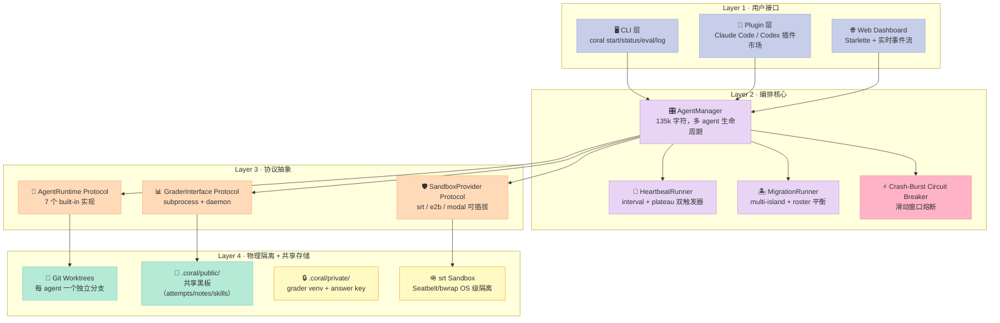
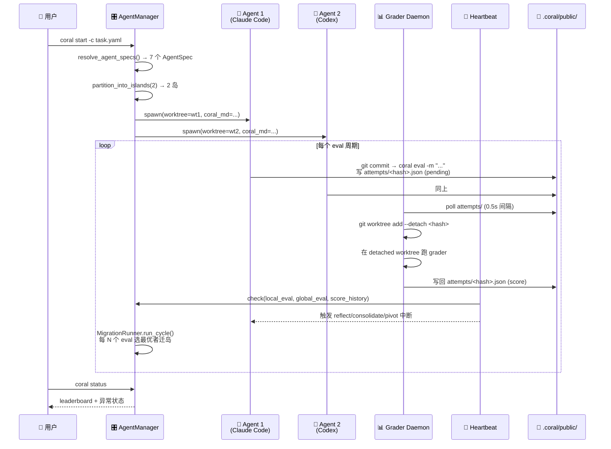
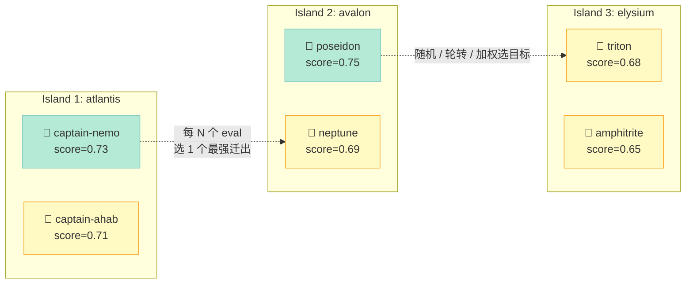
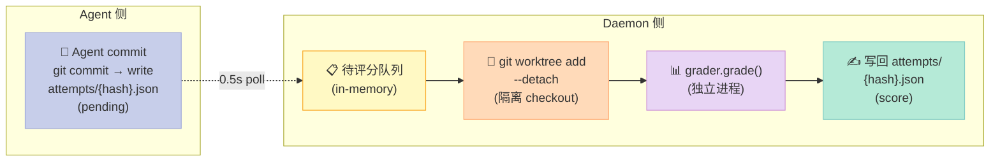

> "如果你让 5 个 Claude Code 同时改同一个仓库，谁来打分、谁来定谁最强、谁来让弱的学强的、谁来阻止它们撞坏工作区？"——CORAL 给出的答案是：**Multi-Island 迁移 + Heartbeat 节奏控制 + Grader Daemon + Worktree 隔离**四件套，而不是写一个超复杂的"多 agent orchestrator"。

---

## 📌 一句话总结

**CORAL 是 COLM 2026 论文 "CORAL: Towards Autonomous Multi-Agent Evolution for Open-Ended Discovery" 的开源实现**，把自己定位为"**多 Agent 自进化（multi-agent self-evolution）的 Harness 基础设施**"——围绕"长程任务里多个 coding agent 接力优化同一个目标"这件事，提供了 6 大原语：Runtime Protocol、Multi-Island 迁移、Heartbeat 节奏控制、Grader Daemon 隔离、Crash-Burst 熔断、Sandbox Provider 抽象。它**本身不写代码**——它把 Claude Code、Codex、Cursor Agent、Kiro、OpenCode、DeepSeek Harness、Pi 7 个 Coding Agent 当作"可替换 LLM 引擎"，把 `.coral/public/` 当作"团队黑板"，把"Grader + Heartbeat + Migration"当作"工程化约束"，让"自进化"这件事**可观测、可重启、可分岛**。

---

## 一、为什么需要 CORAL？

### 1.1 一个真实痛点

2026 年初，Karpathy 的 [autoresearch](https://github.com/karpathy/autoresearch) 项目引爆了"**让 LLM 自己跑实验、改代码、再跑实验**"的范式。但它有一个硬约束：**一个 agent 改一个仓库**。当你想"5 个 agent 一起改，结果谁的好就用谁的"时，立刻撞墙：

- ❌ 5 个 agent 改同一个 git worktree → commit 互相覆盖
- ❌ 5 个 agent 各跑各的分支 → 谁的结果最好没人知道
- ❌ 跑一夜发现 4 个 agent 卡在同一分数 → 没有"换方向"机制
- ❌ 一个 agent 进程崩了 → 全局死锁
- ❌ agent 偷看了 grader 的源码 → 评分作弊

CORAL 的核心主张：**这些问题不能塞进 agent 的 prompt 里解决，必须从 Harness 层做物理隔离 + 异步评分 + 工程化约束**。

### 1.2 CORAL 想做什么？

> **Give it a codebase and a grader, and CORAL handles the rest: isolated workspaces, safe evaluation, persistent shared state, and multi-agent collaboration.**

把 CORAL 当成"**多 Agent 接力赛的发令枪 + 计时器 + 裁判组 + 转播车**"。它不写代码，但它决定：
- **谁先跑**（agent 启动顺序 + island 划分）
- **怎么算分**（grader daemon 异步打分，写回 attempts JSON）
- **怎么防偷看**（`.coral/private/` 对 agent 不可见）
- **怎么换方向**（plateau 心跳触发 pivot 提示）
- **怎么互相学习**（`.coral/public/` 是共享黑板）
- **怎么不撞死**（每个 agent 在自己的 git worktree 里工作）

论文级别的具体案例：作者在 `kernel_engineering`、`circle_packing`、`stanford_covid_vaccine`、`erdos` 等 7 个 benchmark 上验证，长期运行下多个 agent 协作的最终分数**显著高于单 agent 串行**（具体数据见论文 Table 2）。

---

## 二、架构解析

### 2.1 总体分层

CORAL 的代码结构（`coral/` 目录下约 18 个模块 + 7 个 built-in runtime）可以浓缩为 4 层：



**关键设计原则**：每一层都通过 **Protocol（Python `typing.Protocol`）** 暴露抽象，新增一种 agent / sandbox / grader 时**不修改任何已有文件**，只新增 `coral/agent/builtin/my_agent.py` + 在 `_RUNTIMES` 字典里注册一行。

### 2.2 数据流（一个完整回合）



注意**没有任何 agent 在等另一个 agent**——所有通信通过文件系统（`.coral/public/`）实现，这是 CORAL 整套架构**最大的设计哲学**：

> **Agent 不要相互调用，相互读文件 + commit hash 即可。**

这避免了 99% 的并发死锁问题，也让"agent 崩了重启"几乎零成本（重启后直接读黑板恢复）。

---

## 三、核心原理解析（6 大原语）

### 原语 1：AgentRuntime Protocol——把 7 个 Coding Agent 当成可换电池

**位置**：`coral/agent/runtime.py`（核心协议）+ `coral/agent/registry.py`（注册表）+ `coral/agent/builtin/*.py`（7 个内置实现）

```python
# coral/agent/runtime.py 真实代码
@runtime_checkable
class AgentRuntime(Protocol):
    """Protocol that all agent runtimes must implement."""

    def start(
        self,
        worktree_path: Path,
        coral_md_path: Path,
        model: str = "sonnet",
        runtime_options: dict[str, Any] | None = None,
        max_turns: int = 0,
        log_dir: Path | None = None,
        verbose: bool = False,
        resume_session_id: str | None = None,
        prompt: str | None = None,
        prompt_source: str | None = None,
        task_name: str | None = None,
        task_description: str | None = None,
        gateway_url: str | None = None,
        gateway_api_key: str | None = None,
        run_as_user: dict[str, Any] | None = None,
        sandbox: AgentSandboxSpec | None = None,
    ) -> AgentHandle: ...

    def extract_session_id(self, log_path: Path) -> str | None: ...

    @property
    def instruction_filename(self) -> str:
        """e.g. CLAUDE.md / AGENTS.md"""
        ...

    @property
    def shared_dir_name(self) -> str:
        """e.g. .claude / .codex / .opencode"""
        ...
```

**这套抽象为什么重要**：每个 Coding Agent CLI 都有自己的：

| 维度 | Claude Code | Codex | OpenCode | DeepSeek Harness |
|------|-------------|-------|----------|------------------|
| 入口命令 | `claude -p "..."` | `codex exec "..."` | `opencode run` | `dsh --profile headless` |
| 指令文件名 | `CLAUDE.md` | `AGENTS.md` | `AGENTS.md` | `AGENTS.md` |
| 共享目录 | `.claude/` | `.codex/` | `.opencode/` | `.dsh/` |
| session 续接 | `--resume <sid>` | `codex exec resume` | `--continue --session` | ❌ 不支持 |
| 流式日志 | JSONL | JSONL | JSON event | 纯文本 |

CORAL 不去重写这些差异，而是用 Protocol 承认差异，让每个 builtin 实现负责"**自己 agent 的 CLI 怎么拼、session 怎么续**"。

**注册表代码（`registry.py`）**：

```python
_RUNTIMES: dict[str, type] = {
    "claude_code": ClaudeCodeRuntime,
    "codex": CodexRuntime,
    "cursor_agent": CursorAgentRuntime,
    "dsh": DeepSeekHarnessRuntime,
    "kiro": KiroRuntime,
    "opencode": OpenCodeRuntime,
    "pi": PiAgentRuntime,
}

_ALIASES: dict[str, str] = {
    "claude": "claude_code",
    "openai": "codex",
    "deepseek": "dsh",
    # ... 让用户写 `deepseek` 也能用
}

_DEFAULT_MODELS: dict[str, str] = {
    "claude_code": "sonnet",
    "codex": "gpt-5.4",
    "dsh": "deepseek-v4-flash",
    "pi": "zai/glm-5.1",
    # ...
}
```

**这是 Harness 6 件套里"Sub-Agent 组件"的最优实践**：用 Protocol + 注册表把异构 agent 统一抽象，而不是写一坨 `if agent == "claude_code": ... elif ...` 的面条代码。**新增一个 agent 改 2 个文件**：写一个 builtin 实现 + 在 `_RUNTIMES` 加一行。

### 原语 2：Multi-Island 迁移——基因算法到多 Agent 调度

**位置**：`coral/agent/migration.py`（24k 字符，**policy + runner 分离**）

CORAL 的多 Agent 不是"全部堆在一起"，而是借鉴了**遗传算法里的 Island Model**——把 N 个 agent 分成 K 个岛，每个岛独立进化（explore），定期挑最强个体跨岛迁移（exploit），避免整个团队陷入同一个局部最优。



**关键代码（`MigrationRunner.run_cycle` 简化版）**：

```python
@dataclass(frozen=True)
class MigrationCandidate:
    agent_id: str
    src_island: str
    dst_island: str
    score: float  # 最近 rank_window 个 attempt 的最大值


def run_cycle(
    self,
    *,
    coral_dir: Path,
    finalized_eval_count: int,
    roster: IslandRoster | None = None,
    last_migrated_evals: dict[str, int] | None = None,
) -> list[MigrationCandidate]:
    """每 MigrationConfig.every 个 finalized eval 触发一次"""
    if finalized_eval_count - self._last_run_at < self.cfg.every:
        return []
    self._last_run_at = finalized_eval_count

    candidates = select_candidates(
        coral_dir,
        island_ids=self.cfg.islands,
        rank_window=self.cfg.rank_window,
        min_evals=self.cfg.min_evals,
        minimize=(self._direction == "minimize"),
        roster=roster,
        excluded_agents=self._recent_migrants(last_migrated_evals),
    )
    # roster_balanced_subset 选出不破坏岛屿平衡的子集
    # （从一个已经平衡的 roster 出发，意味着是 swap 而不是 drain）
    chosen = choose_roster_balanced_subset(
        candidates, roster=roster, max_per_cycle=self.cfg.max_per_cycle,
    )
    # 按 dest_weighting 给每个 candidate 分配 dst
    return self._assign_destinations(chosen)
```

**3 大设计细节值得深挖**：

#### 2.1 选谁走：`select_candidates` 的双门槛

```python
# 门槛 1：min_evals 防止"新人被立刻踢出"
# 门槛 2：rank_window 内的最高分（不是平均分）
```

为什么用 max 不是 avg？因为 CORAL 团队观察到"**一个 agent 偶尔瞎猫碰上死耗子**（max 高）"和"**持续稳定改进**（avg 高）"是**两种不同信号**——前者更可能是 noise，后者更可能是真本事。但选拔"迁岛代表"反而应该选 max，因为"偶然的好成绩"携带了**未探索的搜索方向**，值得拿到其他岛上"再验证一次"。

#### 2.2 去哪儿：3 种 weighting

```python
# coral/agent/migration.py 注释
"""
dest_weighting:
  - "uniform"    → 随机非源岛
  - "round_robin"→ 按 cycle index 确定性轮转
  - "score"      → 按目标岛当前最高分加权（maximize: 高分吸引；minimize: 低分吸引）
"""
```

`score` 模式是**收敛策略**：让好成绩向好成绩靠拢，最终岛上全是高手；`uniform` 是**探索策略**：保证每个岛都被均匀采样。

#### 2.3 怎么防 ping-pong：remigration_cooldown

**反模式**：agent A 迁到岛 B → 自带 attempt 记录 → 立刻满足 `min_evals` → 下个 cycle 又被选上 → 迁回 A → **资源浪费**。

**CORAL 解法**：每次迁移记 `last_migrated_evals[agent_id] = 当前 global eval count`，agent 在 `remigration_cooldown` 窗口内被排除：

```python
# 简化版
def _recent_migrants(self, last_migrated_evals):
    cooldown = self.cfg.remigration_cooldown  # 默认 ~5 个 eval
    return {
        aid for aid, last_ev in last_migrated_evals.items()
        if self._eval_count - last_ev < cooldown
    }
```

**对比 Karpathy autoresearch**：单 agent 单线，无此问题。CORAL 的 multi-island 是从**遗传算法 Island Model** 直接移植——这是它有论文级理论支撑的关键原语之一。

### 原语 3：Heartbeat 节奏控制——用 2 个 trigger 替代"24 小时 sleep"

**位置**：`coral/agent/heartbeat.py`（7.8k 字符）+ `coral/hub/heartbeat.py`（8.8k 字符）+ `coral/hub/prompts/{reflect,consolidate,pivot}.md`

**核心问题**：长程任务跑几个小时，agent 可能：
- 写代码写到忘了反思 → 越改越乱
- 5 个小时都在原地踏步 → 没有 trigger 换方向
- 知识库过期了没人维护 → 重复犯同一个错

CORAL 用 **4 个内置心跳动作** + **2 种触发器**（interval / plateau）解决：

| 动作 | 触发器 | 默认间隔 | 作用域 | 用途 |
|------|--------|----------|--------|------|
| **reflect** | interval | 5 eval | local（per-agent） | 写实验笔记，回顾最近做了什么 |
| **consolidate** | interval | 25 eval | global（per-run） | 跨 agent 知识合成、维护 wiki |
| **pivot** | plateau | 5 streak | local | 卡住了？强制换方向，写 focus note |
| **lint_wiki** | interval | 100 eval | global | 召唤 librarian subagent 整理 wiki |

**核心代码（`streak_for_epsilon`）**：

```python
def streak_for_epsilon(
    score_history: Sequence[float | None],
    *,
    minimize: bool,
    epsilon: float,
) -> int:
    """Plateau streak using an 'anchor' model.

    Walks the score history left-to-right maintaining an anchor (the most
    recent score that improved over the prior anchor by at least epsilon).
    """
    streak = 0
    anchor: float | None = None
    for score in score_history:
        if score is None:
            streak += 1   # grader-error attempt 也算 pressure
            continue
        if anchor is None:
            anchor = score
            streak = 0
            continue
        if minimize:
            improved = score < anchor - epsilon
        else:
            improved = score > anchor + epsilon
        if improved:
            anchor = score
            streak = 0   # ✅ 重置 streak
        else:
            streak += 1
    return streak
```

**`epsilon` 的妙用**：默认 `epsilon=0.0` 时，score 必须"严格单调递增"才算改进；但现实任务常有 ±0.001 噪声。设置 `epsilon=0.005` 就能过滤噪声——**这是 CORAL 文档里专门提到的坑**：

> "YAML typos like `epslion` fail loudly at load time instead of silently being ignored"（`_TRIGGER_OPTIONS` schema 验证）

**`pivot` prompt（5508 字符）的精妙设计**：

```markdown
## Step 1: Diagnose the ceiling honestly
- Run `coral log --agent {agent_id}` to see recent score trajectory
- If multiple agents are all stuck at the SAME score, do NOT read that as
  "structural floor". Read it as "everyone exploring the same local basin."

## Step 3: Commit, do not dabble
- Eval 1 will likely have a correctness bug. Fix and continue.
- Eval 2 establishes whether the idea moves the score.
- Eval 3 is where you tune the implementation.
- Mark each eval: "structural attempt 1/3 on <name>" so teammates know
  you're mid-investigation.

## Step 4: Claim the lane and the posture
- Lane = technique you're trying
- Posture = functional role (engineer / researcher / performance engineer / reviewer)
- Posture imbalance is itself a pivot reason — if everyone's an engineer
  and you're stuck, becoming the *reviewer* may break the plateau.
```

这是**对 LLM 行为最深的工程化约束之一**——不是"请你反思"，而是把反思拆成 **5 个具体步骤 + 3 个 eval 预算 + 2 个不可绕过的硬约束**。让 LLM 在"卡住时"做对的事，是 Harness 的本质。

### 原语 4：Grader Daemon——异步评分 + Worktree 隔离

**位置**：`coral/grader/daemon.py`（27k 字符）

**核心问题**：5 个 agent 并行 commit，每 commit 都要跑 grader（可能慢到 10 分钟）；如果同步等，会让所有 agent 都阻塞。

**CORAL 解法**：



**关键代码（简化版）**：

```python
def _drain_pending(self):
    """Scan attempts/ for new pending entries and dispatch to thread pool."""
    pending = [
        p for p in self._attempts_dir.glob("*.json")
        if json.loads(p.read_text()).get("status") == "pending"
    ]
    futures = {
        self._pool.submit(self._grade_one, p): p for p in pending
    }
    for fut in as_completed(futures):
        # 任何一个跑完就处理一个；其他继续在后台跑
        try:
            fut.result()
        except Exception:
            logger.exception("Grader worker crashed")


def _grade_one(self, attempt_path: Path):
    """Grade inside a DETACHED worktree so agent commits don't perturb grader."""
    commit_hash = attempt_path.stem
    worktree = self._checkouts_dir / commit_hash
    subprocess.run(
        ["git", "worktree", "add", "--detach", str(worktree), commit_hash],
        check=True,
    )
    try:
        bundle = self._grader.grade(codebase_path=worktree, tasks=...)
        # 写回 attempts/<hash>.json (atomic write_attempt)
        write_attempt(self._coral_dir, Attempt.from_bundle(bundle))
    finally:
        subprocess.run(["git", "worktree", "remove", "--force", str(worktree)])
```

**3 大设计要点**：

1. **Detached worktree**：`git worktree add --detach <hash>` 把 commit hash 钉死，agent 后续的 commit 不会污染 grader 看到的代码状态。
2. **Atomic write**：`_write_attempt_json` 用 `tempfile.mkstemp + os.replace` 实现原子写，避免 daemon 和 manager 同时读写造成的 torn write。
3. **Thread pool with lock**：`grader.parallel.max_workers=1`（默认串行！）+ `_eval_count_lock` 守护 `eval_count.json`。作者注释明确写"**most graders are NOT concurrency-safe (Docker port conflicts, GPU contention, shared scratch dirs)**"。

**对比 Karpathy autoresearch**：串行提交 + 同步等分。CORAL 的 daemon 是**第一个把"评分循环"做成独立进程的 Harness**——这让 agent 可以 100% 时间都在写代码，不需要等分。

### 原语 5：Crash-Burst Circuit Breaker——LLM 也会"心跳骤停"

**位置**：`coral/agent/state.py` + `coral/agent/exit_classifier.py` + `coral/agent/manager.py`（熔断逻辑分散在 `_monitor_agent`）

**核心问题**：Coding Agent 不是服务进程，是 LLM 驱动的 CLI——它可能：
- session 找不到 → 立刻崩
- API 限流 → 反复重试到挂掉
- 跑到一半 OOM → 静默死

如果 manager 盲目重启，**会陷入"崩 → 重启 → 崩 → 重启"的死循环**，既浪费 token 又让日志全是垃圾。

**CORAL 解法：3 类 exit + 滑动窗口**

```python
# coral/agent/exit_classifier.py
ExitClassification = Literal["clean", "no_result", "session_error"]


def classify_by_uptime(exit_code, uptime_seconds, min_clean_runtime_seconds):
    """仅当 exit_code==0 AND uptime >= min_clean_runtime_seconds 才算 clean"""
    if (exit_code == 0
        and uptime_seconds is not None
        and uptime_seconds >= min_clean_runtime_seconds):
        return "clean"
    return "no_result"


def claude_code_has_result(log_path: Path) -> bool:
    """Claude Code 写一行 {"type":"result", ...} 表示正常结束"""
    # Tail the file — result line is near the end
    tail = deque(maxlen=64)
    with open(log_path, encoding="utf-8", errors="replace") as f:
        for line in f:
            tail.append(line)
    for line in reversed(tail):
        if '"type":"result"' in line or '"type": "result"' in line:
            return True
    return False
```

**熔断器状态**（`AgentRuntimeState`）：

```python
@dataclass
class AgentRuntimeState:
    state: str = "active"           # "active" | "paused"
    paused_until: float | None = None  # wall-clock epoch
    pause_count: int = 0
    last_fault_at: str | None = None  # ISO-8601
    sandbox: str | None = None
```

**熔断逻辑（简化）**：

```python
def _maybe_pause_agent(self, agent_id: str, exit_class: str):
    """Only no_result / session_error exits count toward the burst counter."""
    if exit_class == "clean":
        return  # ✅ 正常退出（max_turns 到了）不算

    # 滑动窗口里 no_result / session_error 数量超阈值 → PAUSE
    history = self._crash_history[agent_id]
    history.append(RestartEvent(now, exit_code, log_path, exit_class))
    while history and now - history[0].timestamp > self._window:
        history.popleft()

    if len(history) >= self._fault_threshold:  # 默认 3 次 / 5 分钟
        self._paused_until[agent_id] = now + self._cooldown_seconds
        self._pause_count[agent_id] += 1
        write_agent_state(self._coral_dir, AgentStateDocument(...))
```

**设计哲学**：

1. **Clean exit 不计入熔断**（`max_turns` 正常完成不计 burst）
2. **滑动窗口而非总数**（避免"运行 8 小时偶尔崩 3 次就熔断"）
3. **PAUSE 不是 KILL**（cooldown 结束后会自动重启，给 grader daemon 喘息）
4. **状态原子落盘**（`tempfile + os.replace`，`coral status` 永远不会读到部分写入）

**对比 AGT Sub-Agent 失败恢复**（之前文章覆盖过 5 大原语）：AGT 的 Circuit Breaker 是同步熔断 + Saga Handoff；CORAL 的熔断器是**异步文件系统级**——agent 崩了不会触发复杂补偿流程，只是个简单的"等 N 秒再试"。

### 原语 6：Sandbox Provider——OS 级隔离而不是 prompt 级承诺

**位置**：`coral/sandbox/protocol.py`（3.8k 字符 Protocol）+ `coral/sandbox/srt.py`（25k 字符 built-in）

**核心问题**：agent 可能"误读"或"故意读"`.coral/private/` 下的 grader 源码、answer key、测试用例——评分立刻作弊。

**CORAL 解法**：用 Anthropic 开源的 [`srt` (sandbox-runtime)](https://github.com/anthropic-experimental/sandbox-runtime) 把 agent 进程包在 **Seatbelt (macOS) / bubblewrap (Linux)** 里做 OS 级文件 + 网络隔离：

```python
# coral/sandbox/protocol.py
@runtime_checkable
class SandboxProvider(Protocol):
    """Pluggable containment backends for agents."""

    def validate(self, agents: AgentConfig) -> None:
        """Fail fast on missing deps / config conflicts."""
        ...

    def start(self) -> None:
        """Bring up run-level resources (network proxy, VM pool)."""
        ...

    def prepare_agent(self, ctx: AgentSandboxContext) -> AgentSandboxSpec:
        """Wrap one agent's command + env for sandboxed execution."""
        ...


@dataclass
class AgentSandboxSpec:
    command_prefix: list[str] = field(default_factory=list)
    env: dict[str, str] = field(default_factory=dict)
```

**关键设计**：

```python
# coral/agent/builtin/claude_code.py
def _permission_args(sandbox, run_as_user) -> list[str]:
    """Under OS-level containment, skip Claude Code's permission system.

    The kernel already enforces every boundary the permission system politely
    requests, so permission checks would only add friction (a tool not in
    allow-list gets denied with no human to approve it).
    """
    if sandbox is not None or run_as_user is not None:
        return ["--dangerously-skip-permissions"]  # ⬅ OS 强制了，不需要 Claude 自己挡
    return ["--permission-mode", "auto"]
```

**为什么这一行值得展开**：

- **裸 Claude Code**（无 sandbox）：用 `--permission-mode auto` 让 prompt 里允许所有工具——**等于 agent 想读啥就读啥**
- **有 sandbox**：用 `--dangerously-skip-permissions`——Claude Code 内部不再 prompt 用户（因为没用户），OS 层 Seatbelt/bwrap 才是真正的最后防线

**这是 Harness 6 件套里"Script 组件"的最佳实践**：硬关卡必须**内核级**而不是 prompt 级。Claude Code 的 prompt 自我约束可以被 jailbreak 绕过，srt 的 Seatbelt profile 改不了。

**网络层 2 种模式**：

```python
# coral/sandbox/srt.py
"""
network="open"     → srt 强制所有流量走代理（AllowAllProxy）
network="allowlist" → srt 用 agents.sandbox.allowed_domains 白名单过滤
"""
```

为什么"open"也要走代理？因为 srt 在 OS 层**移除了 agent 的直接网络访问能力**——agent 必须通过代理。代理"放行一切"是允许 agent 联网；但即使是"放行一切"，**raw UDP/ICMP 也被结构性地禁用**（这是 srt 的沙箱限制）。

---

## 四、横向对比：CORAL vs 同类方案

CORAL 是"**多 Agent 自进化长程基建**"赛道的代表。同类方案从定位上分 3 类：

### 4.1 对比维度表

| 维度 | **CORAL** | Karpathy autoresearch | OpenEvolve | DeepResearch (闭源) |
|------|-----------|----------------------|------------|---------------------|
| 多 Agent | ✅ Multi-Island | ❌ 单 agent | ❌ 单 LLM 循环 | ❌ 通常单 agent |
| 长程（>1h） | ✅ 异步 daemon | ⚠️ 同步循环 | ⚠️ 几百代 | ⚠️ 单会话 |
| 评分隔离 | ✅ Detached worktree | ❌ 同 worktree | ❌ 共享 cwd | N/A |
| 换岛/换方向 | ✅ MigrationRunner | ❌ 无 | ⚠️ 启发式变异 | ❌ 无 |
| 跨 Agent 通信 | ✅ 文件系统黑板 | ❌ 无 | ❌ 无 | N/A |
| 自进化闭环 | ✅ Heartbeat + reflect/consolidate/pivot | ❌ 无心跳 | ⚠️ 靠变异 | ⚠️ 靠 prompt |
| Coding Agent 适配 | ✅ 7 个 builtin | ⚠️ 手动 | ❌ 只支持代码生成 | ❌ 单一 |
| 论文支撑 | ✅ COLM 2026 | ⚠️ 博客 | ⚠️ GitHub README | ❌ |

### 4.2 设计哲学差异

#### vs **Karpathy autoresearch**

- **autoresearch**：单 agent 单跑脚本 + 串行 eval。简单到 100 行 Python。
- **CORAL**：把 autoresearch 当**子用例**，加 multi-agent + isolation + heartbeat + migration。复杂到 18 个模块。
- **关键差异**：autoresearch 是 "**demo**"（验证"LLM 能改代码"），CORAL 是 "**production**"（让这件事**稳定跑一整天**）。

#### vs **OpenEvolve**（algorithmicsuperintelligence）

- **OpenEvolve**：单 LLM + 启发式变异 + 选择器。**纯算法层面**，不关心"agent 在哪个环境跑"。
- **CORAL**：关心"agent 在哪个环境跑"——worktree / sandbox / daemon 才是它的核心。
- **关键差异**：OpenEvolve 解决"**怎么选好的代码**"，CORAL 解决"**怎么让 agent 持续稳定地改代码而不撞死**"。

#### vs **AGT Circuit Breaker**（之前文章覆盖）

- **AGT**：单 agent 失败恢复（熔断 + Saga Handoff + Kill Switch）。
- **CORAL**：多 agent 协同进化（heartbeat + migration + grading isolation）。
- **关键差异**：AGT 处理"**一个 agent 死了怎么善后**"；CORAL 处理"**一群 agent 怎么一起变强**"。

### 4.3 为什么 CORAL 的设计值得借鉴

**1. 协议层做对 = 加新能力零成本**

CORAL 的 6 大原语全部基于 Protocol / 注册表——加一个新型 agent（`Gemini CLI` / `Aider` / `Cursor Background Agent`）改 2 个文件即可，**整个 manager 不需要改一行**。这是 `corca-ai/harbor`（grader docker 容器化）、`archestra-ai/archestra`（K8s MCP 编排）这类项目都达不到的扩展性。

**2. 文件系统作为通信总线 = 0 死锁**

CORAL 不让 agent 之间相互调用，全部通过 `.coral/public/` 落盘通信。坏处是延迟高（0.5s poll），好处是**任何 agent 崩了不影响其他 agent**——这是和 A2A Protocol / MCP 完全不同的设计哲学。

**3. 显式的"自进化约束"而不是"请反思"**

`reflect / consolidate / pivot / lint_wiki` 4 个内置动作 + 2 种 trigger + `epsilon` + `cooldown` 让"agent 自我进化"从一句空话变成**可执行的状态机**。

---

## 五、优缺点分析

### 5.1 优点（架构简洁性 / 扩展性 / 易用性）

| 维度 | 评级 | 依据 |
|------|------|------|
| **架构简洁性** | ⭐⭐⭐⭐ | 4 层 + Protocol 分层清晰；core 文件最大才 135k（manager.py），其余都 <30k |
| **扩展性** | ⭐⭐⭐⭐⭐ | 加 agent / sandbox / grader 各只改 2 个文件；Plugin 市场让用户从 Claude Code 里直接装 |
| **易用性** | ⭐⭐⭐⭐ | `coral init my-task && coral start -c task.yaml` 两行命令起跑；Web dashboard 实时看 leaderboard |
| **可观测性** | ⭐⭐⭐⭐⭐ | 每个 agent 一个 `.err` 文件 + `agent_state.json` + `eval_count.json` + Web 实时事件流 |
| **学术严谨性** | ⭐⭐⭐⭐⭐ | COLM 2026 论文 + 7 个 benchmark 验证 + 公开 arxiv |

### 5.2 缺点（性能 / 复杂度 / 维护性）

| 维度 | 评级 | 痛点 |
|------|------|------|
| **性能** | ⭐⭐⭐ | Grader daemon 默认 `max_workers=1` 串行；多 agent 场景下评分是瓶颈 |
| **复杂度** | ⭐⭐ | 18 个模块 + 7 个 runtime + 6 个协议抽象，新人上手成本高（CLAUDE.md 17841 字符） |
| **维护性** | ⭐⭐⭐ | 7 个 runtime 各自维护 session_id 解析逻辑，重复代码较多（每个 runtime ~10k 字符） |
| **依赖重** | ⭐⭐ | `uv sync` 拉 30+ 包；grader venv 单独一份；agent 各自 venv——磁盘占用大 |
| **单点风险** | ⭐⭐ | Grader daemon 崩了 → 没人评分 → 所有 agent 进入"等分"死锁（虽然 heartbeat 会触发 pivot 但恢复慢） |
| **代码作弊风险** | ⭐⭐⭐ | srt 默认 allowlist 没启用（`network="open"` 是默认）；`grader/` 源码默认对 agent 可见（read-only symlink） |

### 5.3 适用场景判断

| 场景 | 推荐度 | 原因 |
|------|--------|------|
| **科研：单 agent 跑 SWE-Bench** | ⚠️ | 杀鸡用牛刀；用 `mini-swe-agent` / `Aider` 更轻 |
| **科研：多 agent 跑长期优化任务** | ✅✅✅ | CORAL 是为这个场景而生 |
| **企业：5+ agent 并行改同一仓库** | ✅✅ | multi-island + heartbeat + grader isolation 全部需要 |
| **个人：跑一夜 autoresearch** | ✅ | 一行命令起，Web 端看 leaderboard |
| **生产：CI/CD 里跑 agent** | ❌ | 太重；用 LangGraph / Temporal 更合适 |

---

## 六、从零搭建启示

如果你想**自己复刻 CORAL 的核心思想**（不必用它的代码），最小可行实现（MVP）是哪些组件？

### 6.1 MVP：4 个文件 200 行

```python
# mvp_coral.py —— 跑通"多 agent 改同一仓库"的最小集
import asyncio
import subprocess
import json
from pathlib import Path
from dataclasses import dataclass, field


@dataclass
class AgentSpec:
    name: str
    worktree: Path
    log_path: Path
    process: subprocess.Popen | None = None


class GraderDaemon:
    """MVP 异步评分循环——poll attempts/，在 detached worktree 跑 grader。"""

    def __init__(self, attempts_dir: Path, grader_script: Path):
        self.attempts_dir = attempts_dir
        self.grader = grader_script
        self.pending: dict[str, asyncio.Task] = {}

    async def run(self):
        while True:
            for attempt_path in self.attempts_dir.glob("*.json"):
                data = json.loads(attempt_path.read_text())
                if data["status"] == "pending" and attempt_path.stem not in self.pending:
                    self.pending[attempt_path.stem] = asyncio.create_task(
                        self._grade(attempt_path)
                    )
            await asyncio.sleep(0.5)

    async def _grade(self, attempt_path: Path):
        commit_hash = attempt_path.stem
        # 1. detached worktree
        worktree = Path(f"/tmp/grader_{commit_hash}")
        subprocess.run(["git", "worktree", "add", "--detach", str(worktree), commit_hash], check=True)
        try:
            # 2. 跑 grader
            result = subprocess.run(
                ["python", str(self.grader), str(worktree)],
                capture_output=True, text=True, timeout=600,
            )
            score = float(result.stdout.strip())
            data = json.loads(attempt_path.read_text())
            data["status"] = "scored"
            data["score"] = score
            attempt_path.write_text(json.dumps(data, indent=2))
        finally:
            subprocess.run(["git", "worktree", "remove", "--force", str(worktree)])


class HeartbeatRunner:
    """MVP 心跳触发器——每 N 个 eval 提示 agent 反思。"""

    def __init__(self, every: int = 5):
        self.every = every
        self.last_fired: dict[str, int] = {}

    def check(self, agent_name: str, eval_count: int) -> bool:
        if eval_count > 0 and eval_count % self.every == 0:
            if eval_count - self.last_fired.get(agent_name, 0) >= self.every:
                self.last_fired[agent_name] = eval_count
                return True
        return False


class CrashCircuitBreaker:
    """MVP 熔断器——滑动窗口内 N 次 no_result 就 PAUSE。"""

    def __init__(self, window_seconds: int = 300, threshold: int = 3, cooldown: int = 600):
        from collections import deque
        self.window = window_seconds
        self.threshold = threshold
        self.cooldown = cooldown
        self.history: dict[str, deque] = {}

    def record_crash(self, agent_name: str):
        from collections import deque
        import time
        if agent_name not in self.history:
            self.history[agent_name] = deque()
        h = self.history[agent_name]
        h.append(time.time())
        # 弹出窗口外
        while h and time.time() - h[0] > self.window:
            h.popleft()
        # 触发熔断
        if len(h) >= self.threshold:
            return PausedUntil(time.time() + self.cooldown)
        return None


@dataclass
class PausedUntil:
    until: float
```

### 6.2 哪些是必须的 / 哪些可以省略

| 组件 | MVP 是否需要 | 何时升级 |
|------|---------------|----------|
| **AgentRuntime Protocol** | ❌ 不需要（先只支持 Claude Code） | 第 2 种 agent 时再加 |
| **Grader Daemon** | ✅ 必须 | 一开始就是 |
| **HeartbeatRunner** | ⚠️ MVP 用极简版本 | 跑超过 1 小时必须 |
| **CrashCircuitBreaker** | ⚠️ MVP 可以省 | 出现"崩 → 重启 → 崩"循环时再加 |
| **Multi-Island Migration** | ❌ 不需要 | 出现"5 个 agent 全部卡同一分"时再加 |
| **Sandbox Provider** | ❌ 不需要（MVP 假设 grader 没秘密） | grader 有 answer key 时再加 |
| **Web Dashboard** | ❌ 不需要 | 运维需要时再加 |

### 6.3 踩坑预警

| 坑 | 现象 | 解法 |
|---|------|------|
| **worktree 注册冲突** | `git worktree add` 报 "already registered" | 用 `--detach` + 错误重试（CORAL daemon 里实测重试 3 次） |
| **agent session 续不上** | 重启后 `--resume <sid>` 报 "No conversation found" | 区分 `session_error` 和 `no_result`——前者暂停不重启 |
| **grader 串行太慢** | 5 个 agent 同时 commit，等分要等 1 小时 | 升级 `grader.parallel.max_workers=N`，但要**先确认 grader 真的支持并发**（GPU/Docker 端口） |
| **migration 死循环** | agent A 迁到岛 B → 下个 cycle 又被选上迁回 A | 启用 `remigration_cooldown`（CORAL 默认值约 5 个 eval） |
| **`.coral/private/` 被偷看** | agent 读了 grader 源码开始作弊 | 强制启用 `agents.sandbox.provider=srt` + `network="allowlist"` |
| **pivot prompt 太长** | 5508 字符让 LLM 走神 | 拆成 2 段发；reflect 可以用更短的版本 |

### 6.4 从 CORAL 学到的 4 条 Harness 设计原则

1. **协议 + 注册表 = 可插拔扩展**——比 `if/else` 分支或 mixin 安全 100 倍
2. **文件系统 = 0 死锁的 agent 通信总线**——比 IPC / RPC / 共享内存都简单
3. **detached worktree = 评分一致性保证**——agent 边跑 grader 边改仓库 = 评分不可信
4. **显式 trigger 状态机 = 让 LLM 学会自进化**——"请反思"是空话，"每 5 个 eval 强制 reflect"是工程

---

## 七、结论与行动建议

CORAL 是 **2026 年开源 Harness 领域里"多 Agent 自进化长程任务"赛道的论文级参考实现**。它的 6 大原语——Protocol 抽象、Multi-Island 迁移、Heartbeat 节奏、Grader Daemon 隔离、Circuit Breaker 熔断、Sandbox Provider——给"如何让一群 agent 一起变强"这件事提供了**学术界 + 工程界双重验证**的答案。

### 给不同读者的建议

| 你是谁 | 建议 |
|--------|------|
| **科研人员** | 读 CORAL 的 [arXiv 论文](https://arxiv.org/abs/2604.01658v1) + 跑 7 个 example benchmark，验证 multi-island vs single-island 在你的任务上是否显著 |
| **Agent 框架作者** | 学它的 Protocol 设计 + 文件系统通信总线，避免在 Sub-Agent 抽象里堆 if/else |
| **企业 AI 工程师** | 评估"5+ agent 改同一仓库"场景时直接用 CORAL，省 3 个月自研；评估单 agent 场景时不必引入 |
| **LLM 行为研究者** | 把 reflect/consolidate/pivot 三个 prompt 当 baseline，自己改一版对比——这是 LLM "如何反思"的最强 prompt 工程 case study |
| **个人开发者** | 不要直接用，先用单 agent autoresearch；只有"卡同一分数几天没突破"时才升级到 CORAL |

### 一句话总结

> **CORAL 不是又一个 agent 框架，是把"一群 agent 一起变强"这件事从 prompt 工程升格为分布式系统工程的尝试——它可能是 2026 年开源 Harness 里最被低估的项目之一。**

---

## 附录：参考资料

- **GitHub 仓库**：https://github.com/Human-Agent-Society/CORAL
- **COLM 2026 论文**：https://arxiv.org/abs/2604.01658v1
- **官方文档**：https://coral.compounding-intelligence.ai/docs/
- **博客系列**：https://coral.compounding-intelligence.ai/blogs/
- **关键源文件**（行数）：
  - `coral/agent/manager.py`：135,774 字符（多 agent 生命周期）
  - `coral/grader/daemon.py`：27,778 字符（异步评分循环）
  - `coral/sandbox/srt.py`：25,539 字符（OS 级隔离）
  - `coral/agent/migration.py`：24,564 字符（多岛迁移）
  - `coral/hub/attempts.py`：19,248 字符（attempts CRUD + leaderboard）
  - `coral/agent/builtin/claude_code.py`：12,869 字符
  - `coral/agent/builtin/codex.py`：10,702 字符
  - `coral/agent/builtin/opencode.py`：9,339 字符
  - `coral/agent/runtime.py`：9,368 字符（核心 Protocol）
  - `coral/hub/heartbeat.py`：8,845 字符（4 个内置动作配置）
  - `coral/agent/heartbeat.py`：7,790 字符（interval + plateau 双触发器）
- **关联项目**：
  - [Karpathy autoresearch](https://github.com/karpathy/autoresearch)（单 agent 单线，CORAL 的灵感来源）
  - [OpenEvolve](https://github.com/algorithmicsuperintelligence/openevolve)（启发式变异进化）
  - [Anthropic sandbox-runtime](https://github.com/anthropic-experimental/sandbox-runtime)（CORAL 的默认沙箱后端）
  - [corca-ai/harbor](https://github.com/corca-ai/harbor）（grader docker 容器化）

---

> 📝 **作者注**：本文所有源码引用均来自 CORAL 仓库 2026-09-08 推送的 main 分支（commit 哈希未列出，可通过 `git log` 在 `coral/` 子目录下追溯）。论文数据来自 arXiv:2604.01658v1。如果读者复现实验遇到问题，欢迎在评论区讨论。