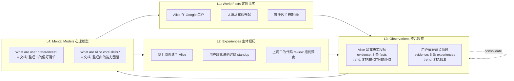
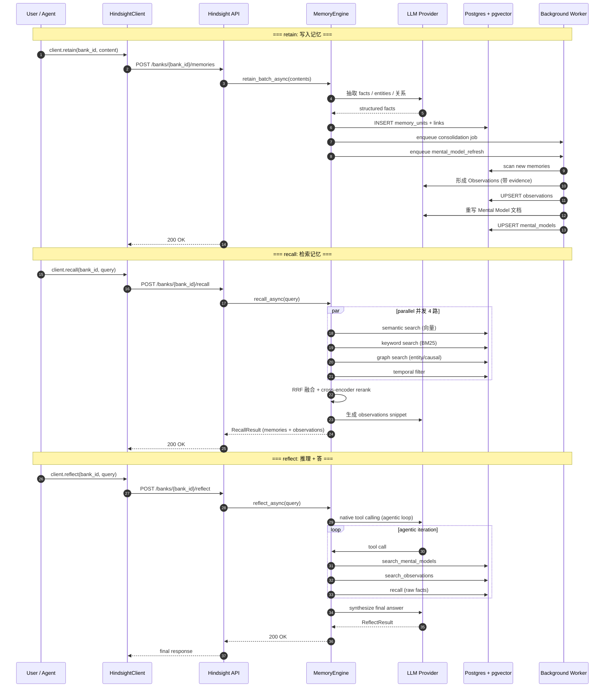
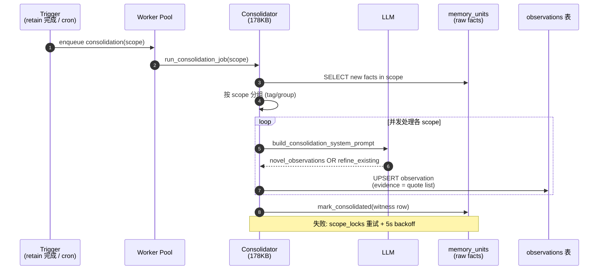
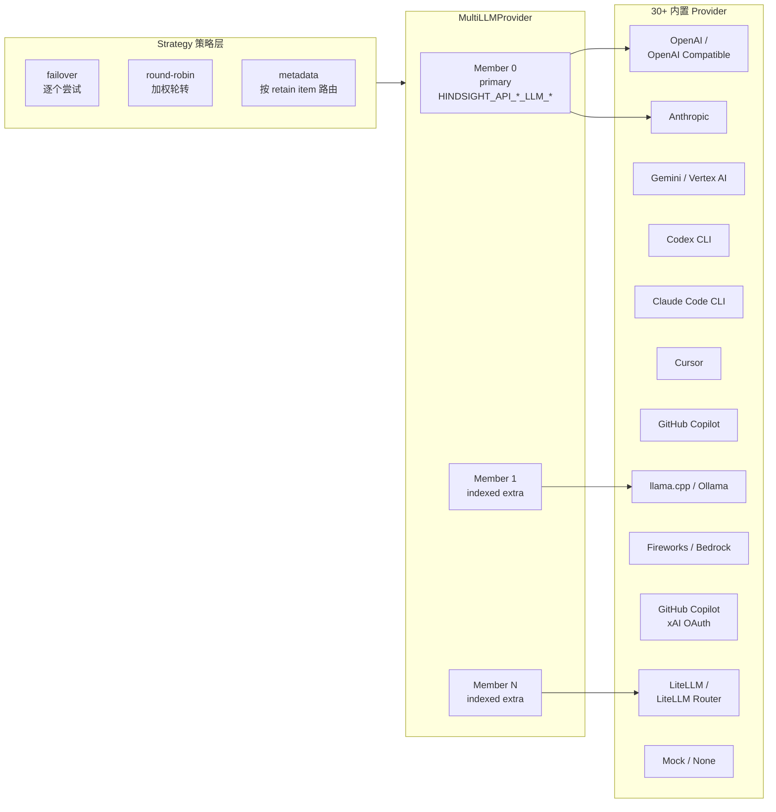

## 引子：从「会检索」到「会学习」的范式跃迁

2024 年以来，Agent 记忆赛道经历了两个明显阶段：

1. **第一阶段（RAG 派）**：把文档切片、向量化、丢进向量库，召回 top-K。这种「相似度检索」的天花板非常明显 —— 你告诉 LLM「Alice 在哪工作」，它能召回「Alice 在 Google 工作」这句话，但 LLM 不知道 Alice 是 senior engineer、不喜欢 standup、上周升了职。
2. **第二阶段（知识图谱派）**：抽实体、抽关系、构图 → 走 Cypher / SPARQL 查询。图能回答「Alice 跟 Bob 是什么关系」，但实体和关系的抽取本身是模糊的，对话历史里 80% 的信息是「上周她抱怨了团队 review 太多」这种情绪/意见/事件流，不是显式三元组。

2025 年 10 月，Vectorize.io 推出了 **Hindsight**，直接换了一个视角：**别再让 Agent 去检索，让它真正学会「学习」**。它的 GitHub 主仓库 12 个月不到冲到 ⭐40,990、被 Virginia Tech Sanghani Center 与 The Washington Post 独立复测 LongMemEval，并在 LongMemEval 上拿到 SOTA；同时它在 Fortune 500 生产环境跑着。

这跟此前所有「Memory for Agent」的项目都不一样 —— 它不是「更聪明的检索」，而是**给 Agent 加一套分层记忆机制**，模仿人脑「事实 / 经验 / 观察 / 心理模型」四层结构，并且后两层会**主动整合**、**主动遗忘**、**重新认识**前两层。

本文从源码、README、设计文档三层切入，全面拆解 Hindsight 的核心架构。

## 项目定位与核心价值

**Hindsight** 是 Vectorize.io 推出的开源 Agent 记忆引擎（MIT，⭐40,990，Python），主打「**让 Agent 学会学习，而不只是记忆**」。它通过生物启发（biomimetic）的四层记忆结构和 retain/recall/reflect 三段操作，把对话/工具调用/事件流压缩为可演化的知识。

**仓库统计**：

| 维度 | 数值 |
|------|------|
| 仓库 | `vectorize-io/hindsight` |
| ⭐ Stars | 40,990 |
| 🍴 Forks | 5,536 |
| 主语言 | Python（核心 engine 1.18 MB 单文件） |
| License | MIT |
| 仓库体积 | 754 MB（包含 benchmark 数据集、docs 资源、Oracle 测试 DB 等） |
| 默认分支 | `main` |
| 最近 Push | 2026-09-29（今日） |
| 创建时间 | 2025-10-30（首日发布） |
| Topics | `agentic-ai`, `agents`, `ai-memory`, `memory` |
| 论文 | [arXiv 2512.12818](https://arxiv.org/abs/2512.12818) |
| 官网 | https://hindsight.vectorize.io |
| LongMemEval | SOTA（独立复测 by Virginia Tech / Washington Post） |
| 集成 | 60+ Agent / 框架 / Coding Agent / 工具 |

**对比已有记忆项目的差异化**：

- 不是 Mem0（Mem0 是 LLM-as-judge 抽事实 → 向量库，扁平结构，不主动整合）
- 不是 Cognee（Cognee 是知识图谱 + RAG 混合，需要手动构建 pipeline）
- 不是 graphiti（graphiti 是时序上下文图，但记忆只增不整合）
- 不是 honcho（honcho 是会话层抽象，不解决 LLM 抽取层）
- 不是 minecontext（minecontext 是「主动推送 Insights」客户端，Hindsight 是服务端）
- **Hindsight 的核心差异：4 层记忆 + consolidate 后台作业 + mental model 重写机制 + Disposition Traits 个性塑造 + Memory Defense 防御层**

## 整体架构：6 层 + 1 个横切关注点

Hindsight 的代码布局非常清晰，可以从 6 层 + 1 横切来理解：

```mermaid
flowchart TB
    subgraph L0[客户端层]
        A1[Python SDK<br/>hindsight-client]
        A2[Node SDK<br/>@vectorize-io/hindsight-client]
        A3[Go SDK]
        A4[CLI<br/>curl | bash]
        A5[LLM Wrapper<br/>hindsight-litellm<br/>2 行接入]
        A6[Coding Agents CLI<br/>claude-code/codex/cursor]
        A7[MCP Client<br/>任何 MCP 客户端]
    end

    subgraph L1[API 网关层 :8888]
        B1[REST API<br/>FastAPI 482KB<br/>100+ 端点]
        B2[MCP Server<br/>每个 bank 一个 MCP 端点]
        B3[Auth 扩展点<br/>TenantExtension]
        B4[Admission<br/>Memory Defense 45 模式]
        B5[Passthrough Headers]
    end

    subgraph L2[业务编排层]
        C1[MemoryEngine<br/>主控 1.18MB<br/>retain/recall/reflect]
        C2[Budget<br/>LOW/MID/HIGH 搜索预算]
        C3[Operation Metadata<br/>异步作业追踪]
        C4[Bank Stats Cache]
        C5[Bank Info Cache]
    end

    subgraph L3[核心引擎层]
        D1[Consolidator<br/>后台作业<br/>Observation 形成]
        D2[Reflect Agent<br/>99KB<br/>agentic loop]
        D3[Query Analyzer<br/>28KB]
        D4[Entity Resolver<br/>84KB]
        D5[Mental Model Refresh<br/>17KB]
        D6[Graph Maintenance<br/>16KB]
        D7[Cross Encoder<br/>rerank]
    end

    subgraph L4[存储抽象层]
        E1[MemoriesExtension<br/>ABC 抽象]
        E2[PostgresMemories<br/>默认实现]
        E3[Oracle Memories<br/>企业部署]
        E4[Bank Transfer API]
    end

    subgraph L5[LLM Provider 层]
        F1[MultiLLMProvider<br/>failover/round-robin/metadata]
        F2[30+ 内置 Provider<br/>OpenAI/Anthropic/Gemini/<br/>Codex/Claude Code/Cursor/<br/>GitHub Copilot/llama.cpp/...]
        F3[LLM Wrapper<br/>统一配置/重试/限流]
        F4[Embeddings]
        F5[Rerankers<br/>jina MLX/local]
    end

    subgraph L6[基础设施层]
        G1[PostgreSQL + pgvector]
        G2[pg0 嵌入式 PG<br/>零依赖]
        G3[Oracle AI Database 23ai]
        G4[Helm Chart<br/>生产部署]
        G5[Prometheus 监控]
    end

    subgraph X[横切：配置 / 观测 / 扩展]
        H1[Config Resolver<br/>env → tenant → bank]
        H2[LLM Trace<br/>token/cost 跟踪]
        H3[Audit<br/>操作审计]
        H4[Webhooks<br/>生命周期事件]
        H5[Extensions Hook<br/>Tenant/Memories/Auth]
    end

    L0 --> L1 --> L2 --> L3 --> L4 --> L5
    L5 --> L6
    X -.-> L2
    X -.-> L3
    X -.-> L5
```

整个仓库 5498 个节点，核心代码量级（节选）：

| 模块 | 体积 | 职责 |
|------|------|------|
| `engine/memory_engine.py` | **1.18 MB** | 主入口，retain/recall/reflect 编排 |
| `api/http.py` | **482 KB** | FastAPI 应用，100+ REST 端点 |
| `consolidation/consolidator.py` | 178 KB | 后台 Observation 形成与维护 |
| `engine/cross_encoder.py` | 102 KB | 检索结果重排序 |
| `engine/reflect/agent.py` | 99 KB | Reflect 的 agentic 循环 |
| `engine/embeddings.py` | 103 KB | 嵌入向量抽象与缓存 |
| `engine/memories/base.py` | 111 KB | 记忆存储扩展抽象 |
| `engine/entity_resolver.py` | 84 KB | 实体消歧与规范化 |
| `engine/providers/openai_compatible_llm.py` | 107 KB | OpenAI 兼容协议 Provider |
| `engine/llm_wrapper.py` | 82 KB | LLM 包装层（重试、限流、追踪） |
| `engine/providers/gemini_llm.py` | 74 KB | Gemini Provider |

整个项目是**单进程 server**（不强制分布式），但通过 `pgvector` 承载亿级记忆，用 BackgroundWorker 异步跑 consolidation / mental model refresh。

## 核心抽象一：4 层记忆结构（生物启发）

Hindsight 最大胆的设计是**模仿人脑记忆分层**。这不是营销话术，源码里 `engine/reflect/observations.py` 和 `consolidation/consolidator.py` 全部围绕这 4 层建模：



每一层的语义边界：

- **L1 World Facts（客观事实）**：关于世界的真值（"太阳从东边升起"），不随交互变化
- **L2 Experiences（主体经历）**：Agent 自己或用户的事件流（"上周用户抱怨 review 太多"）
- **L3 Observations（整合观察）**：跨多个 facts/experiences 整合出的「证据带权重的判断」，例如 "Alice 是高级工程师"，附带 3 条 evidence quote 和 trend 标签（STABLE / STRENGTHENING / WEAKENING / NEW / STALE）
- **L4 Mental Models（心理模型）**：用户定义的「常驻问题 + 常驻答案」，例如 "What are user preferences?" —— 每次 retain 后台重写答案，**读 mental model 是数据库读，不需要 LLM 调用**

这就是为什么 Hindsight 强调「**让 Agent 学习，而不是记住**」—— L3 / L4 是会**演化**的，不是塞进去就完事。

**关键源码**（来自 `hindsight-api-slim/hindsight_api/engine/reflect/observations.py:14`）：

```python
class Trend(str, Enum):
    """Computed trend for an observation based on evidence timestamps.

    Trends indicate how an observation's evidence is distributed over time:
    - STABLE: Evidence spread across time, continues to present
    - STRENGTHENING: More/denser evidence recently than before
    - WEAKENING: Evidence mostly old, sparse recently
    - NEW: All evidence within recent window
    - STALE: No evidence in recent window (may no longer apply)
    """
    STABLE = "stable"
    STRENGTHENING = "strengthening"
    WEAKENING = "weakening"
    NEW = "new"
    STALE = "stale"
```

`Observation` 必须**带 evidence quote** —— 这就是 Hindsight 的「**grouded 原则**」：观察不能凭空产生，必须能从原始记忆里找到原话作为证据。这避免了「LLM 幻觉被记忆固化」的灾难。

```python
class Observation(BaseModel):
    title: str
    content: str
    evidence: list[ObservationEvidence]  # 每条含 memory_id + 原文 quote
    created_at: datetime

    @computed_field
    @property
    def trend(self) -> Trend:
        """Compute trend from evidence timestamps."""
        return compute_trend(self.evidence)
```

注意 `trend` 是 `computed_field` —— 不存到 DB，读取时**根据 evidence 时间戳实时算**，所以不会因为「时间过去 N 天」导致 trend 标签过期。

## 核心抽象二：三段操作（retain / recall / reflect）

Hindsight 把所有能力收敛到 3 个动词，这跟 LangChain 的 20+ 抽象形成鲜明对比：



### retain：把 raw content 变成可检索的 4 层

`retain` 不只是「塞一句话到向量库」，而是用 LLM 抽取 → 规范化 → 索引 → 触发 consolidation 全流程：

```python
# 来自 hindsight-docs/examples/api/retain.py
client.retain(
    bank_id="my-bank",
    content="Alice got promoted to senior engineer",
    context="career update",
    timestamp="2025-06-15T10:00:00Z",
)
```

后台流程（来自 `engine/memory_engine.py:retain_batch_async`）：

1. **LLM 抽取**：调 LLM 抽 fact、entity、temporal、relationship —— 这是 `engine/embeddings.py` 与 `engine/entity_resolver.py` 协作的结果
2. **规范化**：entity resolver 把 "Alice" / "Ms. Alice" / "Alice Smith" 规范成同一实体（`hindsight-api-slim/hindsight_api/engine/entity_resolver.py` 84KB）
3. **写入 `memory_units`**：每条 raw fact 一行，带 `embedding vector(1536)`、`entities[]`、`temporal`、`tags`
4. **入队 consolidation**：把「需要被整合」的标记放进 worker queue（`engine/consolidation/consolidator.py` 178KB）

### recall：4 路并行 + RRF + cross-encoder

Hindsight 的 recall 一次对比 4 种检索策略，然后融合重排序：

```python
# 来自 hindsight-docs/examples/api/recall.py
client.recall(bank_id="my-bank", query="What does Alice do?")
client.recall(bank_id="my-bank", query="What happened in June?")  # temporal
```

4 路并行检索（语义 / BM25 / 图 / 时序）来自 README：

> Recall performs 4 retrieval strategies in parallel:
> - **Semantic**: Vector similarity
> - **Keyword**: BM25 exact matching
> - **Graph**: Entity/temporal/causal links
> - **Temporal**: Time range filtering
>
> The individual results are merged, ordered by relevance using reciprocal rank fusion and a cross-encoder reranking model, then trimmed as needed to fit within the token limit.

这跟 Mem0 的「单路向量召回 + LLM 重排」相比，多了 BM25（图谱式 + 时序式），使得「Alice 在 6 月升职」这种「名字 + 时间 + 事件」查询能命中。

### reflect：agentic loop + 多源 tool calling

reflect 是 Hindsight 最复杂也最像 Agent 的部分。它**不是单次 RAG**，而是一个 agentic loop（来自 `engine/reflect/agent.py`，99KB）：

```python
# 来自 hindsight-docs/examples/api/reflect.py
client.reflect(bank_id="my-bank", query="What should I know about Alice?")
```

`ReflectAgent` 暴露 3 个 tool 给 LLM：

1. `search_mental_models` —— 用户整理的常驻知识（最高质量）
2. `search_observations` —— 整合后的知识，带 freshness
3. `recall` —— raw facts as ground truth

LLM 在这个 loop 里**决定调用哪个 tool、调几次、用什么参数**。这是 Hindsight 跟传统 RAG 最大差异 —— 它把「用 LLM 决定如何记忆」作为一等公民，而不是死板的「先 recall 再答」。

源码（来自 `engine/reflect/agent.py`）：

```python
#: Bounds on any token argument the model supplies to a retrieval tool.
#: Below the floor a tool returns too little; above the ceiling one call can
#: pull in more than the whole reflect context budget and force the slow
#: split-synthesis path.
_TOOL_ARG_MIN_TOKENS = ...
_TOOL_ARG_MAX_TOKENS = ...

@dataclass(frozen=True)
class ReflectToolTokenLimits:
    """Token budgets the agent applies to the retrieval tools it calls."""
    recall_max_tokens: int
    recall_chunk_max_tokens: int
    observations_max_tokens: int
    mental_models_read_max_tokens: int
```

注意每个 tool 都带 **token ceiling** —— 这是防止 LLM「一次拉太多导致 context overflow」的关键工程细节（issue #4239）。每个 tool 调用的 ceiling 是「剩余 context budget / 并发调用数」，永远不会超过 `_TOOL_ARG_MAX_TOKENS`。

## 核心抽象三：Consolidation 后台作业（Observation 形成引擎）

Observation 不是用户写、不是 LLM 单次回答、而是**后台 worker 异步形成**。这是 Hindsight 最精妙的工程：



关键设计（来自 `engine/consolidation/consolidator.py`）：

```python
async def _gather_or_cancel(coros: list[Any]) -> list[Any]:
    """``asyncio.gather`` that leaves no task running behind it.

    Plain ``asyncio.gather`` re-raises the first exception immediately but does
    NOT cancel its siblings — they keep running detached. In consolidation that
    is actively harmful: the failure propagates out of ``run_consolidation_job``
    to the worker, which marks the operation failed and re-queues it with a 5s
    base backoff, while the orphaned tag groups are still calling the LLM,
    stamping ``mark_consolidated`` and committing write-groups. The per-scope
    ``scope_locks`` are local to one dispatch, so nothing serialises an orphan
    against the retry, and the "batches within a group run serially" invariant
    that keeps two consolidators out of the same observation scope is broken
    exactly when it matters.
    """
    tasks = [asyncio.ensure_future(c) for c in coros]
    try:
        return await asyncio.gather(*tasks)
    except BaseException:
        for t in tasks:
            if not t.done():
                t.cancel()
        await asyncio.gather(*tasks, return_exceptions=True)
        raise
```

这一段是 Hindsight 工程严谨性的缩影 —— 它**显式说明**为什么不用 `asyncio.TaskGroup`：因为 worker 的 `_is_non_retryable_task_error` 用 `isinstance` 判断异常，而 TaskGroup 会把异常包成 `ExceptionGroup`，导致 `IntegrityConstraintViolationError` 这种「不可重试」异常被错误分类为「可重试」然后无限循环。

Consolidation 不会盲目加重复而是**refine 已有 observation**（来自 README）：

> Retained facts don't stay a flat pile. In the background, Hindsight consolidates related facts into **observations** — deduplicated beliefs the bank has built up over time. Each observation keeps its supporting evidence with exact quotes and a proof count, and is *refined* rather than overwritten when new evidence arrives, so new information strengthens, weakens or extends an existing belief instead of silently replacing it.

也就是说：**新证据到来时，Observation 是被精化、被赋权，而不是被覆盖**。这跟人类「观点会随证据更新但不会突然翻转」一致。

## 核心抽象四：Mental Model Refresh + Disposition Traits

Mental Model 是 Hindsight 最高层的抽象：**用户定义一个常驻问题，Hindsight 维护一个常驻答案**：

```python
# 来自 README - "What is Hindsight?" 章节
"""
A mental model is a standing answer to a question about a bank ("What are
this user's preferences?"). You define the question once; Hindsight writes
the answer, stores it, and rewrites it in the background as the bank learns
more. Reading one is a database read — no retrieval, no LLM call — so an
agent can boot with a page of settled knowledge instead of rediscovering
it every session.
"""
```

也就是说：mental model 的**读路径是数据库读**，没有 LLM、没有向量检索、没有任何 RAG 开销 —— 直接 `SELECT content FROM mental_models WHERE name = ?`。这是 Hindsight **性能模型的关键**：让 Agent 启动时能拿一页「已沉淀知识」快速进入状态，而不是每次都重做 RAG。

Mental Model 的**写**（来自 `engine/mental_model_refresh.py`）是一段 17KB 的状态机：

```python
RefreshMode = Literal["full", "delta"]
RefreshOutcome = Literal[
    "content_written",
    "content_unchanged",
    "content_preserved_no_new_facts",
    "refresh_failed_empty_candidate",
    "refresh_failed_delta_not_applied",
]

RefreshFailureReason = Literal[
    "empty_candidate",
    "structured_doc_unreadable",
    "delta_ops_failed",
    "delta_ops_all_skipped",
    "delta_not_applied",
    "structured_output_failed",
    "retrieval_failed",
    "no_answer",
    "unexpected_error",
]
```

注意 `RefreshOperationOutcome` 是 `RefreshOutcome` 的**超集**（多 3 个 error 类），并且有显式的 pinned test（`test_operation_outcome_is_a_superset_of_executor_outcome`）保证关系不漂移 —— 这是工程级严谨度的体现。

### Disposition Traits：让同一个 bank 有不同「人格」

每个 bank 可以配置 3 个 trait 来塑造 reflect 时的「人格」：

- **skepticism**（怀疑度）：多疑地审视证据 vs 接受
- **literalism**（字面度）：字面理解 vs 推断
- **empathy**（共情度）：体察情绪 vs 客观中立

这跟 Parlant 的「Guideline 条件-动作规则」思路一致 —— 不是 prompt 工程优化，而是**把「认知风格」做成可配置维度**，让同一个记忆库能服务不同 agent 个性。

## 核心抽象五：Multi-LLM 路由 + 30+ Provider

Hindsight 不是绑死单 LLM，它内置了**30+ LLM Provider**（来自 `engine/providers/`）：



MultiLLMProvider 内部（来自 `engine/multi_llm.py`）：

```python
class MultiLLMProvider:
    """Route LLM calls across multiple members per the configured strategy."""

    def __init__(self, members: list[LLMProvider], strategy: LLMStrategyConfig):
        if not members:
            raise ValueError("MultiLLMProvider requires at least one member")
        self._members = members
        self._strategy = strategy
```

3 种策略：

- **failover**：按声明顺序 `[0..N]` 逐个尝试，第一个成功者胜出
- **round-robin**：加权轮转（nginx SWRR 算法，平滑加权），失败后穿透到剩余 members
- **metadata**：按 retain item 的 metadata 字段挑选 member（如 "用 PII 数据走本地 Llama，非 PII 走 OpenAI"）

源码关键注释：

> Batch retain runs on the **first batch-capable member** in declared order (see ``batch_provider_impl``), which need not be the primary; once selected, the whole batch lifecycle stays on that member and does not fail over. Every other direct ``_provider_impl`` access still resolves to the primary via attribute passthrough — failover/round-robin apply to the interactive ``call`` / ``call_with_tools`` paths.

也就是说：**batch retain 锁死在第一个支持 batch 的 member**，不会中途 failover —— 因为 batch 的 LLM 调用有强一致性要求。这是为了避免「retain 一半在 OpenAI 跑一半在 Anthropic 跑导致 transaction 不一致」。

## 核心抽象六：Memories Extension（存储可替换）

Hindsight 不绑死 Postgres，它定义了**MemoriesExtension ABC**（来自 `engine/memories/base.py`，111KB），把 `memory_units` 和 link tables 抽象出来：

```python
class StoreWriteUnavailable(RuntimeError):
    """The store cannot accept writes for this bank *right now*, but will shortly.

    Distinct from a failure: nothing is wrong, the bank is briefly closed to
    writes — a store migrating a bank between backends holds it for a few
    seconds while it takes the final delta and flips. The caller should retry
    rather than surface an error, which is why the API maps this to 503 with
    a `Retry-After` rather than a 5xx that reads as a bug.
    """
    #: Seconds a caller should wait before retrying.
    retry_after: int = 30


class StoreWriteConflict(RuntimeError):
    """A conditional write lost its race: the state it was based on moved
    before it committed.
    ...
    """
```

注意 Hindsight 自定义了两个**专用异常类型**：

- `StoreWriteUnavailable`：写路径暂时不可用（迁移中），应该**重试**（HTTP 503 + `Retry-After`）
- `StoreWriteConflict`：条件写竞争失败（read-modify-write 期间状态被改），需要**重新读再决策**

这是「CAS 风格」的工程化设计 —— 不是直接 raise generic `Exception`，而是把「可重试 vs 需重决策」**在类型层区分**。这让上游能精确处理，而不会把「迁移冻结」当 bug 报错，也不会把「状态过期」当 503 重试。

目前 2 个官方实现：

- `PostgresMemories`（默认）—— 标准 PG + pgvector
- `Oracle Memories`（企业）—— Oracle AI Database 23ai 全特性对等

Memory Defense（来自 `engine/admission.py`，11KB）则是**写之前**的扫描层，扫 45 种 PII/secret pattern，要么 redact 要么 block。

## MCP Server 原生集成

Hindsight 把 MCP（Model Context Protocol）当成**一等公民**而不是事后兼容：

```python
# 来自 README
"""
Every server ships a built-in Model Context Protocol endpoint, one per bank,
enabled by default:

http://localhost:8888/mcp/{bank_id}/
"""
```

每个 bank 自动暴露一个 MCP endpoint，retain / recall / reflect 作为 tool 直接被 Claude Code / Cursor / Cline / OpenCode / Zed 等 11+ 个 Coding Agent 调用。这是「**agent-native**」架构 —— 用户不用学 SDK，直接用 MCP 协议就能接入。

MCP server 自身（来自 `api/mcp.py`，28KB）也是工程级实现 —— 跟 REST 共享同一套 engine，但通过 MCP 协议暴露 tool。

## 实操：2 行代码接入 LLM

Hindsight 提供了一个「LLM Wrapper」（`hindsight-litellm`），可以**直接包现有 LLM client**：

```python
from openai import OpenAI
from hindsight_litellm import wrap_openai

# Wrap your existing LLM client and you're done.
# Defaults to Hindsight Cloud; pass hindsight_api_url for a self-hosted server.
client = wrap_openai(
    OpenAI(),
    bank_id="user-123",
    hindsight_api_url="http://localhost:8888",
)

# Hindsight recalls relevant memories before the call
# and retains the conversation after it.
response = client.chat.completions.create(
    model="gpt-5-mini",
    messages=[{"role": "user", "content": "What do you know about me?"}],
)
```

**包一次 OpenAI / Anthropic client，每次 LLM 调用前自动 recall 上下文，调用后自动 retain 对话。**

60+ 集成覆盖：Claude Code / Codex / Cursor / GitHub Copilot / opencode / Cline / Aider / Zed / Continue / Roo Code / OpenHands / LangGraph / LangChain / LlamaIndex / CrewAI / Pydantic AI / OpenAI Agents SDK / Google ADK / Agno / Strands / AutoGen / Vercel AI SDK / Haystack / n8n / Zapier / Dify / Flowise / ChatGPT / Perplexity / Obsidian / Pipecat / Vapi。

## Coding Agents 集成：跨 13 个 Coding Agent 的自动记忆

`@vectorize-io/hindsight-coding-agents` 一行命令接入 13 个 CLI Coding Agent：

```bash
npx @vectorize-io/hindsight-coding-agents install all          # 全部接入
npx @vectorize-io/hindsight-coding-agents install claude-code  # 单个接入
```

支持的 Coding Agent：

- Claude Code
- Codex CLI
- Cursor CLI
- GitHub Copilot CLI
- opencode
- Kilo CLI
- Cline CLI
- Antigravity CLI
- Devin CLI
- pi
- Prime Agent
- Grok Build
- DeepSeek Harness

每个 Coding Agent 拿到一个 **per-repo bank**（自动从 git 历史和过去 sessions 构建），并且通过 MCP 注入 knowledge pages。

## 部署形态：从嵌入式到 K8s

```bash
# Docker 一键
docker run -it --pull always --name hindsight --restart unless-stopped \
  -p 8888:8888 -p 9999:9999 \
  -e HINDSIGHT_API_LLM_API_KEY=*** \
  -v hindsight-data:/home/hindsight/.pg0 \
  ghcr.io:vectorize-io/hindsight:latest

# Embedded Python (零依赖 pg0)
pip install hindsight-all -U
python -c "
import os
from hindsight import HindsightServer, HindsightClient
with HindsightServer(llm_provider='openai', llm_model='gpt-5-mini',
                    llm_api_key=os.environ['OPENAI_API_KEY']) as server:
    client = HindsightClient(base_url=server.url)
    client.retain(bank_id='my-bank', content='Alice works at Google')
    print(client.recall(bank_id='my-bank', query='Where does Alice work?'))
"

# Helm
helm install hindsight oci://ghcr.io/vectorize-io/charts/hindsight \
  --set api.llm.provider=openai \
  --set api.llm.apiKey=sk-xxx \
  --set postgresql.enabled=true
```

3 种部署形态：

- **Docker**：内置 pg0 嵌入式 PostgreSQL（生产可用但推荐挂外部 PG）
- **Helm / K8s**：完整企业部署，含 Prometheus、PostgreSQL HA
- **Managed Cloud**：Hindsight Cloud，99.9% SLA，按用量计费

## 与同类项目对比

| 维度 | **Hindsight** | Mem0 | Cognee | graphiti | honcho | minecontext |
|------|---------------|------|--------|----------|--------|----------------|
| ⭐ | 40,990 | 66,241 | 5,500+ | 已写 | 已写 | 已写 |
| 记忆结构 | **4 层（World/Exp/Obs/Model）** | 1 层事实 + 摘要 | 图谱 + 文档 | 时序图 | 会话层 | 7 类 ContextType |
| 后台整合 | ✅ Consolidator worker | ❌ | ❌ | ❌ | ❌ | ❌ Generator |
| Mental Model | ✅ 一等公民 | ❌ | ❌ | ❌ | ❌ | ❌ |
| 读 mental model 性能 | 数据库读（O(1)） | ❌ | ❌ | ❌ | ❌ | ❌ |
| Retrieval 策略 | **4 路并行（语义+BM25+图+时序）** | 1 路向量 | 图 + 向量 | 时序图 | 会话 | 向量 |
| Cross-encoder rerank | ✅ Jina MLX | ❌ | ❌ | ❌ | ❌ | ❌ |
| Disposition Traits | ✅ 3 维人格 | ❌ | ❌ | ❌ | ❌ | ❌ |
| Memory Defense | ✅ 45 模式 PII 扫描 | ❌ | ❌ | ❌ | ❌ | ❌ |
| MCP server 原生 | ✅（每 bank 一条 endpoint） | 需自建 | ❌ | ❌ | ❌ | ❌ |
| LLM Wrapper 2 行接入 | ✅ hindsight-litellm | ✅ mem0ai | ❌ | △ | △ | ❌ |
| 多 LLM 路由 | ✅ failover/round-robin/metadata | △ | ❌ | ❌ | ❌ | ❌ |
| Storage 抽象 | ✅ MemoriesExtension | ❌ | ❌ | ❌ | ❌ | ❌ |
| 嵌入式 PG | ✅ pg0 零依赖 | ❌ | ❌ | ❌ | ❌ | ❌ |
| LongMemEval SOTA | ✅ | ❌ | ❌ | ❌ | ❌ | ❌ |
| Fortune 500 生产 | ✅ | △ | ❌ | ❌ | ❌ | ❌ |
| 学术论文 | ✅ arXiv 2512.12818 | ❌ | ❌ | ❌ | ❌ | ❌ |

**核心设计差异总结**：

1. **记忆模型**：Hindsight 4 层 vs Mem0/Cognee 单层 / 双层 —— 这是「记忆 vs 学习」的本质区别
2. **后台作业**：Hindsight Consolidator worker 是**唯一**做事实整合的，开其他家都没做
3. **检索策略**：Hindsight 4 路并行融合是其他家都没做的，多数是单向量 + LLM 重排
4. **Mental Model 一等公民**：其他家没有「常驻问题 + 常驻答案 + 数据库读」这个抽象
5. **MCP server 原生**：Hindsight 是少有的把 MCP 当一等公民（每 bank 一 endpoint）

## 优缺点分析

| 维度 | 优势 | 代价 |
|------|------|------|
| **架构简洁性** | 4 层记忆 + 3 段操作 + 1 个横切（Defense）+ 1 个 storage 抽象。**新手 30 分钟理解全貌** | Consolidator 内部状态机复杂（17+ 种 RefreshOutcome / RefreshFailureReason 区分），需要 pin 测试保证不漂移 |
| **扩展性** | 30+ LLM Provider + Multi-LLM 路由 + MemoriesExtension + TenantExtension + AuthExtension | 抽象层多 —— 5+ 个 ABC 接口，新人改一个模块需要追 4-5 个文件 |
| **易用性** | LLM Wrapper 2 行接入 + MCP 原生 + 13 个 Coding Agent 一键安装 + 60+ 框架集成 | Python embedded 模式依赖 pg0，C 编译依赖较重（754MB 仓库） |
| **性能** | mental model 读是 DB 读（O(1)），recall 4 路并行 + cross-encoder rerank | Consolidation 后台 worker 持续调 LLM，**空闲时间也会消耗 token**；reflect agentic loop 单次可能 5-10 次 LLM 调用 |
| **复杂度** | 仓储 + 集成 + 评测 + 系统测试 4 大子系统齐全（5498 节点 / 945 Python 文件） | 单进程 server，水平扩展需要外部 PG + 外部 Redis |
| **维护性** | Alembic 200+ migration + 显式 schema 演进 + pinned 测试保证 outcome 超集关系 | 文档量大，行为变更需要同步 README / docs / prompts 三处 |

## 实战场景与适用边界

**强烈推荐**：

- 长期陪伴型 AI 助手（用户画像 / 偏好 / 习惯的持续积累）
- Coding Agent 跨会话的项目记忆（13 个 Coding Agent 自动接入）
- 多用户 SaaS 产品需要隔离记忆（Bank 是天然隔离边界）
- 金融/医疗/法律等需要 PII 防御（Memory Defense 扫描）
- 需要「常驻知识」冷启动（mental model 是 DB 读）
- 异构 LLM 路由（failover / round-robin / metadata 路由）

**不推荐**：

- 单次 RAG 问答（直接用 LangChain / LlamaIndex 即可）
- 极简聊天 UI（私 GPT / LibreChat 更合适）
- 文档知识库查询（不是「memory」场景，更适合 Haystack / RAGFlow）

## 趋势与未来展望

**趋势 1：Agent 记忆从「检索层」升级到「认知层」**

2024 年的 RAG 把记忆做成「向量库 + LLM 重排」，2025 年开始出现「后台整合 + 观察形成」（Hindsight Consolidator、Mem0 的 Add 异步整合），2026 H1 开始出现「Disposition Traits + Mental Model」作为一等公民（Hindsight Disposition、Parlant Guideline、CrewAI Persona）—— **记忆系统正在成为「认知系统」**，不再只是存储系统。

**趋势 2：MCP 协议成为 Agent 后端的事实标准**

Hindsight 把 MCP 当一等公民（每 bank 一个 endpoint，retain/recall/reflect 都是 tool）—— 这种「**Agent-native 设计**」会扩散到所有 Agent 基础设施（agent backbone、SaaS 桥、Knowledge Base）。任何 2026 H2 之后新建的 Agent 系统，原生 MCP 是默认预期。

**趋势 3：Disposition / 人格 / 偏好成为记忆基础设施的一部分**

Hindsight 的 skepticism/literalism/empathy 三维、Parlant 的 Guideline、MineContext 的 7 类 ContextType —— **「persona / disposition / traits** 改造成记忆系统原生 API，区别于「只能抽事实的向量库」。

**趋势 4：生物启发分层记忆成为研究热点**

Hindsight 的 4 层结构（World/Experience/Observation/Mental Model）跟神经科学的「陈述性记忆 vs 程序性记忆 vs 工作记忆」高度对应 —— 这种**仿生学+工程化**的融合是 2026 H2 的研究热点。

## 总结

Hindsight 不是又一个「把东西塞进向量库」的记忆项目，而是**给 Agent 加了一套会演化的认知层**：

- **4 层记忆结构**（World / Experience / Observation / Mental Model）对应神经科学分层
- **3 段操作**（retain / recall / reflect）覆盖写入 / 检索 / 推理
- **后台 Consolidator** 持续形成 Observation 而非「一次性塞入」
- **Mental Model** 一等公民让 Agent 冷启动能拿「已沉淀知识」
- **4 路并行检索**（语义 / BM25 / 图 / 时序）覆盖多种查询
- **30+ LLM Provider + Multi-LLM 路由**（failover / round-robin / metadata）
- **MemoriesExtension** 抽象让 Postgres / Oracle / 自定义存储可替换
- **MCP server 原生**让 13 个 Coding Agent 一键接入
- **LongMemEval SOTA** 被 Virginia Tech 独立复测
- **Memory Defense** 45 种 PII / secret 扫描作为默认安全层
- **Disposition Traits** 3 维人格让同一个 bank 服务不同 agent

工程上的亮点：

- `StoreWriteUnavailable` / `StoreWriteConflict` 两个专用异常把「可重试 vs 需重决策」在类型层区分
- `RefreshOperationOutcome` 是 `RefreshOutcome` 的超集，**显式 pinned test 保证不漂移**
- `_gather_or_cancel` 自定义 helper，**显式注释**为什么不用 `asyncio.TaskGroup`（防 ExceptionGroup 包装导致错误分类）
- MultiLLMProvider 的 batch retain 锁死第一个 batch-capable member，**显式注释**为什么（transaction 一致性）
- Observation 的 evidence quote 是**必填**而非可选，从源头防止 LLM 幻觉固化

如果你的 Agent 需要「跨会话学习」而不是「跨会话检索」，Hindsight 是目前 GitHub 上唯一一个把这件事做到「工程级 + 学术级 + 商业级」三件齐全的项目。

## 附录：关键资源

- **GitHub**：https://github.com/vectorize-io/hindsight
- **官网**：https://hindsight.vectorize.io
- **论文**：https://arxiv.org/abs/2512.12818
- **Benchmark**：https://benchmarks.hindsight.vectorize.io/
- **集成列表**：https://hindsight.vectorize.io/integrations
- **PyPI (server)**：`pip install hindsight-api`
- **PyPI (client)**：`pip install hindsight-client`
- **NPM (client)**：`npm install @vectorize-io/hindsight-client`
- **Go (client)**：`go get github.com/vectorize-io/hindsight/hindsight-clients/go`
- **CLI**：`curl -fsSL https://hindsight.vectorize.io/get-cli | bash`
- **Helm**：`oci://ghcr.io/vectorize-io/charts/hindsight`
- **License**：MIT
- **LLM Wrapper**：`pip install hindsight-litellm`
- **Coding Agents CLI**：`npm install @vectorize-io/hindsight-coding-agents`
- **核心源码入口**：`hindsight-api-slim/hindsight_api/engine/memory_engine.py`（1.18MB 主控）
- **Consolidator**：`hindsight-api-slim/hindsight_api/engine/consolidation/consolidator.py`（178KB 后台作业）
- **Reflect Agent**：`hindsight-api-slim/hindsight_api/engine/reflect/agent.py`（99KB agentic loop）
- **MCP Server**：`hindsight-api-slim/hindsight_api/api/mcp.py`（28KB）