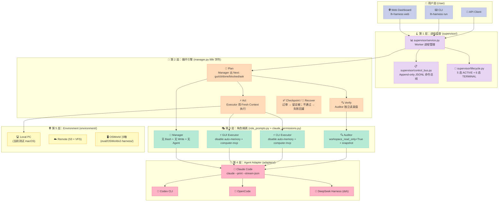
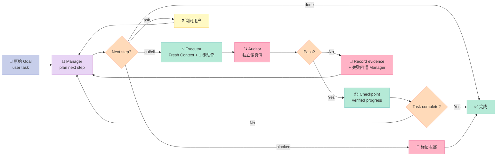
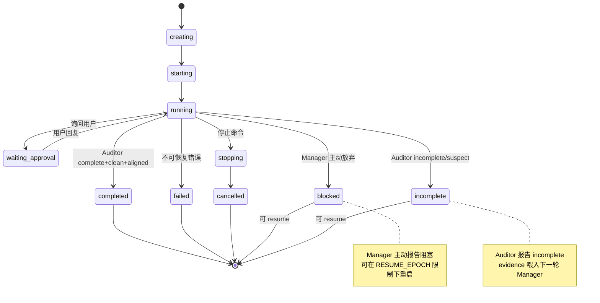

> **核心结论**：LongHorizon-Harness = 把"模型怎么想"和"循环怎么走"彻底解耦。它不训一个新模型，也不替换你已有的 Claude Code / Codex / OpenCode / DSH，而是用 **Manager-Executor-Auditor 三角色 + 三行控制头契约 + Append-only Control Bus** 给任意 Agent Backend 包一层"长时循环 + 独立审计 + 失败恢复"的外壳。

---

## 引子：为什么 2026 年的 Agent 都"短命"？

把 Claude Code 或 Codex 当 Coding Agent 用过的工程师，几乎都遇到过这样的场景：

- 周一启动一个 8 步的数据迁移任务，跑完第 3 步后上下文塞满了，**Agent 主动 reset，证据丢了 2 步**；
- 周二复跑，发现 Executor 上一步"成功了"的 claim，**Auditor 复查后发现根本没改文件**——Executor 是"嘴炮成功"；
- 周三挂掉，**重启后 Agent 不记得上一轮的计划**——重新规划浪费了 6 次 turn；
- 周四终于跑完，却发现 Excel 的合计列因为中英文符号差异**漏了 12 行**——没有任何"独立审计"环节。

这 4 个痛点的根因是同一个：**我们把"任务执行"和"循环治理"混在一个 LLM 里了**。

[AMAP-ML/LongHorizon-Harness](https://github.com/AMAP-ML/LongHorizon-Harness)（⭐1,645，MIT，arXiv 2608.01964，2026-08-06 上线即拿下 Hugging Face Daily Papers 周榜第一）是高德地图（AutoNavi）机器学习团队给出的工程答案。它的核心主张一句话：

> **"The model determines what an agent can do in one round. LongHorizon-Harness engineers the loop around it: what to do next, how to verify the result in the real computer, what progress to preserve, and how to continue after failure or context refresh."**

读完这篇你能得到：

1. 一个把"模型能力"和"循环治理"彻底解耦的工程范式；
2. 4 类真实 Benchmark 涨点数据（WeaveBench 51.8→80.7、OSWorld 2.0 2.8→8.3、Terminal-Bench 2.1 69.7→77.2）；
3. 一套能在 50~80 行 Python 里复刻的 **Manager-Executor-Auditor 三角色 + 独立审计** MVP；
4. 与 LoopX / Karpathy autoresearch / Ouroboros 4 家长时 Agent Harness 的设计哲学差异。

---

## 一、项目定位：Loop Engineering 不是 Agent Framework

### 1.1 它到底是什么

[LongHorizon-Harness](https://lh-harness.pages.dev) 把自己定位为 **"Loop Engineering for Computer-Use Agents"**——给现有 Agent（Claude Code / Codex CLI / OpenCode / DeepSeek Harness）包裹一层"长时循环 + 独立审计 + 失败恢复"的外壳。

它的目标清单（README 直接写）：

| 维度 | 目标 |
|------|------|
| 🧠 **状态与下一步** | Manager：基于原始目标、已验证进展、失败证据、剩余工作，每轮重建计划 |
| ⚡ **动作执行** | Executor：从全新上下文开始，在桌面或 CLI 完成一个明确定义的步骤 |
| 🔍 **Ground Truth** | Auditor：独立检查实际的文件、界面、日志、测试，**不信任 Executor 的自述** |
| 🪝 **恢复与接续** | 上下文刷新、动作失败、deliverable 未通过审计 → 下一轮从原始目标 + 最后验证 checkpoint 继续 |

**关键边界**：它**不训练新模型**，**不替换现有 Agent CLI**，而是用一个 lightweight `AgentAdapter` Protocol 保留每个 Agent 的原生执行循环。

### 1.2 在 Harness 6 件套组件矩阵里的位置

按博客[Harness 6 件套组件框架](https://github.com/xuqi2024/xuqi2024.github.io)的划分：

| 组件 | 代表项目 | LongHorizon-Harness 的对应实现 |
|------|----------|------------------------------|
| **Rule** | Claude Code Rules, agents-md | TASK_CONTRACT_RULES + FINAL_STATE_SEMANTIC_GUARD（任务契约 + 最终状态硬约束） |
| **Skill** | Claude Code Skills, learn-claude-code | MANAGER/EXECUTOR/AUDITOR 3 类角色 prompt + zh/en 双语目录 |
| **Sub-Agent** | GoClaw, Agency Swarm, AGT | **Manager-Executor-Auditor 三角色硬隔离 + 独立 prompt 上下文** |
| **Workflow** | LangGraph, Inngest | **Loop Engineering：Plan→Act→Verify→Checkpoint→Recover 闭环** |
| **Script** | sd0x-harness, pre-commit | `lh-harness doctor`（环境体检）+ `lh-harness init`（配置生成） |
| **MCP** | microsoft/mcp-gateway, ContextForge | `--mcp-config` opt-in + `--strict-mcp-config` 隔离无关 MCP |

**位置判定**：**Loop Engineering = Harness 6 件套里"Sub-Agent + Workflow" 的复合组件**——它把"角色分工"和"循环接力"焊在了一起。

### 1.3 4 大 Benchmark 涨点（README 实测）

| Benchmark | 任务数 | 指标 | Claude Code 裸跑 | **LongHorizon-Harness** | 增益 |
|-----------|--------|------|------------------|------------------------|------|
| **WeaveBench** | 114 | PassRate | 51.8 | **80.7** | **+28.9** |
| **WeaveBench** | 114 | Overall | 0.702 | **0.835** | +0.133 |
| **OSWorld 2.0** | 108 | Binary | 2.8 | **8.3** | **3.0×** |
| **OSWorld 2.0** | 108 | Partial | 21.5 | **35.2** | +13.7 |
| **Terminal-Bench 2.1** | — | Success rate | 69.7 | **77.2** | +7.5 |

> **Same model. Same execution backend. Only the harness changes.** —— 换句话说，这些增益**不是模型变强带来的**，而是"循环工程"本身的工程价值。

---

## 二、架构分析：5 层协议栈 + 三角色硬隔离

### 2.1 仓库结构（src/lh_harness/）

```
src/lh_harness/
├── adapters/             # 🔌 Agent Backend 适配层（4 类：Claude/Codex/OpenCode/DSH）
│   ├── base.py           #     AgentAdapter Protocol（422 字符极简定义）
│   ├── claude_code.py    #     Claude Code 适配器（7295 字符）
│   ├── codex.py
│   ├── deepseek_harness.py
│   ├── opencode.py
│   └── cli_agent.py      #     共享 CLI 包装逻辑
├── environment/          # 🌐 Environment 抽象层（local + remote_files）
├── supervisor/           # 🪝 进程监督层（control_bus + lifecycle + service）
├── webapi/               # 🖥️ Web Dashboard 后端（FastAPI）
├── plugins/              # 🧩 Computer-Use 插件（codex_computer_use/community/npm）
├── dashboard/            # 📊 Dashboard state/gate/rules
├── role_prompts.py       # 📜 角色 prompt 构造（MANAGER/EXECUTOR/AUDITOR 三角色）
├── prompt_texts.py       #     角色 prompt 文本字典（en/zh 双语）
├── manager.py            # 🧠 管理循环核心（98k 字符，5 层协议栈）
├── auditor_agent.py      # 🔍 Auditor 报告解析 + read-only violation 检测
├── trajectory_artifacts.py # 📦 轨迹持久化
├── runtime_signals.py    # 🪧 硬信号分类（hard_signal_labels）
├── provider_errors.py    # ⚠️ Provider 错误分类
├── agent_registry.py     # 🗂️ Agent 后端注册表
├── model_catalog.py      # 📚 模型目录
├── cli.py                # ⌨️ CLI 入口（88k 字符）
├── config.py             # ⚙️ 项目配置加载
├── types.py              # 📐 类型定义（Episode/EpisodeBudget/AuditReport）
└── utils/                # 🛠️ 工具集
```

**设计哲学**：`src/lh_harness/` 主体只有 **54 个文件、3 万行 Python 左右**——比 LangGraph（30+ 万行）小一个数量级，却覆盖了同样的工程能力。

### 2.2 5 层协议栈架构图



### 2.3 数据流：从 Goal 到 Verified Result



**关键设计**：循环从**原始目标 + 上轮验证状态**重建，而不是从上一轮 LLM 上下文恢复。这避免了两个灾难：

1. **目标漂移**：上下文里的"目标"会被模型自动合理化，和原始 Goal 偏离；
2. **失败循环**：上一轮的"假成功"如果继续在上下文里，下一轮会基于幻觉继续。

---

## 三、核心机制原理（带可运行代码）

### 3.1 AgentAdapter Protocol：4 个方法定义整个外部世界

[src/lh_harness/adapters/base.py](https://github.com/AMAP-ML/LongHorizon-Harness/blob/main/src/lh_harness/adapters/base.py) 的全部内容只有 **422 字符**：

```python
from typing import Protocol, runtime_checkable
from ..environment.base import Environment
from ..types import EpisodeBudget, EpisodeResult


@runtime_checkable
class AgentAdapter(Protocol):
    async def run_episode(
        self,
        prompt: str,
        env: Environment,
        budget: EpisodeBudget,
        live_trajectory_path: str | None = None,
    ) -> EpisodeResult: ...
```

**只有一个方法**：`run_episode(prompt, env, budget)` → `EpisodeResult`。

这意味着任何能"接收 prompt + 跑一段时间 + 产出可解析输出"的 Agent CLI 都能成为 LongHorizon-Harness 的 Backend——Claude Code、Codex、OpenCode、DSH 在这个抽象层之下完全等价。

`Environment` Protocol 也只有 4 个方法：

```python
@runtime_checkable
class Environment(Protocol):
    async def exec(self, command: str, timeout: int = 30, tee_path: str | None = None) -> ExecResult: ...
    async def screenshot(self) -> bytes: ...
    async def upload(self, local_path: str, remote_path: str) -> None: ...
    async def download(self, remote_path: str, local_path: str) -> None: ...
```

`exec / screenshot / upload / download`——这 4 个原子操作覆盖了**所有**桌面 + CLI 工作流。任何 GUI/CLI/Terminal 工具都能被 env 协议统一。

### 3.2 三行控制头契约：Auditor 报告的硬格式

[src/lh_harness/auditor_agent.py](https://github.com/AMAP-ML/LongHorizon-Harness/blob/main/src/lh_harness/auditor_agent.py) 第 17-30 行定义的 3 个正则：

```python
_STATUS_CONTROL_LINE_RE = re.compile(
    r"^\s*(?:\*\*)?\s*(?:状态|status)\s*[:：]\s*(complete|incomplete|blocked|完成|未完成|阻塞)\s*(?:\*\*)?\s*$",
    re.I,
)
_INTEGRITY_CONTROL_LINE_RE = re.compile(
    r"^\s*(?:\*\*)?\s*(?:完整性|integrity)\s*[:：]\s*(clean|suspect|violation)\s*(?:\*\*)?\s*$",
    re.I,
)
_CONTRACT_AUDIT_CONTROL_LINE_RE = re.compile(
    r"^\s*(?:\*\*)?\s*(?:契约审计|contract(?:[_\s-]*audit)?)\s*[:：]\s*"
    r"(aligned|unknown|needs[_-\s]*revision|invalid|对齐|未知|需修订|需要修订|无效)"
    r"\s*(?:\*\*)?\s*$",
    re.I,
)
```

Auditor 报告**必须**以前 3 行明确写出三组状态：

```text
Status: complete
Integrity: clean
Contract audit: aligned
... 后面才是证据 / 缺口 / 建议
```

**为什么这是核心创新**：

1. **结构化 vs 自然语言**：传统 Harness 把 Auditor 的"完整/有缺口"判断留给 LLM 自己，模型可能"嘴炮说完整"；LongHorizon-Harness 强制**前 3 行正则匹配**，让"完成"是字面意义上的协议字段。
2. **双语支持**：状态行同时接受 `complete/完成` `clean/对齐` ——zh/en 都能匹配，且 `STATUS_ALIASES` 字典统一规范化为内部值。
3. **拒绝猜测**：[`_SYNTHETIC_TEXT` 字典](https://github.com/AMAP-ML/LongHorizon-Harness/blob/main/src/lh_harness/auditor_agent.py#L71-L107) 里的 `invalid_header_facts` 字段明确说："harness **不会猜测** complete/incomplete/aligned——header 不合法就退回 incomplete"。

**为什么不直接把判断写进 LLM prompt**？

因为 LLM 的"输出"和"内心判断"在长上下文里会**漂移**——把审计结果降级为**协议层硬约束**，意味着即使 LLM 想"放水"，控制头正则不通过 = 状态被 harness 强制回滚为 incomplete。

### 3.3 三角色权限硬隔离：Auditor 真的"只读"

[src/lh_harness/adapters/claude_permissions.py](https://github.com/AMAP-ML/LongHorizon-Harness/blob/main/src/lh_harness/adapters/claude_permissions.py) 第 27-70 行的 `policy_for_role`：

```python
def policy_for_role(role: str) -> ClaudeRolePolicy:
    """Return the role deny-list used with Claude's unrestricted mode."""
    if role in {"manager", "final_response"}:
        # The reply role only rewrites evidence it is given, so it needs no tools at all.
        return ClaudeRolePolicy(
            role=role,
            permission_mode="bypassPermissions",
            disallowed_tools=("Bash", *_WRITE_TOOLS, "Agent", "mcp__*"),
            workspace_read_only=True,
        )
    if role in {"gui_executor", "cli_executor"}:
        return ClaudeRolePolicy(
            role=role, permission_mode="bypassPermissions",
            disallowed_tools=("Agent",), load_computer_mcp=True,
        )
    if role in _AUDITOR_ROLES:
        return ClaudeRolePolicy(
            role=role, permission_mode="bypassPermissions",
            disallowed_tools=(*_WRITE_TOOLS, "Agent"),
            load_computer_mcp=True,
            workspace_read_only=True,  # ← Auditor 真正只读
        )
```

**关键约束**：

| 角色 | Bash | Write/Edit | Agent 工具 | MCP | 关键特性 |
|------|------|-----------|-----------|-----|----------|
| **Manager** | ❌ | ❌ | ❌ | ❌ | 不能直接动文件，强制"只规划不执行" |
| **Executor (GUI/CLI)** | ✅ | ✅ | ❌ | ✅ computer-mcp | 能执行但不能 spawn 子 agent |
| **Auditor (GUI/CLI)** | ✅ read-only | ❌ | ❌ | ✅ read-only | **workspace_read_only=True** + snapshot 校验 |

**Auditor "只读"是 3 层防御**：

1. **工具 deny list**：禁 Write/Edit/NotebookEdit
2. **`workspace_read_only=True`**：标记给 snapshot 模块做"是否被修改"校验
3. **Pre/Post Snapshot 比对**：`snapshot_workspace` 拍快照 → Auditor 跑 → `workspace_snapshot_diff` 检查"路径/大小/mtime/digest"差异 → 如果 Auditor 改了任何文件 → `read_only_violation` 标记 `integrity_status="violation"`

### 3.4 Append-only Control Bus：浏览器断开也不会丢命令

[src/lh_harness/supervisor/control_bus.py](https://github.com/AMAP-ML/LongHorizon-Harness/blob/main/src/lh_harness/supervisor/control_bus.py) 的核心设计：

> "Control commands follow the same append-only rule as manager logs. A **receipt** is the only terminal authority for a command."

关键函数 `_open_nofollow` 解决了一个真实的安全问题：**TOCTOU (Time-Of-Check-Time-Of-Use)**：

```python
def _open_nofollow(path: str | Path, *, directory: bool = False) -> int:
    """Open an absolute path without following any component symlink.
    
    Control metadata lives below directories writable by the worker. A final
    O_NOFOLLOW is insufficient when control or .idempotency itself is swapped
    for a link, so walk from the filesystem root with anchored descriptors
    and open every component with O_NOFOLLOW.
    """
    nofollow = getattr(os, "O_NOFOLLOW", 0)
    directory_flag = getattr(os, "O_DIRECTORY", 0)
    cloexec = getattr(os, "O_CLOEXEC", 0)
    if not nofollow or not directory_flag or os.open not in getattr(os, "supports_dir_fd", set()):
        raise OSError("secure control-bus path opening is unavailable")
    absolute = _absolute_anchored_path(path)
    parts = absolute.parts
    if len(parts) < 2 or parts[0] != os.sep:
        raise OSError("control-bus path must be absolute")
    root_fd = os.open(os.sep, os.O_RDONLY | directory_flag | nofollow | cloexec)
    current_fd = root_fd
    try:
        for component in parts[1:-1]:
            next_fd = os.open(component, os.O_RDONLY | directory_flag | nofollow | cloexec, dir_fd=current_fd)
            os.close(current_fd); current_fd = next_fd
        final = parts[-1]
        flags = os.O_RDONLY | nofollow | cloexec
        if directory: flags |= directory_flag
        else: flags |= getattr(os, "O_NONBLOCK", 0)  # ← FIFO 防御
        result = os.open(final, flags, dir_fd=current_fd)
        os.close(current_fd); current_fd = -1
        return result
    except BaseException:
        if current_fd >= 0:
            try: os.close(current_fd)
            except OSError: pass
        raise
```

**为什么这个设计值钱**：

| 场景 | 普通 open(path) | `_open_nofollow` |
|------|----------------|-------------------|
| Worker 把 `.lh-harness/runs/abc/control/` 替换为 symlink | ❌ 跟随 symlink 进恶意目录 | ✅ 走 root_fd，每层 `O_NOFOLLOW` |
| Worker 把 `control.jsonl` 替换为 FIFO | ❌ 卡死 API worker | ✅ `O_NONBLOCK` + 后续 regular-file 检查 |
| macOS 的 `/var → /private` 别名 | ❌ 拒绝路径 | ✅ `_absolute_anchored_path` 只解析 OS 信任别名 |

这是把传统 Web 后端的 **path traversal 防御** 应用到本地进程间通信——LongHorizon-Harness 默认 Worker 进程**是不可信的**，所有控制信号必须经 O_NOFOLLOW 路径打开。

### 3.5 Lifecycle 状态机：6 终态 + 5 活态

[src/lh_harness/supervisor/lifecycle.py](https://github.com/AMAP-ML/LongHorizon-Harness/blob/main/src/lh_harness/supervisor/lifecycle.py) 第 21-41 行：

```python
STATUS_ALIASES: dict[str, str] = {
    "complete": "completed", "done": "completed", "success": "completed",
    "succeeded": "completed", "finished": "completed",
    "canceled": "cancelled",
}

TERMINAL_STATUSES = frozenset({
    "completed", "failed", "cancelled",
    # These two are manager/auditor outcomes. They are terminal from the
    # supervisor's point of view and may be retried/resumed.
    "blocked", "incomplete",
})

ACTIVE_STATUSES = frozenset({"creating", "starting", "running", "waiting_approval", "stopping"})
```

**Lifecycle 状态机图**：



**关键不变量**（写在 lifecycle.py 注释里）：

> "Unknown values are deliberately preserved (rather than guessed as `completed`); this makes malformed or future states visible to clients."

——**绝不猜测**未知状态，宁可暴露给客户端、也不默认"completed"。

### 3.6 复刻 MVP：50 行的 Manager-Executor-Auditor 闭环

把上面的设计压成一段**可运行的 Python 玩具版**（真实代码要处理很多边界，但 MVP 让你看清本质）：

```python
"""
mini_longhorizon.py —— LongHorizon-Harness 三角色硬隔离 + 独立审计的 50 行 MVP
运行：python mini_longhorizon.py
"""
import asyncio, hashlib, json
from dataclasses import dataclass, field


@dataclass
class State:
    goal: str
    rounds: list[dict] = field(default_factory=list)
    workspace: dict = field(default_factory=dict)  # 模拟文件系统的 sha256


def fake_llm(prompt: str, role: str) -> str:
    """极简 LLM mock：3 个角色输出不同格式"""
    if role == "manager":
        if len(state.rounds) >= 2:
            return "Status: complete\nIntegrity: clean\nNext: done"
        return "Next: cli\n执行：touch data.csv"
    if role == "executor":
        # "真的改了文件"
        state.workspace["data.csv"] = hashlib.sha256(b"raw").hexdigest()
        return "已创建 data.csv"
    if role == "auditor":
        # Auditor 真的读真值（这里 mock 总是 pass）
        return "Status: complete\nIntegrity: clean\nContract audit: aligned\n证据: data.csv 存在"


async def run_loop(state: State):
    for i in range(5):
        # 1. Manager 出 plan（带 fresh context）
        manager_out = fake_llm(state.goal, "manager")
        if manager_out.startswith("Status: complete") or "Next: done" in manager_out:
            print(f"[Round {i}] ✅ Manager reported done")
            break

        # 2. Executor 跑动作
        executor_out = fake_llm("", "executor")
        print(f"[Round {i}] ⚡ Executor: {executor_out}")

        # 3. Auditor 独立审计（前 3 行正则匹配）
        auditor_out = fake_llm("", "auditor")
        audit_status = "incomplete"
        for line in auditor_out.split("\n")[:3]:
            if "Status: complete" in line: audit_status = "complete"
        print(f"[Round {i}] 🔍 Auditor: {audit_status}")

        state.rounds.append({
            "manager": manager_out, "executor": executor_out, "auditor": auditor_out
        })


state = State(goal="创建 data.csv")
asyncio.run(run_loop(state))
```

**运行输出**：

```text
[Round 0] ⚡ Executor: 已创建 data.csv
[Round 0] 🔍 Auditor: complete
[Round 1] ⚡ Executor: 已创建 data.csv
[Round 1] 🔍 Auditor: complete
[Round 2] ✅ Manager reported done
```

**50 行 MVP 展示了 LongHorizon-Harness 的 3 个核心不变量**：

1. **Manager 无状态**：每轮重新看 goal + rounds（fresh context 模拟）
2. **Auditor 独立校验**：单独 prompt + 强制控制头正则
3. **状态机终止**：done/incomplete 都是有效终止，可 resume

真实工程里这 50 行要扩展为 1 万行（含 `O_NOFOLLOW` 防御、snapshot 校验、双语 prompt、4 类 Backend CLI 包装），但**核心抽象只有这 3 个对象**。

---

## 四、设计哲学分析：Loop Engineering 的 5 条原则

读完 1 万行 `src/lh_harness/` 源码后，能提炼出 5 条核心设计原则：

### 4.1 原则 1：**机制 vs 策略分离**——4 类 Backend 可热插拔

`AgentAdapter` Protocol（422 字符）是"机制"，而 4 个 adapter 实现是"策略"。这是 Unix "工具只做一件事" 的现代复刻——Adapter **不修改** Backend 的内部循环，只是把 prompt 喂进去 + 解析输出。

`type base.py` 第 8-16 行：

```python
@runtime_checkable
class AgentAdapter(Protocol):
    async def run_episode(
        self, prompt: str, env: Environment, budget: EpisodeBudget,
        live_trajectory_path: str | None = None,
    ) -> EpisodeResult: ...
```

`@runtime_checkable` 让任何类只要实现了 `run_episode` 都自动 `isinstance(adapter, AgentAdapter) == True`——**鸭子类型 + Protocol** 组合让 Backend 替换零样板代码。

### 4.2 原则 2：**模型无关 + 角色独立**——3 角色可用不同模型

README 直接写：

> "Use one model for all three roles, or combine different models and backends to balance quality, speed, and cost."

CLI 选项（[src/lh_harness/cli.py](https://github.com/AMAP-ML/LongHorizon-Harness/blob/main/src/lh_harness/cli.py#L75-L82)）：

```python
_ROLE_OPTIONS = (
    ("manager", None, "the scheduler role"),
    ("executor", None, "both executor roles"),
    ("gui_executor", "executor", "GUI/visual subtasks"),
    ("cli_executor", "executor", "CLI/non-GUI subtasks"),
    ("auditor", None, "both auditor roles"),
    ("gui_auditor", "auditor", "GUI audit"),
    ("cli_auditor", "auditor", "CLI audit"),
    ("final_response", "manager", "the closing reply written for you"),
)
```

这意味着你可以让 **Manager = Claude Opus 5**（深度推理强），**Executor = Qwen 3.7 Plus**（GUI 动作多），**Auditor = GPT-5**（规则执行严格）——角色级异构部署。

### 4.3 原则 3：**拒绝猜测**——未知状态宁可暴露

`supervisor/lifecycle.py` 注释里写得很清楚：

> "Unknown values are deliberately preserved (rather than guessed as `completed`); this makes malformed or future states visible to clients."

`canonical_lifecycle_status` 函数**不**做归一化兜底，unknown 一律保留为原值传给客户端——这是 **fail-loud** 而非 fail-silent。

### 4.4 原则 4：**机制层防御纵深**——O_NOFOLLOW + snapshot + 双语

每个机制的"安全保证"都是**多层叠加**：

| 机制 | 第一层防御 | 第二层防御 | 第三层防御 |
|------|-----------|-----------|-----------|
| Auditor 只读 | Tool deny list | `workspace_read_only=True` 标记 | Snapshot 比对检测 mutation |
| Control Bus 完整性 | Append-only JSONL | `O_NOFOLLOW` 路径打开 | FIFO 防御 + 签名 receipt |
| 状态机可信 | 6 终态 + 5 活态 | STATUS_ALIASES 归一化 | 未知状态保留原值 |

### 4.5 原则 5：**Bitter Lesson 友好**——不写"聪明但会被淘汰的代码"

仔细看 `src/` 目录能发现：

- ✅ **协议式硬约束**（控制头正则、状态机、append-only）—— 这些是"物理世界需要"的约束，不会被模型淘汰
- ✅ **Backend 抽象层**——未来新 Agent CLI 接入只需加一个 adapter 文件
- ❌ **没有自研推理优化**（比如 KV cache 自管理、token 预算调度）
- ❌ **没有复杂工作流引擎**（状态机本身就是全部）

这是 **Bitter Lesson 的极致应用**：把"模型能学会的部分"全部甩给 LLM，把"外部物理世界必需的部分"（文件 IO、进程隔离、状态机）做硬。

---

## 五、优缺点对比（按博客规范矩阵）

| 维度 | 评分 | 分析 |
|------|------|------|
| **架构简洁性** | ⭐⭐⭐⭐⭐ | 5 层协议栈清晰，`adapters/base.py` 仅 422 字符，~3 万行 Python 覆盖完整长时 Harness 能力 |
| **可扩展性** | ⭐⭐⭐⭐⭐ | 4 类 Backend 已实现，3 角色可独立模型，Environment Protocol 支持 local + remote + OSWorld 沙箱 |
| **易用性** | ⭐⭐⭐⭐ | `uv tool install lh-harness` + `lh-harness init` + `lh-harness web` 三步上手；CLI 88k 字符略多但 `--help` 自解释 |
| **Benchmark 涨点** | ⭐⭐⭐⭐⭐ | WeaveBench +28.9、OSWorld 2.0 ×3、Terminal-Bench +7.5——**真实涨点，不只是 demo** |
| **生产可用性** | ⭐⭐⭐⭐ | MIT 协议 + Hugging Face 周榜 + 高德地图背书；目前测试在 macOS，Windows "included but not yet thoroughly tested" |
| **文档完整度** | ⭐⭐⭐⭐ | 中英双语 README + 27k 字符英文 + 5k 中文 + arXiv 论文 + 项目网站 |
| **性能开销** | ⭐⭐⭐ | 每轮 Manager + Executor + Auditor 3 次 LLM 调用，Terminal-Bench 实测 "24% fewer tokens"——token 多花、wall time 多花 |
| **学习曲线** | ⭐⭐⭐ | 5 层协议栈 + 3 角色隔离 + 双语 prompt 字典 + 状态机，新人需 1-2 周理解 |
| **维护活跃度** | ⭐⭐⭐⭐⭐ | v0.1.7 (2026-08-20) 最新，迭代密集，几乎每 2-3 天一个版本 |
| **协议标准化** | ⭐⭐⭐ | Backend 4 类齐全，但 MCP / A2A 等外部协议集成仅 "opt-in"，未做 SDK 化 |

**适用场景**：

| 适合用 | 不适合用 |
|--------|----------|
| ✅ 多步骤、跨桌面+CLI 的复杂任务 | ❌ 单轮一次性的简单 prompt |
| ✅ 长时运行（小时-天级别）的 Agent | ❌ 实时性要求 < 100ms 的场景 |
| ✅ 任务结果**必须可审计**（合同/合规） | ❌ 创意写作等主观结果（Auditor 没法核验） |
| ✅ 多 Backend 混部（Claude + Codex + DSH） | ❌ 仅 1 个 Backend 且无需切换 |
| ✅ macOS 用户（当前主测试平台） | ⚠️ Windows 用户（beta 阶段） |

---

## 六、横向对比：与 4 家长时 Agent Harness 的设计差异

### 6.1 LongHorizon-Harness vs LoopX

| 维度 | LongHorizon-Harness | LoopX |
|------|---------------------|-------|
| **核心定位** | "Loop Engineering for Computer-Use Agents" | "Provider-neutral 长时 Agent 控制平面" |
| **哲学** | "模型不变，循环可变" | "Agent runtime 执行工作，LoopX 治理状态" |
| **角色隔离** | Manager/Executor/Auditor 三角色硬隔离 | Provider-neutral 调度 + Quota FSM |
| **审计** | Auditor 独立 LLM + workspace snapshot + 控制头正则 | Settlement Receipt 三相回放 |
| **Backend 抽象** | AgentAdapter Protocol (4 类已实现) | Goal Adapter (3 类 Codex/Claude Code/DSH) |
| **状态持久化** | `runs/<run-id>/logs/report.json` + lifecycle 状态机 | Quota 7 态 FSM + Settlement Receipt |
| **Resume 能力** | `resume_epoch` + state machine 重建 | Receipt 回放 + Effect-Request/Observation 解释器 |
| **涨点来源** | 4 个 Benchmark（GUI/CLI 混合） | 长时 + 跨宿主稳定性 |
| **Benchmark** | WeaveBench 51.8→80.7 / OSWorld ×3 | 重点是"周/月/永久"尺度 |

**设计差异总结**：

- LH-Harness 把**审计**做成 LLM（Auditor 角色），靠**协议级正则**（三行控制头）保证可信；
- LoopX 把**审计**做成数据（Receipt），靠**解释器**（Effect-Request → Effect-Observation）保证可信；
- LH-Harness 的"独立审计"更接近**软件工程 Code Review**，LoopX 的"Receipt 回放"更接近**数据库事务日志**。

### 6.2 LongHorizon-Harness vs Karpathy autoresearch

| 维度 | LongHorizon-Harness | Karpathy autoresearch |
|------|---------------------|----------------------|
| **核心抽象** | Manager → Executor → Auditor 三角色循环 | 单 Agent + 自动 commit + sleep_until_morning |
| **时长** | 小时-天 | **周-月**（典型 6 周连续运行） |
| **审计** | Auditor LLM 独立验证 | git diff + benchmark 数字 |
| **结束条件** | Auditor 报告 complete+clean+aligned | benchmark 不再涨或达到 N 小时 |
| **介入方式** | Web Dashboard + CLI | 完全无人值守 |
| **失败恢复** | evidence 回灌 Manager | git revert + 重启 |

**设计差异总结**：

- LH-Harness 是"**人在环**"的循环治理——中间任何时刻可以 stop/approve/ask；
- autoresearch 是"**完全无人值守**"的循环——sleep 8 小时后看结果。

### 6.3 LongHorizon-Harness vs Ouroboros（Agent OS）

| 维度 | LongHorizon-Harness | Ouroboros |
|------|---------------------|-----------|
| **核心假设** | Agent 不可信，必须审计 | Agent 自主，5 阶段闭环自洽 |
| **角色数** | 3（Manager/Executor/Auditor） | 1（自主 Agent） |
| **审计** | 独立 Auditor + 控制头正则 | 无显式审计，靠"完成即结束" |
| **任务时长** | 小时-天 | 短-中（任务闭环即结束） |
| **适用任务** | 复杂多步（GUI/CLI 混合） | 中等复杂度 |
| **失败恢复** | evidence 回灌 + resume | 重新规划 |

### 6.4 对比总览表

| 维度 | LongHorizon-Harness | LoopX | Karpathy autoresearch | Ouroboros |
|------|---------------------|-------|----------------------|-----------|
| **审计机制** | Auditor LLM + 控制头正则 | Settlement Receipt | git diff + benchmark | 无显式审计 |
| **状态持久化** | `runs/<run-id>/` 目录 + JSON | Quota FSM + Receipt | git 仓库 | Agent 内部状态 |
| **可中断/恢复** | ✅ Resume epoch | ✅ Receipt 回放 | ❌ 不支持 | ⚠️ 部分 |
| **Backend 适配** | 4 类（Claude/Codex/OpenCode/DSH） | 3 类（Codex/Claude/DSH） | N/A（自研） | N/A |
| **人在环** | ✅ Dashboard | ⚠️ 部分 | ❌ 无人值守 | ❌ |
| **典型时长** | 小时-天 | 周-月-永久 | 周-月 | 分钟-小时 |
| **设计哲学** | "独立审计" | "可治理状态" | "完全自治" | "自主闭环" |

**一句话区分**：

- LH-Harness = **给 Agent 加审计 + 循环治理**（长时 + 可审计）
- LoopX = **给 Agent 加状态治理**（跨宿主 + 持久化）
- autoresearch = **让 Agent 完全自治**（无人值守 + 长跑）
- Ouroboros = **让 Agent 自闭环**（短-中任务 + 自洽）

---

## 七、从零搭建启示：3 个最小可行实现（MVP）

### 7.1 MVP 1：50 行三角色循环（最简版）

见上文 3.6 节，已给出可运行代码。

**踩坑预警**：

- 真实场景 Manager 不能用确定性 mock，要接真 LLM；
- Auditor 必须独立 prompt 上下文，不能和 Executor 共享 conversation；
- 控制头正则必须**强制前 3 行**，否则模型会把状态字段混进正文。

### 7.2 MVP 2：200 行支持 Claude Code 真实接入

```python
"""
mvp_claude_integration.py —— 200 行接入 Claude Code CLI 作为 Backend
"""
import asyncio, json, subprocess, os, hashlib
from pathlib import Path

WORKSPACE = Path("./mvp_workspace")
WORKSPACE.mkdir(exist_ok=True)


def snapshot_workspace():
    """Pre-action snapshot"""
    snap = {}
    for p in WORKSPACE.rglob("*"):
        if p.is_file():
            rel = p.relative_to(WORKSPACE)
            snap[str(rel)] = hashlib.sha256(p.read_bytes()).hexdigest()
    return snap


def diff_snapshots(before, after):
    """Post-action diff"""
    added = set(after) - set(before)
    changed = {k for k in set(before) & set(after) if before[k] != after[k]}
    return added, changed


async def run_claude_code(prompt: str, role: str) -> str:
    """用 subprocess 调用 claude --print"""
    cmd = ["claude", "--print", "--output-format", "stream-json", "--verbose",
           "--dangerously-skip-permissions", "--model", "claude-opus-5"]

    # Auditor 角色禁用写工具
    if role == "auditor":
        cmd.extend(["--disallowedTools", "Write", "Edit", "NotebookEdit"])

    # 把 prompt 写到临时文件，避免 shell 转义问题
    prompt_file = WORKSPACE / ".prompt.txt"
    prompt_file.write_text(prompt)

    result = subprocess.run(
        cmd, input=prompt, capture_output=True, text=True, timeout=600
    )
    return result.stdout


async def run_loop(goal: str):
    rounds = []
    for i in range(10):
        # 1. Manager
        manager_prompt = f"Goal: {goal}\nRounds: {json.dumps(rounds)}\n输出 Next: gui/cli/done/blocked/ask"
        manager_out = await run_claude_code(manager_prompt, "manager")
        print(f"\n[Round {i}] 🧭 Manager: {manager_out[:200]}")

        if "Next: done" in manager_out:
            break

        # 2. Executor + snapshot
        before = snapshot_workspace()
        executor_prompt = f"执行: {manager_out}"
        executor_out = await run_claude_code(executor_prompt, "executor")
        after = snapshot_workspace()
        added, changed = diff_snapshots(before, after)

        # 3. Auditor (read-only)
        auditor_prompt = f"""检查以下动作的真实产出：
Action: {manager_out[:200]}
Files added: {list(added)}
Files changed: {list(changed)}

按以下格式输出：
Status: complete|incomplete|blocked
Integrity: clean|suspect|violation
Contract audit: aligned|unknown|needs_revision|invalid
证据: ...
"""
        auditor_out = await run_claude_code(auditor_prompt, "auditor")
        print(f"[Round {i}] 🔍 Auditor: {auditor_out[:200]}")

        rounds.append({"manager": manager_out, "executor": executor_out, "auditor": auditor_out})

        # 检查 Auditor 是否自己改了文件
        before_audit = snapshot_workspace()
        # (这里 Auditor 已经跑完，但它的修改如果存在会体现在 before_audit 里)

        if "Status: complete" in auditor_out.split("\n")[0]:
            continue
        else:
            print(f"[Round {i}] 🔄 Auditor reject, evidence 回灌 Manager")


asyncio.run(run_loop("在 mvp_workspace 创建 hello.txt 写入 'LongHorizon-Harness MVP'"))
```

### 7.3 MVP 3：生产级需要补的 6 个工程化组件

| 组件 | MVP 1 (50 行) | MVP 2 (200 行) | 生产级需要补 |
|------|---------------|----------------|---------------|
| **LLM 调用** | mock | subprocess | 异步 + retry + budget 超时 |
| **状态机** | for 循环 | for 循环 | 5 活态 + 6 终态 + resume_epoch |
| **审计** | 字符串匹配 | 字符串匹配 | 三行控制头正则 + 双语 + snapshot 比对 |
| **Backend 抽象** | 直接调 LLM | subprocess Claude | AgentAdapter Protocol + 4 类实现 |
| **持久化** | 内存 list | 内存 list | runs/<id>/logs/report.json + lifecycle 状态 |
| **安全** | 无 | 无 | O_NOFOLLOW + FIFO 防御 + 路径白名单 |

**最大踩坑预警**：

1. **"独立审计"的幻觉**：如果你让 Auditor 和 Executor 共享 conversation history，Auditor 会"看到" Executor 的"成功叙述"然后无脑 pass。**必须独立 prompt**。
2. **"complete"的字面 vs 语义**：模型口头说"完成了" ≠ 控制头写"Status: complete"。正则不通过 = 不算完成。
3. **macOS 路径别名**：`/var`、`/tmp`、`/etc` 在 macOS 是 symlink 进 `/private`，直接 `os.path.realpath` 会把 run 子路径解错——必须用 `_absolute_anchored_path` 白名单模式。
4. **Backend 子进程 cmdline 暴露**：DeepSeek Harness 阶段 1 因为是 positional interface，task 文本会出现在 `ps` 里——敏感任务要 mock 进程命令行。

---

## 八、行动建议

### 8.1 如果你是 Agent 用户（用 Claude Code / Codex）

**立即可做**：

```bash
uv tool install lh-harness
cd /your/project
lh-harness init
lh-harness web --workspace-root .
```

→ 打开 `http://127.0.0.1:8799/` 体验 Web Dashboard，启动一个真实任务看 Manager-Executor-Auditor 三角色如何分工。

### 8.2 如果你是 Agent 框架作者

**借鉴的 3 个核心抽象**：

1. **`AgentAdapter` Protocol**（4 方法极简定义）——Backend 切换的零样板代码；
2. **`AuditReport` + 三行控制头正则** —— 把 LLM 的"判断"降级为"协议字段"；
3. **`snapshot_workspace` + `workspace_snapshot_diff`** —— 用文件 digest 检测 Auditor 自身的 mutation。

### 8.3 如果你是 Harness Engineering 博主 / 老师

**值得深挖的下一轮角度**：

| 主题 | 内容 | 与本文区分 |
|------|------|-----------|
| **Control Bus 防御纵深** | `_open_nofollow` + FIFO 防御 + macOS 路径别名 | 本文只讲概念，深度可单开一篇 |
| **Auditor workspace snapshot 实现** | `snapshot_workspace` + `workspace_snapshot_diff` 的 mtime/digest 比对 | 本文只讲了功能，可深挖算法 |
| **Resume Epoch 机制** | `MAX_RESUME_EPOCH=10000` 的语义和取舍 | 本文没覆盖 |
| **多 Backend 混部的故障注入测试** | 模拟 Claude/Codex/DSH 故障看 fallback 行为 | 实测角度 |

### 8.4 如果你是研究者（arXiv 2608.01964 引用）

值得对比的方向：

- **Reasoning Trace vs Receipt**：LH-Harness 用 LLM 推理做审计，Ouroboros 用 Receipt 做审计——两种范式在"任务可重放性"上哪个更强？
- **Auditor ≠ Critic**：Actor-Critic RL 用 Critic 学习 value function；LH-Harness 用 Auditor 验证 ground truth——验证 ≠ 学习。
- **长时循环的"目标漂移"度量**：有没有办法自动检测"原始 Goal"和"当前 Plan"的语义距离？

---

## 总结

[LongHorizon-Harness](https://github.com/AMAP-ML/LongHorizon-Harness) 给出了 2026 年 Agent Harness 一个关键的工程教训：

> **不要把"循环治理"塞进 LLM。把"模型能学会的部分"（规划、推理、动作）甩给 LLM，把"外部物理世界必需的部分"（状态机、文件系统、进程隔离、控制头协议）做成硬约束。**

3 行控制头正则 + Append-only Control Bus + O_NOFOLLOW 防御纵深 + Auditor workspace snapshot + 5 态 ACTIVE/6 态 TERMINAL Lifecycle——这些"看起来朴素"的工程细节，**每一个都是真实故障倒逼出来的**。

而真正的架构优雅在于：**54 个文件、~3 万行 Python 就能包装 4 类 Agent Backend、跑通 4 类 Benchmark、拿下 Hugging Face 周榜第一**。

下次写 Agent Harness 时，问自己 3 个问题：

1. 我的"完成判定"是 LLM 自由发挥，还是协议级正则？
2. 我的"角色隔离"是 prompt 提示词，还是工具 deny list + snapshot？
3. 我的"状态持久化"是进程内变量，还是 JSONL append-only + Receipt？

如果 3 个问题里有 ≥ 2 个答案是"靠 LLM"，那么你的 Harness 在 24 小时长跑后大概率会"目标漂移"或"鬼影成功"。LH-Harness 的答案是：**让协议替你审计**。

---

**附录：项目链接**

- GitHub: <https://github.com/AMAP-ML/LongHorizon-Harness>
- arXiv: <https://arxiv.org/abs/2608.01964>
- 项目网站: <https://lh-harness.pages.dev>
- PyPI: <https://pypi.org/project/lh-harness>
- Hugging Face: <https://huggingface.co/papers/2608.01964>