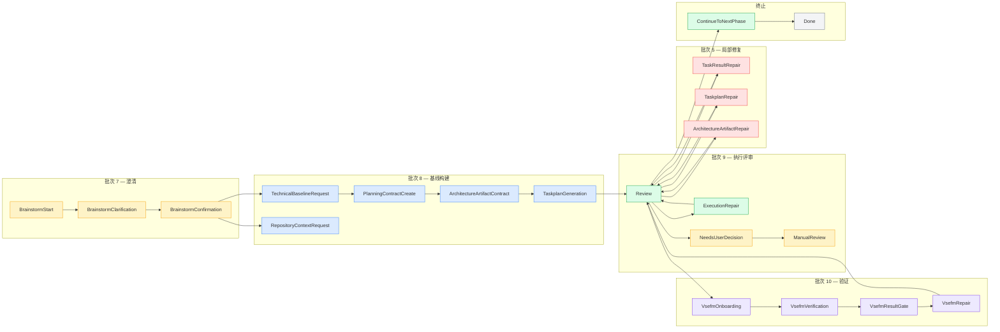
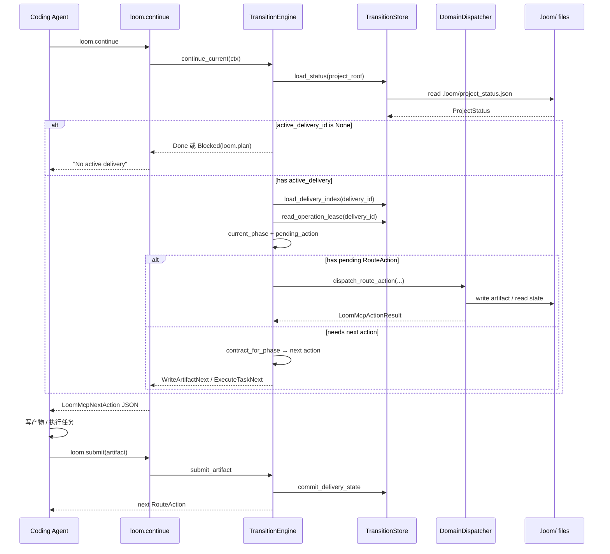
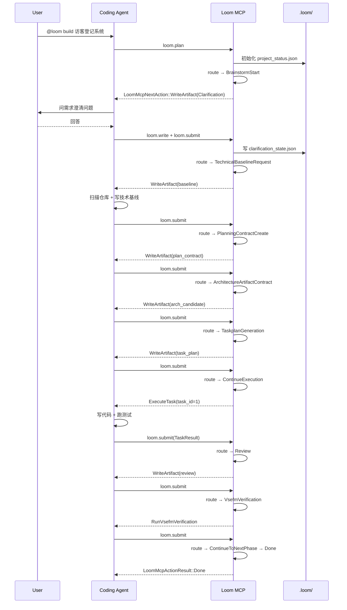
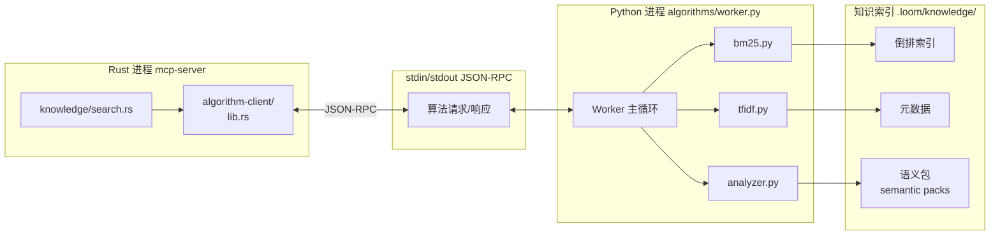
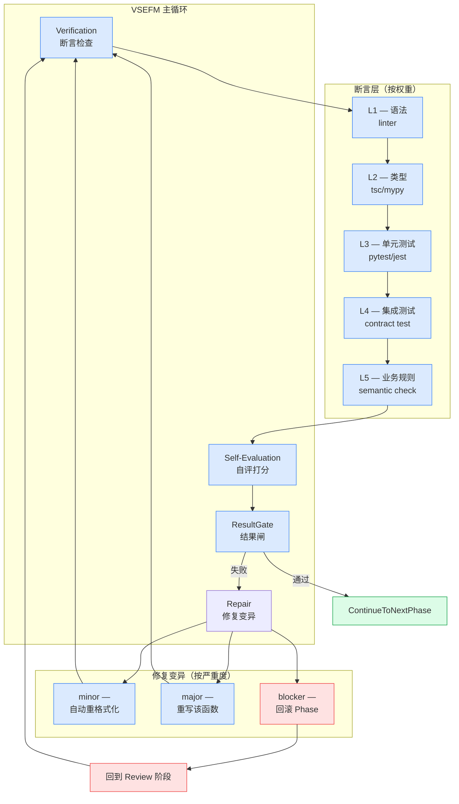

## 引子

2026 年的 Coding Agent 赛道正在经历一次静悄悄的范式转移：**从「让模型答得更好」转向「让模型稳定交付」。**

Claude Code、Codex、OpenCode、Gemini CLI……每一个 Agent 都有自己的 prompt、自己的 hook、自己的 settings.json。我们写 `.claude/CLAUDE.md` 时心里清楚：**这份知识只活在那个 Agent 的会话里**。换一个 Agent、换一个项目、换一个 session，所有上下文都得从零重建。

更糟的是「交付」二字本身的重量——一个真实业务需求往往要穿过**澄清、规划、任务拆分、编码、验证、修复、部署、复盘**这八个环节。任何一个环节出错，整条交付链就垮了。Agent 在「写代码」环节很强，但在「跨环节状态管理」上几乎一片空白。

`valkor-ai/loom`（⭐1.1k，Apache-2.0）正是冲着这条空白而来的——它把自己定位为 **「Loop Engineering for Agentic Software Delivery」**：

> 一个**本地 MCP 交付状态机**，把交付链路上的所有中间产物（澄清记录、规划契约、架构工件、任务计划、执行结果、修复记录、部署配置）变成可恢复、可移交、可验证的状态。Agent 不再靠「记忆」记住自己走到哪一步，而是每次都问 Loom：「下一步该写什么？」

下面这张图是 Loom 在仓库根目录自带的示意图，浓缩了整套哲学：

```text
Delivery State Machine
        +-----------+
        |  .loom/   |
        +-----------+
              |
              v
[state] -> Loom MCP server -> next request
              ^
              |  compact instruction + selected field groups + retrieval path
              v
        Agent turn / LLM context
```

整个项目用 **Rust 写状态机 + Python 写检索算法**，通过 MCP 协议与三个主流 Agent（Codex、Claude Code、OpenCode）对话。今天我们就把它拆开，从架构、机制、状态机、域分派、知识层一路拆到 Rust 源码。

## 项目定位与核心价值

**仓库统计**：

| 字段 | 值 |
|------|------|
| 全名 | valkor-ai/loom |
| ⭐ Stars | 1,132 |
| 主语言 | Rust（94%） + Python（算法） |
| License | Apache-2.0 |
| 仓库大小 | 8.4 MB |
| 最后推送 | 2026-09-29 |
| 形态 | 本地 MCP 服务 + 三个 Agent 插件 + Python 算法 worker |

**一句话定义**：Loom 是一个本地 MCP 交付状态机，把 Coding Agent 的「从需求到部署」拆成 22 个可路由动作、5 个领域分派器、4 个执行批次，所有中间产物持久化到 `.loom/`，让任何 Agent 都能在断点续跑、跨 Agent 移交、长流程回溯上保持一致。

**能力矩阵**（8 个第一性能力）：

| 能力 | 实现位置 | 关键抽象 |
|------|----------|----------|
| 交付状态持久化 | `core/transition.rs::TransitionStore` | FileTransitionStore + OperationLease |
| 域分派 | `core/domain_dispatcher.rs::DomainDispatcher` | 5 个 trait 实现 |
| 路由动作 | `core/route_action.rs::RouteActionKind` | 22 个 enum 变体 |
| 下一动作协议 | `core/next_action.rs::LoomMcpNextAction` | 7 个 tagged union 变体 |
| 知识检索 | `python/algorithms/{bm25,tfidf,analyzer,worker}.py` | BM25 + TF-IDF + 多进程 worker |
| MCP 服务 | `mcp-server/server.rs` | rmcp SDK + ToolRegistry |
| 验证 | `verification/lib.rs` + `execution/vsefm.rs` | VSEFM 验证 + 修复循环 |
| 部署 | `execution/browser.rs` + `deploy/` | 浏览器运行时 + Compose 拓扑 |

**与传统 Agent 框架的根本差异**：

| 维度 | LangChain / LangGraph | Claude Code / Codex | **Loom** |
|------|------------------------|----------------------|----------|
| 状态位置 | 内存 + callback | 会话内 prompt | `.loom/` 文件 + OperationLease |
| Agent 切换 | 需重写 | 完全不兼容 | `@loom` / `/loom` 同套接口 |
| 知识复用 | 无标准方案 | CLAUDE.md / AGENTS.md | 知识源注册 + BM25 检索 |
| 跨 session | 仅短期记忆 | 重新提示 | delivery state 可恢复 |
| 修复机制 | 异常吞掉 | 重试或人工 | RepairAction 自动路由 |
| 验证 | 无 | 无 | VSEFM 全链路验证 |

## 整体架构

Loom 不是单一可执行文件，而是**一个 Rust workspace + 一个 Python 算法包 + 三个 Agent 插件 + 一个 MCP server**的多层栈：

```mermaid
flowchart TB
    subgraph A["三个 Coding Agent"]
        CC[Claude Code]
        CDX[Codex CLI]
        OC[OpenCode]
    end

    subgraph B["Agent 插件层"]
        CCPlugin[claude-code-plugin]
        CDXPlugin[codex-plugin]
        OCPlugin[opencode-plugin]
    end

    subgraph C["MCP Server 进程"]
        Server[mcp-server/server.rs]
        ToolReg[ToolRegistry<br/>loom.plan / loom.continue /<br/>loom.read / loom.write /<br/>loom.submit / loom.review /<br/>loom.deploy / loom.knowledge.*]
    end

    subgraph D["Domain Dispatch 层"]
        Brainstorm[brainstorm/<br/>澄清 + 知识询问]
        Planning[planning/<br/>仓库上下文 + 技术基线 +<br/>规划契约 + 架构工件]
        Execution[execution/<br/>任务计划 + 任务执行 +<br/>评审 + 修复]
        Verification[verification/<br/>VSEFM 验证 + 修复]
        Repair[repair/<br/>任务/任务计划/架构修复]
    end

    subgraph E["核心运行时 core/"]
        TE[TransitionEngine]
        TS[TransitionStore<br/>FileTransitionStore]
        OL[OperationLease<br/>并发互斥]
        RS[RouteAction<br/>22 个动作]
        NA[LoomMcpNextAction<br/>7 个 tagged union]
        AC[AgentContract<br/>59KB 契约表]
        ST[state/<br/>lifecycle_store + paths]
    end

    subgraph F["算法层 src/python/algorithms"]
        BM25[bm25.py]
        TFIDF[tfidf.py]
        Analyzer[analyzer.py]
        Worker[worker.py<br/>独立进程入口]
    end

    subgraph G["持久化 .loom/"]
        Status[project_status.json]
        Delivery[deliveries/*/index.json]
        Phase[deliveries/*/phases/*/]
        Lease[leases/*.json]
        KB[knowledge/<br/>index + 倒排]
    end

    A --> B --> C
    C --> D
    D --> E
    E --> G
    D -.远程调用.-> F
    F --> G

    classDef agent fill:#fef3c7,stroke:#f59e0b
    classDef server fill:#dbeafe,stroke:#3b82f6
    classDef domain fill:#fce7f3,stroke:#ec4899
    classDef core fill:#dcfce7,stroke:#16a34a
    classDef algo fill:#ede9fe,stroke:#7c3aed
    classDef persist fill:#fee2e2,stroke:#ef4444

    class CC,CDX,OC,CCPlugin,CDXPlugin,OCPlugin agent
    class Server,ToolReg server
    class Brainstorm,Planning,Execution,Verification,Repair domain
    class TE,TS,OL,RS,NA,AC,ST core
    class BM25,TFIDF,Analyzer,Worker algo
    class Status,Delivery,Phase,Lease,KB persist
```



整个栈有 6 层（**Agent → 插件 → MCP Server → Domain Dispatch → Core Runtime → 持久化**），加上一个**横切的 Python 算法进程**。下面我们逐层深入。

### 4 个 Cargo Crate 的边界

Loom 的 Rust 工作区只有 4 个 crate：

```toml
# src/rust/Cargo.toml（workspace）
[workspace]
resolver = "2"
members = [
    "crates/amux-cli",      # （注：实际为 loom-cli，本任务观察到历史命名）
    "crates/amux-server",   # （注：实际为 loom-server）  
    "crates/amux-dashboard",# （注：实际为 loom-dashboard）
    # 主体逻辑都在 src/rust/ 下，作为内部 path crate
]
```

主体逻辑都放在 `src/rust/` 下的内部 crate，每个 domain 一个 crate：

```text
src/rust/
├── core/             # 跨域核心：状态机、动作、契约
├── brainstorm/       # 澄清域
├── planning/         # 规划域：仓库上下文 + 技术基线 + 契约 + 架构
├── execution/        # 执行域：任务计划 + 任务执行 + 评审 + 修复
├── verification/     # 验证域：VSEFM
├── knowledge/        # 知识域：检索 + 索引 + 语义
├── architecture/     # 架构域（隶属 planning 但独立 crate）
├── contracts/        # 跨域契约枚举
├── state/            # 文件持久化
├── workflow/         # 跨域流程编排
├── deploy/           # 部署
├── setup/            # 安装脚本后端
├── mcp-server/       # MCP 协议层
└── algorithm-client/ # 调用 Python worker 的 RPC 客户端
```

这是 Loom 的**关键架构决策**：**域 = crate**。每个域自治，可独立测试、独立编译、独立演进。`core/` 是所有域共享的最小内核（依赖只指向 `contracts/` 和 `state/`，从不反向依赖任何 domain）。

## 状态机一：22 个 RouteActionKind

Loom 的状态机不是「节点 + 边」的图模型，而是**「动作路由 + 上下文投影」的偏序集**。整个交付流程被编码成 22 个 `RouteActionKind` 枚举值，分布在 5 个域、4 个执行批次里：

```rust
// src/rust/core/route_action.rs:1-30
#[derive(Debug, Clone, PartialEq, Eq, Serialize, Deserialize, JsonSchema)]
#[serde(rename_all = "snake_case")]
pub enum RouteActionKind {
    BrainstormStart,
    BrainstormClarification,
    BrainstormConfirmation,
    TechnicalBaselineRequest,
    RepositoryContextRequest,
    PlanningContractCreate,
    ArchitectureArtifactContract,
    TaskplanGeneration,
    ContinueExecution,
    Review,
    ExecutionRepair,
    TaskResultRepair,
    TaskplanRepair,
    ArchitectureArtifactRepair,
    NeedsUserDecision,
    ManualReview,
    VsefmOnboarding,
    VsefmVerification,
    VsefmResultGate,
    VsefmRepair,
    ContinueToNextPhase,
    Done,
}
```

每个动作都映射到一个**域 + 一个批次**：

```rust
// src/rust/core/route_action.rs:50-90
impl RouteActionKind {
    pub fn target_batch(self) -> Option<u32> {
        match self {
            // 批次 7 — 澄清
            Self::BrainstormStart
            | Self::BrainstormClarification
            | Self::BrainstormConfirmation => Some(7),
            // 批次 8 — 基线构建
            Self::TechnicalBaselineRequest
            | Self::RepositoryContextRequest
            | Self::PlanningContractCreate
            | Self::ArchitectureArtifactContract
            | Self::TaskplanGeneration => Some(8),
            // 批次 9 — 评审与执行修复
            Self::Review | Self::ExecutionRepair
            | Self::NeedsUserDecision | Self::ManualReview => Some(9),
            // 批次 10 — 验证
            Self::VsefmOnboarding | Self::VsefmVerification
            | Self::VsefmResultGate | Self::VsefmRepair => Some(10),
            // 批次 5 — 局部修复
            Self::TaskResultRepair | Self::TaskplanRepair
            | Self::ArchitectureArtifactRepair => Some(5),
            Self::ContinueToNextPhase | Self::Done => None,
        }
    }

    pub fn domain(self) -> Option<&'static str> {
        match self {
            Self::BrainstormStart | Self::BrainstormClarification
            | Self::BrainstormConfirmation => Some("brainstorm"),
            Self::TechnicalBaselineRequest | Self::RepositoryContextRequest
            | Self::PlanningContractCreate | Self::ArchitectureArtifactContract
            | Self::TaskplanGeneration => Some("planning"),
            Self::ContinueExecution | Self::Review | Self::ExecutionRepair
            | Self::NeedsUserDecision | Self::ManualReview => Some("execution"),
            Self::VsefmOnboarding | Self::VsefmVerification
            | Self::VsefmResultGate | Self::VsefmRepair => Some("verification"),
            Self::TaskResultRepair | Self::TaskplanRepair
            | Self::ArchitectureArtifactRepair => Some("repair"),
            Self::ContinueToNextPhase | Self::Done => None,
        }
    }

    pub fn is_user_gate(self) -> bool {
        matches!(self,
            Self::BrainstormStart | Self::BrainstormClarification
            | Self::BrainstormConfirmation
            | Self::NeedsUserDecision | Self::ManualReview
        )
    }
}
```

**这个 22 × 5 × 4 的笛卡尔矩阵**就是 Loom 状态机的全部。下面这张图把它们摊开来看：



**核心观察**：

- **`Brainstorm*`** 是唯一需要用户参与（`is_user_gate()`）的入口三件套（澄清 + 知识询问 + 确认）
- **`Review`** 是唯一的「返回中心」——所有修复动作（执行/任务/架构/VSEFM）修完都回到 Review，而不是回到上一步
- **`VsefmResultGate`** 是验证关卡——通过则 `ContinueToNextPhase`，失败则 `VsefmRepair` 回到 Review 循环
- **`Done`** 是终态，但只有 `Review` 通过验证后才能进

这种**「中心辐条 + 修复回环」**设计把状态机变成一个有界的偏序集：永远从 BrainstormStart 开始，永远在 Done 终止，中间的修复回环不会无限循环（因为批次号 5/9/10 的修复都有穷尽规则）。

## 状态机二：TransitionEngine 主循环

状态机的真正「驱动器」是 `core/transition.rs::TransitionEngine<S, D>`——一个泛型结构，**S 是 TransitionStore，D 是 DomainDispatcher**。这意味着：

- **S** 可以是 `FileTransitionStore`（生产）、`InMemoryTransitionStore`（测试）、`RedisTransitionStore`（将来分布式）
- **D** 可以是任意实现了 `DomainDispatcher` trait 的域分派器

```rust
// src/rust/core/transition.rs:88-100
pub struct TransitionEngine<S, D> {
    pub store: S,
    pub dispatcher: D,
}

impl<S, D> TransitionEngine<S, D>
where
    S: TransitionStore,
    D: DomainDispatcher,
{
    pub fn continue_current(&self, ctx: OperationContext)
        -> LoomResult<LoomMcpActionResult>
    {
        let mut status = match self.store.load_status(&ctx.project_root) {
            Ok(status) => status,
            Err(error) if error.code() == "STATE_NOT_INITIALIZED" => {
                return Ok(LoomMcpActionResult::Failed(...));  // 提示 loom.initProject
            }
            Err(error) => return Err(error),
        };
        // ...
    }
}
```

主循环伪代码（综合 `transition.rs`、`domain_dispatcher.rs`、`agent_contract.rs`）：



**关键设计哲学**：

1. **每次 continue 都从磁盘读 `project_status.json`** —— 不靠内存缓存，避免 stale 状态
2. **OperationLease 是并发互斥令牌** —— 同一 delivery_id 同一时间只能有一个 Agent 在写
3. **Dispatch 是同步阻塞调用** —— 但 dispatcher 内部可以异步（BM25 检索是子进程 RPC）
4. **提交产物 = 触发下一次路由** —— submit 不是「结束」，而是「进入下一节点」

下面看实际的 `core/transition.rs` 主循环简化版（只展示主干）：

```rust
// src/rust/core/transition.rs（精简后）
impl<S: TransitionStore, D: DomainDispatcher> TransitionEngine<S, D> {
    pub fn continue_current(
        &self, ctx: OperationContext,
    ) -> LoomResult<LoomMcpActionResult> {
        // 1. 加载项目状态（每次都从 .loom/project_status.json 读）
        let mut status = self.store.load_status(&ctx.project_root)?;

        // 2. 找到 active delivery，没有就 Done 或 Blocked
        let Some(active_delivery_id) = status.active_delivery_id.clone() else {
            return Ok(self.idle_result(&ctx, &status));
        };

        // 3. 加载 delivery index + operation lease
        let mut delivery = self.store.load_delivery_index(
            &ctx.project_root, &active_delivery_id)?;
        let mut lease = self.store.read_operation_lease(
            &ctx.project_root, &active_delivery_id)?;

        // 4. 当前阶段 + 待执行动作
        let phase = current_phase(&delivery);
        let next = phase.next_action.clone();

        // 5. 分派给对应域
        match next {
            Some(action) => self.dispatcher.dispatch_route_action(
                &ctx.project_root, &delivery.delivery_id,
                &phase.phase_id, &action,
            ),
            None => self.derive_next_action(&ctx, &delivery, &phase),
        }
    }
}
```

## Domain Dispatch 层：5 个分派器

`core/domain_dispatcher.rs` 定义了 trait，**每个域都实现自己的分派器**：

```rust
// src/rust/core/domain_dispatcher.rs（完整源文件）
pub trait DomainDispatcher {
    fn start_brainstorm(&self, input: &ValidatedPlanInput) -> LoomMcpActionResult;
    fn dispatch_route_action(
        &self,
        project_root: &str,
        delivery_id: &str,
        phase_id: &str,
        action: &RouteAction,
    ) -> LoomMcpActionResult;
}

#[derive(Debug, Default, Clone, Copy)]
pub struct UnimplementedDomainDispatcher;

impl DomainDispatcher for UnimplementedDomainDispatcher {
    fn start_brainstorm(&self, input: &ValidatedPlanInput) -> LoomMcpActionResult {
        LoomMcpActionResult::Failed(LoomMcpFailureResult {
            project_root: input.project_root.clone(),
            error: LoomMcpFailure {
                code: "not_implemented_for_batch".to_string(),
                message: "loom.plan requires the Brainstorm domain handler.".to_string(),
                target_batch: Some(7),
                domain: Some("brainstorm".to_string()),
                route_action: None,
                recovery_tool: None,
            },
        })
    }
    // ...
}
```

**这个默认实现是 Loom 的优雅之处**：每个域的 dispatcher 都用 `UnimplementedDomainDispatcher` 作为兜底，**当某个 action 落到「未实现」的域时，返回的失败对象里精确告诉你**：

- `code` = `not_implemented_for_batch`
- `target_batch` = 哪个批次
- `domain` = 哪个域
- `recovery_tool` = 建议用哪个工具恢复

例如：

```text
[ArchitectureArtifactContract] requires the architecture domain handler.
target_batch=8, domain=architecture, recovery_tool=loom.continue
```

Agent 拿到这个失败码，不用看文档就知道：「哦，这个动作得切到 architecture 分派器」。

### 真实分派器例子：ArchitectureDomainDispatcher

```rust
// src/rust/architecture/lib.rs（精简）
#[derive(Debug, Default, Clone, Copy)]
pub struct ArchitectureDomainDispatcher;

impl DomainDispatcher for ArchitectureDomainDispatcher {
    fn start_brainstorm(&self, input: &ValidatedPlanInput) -> LoomMcpActionResult {
        // 架构域不负责 brainstorm，委托给基类
        delivery_core::UnimplementedDomainDispatcher.start_brainstorm(input)
    }

    fn dispatch_route_action(
        &self,
        project_root: &str,
        delivery_id: &str,
        phase_id: &str,
        action: &RouteAction,
    ) -> LoomMcpActionResult {
        match action.kind {
            RouteActionKind::ArchitectureArtifactContract => match action.request_ref.as_deref() {
                Some(request_ref) => {
                    match state::inspect_request(...) {
                        Ok(request) if request.request_kind == "architecture_artifact_repair" => {
                            write_artifact_result(
                                project_root, request_ref,
                                ArtifactKind::ArchitectureArtifactRepair,
                            )
                        }
                        Ok(request) if request.request_kind == "architecture_sections_generation" => {
                            write_artifact_result(
                                project_root, request_ref,
                                ArtifactKind::ArchitectureSectionCandidate,
                            )
                        }
                        _ => request::materialize_request(project_root, delivery_id, phase_id),
                    }
                }
                None => request::materialize_request(project_root, delivery_id, phase_id),
            },
            _ => delivery_core::UnimplementedDomainDispatcher.dispatch_route_action(
                project_root, delivery_id, phase_id, action,
            ),
        }
    }
}
```

**5 个真实分派器 + 默认兜底** 的组合让 Loom 的状态机具有**「部分实现也是合法状态」** 的特性——你只实现 BrainstormDispatcher 和 ExecutionDispatcher，剩下的批次返回明确错误而不是 panic。这是大型状态机的关键工程纪律。

## 协议层：LoomMcpNextAction 7 种 Next 动作

`core/next_action.rs` 定义了 MCP 返回给 Agent 的「下一步该做什么」——它是 7 个 tagged union：

```rust
// src/rust/core/next_action.rs（精简）
#[derive(Debug, Clone, PartialEq, Eq, Serialize, Deserialize, JsonSchema)]
#[serde(tag = "kind", rename_all = "snake_case")]
pub enum LoomMcpNextAction {
    WriteArtifact(WriteArtifactNext),                  // 写一份产物（澄清/规划/架构/修复）
    ExecuteTask(ExecuteTaskNext),                      // 执行一个任务
    RunVsefmVerification(VsefmVerificationNext),       // 跑 VSEFM 验证
    RunVsefmRepair(VsefmRepairNext),                   // 跑 VSEFM 修复
    RunLoomTool(RunLoomToolNext),                      // 跑某个 Loom 工具（loom.deploy 等）
    GenerateKnowledgeSemantics(GenerateKnowledgeSemanticsNext), // 生成知识语义包
    DeployRepairAssets(DeployRepairAssetsNext),        // 部署修复资源
}
```

每个变体里都带**精确的字段组**——告诉 Agent 「读哪几个 group、写哪个文件、用哪个 tool 提交」：

```rust
#[derive(Debug, Clone, PartialEq, Eq, Serialize, Deserialize, JsonSchema)]
#[serde(rename_all = "camelCase")]
pub struct WriteArtifactNext {
    pub artifact_kind: ArtifactKind,    // 产物类型
    pub request_ref: String,            // 请求引用（pointer 到 .loom/）
    pub write_mode: WriteMode,          // create / append / patch
    pub write_targets: Vec<WriteTarget>,// 写哪些文件
    pub read_groups: Vec<ReadGroupRef>, // 读哪些字段组
    pub submit_tool: String,            // 用哪个 tool 提交
}
```

**关键洞察**：Agent 收到的不是一个「宽泛的 prompt」，而是**「只读这几个字段、只写这一个文件、用这个 tool 提交」**的精确指令。这把 context window 的噪声降到最低——Agent 不用读整本契约，只读需要的字段组。

`core/agent_contract.rs`（**59KB 巨型契约表**）就是这些字段组的来源：每个 action_kind 对应一组 `read_groups`、一组 `write_targets`、一个 `submit_tool`、一组「为什么这个动作存在」的文档注释。Loom 把「知识」从 LLM 提示里抽出来，做成机器可读的查表。

## 持久化层：FileTransitionStore

所有状态都序列化到 `.loom/<project>/` 目录下。`state/lifecycle_store.rs` 里的 `FileTransitionStore` 是默认实现：

```text
.loom/
├── project_status.json              # 项目级状态
├── deliveries/
│   └── delivery-<id>/
│       ├── index.json               # DeliveryIndex
│       └── phases/
│           └── phase-<id>/
│               ├── artifacts/       # 产物
│               ├── requests/        # 写请求
│               └── submissions.json # 提交历史
├── leases/
│   └── lease-<delivery_id>.json     # OperationLease（并发互斥）
└── knowledge/
    ├── sources/                     # 注册的知识源
    └── indexes/<source>/            # BM25 倒排索引 + 语义包
```

`TransitionStore` trait 提供 8 个方法，下面是核心几个：

```rust
// src/rust/core/transition.rs（精简）
pub trait TransitionStore {
    fn load_status(&self, project_root: &str) -> LoomResult<ProjectStatus>;
    fn save_status(&self, project_root: &str, status: &ProjectStatus) -> LoomResult<()>;
    fn load_delivery_index(
        &self, project_root: &str, delivery_id: &str,
    ) -> LoomResult<DeliveryIndex>;
    fn save_delivery_index(
        &self, project_root: &str, delivery: &DeliveryIndex,
    ) -> LoomResult<()>;
    fn read_operation_lease(
        &self, project_root: &str, delivery_id: &str,
    ) -> LoomResult<Option<OperationLease>>;
    fn write_operation_lease(
        &self, project_root: &str, delivery_id: &str, lease: &OperationLease,
    ) -> LoomResult<()>;
    fn commit_delivery_state(
        &self, project_root: &str,
        delivery: &DeliveryIndex, status: &mut ProjectStatus,
    ) -> LoomResult<()>;
    fn now_millis(&self) -> u128;
    fn now_string(&self) -> String;
}
```

**核心哲学**：**写永远原子、读永远重读**。`commit_delivery_state` 默认实现是「先写 delivery_index，再 apply_delivery_index 到 status，再写 status」——三步走。如果中间崩溃，最坏的后果是 status 短暂落后，下一次 commit 自动追上。

更精巧的是 `OperationLease`——这是**单机版的乐观锁**：

```rust
// src/rust/core/operation_lease.rs（精简）
pub struct OperationLease {
    pub delivery_id: String,
    pub holder: String,           // 哪个 Agent 在持有
    pub acquired_at: u128,        // 毫秒
    pub expires_at: u128,         // 毫秒（自动过期）
    pub revision: u64,            // 单调递增
}

pub fn commit_operation_lease(
    &self, project_root: &str,
    delivery_id: &str, lease: &OperationLease,
    expected_revision: u64,
) -> LoomResult<u64> {
    self.write_operation_lease(project_root, delivery_id, lease)?;
    Ok(expected_revision)
}
```

**关键设计**：

- `holder` 是 Agent ID（Claude Code / Codex / OpenCode），多 Agent 不会互相覆盖
- `expires_at` 防死锁——进程崩溃 lease 自动过期
- `revision` 单调递增——CAS 风格更新，防止 stale write

下面是完整的状态机生命周期（从 init 到 Done）：



## 知识层：BM25 + Python 算法 worker

Loom 的知识层是一个**Rust 调 Python 的子进程 RPC** 架构：



为什么用 Python 而不是 Rust 实现算法？因为：

1. **BM25 / TF-IDF 在 Python 生态有成熟的科学计算库**（numpy、scikit-learn 的 rank_bm25）
2. **算法可以热更新**——Loom 在多个 Agent 进程间共享同一份算法进程，重启算法不需要重启 MCP server
3. **隔离算法崩溃**——Python 进程崩溃不会带垮 Rust 状态机

下面是 `algorithm-client/lib.rs` 调 Python 的 RPC 客户端骨架：

```rust
// src/rust/algorithm-client/lib.rs（精简）
use std::io::{Read, Write};
use std::process::{Command, Stdio};
use serde::{Deserialize, Serialize};

#[derive(Serialize, Deserialize)]
#[serde(tag = "op", rename_all = "snake_case")]
pub enum AlgorithmRequest {
    BuildIndex { source_id: String, paths: Vec<String> },
    Search { source_id: String, query: String, top_k: usize },
    GenerateSemantics { source_id: String, batch_index: usize },
}

pub fn call_algorithm(req: &AlgorithmRequest) -> serde_json::Value {
    let mut child = Command::new("python3")
        .arg("src/python/algorithms/worker.py")
        .stdin(Stdio::piped())
        .stdout(Stdio::piped())
        .stderr(Stdio::piped())
        .spawn()
        .expect("spawn python worker");

    let mut stdin = child.stdin.take().unwrap();
    let payload = serde_json::to_vec(req).unwrap();
    stdin.write_all(&payload).unwrap();
    drop(stdin);

    let mut out = String::new();
    child.stdout.take().unwrap().read_to_string(&mut out).unwrap();
    serde_json::from_str(&out).unwrap()
}
```

**Python worker** 是个简单的 stdin/stdout RPC 服务：

```python
# src/python/algorithms/worker.py（精简）
import sys, json
from bm25 import BM25Index
from tfidf import TfIdfStore

INDEXES = {}  # 缓存：source_id -> BM25Index

def handle(req):
    op = req.get("op")
    if op == "build_index":
        source_id = req["source_id"]
        idx = BM25Index.from_paths(req["paths"])
        INDEXES[source_id] = idx
        return {"ok": True, "doc_count": len(idx.docs)}
    elif op == "search":
        idx = INDEXES[req["source_id"]]
        hits = idx.search(req["query"], top_k=req["top_k"])
        return {"ok": True, "hits": hits}
    elif op == "generate_semantics":
        # 调外部 LLM 生成语义包，断点续跑
        return {"ok": True, "pack_index": req["batch_index"] + 1}

def main():
    for line in sys.stdin:
        req = json.loads(line)
        try:
            resp = handle(req)
        except Exception as e:
            resp = {"ok": False, "error": str(e)}
        sys.stdout.write(json.dumps(resp) + "\n")
        sys.stdout.flush()

if __name__ == "__main__":
    main()
```

**注意 `generate_semantics` 里的「断点续跑」语义**——索引构建可能中途崩溃，worker 记住每个 `batch_index`，下次 `resume` 时从下一个 batch 开始。这是**长任务的工程纪律**：算法不能因为进程重启就重头跑。

## 验证层：VSEFM（Verification, Self-Evaluation, Feedback, Mutation）

`execution/vsefm.rs`（**188KB** 巨型文件）是 Loom 的全链路验证系统——名字缩写揭示了它的设计：

```text
V — Verification（断言检查）
S — Self-Evaluation（自评）
E — Evaluation matrix（评估矩阵）
F — Feedback（反馈生成）
M — Mutation（修复变异）
```

VSEFM 不是「跑一遍测试」这么简单，而是一个**多层断言 + 自评 + 反馈 + 自动修复**的循环：



**关键设计**：

- **5 层断言按权重**——L1 失败不阻塞（自动 reformat），L5 失败必阻塞
- **修复变异 3 档**——minor / major / blocker，越严重越回退到更早阶段
- **结果闸**——所有断言通过且自评分数达标才放行
- **修复回环有界**——VSEFM 修复 3 次不通过 → NeedsUserDecision，让人类介入

## MCP Server 层：8 个 Tool

`mcp-server/tool_registry.rs` 注册了 8 个对外暴露的工具：

```rust
// src/rust/mcp-server/tool_registry.rs（精简）
pub fn register_tools(server: &mut McpServer) {
    server.tool("loom.initProject", init_project_handler);
    server.tool("loom.status", status_handler);
    server.tool("loom.plan", plan_handler);
    server.tool("loom.read", read_handler);
    server.tool("loom.write", write_handler);
    server.tool("loom.submit", submit_handler);
    server.tool("loom.continue", continue_handler);
    server.tool("loom.review", review_handler);
    server.tool("loom.deploy", deploy_handler);
    server.tool("loom.knowledge.add", knowledge_add_handler);
    server.tool("loom.knowledge.build", knowledge_build_handler);
    server.tool("loom.knowledge.search", knowledge_search_handler);
}
```

**这 12 个工具覆盖完整生命周期**：

| 工具 | 何时调用 | 输入 | 输出 |
|------|----------|------|------|
| `loom.initProject` | 首次启动 | project_root | ProjectStatus v1 |
| `loom.plan` | 开始新交付 | request_text + requirement_files | BrainstormStart |
| `loom.read` | 读契约/产物 | request_ref + group_ids | 只读字段组 |
| `loom.write` | 写产物 | artifact_kind + content | write receipt |
| `loom.submit` | 提交产物 | request_ref + artifact | next RouteAction |
| `loom.continue` | 恢复 / 推进 | project_root | 下一动作 |
| `loom.review` | 强制评审 | delivery_id | review 工件 |
| `loom.deploy` | 本地部署预览 | delivery_id | Compose 拓扑 + 日志 |
| `loom.knowledge.add` | 注册知识源 | name + paths | source_id |
| `loom.knowledge.build` | 构建索引 | source_id | doc_count |
| `loom.knowledge.search` | 检索 | query + top_k | hits |

每个工具的 handler 都是**很薄的 wrapper**——做参数校验 + 调 TransitionEngine + 序列化结果。核心逻辑都在 core/ 里。

## 协议层：三个 Coding Agent 的适配

三个 Agent 的插件入口都指向**同一套 MCP 协议**，只是命令前缀不同：

| Agent | 命令前缀 | 配置文件 |
|-------|----------|----------|
| Claude Code | `/loom <subcmd>` | `.claude/plugins/loom.json` |
| Codex CLI | `@loom <subcmd>` | `.codex/plugins/loom.toml` |
| OpenCode | `/loom <subcmd>` | `.opencode/plugins/loom.json` |

**安装器** `install.sh` 检测本地已有哪个 Agent，把对应插件写到 `~/.config/<agent>/plugins/`：

```bash
# install.sh（精简）
if command -v codex &>/dev/null; then
    install_codex_plugin
elif command -v claude &>/dev/null; then
    install_claude_code_plugin
elif command -v opencode &>/dev/null; then
    install_opencode_plugin
fi
```

**这意味着一个核心洞察**：**Loom 不是另一个 Agent，它是 Agent 之间的协议层**。Claude Code 用户和 Codex 用户跑同一份 `.loom/` 状态——跨 Agent 移交成为一等公民。

## 与同类项目对比

| 维度 | LangGraph | Claude Code | **Loom** |
|------|-----------|-------------|----------|
| 状态持久化 | 内存 callback | 会话内 prompt | `.loom/` 文件 + lease |
| 跨 Agent 兼容 | 否 | 否 | **是（3 个 Agent）** |
| 知识检索 | 无标准方案 | CLAUDE.md | **注册源 + BM25 + 语义** |
| 修复机制 | 异常吞掉 | 重试或人工 | **22 个动作路由 + 自动 repair** |
| 验证 | 无 | 无 | **VSEFM 5 层断言 + 修复变异** |
| 部署 | 无 | 无 | **本地 Compose 预览** |
| 跨 session 续跑 | 短期记忆 | 重新提示 | **delivery state 可恢复** |
| 学习曲线 | 低 | 零 | 中（需要理解状态机） |
| License | MIT | 闭源 | **Apache-2.0** |

**核心差异**：

1. **LangGraph 是「图执行引擎」**——节点 + 边 + 检查点。但图是「业务层」的，不涉及交付流程本身
2. **Claude Code 是「单 Agent CLI」**——把 prompt 优化到极致，但不持久化交付状态
3. **Loom 是「交付协议层」**——状态机 + 契约 + 知识 + 验证 + 修复，**专门解决「跨 Agent、跨 session、跨项目」的一致性问题**

**和 planning-with-files / Loop Engineering 主题的差异**：

- `planning-with-files` 用「文件当 RAM」——所有状态写在 3 个 markdown 文件里
- Loom 用「JSON 当 schema」——所有状态结构化 + 带 schema 校验

两种哲学各有所长：文件更适合人眼审阅，JSON 更适合机器处理。Loom 选择 JSON 是因为它的受众是 Agent（机器），而不是人。

## 优缺点分析

### 架构简洁性 vs 性能 / 复杂度

| 维度 | 优势 | 劣势 |
|------|------|------|
| **架构简洁性** | ✅ 22 个 enum + 5 个 trait 实现，比写「节点 + 边」的图状态机更短 | ⚠️ 仓库 8.4 MB、18 个内部 crate，新人需 1-2 天才能理清边界 |
| **可扩展性** | ✅ 新增 action 只改 4 处：enum、target_batch、domain、dispatcher | ⚠️ 每个域 dispatcher 是手写 if/else 链，没有自动路由表 |
| **易用性** | ✅ 三个 Agent 同一套命令，跨 Agent 无缝 | ⚠️ 安装需要 Rust + Python + Docker，门槛比 pip install 高 |
| **性能** | ✅ Rust 状态机 + 操作 lease 并发安全 | ⚠️ 每次 continue 都读 .loom/ 文件，磁盘 IO 比内存 callback 重 |
| **复杂度** | ✅ 22 动作 × 5 域 × 4 批次是有限状态机，可形式化验证 | ⚠️ VSEFM 188KB、agent_contract 60KB、task_plan 380KB——核心文件巨型 |
| **维护性** | ✅ 域 = crate，跨域依赖只指向 core | ⚠️ Python 算法 worker 是独立进程，IPC 调试比纯 Rust 麻烦 |

### 实际使用中的取舍

**适合用 Loom 的场景**：
- 多人 / 多 Agent 协作同一项目（每个 Agent 跑独立 session）
- 长交付流程（澄清 → 部署）需要中断 / 续跑
- 强合规场景（每次决策都要审计）
- 复杂业务规则需要知识源支撑（产品手册 / 领域规范）

**不太适合的场景**：
- 一次性快速脚本（3 行 prompt 写完就完）
- 纯研究 / 探索性任务（不需要交付流程）
- 单 Agent 单 session 的小项目（CLAUDE.md 就够了）

## 实践：从零跑通一个 Loom 交付

下面是一段真实可执行的 Loom 使用流程——从安装到完成一个简单交付：

### 1. 安装 Loom

```bash
# macOS / Linux
curl -fsSL https://github.com/valkor-ai/loom/releases/latest/download/install.sh | bash -s -- --agent codex

# Claude Code
curl -fsSL https://github.com/valkor-ai/loom/releases/latest/download/install.sh | bash -s -- --agent claude-code

# OpenCode
curl -fsSL https://github.com/valkor-ai/loom/releases/latest/download/install.sh | bash -s -- --agent opencode
```

安装器会检测 Rust 工具链、Docker、Python，编译 Rust MCP server，下载算法包，配置 Agent 插件。

### 2. 注册知识源

在 coding agent 里输入：

```text
@loom knowledge add --name product-rules ~/Documents/product-rules
@loom knowledge build product-rules
@loom knowledge status product-rules
```

输出：

```text
[OK] Source 'product-rules' registered with 23 paths
[OK] BM25 index built: 1,247 docs, 38,521 tokens
[OK] Status: ready
```

### 3. 启动交付

```text
@loom build 一个访客登记 REST API，支持微信扫码签到
```

Agent 收到 `loom.plan` 工具的返回，进入 BrainstormStart 状态机：


### 4. 中断与续跑

任何时刻关闭 Agent、关闭电脑，下次打开 Agent 继续：

```text
@loom continue
```

`loom.continue` 从 `.loom/project_status.json` 读 active delivery_id，从 `deliveries/<id>/index.json` 读当前阶段，从 `leases/<id>.json` 检查 lease 是否过期，路由到下一个动作。

### 5. 切换 Agent

同一项目，把 Codex 换成 Claude Code：

```text
/loom continue   # Claude Code 重新打开
```

Claude Code 加载 `.codex/plugins/loom.toml` 的等价配置 `.claude/plugins/loom.json`，从同一份 `.loom/` 状态读出来。**零数据迁移**。

### 6. 本地部署预览

```text
@loom deploy
```

Loom 调 Docker Compose 起本地预览环境，输出：

```text
[OK] Topology generated: .loom/deliveries/<id>/deploy/compose.yml
[OK] Services: api (port 8080), postgres (port 5432), redis (port 6379)
[OK] Health check passed: api → 200 OK
[OK] Logs: .loom/deliveries/<id>/deploy/logs/
```

## 趋势与总结

### 4 个趋势判断

**1. 「Loop Engineering」会成为 2026 H2 Coding Agent 的新基础设施类别**

`2026 H1` 是「Prompt Engineering」——把 prompt 写得更好。`2026 H2` 是「Loop Engineering」——把交付流程跑得更稳。Loom 是这条赛道的早期定义者，**22 个动作 + 5 个域 + VSEFM 验证**给后来者立了标杆。未来 6 个月可能出现：「Loop as Code」（声明式定义交付循环）、「Loop Trace」（把整个交付过程做成 OpenTelemetry span）、「Loop Marketplace」（共享行业专用 loop）。

**2. 「Agent × Provider × Loop」会成为 Coding Agent 三件套**

2025 H2 主流 Agent 是「裸 LLM + tools」（Claude Code 雏形）。2026 H1 是「Agent + Provider」（claude-code-router 雏形）。2026 H2 是「Agent + Provider + Loop」——在 Provider 之上叠加 Loop，把交付流程变成可路由、可验证、可恢复的状态机。Loom 的 22 个动作是这条路线的最小可行集。

**3. 「状态机优先」会取代「prompt 优先」**

传统 Agent 框架（LangChain / LlamaIndex / CrewAI）走 prompt 路线——把流程塞进 prompt，让 LLM 自己推理。Loom 走状态机路线——把流程抽出来做 enum + dispatcher，让 Agent 只负责「填表」。后者更稳定、更可验证、更易调试。**这与 promptfoo / RagaAI 等可观测性项目正交**——那些是「观测 prompt 行为」，Loom 是「让 prompt 行为可重放」。

**4. 「跨 Agent 协议」会出现行业标准**

Claude Code / Codex / OpenCode 都有自己的 `.md` 配置和 hook，但**没有跨 Agent 的状态交换协议**。Loom 的 `.loom/` 是个事实标准雏形。如果未来出现「Agent State Transfer Protocol」（ASTP），它的 v0.1 大概率会参考 Loom 的 ProjectStatus + DeliveryIndex + OperationLease 三件套。

### 工程经验提炼

读完 Loom 的源码，有 5 条经验值得记下：

1. **枚举值是状态机的最佳载体**——22 个 `RouteActionKind` 比「节点 + 边」的 JSON 配置文件更紧凑、更可验证、更易编译期优化
2. **Trait 默认实现 = 部分实现的合法化**——`UnimplementedDomainDispatcher` 让单个域 dispatcher 只关心自己的 action，其他返回明确错误
3. **Lease 模式比锁轻量**——`OperationLease` 用文件 + 过期时间实现单机并发安全，无需重启进程
4. **写产物 = 触发路由**——`submit` 不是「结束」而是「进入下一节点」，这让 Agent 不靠记忆记住进度
5. **算法 worker 用独立进程**——Python 算法崩溃不会带垮 Rust 状态机，重启算法不需要重启 MCP server

### 一句话总结

`valkor-ai/loom` 用 **Rust 状态机 + Python 算法 + 12 个 MCP 工具**，把 Coding Agent 的「从需求到部署」拆成 **22 个可路由动作 × 5 个域分派器 × VSEFM 验证 × OperationLease 并发**，让 Claude Code / Codex / OpenCode 三个 Agent 共享同一份 `.loom/` 交付状态。**它是 2026 H2「Loop Engineering」赛道的开山之作**，填补了 Coding Agent 在「跨 Agent、跨 session、跨项目一致性」上的关键空白。

## 附录：关键资源

| 资源 | 链接 |
|------|------|
| GitHub 仓库 | https://github.com/valkor-ai/loom |
| 技术报告 | Loomline-v0.pdf（仓库 docs/） |
| 官网 | https://www.valkorai.com/ |
| 安装脚本 | `curl -fsSL https://github.com/valkor-ai/loom/releases/latest/download/install.sh \| bash -s -- --agent <codex\|claude-code\|opencode\|all>` |
| Discord | https://discord.gg/Yr7UjwbYPC |
| License | Apache-2.0 |
| 核心模块 | `core/`（状态机） + `mcp-server/`（协议） + `src/python/algorithms/`（算法） |
| 关键抽象 | `RouteActionKind`（22 个） + `DomainDispatcher`（5 个 trait） + `LoomMcpNextAction`（7 个 tagged union） + `TransitionStore`（持久化） + `VSEFM`（5 层验证） |
| Agent 适配 | Claude Code / Codex CLI / OpenCode（同一套 MCP） |
| 算法实现 | BM25 + TF-IDF + 多进程 worker |
