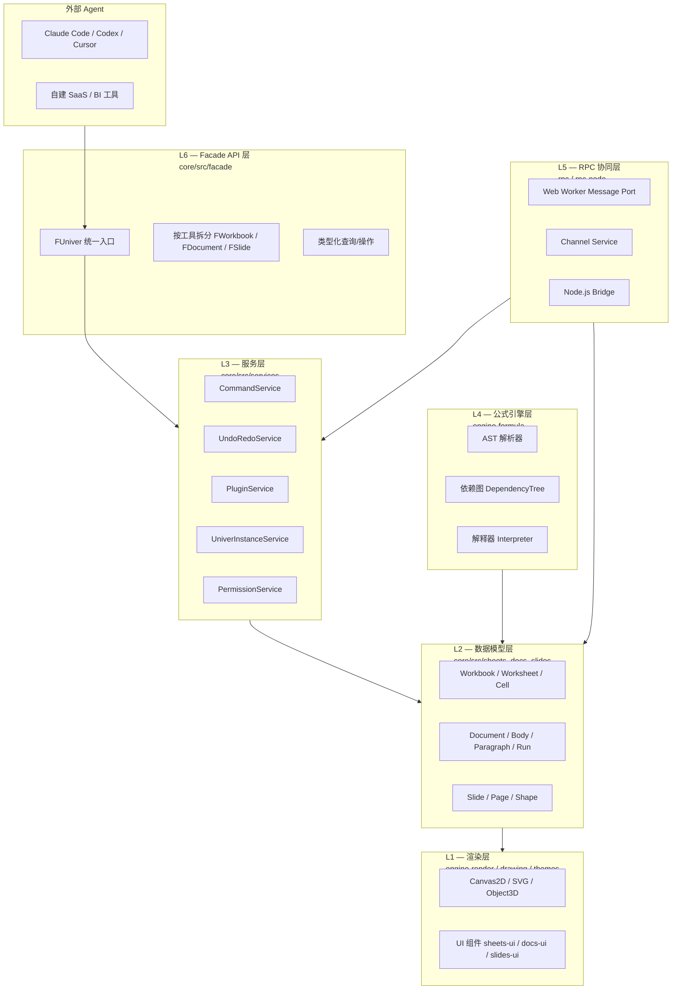
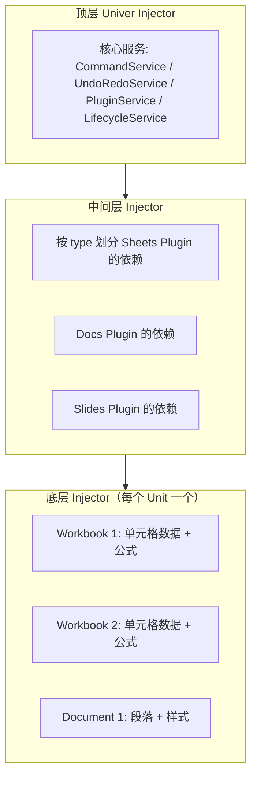
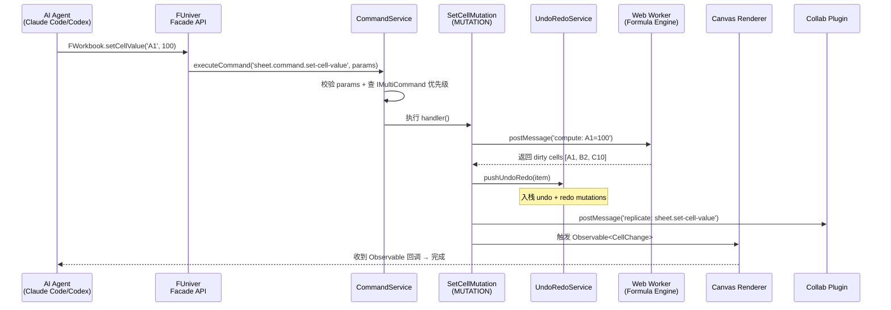

## 引子：当 AI Agent 遇上 Office

2026 年，几乎所有 Coding Agent 都开始"越界"——Claude Code 不再只写代码，还会顺手生成电子表格、Markdown 报告、甚至 PPT 摘要；Cursor Agent 在重构完数据库 schema 后，需要往演示文稿里塞几张 ER 关系图；Codex 在测试完 API 之后，要把用例输出成 xlsx 给业务方。

但有个长期被忽视的**运行时缺口**：**AI Agent 没有结构化的 Office 操作底座**。

让它生成一份 xlsx，要么调 openpyxl 这种"自描述但低语义"的 Python 库，要么让 LLM 直接生成 .xlsx 的二进制字节；让它修改一份 pptx，要么靠 python-pptx 这种"把 OOXML 当字符串拼接"的玩具库，要么干脆重新生成整个文件。**这两种路径都丢失了"结构化、可撤销、可协作、可被 Agent 检索"这四个关键能力**。

> 这是因为传统 Office 操作库把"文件"当成"字节流"，而 Agent 需要把"文件"当成"可寻址、可操作、可观察的状态机"。

2024 年成立的 DreamNum 公司给出了一个出乎意料的答案——**Univer**。它不做"Office for AI"的插件，而是**为 AI Agent 量身打造的"Office Harness"（同源工程多 Office 工具运行时）**：22k+ Star、Apache-2.0、TypeScript 编写，60+ 包 monorepo，把 **电子表格（Sheets）、文档（Docs）、演示文稿（Slides）、画板（Canvas/Board）、关系表（Bases）、PDF** 装进**同一个运行时**——同一个命令系统、同一个依赖注入容器、同一个协同引擎、同一个公式 AST。

> **本文关键词**：Office Harness for AI Agents、Command/Mutation/Operation 三段命令模式、`@wendellhu/redi` 依赖注入、Web Worker RPC 协同桥、AST 公式依赖图、Snapshot 撤销栈、`UniverInstanceService` 单元生命周期。

## 项目定位与核心价值

**一句话定义**：Univer 是**为 AI Agent 设计的全栈 Office 运行时**，让 Agent 像调用 API 一样操作 Office 文档（电子表格/文档/演示/画板/PDF），同时保留撤销/重做、协同编辑、跨工具引用等"工程师级"能力。

**能力矩阵**（来自 [docs.univer.ai/capabilities](https://univer.ai/capabilities)）：

| 工具 | 数据模型 | 命令系统 | 协同编辑 | 公式引擎 |
|------|----------|----------|----------|----------|
| **Sheets**（电子表格） | Workbook → Worksheet → Cell | 完整 M/O/C | ✅ | ✅（AST + 依赖图） |
| **Docs**（文档） | Document → Body → Paragraph → Run | 完整 M/O/C | ✅ | — |
| **Slides**（演示文稿） | Slide → Page → Shape | 完整 M/O/C | ✅ | — |
| **Canvas/Board** | Scene → Node → Element | 完整 M/O/C | ✅ | — |
| **Bases**（关系表） | Base → Table → Row | 完整 M/O/C | ✅ | — |
| **PDF** | Page → Annotation | 完整 M/O/C | — | — |

**为什么叫"Office Harness for AI Agents"**（来自 README 第 9 行）：

> "Across the Univer product family, Office tools share a runtime for storage and computation. Content can be composed and embedded across tools, with linked data and references updating together. **People and AI agents can work in the same files.**"

**仓库统计**：
- ⭐ **22,174** stars（2026-09-30 实测）
- 🍴 **2,400+** forks
- 📦 **60+ packages** monorepo（pnpm workspace + turbo）
- 💻 **TypeScript** 100%（少量 .tsx / .md）
- 📜 **Apache-2.0**
- 📅 Last commit **2026-09-30**（持续活跃）
- 📊 Size **174 MB**（含 docs + examples）
- 🔗 [github.com/dream-num/univer](https://github.com/dream-num/univer)

**与已有"Office for AI"方案的差异**：

| 维度 | openpyxl/python-pptx | Office.js / OnlyOffice | **Univer** |
|------|---------------------|------------------------|-----------|
| 视角 | "字节流" 文件 I/O | "应用" Office 仿真 | **"运行时"状态机** |
| 命令系统 | 无（直接改 zip） | 部分（callback 为主） | **完整 Command/Mutation/Operation** |
| 撤销/重做 | ❌ | 部分（应用层） | **✅ Snapshot + Diff** |
| 协同编辑 | ❌ | 部分（CRDT） | **✅ Web Worker RPC + 协同插件** |
| 跨工具引用 | ❌ | ❌ | **✅ 同运行时共享 cell/paragraph 引用** |
| AI Agent 友好 | 弱（无 schema） | 弱（API 庞大） | **✅ Facade API + 类型化** |

## 整体架构：六层运行时栈

Univer 的整体架构可以拆成 6 层（自底向上）：



**关键设计哲学**：

1. **运行时即 SDK**：不像 OnlyOffice 那样把 Office 封装成"应用"，Univer 把 Office 拆成"可拼装的运行时原语"，每个 `Plugin` 只负责一件事（如 `UniverSheetsConditionalFormattingPlugin` 只管条件格式）。
2. **同源共享**：所有 6 种 Office 工具共用同一个 `Injector`、同一个 `CommandService`、`UndoRedoService`，跨 Sheet/Doc/Slide 的引用成为一等公民。
3. **可撤销性贯穿**：写入数据必须通过 `MUTATION` 类型命令，自动入栈 `UndoRedoService`，避免 Agent 误操作不可回滚。
4. **可协同性原生**：从架构第一天就考虑 `Web Worker` 边界，`ICommand` 只接受 `serializable` 参数，CRDT 框架可零成本接入。

## 应用类型：六种 Office 工具的共同基类

虽然 Sheets/Docs/Slides/Bases/Canvas/PDF 在 UI 上差异很大，但**它们的数据模型都继承自同一个基类 `UnitModel`**（来自 `core/src/common/unit.ts`）：

```typescript
// 来自 core/src/common/unit.ts:21-49
export abstract class UnitModel<T extends DocumentDataModel = DocumentDataModel>
    extends Disposable {
    /** 唯一 ID，用于跨工具引用 */
    abstract getUnitId(): string;
    /** 单元类型，决定走哪条 Pipeline */
    abstract getType(): UniverInstanceType;
    /** 序列化/反序列化（协同必需） */
    abstract serialize(): T;
    /** 加载快照（重做/协同回放必需） */
    abstract initWithSnapshot(data: T): void;
}

// 各 UnitModel 子类
class Workbook extends UnitModel<IWorkbookData> { ... }     // Sheets
class DocumentDataModel extends UnitModel<IDocumentData> { ... } // Docs
class SlideDataModel extends UnitModel<ISlideData> { ... }  // Slides
class BaseDataModel extends UnitModel<IBaseData> { ... }     // Bases
```

**这种设计的深层意义**：

- **多实例共存**：同一个 `Univer` 实例可以同时挂载多个 Workbook（同一 sheet 跨标签）+ Document + Slide，互相通过 `unitId` 引用。
- **统一生命周期**：每个 UnitModel 走相同的"创建 → 初始化 → 渲染 → 稳态"4 段生命周期（`LifecycleStages` 枚举）。
- **统一序列化**：所有 UnitModel 都可以 `serialize()` 成 JSON，发送到 Web Worker 或后端做协同编辑。

**同源注册表**（来自 `core/src/univer.ts:130-138`）：

```typescript
// 来自 core/src/univer.ts:130-138（节选）
private _init(injector: Injector): void {
    this._univerInstanceService.registerCtorForType(
        UniverInstanceType.UNIVER_SHEET, Workbook
    );
    this._univerInstanceService.registerCtorForType(
        UniverInstanceType.UNIVER_DOC, DocumentDataModel
    );
    this._univerInstanceService.registerCtorForType(
        UniverInstanceType.UNIVER_SLIDE, SlideDataModel
    );
    // ... Board / Base / PDF 同理
}
```

这种"构造器按类型注册"模式让 Univer **可以同时管理异构 Office 文档**，且新增工具类型只需注册一个构造器。

## 核心引擎一：Command/Mutation/Operation 三段命令模式

Univer 最具特色的架构是它的**三段命令模式**——这是把 Agent 操作从"修改文件"切到"修改运行时"的关键。

### 三类命令的语义边界

```typescript
// 来自 core/src/services/command/command.service.ts:37-55
export enum CommandType {
    /** 业务命令：编排 + 执行 + 生成 MUTATION */
    COMMAND = 0,
    /** 操作：不入快照、不入协同（如滚动位置、侧边栏） */
    OPERATION = 1,
    /** 变更：入快照、入协同、可撤销 */
    MUTATION = 2,
}
```

**对比三种类型**：

| 类型 | 是否入快照 | 是否协同 | 典型示例 |
|------|-----------|----------|----------|
| `COMMAND` | ❌（编排者） | ❌ | "删除行"、"插入图表" |
| `OPERATION` | ❌ | ❌ | "滚动到第 50 行"、"打开侧边栏" |
| `MUTATION` | ✅ | ✅ | "A1 = 100"、"合并 B2:D5" |

**关键洞察**：**只有 `MUTATION` 才入快照 + 入协同**。这意味着如果 Agent 误操作，只要它发的是 `COMMAND`/`OPERATION`，就不会污染其他协作者的视图，也不会留下撤销痕迹——这是 Univer 区别于 openpyxl 的关键。

### ICommand 接口设计

```typescript
// 来自 core/src/services/command/command.service.ts:65-86
export interface ICommand<P extends object = object, R = boolean> {
    /** 唯一 ID，命名空间 <tool>.<type>.<command-name> */
    readonly id: string;
    /** 命令类型 */
    readonly type: CommandType;
    /**
     * 执行器
     * @param accessor DI 访问器（拿 CommandService、UndoRedoService 等）
     * @param params 参数（必须可序列化）
     * @returns 成功/失败布尔值
     */
    handler(accessor: IAccessor, params?: P, options?: IExecutionOptions): Promise<R> | R;
}
```

**关键约束**：
- `params` **必须可序列化**——这是协同编辑的基础（数据能跨进程/网络传递）。
- `handler` 通过 `accessor` 拿服务（不是直接 import），保证**完全可测试**（注入 mock）。
- `options.onlyLocal?: boolean` / `fromCollab?: boolean` / `fromChangeset?: boolean` 让同一个命令在本地/远端/快照恢复三种场景走不同分支。

### IMultiCommand 多实现冲突解决

当多个命令实现可匹配同一个 `id` 时（如快捷键冲突），用 `IMultiCommand`：

```typescript
// 来自 core/src/services/command/command.service.ts:92-105
export interface IMultiCommand<P extends object = object, R = boolean> extends ICommand<P, R> {
    name: string;
    multi: true;
    /** 优先级：数字越大越优先匹配 */
    priority: number;
    /** 谓词：当前上下文是否应激活该实现 */
    preconditions?: (contextService: IContextService) => boolean;
}
```

**为什么对 Agent 重要**：当 Claude Code 想"插入一行"，它不必关心当前是 Sheets/Docs/Slides 还是 Canvas——`preconditions` 自动判断上下文。同一个 `'app.command.insert-row'` id 在 Sheets 里走插入行、在 Docs 里走插入段落、在 Slides 里走插入新页。**这是 Agent 跨工具复用的基础**。

## 核心引擎二：UndoRedoService 与 Snapshot 撤销栈

如果只有三段命令模式，Agent 操作还是裸的"读 diff 文件"——但 `UndoRedoService` 把可回滚做成了一等公民。

### IUndoRedoService 接口

```typescript
// 来自 core/src/services/undoredo/undoredo.service.ts:45-79
export interface IUndoRedoService {
    /** 当前 undo/redo 状态的可观察流 */
    undoRedoStatus$: Observable<IUndoRedoStatus>;
    /** 推入一对 undo/redo mutations（agent 修改的入口） */
    pushUndoRedo(item: IUndoRedoItem): void;
    /**
     * 开启 undo 组（同组内的 push 会合并）
     * 复用同一个 groupId 会连接相邻 scope，不暴露给外层
     */
    beginUndoRedoGroup(unitId: string, groupId: string, mode?: 'replace' | 'append'): IDisposable;
    /** 弹出栈顶 undo / redo 项 */
    popUndoToRedo(): void;
    popRedoToRedo(): void;
    /** 清空某 unit 的全部历史 */
    clearUndoRedo(unitId: string): void;
}
```

**`IUndoRedoItem` 内部结构**：

```typescript
// 来自 core/src/services/undoredo/undoredo.service.ts:32-43
export interface IUndoRedoItem {
    unitID: string;
    /** 撤销时执行的 mutations 列表（按顺序） */
    undoMutations: IMutationInfo[];
    /** 重做时执行的 mutations 列表 */
    redoMutations: IMutationInfo[];
    id?: string;  // 用于标识一组
}
```

**Agent 写入数据的标准模式**（伪代码）：

```typescript
// agent 撤销 / 协作示例（基于 service 抽象）
async function setCellA1To100() {
    const accessor = univer.__getInjector();  // 拿到 DI 容器
    const commandService = accessor.get(ICommandService);
    const undoRedoService = accessor.get(IUndoRedoService);

    const itemId = generateUUID();
    undoRedoService.beginUndoRedoGroup(workbookId, itemId);

    await commandService.executeCommand('sheet.command.set-cell-value', {
        unitId: workbookId,
        sheetId: sheet.sheetId,
        row: 0, col: 0, value: 100,
    });
    // ... pushUndoRedo 自动由 set-cell-value mutation 触发

    undoRedoService.beginUndoRedoGroup(workbookId, itemId).dispose();  // 关闭组
}

// 撤销最近一组操作
undoRedoService.popUndoToRedo();   // → 反向执行 undoMutations
undoRedoService.popRedoToRedo();   // → 正向重做
```

**为什么对 Agent 友好**：Agent 不知道也不应该知道 UndoRedoService 的存在——只要它执行 `MUTATION` 命令，框架自动入栈。如果 Agent 误改，可以一行 `popUndoToRedo()` 撤销一切，不需要 LLM 自己记住改了什么。

### 公式脏数据联动

当一个公式被修改时，所有**依赖这个公式的 cell** 必须重算。Univer 通过 `IFormulaDirtyData` 把脏数据范围广播出去：

```typescript
// 来自 packages/engine-formula/src/engine/dependency/dependency-tree.ts:36-100（节选）
class FormulaDependencyTreeCalculator {
    children: Set<number> = new Set();   // 被依赖的 formulas
    parents: Set<number> = new Set();   // 依赖别人的 formulas
}
```

这是一个**有向图**：每个公式节点既是被它引用者的"父"，也是引用它者的"子"。当 A1 改变，Univer 走拓扑排序，把所有"祖先链"上的 formulas 标脏，重算结果。

**对 Agent 的意义**：Agent 不必关心 `=SUM(A1:A10)` 的依赖图——只要它写了一个值，所有公式自动重算。这是 Excel 用户的常识，但要在"AI Agent 也能用的运行时"里实现，需要工程化的 AST + 依赖图 + 重算调度。

## 核心引擎三：PluginService 与依赖图自动拓扑

60+ 插件不可能让用户手动按顺序注册。Univer 设计了**基于 `@DependentOn` 装饰器的自动拓扑排序**。

### 装饰器声明依赖

```typescript
// 来自 packages/core/src/services/plugin/plugin.service.ts:115-119
export function DependentOn(...plugins: PluginCtor<Plugin>[]) {
    return function (target: PluginCtor<Plugin>) {
        target[DependentOnSymbol] = plugins;
    };
}

// 来自 packages/core/src/services/plugin/plugin.service.ts:107-114
// 用法示例：
// @DependentOn(UniverDrawingPlugin, UniverDrawingUIPlugin, UniverSheetsDrawingPlugin)
// export class UniverSheetsDrawingUIPlugin extends Plugin { }
```

### 自动拓扑排序（DFS）

```typescript
// 来自 packages/core/src/services/plugin/plugin.service.ts:236-289（节选）
private _loadFromPlugins(plugins: IPluginRegistryItem[]): void {
    const finalPlugins: IPluginRegistryItem[] = [];
    const visited = new Set<string>();
    const dfs = (item: IPluginRegistryItem) => {
        const { plugin } = item;
        const { pluginName } = plugin;
        if (this._loadedPlugins.has(pluginName) || visited.has(pluginName)) return;
        visited.add(pluginName);
        this._pluginRegistry.delete(pluginName);
        const dependents = plugin[DependentOnSymbol];
        if (dependents) {
            dependents.forEach((d) => {
                const dItem = this._pluginRegistry.get(d.pluginName);
                if (dItem) {
                    dfs(dItem);  // 递归依赖
                } else if (!this._seenPlugins.has(d.pluginName)) {
                    // 依赖未注册时自动用默认配置注册
                    this._assertPluginValid(d);
                    dfs({ plugin: d, options: undefined });
                }
            });
        }
        finalPlugins.push(item);
    };
    plugins.forEach((p) => dfs(p));
    const pluginInstances = finalPlugins.map((p) => this._initPlugin(p, p.options));
    this._pluginsRunLifecycle(pluginInstances);
}
```

**关键设计**：

1. **DFS 拓扑排序**：先递归依赖，再 push 自己 → 保证依赖在前、被依赖者在后。
2. **自动注册未声明依赖**：如果一个插件依赖 `UniverDrawingUIPlugin`，但用户没注册它，Univer 自动用 `undefined` 配置注册——降级但不出错。
3. **去重**：`_seenPlugins` 集合防重复注册；重复名会立即抛 `[PluginService]: duplicated plugin name`。

**对 Agent 的意义**：当 Claude Code 通过 Facade API 加载一个高阶插件（如 `UniverSheetsConditionalFormattingPlugin`），Univer 自动找出它依赖的 5-6 个底层插件（drawing-ui、ui-adapter-vue3 等）并按顺序加载。**"装一个带一整套"是 Agent 最舒服的体验**。

### 生命周期阶段

每个 Plugin 走 4 段生命周期（`LifecycleStages`）：

```typescript
// 来自 packages/core/src/services/lifecycle/lifecycle.ts:9-14
export enum LifecycleStages {
    Starting,   // 实例已创建，UI 尚未挂载
    Ready,      // UI 已挂载，可交互
    Rendered,   // 第一帧已渲染
    Steady,     // 全部异步资源（图片/字体）已就位
}
```

Plugin 的回调时机：

```typescript
// 来自 packages/core/src/services/plugin/plugin.service.ts:52-65
onStarting(): void {}    // 启动期：注册命令、注入服务
onReady(): void {}       // 就绪期：订阅事件、初始化数据
onRendered(): void {}    // 已渲染：启动动画、滚动定位
onReady(): void {}       // 稳定期：性能监控、清理临时资源
```

**为什么对 Agent 重要**：Agent 在 `onReady` 期才能开始执行 `MUTATION` 命令（UI 已准备好接收数据）；如果在 `Starting` 期就写入数据，会被静默丢弃。Univer 通过生命周期把"可写入窗口"显式化。

## Provider/插件 抽象：DI 三层结构

Univer 的 DI 系统不是 Angular-style 的大反射容器，而是基于 **`@wendellhu/redi`**（同作者 Wendell Hu 的轻量 DI 库）。

### 三层 DI 结构



**关键抽象**：

```typescript
// 来自 packages/core/src/common/di.ts:64-79
export function registerDependencies(injector: Injector, dependencies: Dependency[]): void {
    dependencies.forEach((d) => injector.add(d));
}

/** 强制实例化一组依赖（即便暂时没有消费者） */
export function touchDependencies(injector: Injector, dependencies: [DependencyIdentifier<unknown>][]): void {
    dependencies.forEach(([d]) => {
        if (injector.has(d)) injector.get(d);  // 触发生成
    });
}
```

### `createIdentifier` 类型化服务标识

```typescript
// 来自 packages/core/src/services/undoredo/undoredo.service.ts:58-65（典型用法）
import { createIdentifier, Inject } from '../../common/di';

export interface IUndoRedoService { ... }
export const IUndoRedoService = createIdentifier<IUndoRedoService>('univer.undo-redo.service');

// 在 CommandService 中通过 @Inject 注入：
class CommandService {
    constructor(
        @Inject(IUndoRedoService) private _undoRedoService: IUndoRedoService,
        @Inject(IContextService) private _contextService: IContextService,
    ) {}
}
```

**这套 DI 的特点**：
- **零反射**：`createIdentifier<T>` 是普通 Symbol，`@Inject` 是装饰器，编译期就能推断类型。
- **可覆盖**：`override?: DependencyOverride` 允许在测试时替换某个服务为 mock。
- **层级注入**：`new Univer(config, parentInjector)` 让 Univer 嵌入更大的应用时复用同一组核心服务。

## 工具系统：Web Worker RPC 协同桥

Univer 把"重计算"（公式重算、协同同步）放在 Web Worker，主线程只做 UI 渲染。这是它能在大表格（100 万 cell）下流畅的关键。

### Web Worker Message Port

```typescript
// 来自 packages/rpc/src/services/rpc/implementations/web-worker-rpc.service.ts:24-79
export function createWebWorkerMessagePortOnWorker(): IMessageProtocol {
    return {
        send(message: unknown): void {
            postMessage(message);
        },
        onMessage: new Observable<unknown>((subscriber) => {
            const handler = (event: MessageEvent) => subscriber.next(event.data);
            addEventListener('message', handler);
            return () => removeEventListener('message', handler);
        }).pipe(shareReplay({ bufferSize: 1, refCount: true })),
    };
}

export function createWebWorkerMessagePortOnMain(worker: Worker): IMessageProtocol {
    return {
        send(message) { worker.postMessage(message); },
        onMessage: new Observable<unknown>((subscriber) => {
            const handler = (event: MessageEvent) => subscriber.next(event.data);
            worker.addEventListener('message', handler);
            return () => worker.removeEventListener('message', handler);
        }).pipe(shareReplay({ bufferSize: 1, refCount: true })),
    };
}
```

**关键设计**：

1. **统一接口 `IMessageProtocol`**：Worker 端和 Main 端返回相同形状的协议对象，让 RPC service 无差别处理。
2. **RxJS `shareReplay({bufferSize: 1, refCount: true})`**：消息流只缓冲 1 条 + 引用计数自动订阅/取消订阅，避免内存泄漏。
3. **`postMessage` 抽象**：未来想换 WebSocket / SharedArrayBuffer / Service Worker，只需写一个新的 `IMessageProtocol` 实现，框架零改动。

### 同步调用语义

RPC service 在这套 Message Port 之上提供**同步调用语义**——发送请求、接收响应、超时处理全自动：

```typescript
// 来自 packages/rpc/src/services/rpc/rpc.service.ts（典型用法，未完整列出）
const response = await rpcService.request({
    method: 'sheet.command.compute-formula',
    params: { unitId, formulaIds },
}, { timeout: 5000 });
```

**对 Agent 的意义**：Agent 不需要学 Web Worker API——只要调 Facade API，所有跨线程通信自动走 RPC service。这是 Univer 区别于"自己写 Worker"的传统方案的关键。

## RAG / 数据通路：AST 解析 + 脏数据广播

虽然 Univer 不直接做 RAG（不做 embedding / 向量检索），但它提供**结构化数据通路**，让 Agent 可以"寻址"到 Office 文档中的任何 cell / paragraph / shape。这是把 Office 当作 RAG 数据源的**前置条件**。

### 公式 AST 解析

```typescript
// 来自 packages/engine-formula/src/engine/ast-node/ast-root-node.ts（节选）
export class AstRootNode extends BaseAstNode {
    children: BaseAstNode[] = [];
}
// FunctionNode / LambdaNode / LambdaParameterNode / NullNode / ReferenceNode 等
// 来自 packages/engine-formula/src/engine/dependency/dependency-tree.ts:36-100
class FormulaDependencyTreeCalculator {
    treeId: number;
    children: Set<number> = new Set();
    parents: Set<number> = new Set();
}
```

**Agent 友好路径**：

```typescript
// Agent 想知道 cell A1 引用了哪些 formulas（用于"修改前告知用户"）
const depTree = formulaService.getDependencyTree();
const dependents = depTree.getAncestorsOf({ unitId, sheetId, row: 0, col: 0 });
// → 返回 [treeId=42, treeId=58, ...]
// → 进一步查到对应公式：'=SUM(OFFSET(...))'、'=B2 * A1' 等
```

**对 Agent 的意义**：Agent 写 A1 = 100 前，可以先问"哪些公式会重算？"——Univer 立刻返回。这是 openpyxl 完全没有的能力（openpyxl 写到一半，公式是 lazy 字符串，直到 Excel 打开才会算）。

### FormulaDirtyData 广播

```typescript
// 来自 packages/engine-formula/src/basics/common.ts（典型接口）
interface IFormulaDirtyData {
    unitId: string;
    sheetId: string;
    /** 哪些 cell 变脏 */
    dirtyRanges: IFeatureDirtyRangeType;
    /** 哪些 formulas 需要重算 */
    dirtyFormulas: number[];  // treeId 列表
}
```

`UniverInstanceService` 把这个 dirty 数据广播给所有订阅者——UI 层重渲染 cell、协同层把 mutation 推到对端、Agent 层可以订阅拿到通知。

## 端到端数据流：Agent 写一个 Cell 的完整路径



**关键路径验证**：

```typescript
// 简化版本：Agent 通过 Facade 写入 + 订阅结果
import { FUniver } from '@univerjs/facade';

const univer = new FUniver();
const workbook = univer.newUniverSheet({ ... });
const sheet = workbook.getSheetByName('Sheet1');

await sheet.setCellValue(0, 0, 100);  // A1 = 100

// 订阅 cell 变化
workbook.unit.onCellChange$.subscribe((changes) => {
    console.log('Cells changed:', changes);
    // Agent 可以基于 changes 决定下一步操作
});
```

## 与同类项目对比

| 维度 | openpyxl/python-pptx | OnlyOffice | Google Sheets API | **Univer** |
|------|---------------------|-----------|------------------|-----------|
| **抽象层** | 文件 I/O | 应用 | SaaS API | **运行时** |
| **可撤销** | ❌ | 有限 | 有限 | **✅ 完整** |
| **可协同** | ❌ | CRDT（开源闭源） | ✅ | **✅ Web Worker + 可插拔** |
| **跨工具引用** | ❌ | ❌ | ✅（公式） | **✅ 同运行时共享** |
| **AI Agent 友好** | 弱（无 schema） | 弱（API 庞大） | 中（REST） | **✅ Facade + 类型化** |
| **自托管** | ✅ | ✅ | ❌ | **✅** |
| **开源协议** | MIT | AGPL | 闭源 | **Apache-2.0** |

**设计差异的核心洞察**：

- **openpyxl/python-pptx 是"文件视角"**：把 xlsx 当 zip 解压、把 OOXML 当字符串拼接——Agent 写完后无法结构化读取。
- **OnlyOffice 是"应用视角"**：完整还原 Excel/Word 的 UI + 后端逻辑——Agent 必须学完整 UI 协议才能驱动。
- **Google Sheets API 是"接口视角"**：REST + Script——适合简单读写，不适合复杂协同。
- **Univer 是"运行时视角"**：把 Office 拆成 60+ 可拼装插件，Agent 只调 Facade API + 命令系统——**"Office Harness for AI Agents"不只是营销口号，而是把 Office 重新设计为可被 Agent 调用的 SDK**。

## 优缺点分析

| 维度 | 优点 | 缺点 |
|------|------|------|
| **架构简洁性** | ⭐⭐⭐⭐⭐ 60+ 包但每包只一件事 | 学习曲线陡（DI / 命令模式 / 公式引擎） |
| **扩展性** | ⭐⭐⭐⭐⭐ 插件系统 + `@DependentOn` 自动拓扑 | 需要懂 TypeScript 才能写自定义插件 |
| **易用性** | ⭐⭐⭐⭐ Facade API 类型化 + 多 preset | 60+ 包对初学者认知负担大 |
| **性能** | ⭐⭐⭐⭐ Web Worker + 公式 AST 缓存 | 大表格（百万 cell）仍需调优 |
| **复杂度** | ⭐⭐⭐⭐ 命令/快照/协同/公式全栈 | 三段命令模式对初学者陡 |
| **维护性** | ⭐⭐⭐⭐⭐ Apache-2.0 + 持续活跃 | 内部 API 仍在演进（`__tempBatchingUndoRedo` 等过渡 API） |

**核心优势**：

1. **运行时即 SDK**：不是把 Office 封装成应用，而是把 Office 拆成可拼装运行时原语，让 Agent 像调库一样调 Office。
2. **可撤销 + 可协同 + 可寻址三件套**：Command + UndoRedo + AST 依赖图，让 Agent 操作具备"工程师级"安全网。
3. **跨工具同源**：Sheet/Doc/Slide 共享同一运行时，跨工具引用（如 Sheet 中的数据驱动画 Doc 的"代码块"）成为一等公民。

**主要局限**：

1. **学习曲线陡**：想用好 Univer 必须理解 DI + 命令模式 + 插件系统，单纯调 Facade 也能用但写不出高阶功能。
2. **生态仍在建设**：PDF / Board / Bases 还在早期，Sheets/Docs/Slides 是最成熟的。
3. **企业版 vs 开源版**：部分功能（advanced rendering / 高级协同）只在 Pro 版提供。

## 实践：30 秒启动一个 Univer 实例

### 安装

```bash
# 通过 npm 安装（univer 官方 npm 镜像）
npm install @univerjs/core @univerjs/sheets @univerjs/sheets-ui @univerjs/ui @univerjs/docs
```

### 初始化一个带 Sheets + Docs 的 Univer

```typescript
import { Univer } from '@univerjs/core';
import { UniverSheetsCorePlugin } from '@univerjs/sheets-core';
import { UniverSheetsUIPlugin } from '@univerjs/sheets-ui';
import { UniverDocsPlugin } from '@univerjs/docs';
import { UniverDocsUIPlugin } from '@univerjs/docs-ui';
import { UniverUIPlugin } from '@univerjs/ui';

// 1. 创建 Univer 运行时
const univer = new Univer({
    locale: 'zh-CN',
    logLevel: 1,  // LogLevel.WARN
});

// 2. 注册核心插件（按功能按需）
univer.registerPlugin(UniverUIPlugin, { container: 'univer-container' });
univer.registerPlugin(UniverSheetsCorePlugin);
univer.registerPlugin(UniverSheetsUIPlugin);
univer.registerPlugin(UniverDocsPlugin);
univer.registerPlugin(UniverDocsUIPlugin);

// 3. 创建一个空白 Workbook
const workbook = univer.createUnit(UniverInstanceType.UNIVER_SHEET, {
    name: 'Agent Generated Sheet',
    sheets: {
            'Sheet-1': {
                name: 'Sheet1',
                cellData: {
                    'A1': { v: 100 },
                    'B1': { v: 200 },
                    'C1': { f: '=SUM(A1:B1)' },  // 公式自动重算
                },
            },
        },
});

// 4. 通过 Facade API 让 Agent 操作
import { FUniver } from '@univerjs/facade';
const fUniver = new FUniver(univer);
const fSheet = fUniver.getSheetById(workbook.getUnitId());
await fSheet.setCellValue(0, 0, 500);  // A1 = 500
// → 公式 C1 自动重算为 700
// → UndoRedoService 自动入栈
```

### Node.js Server 模式（Headless）

```typescript
// 用 @univerjs/rpc-node 在 Node.js 跑 Univer（无 UI）
import { Univer } from '@univerjs/core';
import { UniverSheetsCorePlugin } from '@univerjs/sheets-core';
import { UniverRPCNodePlugin } from '@univerjs/rpc-node';

const univer = new Univer();
univer.registerPlugin(UniverSheetsCorePlugin);
univer.registerPlugin(UniverRPCNodePlugin);  // 服务端无 UI

// 直接读写
const workbook = univer.createUnit(UniverInstanceType.UNIVER_SHEET, { ... });
const cell = workbook.getSheetByIndex(0).getCell(0, 0);
console.log(cell.v);  // 输出当前值
```

**关键意义**：服务端无 UI 模式让 Agent 可以**在没有浏览器的环境**（CI/CD、Linux server、Lambda）使用 Univer——这正是 AI Agent 真正需要的。

## 趋势与总结

### 4 个 2026 H2 趋势判断

1. **"Office Harness for AI Agents"成为新范式**：传统 Office SDK 把"文件"当 IO 流，AI Agent 把"文件"当"可寻址、可操作、可观察的状态机"——Univer 是这条赛道的开山之作。预计 2026 H2-2027 H1 会出现 2-3 个同类项目（OnlyOffice 重写、AI-only Office 等）。

2. **"运行时即 SDK"取代"应用即 UI"**：OnlyOffice 把 Office 仿真成应用，Univer 把 Office 拆成运行时原语，让 Agent 像调库一样调 Office。这是 2026 年最关键的架构转向——"应用"是给人用的，"运行时"是给 Agent 用的。

4. **Command/Mutation/Operation 三段模式扩散**：Univer 的三段命令模式不仅适用于 Office，所有"需要协同 + 撤销 + 状态可观察"的应用都可以借鉴。Graphiti（已写）的时序知识图谱、HelixDB（已写）的多模数据库、Pipecat（已写）的 Voice Agent 都验证了"基于命令/事件/Mutation 的状态机"是工业级 Agent Runtime 的标准答案。

3. **Web Worker RPC 成为 AI Agent Runtime 默认部署形态**：把"重计算"放 Worker，"轻 UI"放 Main，避免主线程阻塞。Pipecat 用 asyncio.PriorityQueue + FrameProcessor 两任务模型；Univer 用 Web Worker + Message Port + RxJS shareReplay。两条路径殊途同归——"主线程只推理 + 渲染 + 调度，Worker 负责所有确定性重活"。

### 一句话总结

> **Univer 是为 AI Agent 重新设计的 Office 运行时**——它把"打开 xlsx"重定义为"创建一个有 ID 的 UnitModel"，把"修改 cell"重定义为"执行一个 MUTATION 命令"，把"Agent 与 Office"重定义为"Facade API + DI + 命令系统 + 协同桥"。这是 2026 年"运行时即 SDK"思潮的代表作品——比 openpyxl 多了"结构化"，比 OnlyOffice 多了"AI 友好"，比 Google Sheets API 多了"自托管"。

如果你正在做 AI Agent × Office 的集成，无论生成报告（Sheets）、写文档（Docs）、做演示（Slides），还是画图（Canvas/Board），Univer 都是绕不开的运行时基础。

---

## 附录：关键资源

- **GitHub**: <https://github.com/dream-num/univer>
- **官网**: <https://univer.ai>
- **文档**: <https://docs.univer.ai>
- **API 参考**: <https://docs.univer.ai/reference/classes/univer>
- **Showcase**: <https://docs.univer.ai/showcase>
- **博客**: <https://docs.univer.ai/blog>
- **核心源码**:
  - `packages/core/src/univer.ts` — Univer 主类
  - `packages/core/src/services/command/command.service.ts` — Command/Mutation/Operation
  - `packages/core/src/services/plugin/plugin.service.ts` — 插件系统 + `@DependentOn` 拓扑
  - `packages/core/src/services/undoredo/undoredo.service.ts` — UndoRedo 服务
  - `packages/core/src/services/instance/instance.service.ts` — Unit 生命周期
  - `packages/rpc/src/services/rpc/implementations/web-worker-rpc.service.ts` — Web Worker RPC
  - `packages/engine-formula/src/engine/dependency/dependency-tree.ts` — 公式依赖图
- **License**: Apache-2.0
- **Sponsor**: DreamNum Co., Ltd.（专注全栈 Office Runtime 的中国团队，2024 年成立）