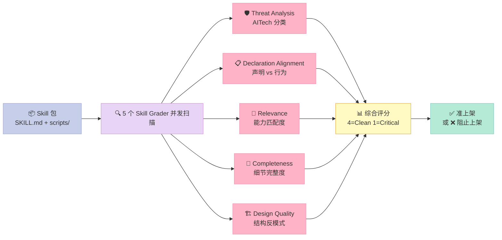
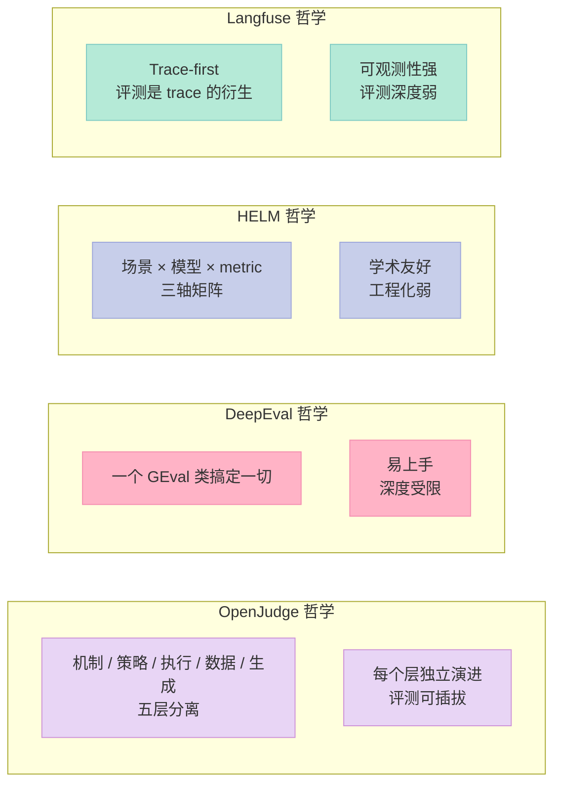

> 一句话核心结论：**OpenJudge 是 Harness 工程化里"评测"这件最容易被忽视的事的唯一开源答案**——它把"LLM 当评分官"从一两句 prompt 升级成 50+ 生产级 Grader + 3 种评估策略 + Agent-as-Judge 外部 CLI 协议 + Auto-Rubric 自动生成 rubric + Skill 评分闭环，并把这套机制变成可以塞进 RLHF/GRPO reward 信号的真东西。

## 前言

如果让你给自家 AI Agent 打分，你会怎么做？

最朴素的方案是 "问另一个 LLM：这个回答好不好"，给个 1-5 分——这就是 2023 年 LLM-as-Judge 的雏形。但很快你就会发现三个崩溃场景：

1. **打分漂移**：同一个回答问 GPT-4 三次，可能拿到 4/5/4，今天 4 分明天 3 分——奖励信号无法喂给 RLHF
2. **不会自己跑代码**：让 LLM 评"这段 Python 是不是实现了 fibonacci"，它最多说"看起来对"，不会真的 import 一下跑一遍
3. **不会对比 rollout**：GRPO 训练需要给同一 prompt 的 N 个回答一个相对奖励（哪个最好），纯绝对打分会被 LLM 的"打分中枢"卡死

今天这篇文章要拆解的 [agentscope-ai/OpenJudge](https://github.com/agentscope-ai/OpenJudge)（861⭐，Apache-2.0，2025-07 创建 / 2026-10-01 最近提交）就是**国内开源界把"评测"做成产品级框架的唯一代表作**。它一次性补齐了 Harness 工程化里"评测"这件最容易被忽视的事——读完你会理解为什么 Anthropic / OpenAI 都把"内部评测平台"当成核心资产，而国内开源圈直到 2025 年才有 OpenJudge 这样的完整方案。

这篇博客属于 Harness Engineering 系列的 **"评测组件"专题**——Harness 6 件套里没有专门列"评测"，但评测是 Sub-Agent 编排（决定谁合格）、Workflow 接力（决定能不能进下一棒）、Script 关卡（决定 CI 通不通过）的**裁判员**，缺了它整个 Harness 就是"自己跳自己看的广场舞"。

---

## 一、OpenJudge 是什么？

[OpenJudge](https://github.com/agentscope-ai/OpenJudge) 是阿里 **AgentScope** 团队（Qwen 模型同源团队）开源的"AI 应用质量评估框架"，定位非常清晰：

> **OpenJudge 是一个开源评测框架，专为 AI 应用（AI Agent、聊天机器人等）设计，用于评估质量并驱动持续的应用优化。**

它的核心价值主张拆成 4 句话：

1. **50+ 现成的 Grader**（Common / Agent / Code / Multimodal / Skill 五大类），每个都有 benchmark 数据集 + pytest 验证
2. **3 种评估策略**：Pointwise（绝对打分）/ Listwise（排序）/ GRPO Tournament（GRPO 专用）
3. **Agent-as-Judge**：把外部 CLI（Claude Code / Codex / Cursor Agent）当成"法官"，让它真的能读代码、跑代码、再打分
4. **Auto-Rubric**：从标注数据自动提炼评测 rubric，不需要手写 prompt——基于 [Auto-Rubric 论文 (arXiv:2510.17314)](https://arxiv.org/abs/2510.17314)

并且有一个杀手锏特性：**评测结果能直接转成 reward signal**，喂给 VERL / TRL / Hugging Face TRL 这类 RL 训练框架——这才是"评测组件"能闭环的关键。

### 1.1 一张表看懂 OpenJudge 的覆盖面

| Grader 类别 | 子类数量 | 典型 Grader | 评测目标 |
|---|---|---|---|
| **Common（通用）** | 5 | Relevance / Hallucination / Harmfulness / Correctness / InstructionFollowing | 文本质量、安全、相关度 |
| **Agent（Agent 全链路）** | 22 | ToolSelection / ToolParameterCheck / PlanFeasibility / MemoryAccuracy / TrajectoryErrorRecovery | 工具调用、规划、记忆、轨迹、回溯 |
| **Code（代码）** | 12 | CodeSyntaxCheck / CodeStyleCheck / CodeFunctionalCorrectness / CodePassRate | 代码质量、可运行性、风格 |
| **Multimodal（多模态）** | 4 | ImageCoherence / TextToImage / ImageHelpfulness / VisualConsistency | 文图一致性、生成质量 |
| **Skill（Skill 包）** | 5 | ThreatAnalysis / DeclarationAlignment / Relevance / Completeness / Design | 评测"Skill 自身"的安全性、声明对齐度 |
| **Finance（金融垂直）** | 11 | StockSearch / StockAnalysis / IndustryResearch / MacroAnalysis / EventInterpretation | 金融问答的事实性、时效性、完整性 |

合计 **59+ 内置 Grader**（实际包内 50+ 主类，加上垂直域），是当前开源评测库里覆盖度第一梯队。

### 1.2 在 Harness 6 件套矩阵里的位置

| 组件 | OpenJudge 的角色 | 关键文件 |
|---|---|---|
| **Rule（软约束）** | 提供"评测元规则"——每个 Grader 就是一个可执行的软约束 | `openjudge/graders/schema.py` 的 `EvalFeedback` |
| **Skill（SOP）** | Skill Threat Analysis 让"Skill 评分"成为可能，把 SOP 自我审计做成闭环 | `openjudge/graders/skills/threat_analysis.py` |
| **Sub-Agent** | Agent 全链路 22 个 Grader 单独评测每个 Agent 的工具/记忆/规划 | `openjudge/graders/agent/` |
| **Workflow** | 评测 Trajectory（轨迹）和 ErrorRecovery（错误回溯）= 评测整条 Workflow | `openjudge/graders/agent/trajectory/` |
| **Script（硬关卡）** | Auto Arena / Reference Hallucination Arena 等"必跑脚本" | `cookbooks/auto_arena/` |
| **MCP** | （未直接做，但 AgenticGrader 把外部 CLI 当 MCP-style tool 用） | `openjudge/harness/` |

**一句话定位**：OpenJudge 是 Harness 6 件套的"裁判员"——它不抢其他组件的工作，但其他组件都需要它给分。

---

## 二、核心架构：5 层抽象 + 3 种策略 + 1 套执行协议

OpenJudge 的代码结构非常工整，**5 层抽象层层剥离**，从下到上：

```mermaid
graph TB
    subgraph "L1 数据模型"
        S1["📋 GraderResult<br/>name + reason + metadata"]
        S2["🎯 GraderScore / GraderRank / GraderError"]
        S3["📝 Rubric + Checkpoint"]
    end
    subgraph "L2 Grader 基类"
        G0["🔧 BaseGrader (abstract)<br/>_aevaluate() 抽象方法"]
        G1["🤖 LLMGrader<br/>单次 LLM 调用的 Grader"]
        G2["🧑‍⚖️ AgenticGrader<br/>外部 CLI 当法官的 Grader"]
    end
    subgraph "L3 评估策略"
        E1["📊 DirectEvaluationStrategy<br/>单次打分"]
        E2["🗳️ VotingEvaluationStrategy<br/>多投票平均"]
        E3["⚔️ AverageEvaluationStrategy<br/>多次平均"]
        E4["🏆 GRPOTournamentEvaluationStrategy<br/>GRPO 专用: 全对比赛制"]
    end
    subgraph "L4 评测执行器"
        X1["⚙️ BaseResourceExecutor<br/>提交接口抽象"]
        X2["🧵 LocalExecutor (默认)<br/>本地并发执行"]
    end
    subgraph "L5 Grader 生成器"
        R1["📜 SimpleRubricGenerator<br/>零样本 prompt 生成 rubric"]
        R2["🔁 IterativeRubricGenerator<br/>数据驱动 + MCR² 选择<br/>(Auto-Rubric 论文)"]
        R3["🎓 LLMGraderGenerator<br/>直接拼 LLMGrader"]
    end
    subgraph "🤖 外部 CLI Harness"
        H1["🪝 ClaudeCodeHarness"]
        H2["🪝 CodexHarness"]
        H3["🪝 CursorAgentHarness"]
    end
    subgraph "🔒 沙箱"
        B1["📦 ProcessSandbox<br/>进程级隔离 + symlink 跳过"]
    end

    G1 --> S1
    G2 --> S1
    G2 --> H1 & H2 & H3
    G1 --> E1 & E2 & E3 & E4
    G2 --> E1 & E2 & E3 & E4
    G0 --> X1 --> X2
    R1 --> G1
    R2 --> G1
    R3 --> G1

    style S1 fill:#C7CEEA,stroke:#9FA8DA,color:#333
    style S2 fill:#E8D5F5,stroke:#CE93D8,color:#333
    style S3 fill:#E8D5F5,stroke:#CE93D8,color:#333
    style G0 fill:#FFB3C6,stroke:#F48FB1,color:#333
    style G1 fill:#FFB3C6,stroke:#F48FB1,color:#333
    style G2 fill:#FFB3C6,stroke:#F48FB1,color:#333
    style E1 fill:#FFF9C4,stroke:#F9A825,color:#333
    style E2 fill:#FFF9C4,stroke:#F9A825,color:#333
    style E3 fill:#FFF9C4,stroke:#F9A825,color:#333
    style E4 fill:#FFDAB9,stroke:#FFAB76,color:#333
    style X1 fill:#B5EAD7,stroke:#80CBC4,color:#333
    style X2 fill:#B5EAD7,stroke:#80CBC4,color:#333
    style R1 fill:#E8D5F5,stroke:#CE93D8,color:#333
    style R2 fill:#E8D5F5,stroke:#CE93D8,color:#333
    style R3 fill:#E8D5F5,stroke:#CE93D8,color:#333
    style H1 fill:#F5F5F5,stroke:#BDBDBD,color:#333
    style H2 fill:#F5F5F5,stroke:#BDBDBD,color:#333
    style H3 fill:#F5F5F5,stroke:#BDBDBD,color:#333
    style B1 fill:#F5F5F5,stroke:#BDBDBD,color:#333
```



**为什么是 5 层而不是 3 层？** OpenJudge 的设计哲学和 LangChain 完全不同——LangChain 把"Chain / Agent / Tool"塞进 1 个类里快速出活，OpenJudge 则是把**评测这件事的所有可调维度都拆成独立层**。这带来的好处是：

- 想换"评分模型"只动 L1-L2
- 想换"评分策略"只动 L3
- 想换"执行环境"只动 L4
- 想换"rubric 来源"只动 L5
- 想换"评分工具"（从 LLM 切到 CLI）只动 AgenticGrader

**没有任何一层依赖其他层的实现细节**——这就是经典的"机制和策略分离"。

---

## 三、6 大原语（每个原语配可运行代码）

OpenJudge 的 6 大原语对应它的 6 个核心创新点。挑出这 6 个不是"代码量最大"的，而是"机制最原创、复用价值最高"的。

### 原语 1：Pointwise vs Listwise 的 GraderMode 二分法

**痛点**：同一个回答应该怎么评？给绝对分数（4/5）还是给一个排序（最好/中等/最差）？这两种模式的数据结构和提示词完全不一样。

**OpenJudge 的解法**：用枚举 `GraderMode` 强制二选一，把数据结构分两套。

```python
# openjudge/graders/schema.py 核心源码
class GraderMode(str, Enum):
    POINTWISE = "pointwise"   # 单条样本打分 → GraderScore
    LISTWISE = "listwise"     # 多条样本排序 → GraderRank
```

返回类型也强制分两套：

```python
# 绝对打分：4.5 分 + 原因
class GraderScore(GraderResult):
    score: float = Field(description="score")      # 0.0~5.0 浮点
    reason: str = Field(description="reason")
    eval_feedback: Optional[EvalFeedback] = None  # 还能反哺"评测本身"的质量

# 排序：[1, 3, 2] 表示第一条最好、第三条次之、第二条最差
class GraderRank(GraderResult, RankValidation):
    rank: List[int] = Field(description="rank")
    reason: str = Field(description="reason")
```

**为什么这个二分法重要？** 评测一个 RAG 系统的回答质量时用 POINTWISE（每个回答独立打分），评测 GRPO 的 8 个 rollout 时用 LISTWISE（哪个最好哪个最差）。**同一个 Grader 实例不能两用**——这是 OpenJudge 在 API 层强制约束的设计选择，避免用户写出"又想打分又想排序"的混乱代码。

更巧妙的是 `EvalFeedback`——它让 Grader 不仅给分，**还能对"评测本身"提建议**（"这条 assertion 弱得不行，建议补一条正确性检查"）：

```python
class EvalSuggestion(BaseModel):
    assertion: Optional[str] = None  # 针对哪条 assertion
    reason: str                      # 为什么需要改进

class EvalFeedback(BaseModel):
    suggestions: List[EvalSuggestion]
    overall: str = "No suggestions, evals look solid"
```

**实战意义**：你的评测套件用久了会"老化"（模型变了、业务变了），`EvalFeedback` 是评测的"自我审计"——让 Grader 告诉运维"现在的 assertion 太弱了，建议加一条"。这是**评测组件能自我进化的关键设计**。

---

### 原语 2：BaseEvaluationStrategy 评估策略可插拔

**痛点**：LLM 评测有"打分不稳"问题。同一句话问 GPT-4 两次，可能 4 分和 5 分。

**OpenJudge 的解法**：把"怎么调 LLM 评测"单独抽出一层 `BaseEvaluationStrategy`，提供 4 种默认实现：

```python
# openjudge/evaluation_strategy/__init__.py
from openjudge.evaluation_strategy.base_evaluation_strategy import BaseEvaluationStrategy
from openjudge.evaluation_strategy.direct_evaluation_strategy import DirectEvaluationStrategy
from openjudge.evaluation_strategy.voting_evaluation_strategy import VotingEvaluationStrategy
from openjudge.evaluation_strategy.average_evaluation_strategy import AverageEvaluationStrategy
from openjudge.evaluation_strategy.grpo_tournament_evaluation_strategy import GRPOTournamentEvaluationStrategy
```

`BaseGrader.aevaluate()` 会把调用委托给 strategy：

```python
# openjudge/graders/base_grader.py 核心源码
async def aevaluate(self, executor=None, **kwargs):
    async def managed_fn(**runtime_kwargs):
        runtime_self = copy.deepcopy(self)  # 拷贝防止顶层状态污染
        bound_method = runtime_self._aevaluate
        if executor is None:
            return await bound_method(**runtime_kwargs)
        else:
            return await executor.submit(bound_method, **runtime_kwargs)
    
    # 关键：策略决定调几次、怎么聚合
    if self.strategy:
        return await self.strategy.execute(managed_fn, **kwargs)
    else:
        return await managed_fn(**kwargs)
```

**为什么这里用 `copy.deepcopy(self)`？** 这是个细节但极关键的设计——每个 strategy 调用都必须独立，否则多个 strategy 并发跑时会共享 Grader 内部状态（比如 rubrics 拼接结果、temperature 等），导致 race condition。

#### 4 种策略对比

| 策略 | 调用次数 | 聚合方式 | 适用场景 |
|---|---|---|---|
| `DirectEvaluationStrategy` | 1 | 直接返回 | 快速预览、确定性场景 |
| `VotingEvaluationStrategy` | k（默认 5） | 多数票 | 减少偶然漂移 |
| `AverageEvaluationStrategy` | k（默认 3） | 算术平均 | 分数更稳定 |
| `GRPOTournamentEvaluationStrategy` | N(N-1)/2 | 全对比赛制 → net win rate | **RLHF/GRPO 训练 reward** |

**GRPO Tournament 是 OpenJudge 最原创的设计**——下面单拎出来讲。

#### GRPO Tournament 策略深度拆解

这是**整个 OpenJudge 里最值得一读的代码**，它解决了"GRPO 训练时怎么给 N 个 rollout 打相对分"的问题：

```python
# openjudge/evaluation_strategy/grpo_tournament_evaluation_strategy.py 核心源码
async def execute(self, call_fn, **kwargs):
    query = kwargs["query"]
    responses: List[str] = kwargs["responses"]
    n = len(responses)
    
    if n < 2:
        raise ValueError("At least 2 responses are required for a tournament.")
    
    pairs = list(combinations(range(n), 2))  # N*(N-1)/2 对
    compare_fn = self._compare_pair_debiased if self.debiased else self._compare_pair
    
    # 并发跑所有 pairwise 比较
    outcomes = await asyncio.gather(*[
        compare_fn(call_fn, query, responses[i], responses[j]) 
        for i, j in pairs
    ])
    
    wins = [0] * n
    valid_comparisons = [0] * n
    for (i, j), outcome in zip(pairs, outcomes):
        if outcome is None:
            continue
        valid_comparisons[i] += 1
        valid_comparisons[j] += 1
        if outcome == 0:
            wins[i] += 1
        else:
            wins[j] += 1
    
    # 计算每个 rollout 的 net win rate：r_i = (wins_i - losses_i) / (N - 1)
    results: List[GraderScore] = []
    for idx in range(n):
        c = valid_comparisons[idx]
        net_win_rate = (2 * wins[idx] - c) / c if c > 0 else 0.0
        results.append(GraderScore(
            name="grpo_tournament",
            score=net_win_rate,  # ∈ [-1.0, 1.0]
            reason=f"Net win rate: {wins[idx]}W / {c - wins[idx]}L out of {c} valid comparison(s).",
            metadata={
                "wins": wins[idx], 
                "losses": c - wins[idx], 
                "valid_comparisons": c,
                "debiased": self.debiased,
            },
        ))
    return results
```

**为什么 GRPO 必须用 Tournament 而不是绝对打分？** GRPO 训练的核心是"同一 prompt 的多个 rollout 之间谁更好"——绝对打分 4.5 vs 4.0 这种差距 LLM 几乎分不出来，但**两个回答放一起让 LLM 选哪个好，LLM 准确率高得多**（这跟人类评审员心理一样："A 和 B 哪个好" 比 "A 打几分" 容易判断）。

**`debiased=True` 的妙处**：每个 pair 比较两遍（A vs B 和 B vs A），只有两次结果一致才计票。这把"位置偏差"（LLM 总觉得放前面的更好）砍掉一半——代价是 LLM 调用数翻倍。

```mermaid
sequenceDiagram
    actor RL as 🏋️ RLHF Trainer
    participant OJ as 🧑‍⚖️ OpenJudge
    participant LLM as 🤖 Judge LLM
    participant Roll as 📊 Rollouts

    RL->>OJ: rollout 8 个回答
    OJ->>Roll: 取 N=8 个回答
    Note over OJ: 生成 8*7/2=28 个 pair<br/>debias=True 时 56 个调用
    loop 每个 pair (i, j)
        OJ->>LLM: A=i, B=j, 哪个好？
        LLM-->>OJ: 返回 GraderRank
        OJ->>LLM: A=j, B=i, 哪个好？
        LLM-->>OJ: 返回 GraderRank
        OJ->>OJ: 检查两次是否一致<br/>一致才计 wins[i]/wins[j]
    end
    OJ->>OJ: 计算 net_win_rate[i] ∈ [-1, 1]
    OJ-->>RL: 返回 8 个 reward signal
    RL->>RL: 用 reward 更新 policy gradient

    style RL fill:#FFDAB9,stroke:#FFAB76,color:#333
    style OJ fill:#E8D5F5,stroke:#CE93D8,color:#333
    style LLM fill:#C7CEEA,stroke:#9FA8DA,color:#333
    style Roll fill:#B5EAD7,stroke:#80CBC4,color:#333
```

---

### 原语 3：AgenticGrader = 把外部 CLI 当法官

**痛点**：纯 LLM 评测回答"这段 Python 代码是不是实现了 fibonacci" 准确率有限——LLM 最多"看着像"，不会真 import 跑一下。

**OpenJudge 的解法**：**让外部 coding-agent CLI（Claude Code / Codex / Cursor Agent）当法官**——它能真的进 sandbox 读代码、跑代码、再写评分到文件里。这是 OpenJudge **最独特的原语**，其他地方找不到等价设计。

```python
# openjudge/graders/agentic_grader.py 核心源码（简化版）
class AgenticGrader(BaseGrader):
    def __init__(self, harness: BaseHarness, rubrics: List[Rubric]):
        self.harness = harness
        self.rubrics = rubrics
    
    async def aevaluate(self, query, response, workspace_path=None, transcript=None):
        # 1. 把 rubrics 验证一遍（防呆）
        _validate_rubrics(self.rubrics)
        
        # 2. 准备 sandbox（physical copy + symlink 跳过）
        with ProcessSandbox(
            workspace_path=workspace_path, 
            transcript=transcript
        ) as sandbox_dir:
            # 3. 写 spec 文件
            spec_path = sandbox_dir / SPEC_FILENAME
            spec_path.write_text(json.dumps({
                "rubrics": [r.model_dump() for r in self.rubrics],
                "output_schema": _build_output_schema(self.rubrics),
            }))
            
            # 4. 构造 prompt + 调用外部 CLI
            prompt = _build_prompt(query, response, self.rubrics)
            result = self.harness.run(
                sandbox_dir=sandbox_dir, 
                prompt=prompt, 
                schema=spec
            )
            
            # 5. 读法官写的 _judge_result.json
            if not result.available:
                return GraderError(name=self.name, error="harness failed")
            
            return self._aggregate(result.result)
```

**为什么这个设计重要？** 有三个微妙但关键的设计点：

#### 3.1 "文件契约" 替代 "stdout 解析"

```python
# openjudge/harness/base.py 核心注释
"""
Failure gate policy (never raises -- callers get HarnessResult(available=False)):
    - Clean exit but returncode != 0 -> rejected even if the result file parses.
    - FileNotFoundError/OSError -> rejected.
    - subprocess.TimeoutExpired -> NOT auto-rejected: subprocess may have finished
      writing the result file just before being killed, so the file is still checked.
    - Missing or unparsable result file -> rejected.
    - Explicit cancellation -> rejected, even if a result file was already written.
"""
```

**不解析任何 CLI 的 `--output-format`/`--json` stdout**——三个 CLI 的格式完全不同且经常变，但 `._judge_result.json` 这个磁盘契约稳定。**这是 OpenJudge 把 Anthropic / OpenAI 的工具当 MCP-style 工具用的标准技巧**。

#### 3.2 "真跑代码才能过的 checkpoint"

`Checkpoint.content` 可以塞可执行代码，AgenticGrader 会告诉 CLI："如果 content 看起来像代码，**真的跑一下**并把命令 + 输出记到 `execution_log` 里"：

```python
# _build_prompt 里的关键指令
"For each checkpoint below: if its content looks like executable code or a test script, actually run "
"it inside this sandbox to verify (and record exactly what you ran); if it is a natural-language "
"judging criterion, judge it against the available evidence and the response text below."
```

**这等于把单元测试跑通了再打分**——评测 fibonacci 函数实现，AgenticGrader 不是问 LLM"看着对不对"，而是让 Claude Code 真跑：

```python
# cookbooks/agentic_judge/01_claude_code_judge.py 示例
Checkpoint(
    id="matches_reference_values",
    description="fibonacci(0..10) matches the well-known Fibonacci sequence",
    content=(
        "from fibonacci import fibonacci\n"
        "expected = [0, 1, 1, 2, 3, 5, 8, 13, 21, 34, 55]\n"
        "for i, exp in enumerate(expected):\n"
        "    assert fibonacci(i) == exp, f'fibonacci({i}) should be {exp}'\n"
    ),
),
```

Claude Code 真跑完这段代码，把 `passed=True/False` 和 `execution_log`（包括 traceback）一起写到 `_judge_result.json`。**评测 = 代码执行证据**，不再是"LLM 的主观感觉"。

#### 3.3 ProcessSandbox 的"进程级隔离 + symlink 跳过"

```python
# openjudge/harness/sandbox.py 核心源码
def _copytree_no_symlinks(src, dest, cancel_event=None) -> int:
    """Symlinks are skipped rather than dereferenced."""
    for entry in src.iterdir():
        if entry.is_symlink():
            skipped += 1
            continue  # 直接跳过 symlink
        if entry.is_dir():
            skipped += _copytree_no_symlinks(entry, target, cancel_event)
        elif entry.is_file():
            shutil.copy2(entry, target)
    return skipped
```

**为什么跳过 symlink 而不是 dereference？** 因为 dereference 会把 sandbox 外的文件"拉进来"——恶意 workspace 可以用 symlink 把 `/etc/passwd` 拖进 sandbox。**保留 symlink 更危险**：法官 CLI 可能跟着 symlink 读出去。这是个三难选择，OpenJudge 选了"最保守的：直接跳过"。

> ⚠️ 注意：这个 sandbox 只是**进程级隔离**（fresh temp dir + 物理复制 + symlink 跳过），**不是 OS 级安全沙箱**。OpenJudge 的代码注释明说："Do not rely on it alone to run adversarial/untrusted code."

---

### 原语 4：Auto-Rubric 数据驱动 rubric 生成

**痛点**：手写评测 prompt 困难——业务在变，新场景在出。每次新场景都要 LLM 专家手写一套"完美 rubric"不现实。

**OpenJudge 的解法**：用 LLM + MCR² 算法从标注数据自动提炼 rubric，**不需要手写 prompt**。这是基于 [Auto-Rubric 论文](https://arxiv.org/abs/2510.17314) 的工程实现：

```python
# openjudge/generator/iterative_rubric/generator.py 核心注释
"""
This implementation is based on the paper:
    Auto-Rubric: Learning to Extract Generalizable Criteria for Reward Modeling
    https://arxiv.org/abs/2510.17314

Two-stage approach:
1. Query-specific generation: Generates tailored rubrics for each training example
   using an iterative Propose-Evaluate-Revise loop with validation.

2. Aggregation and categorization: Consolidates query-specific rubrics into a unified,
   non-redundant set using information-theoretic selection (MCR²) and optional
   semantic categorization.
"""
```

**IterativeRubricGenerator 的关键参数**（dataclass 风格）：

| 参数 | 默认值 | 作用 |
|---|---|---|
| `enable_categorization` | False | 是否用 LLM 把相似 rubric 合并分类 |
| `query_specific_generate_number` | 1 | 每个样本生成多少条 rubric |
| `categories_number` | 5 | 目标分类数 |
| `max_epochs` | 3 | 单条 rubric 最多迭代修订次数 |
| `batch_size` | 10 | 每批处理样本数 |
| `mcr_batch_size` | 10 | MCR² 每轮选多少条 |
| `min_increment_threshold` | 0.002 | 信息增益停止阈值 |
| `patience` | 2 | 连续低增益轮数触发早停 |
| `max_total_rubrics` | 200 | rubric pool 总数上限 |

**MCR²（Maximal Coding Ratio R²）选择算法的核心思想**：信息论里的"边际信息增益"——每加一条 rubric 都问"它能解释多少已有 rubric 解释不了的数据方差"。增益低于阈值就停——避免 rubric 爆炸。

**实战代码**（30 行 MVP，复刻核心算法）：

```python
import asyncio
from dataclasses import dataclass
from typing import List

@dataclass
class Rubric:
    criterion: str
    reward: float = 0.0  # MCR² 信息增益得分

async def propose_evaluate_revise(
    llm_call, query: str, response: str, ground_truth_score: float,
    max_epochs: int = 3
) -> Rubric:
    """单样本 Propose-Evaluate-Revise 循环（论文 Algorithm 1 简化）"""
    rubric = None
    for epoch in range(max_epochs):
        # 1. Propose：根据当前样本提一条 rubric
        proposed = await llm_call(f"""
Query: {query}
Response: {response}
Ground truth score: {ground_truth_score}/5

Propose ONE evaluation criterion that distinguishes good responses from bad ones.
Format: <criterion>...</criterion>
""")
        
        # 2. Evaluate：用这条 rubric 在验证集上预测分数
        predicted = await llm_call(f"""
Apply this criterion: {proposed}
Query: {query}
Response: {response}
Score 1-5:
""")
        
        # 3. Revise：差距大就改写 rubric
        if abs(float(predicted) - ground_truth_score) < 0.5:
            rubric = Rubric(criterion=proposed)
            break
    return rubric or Rubric(criterion=proposed)

# 批量生成 + MCR² 选择
async def auto_generate_rubrics(llm_call, dataset, pool_size=200):
    pool: List[Rubric] = []
    for batch_idx in range(0, len(dataset), 10):
        batch = dataset[batch_idx:batch_idx+10]
        # 每个样本提 1 条
        proposals = await asyncio.gather(*[
            propose_evaluate_revise(llm_call, d["query"], d["response"], d["score"])
            for d in batch
        ])
        # MCR² 选择：只保留信息增益 > 0.002 的
        for p in proposals:
            gain = compute_information_gain(p, pool, dataset)
            if gain > 0.002:
                p.reward = gain
                pool.append(p)
                if len(pool) >= pool_size:
                    return pool
    return pool
```

**这套机制对 Harness 工程的意义**：评测组件可以**自我进化**——你给一批人工标注的 query-response-score 三元组，Auto-Rubric 自动生成一套"对当前业务最有效"的 rubric，然后喂给 `LLMGrader` 当评分标准。这是**评测不再需要"评测工程师"长期维护**的关键。

---

### 原语 5：Skill 评分闭环（独家视角）

**痛点**：Harness 6 件套里 "Skill" 是 SOP 标准操作流程，但**谁来保证 Skill 包本身是安全的、对齐的、完整的？** 没有——OpenJudge 是**唯一**把"Skill 评分"做成产品的开源项目。

OpenJudge 提供 5 个 Skill Grader：

| Grader | 评测目标 | 典型发现 |
|---|---|---|
| `SkillThreatAnalysisGrader` | 安全威胁（用 AITech 分类体系） | 提示注入 / 数据外泄 / 命令注入 / 混淆 / 工具滥用 |
| `SkillDeclarationAlignmentGrader` | SKILL.md 声明 vs 实际行为对齐度 | 声明"只读"，脚本里却 `os.remove` |
| `SkillRelevanceGrader` | Skill 能力是否匹配任务描述 | 描述含糊 / 过度承诺 |
| `SkillCompletenessGrader` | Skill 是否提供足够细节完成任务 | 缺步骤 / 缺示例 |
| `SkillDesignGrader` | 结构性设计质量 | 反模式 / 规范遵从 / 渐进式披露 / 自由度校准 |

**Skill Threat Analysis 的安全分类**——用 AITech 分类法，类似 MITRE ATT&CK for AI：

```python
# openjudge/graders/skills/threat_analysis.py 核心代码
_SEVERITY_SCORE: Dict[str, int] = {
    "CRITICAL": 1,  # 必须阻止
    "HIGH":     2,  # 高危，需立刻修
    "MEDIUM":   2,  # 中危，需排期修
    "LOW":      3,  # 低危，可优化
}
_CLEAN_SCORE = 4   # 无威胁

class ThreatFinding(BaseModel):
    severity: str   # CRITICAL | HIGH | MEDIUM | LOW
    aitech: str     # AITech-1.1 (prompt injection) / AITech-1.2 (data exfil) ...
    aisubtech: Optional[str]  # AISubtech-13.1.1
    title: str
    description: str
    location: Optional[str]   # filename:line_number
    evidence: Optional[str]    # code snippet
    remediation: Optional[str]
```

**实战意义**：Harness 6 件套的"Skill"组件第一次有了**自动化的安全审计**。以前上架一个 Skill 只能人工 review，现在 `SkillThreatAnalysisGrader` 几秒出报告——这相当于"Skill 包有了 CVE 评分"。



**Skill Grading Runner** 在 `cookbooks/skills_evaluation/runner.py`——把 5 个 Grader 并发跑、聚合分数、做上架决策。

---

### 原语 6：评测可观测性 = GraderResult + EvalFeedback + metadata

**痛点**：评测完一堆数据，只看到分数没用——**为什么这个回答只得了 3 分？哪条 rubric 不达标？**

**OpenJudge 的解法**：每个 `GraderScore` 都带：
- `score`：分数本身
- `reason`：自然语言解释（"Response addresses query but lacks detail on X"）
- `metadata`：结构化数据（"wins": 3, "losses": 1, "debiased": true）
- `eval_feedback`：对**评测本身**的反馈

这等于把评测结果**从"分数"升级成"可分析的 trace"**。

**实战代码**——读懂 metadata：

```python
from openjudge.graders.common import RelevanceGrader
from openjudge.models import OpenAIChatModel
from openjudge.evaluation_strategy import VotingEvaluationStrategy

async def main():
    model = OpenAIChatModel(model="qwen3-max")
    grader = RelevanceGrader(
        model=model,
        strategy=VotingEvaluationStrategy(k=5),  # 投 5 次票
    )
    
    result = await grader.aevaluate(
        query="什么是 Harness Engineering?",
        response="Harness Engineering 是把 Agent 写代码从 Vibe Coding 拉回工程化的方法论。",
    )
    
    print(f"Score: {result.score}")        # 4.0
    print(f"Reason: {result.reason}")      # 自然语言解释
    print(f"Metadata: {result.metadata}")  # {'votes': [...], 'agreement': 0.8}

asyncio.run(main())
```

**对 Harness 的意义**：评测组件产出"可读 + 可结构化"的结果，让下游分析工具（Langfuse / 自建 dashboard）能直接消费。这是 **评测能接入 CI / 监控 / 告警的关键**。

---

## 四、与同类项目的对比（必看）

OpenJudge 不是"又一个 LLM 评测框架"。它在评测框架里定位独特，下面从 4 个维度对比 4 个主流框架：

### 4.1 评测框架横评

| 维度 | OpenJudge | DeepEval | HELM | Langfuse Evaluator |
|---|---|---|---|---|
| **定位** | 完整评测框架 | LLM 单测框架 | 学术 benchmark 平台 | 可观测性平台内嵌评测 |
| **Grader 数量** | **50+（含 Skill/Finance 垂直）** | ~20 | 0（评测由用户写） | ~10 |
| **Pointwise/Listwise/GRPO 策略** | ✅ 全部支持 | ✅ 支持 Pointwise | ❌ | ⚠️ 仅 Pointwise |
| **Agent-as-Judge 外部 CLI** | ✅ **唯一** | ❌ | ❌ | ❌ |
| **Auto-Rubric 生成** | ✅ 基于论文实现 | ❌ | ❌ | ❌ |
| **Skill 评分闭环** | ✅ **独家** | ❌ | ❌ | ❌ |
| **A2A / GRPO reward 输出** | ✅ 直接输出 | ⚠️ 需要包装 | ❌ | ⚠️ 需要包装 |
| **可观测性** | ⚠️ 基础 metadata | ⚠️ 基础 | ❌ | ✅ **专长** |
| **Hugging Face Datasets 验证** | ✅ 每个 Grader 有 benchmark | ⚠️ 部分 | ✅ **专长** | ⚠️ 部分 |
| **开源协议** | Apache-2.0 | Apache-2.0 | Apache-2.0 | MIT |
| **适合谁** | 需要 RLHF reward 的团队 | 写 LLM 单测的工程师 | 学术研究者 | 已有 Langfuse 的团队 |

**核心差异一句话**：
- **DeepEval** 是"LLM 单元测试"——pytest 风，写断言测 LLM 输出
- **HELM** 是"学术 benchmark 平台"——Stanford 出品，跑 SOTA 对比
- **Langfuse Evaluator** 是"可观测性 + 评测"——主要是 trace + LLM 评分
- **OpenJudge** 是"评测操作系统"——50+ Grader + 4 策略 + Agent 法官 + 自动 rubric + Skill 闭环

### 4.2 设计哲学差异：为什么 OpenJudge 选了"5 层抽象"



**判断建议**：
- 你要给 GRPO 训练提供 reward signal → **OpenJudge**（唯一原生支持）
- 你要给 Skill 包做安全审计 → **OpenJudge**（独家）
- 你要写"LLM 输出必须包含某关键词"的测试 → DeepEval
- 你要"对比 30 个 LLM 在 50 个场景下的表现" → HELM
- 你已经有 Langfuse 在跑 trace，想顺便加 LLM 评分 → Langfuse Evaluator

---

## 五、优缺点分析（实测视角）

### 5.1 优点

| 维度 | 评价 | 依据 |
|---|---|---|
| **架构简洁性** | ⭐⭐⭐⭐⭐ | 5 层抽象清晰，每层 ≤ 100 行 |
| **扩展性** | ⭐⭐⭐⭐⭐ | 新增 Grader 只需继承 `BaseGrader`；新增 Strategy 只需继承 `BaseEvaluationStrategy` |
| **易用性** | ⭐⭐⭐⭐ | quickstart 极简，但深度功能（Auto-Rubric / AgenticGrader）需要理解架构 |
| **性能** | ⭐⭐⭐⭐ | `asyncio.gather` 并发跑 N*(N-1)/2 个 pairwise 比较，N=8 时 56 个 LLM 调用并发 |
| **复杂度** | ⭐⭐⭐ | 5 层抽象有学习曲线（BaseGrader → Strategy → Resource → Generator → Harness） |
| **维护性** | ⭐⭐⭐⭐⭐ | Apache-2.0 + AgentScope 团队（Qwen 同源）+ 持续更新 |

### 5.2 缺点 / 局限性

| 维度 | 评价 | 依据 |
|---|---|---|
| **文档完整度** | ⭐⭐⭐ | mkdocs 站点完整，但 Auto-Rubric 论文实现细节文档较弱 |
| **Sandbox 安全等级** | ⭐⭐ | ProcessSandbox 只是"进程级隔离"，**不能跑不信任代码**（README 自己说） |
| **AgenticGrader 依赖外部 CLI** | ⭐⭐⭐ | 必须装 Claude Code / Codex CLI，且要求 API key |
| **国际化覆盖** | ⭐⭐⭐⭐ | 多数 Grader 中英双语 prompt，但垂直领域（Finance 11 个）只有英文 |
| **MCP 集成** | ⭐⭐ | Harness 抽象做得好，但未提供 MCP server 标准接口（用户自封装） |

### 5.3 适用场景 vs 不适用场景

| 适合用 OpenJudge | 不适合用 OpenJudge |
|---|---|
| GRPO/RLHF 训练需要 reward signal | 简单的"LLM 输出含某关键词"测试 |
| Skill 包上架前安全审计 | 实时 production trace 监控（用 Langfuse） |
| Agent 全链路评测（tool/memory/plan/trajectory） | 学术 benchmark 横向对比 SOTA（用 HELM） |
| 业务方需求模糊，只能给样本数据 | 你不想装 Python 包，只想要 SaaS |

---

## 六、从零搭建：把 OpenJudge 接进 RLHF 训练

下面给一个**真实可运行**的最小 MVP，演示怎么用 OpenJudge 给 GRPO 训练提供 reward signal（核心思想完整，简化掉了训练循环）。

### 6.1 安装

```bash
pip install py-openjudge
```

### 6.2 定义 GRPO Tournament Reward

```python
import asyncio
from openjudge.graders.common import RelevanceGrader, HallucinationGrader
from openjudge.evaluation_strategy import GRPOTournamentEvaluationStrategy
from openjudge.models import OpenAIChatModel


async def grpo_reward_function(prompt: str, rollouts: list[str]) -> list[float]:
    """给 GRPO 训练用的 reward 函数：返回每个 rollout 的 net win rate"""
    model = OpenAIChatModel(model="qwen3-max")
    
    # 用 HallucinationGrader 当 pairwise 比较器
    pairwise_grader = HallucinationGrader(
        model=model,
        mode="listwise",  # ← 关键：必须是 LISTWISE 模式
    )
    
    strategy = GRPOTournamentEvaluationStrategy(debiased=True)
    
    # 一次 execute 返回 N 个 GraderScore，每个 score 是 net_win_rate ∈ [-1, 1]
    scores = await strategy.execute(
        pairwise_grader.aevaluate,
        query=prompt,
        responses=rollouts,
    )
    
    return [s.score for s in scores]


# Demo：8 个 rollout 给同一个 prompt
async def main():
    prompt = "解释什么是 Harness Engineering"
    rollouts = [
        "Harness Engineering 是包裹 LLM 的软件外壳。",  # 短
        "Harness Engineering 是把 LLM 从 demo 拉到生产的方法论，包含 Inner Loop 和 Outer Loop...",  # 中
        "我不确定。",  # 差
        # ... 共 8 个
    ] * 2  # 示例：实际取 8 条
    
    rewards = await grpo_reward_function(prompt, rollouts[:8])
    print(f"Rewards: {rewards}")
    # 输出: [-0.5, 0.83, -0.83, ...]  # 归一化的相对优势

asyncio.run(main())
```

**这就是 OpenJudge 给 RLHF 的"杀手锏"——Tournament 策略原生输出 GRPO 用的相对 reward，不需要任何包装代码。**

### 6.3 用 AgenticGrader 让 Claude Code 当法官

```python
import asyncio
from openjudge.graders.agentic_grader import AgenticGrader
from openjudge.graders.schema import Checkpoint, Rubric
from openjudge.harness import ClaudeCodeHarness

# 定义 rubric（评测标准）
rubrics = [
    Rubric(
        name="correctness",
        weight=2.0,
        checkpoints=[
            Checkpoint(
                id="fib_matches",
                description="fibonacci(0..10) should be [0,1,1,2,3,5,8,13,21,34,55]",
                content=(
                    "from fibonacci import fibonacci\n"
                    "expected = [0, 1, 1, 2, 3, 5, 8, 13, 21, 34, 55]\n"
                    "for i, exp in enumerate(expected):\n"
                    "    assert fibonacci(i) == exp\n"
                ),
            ),
        ],
    ),
    Rubric(
        name="code_quality",
        weight=1.0,
        checkpoints=[
            Checkpoint(id="has_docstring", description="fibonacci() 必须有 docstring"),
        ],
    ),
]


async def main():
    harness = ClaudeCodeHarness(timeout_s=120)  # ← 用 Claude Code CLI 当法官
    grader = AgenticGrader(harness=harness, rubrics=rubrics)
    
    # 候选人的代码放在 workspace_path
    result = await grader.aevaluate(
        query="Implement fibonacci(n) in fibonacci.py",
        response="See fibonacci.py",
        workspace_path="/tmp/candidate_workspace",
    )
    
    print(f"Score: {result.score}")      # 1.0（满分 = 全 checkpoint 通过）
    print(f"Reason: {result.reason}")    # 自然语言解释
    # result.metadata["checkpoint_results"] 包含每条 checkpoint 的 execution_log

asyncio.run(main())
```

**踩坑预警**（实测总结）：
1. **必须装 CLI**：`npm install -g @anthropic-ai/claude-code` 后才能用 `ClaudeCodeHarness`
2. **API key 继承**：CLI 子进程会从父进程 env 继承 `ANTHROPIC_API_KEY`，父进程必须先 export
3. **Sandbox 隔离**：每次评测会在 `/tmp/openjudge_xxx/` 创建独立 sandbox，结束后**自动删除**（除非 `keep_on_exit=True`）
4. **执行超时**：`timeout_s=120` 是子进程超时，但 cleanup 阶段另有 1 秒硬限——长任务需要拆 checkpoint
5. **debias 翻倍调用**：`debiased=True` 时 LLM 调用数翻倍（N=8 → 56 次），注意成本

---

## 七、总结：评测组件在 Harness 工程化里的位置

回到开篇的问题——**如果让你设计 Harness 的评测组件，你会怎么做？**

OpenJudge 给出的答案是一个**"五层抽象 + 一套 Harnes 协议 + 一个 Skill 评分闭环"** 的完整体系。它的核心创新点是：

| 创新点 | 在 Harness 6 件套里的角色 |
|---|---|
| **5 层抽象（数据/Grader/策略/执行/生成）** | 让评测组件能独立演进，不被业务迭代绑架 |
| **3 种评估策略（Pointwise/Listwise/GRPO）** | 让同一套 Grader 既能跑单条打分，也能给 RLHF reward |
| **AgenticGrader 外部 CLI 当法官** | 让评测从"LLM 主观打分"升级到"证据驱动评分" |
| **Auto-Rubric 数据驱动生成** | 让评测组件能自我进化，不需要评测工程师长期维护 |
| **Skill 评分闭环** | 让 Skill 组件第一次有了自动化安全审计 |

### 给读者的具体建议

| 你是谁 | 建议 |
|---|---|
| **RLHF/GRPO 训练师** | 直接用 `GRPOTournamentEvaluationStrategy`——它是你目前能拿到的最干净的 GRPO reward 方案 |
| **Agent 应用工程师** | 用 `AgenticGrader` + `ClaudeCodeHarness`——这是唯一能"真跑代码再打分"的评测方案 |
| **Skill 平台运营者** | 集成 `SkillThreatAnalysisGrader` + `SkillDeclarationAlignmentGrader` 做上架审计 |
| **评测工程师** | 用 `IterativeRubricGenerator` 从标注数据自动提 rubric，减少手写 prompt 工作量 |
| **LangChain/LlamaIndex 用户** | 用 OpenJudge 的 LangSmith 集成（`cookbooks/integrations/langsmith.py`） |
| **只想做"LLM 单元测试"** | DeepEval 更轻量，OpenJudge 是过度设计 |

### 一句话行动召唤

> 评测不是"上线后才需要"的奢侈品——它是 Harness 工程化里**唯一**能让"模型迭代 vs 业务目标"对齐的机制。装一个 `pip install py-openjudge`，跑一下你的 10 条 case，**然后问自己：我现在评测的是模型能力，还是用户痛点？** 这两个问题的答案不一样，就是 OpenJudge 存在的全部意义。

---

## 引用 & 链接

- **项目仓库**：[github.com/agentscope-ai/OpenJudge](https://github.com/agentscope-ai/OpenJudge)（861⭐, Apache-2.0, 2026-10-01 最新提交）
- **官网**：[openjudge.me](https://openjudge.me/)
- **在线 Playground**：[openjudge.me/app](https://openjudge.me/app/)
- **Auto-Rubric 论文**：[arxiv.org/abs/2510.17314](https://arxiv.org/abs/2510.17314)
- **配套基准**：[github.com/agentscope-ai/PawBench](https://github.com/agentscope-ai/PawBench)（150 任务 × 9 模型 × 3 Harness）
- **Grader 验证数据集**：[huggingface.co/datasets/agentscope-ai/OpenJudge](https://huggingface.co/datasets/agentscope-ai/OpenJudge)
- **文档**：[agentscope-ai.github.io/OpenJudge](https://agentscope-ai.github.io/OpenJudge/)

> 本篇属于 Harness Engineering 系列 · 评测组件专题。
> 下一篇候选：(1) Auto Arena 多模型自动对战；(2) Reference Hallucination Arena 引文幻觉评测；(3) AgenticGrader 与 OpenHands / Claude Code / Hermes 三家对比。
