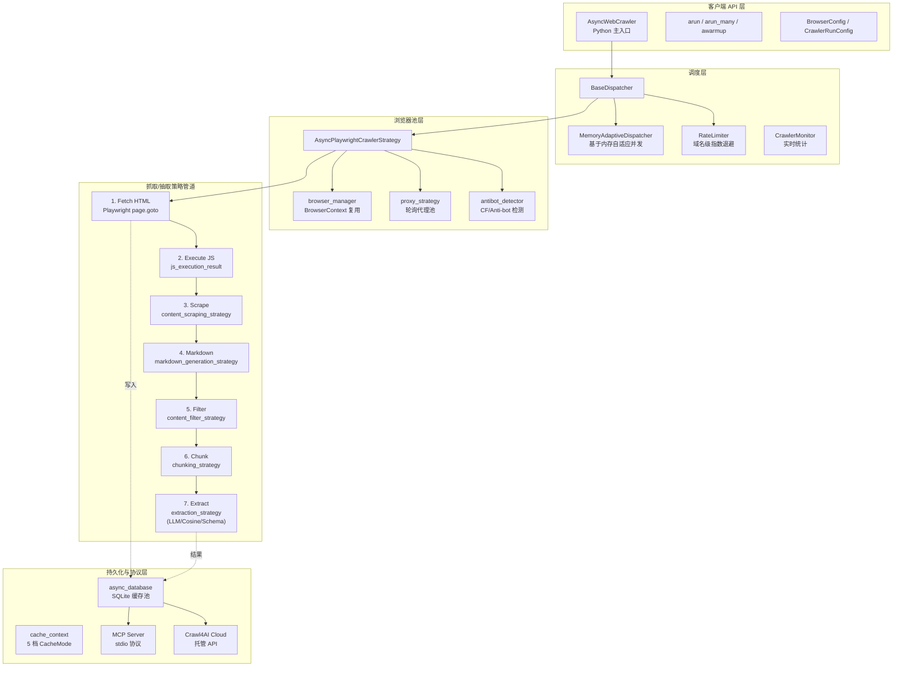
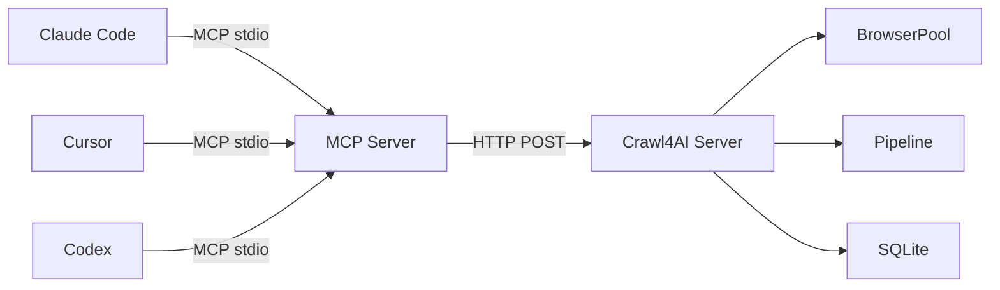
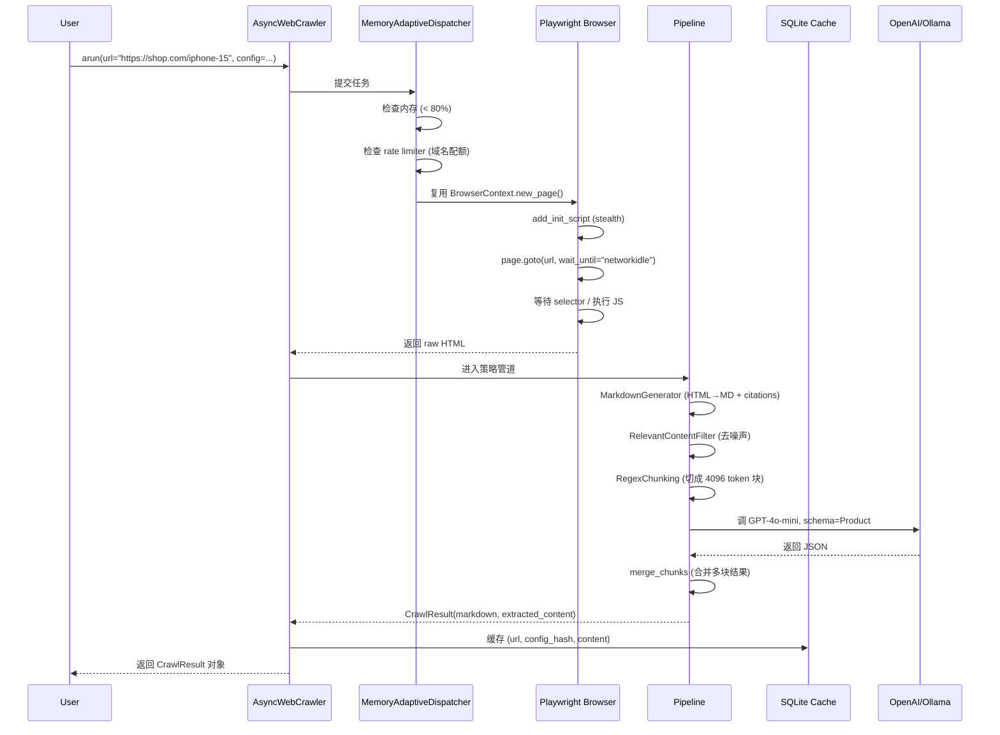

## 引子

2024 年以来，RAG 与 AI Agent 的爆发让「把网页变成干净 Markdown」从一个边缘能力迅速变成了基础设施级需求。开发者不再满足于 BeautifulSoup 的脆弱解析，而是要求爬虫能够：(a) 跑完整的 JS 渲染、(b) 输出带有引用链接的 Markdown、(c) 用 LLM 抽取结构化字段、(d) 跟上 AI Agent 的 MCP 协议。每多一个需求，传统爬虫（Scrapy、Playwright 自写脚本）就多一层 glue code。

[Crawl4AI](https://github.com/unclecode/crawl4ai)（⭐84.6k，Apache-2.0，Python）正是为解决这一痛点而生的「为 LLM 而生的爬虫」—— 它把浏览器自动化、Markdown 渲染、内容过滤、结构化抽取、反爬对抗、深度遍历、缓存、并发调度、MCP 协议，全部塞进了一个统一 API，让 Agent 开发者只需 `pip install` 一行代码就能拿到生产级抓取能力。

本文将从架构分层、核心模块、深度遍历算法、LLM 抽取、MCP 集成、并发调度六大维度深度剖析 Crawl4AI 的设计原理，并对比 Scrapy / Firecrawl / Jina Reader / Browser-Use 等同类方案，揭示它为何能在 GitHub 一年半内冲到 ⭐84k。

## 一、项目定位与核心价值

### 1.1 一句话定义

**Crawl4AI 是一个面向 LLM/Agent 的异步 Web 抓取与结构化抽取引擎，核心目标是把任意网页（无论是纯 HTML 还是 JS 渲染、SPA、动态内容）变成干净、可被 LLM 直接消费的 Markdown / JSON / 结构化字段。**

### 1.2 能力矩阵

| 维度 | Crawl4AI | 备注 |
|------|---------|------|
| 浏览器自动化 | ✅ Playwright async pool | chromium/firefox/webkit 可切换 |
| JS 渲染 | ✅ 默认 headless 渲染 | 支持自定义 JS 片段执行 |
| Markdown 输出 | ✅ 自研 `DefaultMarkdownGenerator` | 带引用链接（citations） |
| 内容过滤 | ✅ `RelevantContentFilter` (BM25/Pruning) | 过滤导航栏/广告/页脚 |
| 结构化抽取 | ✅ LLM/Cosine/LLM-with-schema/XPath | 4 种策略 |
| 反爬对抗 | ✅ Stealth mode + Proxy + UserAgent 池 | 检测被 Cloudflare 拦截自动 fallback |
| 深度遍历 | ✅ BFS / DFS / Best-First 三策略 | URL 优先级队列 |
| 缓存 | ✅ SQLite + 内容 hash + TTL | 5 档 CacheMode |
| 并发调度 | ✅ MemoryAdaptiveDispatcher | 自动根据内存调整并发 |
| MCP 服务 | ✅ 官方 MCP server | 让 Agent 通过 MCP 协议调用 |
| Docker | ✅ 官方镜像 | `crawl4ai/server` |
| License | Apache-2.0 | 商业友好 |

### 1.3 仓库统计

```text
⭐ 84,622 stars
🔱 6,800+ forks
📦 1083 文件 / 顶层 10 目录
🐍 Python 100% (核心) + TypeScript (SDK)
📜 Apache-2.0 License
🚀 v0.9.4 (2026-09-23 发布)
💾 仓库大小 151MB（含 Playwright 浏览器）
📌 最近 push: 2026-09-25（持续活跃）
```

## 二、整体架构

Crawl4AI 的整体架构可以分为 5 层：客户端 API → 调度层 → 浏览器池 → 抓取/抽取策略管道 → 持久化与协议层。



**关键架构洞察**：

1. **调度层先于浏览器层** —— `MemoryAdaptiveDispatcher` 在调用浏览器之前就根据当前内存决定并发数，避免一次性起 100 个 chromium 直接 OOM。
2. **策略管道是组合式（Composable）** —— Markdown / Filter / Chunking / Extraction 每一步都是独立 Strategy 类，可以替换或跳过。`NoExtractionStrategy`、`IdentityChunking` 就是「短路器」。
3. **持久化层透明** —— 缓存写入对用户不可见，但通过 `CacheMode`（ENABLE/BYPASS/READ_ONLY/WRITE_ONLY/FORCE）让用户精确控制。

## 三、核心引擎一：异步浏览器池

`AsyncPlaywrightCrawlerStrategy` 是爬虫的「下半身」，负责把 URL 真正变成 HTML。它在多线程/异步、浏览器复用、反爬对抗三个维度做了大量工程优化。

### 3.1 浏览器上下文复用

Crawl4AI 默认在一个 `BrowserContext` 内串行执行多次 `page.goto`，避免每次创建新 page 带来的 200-500ms 启动开销。

```python
# crawl4ai/async_crawler_strategy.py 简化示意
async def crawl(self, url: str, config: CrawlerRunConfig) -> AsyncCrawlResponse:
    # 复用 browser_context（不是新建 Browser！）
    page = await self.browser_context.new_page()
    try:
        # stealth: 注入 navigator.webdriver=false
        await page.add_init_script("""
            Object.defineProperty(navigator, 'webdriver', { get: () => undefined });
        """)
        # 配置代理 + UA
        await page.set_extra_http_headers(config.headers)
        response = await page.goto(url, wait_until=config.wait_until, timeout=config.page_timeout)
        # 等待 selector 或 JS 执行
        if config.js_code:
            await page.evaluate(config.js_code)
        if config.wait_for:
            await page.wait_for_selector(config.wait_for, timeout=config.wait_for_timeout)
        html = await page.content()
        return AsyncCrawlResponse(html=html, response=response, status_code=response.status)
    finally:
        await page.close()  # 关闭 page 但保留 context
```

### 3.2 反爬检测与降级

`antibot_detector` 模块负责识别 Cloudflare、Akamai、DataDome 等反爬挑战：

```python
# crawl4ai/antibot_detector.py 核心逻辑
def is_blocked(html: str, status_code: int) -> bool:
    """检测是否被反爬系统拦截"""
    indicators = [
        "cf-chl-bypass",  # Cloudflare
        "Just a moment...",  # Cloudflare waiting room
        "Access Denied",
        "Please enable JavaScript",
        "<title>Robot or human?</title>",
    ]
    html_lower = html.lower()
    if status_code in (403, 429, 503):
        for ind in indicators:
            if ind.lower() in html_lower:
                return True
    return False
```

当检测到被拦截时，调度器会自动尝试：(a) 切换 UA、(b) 切换代理、(c) 切换到 stealth mode（更激进的反检测参数）。

### 3.3 代理策略

`proxy_strategy.py` 实现了一个简单的代理轮询池，支持环境变量、配置文件、外部 API 三种来源：

```python
class ProxyRotationStrategy:
    def __init__(self, proxies: List[str]):
        self.proxies = proxies
        self._idx = 0
    
    def next_proxy(self) -> Optional[str]:
        if not self.proxies:
            return None
        proxy = self.proxies[self._idx % len(self.proxies)]
        self._idx += 1
        return proxy
```

## 四、核心引擎二：Markdown 生成 + 内容过滤

抓到的原始 HTML 含大量噪声（导航栏、页脚、广告、cookie 提示），Crawl4AI 用两层抽象把它转成 LLM 友好的 Markdown。

### 4.1 Markdown 生成策略

`markdown_generation_strategy.py` 中的 `DefaultMarkdownGenerator` 是默认实现，核心三步：

1. **HTML → Markdown**（用 `html2text` 库做基础转换）
2. **链接 → 引用**（`convert_links_to_citations`，把内联链接变成 `[^1]` 脚注）
3. **可选 fit_markdown**（用内容过滤器精修）

```python
# crawl4ai/markdown_generation_strategy.py 简化
class DefaultMarkdownGenerator(MarkdownGenerationStrategy):
    def generate_markdown(
        self, input_html: str, base_url: str = "", **kwargs
    ) -> MarkdownGenerationResult:
        # 1. 基础 HTML→MD
        h = CustomHTML2Text(baseurl=base_url)
        h.body_width = 0  # 不自动换行
        raw_markdown = h.handle(input_html)
        
        # 2. 链接转引用（citations）
        markdown_with_citations, references = self.convert_links_to_citations(
            raw_markdown, base_url
        )
        
        # 3. 可选 fit_markdown（内容过滤后）
        fit_md = None
        if self.content_filter:
            fit_md = self.content_filter.filter_content(markdown_with_citations)
        
        return MarkdownGenerationResult(
            raw_markdown=raw_markdown,
            markdown_with_citations=markdown_with_citations,
            references_markdown=references,
            fit_markdown=fit_md,
        )
```

### 4.2 内容过滤策略

`content_filter_strategy.py` 提供 4 种策略：

| 策略 | 用途 | 原理 |
|------|------|------|
| `RelevantContentFilter` | 提取主体内容 | BM25 / Pruning 算法，去掉导航/页脚 |
| `PruningContentFilter` | 树剪枝 | 启发式 + 文本密度评分 |
| `BM25ContentFilter` | 关键词相关 | 用 query 找最相关段落 |
| `LLMContentFilter` | LLM 精修 | 用 LLM 重写，去噪声 |

**为什么需要内容过滤？** 因为 raw Markdown 通常含 70%+ 噪声（菜单、广告、侧边栏），直接喂给 LLM 会浪费大量 token，且干扰 RAG 检索精度。

### 4.3 引用链接 vs 内联链接

为什么 Crawl4AI 默认把内联链接变成引用链接？看一段示例：

```markdown
# 内联链接（传统爬虫输出）
Crawl4AI turns any website into clean Markdown. Visit [our GitHub](https://github.com/unclecode/crawl4ai) for more.

# 引用链接（Crawl4AI 默认输出）
Crawl4AI turns any website into clean Markdown. Visit our GitHub[^1] for more.

[^1]: https://github.com/unclecode/crawl4ai
```

引用链接的优势：(a) **Markdown 主体更干净**，LLM 阅读时不被 URL 打断；(b) **可被 regex 解析回原文**，便于引用追溯；(c) **节省 token**（同一个 URL 出现 10 次，引用版只写一次链接）。

## 五、核心引擎三：结构化抽取

`extraction_strategy.py` 是 Crawl4AI 的「杀手锏」—— 4 种策略让用户从「拿到 Markdown」升级到「拿到 JSON」。

### 5.1 策略枚举

```python
class ExtractionStrategy(ABC):
    @abstractmethod
    def extract(self, url: str, html: str, *q, **kwargs) -> List[Dict[str, Any]]:
        pass
```

| 策略 | 输入 | 输出 | 适用场景 |
|------|------|------|----------|
| `NoExtractionStrategy` | - | 空 | 只要 Markdown |
| `LLMExtractionStrategy` | Markdown/HTML | JSON (schema) | 结构化数据，如电商 SKU |
| `CosineStrategy` | Markdown | 语义相关段落 | RAG 检索 |
| `JsonCssExtractionStrategy` | HTML | JSON | 已知 CSS selector 的结构化页面 |

### 5.2 LLM 抽取核心实现

`LLMExtractionStrategy` 是最强大的策略，支持「自然语言指令」+「Pydantic schema」两种模式：

```python
# crawl4ai/extraction_strategy.py 简化
class LLMExtractionStrategy(ExtractionStrategy):
    def __init__(
        self,
        llm_config: LLMConfig,
        instruction: str = None,
        schema: Dict = None,  # Pydantic model.schema()
        extraction_type: str = "schema",  # or "block"
        chunk_token_threshold: int = 4096,
        apply_chunking: bool = True,
        **kwargs,
    ):
        self.llm_config = llm_config
        self.instruction = instruction
        self.schema = schema
        self.extraction_type = extraction_type
        # 旧参数兼容 (provider/api_token → llm_config)
        if "provider" in kwargs:
            self._UNWANTED_PROPS['provider'] = '...'
    
    async def extract(self, url: str, html: str, **kwargs) -> List[Dict[str, Any]]:
        # 1. Markdown 化（如果 input_format=markdown）
        content = self._to_markdown(html) if self.input_format == "markdown" else html
        
        # 2. 切块（超长内容）
        if self.apply_chunking:
            chunks = self._chunk(content, self.chunk_token_threshold)
        else:
            chunks = [content]
        
        # 3. 并行调 LLM
        tasks = [self._extract_chunk(chunk) for chunk in chunks]
        results = await asyncio.gather(*tasks, return_exceptions=True)
        
        # 4. 合并
        return self._merge_chunks([r for r in results if not isinstance(r, Exception)])
    
    async def _extract_chunk(self, chunk: str) -> List[Dict[str, Any]]:
        prompt = self._build_prompt(chunk)
        response = await perform_completion_with_backoff(
            self.llm_config, prompt, json_mode=True
        )
        return self._parse_response(response)
```

**核心设计**：

1. **chunk_token_threshold** —— 长页面先切成 ≤ 4096 token 的块，避免超 LLM 上下文
2. **apply_chunking** —— 短内容可关闭以减少 LLM 调用次数
3. **`perform_completion_with_backoff`** —— 指数退避重试，应对 429 限流
4. **JSON 强制** —— 通过 `force_json_response` 或 provider 的 JSON mode，让 LLM 输出可解析

### 5.3 Pydantic Schema 抽取

这是 Crawl4AI 的精髓 —— 用户只需定义 Pydantic 模型，框架自动生成 prompt：

```python
from pydantic import BaseModel
from crawl4ai.extraction_strategy import LLMExtractionStrategy

class Product(BaseModel):
    name: str
    price: float
    rating: float
    in_stock: bool

strategy = LLMExtractionStrategy(
    llm_config=LLMConfig(provider="openai/gpt-4o-mini", api_token="sk-..."),
    schema=Product.model_json_schema(),
    instruction="Extract product info from the page",
)
result = await crawler.arun(url="https://example-shop.com/iphone-15", config=extraction_config)
# result.extracted_content = {"name": "iPhone 15", "price": 799.0, ...}
```

框架内部会把 `Product.model_json_schema()` 注入 prompt：

```
Extract product info from the page and return JSON matching this schema:
{
  "type": "object",
  "properties": {
    "name": {"type": "string"},
    "price": {"type": "number"},
    "rating": {"type": "number"},
    "in_stock": {"type": "boolean"}
  },
  "required": ["name", "price", "rating", "in_stock"]
}
```

这比手动写 prompt + 解析 JSON 健壮得多 —— schema 是机器可读的，LLM 输出会自动被 `pydantic` 校验。

## 六、深度遍历：BFS / DFS / Best-First

Crawl4AI 的另一个杀手锏是「深度遍历」—— 不是抓一个 URL，而是从一个入口 URL 自动发现并抓取一组相关页面。这是 Agentic RAG 和知识库构建的刚需。

### 6.1 三种遍历策略

`deep_crawling/` 目录下三种策略：

| 策略 | 类 | 数据结构 | 适用场景 |
|------|------|----------|----------|
| BFS | `BFSCrawlingStrategy` | `collections.deque` | 站内广度优先（如论坛全帖） |
| DFS | `DFSCrawlingStrategy` | `list` (栈) | 深入某条路径（如文档站） |
| Best-First | `BestFirstCrawlingStrategy` | `asyncio.PriorityQueue` | 用 scorer 评分，按相关性优先 |

### 6.2 Best-First 核心实现

`bff_strategy.py` 的核心是用**优先级队列** + **URL scorer** 决定下一个抓哪个 URL：

```python
# crawl4ai/deep_crawling/bff_strategy.py 简化
class BestFirstCrawlingStrategy(DeepCrawlStrategy):
    BATCH_SIZE = 10
    
    def __init__(
        self,
        max_depth: int,
        filter_chain: FilterChain = FilterChain(),
        url_scorer: Optional[URLScorer] = None,
        score_threshold: float = -float('inf'),
        max_pages: int = float('inf'),
        # 断点续爬
        resume_state: Optional[Dict] = None,
        on_state_change: Optional[Callable] = None,
        # 取消回调
        should_cancel: Optional[Callable] = None,
    ):
        self.max_depth = max_depth
        self.filter_chain = filter_chain
        self.url_scorer = url_scorer
        # ...
    
    async def _arun_best_first(self, start_url: str, crawler, config):
        # 优先级队列：score 越低（更相关）越先处理
        queue = asyncio.PriorityQueue()
        await queue.put((0, start_url, 0))  # (score, url, depth)
        
        visited = set()
        self.stats = TraversalStats()
        
        while not queue.empty() and self._pages_crawled < self.max_pages:
            # 取消检查
            if self._should_cancel and await self._should_cancel():
                break
            
            # 批量取出（BATCH_SIZE 个）
            batch = []
            while not queue.empty() and len(batch) < self.BATCH_SIZE:
                score, url, depth = await queue.get()
                if url in visited or depth > self.max_depth:
                    continue
                if score < self.score_threshold:
                    continue
                batch.append((url, depth))
            
            if not batch:
                continue
            
            # 并行抓取整批
            tasks = [crawler.arun(url=u, config=config) for u, _ in batch]
            results = await asyncio.gather(*tasks, return_exceptions=True)
            
            for (url, depth), result in zip(batch, results):
                if isinstance(result, Exception):
                    self.stats.urls_failed += 1
                    continue
                
                visited.add(url)
                self._pages_crawled += 1
                yield result  # 流式 yield
                
                # 发现链接 → 入队
                if depth < self.max_depth:
                    links = self.link_discovery(result)
                    for link in links:
                        if not await self.filter_chain.apply(link):
                            continue
                        score = self.url_scorer.score(link) if self.url_scorer else 0
                        await queue.put((score, link, depth + 1))
            
            # 持久化状态（断点续爬）
            if self._on_state_change:
                await self._on_state_change({
                    'visited': list(visited),
                    'queue': list(queue._queue),
                })
```

**核心设计**：

1. **`asyncio.PriorityQueue` + BATCH_SIZE=10** —— 每批取 10 个并行抓取，平衡延迟与并发
2. **`URLScorer` 可插拔** —— 用户可自定义 scorer（关键词相关度、PageRank、入链数等）
3. **`filter_chain`** —— URLFilter 链（`URLPatternFilter` / `DomainFilter` / `ContentTypeFilter`），在入队前过滤
4. **`resume_state` + `on_state_change`** —— 崩溃后能从 `visited` + `queue` 恢复（深爬必备）
5. **`should_cancel`** —— 异步取消回调，让用户按 Ctrl-C 时优雅退出

### 6.3 URL 过滤器

`deep_crawling/filters.py` 实现了一套组合式 URL 过滤器：

```python
class FilterChain:
    def __init__(self, filters: List[URLFilter] = None):
        self.filters = tuple(filters or [])
    
    async def apply(self, url: str) -> bool:
        """所有 filter 都通过才返回 True"""
        self.stats._counters[0] += 1
        tasks = []
        for f in self.filters:
            result = f.apply(url)
            if inspect.isawaitable(result):
                tasks.append(result)
            elif not result:
                self.stats._counters[2] += 1
                return False
        if tasks:
            results = await asyncio.gather(*tasks)
            for r in results:
                if not r:
                    self.stats._counters[2] += 1
                    return False
        self.stats._counters[1] += 1
        return True
```

内置过滤器：
- `URLPatternFilter`（`*.html` / `*docs*` glob 模式）
- `DomainFilter`（白名单 / 黑名单）
- `ContentTypeFilter`（基于 HEAD 请求的 Content-Type）
- `SEOFilter`（过滤掉 robots.txt 标记 noindex 的）

## 七、并发调度：MemoryAdaptiveDispatcher

爬虫的并发控制是「坑中之坑」—— 开太多浏览器页面会 OOM，开太少又慢。Crawl4AI 的 `MemoryAdaptiveDispatcher` 根据系统内存动态调整：

```python
# crawl4ai/async_dispatcher.py 简化
class MemoryAdaptiveDispatcher(BaseDispatcher):
    def __init__(
        self,
        memory_threshold_percent: float = 80.0,
        check_interval: float = 1.0,
        max_session_permit: int = 20,
        rate_limiter: Optional[RateLimiter] = None,
    ):
        self.memory_threshold_percent = memory_threshold_percent
        self.check_interval = check_interval
        self.max_session_permit = max_session_permit
        self.rate_limiter = rate_limiter
    
    async def _get_next_available_permit(self):
        """等到内存低于阈值才发 permit"""
        while True:
            mem_percent = psutil.virtual_memory().percent
            if mem_percent < self.memory_threshold_percent:
                return
            await asyncio.sleep(self.check_interval)
    
    async def run_urls(
        self,
        urls: List[str],
        crawler: AsyncWebCrawler,
        config: CrawlerRunConfig,
    ) -> RunManyReturn:
        # 信号量限流（基于 max_session_permit）
        semaphore = asyncio.Semaphore(self.max_session_permit)
        # 实时内存监控任务
        monitor_task = asyncio.create_task(self._monitor())
        
        async def crawl_with_limit(url):
            await self._get_next_available_permit()  # 等内存
            async with semaphore:
                if self.rate_limiter:
                    await self.rate_limiter.wait_if_needed(url)
                result = await crawler.arun(url=url, config=config)
                if self.rate_limiter:
                    self.rate_limiter.update_delay(url, result.status_code)
                return result
        
        results = await asyncio.gather(
            *[crawl_with_limit(url) for url in urls]
        )
        return results
```

**关键设计**：

1. **`memory_threshold_percent`** —— 内存达到 80% 时暂停发新任务，避免 OOM
2. **`max_session_permit`** —— 信号量控制最大并发 page 数（默认 20）
3. **`RateLimiter`** —— 域名级指数退避，被 429/503 时自动延长 `current_delay`
4. **`psutil.virtual_memory()`** —— 读 `/proc/meminfo`，跨平台

**与固定并发的对比**：

```python
# 固定并发（天真版）—— 容易 OOM
await asyncio.gather(*[crawler.arun(url=u) for u in urls])

# MemoryAdaptiveDispatcher —— 生产级
dispatcher = MemoryAdaptiveDispatcher(memory_threshold_percent=80, max_session_permit=20)
results = await dispatcher.run_urls(urls, crawler, config)
```

## 八、缓存系统

Crawl4AI 用 SQLite 做缓存，避免重复抓取相同 URL：

### 8.1 CacheMode 五档

```python
class CacheMode(str, Enum):
    """缓存模式"""
    ENABLE = "enable"        # 读写缓存（默认）
    BYPASS = "bypass"        # 完全跳过缓存
    READ_ONLY = "read_only"  # 只读，写入新结果不入缓存
    WRITE_ONLY = "write_only" # 只写，不读
    FORCE = "force"          # 强制重新抓（但仍写入）
```

### 8.2 缓存键与内容指纹

```python
# crawl4ai/async_database.py 简化
class AsyncDatabaseManager:
    async def get_cached_result(self, url: str, config_hash: str) -> Optional[CrawlResult]:
        """根据 URL + config hash 查缓存"""
        async with self.get_connection() as db:
            cursor = await db.execute(
                "SELECT * FROM crawled_data WHERE url = ? AND config_hash = ? AND ttl > ?",
                (url, config_hash, time.time())
            )
            row = await cursor.fetchone()
            if row:
                return CrawlResult(**json.loads(row['content']))
            return None
    
    async def store_result(self, url: str, config_hash: str, result: CrawlResult, ttl: int = 7 * 86400):
        """存储结果，TTL 默认 7 天"""
        content_hash = compute_content_hash(result.html)  # 内容指纹
        async with self.get_connection() as db:
            await db.execute(
                "INSERT OR REPLACE INTO crawled_data (url, config_hash, content_hash, content, ttl, created_at) "
                "VALUES (?, ?, ?, ?, ?, ?)",
                (url, config_hash, content_hash, result.model_dump_json(), ttl, time.time())
            )
            await db.commit()
```

**关键设计**：

1. **`config_hash`** —— 同一 URL 不同 `CrawlerRunConfig` 算不同缓存（避免用 markdown-only 的缓存返回 HTML-only 的请求）
2. **`content_hash`** —— 内容指纹，用于检测「URL 没变但内容变了」
3. **TTL 默认 7 天** —— 可配置
4. **aiosqlite + 连接池** —— 异步 SQLite + `asyncio.Semaphore(pool_size)` 控制并发写

## 九、MCP 集成

Crawl4AI 在 v0.5+ 加入了官方 MCP Server，让 Claude Code / Cursor / Codex 等 Coding Agent 能通过 MCP 协议直接调用：



**MCP 工具定义**：

```json
{
  "name": "crawl4ai_scrape",
  "description": "Scrape a URL and return LLM-ready Markdown",
  "inputSchema": {
    "type": "object",
    "properties": {
      "url": {"type": "string"},
      "extraction_schema": {"type": "object"},
      "wait_for": {"type": "string"}
    },
    "required": ["url"]
  }
}
```

**接入示例**（Claude Code）：

```bash
# 安装 MCP server
pip install crawl4ai[mcp]
crawl4ai-mcp-server

# 配置 Claude Code
claude mcp add --transport stdio crawl4ai -- crawl4ai-mcp-server

# 在 Claude Code 中使用
> Use crawl4ai to scrape https://news.ycombinator.com and summarize the top 5 stories
```

## 十、SDK 与工具链

Crawl4AI 不只是 Python 库，还有完整的工具链：

```bash
# 1. CLI
crawl4ai-cli scrape --url https://example.com --output md
crawl4ai-cli deep-crawl --url https://docs.example.com --strategy bff --max-pages 50

# 2. Docker Server
docker run -d -p 8000:8000 unclecode/crawl4ai:latest

# 3. TypeScript SDK
npm install crawl4ai-ts-sdk

# 4. Cloud 托管
# https://crawl4ai.com — 免维护的托管版
```

## 十一、端到端数据流

下面是一个完整的爬取流程，把上述所有模块串起来：



## 十二、与同类项目对比

### 12.1 横向对比表

| 维度 | Crawl4AI | Scrapy | Firecrawl | Jina Reader | Browser-Use |
|------|----------|--------|-----------|-------------|-------------|
| **形态** | Python 库 + 服务 | Python 框架 | SaaS + 库 | SaaS API | Python 库 |
| **JS 渲染** | ✅ Playwright | ❌（需插件） | ✅ | ✅ | ✅ |
| **结构化抽取** | ✅ LLM/Schema | ❌ | ✅ LLM | ❌ | ✅ DOM 交互 |
| **深度遍历** | ✅ BFS/DFS/BFF | ✅ Scrapy Spider | ✅ | ❌ | ❌ |
| **反爬对抗** | ✅ Stealth | ⚠️ 中间件 | ✅ 强 | ✅ | ✅ |
| **License** | Apache-2.0 | BSD-3 | AGPL/付费 | AGPL/付费 | MIT |
| **自托管** | ✅ | ✅ | ✅ Docker | ❌ | ✅ |
| **MCP 协议** | ✅ 官方 | ❌ | ✅ | ✅ | ✅ |
| **⭐** | 84k | 53k | 16k | 5k+ | 33k |
| **核心差异** | LLM-first 全管道 | 通用爬虫框架 | SaaS-first LLM | 极简 Reader | Agent-first 浏览器自动化 |

### 12.2 设计哲学差异

**Crawl4AI vs Scrapy**：

- Scrapy 是「通用爬虫框架」—— 你写 Spider class 定义怎么爬，Crawl4AI 是「LLM 时代的爬虫引擎」—— 写 Strategy 类即可，爬取逻辑（Playwright）已内置。
- Scrapy 强项是「海量 URL 高并发抓取」，Crawl4AI 强项是「让单个页面变成 LLM-ready 数据」。
- Scrapy 抽取靠 XPath/CSS selector，Crawl4AI 直接用 LLM（或 schema）。

**Crawl4AI vs Firecrawl**：

- Firecrawl 是 SaaS-first，Crawl4AI 是 Self-host-first。Firecrawl AGPL 商业受限，Crawl4AI Apache-2.0 商业友好。
- Firecrawl 的 LLM 抽取是后端黑盒，Crawl4AI 让用户自带 LLM API Key。
- Firecrawl 强项是「零配置启动」，Crawl4AI 强项是「可定制 pipeline」。

**Crawl4AI vs Jina Reader**：

- Jina Reader 极简：`GET https://r.jina.ai/{url}` 就返回 Markdown。Crawl4AI 需要 Python 代码。
- Jina Reader 无 JS 渲染（早期），Crawl4AI 内置 Playwright。
- Jina Reader 无结构化抽取，Crawl4AI 有 LLMExtractionStrategy。

**Crawl4AI vs Browser-Use**：

- Browser-Use 是「Agent-first 浏览器自动化」—— 让 LLM 操控浏览器点击/输入。
- Crawl4AI 是「Content-first 抓取」—— 一次性抓多个 URL，无交互。
- 两者**正交互补**：Browser-Use 适合「登录后操作」（如填表、点击），Crawl4AI 适合「抓取列表页 + 详情页」。

### 12.3 何时选哪个？

```text
需求                              → 推荐
─────────────────────────────────────────────────
抓 1 个 URL 拿 Markdown             → Jina Reader（极简）
抓 100 万 URL 不需 JS              → Scrapy（极致并发）
抓 1000 个 SPA 页面 + 结构化字段    → Crawl4AI（LLM + Playwright）
登录后点 50 下按钮拿数据            → Browser-Use（Agent 自动化）
不想运维、付费用就行               → Firecrawl（SaaS）
```

## 十三、优缺点分析

| 维度 | Crawl4AI 优势 | Crawl4AI 劣势 |
|------|---------------|---------------|
| **架构简洁性** | 7 层管道组合清晰，Strategy 类易扩展 | 模块多（30+ 文件），新人心智成本高 |
| **扩展性** | 4 种 Extraction / 3 种 Traversal / 5 种 Cache 可插拔 | 自定义 Strategy 需读懂 ABC 接口 |
| **易用性** | `pip install` 一行，3 行代码即可抓取 | LLMExtractionStrategy 需懂 Pydantic schema |
| **性能** | async + 浏览器池 + 内存自适应，吞吐高 | Playwright 单 page 启动 ~200ms，深度遍历易拖慢 |
| **复杂度** | 一栈搞定（浏览器 + Markdown + LLM + 缓存 + MCP） | 大量 Strategy 组合，调试需懂整个 pipeline |
| **维护性** | Apache-2.0 商业友好，1083 文件活跃维护 | 与 Playwright 强绑定，Playwright 升级可能 break |
| **资源占用** | Chromium 单实例 ~200MB，20 并发 ~4GB | 大量 URL 时内存压力陡增（即使有 dispatcher） |

## 十四、实践 / 部署

### 14.1 5 分钟上手

```bash
pip install -U crawl4ai
crawl4ai-setup  # 一次性安装 Chromium

python3 -c "
import asyncio
from crawl4ai import AsyncWebCrawler

async def main():
    async with AsyncWebCrawler() as crawler:
        result = await crawler.arun(url='https://news.ycombinator.com')
        print(result.markdown[:500])

asyncio.run(main())
"
```

### 14.2 LLM 结构化抽取示例

```python
import asyncio
from pydantic import BaseModel
from crawl4ai import AsyncWebCrawler, CrawlerRunConfig, LLMConfig
from crawl4ai.extraction_strategy import LLMExtractionStrategy

class NewsItem(BaseModel):
    title: str
    url: str
    score: int
    comments: int
    author: str

async def main():
    extraction = LLMExtractionStrategy(
        llm_config=LLMConfig(
            provider='openai/gpt-4o-mini',
            api_token='sk-...'
        ),
        schema=NewsItem.model_json_schema(),
        instruction='Extract the top 10 Hacker News stories from this page',
    )
    
    config = CrawlerRunConfig(extraction_strategy=extraction)
    
    async with AsyncWebCrawler() as crawler:
        result = await crawler.arun(
            url='https://news.ycombinator.com',
            config=config,
        )
        for item in json.loads(result.extracted_content):
            print(f\"{item['score']:>4} | {item['title']} ({item['comments']} comments)\")

asyncio.run(main())
```

### 14.3 Docker 部署

```bash
docker run -d \\
  --name crawl4ai \\
  -p 8000:8000 \\
  -v $(pwd)/.crawl4ai:/home/user/.crawl4ai \\
  --shm-size=2g  # Playwright 需要共享内存
  unclecode/crawl4ai:latest
```

## 十五、趋势与总结

### 15.1 三个趋势判断

**趋势一：Web 抓取从「爬虫」到「LLM 数据管线」**

2024 年前，「爬虫」是独立工程问题。2025 年后，它变成了 RAG / Agent 数据管线的「第一公里」。Crawl4AI 的崛起正是这一转变的标志 —— 它把 LLM 抽取、Markdown 化、MCP 协议放进爬虫里，让爬虫输出直接可被 LLM 消费。

**趋势二：浏览器自动化成为 Agent 基础设施**

传统爬虫（Scrapy）不需要浏览器，但 LLM 时代 80% 的网页是 SPA，浏览器自动化成为刚需。Crawl4AI / Browser-Use / Playwright-MCP 的爆发，说明「浏览器控制协议」正在变成 Agent OS 的一部分。

**趋势三：Self-host + Cloud 双轨成为主流**

Crawl4AI 同时维护开源库和 Cloud 商业版（crawl4ai.com），是「OSS First + 商业化 SaaS」的标准路径。开发者可自托管控成本，企业可付费买稳定 —— 这与 Supabase / Vercel / InsForge 的模式一脉相承。

### 15.2 工程经验提炼

1. **可组合的 Strategy 模式比继承更灵活** —— Markdown / Filter / Chunk / Extract 各自独立 Strategy，可替换可短路，这是 Crawl4AI 最值得借鉴的设计
2. **异步 + 内存自适应 + 域名级限流 是并发爬虫的三大支柱** —— 任何爬虫工程都会遇到这三个问题，Crawl4AI 给出了优雅的答案
3. **Schema 优先于 Prompt** —— 让用户用 Pydantic 定义 schema，框架自动生成 prompt，比手动写 prompt + 解析 JSON 健壮 10 倍
4. **MCP 是 LLM 工具的协议层** —— 自研工具只需暴露 MCP 接口，Claude Code / Cursor / Codex 都能一键接入

### 15.3 一句话总结

Crawl4AI 是 **「为 LLM 而生的爬虫」** —— 它把浏览器自动化、Markdown 渲染、内容过滤、LLM 抽取、深度遍历、缓存、MCP 协议统一在一个 Python API 里，让 RAG 与 Agent 开发者用 5 行代码就能拿到生产级 Web 数据。它的 **Strategy 组合式架构 + Pydantic schema 抽取 + MemoryAdaptive 并发调度** 是 2025-2026 年 LLM 基础设施层最值得学习的设计模式之一。

## 附录：关键资源

- **GitHub**: https://github.com/unclecode/crawl4ai （⭐84.6k）
- **官网**: https://crawl4ai.com
- **文档**: https://docs.crawl4ai.com
- **Cloud API**: https://api.crawl4ai.com/scrape
- **MCP 服务**: `pip install crawl4ai[mcp]` + `crawl4ai-mcp-server`
- **Discord**: https://discord.gg/jP8KfhDhyN
- **License**: Apache-2.0
- **核心文件**:
  - `crawl4ai/async_webcrawler.py`（主入口 AsyncWebCrawler）
  - `crawl4ai/extraction_strategy.py`（LLMExtractionStrategy）
  - `crawl4ai/markdown_generation_strategy.py`（DefaultMarkdownGenerator）
  - `crawl4ai/async_dispatcher.py`（MemoryAdaptiveDispatcher）
  - `crawl4ai/deep_crawling/bff_strategy.py`（BestFirstCrawlingStrategy）
  - `crawl4ai/antibot_detector.py`（反爬检测）
