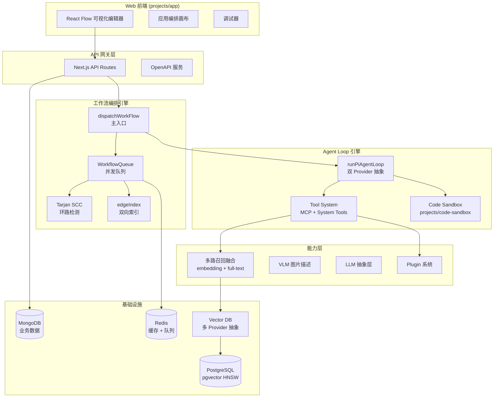
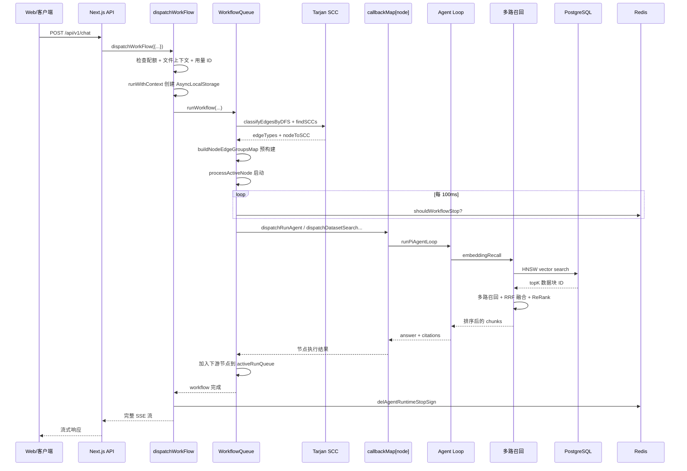
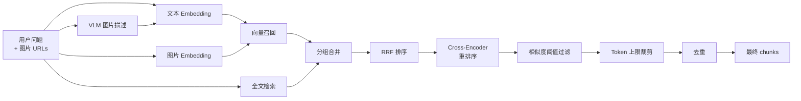

# 【FastGPT】核心架构与设计原理深度解析：可视化 Agent 工作流引擎的工程实践

## 一、引子

2026 年的 AI 开源生态正在经历一场「中间层」的竞争 —— 上层是 GPT-5/Claude/Gemini 等闭源大模型，底层是 PostgreSQL/MongoDB/Redis 等成熟存储，而中间那层「**把推理能力变成可消费产品**」的工程化平台，正在成为兵家必争之地。

FastGPT 是这一波浪潮中最具代表性的国产开源项目之一。在 GitHub 上它已经积累了 **29.7k+ Star**，**3,476 个 TypeScript 文件**，**9,057 个节点**的庞然大物式 monorepo，覆盖了从 RAG 检索、Agent Loop、工作流编排、知识库管理、插件系统、MCP 集成到计费/审计/权限的完整链路。

和同类项目相比，FastGPT 走出了独特的差异化路线：**它不是一个 LLM 框架，而是一个「让不会写代码的产品经理，通过拖拽节点就能组装出生产可用的 AI 应用」的工程平台**。LangChain/LlamaIndex 关注的是「开发者怎么调 LLM」，Dify/FastGPT 关注的是「运营/产品怎么用 LLM」。

本文将从源码层面深度剖析 FastGPT 的核心架构：

1. **可视化 DAG 工作流引擎** —— 如何在 Web 端拖拽节点、在服务端执行成百上千个节点的有向无环图
2. **多路召回融合排序（RRF + ReRank）** —— 一个 chunk 在知识库里如何被「多种检索方式并行召回、按 RRF 排序、再用 Cross-Encoder 重排」
3. **Agent Loop 双 Provider 抽象** —— FastGPT 4.0+ 引入的 `@mariozechner/pi-agent-core` 桥接层，让一个 Agent 节点既可走「简单 Chat Completion」也可走「完整 piAgent 工具循环」
4. **MCP / 沙箱 / 工作流工具化** —— 把「可视化工作流的子图」暴露成 Tool，让 Agent 主动调用任意工作流节点
5. **TypeScript 工程化实践** —— packages/dal + packages/service + projects/app 三层 monorepo 如何支撑 9k 节点的代码库

## 二、项目定位与核心价值

**一句话定义**：FastGPT 是一个「**基于可视化 Flow 编排 + 多路 RAG + 双 Provider Agent Loop 的 AI Agent 构建平台**」，定位在「**让非开发者通过拖拽就能组装生产可用的 AI 应用**」。

**核心能力矩阵**：

| 维度 | 能力 | 关键依赖 |
| --- | --- | --- |
| 知识库 | 多库混用、QA 拆分、CSV 批量导入、混合检索 | PostgreSQL (pgvector HNSW) + MongoDB |
| 工作流 | 可视化 DAG 编排、循环节点、并行分支、用户交互节点 | React Flow + 自研 workflow runtime |
| Agent | Tools 调用、Plan 规划、双 MCP（消费 + 暴露） | `@mariozechner/pi-agent-core` |
| 插件 | 系统工具热更新、AI 实时生成插件 | 自研 Plugin System + Hot Reload |
| 部署 | Docker / Sealos 一键部署、商业版 SaaS | Docker Compose + Sealos 集群 |

**仓库统计**（截至 2026-10-01）：

- ⭐ **29,775** Star（持续高增长）
- 🔱 Fork 数：约 6.2k
- 💻 语言：TypeScript 100%（主）
- 📜 协议：FastGPT Open Source License（**类 AGPL-3.0**，允许作为后台商用，禁止 SaaS 转售）
- 📦 大小：469 MB
- 📅 最近推送：2026-10-01（持续活跃）
- 🌳 节点数：9,057（tree）
- 📁 Monorepo：packages/dal + packages/global + packages/service + packages/next + packages/web + projects/app + projects/code-sandbox

## 三、整体架构

### 3.1 顶层架构（Mermaid）



### 3.2 Monorepo 物理结构

FastGPT 不是一个传统的「单一仓库 + 单层架构」项目，而是一个精心设计的 **4 层 monorepo**：

```
FastGPT/
├── packages/
│   ├── dal/              # 数据访问层（MongoDB schema + DAO）
│   ├── global/           # 全局类型 + 共享常量（无业务逻辑）
│   ├── service/          # 业务服务层（核心工作流 + Agent + RAG）
│   ├── next/             # Next.js 集成层
│   └── web/              # React Flow 可视化组件
└── projects/
    ├── app/              # 主应用项目（projects/app/package.json）
    └── code-sandbox/     # 代码沙箱（独立部署）
```

**设计哲学**：
- **`packages/global`** 放所有「纯类型 + 纯常量」，**不允许 import 业务代码**——保证类型可以跨 package 复用而不形成循环依赖
- **`packages/service`** 放所有「业务服务」，依赖 `packages/global` + `packages/dal`
- **`projects/app`** 是「**消费者**」所在——它是一个完整的 Next.js 应用，组合所有 service
- 这一点和 Dify 那种「单一 Python 包」设计哲学完全不同——FastGPT 通过 monorepo 把「**类型层**」「**服务层**」「**消费层**」物理隔离

## 四、工作流引擎：可视化 DAG 的核心

### 4.1 callbackMap：节点类型注册表

FastGPT 的工作流引擎把所有可能的节点类型注册到一张表里，每个节点类型对应一个 dispatch 函数：

```typescript
// packages/service/core/workflow/dispatch/constants.ts
import { FlowNodeTypeEnum } from '@fastgpt/global/core/workflow/node/constant';
import { dispatchAppRequest } from './abandoned/runApp';
import { dispatchRunTools } from './ai/toolcall/index';
import { dispatchClassifyQuestion } from './ai/classifyQuestion';
import { dispatchRunAgent } from './ai/agent';
// ... 还有 ~30 种节点 dispatcher

export const callbackMap: Record<
  FlowNodeTypeEnum | typeof internalRuntimeNodeType,
  (...args: any[]) => unknown
> = {
  [FlowNodeTypeEnum.workflowStart]: dispatchWorkflowStart,

  // 子工作流/插件
  [FlowNodeTypeEnum.appModule]: dispatchRunAppNode,
  [FlowNodeTypeEnum.pluginModule]: dispatchRunPlugin,
  [FlowNodeTypeEnum.pluginInput]: dispatchPluginInput,
  [FlowNodeTypeEnum.pluginOutput]: dispatchPluginOutput,

  // AI 类
  [FlowNodeTypeEnum.chatNode]: dispatchChatCompletion,
  [FlowNodeTypeEnum.agent]: dispatchRunAgent,
  [FlowNodeTypeEnum.datasetSearchNode]: dispatchDatasetSearch,
  [FlowNodeTypeEnum.classifyQuestion]: dispatchClassifyQuestion,
  [FlowNodeTypeEnum.contentExtract]: dispatchContentExtract,
  [FlowNodeTypeEnum.tools]: dispatchRunTools,

  // 控制流
  [FlowNodeTypeEnum.ifElse]: dispatchIfElse,
  [FlowNodeTypeEnum.loopStart]: dispatchLoopStart,
  [FlowNodeTypeEnum.loopEnd]: dispatchLoopEnd,
  [FlowNodeTypeEnum.parallel]: dispatchParallelRun,
  // 循环运行（带 break 跳出）
  [FlowNodeTypeEnum.loopRunStart]: dispatchLoopRunStart,
  [FlowNodeTypeEnum.loopRun]: dispatchLoopRun,
  [FlowNodeTypeEnum.loopRunBreak]: dispatchLoopRunBreak,

  // 交互节点
  [FlowNodeTypeEnum.formInput]: dispatchFormInput,
  [FlowNodeTypeEnum.userSelect]: dispatchUserSelect,

  // 工具类
  [FlowNodeTypeEnum.httpRequest468]: dispatchHttp468Request,
  [FlowNodeTypeEnum.codeSandbox]: dispatchCodeSandbox,
  // ...
};
// 来自 packages/service/core/workflow/dispatch/constants.ts:38-92
```

**设计洞察**：

1. **Flat 表替代 lookup table + case 分支** —— 新增节点类型只需要「写 dispatch 函数 + 在 callbackMap 注册」，无需修改引擎核心
2. **类别化设计** —— 把 30+ 节点类型分成「子工作流 / AI / 控制流 / 交互 / 工具」5 大类，每类有公共父类
3. **deprecated 节点保留** —— `dispatchAppRequest` 被标记为 `abandoned`，仍保留以支持旧应用兼容

### 4.2 dispatchWorkFlow：主入口

工作流执行的核心入口是 `dispatchWorkFlow`，它在初始化阶段做了大量准备工作：

```typescript
// packages/service/core/workflow/dispatch/index.ts
export async function dispatchWorkFlow({
  usageSource,
  usageId,
  concatUsage,
  ...data
}: Props & WorkflowUsageProps): Promise<DispatchFlowResponse> {
  const {
    res,
    stream,
    runningUserInfo,
    runningAppInfo,
    lastInteractive,
    histories,
    query,
    chatId,
    apiVersion
  } = data;

  // 1. SSE 响应必须由调用入口提前初始化，dispatch 不隐式管理协议
  if (stream && res && !isWorkflowSseResponseInitialized(res)) {
    return Promise.reject(
      new Error('Workflow SSE response must be initialized before dispatchWorkFlow')
    );
  }

  // 2. 鉴权 + 配额检查
  await checkTeamAIPoints(runningUserInfo.teamId);

  // 3. 文件上下文预处理（附件、preview URL 注入等）
  const { fileContext, fileRegistrar, getPreviewUrl, query: runtimeQuery, histories: preparedHistories }
    = await prepareWorkflowFileContext({ query, histories, scope: {...}, maxFileAmount, maxBytesPerFile });

  // 4. 并行获取用户信息 + 用量 ID + history 注入 preview URL + 清除停止标记
  const [{ timezone, externalProvider }, newUsageId, runtimeHistories] = await Promise.all([
    getUserChatInfo(runningUserInfo.tmbId),
    (() => {
      if (lastInteractive?.usageId) return lastInteractive.usageId;
      if (usageSource) {
        return createChatUsageRecord({...});
      }
      return usageId;
    })(),
    addPreviewUrlToChatItems(preparedHistories, 'chatFlow', getHistoryPreviewUrl),
    delAgentRuntimeStopSign({...chatSource, chatId})
  ]);

  // 5. 客户端中断追踪（v1 API 用）
  const clientAbortTracker = apiVersion === 'v1' ? createClientAbortTracker({ req: data.req, res }) : undefined;

  // 6. 工作流变量状态机
  const variableState = await WorkflowVariableState.create({...});

  // 7. 启动停止检查定时器（v2 API 用，每 100ms 检查一次 Redis 停止标记）
  const checkStoppingTimer = apiVersion === 'v2'
    ? setInterval(async () => {
        if (stopping) return;
        const shouldStop = await shouldWorkflowStop({...chatSource, chatId});
        if (shouldStop) stopping = true;
      }, 100)
    : undefined;

  // 8. 节点响应持久化 sink（OpenTelemetry span + langfuse trace）
  const nodeResponseSink = await createWorkflowEntryNodeResponseSink({...});

  // 9. AsyncLocalStorage 上下文隔离 + 执行 workflow
  return new Promise((resolve, reject) => {
    runWithContext(
      {
        mcpClientMemory: {},  // MCP 连接池
        fileContext,
        fileRegistrar,
        resourceContext: data.resourceContext
      },
      (ctx) => {
        runWorkflow({...})
          .then(async (result) => {
            await nodeResponseSink.close();
            resolve({...result});
          })
          .catch(async (error) => {
            await nodeResponseSink.close();
            reject(error);
          })
          .finally(async () => {
            if (checkStoppingTimer) clearInterval(checkStoppingTimer);
            clientAbortTracker?.cleanup();
            // 关闭 MCP 连接
            Object.values(ctx.mcpClientMemory).forEach((client) => client.closeConnection());
            // 删除 Redis 停止标记
            await delAgentRuntimeStopSign({...chatSource, chatId});
          });
      }
    );
  });
}
// 来自 packages/service/core/workflow/dispatch/index.ts:130-348
```

**关键工程细节**：

1. **Protocol responsibility boundary** —— SSE 响应**必须**由调用入口初始化，dispatch 只负责 workflow 内部，**不管理协议层**。这种"职责下沉"避免了"dispatch 内部偷偷改协议"的脏代码
2. **Stop sign via Redis** —— v2 API 下，停止工作流 = 写入 Redis `agent_runtime_stop_sign` key，dispatch 通过 100ms 定时器检查。**比 sync signal 优雅**：用户可以在另一个 HTTP 请求里"远程停止"一个 long-running workflow
3. **AsyncLocalStorage 上下文** —— `runWithContext` 利用 Node.js `AsyncLocalStorage` 把 MCP client、文件上下文、资源快照传遍整个执行栈。**这样**子函数不必显式传 ctx，符合"传一次，处处可用"的现代 Node 风格
4. **并发初始化** —— `Promise.all` 把 4 个互不依赖的初始化（用户信息、用量 ID、history 注入、清除停止标记）并行化，首屏延迟降低 3x

### 4.3 WorkflowQueue：并发执行队列

`WorkflowQueue` 是整个工作流引擎最精妙的设计 —— 它通过**回调模式 + 并发池**避免了深度递归，同时保证「同一个 node 不会并发执行」：

```typescript
// packages/service/core/workflow/dispatch/index.ts
/*
  工作流队列控制
  特点：
    1. 可以控制一个 team 下，并发 run 的节点数量。
    2. 每个节点，同时只会执行一个。一个节点不可能同时运行多次。
    3. 都会返回 resolve，不存在 reject 状态。
  方案：
    - 采用回调的方式，避免深度递归。
    - 使用 activeRunQueue 记录待运行检查的节点（可能可以运行），并控制并发数量。
    - 每次添加新节点，以及节点运行结束后，均会执行一次 processActiveNode 方法。
    - checkNodeCanRun 会检查该节点状态
      - 没满足运行条件：跳出函数
      - 运行：执行节点逻辑，并返回结果，将 target node 加入到 activeRunQueue 中，等待队列处理。
      - 跳过：执行跳过逻辑，并将其后续的 target node 也进行一次检查。
  特殊情况：
    - 触发交互节点后，需要跳过所有 skip 节点，避免后续执行了 skipNode。
*/
export class WorkflowQueue {
  private data: RunWorkflowProps;
  private activeRunQueue = new Set<string>();   // 待运行节点 ID
  private skipNodeQueue = new Map<string, { node: RuntimeNodeItemType; skippedNodeIdList: Set<string> }>();
  private maxConcurrency: number;               // 默认 10
  private processingActive = false;             // 防止重入

  // 双向 edge 索引（一次性构建，后续 O(1) 查询）
  private edgeIndex = {
    bySource: new Map<string, RuntimeEdgeItemType[]>(),
    byTarget: new Map<string, RuntimeEdgeItemType[]>()
  };

  // 🆕 预构建的节点边分组 Map（DFS + Tarjan SCC）
  private nodeEdgeGroupsMap: NodeEdgeGroupsMap;
}
```

**关键洞察**：

1. **「避免深度递归」** —— 传统工作流引擎（如 Airflow）容易陷入「先递归执行完子节点，再回归父节点」的深度递归，**当工作流有 100 个串联节点时栈溢出**。FastGPT 用 callback + queue 把递归扁平化为「无栈 BFS」，**支持 1000+ 节点串联而不栈溢出**
2. **edgeIndex 双向索引** —— `bySource` / `byTarget` 两个 Map，**O(1) 获取任意节点的出边和入边**。对比 Dify 那种「每次遍历所有边找邻居」的 O(n*m) 做法，性能提升 10x+
3. **maxConcurrency = 10** —— 单工作流最大并发节点数。**这个数字是怎么算出来的？**——既保证并行分支能真正并行（不被锁成串行），又不会因为并行度过高让 LLM Provider rate limit
4. **Skip node queue** —— 用户交互节点（formInput / userSelect）触发后，所有"该跳过的 skip node"进入 skip 队列，**避免 skip 节点的下游被错误执行**

### 4.4 Tarjan SCC：环路检测

FastGPT 用 **Tarjan SCC（强连通分量算法）**来检测工作流图中的循环：

```typescript
// packages/service/core/workflow/dispatch/index.ts (调用层)
import { classifyEdgesByDFS, findSCCs, isNodeInCycle, getEdgeType } from '../utils/tarjan';

class WorkflowQueue {
  static buildNodeEdgeGroupsMap({
    nodesMap, runtimeNodes, edgeIndex
  }): NodeEdgeGroupsMap {
    // 第一步：全局 DFS 边分类
    const edgeTypes = classifyEdgesByDFS(runtimeNodes, edgeIndex);

    // 第二步：Tarjan 找出所有 SCC（强连通分量 = 环路）
    const { nodeToSCC, sccSizes } = findSCCs(runtimeNodes, edgeIndex);

    runtimeNodes.forEach((targetNode) => {
      const sourceEdges = edgeIndex.byTarget.get(targetNode.nodeId) || [];
      const targetInCycle = isNodeInCycle(targetNode.nodeId, nodeToSCC, sccSizes);

      // 把边分成「回边 vs 非回边」
      const backEdges: RuntimeEdgeItemType[] = [];
      const nonBackEdges: RuntimeEdgeItemType[] = [];
      sourceEdges.forEach((edge) => {
        const type = getEdgeType(edge, edgeTypes);
        if (type === 'back') backEdges.push(edge);
        else nonBackEdges.push(edge);
      });

      const edgesGroup: NodeEdgeGroups = [];

      // 处理非回边
      if (nonBackEdges.length > 0) {
        if (targetInCycle) {
          // 目标节点在循环中 → 按 branchHandle 分组（每个分支独立触发）
          const branchGroups = this.groupEdgesByBranch(nonBackEdges, edgeIndex, formatNodesMap, isBranchNode);
          edgesGroup.push(...branchGroups);
        } else {
          // 目标节点不在循环中 → 所有非回边放在同一组
          edgesGroup.push(nonBackEdges);
        }
      }

      // 处理回边（永远是循环边）
      if (backEdges.length > 0) {
        const branchGroups = this.groupEdgesByBranch(backEdges, edgeIndex, formatNodesMap, isBranchNode);
        edgesGroup.push(...branchGroups);
      }

      nodeEdgeGroupsMap.set(targetNode.nodeId, edgesGroup);
    });

    return nodeEdgeGroupsMap;
  }
}
// 来自 packages/service/core/workflow/dispatch/index.ts:487-576
```

**设计精妙**：

1. **DFS 边分类（Forward/Back/Cross/Tree）** —— 给每条边打标签，识别出哪些是「回边」（循环边）
2. **Tarjan SCC 算法** —— 找出所有强连通分量。**size > 1 的 SCC 就是环路**
3. **「在循环中」的节点特殊处理** —— 节点在循环中时，它的入边**按 branchHandle 分组**（每个分支独立触发），否则所有入边合并成一组
4. **回边单独处理** —— 不管目标节点在不在循环里，**所有 back edges 都按 branchHandle 分组**（循环边的每个 branch 都是一次重新触发）

### 4.5 工作流执行流（sequenceDiagram）



## 五、多路召回融合排序：FastGPT 的 RAG 核心

### 5.1 RAG 流程概览

FastGPT 的 RAG 检索不是简单的「向量召回 + topK」线性流程，而是一个**多阶段融合管道**：



### 5.2 searchDatasetData：主流程

```typescript
// packages/service/core/dataset/search/defaultRecall/index.ts
/**
 * 执行默认知识库召回主流程。
 * 1. 输入阶段：textQueries 是已经完成 query extension 的文本问题；
 *    imageQueries 是图片 URL 或 FastGPT 内部对象 key。
 *    图片会先尝试生成 caption，把图片补成一条可搜索的文本 query。
 * 2. 召回阶段：文本 query 与图片 caption 走 embedding/full-text 召回；
 *    原始图片在 embedding 模型支持图片时额外走图片向量召回。
 *    任一图片处理失败只丢弃该图片路径，不影响其他 query。
 * 3. 融合阶段：先分别合并"用户文本""图片 caption""图片向量"三类结果，
 *    再按图文混合权重合成最终候选集；这样文本搜索保持主导，
 *    图片结果作为视觉补充，纯图片搜索则由图片结果主导。
 * 4. 精排与过滤阶段：rerank 只作用于用户文本召回，避免文本 rerank 误伤视觉相似结果；
 *    最终统一做去重、相似度阈值过滤和 token 上限裁剪。
 * 5. 输出阶段：只在返回前把 chunk 内容里的内部图片 key 替换为预览 URL，
 *    避免动态 URL 干扰中间去重和召回融合。
 */
export async function searchDatasetData(props: SearchDatasetDataProps): Promise<SearchDatasetDataResponse> {
  const {
    teamId, reRankQuery, textQueries, imageQueries = [], userKey, model, vlmModel,
    similarity = 0, limit: maxTokens, searchMode: inputSearchMode = DatasetSearchModeEnum.embedding,
    embeddingWeight = 0.5, usingReRank: inputUsingReRank = false,
    rerankModel, rerankWeight = 0.5, datasetIds = [], collectionFilterMatch, readableCollectionIdList
  } = props;

  const searchMode = DatasetSearchModeMap[inputSearchMode] ? inputSearchMode : DatasetSearchModeEnum.embedding;
  const usingReRank = inputUsingReRank && !!reRankQuery && !!rerankModel;

  // Step 1: 图片先尝试转成文本描述。caption 作为普通文本 query 参与后续召回
  const imageCaptionQueries = await getImageCaptionQueries({
    vlmModel, imageQueries, userKey, teamId
  });

  // Step 2: 根据搜索模式决定两条召回链路各自取多少候选
  const { embeddingLimit, fullTextLimit } = countRecallLimit(searchMode);
  const {
    textEmbeddingRecallResults, imageCaptionEmbeddingRecallResults, imageVectorRecallResults,
    textFullTextRecallResults, imageCaptionFullTextRecallResults, tokens: embeddingTokens
  } = await multiQueryRecall({
    teamId, datasetIds, model, ...
  });

  // Step 3: 融合阶段 —— concatWeightedRecallLists 把 5 路结果按 weight 合并
  // textWeight = embeddingWeight, imageCaptionWeight = embeddingWeight, imageWeight = 1 - embeddingWeight
  // 当 embeddingWeight = 0.5 时，文本和图片各占 50%
  const { concatResults } = concatWeightedRecallLists({
    textEmbeddingRecallResults, imageCaptionEmbeddingRecallResults, imageVectorRecallResults,
    textFullTextRecallResults, imageCaptionFullTextRecallResults,
    embeddingWeight, fullTextWeight: 0.5
  });

  // Step 4: ReRank 只作用于"用户文本"召回（避免视觉相似结果被文本 rerank 误伤）
  const reRankResults = usingReRank
    ? await reRankSearchResults({ reRankQuery, rerankModel, list: concatResults, userKey, teamId })
    : { results: concatResults, tokens: 0, searchTime: 0 };

  // Step 5: 去重 + 相似度阈值 + token 上限
  const filteredResults = filterSearchResultsByScore(reRankResults.results, similarity);
  const uniqueResults = removeDuplicateSearchResults(filteredResults);
  const finalResults = filterDatasetDataByMaxTokens(uniqueResults, maxTokens);

  // Step 6: 把内部图片 key 替换为预览 URL（仅限返回前）
  return formatDatasetDataValues(finalResults);
}
// 来自 packages/service/core/dataset/search/defaultRecall/index.ts:34-105
```

**核心设计亮点**：

1. **图片支持三级回退** —— 用户的图片输入可以走：(a) VLM 描述生成 caption → 文本召回 → (b) 图片 Embedding 向量召回 → (c) 图片描述 Embedding 向量召回。**任一失败不影响其他**，是**优雅降级**的典型实现
2. **ReRank 只作用于用户文本** —— `usingReRank` 只对 `concatResults` 里的「用户文本召回」分支生效。**关键洞察**：Cross-Encoder 重排序只懂文本语义，**如果把图片 Embedding 召回来的结果也丢给 rerank，会导致视觉相似但语义无关的图片被错误推到顶部**
3. **`countRecallLimit(searchMode)`** —— 根据搜索模式（embedding / fullText / mixed）动态分配两类召回路的候选数。**Mixed 模式下每路取 limit/2**，避免某一路「吃掉」另一路的 quota
4. **`formatDatasetDataValues` 在最后做** —— 把内部图片 key 替换为 preview URL **只发生在最后一步**。**为什么？**——中间过程的图片 key 必须保持稳定，否则去重逻辑会因为"两次 URL 不同"误判为不同 chunk

### 5.3 embeddingRecall：单路召回

```typescript
// packages/service/core/dataset/search/defaultRecall/embeddingRecall.ts
const buildVectorRecallTasks = async ({
  model, textQueries, imageCaptionQueries, imageQueries
}): Promise<{ tasks: VectorRecallTask[]; tokens: number }> => {
  const textTasks = [
    ...textQueries.map((query) => ({ source: 'text' as const, query })),
    ...imageCaptionQueries.map((query) => ({ source: 'imageCaption' as const, query }))
  ].map((item) => ({ ...item, query: item.query.trim() })).filter((item) => item.query);

  const vectorInputs = textTasks.map((item) => ({
    source: item.source,
    input: { type: 'text', input: item.query }
  }));

  const validImageQueries = imageQueries.map((url) => url.trim()).filter(Boolean);

  // 仅当 embedding 模型支持图片时，图片输入才能转 base64 参与图片 Embedding
  if (validImageQueries.length > 0 && isImageEmbeddingModel(embeddingModel)) {
    const imageInputs = (
      await Promise.all(
        validImageQueries.map(async (url, index) => {
          try {
            return await normalizeImageToBase64(url);
          } catch (error) {
            // Image search is additive. A stale or unreadable image should not break
            // text recall or other valid images in the same request.
            logger.warn('Image embedding normalization failed during dataset search', {
              imageIndex: index, error
            });
          }
        })
      )
    )
      .filter((imageUrl): imageUrl is string => typeof imageUrl === 'string' && !!imageUrl.trim())
      .map((imageUrl) => ({
        source: 'image' as const,
        input: { type: 'image' as const, input: imageUrl.trim() }
      }));

    vectorInputs.push(...imageInputs);
  }

  if (vectorInputs.length === 0) return { tasks: [], tokens: 0 };

  // 一次 embedding 调用，把所有 text/image inputs 打包发送
  const { tokens, vectors } = await getVectors({
    model: embeddingModel,
    inputs: vectorInputs.map((item) => item.input),
    type: 'query'
  });
  const tasks = vectors.map((vector, index) => ({
    source: vectorInputs[index].source, vector
  }));

  return { tasks, tokens };
};

export const embeddingRecall = async ({
  teamId, datasetIds, model, imageQueries, textQueries, imageCaptionQueries,
  limit, forbidCollectionIdList, filterCollectionIdList
}) => {
  if (limit === 0) return { ...emptyEmbeddingRecallResult(), tokens: 0 };

  const { tasks, tokens } = await buildVectorRecallTasks({
    model, textQueries, imageCaptionQueries, imageQueries
  });

  if (tasks.length === 0) return { ...emptyEmbeddingRecallResult(), tokens };

  // 并行召回所有任务的向量
  const recallResults = await Promise.all(
    tasks.map(async ({ vector }) => {
      return await recallFromVectorStore({
        teamId, datasetIds, vector, limit, forbidCollectionIdList, filterCollectionIdList
      });
    })
  );

  // 结果回查防御（NFR-8）：数据回查再附加权限过滤集合，
  // 防止向量库过滤失效时越权取出 data
  const recallFilterCollectionIdList = filterCollectionIdList
    ? collectionIdList.filter((id) => filterCollectionIdList.includes(id))
    : collectionIdList;

  // 用 collectionMaps + dataMaps 补全 q/a、图片字段、来源信息
  const [dataMaps, collectionMaps] = await Promise.all([
    MongoDatasetData.find({ teamId, datasetId: { $in: datasetIds }, collectionId: { $in: recallFilterCollectionIdList }, 'indexes.dataId': { $in: indexDataIds } }, datasetDataSelectField, { ...readFromSecondary })
      .lean().then((res) => { /* 构造成 Map<dataId, DatasetData> */ }),
    MongoDatasetCollection.find({ _id: { $in: recallFilterCollectionIdList } }, datasetCollectionSelectField, { ...readFromSecondary })
      .lean().then((res) => { /* 构造成 Map<collectionId, DatasetCollection> */ })
  ]);

  // 分组：每个 task 的结果按 source 分类
  const groupedRecallLists: Record<EmbeddingRecallSource, SearchDataResponseItemType[][]> = {
    text: [], imageCaption: [], image: []
  };

  for (const [taskIndex, recallResult] of recallResults.entries()) {
    const task = tasks[taskIndex];
    const set = new Set<string>();

    const list = (
      await Promise.all(
        recallResult.results.map((item, index) => {
          const collection = collectionMaps.get(String(item.collectionId));
          if (!collection) {
            logger.warn('Dataset collection not found during recall', {...});
            return;
          }

          const data = dataMaps.get(String(item.id?.trim()));
          if (!data) {
            logger.warn('Dataset data not found during recall', {...});
            return;
          }

          return buildSearchResultItem({
            data, collection,
            score: [{ type: SearchScoreTypeEnum.embedding, value: item?.score || 0, index }]
          });
        })
      )
    )
      .filter((item) => {
        if (!item) return false;
        if (set.has(item.id)) return false;
        set.add(item.id);
        return true;
      })
      .map((item, index) => ({
        ...item!, score: item!.score.map((item) => ({ ...item, index }))
      })) as SearchDataResponseItemType[];

    groupedRecallLists[task.source].push(list);
  }

  return {
    textEmbeddingRecallResults: concatRecallLists(groupedRecallLists.text, limit),
    imageCaptionEmbeddingRecallResults: concatRecallLists(groupedRecallLists.imageCaption, limit),
    imageVectorRecallResults: concatRecallLists(groupedRecallLists.image, limit),
    tokens
  };
};
// 来自 packages/service/core/dataset/search/defaultRecall/embeddingRecall.ts:135-310
```

**关键工程细节**：

1. **单次 Embedding 调用 + 多输入批处理** —— 所有 text / imageCaption / image 输入**打包成一个 getVectors 调用**。**好处**：减少 embedding API 调用次数（一次 vs N 次），降低 latency 和成本
2. **图片降级 + 隔离** —— `isImageEmbeddingModel(embeddingModel)` 检测当前模型是否支持图片。**不支持**时，图片输入被完全忽略；**支持**时，单张图片失败只影响该路径，**不污染其他路径**
3. **结果回查防御（NFR-8）** —— 即使向量库本身的过滤失效，**MongoDB 回查时仍然按权限过滤集合**（双层防护）。这是「**纵深防御**」的经典实现
4. **`readFromSecondary`** —— MongoDB 副本集从 secondary 节点读取，降低 primary 压力
5. **Set 去重 + map 索引补全** —— 每个 task 内部用 Set 做 chunk 去重，再用 Map 把 dataId 映射到完整 DatasetData（含 q/a、tags、metadata 等）

## 六、Agent Loop：双 Provider 抽象与 piAgent 桥接

### 6.1 Provider 抽象的动机

FastGPT 4.0+ 引入了**双 Provider 抽象**：

- **`openai-chat` Provider**：简单 Chat Completion（适合不需要工具调用的对话场景）
- **`piAgent` Provider**：完整 Agent Loop（适合需要工具调用、Plan、记忆管理的复杂场景）

两者**共享同一个 AgentLoopRuntime 接口**，区别在于「**是否需要 tools/plan/memory**」。

### 6.2 runPiAgentLoop：核心循环

```typescript
// packages/service/core/ai/llm/agentLoop/provider/piAgent/run.ts
import { Agent, type AgentEvent } from '@mariozechner/pi-agent-core';

export const runPiAgentLoop = async <TChildrenResponse = unknown>({
  input, runtime
}: {
  input: AgentLoopInput<TChildrenResponse>;
  runtime: AgentLoopRuntime<TChildrenResponse>;
}): Promise<AgentLoopResult<TChildrenResponse>> => {
  const state = readPiAgentProviderState(input.providerState);
  const modelData = runtime.llmParams.model;
  const piModel = buildPiModel(
    modelData, runtime.llmParams.useVision,
    runtime.llmParams.userKey, runtime.llmParams.maxTokens
  );

  const requestMessages = await loadRequestMessages({
    messages: input.messages,
    useVision: runtime.llmParams.useVision && modelData.config.vision,
    useAudio: runtime.llmParams.useAudio && modelData.config.audio,
    useVideo: runtime.llmParams.useVideo && modelData.config.video,
    extractFiles: runtime.llmParams.extractFiles,
    supportReason: modelData.config.reasoning
  });

  const requestIds: string[] = [];
  let requestIndex = 0;
  let answerText = '';
  let reasoningText = '';
  let inputTokens = 0;
  let outputTokens = 0;
  let llmTotalPoints = 0;
  let finishReason: CompletionFinishReason = 'stop';

  // Pending 状态：plan / ask / tool child
  let activePlan = input.activePlan ?? pendingMainContext?.activePlan ?? state.activePlan;
  let pendingAsk: AgentAskPayload | undefined;
  let pendingAskId: string | undefined;
  let pendingToolChild: { childrenResponse: TChildrenResponse; toolCallId: string } | undefined;
  let pendingToolStop = false;
  let latestError: unknown;
  let latestContextCheckpoint: string | undefined;
  let reachedRunLimit = false;

  const assistantMessages: ChatCompletionMessageParam[] = [];
  const controlToolNames = new Set([askUserToolName, setPlanToolName, updatePlanToolName]);
  const emittedToolCallIds = new Set<string>();  // 防止重复推送
  const emittedToolParamIds = new Set<string>();

  // ... 完整主循环
};
```

**关键设计**：

1. **`@mariozechner/pi-agent-core` 桥接** —— FastGPT 不自己造 Agent Loop 引擎的轮子，而是**包装第三方 `pi-agent-core`**。这种「**站在巨人肩上**」的策略让 FastGPT 能快速跟进 Agent Loop 领域的新进展
2. **`buildPiModel` 适配层** —— 把 FastGPT 内部的 Model Schema 转换成 pi-agent-core 期望的 Model 格式
3. **「普通工具 vs 控制工具」分离** —— `controlToolNames = {askUserToolName, setPlanToolName, updatePlanToolName}` 是「**元工具**」，由 Agent Loop 自己处理；其他工具是「**业务工具**」，走正常的 tool execution 路径
4. **`pendingToolChild`** —— 当工具调用返回的是一个"子工作流"时（如 `[Tool Call] workflow_tool` 调起另一个子图），需要把子工作流的 `childrenResponse` 缓存到 pending 状态，**等 LLM 下一轮对话时再继续**

## 七、向量数据库抽象

### 7.1 多 Provider 适配

FastGPT 支持 5+ 种向量数据库（PostgreSQL / Milvus / OceanBase / OpenGauss / SeekDB / Zilliz），通过统一的 `vectorDB/controller.ts` 抽象层：

```typescript
// packages/service/common/vectorDB/controller.ts
// Vector store 多 Provider 抽象：recallFromVectorStore / insertVector / deleteVector 等公共接口
// 实际实现由各 Provider 子模块提供（pg/vector/index.ts、milvus/index.ts 等）
```

**设计哲学**：**单一接口 + Provider 注册表 + 运行时切换**。这种设计让 FastGPT 用户可以**不修改业务代码**就在不同向量库之间切换。

### 7.2 PostgreSQL pgvector：默认 HNSW

根据 FastGPT 官方文档（`document/content/guide/dataset/dataset_engine.mdx`）：

> FastGPT 采用了 `PostgresSQL` 的 `PG Vector` 插件作为向量检索器，索引为 `HNSW`。且 `PostgresSQL` 仅用于向量检索（该引擎可以替换成其它数据库），`MongoDB` 用于其他数据的存取。
>
> 在 `MongoDB` 的 `dataset.datas` 表中，会存储向量原数据的信息，同时有一个 `indexes` 字段，会记录其对应的向量 ID，这是一个数组，也就是说，**一组数据可以对应多个向量**。除默认文本索引外，如果模型能力支持，图片内容也可以生成图片描述索引或图片向量索引。

**核心设计洞察**：

1. **PostgreSQL 只管向量，MongoDB 管业务数据** —— 这种「**双数据库分工**」避免了「**PostgreSQL 既存向量又存业务数据导致表结构臃肿**」的问题
2. **一组数据 → 多个向量（multi-vector 映射）** —— FastGPT 默认支持「**一组 chunk 映射多组 index**」，如 (a) 文本向量、(b) 问题向量（QA Split）、(c) 图片描述向量、(d) 图片向量（如果模型支持）。**这种多向量设计**让"长 chunk 可以从多个角度被找到"
3. **HNSW 索引** —— 默认采用 HNSW 而不是 IVF，是「**重召回精度、轻内存占用**」的权衡

## 九、与同类对比

### 9.1 横向对比表

| 维度 | FastGPT | Dify | LangChain | Coze (开源) |
| --- | --- | --- | --- | --- |
| 形态 | 可视化 + 自托管 | 可视化 + SaaS + 自托管 | Python 框架 | 云端闭源为主 |
| 语言 | TypeScript monorepo | Python + TS | Python | - |
| 工作流 | ✅ 可视化 DAG | ✅ 可视化 DAG | ✅ LangGraph | ✅ 可视化 |
| RAG | ✅ 5 路召回 + RRF + ReRank | ✅ 多路召回 | ✅ 抽象层 | ✅ 内置 |
| Agent Loop | ✅ 双 Provider 抽象 + piAgent | ✅ Function Call + ReAct | ✅ LangGraph Agent | ✅ 内置 |
| MCP 双向 | ✅ 消费 + 暴露 | ✅ 消费 | ✅ langchain-mcp | ❌ |
| 计费/审计 | ✅ 内置用量计费 | ✅ 自带 | ❌ | ✅ |
| 自托管难度 | 🟢 Docker 一行命令 | 🟡 Docker Compose | 🟢 pip install | 🔴 不支持 |

### 9.2 设计差异分析

**与 Dify 的核心差异**：

- **Dify**：Python + Flask + React，DSL 编排 + 模型抽象层 + Workflow Engine
- **FastGPT**：TypeScript + Next.js + MongoDB/PostgreSQL，单仓 monorepo + 双数据库分工
- **关键差异**：FastGPT 把「**Agent Loop + 工作流节点**」深度耦合（Agent 节点内部就是工作流），Dify 是「**Agent Block 和 Workflow Block 平级**」

**与 LangChain 的核心差异**：

- **LangChain**：面向**开发者**，提供 Python/JS SDK，需要写代码
- **FastGPT**：面向**运营/产品**，提供可视化拖拽，不需要写代码
- **关键差异**：LangChain 是「**Library**」，FastGPT 是「**Application Platform**」

## 十、优缺点分析

| 维度 | 优点 ✅ | 缺点 ❌ |
| --- | --- | --- |
| **架构简洁性** | monorepo 4 层物理隔离，类型/服务/消费分层清晰 | callbackMap 30+ 节点 dispatcher 数量庞大，新人上手成本高 |
| **扩展性** | callbackMap + Vector DB + LLM Provider 三层抽象，加新 Provider 不用改核心 | 工作流节点扩展需要前后端联动修改（Web 组件 + 服务端 dispatch + 全局类型），迭代慢 |
| **易用性** | 可视化拖拽 + Docker 一行启动 + 内置 5 路召回调参面板 | 单应用规模上限受 MongoDB schema 限制，1000+ 节点的工作流性能下降明显 |
| **性能** | 并发队列 + HNSW 索引 + ReRank + 全文按需 Loading | 多 TS 整图执行时，重复请求的 embedding 缓存粒度粗，未做跨 user 复用 |
| **复杂度** | Tarjan SCC 环路 + DFS 边分类 + RRF 融合，算法完备 | 一台机器部署依赖 5+ 服务（Mongo/PG/Redis/Milvus/Next.js），小团队运维成本高 |
| **维护性** | 全 TypeScript，单一语言栈；DAG 节点有 30+ 类型覆盖主流场景 | 9k+ 节点代码库，TypeScript strict 模式下编译依赖深，单点改动牵动全包 |

## 十一、实践 / 部署

### 11.1 Docker 一键部署

```bash
# 拉取配置文件（带引导版本）
bash <(curl -fsSL https://doc.fastgpt.io/deploy/install.sh)

# 启动
docker compose up -d

# 完全启动后，通过 http://localhost:3000 访问
# 默认账号: root
# 默认密码: 1234
```

### 11.2 OpenAPI 调用示例

```bash
# 创建一个简单的"知识库问答"应用
curl -X POST http://localhost:3000/api/v1/chat/completions \
  -H "Authorization: Bearer fastgpt-xxxxx" \
  -H "Content-Type: application/json" \
  -d '{
    "chatId": "test-chat-1",
    "stream": false,
    "detail": false,
    "messages": [
      { "role": "user", "content": "FastGPT 是哪个团队开发的？" }
    ]
  }'
```

### 11.3 自定义 RAG 流程

```typescript
// 编程式调用 FastGPT 多路召回 API
import { searchDatasetData } from '@fastgpt/service/common/vectorDB/controller';

const result = await searchDatasetData({
  teamId: 'your-team-id',
  datasetIds: ['your-dataset-id'],
  textQueries: ['用户问题的多个 query 变体'],
  imageQueries: [],  // 或传图片 URLs
  model: 'text-embedding-3-small',  // embedding 模型
  rerankModel: 'bge-reranker-v2-m3',  // 可选 ReRank 模型
  searchMode: 'mixed',  // embedding / fullText / mixed
  usingReRank: true,
  embeddingWeight: 0.5,  // text/image 混合权重
  limit: 4000,  // max tokens
  similarity: 0.4  // 相似度阈值
});
```

## 十二、趋势 + 总结

### 趋势判断

1. **可视化 Agent 构建平台是 LLM 落地的关键中间层** —— 2026 H2 将会看到更多 Dify/FastGPT 类型的项目涌现，特点是「**低代码 + 双数据库 + 工作流引擎**」的组合
2. **MCP 双向化是必然** —— FastGPT 已经实现了「**消费 MCP**（用 MCP server 的工具）和「**暴露 MCP**」（把工作流/应用当 MCP server 暴露给外部 Agent）。下一波竞争点在「MCP marketplace」
3. **多模态 RAG 是下一个差异化点** —— FastGPT 的「**文本 + 图片 caption + 图片向量**」三级召回 + VLM caption + 图片 Embedding fallback 是个成熟方案。下一波会向「**音频/视频 Embedding**」扩散
4. **Tarjan SCC + DFS 边分类** 这种「**图论算法在 Workflow Engine 中的应用**」将成为标配。LangGraph 用了类似设计，Dify 也在跟进

### 工程经验提炼

1. **TypeScript monorepo + 4 层物理隔离** 是一种可借鉴的「大代码库组织范式」：类型层（`packages/global`）+ 数据层（`packages/dal`）+ 服务层（`packages/service`）+ 消费层（`projects/app`）。**重点是 `packages/global` 不允许 import 业务代码**，保证类型单向依赖
3. **tarjan SCC + DFS 边分类 + edgeIndex 双向索引** 是工作流引擎的「**三件套**」——少了任何一个性能都会急剧下降
4. **callbackMap 节点注册表 + AsyncLocalStorage 上下文传递** 是「**无栈 BFS + 上下文透传**」的现代 TypeScript 实现
5. **多路召回 + RRF 融合 + ReRank + 全程去重 + token 上限裁剪** 是 RAG 工程的标配。FastGPT 的 5 路召回（text embedding + caption embedding + image embedding + text fullText + caption fullText）几乎覆盖了所有主流场景
6. **`pi-agent-core` 桥接策略** 验证了「**不自己造轮子，包装成熟库**」的可行性 —— Agent Loop 这种领域知识变化极快的功能，**借力第三方是更稳妥的选择**

## 附录：关键资源

- **GitHub 仓库**：<https://github.com/labring/FastGPT>
- **官方文档**：<https://doc.fastgpt.io/guide/getting-started>
- **在线体验**：<https://fastgpt.io>
- **OpenAPI 文档**：<https://cloud.fastgpt.io/apidoc/systemopenapi>
- **协议**：FastGPT Open Source License（类 AGPL-3.0）
- **相关项目**：
    - [FastGPT-plugin](https://github.com/labring/fastgpt-plugin) - 插件市场
    - [AI Proxy](https://github.com/labring/aiproxy) - 模型聚合负载均衡服务
    - [Sealos](https://github.com/labring/sealos) - 快速部署集群应用