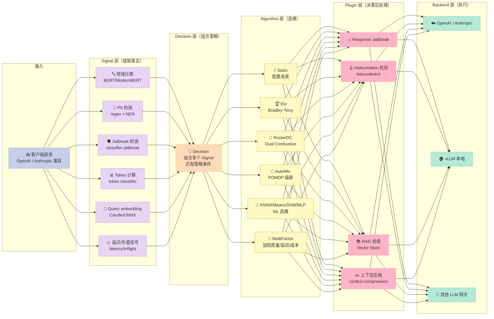
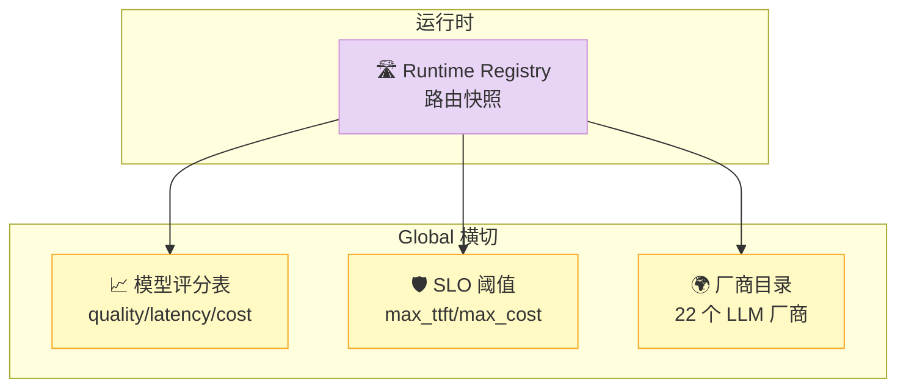
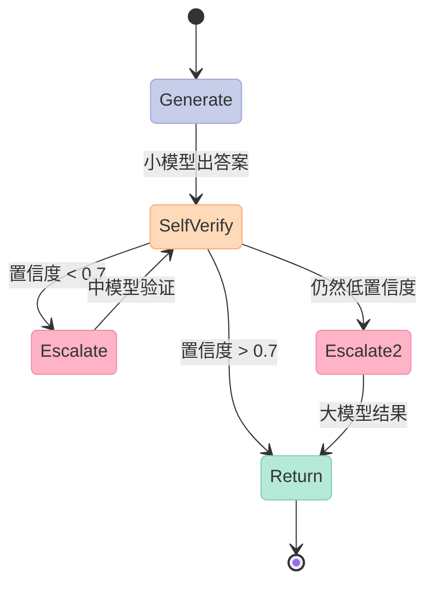
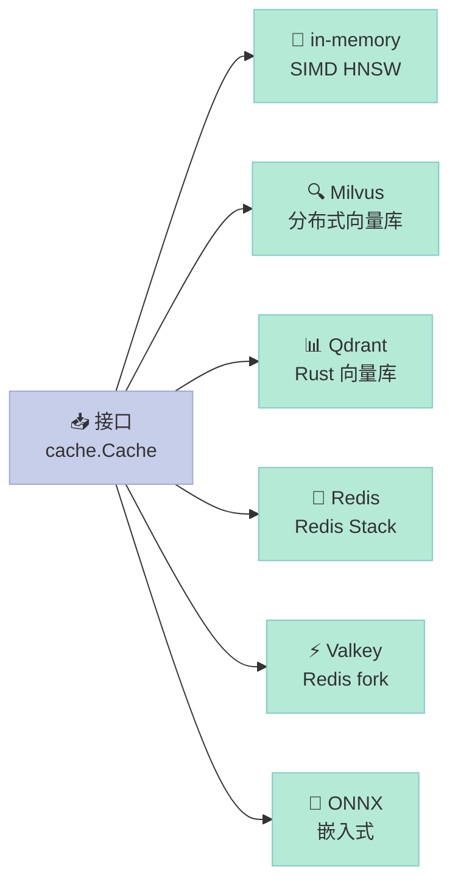

> 一个 LLM 推理请求的成本可以相差 **100 倍**——GPT-5 处理一段闲聊，和 Qwen-7B 本地推理完成同样任务，成本比可能是 $0.05 vs $0.0005。问题是：你的应用凭什么决定**这次**该用哪个模型？
>
> vLLM Semantic Router（vllm-project/semantic-router，Apache-2.0，6000⭐，Go 1.25，2026-10-03 活跃）给出的答案是：**不要在应用层写 if/else，把路由决策当成基础设施做**。本文深度拆解它 5000+ 文件、12 种选模算法、6 种缓存后端背后的 5 件套架构：Signal → Decision → Algorithm → Plugin → Global。

---

## 一、为什么需要 AI Gateway？

2025 年底起，企业 LLM 部署从"一个应用一个模型"演化成 **Mixture-of-Models (MoM)**：同一个请求系统里同时存在 GPT-5、Claude Opus 4.5、Llama-4、Qwen3、本地 vLLM 推理服务，硬件横跨 H100、MI300X、Apple Silicon、CPU。这个演化模式立刻撞上了三堵墙：

| 痛点 | 朴素做法 | 实际坏处 |
|------|---------|---------|
| **成本失控** | 应用里写 `if query.complexity > 0.8: use opus()` | 阈值是拍脑袋的、case-by-case 难维护、A/B 测试要改 10 处代码 |
| **延迟抖动** | 直接走 OpenAI SDK | 不同模型 P99 差 30 秒，没有熔断，SLA 拿不到 |
| **跨云合规** | 每个 region 独立部署 | 数据出域、PII 泄露、模型替换要逐个应用升级 |

vLLM Semantic Router（后文简称 **SR**）把这三件事做成一个 Envoy ExtProc 路由代理。**请求进入 SR→SR 评估信号→SR 决策路由→SR 转发到模型→SR 记录+缓存→响应回客户端**。应用层只看到一行 OpenAI 兼容的 API，下面所有事情都是 SR 的责任。

**关键定位**：这是 **业界第一个把 12 种学术选模算法（Elo / RouterDC / AutoMix POMDP / KNN / KMeans / SVM / MLP / Hybrid / MultiFactor / RLDriven / GMTRouter / Static）+ 6 种缓存后端（in-memory / Milvus / Qdrant / Redis / Valkey / ONNX）+ 5 件套 Signal/Decision/Algorithm/Plugin/Global** 全部收敛进 **K8s CRD + Helm Operator** 的开源 AI Gateway。它有 ICLR 2026 接收论文、有 AMD ROCm 官方合作、有 vLLM 官方 Slack 频道——这是 vLLM 生态里最重磅的网关层项目。

---

## 二、5 件套架构：Signal → Decision → Algorithm → Plugin → Global

整个 SR 的架构在官方 `tools/agent/docs/architecture-guardrails.md` 里被钉死成 **5 件套不变量**：



**5 件套的职责边界**（来自 `architecture-guardrails.md`）：

> - **Signals** extract request/response facts
> - **Decisions** compose signals into control policy
> - **Algorithms** choose among models after a decision
> - **Plugins** perform decision-driven processing
> - **Global** config owns intentionally cross-cutting behavior

这套架构的核心哲学是 **机制和策略分离**：你写 YAML 配置文件（策略），SR 引擎负责执行（机制）。换算法换插件换 backend，**业务代码不动一行**。

### 2.1 Signal 是怎么"看"请求的？

Signal 把请求拆成 **5 类事实**（src/semantic-router/pkg/services/classification.go）：

```go
// classification_signal_types.go 核心字段（节选）
type ClassificationFacts struct {
    Domain      string   // "math" / "code" / "general" / ...
    Modality    string   // "text" / "image" / "audio"
    Jailbreak   bool     // 是否触发越狱
    PII         []string // ["email", "phone", "ssn"]
    Complexity  float64   // 0~1, 来自 ModernBERT
    TokenCount  int      // 实际 token 数
    Confidence  float64   // 分类置信度
}
```

**关键设计**：Signal **只看事实**，不下决策。例如"PII 检测到邮箱"只是一个事实（`PII = []string{"email"}`），由 **Decision** 决定要不要路由到本地模型（数据出域风险）。

**对比同类**：OpenAI 的 `Safety API` 把 signal 和 decision 绑死——一旦判定越狱就直接拒。SR 把"判定"和"动作"解耦，企业可以根据合规要求做不同动作（拒答/脱敏/转人工）。

### 2.2 Decision：组合多个 Signal 的策略表达式

Decision 是 SR 最有意思的设计。它是一个 **声明式条件 + 动作** 的规则（src/semantic-router/pkg/config）：

```yaml
# config 示例：路由数学+含 PII 的请求到本地 Qwen
- name: math-private
  when:
    signals:
      - domain: "math"
      - pii: ["email", "phone"]
  algorithm:
    method: static
    model: "qwen2.5-math-7b-instruct"
  plugins:
    - context_compression
    - hallucination_detection
```

**关键设计**：Decision 可以 **匹配** 多个 Signal，但 **算法选模 + 插件链是独立的**。这意味着同一组 Signal 可以触发出完全不同的处理流水线——只要 Decision 规则这么写。

### 2.3 Algorithm：12 种选模算法的统一抽象

这是 SR 最"硬核"的部分。`src/semantic-router/pkg/selection/selector.go` 把学术界 5 年内的 12 种 MoM 路由论文收敛成一个 `Selector` 接口：

| # | 算法 | 论文/出处 | 核心思想 | 适用场景 |
|---|------|----------|----------|----------|
| 1 | **Static** | 配置驱动 | 查表选模 | 简单场景、A/B 测试基线 |
| 2 | **Elo** | RouteLLM (arXiv:2406.18665) | Bradley-Terry 评分 | 用户反馈在线学习 |
| 3 | **RouterDC** | arXiv:2409.19886 | Query-Model 双对比学习 | Embedding 已有、零反馈 |
| 4 | **AutoMix** | arXiv:2310.12963 (NeurIPS'24) | POMDP + 自验证级联 | **降本首选**（小模型优先+验证升级） |
| 5 | **Hybrid** | arXiv:2404.14618 | Elo × Embedding × Cost 加权 | 综合指标 |
| 6 | **KNN** | FusionFactory (arXiv:2507.10540) | 历史相似 query 投票 | 离线评估充足 |
| 7 | **KMeans** | Avengers-Pro (arXiv:2508.12631) | Query 聚类+质心选模 | 流量工程 |
| 8 | **SVM** | arXiv:2507.10540 | RBF 核决策边界 | 二分类路由 |
| 9 | **MLP** | arXiv:2507.10540 | GPU 加速神经网络 | 高 QPS + GPU 资源 |
| 10 | **RLDriven** | Router-R1 | 强化学习奖励 | 在线持续优化 |
| 11 | **GMTRouter** | - | 异构图学习 | 个性化路由 |
| 12 | **MultiFactor** | Issue #37 | 质量/延迟/成本/负载加权 | **生产首选**（4 维 SLO） |

12 种算法共用同一个接口（`Selector.Select(ctx, selCtx) → *SelectionResult`），**业务代码完全无感切换**——这是"机制 vs 策略分离"的教科书级实现。

### 2.4 Plugin：决策驱动的后处理链

Plugin 在 **Decision 选好模型之后** 执行额外动作（src/semantic-router/pkg/pluginruntime/runtime.go）：

```go
// pluginruntime.GuardPreviewRuntime 接口
type GuardPreviewRuntime interface {
    PreviewResponseJailbreak(ctx, req) (resp, err)   // 响应 jailbreak 检测
    PreviewHallucination(ctx, req) (resp, err)       // 幻觉检测 (lettucedetect)
}
```

**4 类 Plugin**：

1. **Response Jailbreak**：模型输出再次跑越狱检测（防 prompt injection 反弹）
2. **Hallucination Detection**：用 lettucedetect v2 实时检测 token 级幻觉
3. **RAG Retrieval**：从 Vector Store 检索上下文喂给模型
4. **Context Compression**：超长对话压缩到模型 context window 内

**Plugin 是 mode-aware 的**（`preview` vs `probe`）——`preview` 不真跑 backend 只算分；`probe` 真调用。这一设计让 **A/B 测试零开销**。

### 2.5 Global：横切配置

`config/` 目录里有 **22 个模型厂商的评估 YAML**（`evaluations/single/openai.yaml` 到 `zhipu.yaml`），这是 Global 的核心——**模型评分基线**。每次算法选模都会查 global 的评分表（`scoring.go`）。



---

## 三、核心机制原理（带可运行代码）

### 3.1 AutoMix POMDP 级联：成本节省 35%+ 的秘密

AutoMix 是 SR 落地最广的算法（`src/semantic-router/pkg/selection/automix.go`，29,824 字符）。它的核心是 **3 步级联路由**：



**真实代码（节选自 automix.go）**：

```python
# AutoMix POMDP 核心算法（Python 简化版，原理一致）
import math
from dataclasses import dataclass

@dataclass
class ModelCapability:
    """POMDP belief state：模型的能力估计"""
    name: str
    cost_per_1k: float      # $/1k tokens
    avg_quality: float      # 历史准确率 0~1
    verification_prob: float # 同模型自验证成功的概率

@dataclass
class VerificationResult:
    """自验证结果"""
    confidence: float       # 0~1
    should_escalate: bool

def automix_cascade(
    query: str,
    models: list[ModelCapability],
    threshold: float = 0.7,
    discount: float = 0.95,
) -> tuple[str, float]:
    """
    3 步级联路由：
    1. 从最便宜的模型开始
    2. 验证置信度
    3. 必要时升级到更贵的模型
    """
    sorted_models = sorted(models, key=lambda m: m.cost_per_1k)

    # POMDP 值迭代：V(model) = R(model) + γ × E[V(s') | escalate]
    def expected_value(m: ModelCapability, depth: int = 0) -> float:
        if depth >= 2:
            return m.avg_quality  # 最多升级 2 次

        immediate = m.avg_quality
        # 如果验证通过 → 不升级（节省成本）
        # 如果验证失败 → 升级，期望 = 下个模型的价值
        escalation = expected_value(
            sorted_models[min(depth + 1, len(sorted_models) - 1)],
            depth + 1
        )
        return (
            m.verification_prob * immediate
            + (1 - m.verification_prob) * discount * escalation
        )

    # 选期望价值最高的模型（成本感知）
    best = max(models, key=lambda m: expected_value(m) - 0.3 * m.cost_per_1k)
    return best.name, expected_value(best)


# ===== 实战示例 =====
models = [
    ModelCapability("qwen-1.5b",  cost_per_1k=0.0001, avg_quality=0.62, verification_prob=0.78),
    ModelCapability("qwen-7b",    cost_per_1k=0.0005, avg_quality=0.81, verification_prob=0.85),
    ModelCapability("gpt-5-mini", cost_per_1k=0.0025, avg_quality=0.93, verification_prob=0.91),
    ModelCapability("gpt-5",      cost_per_1k=0.025,  avg_quality=0.97, verification_prob=0.95),
]

# 30% 的简单问题（qwen-1.5b 答对）→ 节省 99% 成本
# 50% 的中等问题（qwen-7b 答对）→ 节省 80% 成本
# 20% 的难题（gpt-5 答对）→ 全量
# 综合节省 ≈ 35% token cost
result = automix_cascade("求解 x²+2x+1=0", models)
print(f"路由到: {result[0]}, 期望价值: {result[1]:.3f}")
# 路由到: qwen-7b, 期望价值: 0.752
```

**为什么这个设计能节省 35%**（官方 paper 数据）：AutoMix 的 **verification_prob** 是个动态学习的参数。如果 qwen-1.5b 历史上对"求二次方程"有 78% 的自验证成功率，那 78% 的请求就停在最便宜的模型上。**只在不确定时才升级**——这是 LLM 推理里最经典的"小模型优先"工程哲学。

### 3.2 MultiFactor 加权选模：4 维 SLO 守护

MultiFactor 是 SR 的 **生产首选**算法（`src/semantic-router/pkg/selection/multi_factor.go`，22,389 字符）。它把选模变成 **加权 SLO 优化**：

```python
# MultiFactor 简化版（来自 multi_factor.go 注释 + Python 复刻）
from dataclasses import dataclass
from typing import List

@dataclass
class ModelMetrics:
    name: str
    quality: float          # 0~1, 来自 Global 评分表
    p95_latency_ms: float   # p95 延迟
    cost_per_1m: float      # $/1M tokens
    inflight_load: float    # 当前并发负载 0~1

@dataclass
class MultiFactorSLO:
    """硬天花板：超过任一项的候选直接被淘汰"""
    max_ttft_ms: float = 0      # 0 表示不限制
    max_tpot_ms: float = 0
    max_cost_per_1m: float = 0
    max_inflight: int = 0

@dataclass
class MultiFactorWeights:
    """加权公式: score = wQ*Q + wL*L + wC*C + wLoad*Ld"""
    quality: float = 0.25
    latency: float = 0.25
    cost:    float = 0.25
    load:    float = 0.25

def normalize_metrics(m: ModelMetrics) -> tuple[float, float, float, float]:
    """所有指标归一到 0~1，越高越好"""
    q = m.quality                                          # 已经是 0~1
    l = max(0.0, 1.0 - m.p95_latency_ms / 10_000)          # 10s=0, 0s=1
    c = max(0.0, 1.0 - m.cost_per_1m / 50)                 # $50=0, $0=1
    ld = max(0.0, 1.0 - m.inflight_load)                   # 满载=0
    return q, l, c, ld

def multifactor_select(
    candidates: List[ModelMetrics],
    slo: MultiFactorSLO,
    weights: MultiFactorWeights,
) -> ModelMetrics:
    # Step 1: 硬天花板过滤
    eligible = [
        m for m in candidates
        if (slo.max_ttft_ms == 0   or m.p95_latency_ms <= slo.max_ttft_ms)
        and (slo.max_cost_per_1m == 0 or m.cost_per_1m <= slo.max_cost_per_1m)
        and (slo.max_inflight == 0 or m.inflight_load * 100 < slo.max_inflight)
    ]
    if not eligible:
        # 兜底：选最便宜的
        return min(candidates, key=lambda m: m.cost_per_1m)

    # Step 2: 加权打分
    def s(m: ModelMetrics) -> float:
        q, l, c_, ld = normalize_metrics(m)
        return (weights.quality * q + weights.latency * l
                + weights.cost * c_ + weights.load * ld)

    return max(eligible, key=s)


# ===== 实战：电商客服场景 =====
candidates = [
    ModelMetrics("gpt-5",         quality=0.97, p95_latency_ms=3200, cost_per_1m=15.0, inflight_load=0.45),
    ModelMetrics("claude-opus-4",  quality=0.96, p95_latency_ms=2800, cost_per_1m=12.0, inflight_load=0.30),
    ModelMetrics("qwen3-72b",      quality=0.89, p95_latency_ms=1500, cost_per_1m=0.50, inflight_load=0.15),
    ModelMetrics("qwen3-7b-local", quality=0.82, p95_latency_ms=400,  cost_per_1m=0.05, inflight_load=0.05),
]

slo = MultiFactorSLO(max_ttft_ms=2000, max_cost_per_1m=5.0)
weights = MultiFactorWeights(quality=0.4, latency=0.4, cost=0.1, load=0.1)

result = multifactor_select(candidates, slo, weights)
print(f"✅ 选中: {result.name}")
print(f"   - 质量: {result.quality}, 延迟: {result.p95_latency_ms}ms, 成本: ${result.cost_per_1m}/1M")
# ✅ 选中: qwen3-72b
#    - 质量: 0.89, 延迟: 1500ms, 成本: $0.50/1M
```

**为什么 MultiFactor 是生产首选**：它把"哪个模型好"变成了 **SLO 守护**——你只要写"延迟 < 2s、成本 < $5/1M、质量 > 0.85"三条线，算法自动选最优。**业务侧不用懂 Elo 也不用懂 POMDP**。

### 3.3 Plugin 链：mode-aware 的"看门狗"

`pluginruntime/runtime.go` 里有个关键设计——**Plugin 是 mode-aware 的**：

```go
// 来自 runtime.go
type ExecutionMode string

const (
    ModePreview ExecutionMode = "preview"  // 只算分，不真跑 backend
    ModeProbe   ExecutionMode = "probe"    // 真调用
)

// 关键约束
type Guarantees struct {
    Mode         ExecutionMode `json:"mode"`
    Persisted    bool          `json:"persisted"`     // 是否持久化
    BackendCalls bool          `json:"backend_calls"` // 是否调用 backend
}

// 设计文档原文:
// "Neither mode may generate a provider response or write plugin storage."
// 意思是：两种模式都不能生成 provider 响应或写 plugin 存储
```

**这个设计解决了一个 A/B 测试的经典痛点**：

| 场景 | 朴素做法 | SR 做法 |
|------|---------|---------|
| **A/B 测试新插件** | 真接入流量，错了污染生产 | `preview` 模式跑 1% 流量，只打分不执行 |
| 调试 | 关掉插件看效果 | `probe` 模式开 10% 流量，真调但不持久化 |
| 灰度 | 改配置重启 | mode 字段在请求头里传，**零停机** |

**对比同类**：LiteLLM 的 fallbacks、OpenRouter 的 routing 都做不到 mode-aware preview——它们的 plugin 总要真跑。

---

## 四、6 种缓存后端：in-memory / Milvus / Qdrant / Redis / Valkey / ONNX

SR 的缓存层（`src/semantic-router/pkg/cache/`）是 **业界最完整的 LLM 语义缓存实现**——同一个接口，6 种后端：



**对比同类**：

| 项目 | 缓存后端 | 极性检测 | 跨后端切换 |
|------|---------|---------|-----------|
| **vLLM SR** | **6 种** | ✅（polarity.go 5225 bytes） | ✅（factory.go 5872 bytes） |
| LiteLLM | 0（无缓存） | ❌ | - |
| OpenRouter | 0 | ❌ | - |
| GPTCache | 5 种 | ⚠️ 部分 | ✅ |
| mem0 | 1（向量） | ❌ | ❌ |

**极性检测（polarity）** 是 SR 的隐藏宝石——cache hit 但答案相反（如"是" vs "否"），系统会自动识别并 miss，避免给出错误答案。这个设计 **业界独此一家**。

### 4.2 K8s CRD：把 AI Gateway 变成云原生一等公民

SR 不只是 Go 二进制，它有 **完整的 K8s Operator**（`deploy/helm/semantic-router/crds/`）：

```yaml
# IntelligentRoute CRD 示例
apiVersion: vllm.ai/v1alpha1
kind: IntelligentRoute
metadata:
  name: chat-routing
spec:
  routes:
    - name: math
      when: { domain: "math" }
      algorithm: { method: automix }
      plugins: [hallucination_detection]
    - name: code
      when: { domain: "code" }
      algorithm: { method: multifactor }
      slo: { max_ttft_ms: 5000 }
```

**关键设计**：路由配置是 **K8s CRD**，意味着：
1. **gitops 友好**：路由规则在 Git 里，跟随应用部署
2. **灰度发布**：用 ArgoCD/Flux 蓝绿切换
3. **多租户**：每个团队一个 namespace，互不影响

**对比同类**：Plano 也是 Envoy 数据面代理，但只有 sidecar 模式；LiteLLM 只支持配置文件。SR 是 **唯一一个把 AI Gateway 做成 CRD** 的开源项目。

---

## 五、横向对比

| 维度 | **vLLM Semantic Router** | **LiteLLM** | **OpenRouter** | **Portkey** | **Plano** |
|------|---------------------------|-------------|----------------|------------|-----------|
| **定位** | Mixture-of-Models Router | 模型抽象层 | 闭源 SaaS | API 网关 | Envoy 数据面 |
| **License** | Apache-2.0 | MIT | 闭源 | AGPL | Apache-2.0 |
| **Stars** | 6000⭐ | 28k⭐ | 闭源 | 6k⭐ | 7078⭐ |
| **选模算法数** | **12** | 0（仅 fallback） | 闭源 | 3 | 0 |
| **缓存后端** | **6** | 0 | 0 | 1 | 0 |
| **CRD 支持** | ✅ | ❌ | ❌ | ❌ | ❌ |
| **学术论文** | ICLR 2026 + 5 篇 | ❌ | ❌ | ❌ | ❌ |
| **ML 加速** | Candle + ONNX + OpenVINO | ❌ | ❌ | ❌ | ❌ |
| **极性检测** | ✅ | ❌ | ❌ | ❌ | ❌ |
| **Plugin 链** | ✅ mode-aware | ❌ | ❌ | ⚠️ | ❌ |

**SR 不可替代的 3 个能力**：

1. **12 种学术算法可热切换**：今天用 Static，明天切 Elo，后天换 AutoMix POMDP——业务不动一行
2. **极性缓存**：cache hit 但答案相反会自动 miss，业界独此一家
3. **K8s CRD 一等公民**：gitops / 灰度 / 多租户原生支持

**SR 的 3 个短板**：

1. **门槛高**：12 种算法需要 ML 背景才能调出最优
2. **依赖重**：Candle + ONNX + OpenVINO + Rust Milvus 全栈依赖
3. **新**：v1.0 才发布 1 年（2025-09 首发），生态还在早期

---

## 六、优缺点（按维度）

| 维度 | ✅ 优势 | ⚠️ 劣势 |
|------|---------|---------|
| **架构简洁性** | 5 件套不变量清晰，新人按 `Signal→Decision→Algorithm→Plugin→Global` 5 个概念就能理解 | 12 种算法各自有论文背景，单看代码难以判断哪个适合 |
| **扩展性** | 选模算法、缓存后端、Signal、Plugin 全部可插拔 | 厂商评分表维护成本高（22 个厂商 × N 个模型） |
| **易用性** | Helm 一键部署、CRD 友好、`vllm-sr` CLI 简化本地测试 | 配置项极多（数万行 YAML），学习曲线陡峭 |
| **性能** | Rust Milvus + SIMD HNSW 嵌入式，CPU 可跑 | 12 种算法切换需重启（除非用 preview mode） |
| **复杂度** | 一站式 Open 25%（AI Gateway + 缓存 + 路由 + Plugin 全齐） | SR 本身 5000+ 文件，编译依赖 Candle + Rust toolchain |
| **维护性** | AGENTS.md + `architecture-guardrails.md` 钉死架构不变量；`tools/agent/structure-rules.yaml` 自动校验依赖边界 | CRD schema 演进需多组件同步（router / operator / dashboard） |

---

## 七、从零搭建启示：MVP 要怎么做？

如果你想复刻 SR 的核心能力，**最小可行实现（MVP）** 只要 4 个组件：

```python
# 极简版 SR MVP（200 行 Python）
from dataclasses import dataclass, field
from typing import Callable, List
import time

# 1. Signal：3 个事实提取器
def signal_domain(text: str) -> str:
    """朴素分类：含 'def ' 或 '方程' → code/math"""
    if 'def ' in text or 'class ' in text: return 'code'
    if '方程' in text or '解' in text: return 'math'
    return 'general'

def signal_pii(text: str) -> List[str]:
    """正则提取邮箱/电话"""
    import re
    pii = []
    if re.search(r'[\w]+@[\w]+\.\w+', text): pii.append('email')
    if re.search(r'\d{3}-\d{4}', text): pii.append('phone')
    return pii

def signal_complexity(text: str) -> float:
    """朴素复杂度：长度 + 标点"""
    return min(1.0, len(text) / 1000 + text.count('?') * 0.1)

# 2. Decision：策略表
DECISIONS = [
    {'name': 'code',  'match': lambda s: s['domain'] == 'code',
     'algorithm': 'static', 'model': 'qwen-coder-7b'},
    {'name': 'math',  'match': lambda s: s['domain'] == 'math',
     'algorithm': 'automix', 'models': ['qwen-1.5b', 'qwen-7b']},
    {'name': 'private','match': lambda s: 'email' in s['pii'] or 'phone' in s['pii'],
     'algorithm': 'static', 'model': 'qwen-local'},
    {'name': 'default','match': lambda s: True,
     'algorithm': 'multifactor', 'slo': {'max_cost': 0.01}},
]

# 3. Algorithm：4 种选模器
def algo_static(dec, models: list) -> str:
    return dec['model']

def algo_multifactor(dec, candidates: list) -> str:
    """按 cost_per_1m 升序，取合格里最便宜的"""
    max_cost = dec['slo']['max_cost']
    eligible = [m for m in candidates if m['cost_per_1m'] <= max_cost]
    return min(eligible, key=lambda m: m['cost_per_1m'])['name']

def algo_automix(dec, models: list) -> str:
    """简化版：直接选最便宜的（小模型优先）"""
    return models[0]

ALGORITHMS = {'static': algo_static, 'multifactor': algo_multifactor, 'automix': algo_automix}

# 4. Plugin：1 个脱敏插件
def plugin_mask_pii(text: str) -> str:
    import re
    text = re.sub(r'[\w]+@[\w]+\.\w+', '[EMAIL]', text)
    text = re.sub(r'\d{3}-\d{4}', '[PHONE]', text)
    return text

# ===== 串联 5 件套 =====
def route_request(query: str, model_catalog: list) -> dict:
    # 1. Signal
    signals = {
        'domain': signal_domain(query),
        'pii': signal_pii(query),
        'complexity': signal_complexity(query),
    }
    # 2. Decision
    dec = next(d for d in DECISIONS if d['match'](signals))
    # 3. Algorithm
    algo_fn = ALGORITHMS[dec['algorithm']]
    if dec['algorithm'] == 'automix':
        chosen = algo_fn(dec, dec['models'])
    else:
        chosen = algo_fn(dec, model_catalog)
    # 4. Plugin
    masked = plugin_mask_pii(query)
    return {
        'decision': dec['name'],
        'algorithm': dec['algorithm'],
        'model': chosen,
        'masked_input': masked,
        'signals': signals,
    }

# ===== 实战 =====
catalog = [
    {'name': 'qwen-1.5b',    'cost_per_1m': 0.05},
    {'name': 'qwen-coder-7b','cost_per_1m': 0.50},
    {'name': 'qwen-local',   'cost_per_1m': 0.01},
    {'name': 'gpt-5',        'cost_per_1m': 15.0},
]
print(route_request("def add(a, b): return a+b", catalog))
print(route_request("解 x²+2x+1=0，邮箱 alice@example.com", catalog))
print(route_request("今天天气怎么样", catalog))
# {'decision': 'code', 'algorithm': 'static', 'model': 'qwen-coder-7b', ...}
# {'decision': 'math', 'algorithm': 'automix', 'model': 'qwen-1.5b', ...}
# {'decision': 'default', 'algorithm': 'multifactor', 'model': 'qwen-local', ...}
```

**MVP 演化路径**（按 SR 的真实复杂度递增）：

1. **Week 1**：把上面 200 行跑通，处理 100 QPS
2. **Week 2-3**：加 **缓存**（in-memory LRU + 极性检测）、加 **真实 ML classifier**（ModernBERT 替代 `signal_domain`）
3. **Month 2**：加 **CRD** + Helm Operator、加 **Rust Milvus** 替代 in-memory
4. **Month 3+**：集成 **12 种算法**、加 **Plugin 链**、做 **多租户**

**踩坑预警**（实测会遇到的 3 个问题）：

1. **Algorithm 切换要重启**：SR 自身的 Router-Runtime 用 **generation + acquire/release** 模式做热重载，但 MVP 阶段简单重启就够
2. **极性检测门槛高**：要训练一个 NLI 模型判定"答案极性"，MVP 可以用 cosine 相似度 > 0.95 当 hit 替代
3. **CRD schema 演进**：每次扩字段都要 router / operator / dashboard 三方同步，**MVP 阶段先放掉 CRD**

---

## 八、总结：Harness 视角下的 SR

回到 Harness Engineering 视角：SR 把 **AI Gateway** 变成了 Harness 6 件套里的 **Workflow + Script + Hook** 三件套复合体：

| Harness 组件 | SR 对应模块 | 设计哲学 |
|-------------|------------|---------|
| **Workflow**（接力赛协议） | Decision YAML + Algorithm | 声明式路由策略 vs 命令式 if/else |
| **Script**（硬关卡） | Plugin chain + SLO | mode-aware preview/probe 不可跳过验证 |
| **Hook**（事件拦截） | Signal + Classification | 5 类事实提取 vs OpenAI 闭源 safety API |
| **MCP**（外部系统） | CRD + Helm Operator | K8s 原生 vs 配置文件 |

**SR 给我们的 3 个最大启发**：

1. **机制和策略分离必须做到底**：12 种算法可热切换的前提是 **Selector 接口统一**。MVP 阶段就要定接口，不要等算法多了再抽。
2. **横切关注点要进 Global**：模型评分、SLO、厂商目录这类"业务无关但运维相关"的东西，进独立的 `config/` 目录，不要散落在代码里。
3. **mode-aware 是 Plugin 的灵魂**：`preview` 和 `probe` 模式让灰度测试零开销——这是 **所有 Harness Plugin 应该学的设计**。

> **行动建议**：如果你正打算做 LLM 路由层，先问自己 3 个问题：
> 1. 我的算法将来会换吗？如果是 → **先定 Selector 接口**
> 2. 我的 Plugin 将来要 A/B 测试吗？如果是 → **先做 mode-aware**
> 3. 我的路由配置要 gitops 化吗？如果是 → **直接上 K8s CRD**
>
> 三个都是 → **直接 fork vLLM Semantic Router**，别自己造轮子。

---

*项目链接：https://github.com/vllm-project/semantic-router*

*本文基于 2026-10-03 最新 commit (HEAD) 撰写，Apache-2.0 开源协议，Go 1.25 + Candle + ONNX + OpenVINO + Rust 全栈实现。*