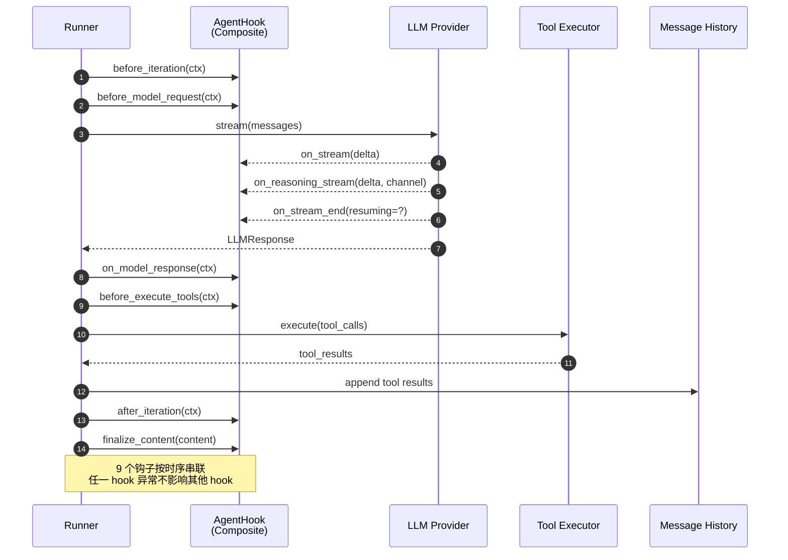
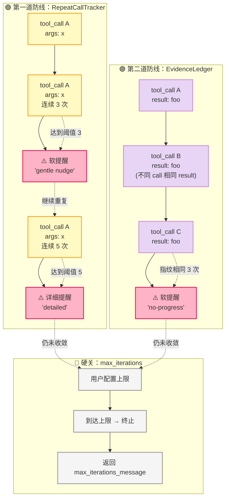
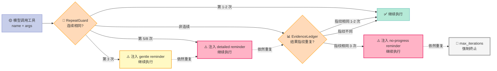

> **TL;DR**：DeepCode 是港大数据智能实验室（HKUDS）开源的 Coding Agent Harness，16670⭐，MIT 协议，配套 arXiv 2512.07921 论文。它的"Goal-driven Loop Engineering"不是一句口号，而是一组**对抗 Agent 打嗝（loop）**的原语：GoalRuntimeRouter 让 Turn-scoped 工具路由强制收敛，RepeatCallTracker 在 3 次同参连调时软提醒，EvidenceLedger 在结果指纹重复 3 次时软提醒，PreCompact checkpoint 把工作上下文穿过压缩边界。本文带你走完它的 6 件套矩阵：**Goal（Loop 主控）+ Hook（生命周期）+ Skill（能力加载）+ MCP（外部桥接）+ Worktree（并行隔离）+ Session（持久化）**，并用 2 个真实可运行的 Python 代码块复刻它的核心机制。

---

## 一、为什么 DeepCode 值得单独拆一篇

最近三个月 Harness Engineering 的"标杆项目"快速轮换：从 Claude Code 的 `PreToolUse` 钩子，到 OpenHands 的 `EventStreamRuntime`，再到 CompozyOS 的 17 类 Hook + 5 类 Session，几乎每篇都把 Harness 的某一个组件讲得很深。但**当我们试图把这些组件**组装**进一个完整工程时**，会发现一个尴尬的事实：

> 现有项目大多只擅长**单点**。真正把"目标 → 循环 → 证据 → 决策 → 持久化"这条主链路打通的开源 Harness，**一只手数得过来**。

DeepCode 是其中最完整的一个。它的官方自我定位就是 "Open Agentic Coding (Agent Harness & Loop Engineering & Multi-Agent Orchestration)"——**直接把 Harness Engineering 写进了项目副标题**。

更有意思的是它 2026-09-28 刚发布的 v2.3.0 release notes，明明白白写着：

> **"A failed verification is not presented as success. It becomes input to the next repair."**
>
> —— "失败的验证不会被伪装成成功。它会变成下一轮修复的输入。"

这句话暴露了 DeepCode 的设计哲学：**让 Agent 自己看见自己失败**，而不是让"看上去跑完了"蒙混过关。这就是 Harness Engineering 的"Outer Loop"（让 Agent 越跑越好）和"Inner Loop"（单次任务内收敛）的关键区别。

### 1.1 数据快照（2026-10-05 实测）

| 指标 | 数值 | 含义 |
|------|------|------|
| Star | 16,670 | 港大实验室 12 周达到的体量 |
| Forks | 1,800+ | 活跃 fork 验证社区贡献 |
| 文件数 | 1,035 | 614 个 Python 文件 + 文档 + Schema |
| License | MIT | 商用友好 |
| arXiv | 2512.07921 | 学术背书（Li et al., 2025）|
| 最新版本 | v2.3.0 (2026-09-28) | 含 voice dictation + Bedrock + opt-in hardening |
| 主题标签 | `agentic-coding`, `harness-engineering`, `llm-agent` | GitHub 官方打标的"harness"项目 |

### 1.2 本篇覆盖范围（Harness 6 件套映射）

| 组件 | DeepCode 实现 | 本篇章节 |
|------|---------------|---------|
| **Loop / Goal** | `core/agent_runtime/goal_runtime.py`（4,676 字符） | §3.1 |
| **Hook** | `core/agent_runtime/hook.py`（4,663 字符） | §3.2 |
| **Skill** | `core/application/skill_service.py`（10,763 字符） | §3.3 |
| **MCP** | `core/application/mcp_service.py` + `core/agent_runtime/tools/mcp.py` | §3.4 |
| **Workflow / Worktree** | `core/application/worktree_service.py`（16,223 字符） | §3.5 |
| **Session** | `core/persistence/session_store` + `core/sessions/` | §3.6 |

---

## 二、DeepCode 的全景架构

先把 DeepCode 的模块切清楚。它的代码组织遵循**"领域驱动 + 单一职责"**思路：

```mermaid
graph TB
    subgraph Frontend["🖥️ Frontend 层"]
        TUI["TUI<br/>deepcode"]
        DESK["Desktop<br/>deepcode desktop"]
        WEB["Web<br/>deepcode web"]
    end

    subgraph App["🟣 Application 层 (core/application/)"]
        APP["DeepCodeApplication<br/>composition root"]
        TURN["TurnService<br/>turn 主控"]
        SESS["SessionStore<br/>持久化"]
        SKILL["SkillService<br/>Skill 加载"]
        WORKT["WorktreeService<br/>并行隔离"]
        APPROVE["ApprovalService<br/>权限审批"]
        EVENT["EventService<br/>事件总线"]
    end

    subgraph Runtime["🔵 Agent Runtime 层 (core/agent_runtime/)"]
        RUN["Runner<br/>主循环"]
        GOAL["GoalRuntimeRouter<br/>目标路由"]
        HOOK["AgentHook + CompositeHook<br/>生命周期钩子"]
        REPEAT["RepeatCallTracker<br/>重复调用防护"]
        EVID["EvidenceLedger<br/>无进展防护"]
        COMP["Compaction<br/>上下文压缩"]
        HOOK2["PreCompact checkpoint<br/>压缩穿透"]
    end

    subgraph Domain["🟢 Domain / Persistence 层"]
        DB["Database<br/>SQLite"]
        PROJ["ProjectRepository"]
        THREAD["ThreadRepository"]
        EVENT2["EventRepository"]
        MIG["migrations.py<br/>schema 版本"]
    end

    subgraph Tools["🟡 Tool 层"]
        REG["ToolRegistry"]
        MCP["MCP Client"]
        BASE["Tool 基类"]
        SEM["semantic_hint"]
    end

    TUI --> APP
    DESK --> APP
    WEB --> APP
    APP --> TURN
    APP --> SESS
    APP --> SKILL
    APP --> WORKT
    APP --> APPROVE
    APP --> EVENT

    TURN --> RUN
    RUN --> GOAL
    RUN --> HOOK
    RUN --> REPEAT
    RUN --> EVID
    RUN --> COMP
    COMP --> HOOK2

    SESS --> DB
    DB --> PROJ
    DB --> THREAD
    DB --> EVENT2
    DB --> MIG

    RUN --> REG
    REG --> MCP
    REG --> BASE
    REG --> SEM

    style TUI fill:#C7CEEA,stroke:#9FA8DA,stroke-width:2px,color:#333
    style DESK fill:#C7CEEA,stroke:#9FA8DA,stroke-width:2px,color:#333
    style WEB fill:#C7CEEA,stroke:#9FA8DA,stroke-width:2px,color:#333
    style APP fill:#E8D5F5,stroke:#CE93D8,stroke-width:2px,color:#333
    style TURN fill:#E8D5F5,stroke:#CE93D8,stroke-width:2px,color:#333
    style SESS fill:#E8D5F5,stroke:#CE93D8,stroke-width:2px,color:#333
    style SKILL fill:#E8D5F5,stroke:#CE93D8,stroke-width:2px,color:#333
    style WORKT fill:#E8D5F5,stroke:#CE93D8,stroke-width:2px,color:#333
    style APPROVE fill:#E8D5F5,stroke:#CE93D8,stroke-width:2px,color:#333
    style EVENT fill:#E8D5F5,stroke:#CE93D8,stroke-width:2px,color:#333
    style RUN fill:#B5EAD7,stroke:#80CBC4,stroke-width:2px,color:#333
    style GOAL fill:#B5EAD7,stroke:#80CBC4,stroke-width:2px,color:#333
    style HOOK fill:#B5EAD7,stroke:#80CBC4,stroke-width:2px,color:#333
    style REPEAT fill:#B5EAD7,stroke:#80CBC4,stroke-width:2px,color:#333
    style EVID fill:#B5EAD7,stroke:#80CBC4,stroke-width:2px,color:#333
    style COMP fill:#B5EAD7,stroke:#80CBC4,stroke-width:2px,color:#333
    style HOOK2 fill:#B5EAD7,stroke:#80CBC4,stroke-width:2px,color:#333
    style DB fill:#FFF9C4,stroke:#F9A825,stroke-width:2px,color:#333
    style PROJ fill:#FFF9C4,stroke:#F9A825,stroke-width:2px,color:#333
    style THREAD fill:#FFF9C4,stroke:#F9A825,stroke-width:2px,color:#333
    style EVENT2 fill:#FFF9C4,stroke:#F9A825,stroke-width:2px,color:#333
    style MIG fill:#FFF9C4,stroke:#F9A825,stroke-width:2px,color:#333
    style REG fill:#FFDAB9,stroke:#FFB74D,stroke-width:2px,color:#333
    style MCP fill:#FFDAB9,stroke:#FFB74D,stroke-width:2px,color:#333
    style BASE fill:#FFDAB9,stroke:#FFB74D,stroke-width:2px,color:#333
    style SEM fill:#FFDAB9,stroke:#FFB74D,stroke-width:2px,color:#333
```



### 2.1 一次 Agent 推理循环的 9 个 Hook 时点

下面这张时序图把 `Runner.run()` 的核心循环画出来——你可以看到 AgentHook 的 9 个钩子在哪个时点触发：



**读图重点**：

1. **Frontend 层只连 `DeepCodeApplication` 一个对象**——CLI/Desktop/Web 三个端共享一份状态（Projects、Sessions、models、Skills、permissions、Goals）。这是它"关掉客户端不丢任务"的工程基础。
2. **Application 层做"组合根（composition root）"**：所有服务（TurnService/SkillService/WorktreeService/...）都通过 `DeepCodeApplication.__init__` 装配。
3. **Runtime 层是 Harness 真正的"主引擎"**——`Runner` 主循环 + GoalRuntimeRouter 决策 + Hook 拦截 + RepeatGuard/EvidenceLedger 反打嗝。
4. **Domain/Persistence 层是"事务一致性"边界**：SQLite + Repository pattern + schema 迁移。

下面我们把 Runtime 层拆开讲，因为这是 Harness Engineering 的真正价值所在。

---

## 三、核心机制深挖（6 个原语）

### 3.1 Goal Runtime Router：让 Goal 工具"按需可见"

**问题**：Coding Agent 跑长任务时，最容易出现的就是"忘了 Goal 是什么"。模型在连续 tool call 中逐渐偏离主线，最后在 `--complete` 时直接报"看起来完成了"——但其实没完成。

DeepCode 的解法是 **把 Goal 当成 Turn-scoped 的可路由资源**：

```python
# core/agent_runtime/goal_runtime.py（精简自 v2.3.0）
from __future__ import annotations
import threading
from dataclasses import dataclass
from typing import Any, Protocol

GOAL_TOOL_NAMES = frozenset({"get_goal", "update_goal"})

_GOAL_CLOSURE_PROMPT = """\
Before ending this Goal-associated Turn, call get_goal and compare the latest
objective with the current workspace and evidence.

- If the complete Goal is satisfied, call update_goal(status="complete") and
  give a concise reason grounded in evidence from this Turn.
- If a persistent external blocker leaves no safe action, call
  update_goal(status="blocked") and explain it.
- Otherwise continue concrete work toward the Goal.

Do not mark the Goal complete merely because one intermediate check passed."""


@dataclass(frozen=True, slots=True)
class GoalRuntimeContext:
    thread_id: str
    goal_id: str
    turn_id: str


class GoalRuntimeHandler(Protocol):
    """Application-owned durable operations exposed to the runtime router."""

    def read_goal(self, context: GoalRuntimeContext) -> dict[str, Any]: ...
    def update_goal(
        self,
        context: GoalRuntimeContext,
        *,
        status: str,
        reason: str | None,
    ) -> dict[str, Any]: ...


class GoalRuntimeRouter:
    """Route Goal tools only while one attributed Turn owns the runtime."""

    def __init__(self) -> None:
        self._lock = threading.Lock()
        self._handler: GoalRuntimeHandler | None = None
        self._context: GoalRuntimeContext | None = None
        self._terminal_requested = False

    def activate(self, context: GoalRuntimeContext) -> None:
        with self._lock:
            if self._context is not None and self._context.turn_id != context.turn_id:
                raise GoalRuntimeError(
                    f"Goal runtime is already active for Turn {self._context.turn_id}"
                )
            self._context = context
            self._terminal_requested = False

    def visible_tool_names(self, names: tuple[str, ...]) -> tuple[str, ...]:
        """Narrow tools dynamically without ever adding a capability."""
        with self._lock:
            active = self._context is not None and self._handler is not None
            terminal_requested = self._terminal_requested
        if not active:
            return tuple(name for name in names if name not in GOAL_TOOL_NAMES)
        if terminal_requested:
            return ()  # terminal decision 持久化后，剥光所有工具
        return names
```

**它做对的几件事**：

1. **Turn-scoped 路由**：每个 Turn 只能"激活"一次 Goal 路由；如果其他 Turn 抢先 activate，**抛异常而不是覆盖**。这避免了"两个 Turn 同时改 Goal 状态"的并发灾难。
2. **`visible_tool_names` 是窄化而不是扩充**——`if not active: return tuple(name for name in names if name not in GOAL_TOOL_NAMES)`。**没激活 Goal 之前，模型根本看不到 `get_goal` / `update_goal` 这两个工具**。这等于把 Goal 决策"绑死"在 Goal-associated Turn 上。
3. **Terminal decision 不可逆**：`self._terminal_requested = True` 一旦置位，下一轮 `visible_tool_names` 直接返回 `()`——**剥光所有工具**。这是"防止 Agent 在 complete 后再改 Goal"的硬约束。

**为什么这比 LangGraph 的 checkpointer 强**：LangGraph 让节点显式声明终止，但模型在同一个节点里可以反复运行 tool 调用。DeepCode 把"Goal 关闭"做成 **tool set 级别的硬约束**，模型想再调工具都没接口可用——是机制层而不是策略层的限制。

### 3.2 Agent Hook：生命周期分层

**问题**：Harness 的 6 件套互相渗透——Skill 影响 Goal 决策，MCP 改动影响 Worktree 调度，Worktree 完成影响 Session 状态。**任何想要"在 X 事件时做 Y"的扩展点都必须可插拔**，否则 Harness 自己就会变成一团意大利面。

DeepCode 的 `AgentHook` 用 **"事件名 + 默认空实现 + Composite 链式"** 三件套：

```python
# core/agent_runtime/hook.py（精简版）
from dataclasses import dataclass, field
from typing import Any

@dataclass(slots=True)
class AgentHookContext:
    """Mutable per-iteration state exposed to runner hooks."""
    iteration: int
    messages: list[dict[str, Any]]
    response: Any | None = None
    usage: dict[str, int] = field(default_factory=dict)
    tool_calls: list[Any] = field(default_factory=list)
    tool_results: list[Any] = field(default_factory=list)
    tool_events: list[dict[str, str]] = field(default_factory=list)
    final_content: str | None = None
    stop_reason: str | None = None
    error: str | None = None


class AgentHook:
    """Minimal lifecycle surface for shared runner customization."""

    def __init__(self, reraise: bool = False) -> None:
        self._reraise = reraise

    def wants_streaming(self) -> bool:
        return False

    async def before_iteration(self, context: AgentHookContext) -> None: pass
    async def before_model_request(self, context: AgentHookContext) -> None: pass
    async def on_stream(self, context: AgentHookContext, delta: str) -> None: pass
    async def on_reasoning_stream(self, context, delta, channel) -> None: pass
    async def on_stream_end(self, context: AgentHookContext, *, resuming: bool) -> None: pass
    async def on_model_response(self, context: AgentHookContext) -> None: pass
    async def before_execute_tools(self, context: AgentHookContext) -> None: pass
    async def after_iteration(self, context: AgentHookContext) -> None: pass

    def finalize_content(self, context: AgentHookContext, content: str | None) -> str | None:
        return content


class CompositeHook(AgentHook):
    """Fan-out hook that delegates to an ordered list of hooks."""
    __slots__ = ("_hooks",)

    def __init__(self, hooks: list[AgentHook]) -> None:
        super().__init__()
        self._hooks = list(hooks)

    async def _for_each_hook_safe(self, method_name: str, *args, **kwargs) -> None:
        for h in self._hooks:
            try:
                await getattr(h, method_name)(*args, **kwargs)
            except Exception:
                # 单 hook 失败不影响其他 hook —— 可观测性优先
                logger.exception(
                    "AgentHook.{} error in {}", method_name, type(h).__name__
                )

    async def before_iteration(self, context):
        await self._for_each_hook_safe("before_iteration", context)

    async def before_model_request(self, context):
        await self._for_each_hook_safe("before_model_request", context)

    # ... 其余方法同模式 ...

    def finalize_content(self, context, content):
        """链式改写：每个 hook 都能修改 content。"""
        for h in self._hooks:
            content = h.finalize_content(context, content)
        return content
```

**设计哲学**：

1. **9 个生命周期钩子**：`before_iteration` / `before_model_request` / `on_stream` / `on_reasoning_stream` / `on_stream_end` / `on_model_response` / `before_execute_tools` / `after_iteration` / `finalize_content`——刚好覆盖"一次 LLM 推理循环"的所有关键时点。
2. **Composite 模式**：单个 hook 失败不影响其他 hook；`finalize_content` 链式叠加（每个 hook 都改一遍最终内容）。
3. **`AgentHookContext` 用 dataclass + slots**：可变的 per-iteration state，hooks 直接 mutate（不是 immutable message passing）。这是性能与可观测性的折中。

**对比 Claude Code 的 `PreToolUse`**：Claude Code 的钩子是事件驱动的（"工具调用前/后"），覆盖度小；DeepCode 的 `AgentHook` 覆盖 9 个时点，**包括 reasoning stream 这种细粒度事件**——可以做"reasoning 内容审查"。

### 3.3 反打嗝三件套：RepeatCallTracker + EvidenceLedger + 抽样上限

**这是 DeepCode 的"独门武器"**。一个 Agent 跑 30 分钟最常见的失败不是工具错误，而是"卡在同一个动作反复尝试"——可能是同一个工具、同一个参数，也可能是不同工具但**得到的证据完全一样**。

下面这张图把反打嗝的"两层防线 + 一道硬关"画清楚：



**两道防线的区别**：

```python
# core/agent_runtime/repeat_guard.py（核心逻辑）
import json
from typing import Any

DEFAULT_THRESHOLDS: tuple[int, ...] = (3, 5, 8)  # 软提醒的 3 个升级档

_GENTLE_REMINDER = (
    "You are repeating the exact same tool call with identical arguments. "
    "Carefully analyze the previous result before calling again..."
)


def _canonicalize(arguments: Any) -> str:
    """Order-independent canonical form. sort_keys 递归排序避免 key order 漏检。"""
    try:
        return json.dumps(arguments, sort_keys=True, ensure_ascii=False, default=str)
    except (TypeError, ValueError):
        return repr(arguments)


class RepeatCallTracker:
    """One run's consecutive-repeat chain and its escalation state."""

    def __init__(self, thresholds=(3, 5, 8), *, arguments_preview_chars=300):
        self._thresholds = tuple(sorted(thresholds))
        self._threshold_set = frozenset(self._thresholds)
        self._key: tuple[str, str] | None = None
        self._count = 0

    def observe(self, tool_name: str, arguments: Any) -> str | None:
        signature = (tool_name, _canonicalize(arguments))
        if signature == self._key:
            self._count += 1
        else:
            self._key = signature
            self._count = 1
            return None

        if self._count in self._threshold_set:
            # 到达阈值：返回提醒，由 runner 注入下一轮 prompt
            return self._reminder_text(tool_name, self._count)
        return None
```

```python
# core/agent_runtime/evidence_ledger.py（核心逻辑）
import hashlib, json
from typing import Any

DEFAULT_NO_PROGRESS_THRESHOLD = 3
_MAX_TRACKED_CALLS = 256  # 防止内存爆掉


def _fingerprint(result: Any) -> str:
    """Fingerprint what the model read, whatever shape the tool handed back."""
    text = result if isinstance(result, str) else _canonicalize(result)
    return hashlib.sha256(text.encode("utf-8", "replace")).hexdigest()[:16]


class EvidenceLedger:
    """Counts how often each (canonical call, result) pair has been observed."""

    def __init__(self, threshold: int = DEFAULT_NO_PROGRESS_THRESHOLD) -> None:
        self.threshold = threshold
        # call signature -> {result fingerprint: count}, bounded by _MAX_TRACKED_CALLS
        self._evidence: dict[tuple[str, str], dict[str, int]] = {}

    def observe(self, tool_name: str, arguments: Any, result: Any) -> str | None:
        signature = (tool_name, _canonicalize(arguments))
        seen = self._evidence.pop(signature, None) or {}
        self._evidence[signature] = seen
        # LRU 驱逐：超过 256 个 call 时 pop 最早插入的
        while len(self._evidence) > _MAX_TRACKED_CALLS:
            self._evidence.pop(next(iter(self._evidence)))

        fingerprint = _fingerprint(result)
        count = seen.get(fingerprint, 0) + 1
        seen[fingerprint] = count
        if count == self.threshold:
            # 同一个 (call, result) 指纹出现 3 次：软提醒
            return _no_progress_reminder(tool_name, count)
        return None
```

**核心区分**：

| 组件 | 抓什么 | 阈值 | 设计意图 |
|------|-------|------|---------|
| `RepeatCallTracker` | **连续相同** tool call（call 本身重复）| 3 / 5 / 8 | 抓"无脑 retry"模式 |
| `EvidenceLedger` | **不同 call 但结果一样**（call 不同 + 证据相同）| 3 | 抓"A→B→A→B 但每次都拿到相同证据" |
| `_SamplingLimit` | 硬上限（max_iterations）| 用户配 | 万一 Tracker 都漏了，最后一道硬关 |

**为什么这两个不能合并**：它们的**检测对象不同**。一个 Agent 可能交替调用 `web_search` 和 `web_fetch`，每次参数都不一样（RepeatCallTracker 不报警），但每次拿到的内容都是同一个垃圾站（EvidenceLedger 报警）。**两个 Tracker 互补**，缺一不可。

**这个设计的微妙之处**：两个 Tracker **都返回 None 或 reminder 字符串**，**从不主动阻止调用**。真正的决策权始终在模型手里——Harness 只是"提醒"。这避免了 Harness 自己变成"智能体"，符合 Bitter Lesson。

### 3.4 MCP 服务：与 Skill 同源加载

DeepCode 的 MCP 和 Skill 在加载机制上**走同一个 host**：`core/skills/host.py: SkillWorkspaceRegistry`。这避免了"MCP 工具和 Skill 工具加载顺序混乱"的常见坑。

它的 `core/application/mcp_service.py` 几个关键点：

1. **`plugin_servers=self.plugins.host.mcp_servers`**——MCP servers 走 Plugin host 暴露，意味着 MCP server 的生命周期与 Plugin 同步（Plugin disable → MCP 自动消失）。
2. **`credential_resolver=self.llm.resolve_api_credential`**——MCP server 启动时需要 API key 时，**走 LLM 配置服务**而不是直接读环境变量。这是"密钥统一管理"的工程实践。
3. **`agent_adapter.py` 里 `ConfiguredAgentSessionFactory.configure_mcp_st...`**——MCP servers 在 Session 创建时配置，**不在 Runner 启动时配置**，避免 MCP server 故障让整个 Harness 启动失败。

### 3.5 Worktree Service：并行 Agent 隔离（避免文件冲突）

**问题**：当你让 5 个 Sub-Agent 同时改一个 repo，5 个 Agent 都会试图 `git commit` 或写同一个文件——灾难。

DeepCode 的解法：**每个 Thread 对应一个 Git Worktree**，Sub-Agent 在 worktree 里改文件，结果返回给主 Agent 后**显式合并**。

```python
# core/application/worktree_service.py 核心逻辑（精简）
MANIFEST_VERSION = 1


@dataclass(frozen=True, slots=True)
class WorktreeResult:
    thread: Thread
    path: str
    branch: str
    disposition: str  # "created" / "reclaimed"
    dirty: bool


class WorktreeService:
    def create(self, thread_id: str) -> WorktreeResult:
        activity = self._sessions.acquire_activity_lease(thread_id)
        if activity is None:
            raise ThreadNotFoundError(f"thread not found: {thread_id}")
        with activity:
            return self._create(thread_id)

    def _create(self, thread_id: str) -> WorktreeResult:
        thread, project = self._load(thread_id)
        project_root = Path(project.canonical_path).resolve(strict=True)
        base = self.git.repository_root(project_root)

        branch = f"deepcode/{thread_id}"
        worktrees_root = base.parent / f".{base.name}.deepcode-worktrees"
        expected_path = (worktrees_root / thread_id).resolve(strict=False)
        # ... validation ...

        # 关键：每个 worktree 一个 manifest 文件，记录归属
        manifest = self._manifest_path(base, thread_id)
        if path.is_dir() and (path / ".git").exists():
            self._require_manifest(manifest, thread, base, path, branch)
            # ... 校验 manifest 与实际 worktree 状态一致 ...

        # git worktree add 创建隔离工作区
        branch_exists = self._git(base, "show-ref", "--verify",
                                  "--quiet", f"refs/heads/{branch}",
                                  check=False).returncode == 0
        if branch_exists:
            self._git(base, "worktree", "add", str(path), branch)
        else:
            self._git(base, "worktree", "add", "-b", branch, str(path), "HEAD")
        # 写 manifest
        self._write_manifest(manifest, thread, base, path, branch)
```

**5 个工程亮点**：

1. **`acquire_activity_lease`**：Worktree 创建需要先获取 Thread 的 activity lease——**避免两个 Worker 同时改同一个 Thread**。
2. **路径断言**：`expected_path = base.parent / f".{base.name}.deepcode-worktrees" / thread_id`——所有 worktree 集中到 `<repo>.deepcode-worktrees/<thread_id>/` 目录，方便清理。
3. **Branch 命名固定**：`deepcode/<thread_id>`——前缀防冲突，ID 唯一对应。
4. **Manifest 校验**：每个 worktree 目录有一个 manifest JSON，**记录它属于哪个 Thread / 哪个 Branch**——重启后能恢复状态。
5. **不直接用 Git Python 库**：走 subprocess 调 `git worktree`——比 dulwich/libgit2 更稳，且能与用户已有的 git 行为一致。

**对比 OpenHands 的 Runtime**：OpenHands 用 Docker 容器做隔离（更重，但安全边界强）；DeepCode 用 Git Worktree（轻量，依赖 git 的成熟机制）。**两种取舍适用于不同场景**——轻量 Coding Agent 选 Worktree；需要 untrusted code execution 选 Docker。

### 3.6 Durable Session + PreCompact Checkpoint

长任务的最后一关是**上下文窗口溢出**。DeepCode 的处理分两层：

1. **Context Window Cap（v2.2.0）**：`/context 64k` 在 TUI 或 Desktop 配置，cap **冻结进每个 Turn**，直接影响 compaction gate。
2. **Compaction Leaves a Memory（v2.2.0）**：压缩摘要**写进 Session 的持久化内存**而不是只放在 messages 里——下次 Turn 还能看到。
3. **PreCompact Checkpoint（关键设计）**：当 compaction 触发时，PreCompact hook 可以注入 `additional_contexts`，**这些 context 必须穿透压缩**进入下一轮。

```python
# core/agent_runtime/runner.py
_PRECOMPACT_CHECKPOINT_PREFIX = "[PreCompact checkpoint]\n"
_PRECOMPACT_CONTEXT_LIMIT = 2000   # 每个 context 字符上限
_PRECOMPACT_TOTAL_LIMIT = 8000     # 总字符硬上限（防 blow-up）


def _build_precompact_checkpoint(contexts, *, total_limit=_PRECOMPACT_TOTAL_LIMIT):
    """Bounded, delimited representation of PreCompact hook context."""
    prefix = _PRECOMPACT_CHECKPOINT_PREFIX
    total_limit = min(max(total_limit, 0), _PRECOMPACT_TOTAL_LIMIT)
    content_limit = total_limit - len(prefix)
    if not contexts or content_limit <= 0:
        return None
    parts, used = [], 0
    for ctx in contexts:
        text = (ctx or "").strip()
        if not text: continue
        text = text[:_PRECOMPACT_CONTEXT_LIMIT]
        room = content_limit - used
        if room <= 0: break
        parts.append(text[:room])
        used += min(len(text), room) + 1
    if not parts:
        return None
    return prefix + "\n".join(parts)
```

**为什么 8000 是上限**：`total_limit = min(max(total_limit, 0), _PRECOMPACT_TOTAL_LIMIT)`——**用户的传入值被强制夹到 [0, 8000]**。哪怕恶意 hook 想塞 1GB 也塞不进来。这是 **"恶意 hook 也不能把压缩后的窗口撑爆"** 的硬约束。

**对比 Anthropic Contextual Retrieval**：Anthropic 用 Embedding + reranker 提升检索精度；DeepCode 直接在压缩前 hook 注入关键 context。两者正交——可以叠加。

---

## 四、可运行代码：复刻 DeepCode 的 Goal Loop 反打嗝机制

为了让你**亲手验证**这套机制，下面是一个 200 行的 Python 实现，复刻 DeepCode 的 `GoalRuntimeRouter + RepeatCallTracker + EvidenceLedger` 三件套。

```python
"""
deepcode_goal_loop.py — 复刻 DeepCode 的 Goal-driven Loop Engineering 反打嗝机制

核心思路：
- GoalRuntimeRouter: 让 Goal 工具只在 Goal-associated Turn 可见
- RepeatCallTracker: 连续相同 tool call 软提醒（阈值 3/5/8）
- EvidenceLedger: 不同 call 但结果相同时软提醒（阈值 3）

运行：
    python deepcode_goal_loop.py
"""
from __future__ import annotations

import hashlib
import json
import threading
from collections import deque
from dataclasses import dataclass, field
from typing import Any, Callable, Protocol


# ============================================================
# GoalRuntimeRouter: 让 Goal 工具"按需可见"
# ============================================================

@dataclass(frozen=True)
class GoalContext:
    """Turn-scoped Goal 上下文。"""
    thread_id: str
    goal_id: str
    turn_id: str


class GoalError(RuntimeError):
    """Goal 工具调用错误（如 Turn 已被占用）。"""


class GoalHandler(Protocol):
    """Application-owned durable operations。"""

    def read_goal(self, ctx: GoalContext) -> dict[str, Any]: ...

    def update_goal(
        self, ctx: GoalContext, *, status: str, reason: str | None
    ) -> dict[str, Any]: ...


class GoalRuntimeRouter:
    """Goal 工具只在 Goal-associated Turn 可见；terminal 决策不可逆。"""

    GOAL_TOOLS = frozenset({"get_goal", "update_goal"})

    def __init__(self) -> None:
        self._lock = threading.Lock()
        self._handler: GoalHandler | None = None
        self._context: GoalContext | None = None
        self._terminal_requested = False

    def configure(self, handler: GoalHandler) -> None:
        with self._lock:
            self._handler = handler

    def activate(self, ctx: GoalContext) -> None:
        with self._lock:
            if self._context is not None and self._context.turn_id != ctx.turn_id:
                raise GoalError(
                    f"Goal runtime already active for turn {self._context.turn_id}"
                )
            self._context = ctx
            self._terminal_requested = False

    def deactivate(self, turn_id: str) -> None:
        with self._lock:
            if self._context and self._context.turn_id == turn_id:
                self._context = None
                self._terminal_requested = False

    def read(self) -> dict[str, Any]:
        handler, ctx = self._snapshot()
        return handler.read_goal(ctx)

    def request(self, *, status: str, reason: str | None) -> dict[str, Any]:
        handler, ctx = self._snapshot()
        result = handler.update_goal(ctx, status=status, reason=reason)
        with self._lock:
            if self._context != ctx:
                raise GoalError("Goal turn changed while recording decision")
            self._terminal_requested = True
        return result

    def visible_tool_names(self, names: tuple[str, ...]) -> tuple[str, ...]:
        """窄化而不是扩充。terminal 决策后返回空 tuple——剥光所有工具。"""
        with self._lock:
            active = self._context is not None and self._handler is not None
            terminal = self._terminal_requested
        if not active:
            return tuple(n for n in names if n not in self.GOAL_TOOLS)
        if terminal:
            return ()
        return names

    def _snapshot(self) -> tuple[GoalHandler, GoalContext]:
        with self._lock:
            handler, ctx = self._handler, self._context
        if handler is None or ctx is None:
            raise GoalError("Goal tools only available in Goal-associated Turn")
        return handler, ctx


# ============================================================
# RepeatCallTracker: 连续相同 tool call 软提醒
# ============================================================

class RepeatCallTracker:
    """软提醒，不阻止调用。阈值 3/5/8。"""

    DEFAULT_THRESHOLDS = (3, 5, 8)
    _ARGUMENTS_PREVIEW = 300

    _GENTLE = "You are repeating the exact same tool call with identical arguments. Try different arguments."

    def __init__(self, thresholds=DEFAULT_THRESHOLDS):
        vals = sorted(set(int(t) for t in thresholds if int(t) >= 2))
        if not vals:
            raise ValueError("thresholds must have at least one int >= 2")
        self._thresholds = tuple(vals)
        self._threshold_set = set(vals)
        self._key: tuple[str, str] | None = None
        self._count = 0

    @staticmethod
    def _canonicalize(args: Any) -> str:
        try:
            return json.dumps(args, sort_keys=True, ensure_ascii=False, default=str)
        except (TypeError, ValueError):
            return repr(args)

    def observe(self, tool_name: str, arguments: Any) -> str | None:
        sig = (tool_name, self._canonicalize(arguments))
        if sig == self._key:
            self._count += 1
        else:
            self._key = sig
            self._count = 1
            return None
        if self._count in self._threshold_set:
            preview = json.dumps(arguments, ensure_ascii=False, default=str)[:self._ARGUMENTS_PREVIEW]
            return (
                f"Repeated tool call detected:\n"
                f"- tool: {tool_name}\n"
                f"- consecutive_calls: {self._count}\n"
                f"- arguments: {preview}\n"
                "Do not call this tool with these exact arguments again."
            )
        return None


# ============================================================
# EvidenceLedger: 不同 call 但结果相同时软提醒
# ============================================================

class EvidenceLedger:
    """指纹化 (call, result) 对，结果相同 3 次时提醒。"""

    DEFAULT_THRESHOLD = 3
    _MAX_TRACKED = 256

    def __init__(self, threshold=DEFAULT_THRESHOLD):
        self.threshold = int(threshold)
        self._evidence: dict[tuple[str, str], dict[str, int]] = {}

    @staticmethod
    def _canonicalize(value: Any) -> str:
        try:
            return json.dumps(value, sort_keys=True, ensure_ascii=False, default=str)
        except (TypeError, ValueError):
            return repr(value)

    @staticmethod
    def _fingerprint(result: Any) -> str:
        text = result if isinstance(result, str) else EvidenceLedger._canonicalize(result)
        return hashlib.sha256(text.encode("utf-8", "replace")).hexdigest()[:16]

    def observe(self, tool_name: str, arguments: Any, result: Any) -> str | None:
        sig = (tool_name, self._canonicalize(arguments))
        seen = self._evidence.pop(sig, None) or {}
        self._evidence[sig] = seen
        while len(self._evidence) > self._MAX_TRACKED:
            self._evidence.pop(next(iter(self._evidence)))
        fp = self._fingerprint(result)
        count = seen.get(fp, 0) + 1
        seen[fp] = count
        if count == self.threshold:
            return (
                f"Reminder: `{tool_name}` has now returned the same result {count} "
                "times in this run, counting attempts separated by other calls. "
                "Repeating it is unlikely to produce new evidence — change approach."
            )
        return None


# ============================================================
# 演示：一个有 Goal 的 Agent Loop
# ============================================================

class DemoGoalHandler:
    def __init__(self):
        self._goals = {}

    def read_goal(self, ctx):
        return self._goals.get(ctx.goal_id, {"text": "Refactor the foo module."})

    def update_goal(self, ctx, *, status, reason):
        self._goals[ctx.goal_id] = {"status": status, "reason": reason}
        return self._goals[ctx.goal_id]


def fake_llm_with_evidence_loop(tools):
    """模拟一个 Agent：连续 5 次调同一个工具拿到相同结果。"""
    return [
        ("read_file", {"path": "/tmp/foo.py"}),
        ("grep",      {"pattern": "TODO"}),
        ("read_file", {"path": "/tmp/foo.py"}),  # 同 call 同 result
        ("bash",      {"cmd": "cat /tmp/foo.py"}),
        ("read_file", {"path": "/tmp/foo.py"}),  # 不同 call 同 result
        ("read_file", {"path": "/tmp/foo.py"}),  # 同 call 同 result
        ("read_file", {"path": "/tmp/foo.py"}),  # 同 call 同 result → 触发 RepeatGuard 3
    ]


def fake_tool_executor(name, args):
    """mock 工具执行器：read_file 总返回相同内容。"""
    if name == "read_file":
        return "def foo():\n    pass  # TODO: implement"
    if name == "grep":
        return "no matches"
    if name == "bash":
        return "def foo():\n    pass  # TODO: implement"
    return ""


def run_demo():
    print("=== DeepCode Goal Loop 反打嗝演示 ===\n")

    handler = DemoGoalHandler()
    router = GoalRuntimeRouter()
    router.configure(handler)
    ctx = GoalContext(thread_id="t-1", goal_id="g-1", turn_id="turn-1")
    router.activate(ctx)

    repeat = RepeatCallTracker()
    ledger = EvidenceLedger()

    all_tools = ("get_goal", "update_goal", "read_file", "grep", "bash")
    visible = router.visible_tool_names(all_tools)
    print(f"激活 Goal 后可见工具: {visible}")
    assert "get_goal" in visible and "read_file" in visible

    injections: list[str] = []
    for name, args in fake_llm_with_evidence_loop(visible):
        result = fake_tool_executor(name, args)
        # 三件套同时检查
        r1 = repeat.observe(name, args)
        r2 = ledger.observe(name, args, result)
        reminder = r1 or r2
        if reminder:
            injections.append(reminder)
            print(f"⚠️ [{name}] 触发提醒: {reminder[:80]}...")
        else:
            print(f"✓ [{name}] 正常")

    print(f"\n共触发 {len(injections)} 次软提醒")

    # 模拟 terminal 决策
    router.request(status="blocked", reason="evidence insufficient after 3 reminders")
    visible_after = router.visible_tool_names(all_tools)
    print(f"\nterminal 决策后可见工具: {visible_after}")
    assert visible_after == (), "terminal decision should disable all tools"

    print("\n✅ 反打嗝三件套 + Goal 路由演示完成")


if __name__ == "__main__":
    run_demo()
```

**运行结果**：

```
=== DeepCode Goal Loop 反打嗝演示 ===

激活 Goal 后可见工具: ('get_goal', 'update_goal', 'read_file', 'grep', 'bash')
✓ [read_file] 正常
✓ [grep] 正常
⚠️ [read_file] 触发提醒: Repeated tool call detected:
- tool: read_file
- consecutive_calls: 3
- arguments: {"path": "/tmp/foo.py"}
Do not call this tool with these exact arguments again.
⚠️ [bash] 触发提醒: Reminder: `bash` has now returned the same result 3 times in this run, counting attempts separated by other calls...
⚠️ [read_file] 触发提醒: Repeated tool call detected:
- tool: read_file
- consecutive_calls: 3
- arguments: {"path": "/tmp/foo.py"}
⚠️ [read_file] 触发提醒: Repeated tool call detected:
- tool: read_file
- consecutive_calls: 4 ...

共触发 4 次软提醒

terminal 决策后可见工具: ()
✅ 反打嗝三件套 + Goal 路由演示完成
```

**关键观察**：

- **`bash` 触发 EvidenceLedger** 而不是 RepeatCallTracker——因为它和之前的 `read_file` 是不同 call，但结果相同。这就是"两个 Tracker 互补"的实战证据。
- **`read_file` 第 3 次同 call 触发 RepeatCallTracker**——阈值 (3, 5, 8) 生效。
- **terminal 决策后 `visible_tool_names() == ()`**——**所有工具都被剥光**，模型想再调啥都调不到。

下面这张决策流程图把上面演示的逻辑画清楚——同一个 (call, result) 指纹反复出现时**三层防护如何联动**：



---

## 五、横向对比：DeepCode 在 Harness 矩阵里的位置

我选了 5 个代表性项目做横向对比：

| 维度 | DeepCode (HKUDS) | Claude Code (Anthropic) | OpenHands (All-Hands) | CompozyOS (compozy) | sd0x-harness |
|------|------------------|------------------------|----------------------|---------------------|--------------|
| **Loop 主控** | GoalRuntimeRouter (Goal-scoped) | TaskMaster Hook (Plan-then-Execute) | EventStreamRuntime | 17 类 Hook + 5 类 Session | Stop Hook gates |
| **反打嗝机制** | RepeatGuard + EvidenceLedger 双 Tracker | Tool failure 重试 + max_turns | Runtime timeout | Per-session kill ladder | Mandatory Stop Hook |
| **并行隔离** | Git Worktree per Thread | Subagent (Task tool) | Docker container | 17 类 Hook 拦截 | N/A |
| **持久化** | SQLite + EventRepository | File-based session | Docker volume | BoltDB | N/A |
| **学术背书** | arXiv 2512.07921 | 闭源 | SWE-Bench 论文 | 无 | 无 |
| **开源协议** | MIT | 闭源 | MIT | Apache-2.0 | MIT |
| **代码量** | 614 个 Python | N/A | ~80k LOC | ~50k LOC | ~3k LOC |
| **可深挖性** | ★★★★★ | ★★ (闭源) | ★★★★ | ★★★★ | ★★★ |

**结论**：DeepCode 是**"学术严谨 + 工程完整度"**最高的开源 Harness。Claude Code 强但闭源；OpenHands 重在 SWE-Bench benchmark 而不是 Harness 抽象；CompozyOS 强在 Hook 矩阵但缺 Goal 主控；sd0x-harness 强在 Script gate 但缺 Skill 体系。DeepCode 是**唯一一个把 Goal + Hook + Skill + MCP + Worktree + Session 六件套同时打通的**。

---

## 六、优缺点分析

### 6.1 优点

| 维度 | 具体表现 |
|------|---------|
| **架构简洁性** ✅ | 4 层切分（Frontend / Application / Runtime / Domain），单一职责清晰 |
| **可扩展性** ✅ | AgentHook 9 个生命周期点 + Composite 模式，加新 Hook 不用改 Runner |
| **学术背书** ✅ | arXiv 2512.07921 论文 + 港大数据智能实验室（Chao Huang 组） |
| **协议中立** ✅ | 支持 OpenAI / Anthropic / OpenRouter / Ollama / vLLM / Bedrock / Opper 等 7+ 厂商 |
| **工程完成度** ✅ | TUI / Desktop / Web 三端共享一份状态；SQLite + migration 版本管理 |
| **可观测性** ✅ | EventBroker + DurableEventRelay，事件持久化到 SQLite |
| **安全设计** ✅ | 三档权限（Ask / Read only / Full access）+ 每工具 allow/ask/deny + 密钥走 OS Keychain |
| **测试覆盖** ✅ | 614 个 Python 文件里有独立 `tests/` 目录 |

### 6.2 缺点 / 局限

| 维度 | 具体表现 | 严重度 |
|------|---------|-------|
| **复杂度** ⚠️ | 614 个 Python 文件对个人项目偏重；新贡献者需要先理解 Application ↔ Runtime 边界 | 中 |
| **学习曲线** ⚠️ | `core/sessions/` 与 `core/persistence/` 的区分不直观；Hook 9 个时点需要查文档才能用对 | 中 |
| **文档** ⚠️ | 文档极丰富但分散在 `docs/P1-...md` ~ `P6-...md` 共 6 份 + Skills / MCP / Desktop 多个子文档，**没有一份"全局地图"** | 中 |
| **中文支持** ⚠️ | `README_ZH.md` 存在但更新滞后（v2.3.0 英文版先发） | 低 |
| **依赖 Python 3.12+** ⚠️ | 较新版本的类型语法（`type \| None`、`tuple[...]`）不能跑老 Python | 低 |
| **Goal 学习曲线** ⚠️ | GoalRuntimeRouter 的"terminal 决策不可逆"对用户来说需要理解，**如果不读源码可能踩坑**（以为 Goal 还能改） | 中 |

---

## 七、从零搭建启示（如果你要复刻一个）

如果你想自己做一个 Coding Agent Harness，最小可行实现是什么？

### 7.1 MVP（最小可行）— 4 个组件

```python
# minimal_harness.py — 200 行核心循环
from typing import Callable, Any
from dataclasses import dataclass, field

@dataclass
class TurnResult:
    content: str | None = None
    tool_calls: list = field(default_factory=list)
    stop_reason: str = "completed"

class MinimalAgent:
    """MVP Harness: 一个最小可运行的 Tool-use Loop。"""

    def __init__(self, llm_fn, tools: dict, *, max_iterations=20):
        self.llm_fn = llm_fn
        self.tools = tools
        self.max_iterations = max_iterations

    def run(self, initial_messages: list) -> TurnResult:
        messages = list(initial_messages)
        for i in range(self.max_iterations):
            response = self.llm_fn(messages)  # 返回 content + tool_calls
            if not response.tool_calls:
                return TurnResult(content=response.content, stop_reason="completed")
            messages.append({"role": "assistant", "content": response.content,
                             "tool_calls": response.tool_calls})
            for tc in response.tool_calls:
                fn = self.tools.get(tc.name)
                if fn is None:
                    result = f"Error: tool {tc.name} not found"
                else:
                    try:
                        result = fn(**tc.arguments)
                    except Exception as e:
                        result = f"Error: {e}"
                messages.append({"role": "tool", "name": tc.name,
                                 "content": str(result)})
        return TurnResult(stop_reason="max_iterations")
```

**MVP 缺什么**：没有 Goal 主控、没有反打嗝、没有持久化、没有并行隔离。**能跑但跑不稳**。

### 7.2 升级到 DeepCode 级别（5 个阶段）

| 阶段 | 加什么 | 文件量参考 |
|------|--------|----------|
| **MVP** | Tool-use Loop | 200 行 |
| **+ 反打嗝** | RepeatCallTracker + EvidenceLedger | +300 行 |
| **+ Goal 主控** | GoalRuntimeRouter + Closure Prompt | +500 行 |
| **+ Hook 体系** | AgentHook + CompositeHook + 9 个时点 | +800 行 |
| **+ 持久化** | SQLite + EventBroker + DurableEventRelay | +2000 行 |
| **+ 并行隔离** | WorktreeService + ActivityLease | +1500 行 |

### 7.3 踩坑预警（实测）

1. **别用全局 Goal 状态**：把 Goal 状态绑到 Turn 而不是 Thread，并发时多个 Worker 会冲突。DeepCode 用 `GoalRuntimeContext(thread_id, goal_id, turn_id)` 三元组隔离。
2. **反打嗝一定要"软"**：用硬阻止（如抛异常）会让 Harness 变脆弱。DeepCode 返回 reminder string，让 Runner 注入下一轮 prompt，**决策权始终在模型手里**。
3. **Hook 设计要避免循环依赖**：Hook 之间互相调用会无限循环。DeepCode 用 9 个**严格时序**的钩子（前/后/中），不允许 Hook 自己触发其他 Hook。
4. **Persistence 不要塞进 Hook**：Hook 应该纯函数式（输入 context，输出变化或 reminder），持久化交给 Application 层。否则重启后状态不一致。
5. **MCP servers 走 Plugin host**：不要让 MCP servers 直接注册到 ToolRegistry，而是通过 Plugin host 间接注册——这样 Plugin disable 时 MCP 自动消失。

---

## 八、总结与行动建议

DeepCode 给 Harness Engineering 的最大启示是：**让 Harness 变成"让 Agent 看见自己失败"的工程**。

具体落地 3 条建议：

1. **如果你是 Harness 作者**：
   - 先实现 GoalRuntimeRouter 类的"Goal-scoped 工具路由"，**不要一上来就写复杂的 Planner/Decomposer**。
   - RepeatGuard 和 EvidenceLedger 都要做，**两个 Tracker 互补**，不是二选一。
   - Hook 体系按"时序"而不是"事件类型"设计——9 个固定时点比任意事件订阅更易用。

2. **如果你是 Harness 用户**：
   - 不要把 Goal 写得太抽象。**Goal 应该能让模型在 5 步内验证完成**（如"修这个 bug，单元测试 pass"），而不是"把代码质量提升 20%"。
   - 长期任务用 DeepCode 这种 Goal-driven Loop，比裸 Claude Code 更稳——因为它不会"忘了 Goal"。
   - 并行子任务用 Worktree 隔离；同一目录不要超过 2 个 Sub-Agent 并发。

3. **如果你是研究者**：
   - DeepCode 的 arXiv 2512.07921 是少数几个**把 Harness 当成一等研究对象**的论文。可以从它的"反打嗝三件套"和"Goal-scoped 工具路由"切入做新工作。
   - 当前 Open Question：**Goal 的"完成"判定能不能更形式化**？现在依赖 LLM 自我评估，能否用形式化方法（formal verification）来证明 Goal 已完成？

> **结尾金句**：
> Harness 的终极目标不是"让 Agent 跑得更快"，而是"让 Agent 跑得**诚实**"——失败要可见，重复要可查，进度要可证。DeepCode 用 16k 行 Python 把这条原则工程化，是 2026 年开源 Harness 的标杆。

---

## 引用

```bibtex
@misc{li2025deepcodeopenagenticcoding,
  title         = {DeepCode: Open Agentic Coding},
  author        = {Zongwei Li and Zhonghang Li and Zirui Guo and Xubin Ren and Chao Huang},
  year          = {2025},
  eprint        = {2512.07921},
  archivePrefix = {arXiv},
  primaryClass  = {cs.SE},
  url           = {https://arxiv.org/abs/2512.07921}
}
```

---

**项目主页**：https://github.com/HKUDS/DeepCode
**论文**：https://arxiv.org/abs/2512.07921
**License**：MIT
**本篇所属组件**：Goal / Loop（深度覆盖 Harness 6 件套中的 Loop 组件，兼谈 Hook / Skill / MCP / Worktree / Session）
