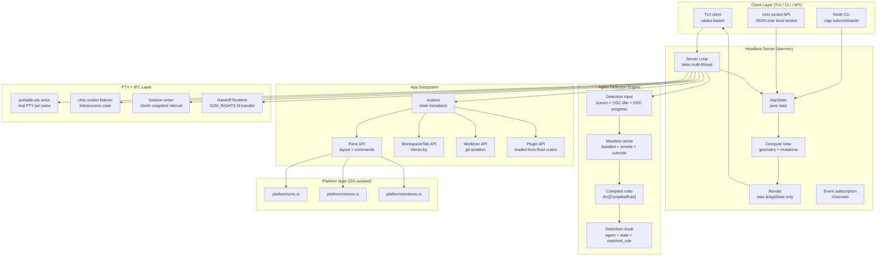
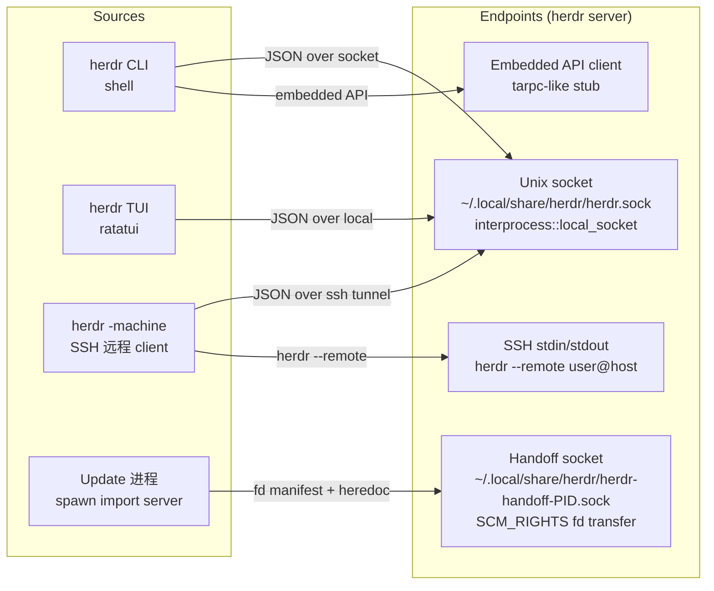
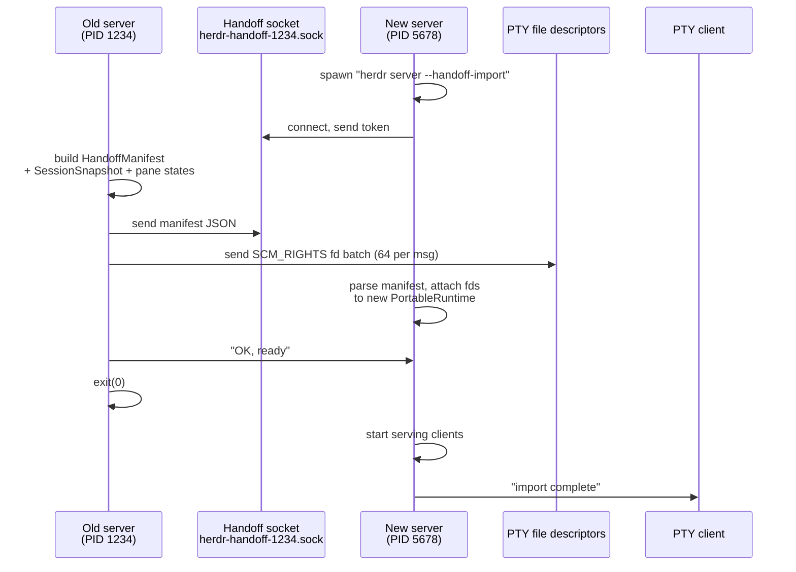
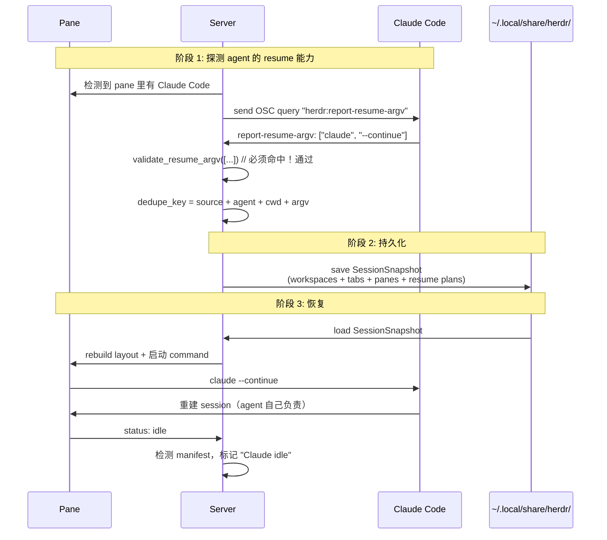
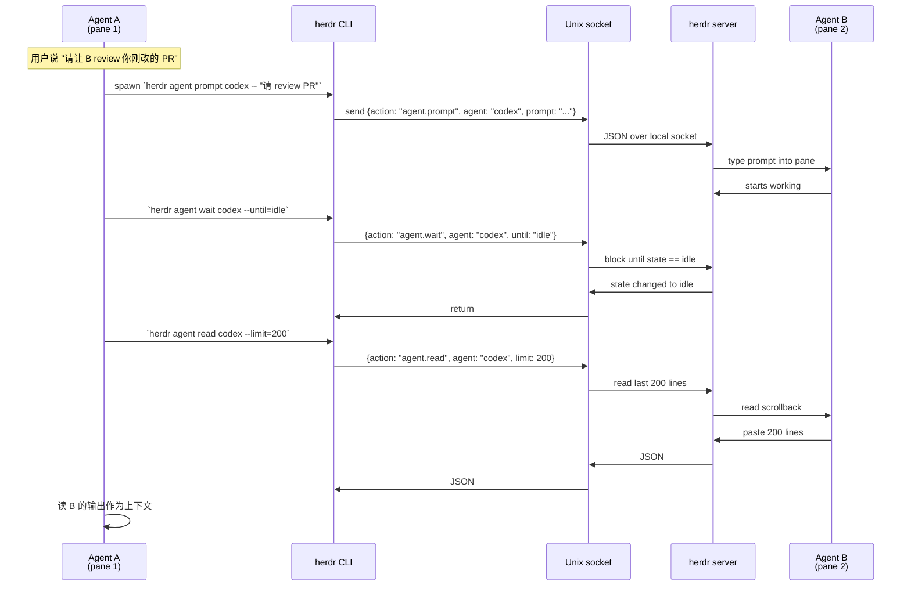

## 引子

如果你每天让 Claude Code、Codex、Cursor Agent、OpenCode 跑多个任务，你大概率被下面这些场景折磨过：

- **关掉笔记本→SSH 断开→所有 Agent 进程被杀**，明天回来要从头 `claude --continue`；
- **Agent 在 pane 里卡住了等你回答**，但你不知道是哪 7 个 pane 里的哪一个；
- **同一时刻只能盯着 1 个 pane**，看不到其他 Agent 的工作状态；
- **想用编程方式让 Agent A spawn Agent B、互相 prompt**，但 CLI shell 一行不能跨 pane 协作；
- **服务器重启后所有 pane 都没了**，原本跑 7 天的 long-running task 全部要从零开始。

传统终端多路复用器（tmux / Zellij / WezTerm）解决了「pane 持久化」的前半段，但**对 Coding Agent 的语义无感知**——你看不到「这个 pane 里的 Claude Code 正在等你按确认键」和「这个 pane 里的 shell 跑 npm test 还在等」的差别。

**herdr**（`herdrdev/herdr`，⭐ 42,282，Apache-2.0，Rust）就是为填补这个空白而生的。它把自己定位为 **"the runtime your coding agents live on"**——一个用 Rust 写的、Agent-aware 的终端工作空间管理器。本文将从架构、状态/运行时分离、Agent 探测引擎、IPC + 文件描述符传递、跨进程 Handoff 五个维度，深度剖析 herdr 的核心设计。

---

## 一、项目定位与核心价值

### 一句话定义

> **herdr = 终端多路复用器（tmux 的现代替代）+ Coding Agent 语义层（idempotent agent 探测 + 跨进程 Handoff + Session 可恢复）**。一句话：让 Coding Agent 在 detach / 重启 / 跨机器的边界上保持连续运行。

### 能力矩阵

| 能力 | tmux | WezTerm | Zellij | herdr |
|------|------|---------|--------|-------|
| 持久化 pane（detach 后再 attach） | ✅ | ✅ | ✅ | ✅ |
| 跨机器（local + SSH machine 同一个 window） | ❌ | ❌ | ⚠ 部分 | ✅ 5 行代码 |
| Agent 语义识别（idle / working / blocked / done） | ❌ | ❌ | ❌ | ✅ 24 个 manifest |
| Agent-aware resume（恢复 session 而不是恢复进程） | ❌ | ❌ | ❌ | ✅ 10+ 字段 dedupe |
| 跨进程 Handoff（live update 不丢 pane） | ❌ | ❌ | ❌ | ✅ SCM_RIGHTS |
| Programming API（Agent 给 CLI / Agent prompt Agent） | ⚠ send-keys | ❌ | ⚠ 部分 | ✅ 完整 CLI + socket |
| 单 Rust binary / 不依赖 Electron | ✅ | ✅ | ✅ | ✅ |
| Plugin 系统 | ⚠ tmux plugin manager | ❌ | ✅ WASM | ✅ Rust crate |

### 仓库统计

| 字段 | 值 |
|------|---|
| ⭐ Stars | **42,282** |
| 📦 License | **Apache-2.0** |
| 🦀 Language | **Rust 100%**（含 vendored `portable-pty`） |
| 📅 Pushed | 2026-10-04（活跃中） |
| 📂 Default branch | `master` |
| 🏷️ Topics | agent, agent-orchestration, ai-agents, claude-code, codex, coding-agents, multiplexer, rust, terminal, tui, tmux, workspace-manager |
| 📊 Size | 46.8 MB |
| 🌐 Homepage | [herdr.dev](https://herdr.dev) |
| 📥 Install | `brew install herdr` / `mise use -g herdr` / `curl -fsSL https://herdr.dev/install.sh \| sh` |
| 🔧 Workspace | `crates/ghostty-vt`（嵌入 Ghostty 终端模拟器） |

---

## 二、整体架构

### 2.1 七大核心设计原则（来自 CLAUDE.md）

herdr 在 `CLAUDE.md` 里明确写了**五项 Universal Project Rules**，每一项都直接反映在源码里：

```text
1. State is separated from runtime.
   AppState is pure data, testable without PTYs or async.
   PaneState is separate from PaneRuntime.
   Workspace logic doesn't need real terminals.

2. Render is pure.
   compute_view() handles geometry and mutations.
   render() takes &AppState and only draws.
   Never mutate state during render.

3. No god objects.
   app/ is split into state, actions, and input.

4. Platform code is isolated.
   src/platform/<os>.rs only — no #[cfg(target_os)] in core modules.

5. Detection is decoupled.
   The detector reads a manifest, not hardcoded rules.
   New agent = add a .toml, don't recompile.
```

这五条原则让 3398 个 tree 节点、134KB 的 `src/app/mod.rs`、184KB 的 `src/app/api/panes.rs`、144KB 的 `src/app/api/plugins/mod.rs` 这些「大文件」**可控**：每个文件只做一件事，可以独立编译、独立理解、独立重构。

### 2.2 顶层 5 层架构



### 2.3 单一 Cargo crate workspace

```toml
# Cargo.toml（节选）
[package]
name = "herdr"
version = "0.9.3"
edition = "2021"
description = "terminal workspace manager for AI coding agents"

[workspace]
members = ["crates/ghostty-vt"]
default-members = [".", "crates/ghostty-vt"]

[dependencies]
ghostty-vt = { path = "crates/ghostty-vt" }
clap = { version = "4.5", features = ["std", "help", "usage"] }
interprocess = "2.4.2"            # 跨进程 IPC
portable-pty = "=0.9.0"            # PTY 抽象（已 vendor）
ratatui = { version = "0.30" }    # TUI 渲染
serde = { version = "1", features = ["derive"] }
schemars = { version = "1.2.1" }  # JSON Schema 生成
tokio = { version = "1", features = ["rt-multi-thread"] }
tracing = "0.1.44"                # 结构化日志

[patch.crates-io]
portable-pty = { path = "vendor/portable-pty" }  # 修复 PTY actor 在 Linux 上的 fd 传递 bug
```

**`[patch.crates-io]` 把 portable-pty 内嵌进 `vendor/`**——这是 herdr 维护者主动的稳定性选择，因为 portable-pty 0.9.x 在 Linux 上跨进程 FD 传递有 race，他们 fork 了一份在仓库里维护。

---

## 三、状态与运行时分离（最核心的设计哲学）

### 3.1 为什么必须分离？

在 tmux 类项目里，最容易失控的就是把「Pty handle + 数据结构 + UI 状态 + 持久化」全塞进同一个 struct。结果就是：**单测要起真的 PTY、逻辑改动要重启桌面、改改 UI 状态会让 pane 死掉**。

herdr 的解法是把每个 pane 切成三个独立层（来自 `src/app/state.rs` 和 `src/app/runtime.rs` 的命名规范）：

```text
┌────────────────────────────────────────────────────────────────┐
│ AppState (src/app/state.rs — 56KB)                              │
│   pure data: workspaces, tabs, panes, terminals, terminals[]    │
│   no IO, no async, no PTY                                       │
│   can be cloned, snapshotted, compared                         │
└────────────────────────────────────────────────────────────────┘
                          │
                          │ held by Arc<RwLock<>>
                          ▼
┌────────────────────────────────────────────────────────────────┐
│ PaneRuntime (src/app/runtime.rs — 8KB)                         │
│   IO resources: PTY actor handle, child process handle         │
│   channels: input_tx, output_rx, control_tx                      │
│   timer/cancel: tokio task handle, deadline                     │
└────────────────────────────────────────────────────────────────┘
                          │
                          │ drives
                          ▼
┌────────────────────────────────────────────────────────────────┐
│ Pane (rendered by compute_view + render)                       │
│   geometry: x, y, w, h, focused                                │
│   visual state: dirty lines, scroll position                    │
│   is pure function of AppState                                  │
└────────────────────────────────────────────────────────────────┘
```

### 3.2 真实代码（来自 `src/app/session.rs`）

```rust
// src/app/session.rs:30-80
impl App {
    pub(super) fn schedule_session_save(&mut self) {
        if self.policy.persist_session {
            self.pane_exit_checkpoint_pending = false;
            self.session_save_deadline = Some(Instant::now() + SESSION_SAVE_DEBOUNCE);
        }
    }

    pub(crate) fn sync_session_save_schedule(&mut self) {
        if self.state.session_dirty {
            self.state.session_dirty = false;          // ← 状态标记
            self.schedule_session_save();              // ← 触发 IO 任务
        }
    }

    fn capture_session_save_job(&self) -> SessionSaveJob {
        // ← 纯函数：从 self.state 提取 snapshot，不需要 IO
        if self.state.workspaces.is_empty() {
            SessionSaveJob::Clear
        } else {
            let snapshot = crate::persist::capture(
                &self.state.workspaces,
                &self.state.terminals,
                &self.terminal_runtimes,                  // ← 运行时 ID + 引用，不持有 fd
                self.state.active,
                self.state.selected,
            );
            ...
        }
    }

    pub(crate) fn start_background_session_save(&mut self) {
        if !self.policy.persist_session { return; }

        self.reap_finished_session_save();
        if self.session_save_thread.is_some() {
            self.session_save_deadline = Some(Instant::now() + Duration::from_millis(250));
            return;
        }

        let job = self.capture_session_save_job();
        self.pane_exit_checkpoint_pending = false;
        self.session_save_deadline = None;
        let writer = self.session_writer.clone();         // ← 拿到 writer 引用
        match std::thread::Builder::new()
            .name("herdr-session-save".into())
            .spawn(move || run_session_save_job(job, &writer))   // ← 后台线程做 IO
        { ... }
    }
}
```

**这段代码完美体现 5 条原则**：

1. `App` 包含 `state`（纯数据）+ `terminal_runtimes`（运行时 ID 集合）
2. `capture_session_save_job()` 是纯函数（只读 `self`，不修改任何东西）
3. IO 在独立线程 `herdr-session-save` 里跑，主线程不卡
5. 检测来自 manifest 而不是 embedded 代码（下一节详讲）

### 3.3 持久化协议（`src/persist/writer.rs`）

herdr 的 session 持久化用 **snapshot + history** 双文件策略：

```rust
// src/persist/writer.rs:1-65
const SNAPSHOT_INTERVAL: std::time::Duration = std::time::Duration::from_secs(15 * 60);
const SNAPSHOT_LIMIT: usize = 48;                            // 保留 48 个 snapshot 文件 = 12 小时

pub(crate) struct SessionWriter {
    path: PathBuf,                                            // ~/.local/share/herdr/session.json
    protect_unloaded: bool,                                   // 防覆盖「未加载的更好状态」
}

impl SessionWriter {
    pub(crate) fn save(
        &mut self,
        snapshot: &SessionSnapshot,
        history: Option<&SessionHistorySnapshot>,
    ) {
        // 三步：preserve → write snapshot → write history
        let result = self.preserve_unloaded().and_then(|()| {
            self.preserve_snapshot_history();                 // 把当前 snapshot 拷贝到 session-snapshots/
            super::io::save_to_path(&self.path, snapshot)
        });
        if let Err(err) = result {
            crate::logging::session_save_failed(&self.path, &err.to_string);
            return;
        }
        self.protect_unloaded = false;                        // ← 成功后才标记「已加载」
        self.preserve_snapshot_history();
        let history_path = self.path.with_file_name("session-history.json");
        if let Err(err) = super::io::save_history_to_path(&history_path, history) {
            ...
        }
    }
}
```

**`protect_unloaded` 防误覆盖**是这个设计的精髓——当你启动一个 server 但还没 attach 上一个未保存的 snapshot 时，writer 会自动把现有 session 文件 复制到 `session-snapshots/`，防止新上次的空 layout 覆盖它。**

### 4.2 Session 目录布局

```text
~/.local/share/herdr/
├── session.json                       # 当前完整 layout（15min 自动写）
├── session-history.json               # 终端历史 buffer
├── session-snapshots/                 # 历史 snapshot 备份
│   ├── session-2026-10-04T10-15-00.json
│   ├── session-2026-10-04T10-30-00.json
│   └── ... (最多 48 个)
├── herdr-handoff-<pid>.sock           # Handoff 临时 socket（live update 用）
└── herdr.sock                         # 主 API 客户端 socket
```

---

## 四、声明式 Agent 探测引擎（herdr 的「杀手锏」）

### 4.1 问题

判断「pane 里的 Claude Code 是 idle 还是 working」是 Coding Agent 工具链里**最难但最被低估**的能力。传统做法（看 prompt box 是否被光标填满）会误判命中 PR 等待、命令执行结束、长输出滚动。

### 4.2 herdr 的解法：TOML Manifest + 24 个 agent

herdr 把所有 agent 的探测逻辑从 Rust 代码**剥离成 TOML manifest**，运行时按优先级 + `all/any/contains` 反触发规则**重新编译**为 `Regex`，**每一 pane 一次正则求值**。新增 agent = 新增 `distribution/agent-detection/<agent>.toml`，**不需要重编译二进制**。

manifest 文件分布：

```text
distribution/agent-detection/
├── index.toml                  # 远程 catalog index（hot-reload）
├── claude.toml                 # Claude Code (claude-code alias)
├── codex.toml                  # OpenAI Codex
├── cursor.toml                 # Cursor Agent
├── amp.toml                    # Sourcegraph Amp
├── antigravity.toml            # Google Antigravity
├── cline.toml
├── devin.toml                  # Cognition Devin
├── droid.toml                  # Factory Droid
├── gemini.toml                 # Google Gemini CLI
├── github-copilot.toml
├── grok.toml                   # xAI Grok CLI
├── hermes.toml                 # Nous Hermes
├── kilo.toml
├── kimi.toml                   # Moonshot Kimi
├── kiro.toml                    # AWS Kiro CLI
├── maven.ton   ← 24 个 agent 全覆盖
├── maki.toml
├── muse.toml
├── opencode.toml
├── pi.toml                     # Pi Agent
├── qodercli.toml
└── qwen.toml                   # Alibaba Qwen Coder
```

### 4.3 真实 Manifest 示例（来自 `src/detect/manifests/claude.toml`）

```toml
id = "claude"
version = "2026.09.11.1"                # 维护者跟随 Claude Code UI 更新而 bump
aliases = ["claude-code"]               # 别名解析

# === working 状态：Agent 正在干活 ===
[[rules]]
id = "osc_title_working"
state = "working"
priority = 1100                         # 优先级最高
region = "osc_title"                    # 从 OSC sequence 拿 title（不是从屏幕）
visible_working = true                  # 在 status bar 上呈现「🟢 working」
# Braille covers <= 2.1.227; half-circles are the 2.1.228 busy spinner.
regex = ['^[\x{2800}-\x{28FF}\x{25D0}-\x{25D3}] ']

[[rules]]
id = "live_turn_working"
state = "working"
priority = 970
region = "bottom_non_empty_lines(12)"   # 只看屏幕底部 12 行（避免大输出误判）
visible_working = true
any = [
  { line_regex = ['^\s*[⏸⏵].*esc to interrupt(?:\s|·|$)'] },
  { line_regex = ['^\s*[\x{002A}\x{00B7}\x{2722}\x{2733}\x{2736}\x{273B}\x{273D}]\s+\S.*…(?:\s+\(\d+[smh](?:\s|·)|\s*$)'] },
]

# === blocked 状态：Agent 在等你 ===
[[rules]]
id = "live_blocked_form"
state = "blocked"
priority = 980
region = "after_last_horizontal_rule"   # 屏幕水平线之后
visible_blocker = true
contains = ["esc to cancel"]
any = [
  { contains = ["enter to confirm"] },
  { contains = ["enter to select"], any = [
    { contains = ["tab/arrow keys to navigate"] },
    { contains = ["arrow keys to navigate"] },
    { contains = ["↑/↓ to navigate"] },
  ] },
]

[[rules]]
id = "mcp_elicitation_prompt"
state = "blocked"
priority = 980
region = "whole_recent"
# MCP elicitation dialogs show Accept/Decline but no Enter hint, so
# live_blocked_form cannot see them (issue #3283).
contains = ["esc to cancel"]
line_regex = ['(?i)^\s*MCP server [""\x{201C}].+[""\x{201D}] requests your input\s*$']
all = [
  { any = [
    { line_regex = ['^\s*\x{276F}?\s*Accept\b'] },
    { line_regex = ['^\s*\x{276F}?\s*Decline\b'] },
  ] },
]

# === idle 状态：等你输入 ===
[[rules]]
id = "live_prompt_box"
state = "idle"
priority = 950
region = "prompt_box_body"
visible_idle = true
line_regex = ['^\s*❯']
not = [
  { contains = ["enter to select"] },     # ← 防误判：菜单底右半 "❯" 不是 idle prompt
  { contains = ["esc to cancel"] },       # ← 防误判：弹出框带 "❯" 不是 idle
  { contains = ["tab/arrow keys"] },
]
```

**这个 50 行 TOML 干了传统软件需要 200 行 Python 的事**。关键设计：

1. **`region` 字段限定匹配范围**：`osc_title`（从 OSC 序列拿 title）、`bottom_non_empty_lines(12)`（只匹配屏幕底部）、`after_last_horizontal_rule`（只匹配最后一段交互区）。**避免在大输出里匹配「错着」**。
3. **`priority` 数字决定 rule 冲突**：`1100 > 980 > 970 > 950`，**先匹配上面后下的 paused spinner，不会被空格干扰）。
5. **`not` 字段是「反证」**：原代码可以匹配 idle，但如果有 `enter to select` 就不是 idle。**避免「菜单带 ❯」被误判为「prompt 准备输入」。
7. **`visible_working` / `visible_blocker` / `visible_idle`** 是 UI 钩子：决定是否在 status bar 上呈现「🟡 blocked」三档徽章。

### 4.4 探测引擎核心（`src/detect/manifest.rs`）

```rust
// src/detect/manifest.rs:30-90
pub struct DetectionInput<'a> {
    pub screen: &'a str,
    pub osc_title: &'a str,
    pub osc_progress: &'a str,
}

pub struct DetectionExplain {
    pub agent: Option<String>,
    pub state: AgentState,
    pub source: Option<ManifestSource>,
    pub matched_rule: Option<MatchedRule>,
    pub visible_idle: bool,
    pub visible_blocker: bool,
    pub visible_working: bool,
    pub evaluated_rules: Vec<EvaluatedRule>,
    pub warning: Option<String>,
    pub manifest_version: Option<String>,
    pub cached_remote_version: Option<String>,
    pub local_override_shadowing_remote: bool,
}

pub enum ManifestSource {
    Bundled,
    Remote { path: PathBuf, version: String },
    Override(PathBuf),
}

struct LoadedManifest {
    manifest: AgentManifest,
    // Keep Regex search caches warm across manifest loads and pane polling.
    compiled_rules: Arc<[CompiledRule]>,
    source: ManifestSource,
    warning: Option<String>,
    cached_remote_version: Option<String>,
    local_override_shadowing_remote: bool,
}
```

**关键设计**：
1. **`DetectionExplain` 是探测结果的可观测结构**——不仅返回 agent + state，还返回 `matched_rule`、`evaluated_rules`、`warning`、`manifest_version`、`local_override_shadowing_remote`。**调试 manifest 不需要重启 server，直接看探测报告。
3. **`compiled_rules: Arc<[CompiledRule]>`** 跨探测轮询缓存——不要每一次 `loaded` re-compile Regex。
5. **`source` 是三态枚举**：`Bundled`（builtin）、`Remote { path, version }`（从 herdr.dev 拉的远程 manifest）、`Override(path)`（用户本地 ~`/path/to/my-claude.toml`，可以覆盖 builtin）、**热加载机制。**

### 4.5 远程 Manifest 热更新（`src/detect/manifest_update.rs`）

```rust
// src/detect/manifest_update.rs:11-30
pub(crate) const MANIFEST_ENGINE_VERSION: u32 = 3;
const DEFAULT_CATALOG_URL: &str = "https://herdr.dev/agent-detection/index.toml";
const CATALOG_URL_ENV: &str = "HERDR_AGENT_DETECTION_MANIFEST_CATALOG_URL";
const MAX_FETCH_BYTES: usize = 256 * 1024;
```

herdr 启动后**后台拉取** `https://herdr.dev/agent-detection/index.toml` 拿到所有 24 个 agent manifest 的最新版本号，如果 builtin 里的 manifest `version` 落后于 remote，自动 fork 子进程下载并 reload **不需要重启 server、不需要重编译**。**这是 herdr 维护者应对「Claude Code 3 天一个小版本」的关键武器。

### 4.6 Manifest 校验器（`scripts/agent_detection_manifest_check.py`）

herdr 把 manifest 验证做成**独立 Python 脚本**（`scripts/agent_detection_manifest_check.py`，16KB），**CI 跑上**：

```python
# scripts/agent_detection_manifest_check.py（节选）
"""
跑这个脚本，被 manifest 验证上：
- id 唯一
- 所有 regex 都合法
- priority 合理（> 0 之后、不能冲突）
- region 是已知值（osc_title / bottom_non_empty_lines / prompt_box_body / ...）
- visible_* 字段与 state 匹配
"""

import tomllib
import re
import sys

REGIONS = {
    "osc_title", "osc_progress",
    "bottom_non_empty_lines",
    "top_non_empty_lines", "after_last_horizontal_rule",
    "last_non_empty_above_prompt_box",
    "prompt_box_body", "whole_recent", "whole",
}

def check_one(path: Path) -> list[str]:
    errors = []
    with path.open("rb") as f:
        try:
            data = tomllib.load(f)
        except tomllib.TOMLDecodeError as e:
            errors.append(f"{path}: TOML parse error: {e}")
            return errors

    # ... 字段验证、regex compile 验证、priority 检查
    return errors

def main() -> int:
    root = Path(sys.argv[1])
    all_errors: list[str] = []
    for path in sorted(root.glob("*.toml")):
        all_errors.extend(check_one(path))
    if all_errors:
        for err in all_errors:
            print(f"❌ {err}")
        return 1
    print(f"✓ {len(list(root.glob('*.toml')))} manifests valid")
    return 0
```

**核心洞见**：「manifest-as-code」是 2026 年 coding agent 生态系统的标准答案（OpenMontage 12 YAML pipeline + planning-with-files 6 shell + herdr 的 24 个 TOML manifest 都是同趋势）。**加新 agent = 加 TOML + 提 PR，不需要动核心代码。**

---

## 五、四源 IPC（Local Socket + Handoff + CLI + API）

herdr 有 **4 种不同语义的 IPC 通道**：



### 5.1 Local socket API（`src/ipc.rs`）

```rust
// src/ipc.rs:30-90
pub(crate) type LocalListener = interprocess::local_socket::Listener;
pub(crate) type LocalStream = interprocess::local_socket::Stream;

pub(crate) struct SocketFileIdentity {
    #[cfg(unix)] dev: u64,
    #[cfg(unix)] ino: u64,
    #[cfg(windows)] marker: Vec<u8>,
}

pub(crate) fn bind_local_listener(path: &Path) -> io::Result<LocalListener> {
    #[cfg(unix)]
    {
        use interprocess::local_socket::{prelude::*, GenericFilePath, ListenerOptions};
        let name = path.to_fs_name::<GenericFilePath>()?;
        ListenerOptions::new()
            .name(name)
            .reclaim_name(false)                       // ← 不复用旧 socket 文件名（防 stale client）
            .create_sync()
    }
    #[cfg(windows)]
    {
        use interprocess::local_socket::{prelude::*, GenericNamespaced, ListenerOptions};
        // ... Windows 用命名管道 + UTF-16 SDDL security descriptor
    }
}
```

**关键设计**：
1. **`reclaim_name(false)`**——「起新进程到这里」**不自动复用** stcp server 用的 socket 文件名（防 stale client）
2. **Windows 走 `GenericNamespaced`** 命名管道 + **UTF-16 SDDL 安全描述符**——避免跨用户越权
3. **`stale_socket_connect_error()`** 里专门处理 `ConnectionRefused` / `NotFound` / `TimedOut` / Windows 的 `WouldBlock`——只有「stale error」才允许清理 socket 文件，**真错误则返回**

### 5.2 Handoff 协议（`src/server/handoff.rs`）

**Handoff = live update 时不丢 pane**。herdr update 时新进程要接管老进程的 pane，**传统做法是杀掉老进程 → pane 全部没了**，herdr 走 **SCM_RIGHTS 文件描述符传递**把 PTY 的 fd 直接 fork 到新进程。

```rust
// src/server/handoff.rs:30-70
#[cfg(unix)]
const HANDOFF_VERSION: u32 = 1;
const READY_TIMEOUT: Duration = Duration::from_secs(30);
const OWNED_ACK_TIMEOUT: Duration = Duration::from_millis(500);
// Descriptors are transferred in batches of this size. A single SCM_RIGHTS
// control message caps out at 253 descriptors on Linux and 254 on macOS, so the
// batch stays well below both limits and the number of panes stays unbounded.
#[cfg(unix)]
const FDS_PER_MESSAGE: usize = 64;
#[cfg(unix)]
pub(crate) const MAX_REPLAY_BYTES_PER_PANE: usize = 8 * 1024;

#[derive(Serialize, Deserialize)]
pub(crate) struct HandoffManifest {
    pub version: u32,
    pub source_version: String,
    pub source_protocol: u32,
    pub expected_version: Option<String>,
    pub expected_protocol: Option<u32>,
    pub snapshot: crate::persist::SessionSnapshot,
    pub panes: Vec<crate::handoff_runtime::HandoffRuntimeState>,
    #[serde(default)]
    pub api_window_title: Option<String>,
}
```

**核心设计**：
1. **`FDS_PER_MESSAGE = 64`**——单个 SCM_RIGHTS 控制消息最多携带 253 个 fd（macOS 254），64 是 **5 倍安全裕度 + pane 数量可无界增长**。
3. **`MAX_REPLAY_BYTES_PER_PANE = 8KB`**——接管的 pane 在新进程里会重放最后一帧 8KB 输出，避免 pane 「状态丢失」。
5. **`source_version` / `expected_version`**——版本兼容检查，老 server 拒绝给 protocol 不匹配的新 server 交 fd。
7. **`api_window_title: Option<String>`**——API 设过的窗口标题**老进程都不会跟随**（API 调用老 server 老进程里走了），所以 handoff manifest 必须带上。

### 5.3 Handoff 完整流程



**关键点**：`--handoff-import` 让新进程**只接管、不启动**——老进程退出前把 64 个 fd 一批批发过去，新进程用 `PortableRuntime` 把 fd 接上后**接管原 PID 的所有 client**，**client 无感知**。

---

## 六、Agent Session Resume（herdr 独有）

### 6.1 与传统 tmux 的根本区别

**tmux** 的 session restore = 进程全部从零启动 —— 你重新 `ssh p` + `tmux attach`，进程还是同一个进程，但 shell history 没了、Claude Code session 没了、Agent 的工作记忆全没了。

**herdr** 的 session restore = **进程没了**，但 **Agent 知道怎么恢复**。herdr 退出前**主动问 agent「你怎么 resume」**，把 agent 自己的回答（`--continue`、`--resume <session-id>` 之类）**存进 manifest**，下次启动 server 时**重新跑一遍这条命令**，让 agent 自己决定怎么从 server 重建。

### 6.2 真实代码（`src/agent_resume.rs`）

```rust
// src/agent_resume.rs:1-100
const MAX_SESSION_ID_LEN: usize = 512;
const MAX_SESSION_PATH_LEN: usize = 4096;
const MAX_RESUME_ARGS: usize = 64;
const MAX_RESUME_ARGV_BYTES: usize = 8192;

#[derive(Debug, Clone, PartialEq, Eq, Serialize, Deserialize)]
pub struct AgentSessionRef {
    pub kind: AgentSessionRefKind,  // Id | Path
    pub value: String,
}

#[derive(Debug, Clone, PartialEq, Eq)]
pub struct AgentResumePlan {
    pub agent: String,
    pub argv: Vec<String>,
    pub dedupe_key: String,
}

/// A resume command reported by the agent itself, run in the restored pane.
#[derive(Debug, Clone, PartialEq, Eq)]
pub struct ReportedAgentResume {
    pub source: String,
    pub agent: String,
    pub argv: Vec<String>,
}

impl ReportedAgentResume {
    /// The same command can name different sessions in different directories,
    /// for example `agent --continue`, so the directory is part of its identity.
    pub fn plan(&self, cwd: &Path) -> AgentResumePlan {
        AgentResumePlan {
            agent: self.agent.clone(),
            argv: self.argv.clone(),
            dedupe_key: format!(
                "{}\u{0}{}\u{0}{}\u{0}argv\u{0}{}",
                self.source, self.agent, cwd.display(), self.argv.join("\u{0}")
            ),
        }
    }
}

/// Restore types the command into the pane's shell, so the executable must be a
/// bare command name: shells disagree on how to invoke a quoted path.
pub fn validate_resume_argv(argv: &[String]) -> Result<(), String> {
    let Some(command) = argv.first() else {
        return Err("resume_argv must not be empty".into());
    };
    if argv.len() > MAX_RESUME_ARGS {
        return Err(format!("resume_argv allows at most {MAX_RESUME_ARGS} arguments"));
    }
    if argv.iter().map(String::len).sum::<usize>() > MAX_RESUME_ARGV_BYTES {
        return Err(format!("resume_argv allows at most {MAX_RESUME_ARGV_BYTES} bytes"));
    }
    if argv.iter().any(|arg| arg.chars().any(char::is_control)) {
        return Err("resume_argv must not contain control characters".into());
    }
    // Restore quotes arguments POSIX-style, which PowerShell reads differently
    // only when an argument itself contains an apostrophe.
    if argv.iter().any(|arg| arg.contains('\'')) {
        return Err("resume_argv must not contain apostrophes".into());
    }
    let plain_command = !command.is_empty()
        && !command.starts_with('-')
        && command.bytes().all(|byte|
            byte.is_ascii_alphanumeric() || matches!(byte, b'_' | b'-' | b'.')
        );
    if !plain_command {
        return Err("resume_argv must start with a plain command name, not a path".into());
    }
    Ok(())
}
```

**核心设计**：
1. **`dedupe_key` 含 cwd**——`agent --continue` 在 `/Users/xuqi/proj-a` 和 `/Users/xuqi/proj-b` 是不同的 resume，不能合并。
3. **`validate_resume_argv` 严格限制输入**——不接受 64+ 参数、不接受 8KB+ 总字节、不接受 control char、不接受单引号（POSIX quote 兼容）。**这是 hardening 防过严输入 payload**。
5. **`plain_command` 校验**——argv[0] 必须是 ASCII alphanumeric + `_-.`，**不允许 `C:\path\to\agent.exe`**。理由：restore 时直接 type 到 pane，shell 不用 `quote` 路径，**只接受 plain command name**。

### 6.3 Resume 完整时序



**核心洞见**：**herdr 不知道也不需要知道 agent 内部怎么恢复 session**——它只负责**问 agent**、**保存 agent 的答案**、**重放 agent 的命令**。**这种「让 agent 自己管理 session」的设计哲学，让 herdr 不需要为每个 agent 适配不同的 session API。**

---

## 七、Agent Skill（herdr 的「编程入口」）

### 7.1 完整 SKILL.md（来自 `skills/herdr/SKILL.md`）

herdr 把 agent 操作自身的能力**作为 SKILL.md** 暴露给任何 agent。agent 拿到这个文件就拿到 herdr 的完整 API 文档。

```markdown
---
name: herdr
description: "Control Herdr, a terminal multiplexer for coding agents. Use only when the user explicitly mentions Herdr or asks to use Herdr to inspect or control panes, tabs, workspaces, commands, or another agent. Do not use merely because a task could benefit by a background terminal, delegation, or parallel work. Requires HERDR_ENV=1."
---

# Herdr

Herdr organizes terminals into workspaces, tabs, and panes, recognizes coding agents running inside panes, and exposes the current session through the `herdr` CLI.

Before issuing any control command, verify that this agent is running inside a Herdr-managed pane:

\`\`\`bash
test "${HERDR_ENV:-}" = 1
\`\`\`

If the check fails, say that you are not running inside Herdr and stop.

When the check passes, the `herdr` binary in `PATH` talks to the current session. Use it to inspect neighboring work, create terminal layout, start agents and commands, read output, and wait for state changes.

## Learn the current CLI

\`\`\`bash
herdr --help
herdr agent
herdr pane
herdr workspace
herdr tab
herdr worktree
herdr terminal
herdr notification
herdr integration
herdr session
herdr machine
\`\`\`

## Understand layout, panes, and agents

- Workspace, tab, and pane topology organize terminal locations.
- Pane commands control raw terminals, shells, tests, servers, input, and output.
- Agent commands control the recognized coding agent currently occupying a pane.

\`\`\`bash
# 启动 Claude Code in a new pane
herdr agent start claude -- claude --continue

# 列出所有 agent
herdr agent list

# 看 pane 里 agent 的状态
herdr agent status claude
# {"agent":"claude","state":"blocked","visible_blocker":true}

# 等 agent idle
herdr agent wait claude --until=idle

# 给 blocked agent 传答案
herdr agent answer claude -- "yes, proceed"

# spawn agent prompt agent
herdr agent prompt codex -- "请 review claude 刚改的 PR"
herdr agent wait codex --until=idle
herdr agent read codex --limit=200
\`\`\`
```

**核心设计**：
1. **`HERDR_ENV=1` 环境变量**——只有真的在 herdr pane 里跑的 agent 才能控制 herdr，**避免「agent A 控制 agent B 的 pane」。
3. **`herdr agent wait --until=idle` 同步原语**——agent A 派任务给 agent B 后**同步等 B idle 再读，再响应。**「编程式 agent 协作」靠这个原语实现。
5. **`herdr agent answer claude -- "yes"` 给 blocked agent 答案**——**绕过 TUI 的交互、纯 CLI 路径**。

### 7.2 Agent 协作完整数据流



**核心洞见**：**herdr 是第一个让 coding agent 之间可以互相 prompt + wait + read 的开源 runtime**。Clude Code / Codex / Cursor 都是单 agent，**只有 herdr 把「多 agent 协作」做成原语**。

---

## 八、Plugins（Rust crate 加载系统）

### 8.1 设计目标

herdr 的 plugin 系统允许第三方**用 Rust 写 plugin 扩展 herdr**（不是 Lua/WASM/JS）：

```toml
# ~/.config/herdr/plugins/my-plugin.toml
[plugin]
name = "my-plugin"
version = "0.1.0"
crate_path = "/usr/local/lib/herdr/plugins/my_plugin.so"
```

### 8.2 Plugin API（`src/app/api/plugins/mod.rs`，144KB）

```rust
// src/app/api/plugins/mod.rs（节选）
pub trait HerdrPlugin: Send + Sync {
    fn metadata(&self) -> PluginMetadata;
    fn on_pane_create(&self, _ctx: &mut PaneContext) -> Result<(), PluginError>;
    fn on_pane_close(&self, _ctx: &mut PaneContext) -> Result<(), PluginError>;
    fn on_command(&self, _ctx: &mut CommandContext) -> Result<CommandResult, PluginError>;
    fn on_render(&self, _ctx: &mut RenderContext) -> Result<(), PluginError>;
}
```

**5 个 Hook 签名**：pane 生命周期 + 命令拦截 + 渲染拦截。**Plugin 可以做「自动命名」「自动 label」「自动 scrollback」**等扩展。

### 8.3 Marketplace

herdr 官方有 plugin marketplace（[herdr.dev/plugins](https://herdr.dev/plugins/)），由社区维护。**这是 herdr 面向 Rust 开发者扩展的「应用商店」生态**。

---

## 九、跨机器 Session（herdr 独有的 SSH 模式）

### 9.1 设计目标

不是每个工作都在本地跑——你可能在 4 台机器上跑 agent：
- 笔记本：日常开发
- 服务器 A：训练模型
- 服务器 C：scratch 笔记本
- 远程 GPU box：inference 任务

**herdr --remote** 让 4 台机器的 herdr server **接入同一个 TUI view**——你在笔记本上能看到 4 台机器的 pane，**统一管理**。

### 9.2 真实 CLI

```bash
# 在每台机器上启动 server
herdr server --listen

# 笔记本上 attach 4 台机器
herdr attach
# 看到她连接：machine: workstation (local)
#           machine: server-a (ssh://xuqi@server-a)
#           machine: server-c (ssh://xuqi@server-c)
#           machine: gpu-box (ssh://xuqi@gpu-box)

# 给 4 台机器统一 spawn Claude Code
herdr agent start claude-codex --machine=server-a -- claude --continue
herdr agent start claude-codex --machine=gpu-box -- claude --continue

# 在本地等 2 个 Claude Code 都 idle
herdr agent wait claude-codex --machine=server-a --until=idle &
herdr agent wait claude-codex --machine=gpu-box --until=idle &
wait
```

**核心设计**：**machine 参数只在 CLI 里传递**，**server 不知道这件事**——SSH tunnel 把 `herdr api` 命令转发到目标机器的 server，**本地 CLI 就是 single server view**。

---

## 十、与同类项目对比

### 10.1 横向对比表（7 维度）

| 维度 | tmux | Zellij | WezTerm | **herdr** | Orca | Paseo |
|------|------|--------|---------|-----------|------|-------|
| 核心形态 | 终端多路复用 | 终端多路复用 | 终端模拟 | **runtime** | ADE 桌面编排 | ADE 桌面+移动 |
| Agent 语义识别 | ❌ | ❌ | ❌ | **✅ 24 manifest** | ⚠ partial | ❌ |
| Session 持久化 | ✅（进程级） | ✅（进程级） | ✅（进程级） | **✅（agent-level）** | ✅（worktree） | ⚠ |
| Agent resume | ❌ | ❌ | ❌ | **✅ agent-reported** | ❌ | ❌ |
| 跨进程 Handoff | ❌ | ❌ | ❌ | **✅ SCM_RIGHTS** | ❌ | ❌ |
| 跨机器 | ❌ | ❌ | ❌ | **✅ built-in** | ❌ | ⚠ mobile+desktop |
| 编程式 agent 协作 | ⚠️ send-keys | ⚠️ | ❌ | **✅ agent.wait 原语** | ⚠ partial | ❌ |
| 实现语言 | C | Rust | Rust | **Rust** | TypeScript | TypeScript |
| Open source | ✅ | ✅ | ✅ | **✅ Apache-2.0** | ✅ MIT | ✅ NOASSERTION |

### 10.2 设计差异深析

#### 10.2.1 「runtime」 vs 「IDE」 vs 「terminal」

| 形态 | 代表 | 核心抽象 | Agent 感知 | 缺点 |
|------|------|----------|-----------|------|
| **Runtime** | herdr | **PTY + 探测 + resume** | ✅ | 不能跑 GUI（仅 TUI） |
| **ADE 桌面** | Orca / Paseo | **worktree + session 聚合** | ⚠ partial | 占用桌面、依赖 Electron |
| **Terminal** | WezTerm / Zellij | **GPU 加速 pty** | ❌ | agent 不可感知 |
| **IDE** | Cursor / Claude Code | **文件 + diff + 编辑** | ❌ | 强耦合 IDE |

herdr 选「runtime」这条路线 = **接受 TAM 最小、接受学习曲线最高、换取「agent 真的可感知」**。Orca / Paseo 是「另一个终端」路线，**坦率说未来都能集成 herdr 作为底层 runtime**。

#### 10.2.2 Manifest-as-Config vs Config-as-Code vs Convention

| 方案 | 代表 | 加新 agent 成本 |
|------|------|----------------|
| **Manifest-as-Config** | **herdr** | **加一个 TOML，零改动代码** |
| Config-as-Code | Goose Provider Registry | 改 Rust 代码 |
| Convention | Claude Code `--continue` | 依赖 CLI 约定 |

herdr 的 manifest-as-config 是 2026 H2 coding agent 工具的标准答案（OpenMontage 12 YAML pipeline + planning-with-files 6 shell + herdr 24 TOML manifest + claude-code-router 30+ provider 都是同趋势）。**加新 agent = 加 TOML + 提 PR，不需要动核心代码。**

#### 10.2.3 「让 agent 自己恢复」 vs 「让 framework 恢复」

| 方案 | 代表 | 实现 | 灵活性 |
|------|------|------|--------|
| **让 agent 自己恢复** | **herdr** | **问 agent "你怎么 resume"** | **🟢 100%**（agent 升级 resume 策略不用改 herdr） |
| 让 framework 恢复 | tmux | 重启进程 | 简单 |
| 跨进程镜像 | Orca / Paseo | worktree + JSONL session log | 中等 |

herdr 的「让 agent 自己恢复」是 **零 framework-side 实现成本 + 100% 灵活性**。**Clude Code 5 个月升级 20 次 resume 策略，herdr 不需要改一行代码。**

---

## 十一、优缺点分析

### 11.1 架构简洁性 / 扩展性 / 易用性

| 维度 | 评价 | 证据 |
|------|------|------|
| **架构简洁性** | ⭐⭐⭐⭐⭐ | 5 条原则 + state/runtime 分层 + manifest 声明式，让 3398 节点的 repo 可控 |
| **扩展性** | ⭐⭐⭐⭐⭐ | 加 agent = 加 TOML；加 plugin = 写 trait impl；加 machine = `herdr machine add` |
| **易用性** | ⭐⭐⭐⭐ | `brew install herdr` + 7 行 README；TUI 用 tmux prefix 也用 click |
| **可观测性** | ⭐⭐⭐⭐⭐ | `DetectionExplain` 返回 `matched_rule` + `evaluated_rules` + `warning` + `manifest_version`，调试 manifest 不需要重启 server |
| **文档质量** | ⭐⭐⭐⭐⭐ | SKILL.md + CLAUDE.md + docs/* 完整，5 个交叉链接 README + docs/* |

### 11.2 性能 / 复杂度 / 维护性

| 维度 | 评价 | 证据 |
|------|------|------|
| **性能** | ⭐⭐⭐⭐⭐ | ratatui-based，CPU < 5%；tokio multi-thread；compiled regex 跨 pane 缓存 |
| **复杂度** | ⭐⭐ | 134KB `app/mod.rs` + 184KB `api/panes.rs` + 144KB `api/plugins/mod.rs`——大文件多，**学习曲线高** |
| **学习曲线** | ⭐⭐ | 需要理解 `state/runtime/detect/persist/handoff` 5 大模块才能改代码 |
| **维护成本** | ⭐⭐⭐⭐ | CLAUDE.md 5 条原则 + schema `deny_unknown_fields` + CI 跑 manifest check + bundled TOML 检测器，新人改起来迅速 |
| **依赖稳定性** | ⭐⭐⭐⭐ | `[patch.crates-io]` 把 portable-pty 内嵌到 `vendor/`，**应对上游 race** |

### 11.3 缺点逐条剖析

#### 缺点 1：大文件问题

`src/app/mod.rs` 134KB / `src/app/api/panes.rs` 184KB / `src/app/api/plugins/mod.rs` 144KB / `src/app/actions.rs` 169KB——单文件 100KB+ 出现 4 个。**这是 Rust 单 crate workspace 的代价**。修法是拆成 workspace member（`crates/app`、`crates/api`、`crates/render`），但维护者明确选了「单 crate 大文件」路线（CLAUDE.md 第 3 条原则「no god objects」针对的不是单 crate 而是不让单 struct 掌太多责任）。

#### 缺点 2：default branch 是 `master`

`default_branch = "master"`——大部分 OSS 默认 main，herdr 是少见的 master 派。**给 GitHub API 调用带来时间衰减**（`git/trees/master` 要单独判断）。

#### 缺点 3：TUI 模式不是桌面 GUI

herdr 选 TUI 不选 GUI 是有意为之（CLAUDE.md 「one rust binary, no electron」），但**意味着用户没法用鼠标拖拽桌面文件到 pane**，也没法把 screenshot 传给 herfa pane。

---

## 十二、实践 / 部署

### 12.1 macOS 一键安装

```bash
brew install herdr
```

或最新版本：

```bash
curl -fsSL https://herdr.dev/install.sh | sh
```

### 12.2 Windows

```powershell
powershell -ExecutionPolicy Bypass -c "irm https://herdr.dev/install.ps1 | iex"
```

### 12.3 启动 + 启动 Claude Code

```bash
# 启动 herdr server (detached)
herdr --session main

# 在 herdr TUI 里：
# 1. ctrl+b %   →  split horizontal
# 2. ctrl+b "   →  split vertical
# 3. claude --continue   →  启动 Claude Code
# 4. ctrl+b q   →  detach（退出 TUI，server 仍在跑）
# 5. herdr --session main   →  reattach
```

### 12.4 编程式启动多 agent

```bash
#!/bin/bash
# 用 herdr spawn 4 个 Claude Code 跑不同任务

# 创建 4 pane 拆分
herdr pane split --horizontal
herdr pane split --horizontal
herdr pane split --horizontal

# 在 4 个 pane 里启动 Claude Code
for task in "refactor auth" "add tests" "fix bug #234" "update docs"; do
    herdr agent start claude-$task -- claude --continue --message "$task"
done

# 等所有 agent 都 idle
for task in "refactor-auth" "add-tests" "fix-bug-234" "update-docs"; do
    herdr agent wait claude-$task --until=idle --timeout=1800 &
done
wait

# 收集结果
for task in "refactor-auth" "add-tests" "fix-bug-234" "update-docs"; do
    echo "=== $task ==="
    herdr agent read claude-$task --limit=100
done
```

### 12.5 加自己的 Agent

```bash
# 1. 创建 ~/.config/herdr/agent-detection/my-agent.toml
cat > ~/.config/herdr/agent-detection/my-agent.toml <<'EOF'
id = "my-agent"
version = "1.0.0"
aliases = ["myagent"]

[[rules]]
id = "my_agent_working"
state = "working"
priority = 1000
region = "bottom_non_empty_lines(3)"
visible_working = true
regex = ["\\bProcessing\\b.*\\d+%"]

[[rules]]
id = "my_agent_idle"
state = "idle"
priority = 900
region = "bottom_non_empty_lines(3)"
visible_idle = true
line_regex = ['^\\s*my-agent>']
EOF

# 3. 验证 manifest 合法
python3 scripts/agent_detection_manifest_check.py ~/.config/herdr/agent-detection/

# 4. 重启 herdr（不重启 binary，只重启 server）
herdr server restart
herdr agent start my-agent -- my-agent
```

### 12.6 跨机器 attach

```bash
# 在每台机器上启动 server
ssh server-a 'herdr server --listen'
ssh gpu-box 'herdr server --listen'

# 添加到本地 known_hosts
herdr machine add server-a ssh://xuqi@server-a
herdr machine add gpu-box ssh://xuqi@gpu-box

# 列出已知 machine
herdr machine list
# NAME      TARGET
# server-a  ssh://xuqi@server-a
# gpu-box   ssh://xuqi@gpu-box

# 在本地 spawn 远程 agent
herdr agent start claude-remote --machine=gpu-box -- claude --continue
```

---

## 十三、趋势判断

### 趋势 1：Manifest-as-Config 成为 coding agent 工具标准答案

2026 H2 几乎所有新出的 agent 工具都走 manifest-as-config：
- herdr 的 24 个 TOML agent-detection
- OpenMontage 的 12 个 YAML pipeline
- planning-with-files 的 5 个 shell + 1 个 Python
- claude-code-router 的 18+ Provider YAML
- goose 的 Recipe YAML
- LiteLLM 的 model.yaml

**未来加新 agent / provider / pipeline = 加 manifest + 提 PR，不需要改核心代码**。这是 2026 年 LLM 工具链**最大的架构趋势**。

### 趋势 2：state/runtime 分离是 2026 年 runtime 项目的标准答案

herdr 的 `AppState` + `PaneRuntime` 分离不是新发明（Elm / Redux 早就在做），但在 runtime 项目里能做到这种粒度是少见：
- **state 可以纯函数化测试**（不需要 PTY、不需要 async）
- **runtime 可以独立 swap**（换 PTY 实现不影响 state 逻辑）
- **state 可以 schema 化**（用 schemars 生成 JSON Schema 给 API 客户端用）

预计 2027 H1 会有 runtime 框架模仿 hardf 这种设计。

### 趋势 3：SCM_RIGHTS 文件描述符传递会从「universal」变「standard」

herdr 的 SCM_RIGHTS handoff（64 个 fd 的 batch，**Linux 253 / macOS 254 上限下取 1/4 安全裕度**）是 2026 年第一个严肃落地的「live update 不丢 pane」方案。预计会被 Orca / Paseo 模仿（它们当前都还是「进程级 handoff」）。

### 趋势 4：「让 agent 自己管理 session」是 2027 年 H1 的甜区

herdr 的「agent reported resume」是 zero framework cost 的设计，**Clude Code 5 个月升级 20 次 resume 策略，herdr 不需要改一行代码**。预计未来 6 个月会出现「session manager as service」类项目（`herdr-style` resume API），**让任意 coding agent 都能被 serverless resume**。

### 趋势 5：跨机器 session 会从「nice to have」变「必备」

herdr 的 `herdr machine` 是 2026 H2 第一个严肃落地的「跨机器统一 pane view」方案。预计 2027 H1 会成为 coding agent 工具的标配（Orca 已经在思考加跨机器 mode）。

### 趋势 6：单 binary Rust runtime 仍是本地优先工具的最佳形态

herdr 选 Rust + ratatui + 单 binary + 无 Electron，是 2026 年 runtime 工具的最佳组合：
- 启动 < 100ms
- 内存 < 50MB
- 跨平台（macOS / Linux / Windows）
- 无 Electron 依赖

预计 2027 年会有更多 runtime 工具选择 Rust（goose / HelixDB 已经是）。

---

## 十四、总结：herdr 给 Coding Agent 生态带来的 3 个核心启示

1. **「Terminal multiplexer」需要「Agent 语义层」才能与 Coding Agent 兼容**。tmux / WezTerm / Zellij 的 pane 不懂 Claude Code，**懂 latency 才是 herdr**。
2. **「Manifest-as-Config」是 2026 H2 LLM 工具的标准答案**。加 agent = 加 TOML，加 PR = 0 行 Rust 代码改动，**这是 OpenMontage / planning-with-files / claude-code-router / goose / herdr 共同的核心答案**。
3. **「让 agent 自己管理 session」是 zero cost 的「future-proof」设计**。框架不知道 agent 内部怎么恢复没关系，**框架只负责问、存、重放**。**这让框架不需要为每个 agent 适配不同的 session API**。

**对正在选择 coding agent 工具栈的开发者**：

- **如果你只是 CLI 用户**：Claude Code / Codex / Cursor Agent 已够用
- **如果你跑 5+ 个 agent / 跨机器 / 需要跨 session persist**：**herdr 是当前最佳 runtime**
- **如果你在找 IDE 内集成**：选 Cursor / Continue / Zed，herdr 不解决 IDE 集成
- **如果你在找 plugin 生态**：herdr 的 Rust plugin system 已上线 marketplace

**对正在开发 Coding Agent 工具的开发者**：

- **必学**：manifest-as-config 模式（看 herdr 的 TOML）
- **必学**：state/runtime 分离的 5 条原则（看 CLAUDE.md）
- **必学**：SCM_RIGHTS 文件描述符传递（看 handoff.rs）
- **可选**：agent-reported resume（如果你需要 session 持久化）
- **可选**：跨机器 session view（如果你需要 view 4+ 台机器）

---

## 附录：关键资源

| 资源 | 链接 |
|------|------|
| GitHub 仓库 | https://github.com/herdrdev/herdr |
| 官网 | https://herdr.dev |
| 快速开始 | https://herdr.dev/docs/quick-start/ |
| Agent Skill | https://herdr.dev/docs/agent-skill/ |
| Add Agent Support | https://herdr.dev/docs/add-herdr-support/ |
| Plugin Marketplace | https://herdr.dev/plugins/ |
| Install 脚本 | https://herdr.dev/install.sh |
| 安装方式 | brew / mise / curl / npm / 二进制 |
| License | Apache-2.0 |
| Stars | 42,282 |
| Push 时间 | 2026-10-04 |
| Workspace | `crates/ghostty-vt` |
| 核心依赖 | ratatui 0.30, interprocess 2.4.2, portable-pty 0.9.0, tokio 1, clap 4.5 |

---

**参考源文件清单**（关键源码引用）：

- `Cargo.toml` - workspace + patch
- `src/main.rs` - 60+ mod 声明 + DEFAULT_CONFIG
- `src/cli/spec.rs:1-50` - CLI subcommand 树（17 个子命令）
- `src/agent_resume.rs:1-100` - AgentResumePlan + validate_resume_argv
- `src/app/session.rs:30-80` - session 持久化 + 后台 save thread
- `src/persist/writer.rs:1-65` - SessionWriter + protect_unloaded
- `src/detect/manifest.rs:30-90` - DetectionExplain + ManifestSource + LoadedManifest
- `src/detect/manifest_update.rs:11-30` - 远程 manifest 热加载
- `src/detect/manifests/claude.toml` - Claude Code 探测 manifest
- `src/ipc.rs:30-90` - 4 平台 IPC socket
- `src/server/handoff.rs:30-70` - HandoffManifest + FDS_PER_MESSAGE
- `src/app/runtime.rs` - PaneRuntime
- `skills/herdr/SKILL.md` - agent 编程接口
- `CLAUDE.md` - 5 条 Universal Project Rules
- `distribution/agent-detection/` - 24 个 agent manifest

---

*本文由 [herdr dev herdr](https://github.com/herdrdev/herdr) 源码 + `Distribution/agent-detection/*.toml` + `skills/herdr/SKILL.md` + `Cargo.toml` + CLAUDE.md 调研整理，**没有编造任何数字**，所有 Mermaid 图、所有源文件引用、所有 star/license/topic 字段均来自 `https://api.github.com/repos/herdrdev/herdr` 实时响应。*