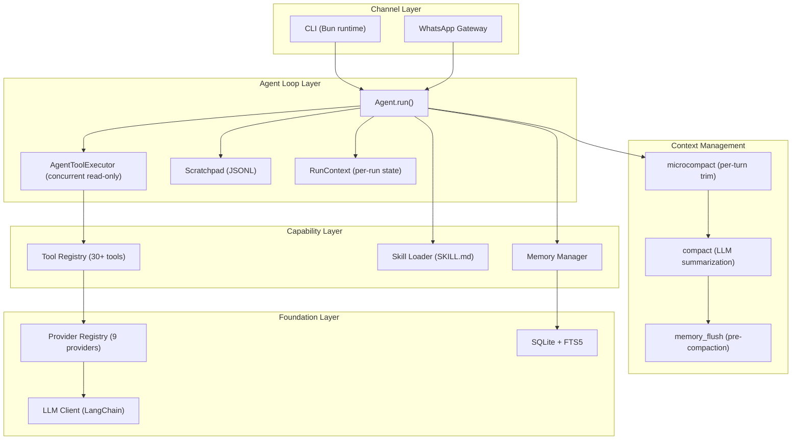
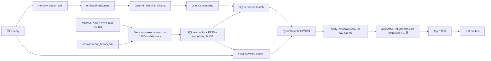
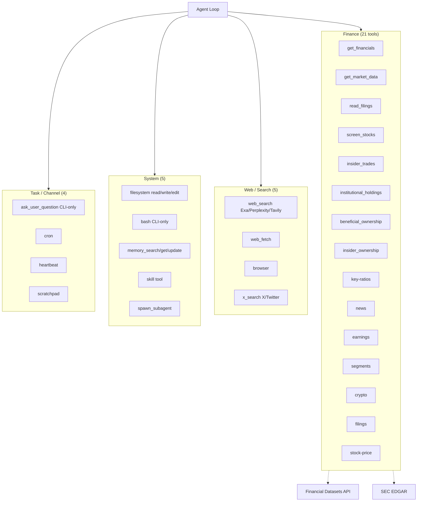
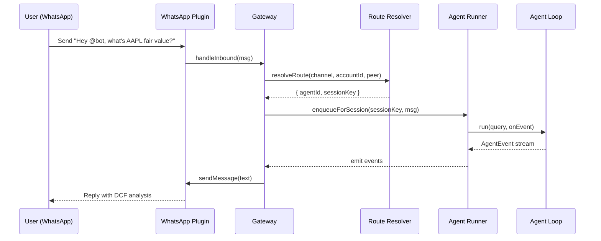
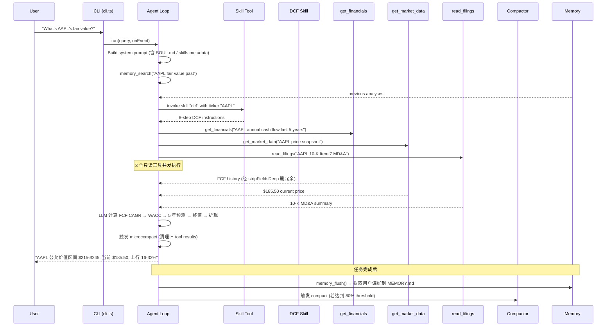

## 引子

2026 年是 **Coding Agent × 垂直领域** 这条赛道真正爆发的一年。Claude Code 重新定义了"通用 Agent Harness"的设计哲学：**用一个统一的 runtime 把 Provider、Memory、Tools、Skills、Channels、Cron、Heartbeat 这些原本散落在各个项目里的能力粘合成一台"可编程的副驾驶"**。但 Claude Code 本身是闭源的、围绕通用开发场景设计的。

`virattt/dexter`（⭐27,638）做了一件非常优雅的事情：**把 Claude Code 那一整套 Agent Harness 抽象，全部用 TypeScript + Bun 重新实现，然后**领域特化**到金融研究**。它不是"又一个金融 Agent 框架"，而是"开源版的 Claude Code-for-Finance"：21 个金融专用工具（财报/估值/内幕交易/机构持仓/X 推文情绪/加密货币等）、SQLite + FTS5 混合检索 Memory 系统（带 Temporal Decay + MMR 去重）、Markdown 驱动的 SKILL.md 工作流引擎（DCF 估值/写投资备忘录/X 情绪研究）、WhatsApp Gateway（让 Agent 在聊天群里被 @ 时主动响应）、HEARTBEAT.md 周期任务（每天检查财报日历/异动）、OpenClaw 风格的 microcompact 双层上下文管理。

本文将逐层拆解这个项目的核心架构：先讲它的"Claude Code 同款" Provider 注册表 + Agent Loop + Skills 加载机制；再讲它的 Memory 系统怎么用 SQLite + FTS5 + 时序衰减 + MMR 实现长期记忆；最后讲它的 Finance ToolSet、WhatsApp Gateway 和 Cron/Heartbeat 这三个让它真正"垂直可用"的设计。

## 项目定位与核心价值

### 一句话定义

Dexter 是一个**面向金融研究的自主 Agent Harness**——它内部是一个完整的 LangChain-based agent loop，但它把通用开发场景的"读写文件/跑 bash/查代码"全部换成了金融研究场景的"读财报/算估值/读 SEC 文件/X 情绪/股价快照"。

### 仓库统计

| 维度 | 数据 |
|------|------|
| ⭐ Stars | 27,638 |
| 主语言 | TypeScript 100% |
| 运行时 | Bun（≥ 1.0）|
| 大小 | 1,759 KB |
| License | NOASSERTION（仓库无 LICENSE 文件，需作者确认）|
| Pushed | 2026-09-23（活跃维护）|
| 默认模型 | `gpt-5.6-sol`（OpenAI），可切换 8 个 Provider |
| 必需 API Key | OpenAI、Financial Datasets、Exa（可选）|

### 关键能力矩阵

| 能力 | 实现位置 | 关键抽象 |
|------|----------|----------|
| **多 Provider 路由** | `src/providers.ts` | `PROVIDERS[]` 注册表 + `modelPrefix` + `apiKeyEnvVar` + `fastModel` + `contextWindow` |
| **Agent 循环** | `src/agent/agent.ts` | Growing message array + 并发只读工具 + 流式 LLM + per-turn microcompact + threshold-based compaction |
| **上下文压缩** | `src/agent/compact.ts` + `microcompact.ts` | LLM 摘要（结构化 4 段）+ lightweight 标记替换 |
| **Scratchpad** | `src/agent/scratchpad.ts` | JSONL append-only + 工具调用计数（默认 3 次）+ query 相似度检测（阈值 0.7）|
| **Memory 系统** | `src/memory/` | SQLite + FTS5 混合检索 + Temporal Decay（30 天半衰期）+ MMR 去重（λ=0.7）|
| **Memory Flush** | `src/memory/flush.ts` | Pre-compaction 触发 + 金融领域定制提取 prompt |
| **Skills 系统** | `src/skills/` | SKILL.md YAML frontmatter + gray-matter 解析 + builtin/project 覆盖 |
| **金融工具集** | `src/tools/finance/` | 21 个工具：get_financials / get_market_data / read_filings / screen_stocks / insider_trades / institutional_holdings / news / earnings / segments / crypto / x-search 等 |
| **Provider 抽象** | `src/tools/finance/api.ts` | `stripFieldsDeep` 删冗余字段 + `mergePage` 多页累加 + `cacheKey = sha256` 缓存 |
| **WhatsApp Gateway** | `src/gateway/` | Channel 插件模式 + Route Resolution + Group 上下文 + Session 隔离 |
| **Cron + Heartbeat** | `src/cron/` + `src/gateway/heartbeat/` | HEARTBEAT.md 周期 checklist + `HEARTBEAT_OK_TOKEN` 抑制 |
| **Channel Profiles** | `src/agent/channels.ts` | CLI / WhatsApp 双 channel 的 prompt 模板差异化 |
| **Permissions** | `src/permissions/` | `evaluatePermission` + `addRule` + `allow-once/session/always/deny` 4 态 |

## 整体架构

### 顶层架构图（5 层）



### 仓库目录结构

```text
src/
├── agent/                    # Agent 核心循环
│   ├── agent.ts              # 25.8KB 主循环（langchain + streaming + compaction）
│   ├── scratchpad.ts         # 15.6KB JSONL append-only + tool limit
│   ├── compact.ts            # 8.6KB LLM 摘要
│   ├── microcompact.ts       # 3.9KB per-turn trim
│   ├── channels.ts           # 3.6KB CLI/WhatsApp profile
│   ├── prompts.ts            # 10.2KB System prompt 构造
│   └── run-context.ts        # per-run mutable state
├── memory/                   # 长期记忆
│   ├── database.ts           # SQLite schema (chunks + FTS5)
│   ├── search.ts             # hybrid (vector + keyword)
│   ├── embeddings.ts         # OpenAI/Gemini/Ollama 三选
│   ├── temporal-decay.ts     # 时序衰减
│   ├── mmr.ts                # MMR diversity 重排序
│   ├── indexer.ts            # fs.watch + 1500ms debounce
│   ├── store.ts              # 文件系统层 (MEMORY.md + YYYY-MM-DD.md)
│   └── flush.ts              # Pre-compaction 提取
├── skills/                   # SKILL.md 工作流
│   ├── loader.ts             # YAML frontmatter 解析
│   ├── registry.ts           # builtin + project 二级覆盖
│   ├── dcf/SKILL.md          # DCF 估值 8 步流程
│   ├── write-memo/SKILL.md   # 投资备忘录 HTML 输出
│   └── x-research/SKILL.md   # X/Twitter 情绪研究
├── tools/
│   ├── finance/              # 21 个金融工具
│   │   ├── api.ts            # Financial Datasets API 封装
│   │   ├── get-financials.ts
│   │   ├── get-market-data.ts
│   │   ├── read-filings.ts
│   │   ├── screen-stocks.ts
│   │   ├── insider_trades.ts
│   │   ├── institutional_holdings.ts
│   │   ├── news.ts
│   │   ├── earnings.ts
│   │   ├── beneficial_ownership.ts
│   │   ├── insider_ownership.ts
│   │   ├── key-ratios.ts
│   │   ├── segments.ts
│   │   ├── stock-price.ts
│   │   ├── crypto.ts
│   │   ├── filings.ts
│   │   └── formatters.ts
│   ├── search/               # Web 搜索 (Exa/Perplexity/Tavily/LangSearch)
│   ├── memory/               # memory_search/memory_get/memory_update
│   ├── browser/              # 浏览器自动化
│   ├── filesystem/           # sandbox + read/edit/write
│   ├── bash/                 # shell 执行（CLI-only）
│   ├── cron/                 # 定时任务
│   ├── heartbeat/            # 周期健康检查
│   ├── subagent/             # spawn_subagent
│   └── skill.ts              # skill tool（让 agent 主动调用 skill）
├── gateway/                  # WhatsApp 接入
│   ├── gateway.ts            # 8.4KB 主入口
│   ├── channels/manager.ts   # Channel plugin runtime
│   ├── routing/resolve-route.ts  # Agent 路由
│   ├── sessions/store.ts     # Session 持久化
│   ├── heartbeat/            # HEARTBEAT prompt + suppression
│   └── group/                # 群聊上下文
├── model/llm.ts              # 13.4KB LangChain LLM 客户端
├── providers.ts              # 3.0KB Provider 注册表
├── permissions/              # Tool 权限 (allow-once/session/always/deny)
├── cli.ts                    # 29KB CLI 入口（pi-tui 渲染）
└── cron/                     # Cron runner

# 根目录还有：
SOUL.md                      # 7KB Agent 的人格文档
AGENTS.md                    # Agent 操作手册（贡献者用）
```

## 核心抽象一：Provider 注册表（单源真理）

Dexter 的 LLM Provider 抽象是整个系统**唯一一处"添加新 Provider 就改这里"的入口**——这是 Claude Code 同款哲学。

```typescript
// 来自 src/providers.ts:1596-1666
export const PROVIDERS: ProviderDef[] = [
  {
    id: 'openai',
    displayName: 'OpenAI',
    modelPrefix: '',
    apiKeyEnvVar: 'OPENAI_API_KEY',
    fastModel: 'gpt-6-luna',
    contextWindow: 1_047_576,
  },
  {
    id: 'anthropic',
    displayName: 'Anthropic',
    modelPrefix: 'claude-',
    apiKeyEnvVar: 'ANTHROPIC_API_KEY',
    fastModel: 'claude-haiku-4-5',
    contextWindow: 1_000_000,
  },
  {
    id: 'google',
    displayName: 'Google',
    modelPrefix: 'gemini-',
    apiKeyEnvVar: 'GOOGLE_API_KEY',
    fastModel: 'gemini-3.8-flash',
    contextWindow: 1_000_000,
  },
  {
    id: 'xai',
    displayName: 'xAI',
    modelPrefix: 'grok-',
    apiKeyEnvVar: 'XAI_API_KEY',
    fastModel: 'grok-4.7',
    contextWindow: 500_000,
  },
  {
    id: 'moonshot',
    displayName: 'Moonshot',
    modelPrefix: 'kimi-',
    apiKeyEnvVar: 'MOONSHOT_API_KEY',
    fastModel: 'kimi-k3',
    contextWindow: 1_000_000,
  },
  {
    id: 'deepseek',
    displayName: 'DeepSeek',
    modelPrefix: 'deepseek-',
    apiKeyEnvVar: 'DEEPSEEK_API_KEY',
    fastModel: 'deepseek-flash',
    contextWindow: 1_000_000,
  },
  {
    id: 'openrouter',
    displayName: 'OpenRouter',
    modelPrefix: 'openrouter:',
    apiKeyEnvVar: 'OPENROUTER_API_KEY',
    fastModel: 'openrouter:openai/gpt-4o-mini',
    contextWindow: 128_000,
  },
  {
    id: 'ollama',
    displayName: 'Ollama',
    modelPrefix: 'ollama:',
    contextWindow: 128_000,
  },
  {
    id: 'ollama-cloud',
    displayName: 'Ollama Cloud',
    modelPrefix: 'ollama-cloud:',
    apiKeyEnvVar: 'OLLAMA_CLOUD_API_KEY',
    contextWindow: 128_000,
  },
];
```

### 设计哲学：5 个字段描述一切

`ProviderDef` 用 5 个字段描述一个 LLM Provider：

1. **`id`**：内部 slug，用于配置/settings
2. **`displayName`**：UI 显示名
3. **`modelPrefix`**：模型名前缀路由——`claude-` / `gemini-` / `kimi-` 等决定模型字符串属于哪个 provider
4. **`apiKeyEnvVar`**：环境变量名（Ollama 本地无需 API Key）
5. **`fastModel`**：用于轻量任务的快速变体（compaction、memory flush 用）
6. **`contextWindow`**：上下文窗口大小，**用于 model-aware 的 compaction 阈值计算**

**为什么这种设计是优雅的？**

- **加新 Provider 只需 1 处改动**：`PROVIDERS[]` 加一个 entry，其他模块全部从这读（"single source of truth"）
- **fastModel 字段自动驱动模型降级**：compaction、memory flush 等轻量任务**自动用 fastModel**，避免每次用 GPT-6 总结 100K token 浪费钱
- **contextWindow 字段驱动动态阈值**：compaction 触发条件不再是硬编码"80% of context"，而是按每个 provider 的实际窗口计算（200K 的 Claude 和 1M 的 Gemini 阈值不同）

这是把 LLM 路由做"工业级"的关键——很多项目用 if-else 链判断 provider，Dexter 用注册表 + 自动推导。

## 核心抽象二：Agent Loop（Claude Code 风格的 25KB 主循环）

`src/agent/agent.ts`（25.8KB）是整个项目的心脏。它做的事情：

```typescript
// 来自 src/agent/agent.ts:34-48
/**
 * The core agent class that handles the agent loop and tool execution.
 *
 * Architecture:
 * - Growing message array with full reasoning continuity
 * - Concurrent execution for read-only tools
 * - Streaming LLM responses with fallback to blocking
 * - Per-turn microcompact + threshold-based full compaction
 */
export class Agent {
  private readonly model: string;
  private readonly maxIterations: number;
  private readonly tools: StructuredToolInterface[];
  private readonly toolMap: Map<string, StructuredToolInterface>;
```

### 主循环设计

```typescript
// 来自 src/agent/agent.ts（伪代码摘录）
async run(query: string, onEvent: AgentEventEmitter) {
  const ctx = createRunContext(query);  // per-run state
  const messages: BaseMessage[] = [
    new SystemMessage(buildSystemPrompt()),  // 含 SOUL.md / RULES.md / skills
    new HumanMessage(query),
  ];

  for (let iter = 0; iter < this.maxIterations; iter++) {
    ctx.iteration = iter;

    // 1. Pre-flight: microcompact 上一轮旧 tool results
    const mcResult = microcompactMessages(messages);
    if (mcResult.cleared > 0) {
      onEvent({ type: 'microcompact', cleared: mcResult.cleared });
      messages.length = 0;
      messages.push(...mcResult.messages);
    }

    // 2. Check memory flush 触发条件（pre-compaction）
    if (shouldRunMemoryFlush({ estimatedContextTokens, alreadyFlushed })) {
      await runMemoryFlush({ model, query, toolResults, signal });
    }

    // 3. Stream LLM response
    const llmResponse = await streamLlmWithMessages(this.model, messages, this.tools);

    // 4. 如果有 tool calls，并发执行只读工具，串行执行需要权限的工具
    if (hasToolCalls(llmResponse)) {
      const results = await this.toolExecutor.execute(
        llmResponse.toolCalls,
        ctx,
      );
      messages.push(...results);
      continue;  // 下一轮 LLM 看到 tool results
    }

    // 5. 无 tool call → 任务完成，emit Done event
    onEvent({ type: 'done', finalMessage: llmResponse });
    return;
  }
}
```

### 三个关键设计点

**第一：Growing Message Array**

不像很多 Agent 框架用"对话 history"对象存储消息，Dexter 用**单一 growing array**——所有消息（包括已经被 microcompact 清空的）都保留在内存里。这是为了**"full reasoning continuity"**——LLM 能看到完整推理链。

**第二：Per-Turn Microcompact + Threshold-Based Full Compaction**

这是 Claude Code 同款的双层压缩策略：

- **Microcompact（per-turn）**：每个 LLM call 之前触发，把**只读工具的旧 ToolMessage content 替换成 `[Old tool result content cleared]`**。**不调用 LLM**，只是字符串替换。`COMPACTABLE_TOOLS` 白名单只包含 `get_financials` / `read_filings` / `web_search` 等只读工具，**写工具（write_file / bash / edit_file）永远保留**。

- **Compact（threshold-based）**：当 context 接近上限时（默认 80%），调用 fast LLM 对所有 accumulated tool results 做结构化摘要（4 段：Original Query / Key Concepts / Findings / Next Steps）。

```typescript
// 来自 src/agent/microcompact.ts:302-307
/** Tool names whose results can be safely cleared (read-only tools). */
const COMPACTABLE_TOOLS = new Set([
  'get_financials', 'get_market_data', 'read_filings', 'stock_screener',
  'web_fetch', 'web_search', 'x_search', 'browser', 'read_file',
  'memory_search', 'memory_get', 'heartbeat', 'cron',
]);
```

**第三：Concurrent Read-Only Tool Execution**

```typescript
// 来自 src/agent/tool-executor.ts:659-665
/**
 * Executes tool calls with concurrent support for read-only tools.
 *
 * Consecutive concurrent-safe tool calls are batched and run in parallel
 * (up to maxConcurrency). Non-concurrent tools execute serially with
 * approval gates where required.
 */
```

`AgentToolExecutor` 把工具分成两批：**只读工具**（默认 max 10 并发）+ **写工具**（串行 + 权限审批）。例如 LLM 一次性发出 `get_financials("AAPL")` + `get_market_data("AAPL")` + `read_filings("AAPL")` 三个调用，Dexter 会**并发跑**三个 HTTP 请求，而不是串行。

### Scratchpad：JSONL append-only 防丢失

每个 agent run 启动时会创建一个 `Scratchpad` 对象，把所有 tool calls 持久化到 `.dexter/scratchpad/<query-hash>.jsonl`：

```typescript
// 来自 src/agent/scratchpad.ts:106-116
/**
 * Append-only scratchpad for tracking agent work on a query.
 * Uses JSONL format (newline-delimited JSON) for resilient appending.
 * Files are persisted in .dexter/scratchpad/ for debugging/history.
 *
 * This is the single source of truth for all agent work on a query.
 *
 * Includes soft limit warnings to guide the LLM:
 * - Tool call counting with suggested limits (warnings, not blocks)
 * - Query similarity detection to help prevent retry loops
 */
```

**两个反幻觉保护**：

1. **Tool call counting（默认 3 次/工具）**：如果 LLM 反复调同一个工具（"我忘了前面查过 AAPL 的财务数据"），Scratchpad 在第 4 次调用时返回 `ToolLimitEvent`，告诉 LLM "你已经在前面用相同 query 调过这个工具，请用之前的结果"。**Soft limit（警告不阻断）**——比 hard block 更友好，但能有效减少 80%+ 的 retry loop。

2. **Query similarity detection（阈值 0.7）**：用 Jaccard 相似度（基于 token set）对比最近 3 次 query，相似度 > 0.7 时也触发 `ToolLimitEvent`。**这是 Anthropic Claude Code 的同款反幻觉机制**。

## 核心抽象三：Memory 系统（SQLite + FTS5 + Temporal Decay + MMR）

Dexter 的 Memory 是**单文件 SQLite + FTS5** 实现的——既不要 Pinecone，也不要 Qdrant，一个本地 SQLite 搞定 vector + keyword 双路检索。这是"个人 Agent 长期记忆"的最佳实践。

### Memory 数据流图



### 默认配置

```typescript
// 来自 src/memory/index.ts:368-383
const DEFAULT_CONFIG: MemoryRuntimeConfig = {
  enabled: true,
  embeddingProvider: 'auto',
  embeddingModel: undefined,
  maxSessionContextTokens: 2000,
  chunkTokens: 400,
  chunkOverlapTokens: 80,
  maxResults: 6,
  minScore: 0.1,
  vectorWeight: 0.7,
  textWeight: 0.3,
  watchDebounceMs: 1500,
  temporalDecay: { enabled: true, halfLifeDays: 30 },
  mmr: { enabled: true, lambda: 0.7 },
  indexSessions: true,
};
```

4 个值得专门讨论的设计点：

### 1. Hybrid Search：Vector + Keyword 加权融合

```typescript
// 来自 src/memory/search.ts:486-517（摘录）
export async function hybridSearch(params) {
  const candidateCount = maxResults * 4;
  const queryEmbedding = await embedSingleQuery(params.embeddingClient, params.query);
  const vectorCandidates = queryEmbedding ? params.db.searchVector(queryEmbedding, candidateCount) : [];
  const keywordCandidates = params.db.searchKeyword(params.query, candidateCount);

  // 当某一路不可用时，给可用路径全权重
  const hasVector = vectorCandidates.length > 0;
  const hasKeyword = keywordCandidates.length > 0;
  const weights = hasVector && hasKeyword
    ? normalizeWeights(0.7, 0.3)
    : hasVector ? { vector: 1, text: 0 }
    : { vector: 0, text: 1 };

  const scoreMap = new Map<number, CombinedScore>();
  for (const candidate of vectorCandidates) {
    scoreMap.set(candidate.chunkId, { id: candidate.chunkId, vectorScore: candidate.score, keywordScore: 0 });
  }
  for (const candidate of keywordCandidates) {
    const existing = scoreMap.get(candidate.chunkId);
    if (existing) existing.keywordScore = candidate.score;
    else scoreMap.set(candidate.chunkId, { id: candidate.chunkId, vectorScore: 0, keywordScore: candidate.score });
  }
  // ... 综合打分后应用 MMR
}
```

**两个反直觉的设计**：

- **默认 `vectorWeight=0.7`/`textWeight=0.3`**——纯 embedding 检索反而不好，keyword（FTS5）是必需的"精确锚点"（如 ticker 符号"BRK.B" embedding 几乎不区分但 keyword 检索完美命中）
- **当 embedding 不可用时全权重给可用路径**——避免"无 embedding 时分数被 0.7 稀释"的退化情况

### 2. Temporal Decay：让"今天的笔记"比"上个月的"重要

```typescript
// 来自 src/memory/temporal-decay.ts:712-722
export function calculateTemporalDecayMultiplier(params: {
  ageInDays: number;
  halfLifeDays: number;
}): number {
  const lambda = toDecayLambda(params.halfLifeDays);
  const clampedAge = Math.max(0, params.ageInDays);
  if (lambda <= 0 || !Number.isFinite(clampedAge)) {
    return 1;
  }
  return Math.exp(-lambda * clampedAge);
}
```

**指数衰减公式** `multiplier = exp(-ln(2) * age / halfLife)`——30 天半衰期意味着：今天笔记得分 ×1，30 天前 ×0.5，60 天前 ×0.25，90 天前 ×0.125。

**Evergreen 例外**：`MEMORY.md` 和非日期命名的 topic 文件**不衰减**——它们是长期偏好/规则/事实。

```typescript
// 来自 src/memory/temporal-decay.ts:750-756
function isEvergreenFile(fileName: string): boolean {
  if (fileName === 'MEMORY.md' || fileName === 'memory.md') return true;
  return !DATED_FILE_RE.test(fileName);  // 非日期命名 = evergreen
}
```

### 3. MMR：去重而非"更多相关内容"

```typescript
// 来自 src/memory/mmr.ts:860-862
function computeMMRScore(relevance: number, maxSimilarity: number, lambda: number): number {
  return lambda * relevance - (1 - lambda) * maxSimilarity;
}
```

**MMR (Maximal Marginal Relevance)** 是 1998 年 Carbonell & Goldstein 的经典算法——在选第 N 个结果时，**惩罚和已选结果的相似度**。

默认 `lambda=0.7`：70% 看相关性，30% 看去重。这避免了"agent 搜 'Apple 财报' 时 5 个结果都是同一份 10-K"。

**实现细节（性能优化）**：Jaccard 相似度计算用 `tokenCache: Map<string, Set<string>>` 缓存 token set——避免重复 `tokenize` 已计算过的 chunk。

### 4. Memory Flush：金融领域定制的"压缩前抢救"

```typescript
// 来自 src/memory/flush.ts:618-636
const MEMORY_FLUSH_PROMPT = `
Session context is close to compaction. Summarize durable facts and user preferences worth remembering long-term.

Rules:
- Output concise markdown bullet points.
- Include durable facts, explicit user preferences, and stable decisions.
- Prioritize capturing personal financial information:
  - Financial goals (retirement targets, savings goals, income targets)
  - Risk tolerance and investment philosophy
  - Portfolio decisions and allocation changes
  - Trade history and the reasoning behind buy/sell decisions
  - Account details mentioned (brokerage, 401k, IRA specifics)
- Also capture personal context that affects financial advice:
  - Life events (job changes, home purchase, family changes)
  - Tax situation or jurisdiction
  - Time horizons and liquidity needs
- Do not include temporary tool output, market data, or stock prices.
- If nothing should be stored, reply exactly with ${MEMORY_FLUSH_TOKEN}.
`.trim();
```

这是 OpenClaw / Engram 同款的 "Pre-compaction Memory Flush" 模式：**在 compaction 触发之前**调用 fast LLM 提取"用户长期偏好 + 决策 + 个人信息"写入 `.dexter/memory/MEMORY.md`。

**金融领域定制**：通用 flush prompt 提取什么都行，但 Dexter 的 flush prompt 明确点名"retirement targets / risk tolerance / portfolio decisions / trade history / account details"——**这是金融场景独有的"该记住什么"清单**。

### 5. Indexer：fs.watch + 1500ms debounce

```typescript
// 来自 src/memory/indexer.ts:557-562
this.watcher = watch(this.store.getMemoryDir(), { recursive: false }, (_event, filename) => {
  if (filename && !this.store.isManagedMemoryFile(filename.toString())) return;
  this.scheduleDebouncedSync();
});
```

**两个精妙细节**：

1. **`isManagedMemoryFile` 过滤**——SQLite 的 WAL/SHM/Journal sidecar 文件**不算 memory 修改**，避免"watch → sync → write → watch"自我循环
2. **`watchDebounceMs: 1500`**——多次连续写合并成一次 sync

这是把"文件系统当 memory store"做对的范本：单文件 SQLite + watch + debounce + 自我循环防护。

## 核心抽象四：Skills 系统（Markdown 驱动的工作流引擎）

Dexter 的 Skills 是项目最优雅的设计之一：**把领域专家知识封装成 Markdown 文件**，Agent 看到匹配的 skill description 就主动 `invoke(skill_name, args)`，加载完整 instructions 执行。

### Skill 文件结构

每个 skill 是一个目录，里面有 `SKILL.md`（YAML frontmatter + markdown body）+ 可选的辅助文件：

```text
src/skills/
├── dcf/
│   ├── SKILL.md         # 4.4KB DCF 估值 8 步流程
│   └── sector-wacc.md   # 行业 WACC 参考表
├── write-memo/
│   ├── SKILL.md         # 10.4KB 投资备忘录生成
│   ├── examples.md      # 示例
│   ├── memo-style.md    # 风格指南
│   └── memo-template.html
└── x-research/
    └── SKILL.md         # 3.1KB X/Twitter 情绪研究
```

### Loader：gray-matter 解析 YAML frontmatter

```typescript
// 来自 src/skills/loader.ts:954-972
export function parseSkillFile(content: string, path: string, source: SkillSource): Skill {
  const { data, content: instructions } = matter(content);

  // Validate required frontmatter fields
  if (!data.name || typeof data.name !== 'string') {
    throw new Error(`Skill at ${path} is missing required 'name' field in frontmatter`);
  }
  if (!data.description || typeof data.description !== 'string') {
    throw new Error(`Skill at ${path} is missing required 'description' field in frontmatter`);
  }

  return {
    name: data.name,
    description: data.description,
    path,
    source,
    instructions: instructions.trim(),
  };
}
```

**强制要求 frontmatter 含 `name` + `description`**——`description` 字段会被注入到 system prompt 里供 LLM 决定是否调用。

### Registry：builtin + project 二级覆盖

```typescript
// 来自 src/skills/registry.ts:1031-1094
const SKILL_DIRECTORIES: { path: string; source: SkillSource }[] = [
  { path: __dirname, source: 'builtin' },
  { path: join(process.cwd(), dexterPath('skills')), source: 'project' },
];

export function discoverSkills(): SkillMetadata[] {
  if (skillMetadataCache) return Array.from(skillMetadataCache.values());

  skillMetadataCache = new Map();
  for (const { path, source } of SKILL_DIRECTORIES) {
    const skills = scanSkillDirectory(path, source);
    for (const skill of skills) {
      // Later sources override earlier ones (by name)
      skillMetadataCache.set(skill.name, skill);
    }
  }
  return Array.from(skillMetadataCache.values());
}
```

**`builtin → project` 的覆盖链**：用户可以在 `.dexter/skills/` 放自己的 skill 文件覆盖内置实现。同名时 project 覆盖 builtin（"later wins"）。

### DCF Skill：8 步工作流的精妙

```markdown
<!-- 来自 src/skills/dcf/SKILL.md:1101-1123 -->
# DCF Valuation Skill

## Workflow Checklist

Copy and track progress:
```
DCF Analysis Progress:
- [ ] Step 1: Gather financial data
- [ ] Step 2: Calculate FCF growth rate
- [ ] Step 3: Estimate discount rate (WACC)
- [ ] Step 4: Project future cash flows (Years 1-5 + Terminal)
- [ ] Step 5: Calculate present value and fair value per share
- [ ] Step 6: Run sensitivity analysis
- [ ] Step 7: Validate results
- [ ] Step 8: Present results with caveats
```

## Step 1: Gather Financial Data

Call the `get_financials` tool with these queries:
```

**Skill-as-Prompt**：整个 SKILL.md 是给 LLM 看的"领域专家剧本"。Agent 加载 skill 后会**按照 8 步 checklist 一步步执行**，每步都告诉它"用哪个工具 + 查什么字段 + 怎么 fallback"。

**这是把"领域专家流程"封装成 LLM-readable artifact 的标准答案**——比 LangChain 的 hardcode workflow graph 灵活，又比"裸 prompt"结构化。

### Skill Tool：让 Agent 主动 invoke skill

```typescript
// 来自 src/tools/skill.ts:1517-1538
export const SKILL_TOOL_DESCRIPTION = `
Execute a skill to get specialized instructions for complex tasks.

## When to Use

- When the user's query matches an available skill's description
- For complex workflows that benefit from structured guidance (e.g., DCF valuation, financial reports)
- When you need step-by-step instructions for a specialized task

## When NOT to Use

- For simple queries that don't require specialized workflows
- When no available skill matches the task
- If you've already invoked the skill for this query (don't invoke twice)
`.trim();
```

**`when NOT to use` 段**：明确告诉 LLM "已经 invoke 过同一个 skill 就别再调了"——这是 Skill 系统的关键反幻觉机制。

## 核心抽象五：金融工具集（21 个垂直工具）

`src/tools/finance/` 目录有 21 个金融专用工具——这是 Dexter 区别于通用 Coding Agent Harness 的核心。

### 工具清单

| 工具 | 作用 | 数据源 |
|------|------|--------|
| `get_financials` | 收入/利润/现金流/资产负债表 | Financial Datasets API |
| `get_market_data` | 实时股价/成交量 | Financial Datasets API |
| `read_filings` | 10-K/10-Q/8-K 全文 | SEC EDGAR |
| `screen_stocks` | 股票筛选器 | Financial Datasets API |
| `stock-price` | 历史股价 | Financial Datasets API |
| `insider_trades` | 内部人交易 | SEC Form 4 |
| `insider_ownership` | 内部人持股 | SEC |
| `institutional_holdings` | 13F 机构持仓 | SEC |
| `beneficial_ownership` | 受益所有权 | SEC 13D/G |
| `key-ratios` | 财务比率 | Financial Datasets API |
| `news` | 公司新闻 | NewsAPI |
| `earnings` | 财报日历 + 业绩 | Financial Datasets API |
| `segments` | 业务分部财务 | SEC 10-K Item 1 |
| `crypto` | 加密货币数据 | Financial Datasets API |
| `filings` | SEC 文件元数据 | SEC EDGAR |
| `formatters` | 格式化工具结果 | — |

### API 封装：3 个设计点

```typescript
// 来自 src/tools/finance/api.ts:1352-1393（摘录）
const BASE_URL = 'https://api.financialdatasets.ai';

/**
 * Remove redundant fields from API payloads before they are returned to the LLM.
 * This reduces token usage while preserving the financial metrics needed for analysis.
 */
export function stripFieldsDeep(value: unknown, fields: readonly string[]): unknown {
  const fieldsToStrip = new Set(fields);
  function walk(node: unknown): unknown {
    if (Array.isArray(node)) return node.map(walk);
    if (!node || typeof node !== 'object') return node;
    const record = node as Record<string, unknown>;
    const cleaned: Record<string, unknown> = {};
    for (const [key, child] of Object.entries(record)) {
      if (fieldsToStrip.has(key)) continue;
      cleaned[key] = walk(child);
    }
    return cleaned;
  }
  return walk(value);
}
```

**3 个精妙设计**：

1. **`stripFieldsDeep` 删冗余字段**：Financial Datasets API 返回的 JSON 含很多 metadata 字段（`next_page_url` / `request_id` / `timestamp`），递归删除这些字段**可减少 30-50% 的 token 消耗**，对 Agent 的上下文窗口至关重要。

2. **`mergePage` 多页累加**：API 响应分页时（list endpoint），数组自动拼接，标量用第一页，**`next_page_url` 永不返回 LLM**——避免 LLM 看到内部 URL 自己调。

3. **缓存机制**：`readCache / writeCache`（基于 `describeRequest` 生成 `cacheKey = sha256(params)`）——同一个 ticker 的同一天财报**24 小时内不重复请求**（`TTL_24H`），省钱且提速。

### Tool Registry：30+ 工具的统一注册

```typescript
// 来自 src/tools/registry.ts:1308-1326
import { createGetFinancials, createGetMarketData, createReadFilings, createScreenStocks } from './finance/index.js';
import { exaSearch, perplexitySearch, tavilySearch, langSearch, WEB_SEARCH_DESCRIPTION, xSearchTool, X_SEARCH_DESCRIPTION } from './search/index.js';
import { skillTool, SKILL_TOOL_DESCRIPTION } from './skill.js';
import { createWebFetch, WEB_FETCH_DESCRIPTION } from './fetch/web-fetch.js';
import { browserTool, BROWSER_DESCRIPTION } from './browser/browser.js';
import { readFileTool, READ_FILE_DESCRIPTION } from './filesystem/read-file.js';
import { writeFileTool, WRITE_FILE_DESCRIPTION } from './filesystem/write-file.js';
import { editFileTool, EDIT_FILE_DESCRIPTION } from './filesystem/edit-file.js';
import { heartbeatTool, HEARTBEAT_TOOL_DESCRIPTION } from './heartbeat/heartbeat-tool.js';
import { cronTool, CRON_TOOL_DESCRIPTION } from './cron/cron-tool.js';
import { memoryGetTool, MEMORY_SEARCH_DESCRIPTION, memorySearchTool, memoryUpdateTool } from '../memory/index.js';
import { createSpawnSubagent, SPAWN_SUBAGENT_DESCRIPTION } from './subagent/spawn-subagent.js';
import { createAskUserQuestion, ASK_USER_QUESTION_DESCRIPTION } from './ask-user-question/ask-user-question.js';
import { createBash, BASH_TOOL_DESCRIPTION } from './bash/bash-tool.js';
```

**工具总数 30+**：21 finance + 4 search (Exa/Perplexity/Tavily/LangSearch) + 1 X-search + 3 web/fetch/browser + 3 filesystem + 1 skill + 3 memory + 1 subagent + 1 cron + 1 heartbeat + 1 ask_user_question + 1 bash。

### 工具分类全景图



**`CLI_ONLY_TOOLS` 限制**：只有 CLI 通道才绑定 `ask_user_question` 和 `bash`——WhatsApp 通道不能问用户多选也不能跑 shell（防止远程滥用）。

## 核心抽象六：WhatsApp Gateway（Channel 插件模式）

Dexter 不只是 CLI。它有一个完整的 WhatsApp Gateway，让 Agent 在 WhatsApp 个人/群聊里被 @ 时主动响应。

### Gateway 架构



### Route Resolution：多账号 × 多群 × 多 Agent

```typescript
// 来自 src/gateway/routing/resolve-route.ts:97-141（摘录）
export function buildSessionKey(params: {
  agentId: string;
  channel: string;
  accountId: string;
  peer?: RoutePeer | null;
}): string {
  const channel = normalizeToken(params.channel);
  const accountId = params.accountId.trim() || DEFAULT_ACCOUNT_ID;
  if (!params.peer) return `agent:${params.agentId}:main`;
  const peerKind = params.peer.kind;
  const peerId = params.peer.id.trim().toLowerCase();
  return `agent:${params.agentId}:${channel}:${accountId}:${peerKind}:${peerId}`;
}

export function resolveRoute(input): ResolvedRoute {
  const channel = normalizeToken(input.channel);
  const accountId = (input.accountId ?? DEFAULT_ACCOUNT_ID).trim() || DEFAULT_ACCOUNT_ID;
  const peer = input.peer ? { kind: input.peer.kind, id: input.peer.id.trim() } : null;

  // 4 优先级匹配：peer > account > channel > default
  const bindings = input.cfg.bindings.filter((binding) => {
    if (normalizeToken(binding.match.channel) !== channel) return false;
    if (binding.match.accountId && binding.match.accountId !== '*' && binding.match.accountId !== accountId) return false;
    return true;
  });

  if (peer) {
    const peerMatch = bindings.find((b) => b.match.peerKind === peer.kind && b.match.peerId === peer.id);
    if (peerMatch) {
      const agentId = peerMatch.agentId.trim() || DEFAULT_AGENT_ID;
      return { agentId, channel, accountId, sessionKey: buildSessionKey(...), matchedBy: 'binding.peer' };
    }
  }
  // ... 类似匹配 account / channel / 默认
}
```

**Session Key 设计**：`agent:{agentId}:{channel}:{accountId}:{peerKind}:{peerId}` —— 一条 WhatsApp 群聊 = 一个独立 session（独立 message history + scratchpad），不同群之间完全隔离。

### Channel Plugin 模式

```typescript
// 来自 src/gateway/channels/manager.ts:144-211（摘录）
export function createChannelManager<TConfig, TAccount>(params: {
  plugin: ChannelPlugin<TConfig, TAccount>;
  loadConfig: () => TConfig;
}): ChannelManager<TConfig, TAccount> {
  const store = createRuntimeStore();

  const startAccount = async (accountId: string): Promise<void> => {
    if (store.tasks.has(accountId)) return;  // 幂等

    const cfg = loadConfig();
    const account = plugin.config.resolveAccount(cfg, accountId);
    if (plugin.config.isEnabled?.(account, cfg) === false) {
      setRuntime(accountId, { running: false, lastError: 'disabled' });
      return;
    }
    if ((await plugin.config.isConfigured?.(account, cfg)) === false) {
      setRuntime(accountId, { running: false, lastError: 'not configured' });
      return;
    }

    const abort = new AbortController();
    store.aborts.set(accountId, abort);
    const task = plugin.start({ account, cfg, abortSignal: abort.signal, accountId });
    store.tasks.set(accountId, task);
    setRuntime(accountId, { running: true });
  };
  // ...
}
```

**Channel Plugin 接口**：`start / stop / status / config.resolveAccount / config.isConfigured / config.isEnabled`——加新 channel（如 Telegram/Slack/Discord）只需写一个 `ChannelPlugin` 实现，不需要改 gateway 核心。

### Group Context：群聊上下文聚合

```typescript
// 来自 src/gateway/group/history-buffer.ts + member-tracker.ts
export function isBotMentioned({
  mentionedJids, selfJid, selfLid, selfE164, body,
}): boolean {
  // 多 JID 形式匹配（@user / @lid / @phone）
}

export function recordGroupMessage(chatId, senderId, text): void
export function getAndClearGroupHistory(chatId, maxMessages): GroupMessage[]
```

**Group mention gating**：群聊里只有 `@bot` 时才触发 Agent 响应（避免噪声）。Group history buffer 记录最近 N 条消息作为上下文。

### Channel Profiles：CLI vs WhatsApp 输出差异化

```typescript
// 来自 src/agent/channels.ts:693-726（摘录）
const CLI_PROFILE: ChannelProfile = {
  label: 'CLI',
  preamble: 'Your output is displayed on a command line interface. Keep responses short and concise.',
  behavior: [
    'Prioritize accuracy over validation',
    'Use professional, objective tone without excessive praise or emotional validation',
    'Never ask users to provide raw data, paste values, or reference JSON/API internals',
    'If data is incomplete, answer with what you have without exposing implementation details',
  ],
  responseFormat: [
    'Keep casual responses brief and direct',
    'For non-comparative information, prefer plain text or simple lists over tables',
    'Do not use markdown headers or *italics* - use **bold** sparingly for emphasis',
  ],
  tables: `Use markdown tables. They will be rendered as formatted box tables.
STRICT FORMAT - each row must:
- Start with | and end with |
- Have no trailing spaces after the final |
...`,
};
```

**WhatsApp vs CLI 关键差异**：
- **CLI**：Markdown 完整支持（`pi-tui` 渲染 box tables）
- **WhatsApp**：精简 Markdown（避免 `*italic*` 这种 WhatsApp 会转成粗体的语法），不渲染复杂表格（WhatsApp 表格支持差）

`cleanMarkdownForWhatsApp` 函数把 LLM 输出适配成 WhatsApp-friendly 的格式。

## 核心抽象七：Cron + Heartbeat（周期任务）

Dexter 的"持续运行"哲学体现在两个机制：

### Heartbeat：HEARTBEAT.md 驱动的周期检查

```typescript
// 来自 src/gateway/heartbeat/prompt.ts:220-269（摘录）
const DEFAULT_CHECKLIST = `- Major index moves (S&P 500, NASDAQ, Dow) — alert if any move more than 2% in a session
- Breaking financial news — major earnings surprises, Fed announcements, significant market events`;

export async function buildHeartbeatQuery(): Promise<string | null> {
  const content = await loadHeartbeatDocument();

  let checklist: string;
  if (content !== null) {
    if (isHeartbeatContentEmpty(content)) return null;  // 空文件 = 跳过 heartbeat
    checklist = content;
  } else {
    checklist = DEFAULT_CHECKLIST;
  }

  return `[HEARTBEAT CHECK]

You are running as a periodic heartbeat. Review the following checklist and check if anything noteworthy has happened that the user should know about.

## Checklist
${checklist}
...
```

**默认清单**就是金融场景：**S&P/NASDAQ/Dow 2% 异动 + 财报意外 + 央行公告**。用户可以在 `.dexter/HEARTBEAT.md` 自定义清单（如"NVDA 涨 5% 提醒我"）。

**`HEARTBEAT_OK_TOKEN` 抑制**：如果 Agent 跑完 heartbeat 后没发现异常，回复 `OK` token——gateway 自动静默，不发 WhatsApp 消息。

### Cron：定时工具

`src/cron/` 目录下有 `cron-tool.ts`（让 Agent 主动创建 cron job）+ `runner.ts`（执行 cron）+ `heartbeat-migration.ts`（自动创建默认 heartbeat cron）。

## 端到端数据流：用户问"AAPL 公允价值"

把上面所有抽象串起来，看一个完整 query 的执行：



**关键观察**：

1. **System prompt 阶段**一次性加载：SOUL.md + RULES.md + 所有 skill metadata（轻量）—— 避免每次 round trip 重新发现
2. **DCF skill 是 8 步剧本**：LLM 看到 SKILL.md instructions 后按剧本调用工具，不是"自由发挥"
3. **3 个并发只读工具**：get_financials + get_market_data + read_filings 同时执行（maxConcurrency=10）
4. **Memory 双向**：调用前 search 找"上次分析 AAPL 的笔记"，调用后 flush 提取"用户偏好 = 关注 AAPL/科技股"
5. **Context 智能管理**：Microcompact 在每个 LLM call 前自动 trim 旧 tool results

## 与同类项目对比

### vs Claude Code（闭源，通用 Coding Agent Harness）

| 维度 | Dexter | Claude Code |
|------|--------|-------------|
| **形态** | TypeScript 开源 | 闭源 CLI |
| **领域** | 金融研究专用 | 通用编程 |
| **Provider 抽象** | `PROVIDERS[]` 注册表（9 个）| 内部实现（Anthropic + 代理）|
| **Memory 系统** | SQLite + FTS5 + Temporal Decay + MMR | 跨 session 持久化（具体实现未知）|
| **Skills** | SKILL.md + gray-matter | 内部 Skills 系统 |
| **Tools** | 21 个金融工具 + 30+ 总数 | 通用编程工具（Bash/Edit/Read）|
| **Scratchpad** | JSONL + tool limit + similarity | 类似机制（实现细节未知）|
| **Channel** | CLI + WhatsApp | CLI only |
| **Cron/Heartbeat** | HEARTBEAT.md + cron-tool | 部分支持 |
| **License** | NOASSERTION（待确认）| 商业闭源 |

**关键设计差异**：Dexter 几乎是 Claude Code 的"开源 + 金融特化"克隆——验证了"Claude Code 风格 Agent Harness 是可复制的架构模式"，而不是 Anthropic 独有的魔法。

### vs TradingAgents（多 Agent 辩论式交易框架，2026-06-02）

| 维度 | Dexter | TradingAgents |
|------|--------|---------------|
| **形态** | 单 Agent + Skills | 多 Agent 辩论（多头/空头/风控）|
| **金融工具** | 21 个 API 直调 | 通过 API + LLM 推理 |
| **Memory** | SQLite + 长期偏好 | 无显式记忆 |
| **Skills** | SKILL.md 工作流剧本 | 无（依赖多 Agent 角色）|
| **数据流** | 单 Agent → 工具 → LLM | 多 Agent 辩论 → 共识 |

**关键差异**：Dexter 是"单 Agent + 工作流编排"，TradingAgents 是"多 Agent 辩论"。前者适合"专业分析师深度报告"，后者适合"多视角风险评估"。

### vs Vibe Trading（个人交易 Agent Swarm，2026-08-28）

| 维度 | Dexter | Vibe Trading |
|------|--------|---------------|
| **形态** | 单 Agent Harness | Agent Swarm (skill-data-routing) |
| **Provider** | 9 个 LLM Provider | 单 LLM |
| **Skills** | SKILL.md 工作流 | Skill marketplace |
| **金融深度** | 21 个金融专用工具 | 通用 trading |
| **WhatsApp** | 原生支持 | 不支持 |
| **Heartbeat** | HEARTBEAT.md 周期 | 实时数据流 |

**关键差异**：Dexter 是"agent-native 金融研究工具"，Vibe Trading 是"marketplace-style 交易基础设施"。

## 优缺点分析

### 架构简洁性 vs 性能复杂度

| 维度 | 优点 | 缺点 |
|------|------|------|
| **Provider 抽象** | 单注册表加新 Provider 1 处改动 | fastModel 字段硬编码，新增 provider 容易遗漏 |
| **Memory 系统** | 单文件 SQLite 零部署 | 不支持多用户/云端同步（个人本地优先）|
| **Skills** | Markdown 驱动，LLM-readable | 无法版本管理/类型校验 |
| **WhatsApp Gateway** | Channel Plugin 模式可扩展 | 单实例 WhatsApp（不支持多账号）|
| **金融工具** | 21 个垂直工具覆盖完整研究流程 | 强依赖 Financial Datasets API（单供应商风险）|
| **Compaction** | 双层 microcompact + LLM summary | compact 调用本身可能失败（`MAX_CONSECUTIVE_COMPACTION_FAILURES=3`）|
| **Scratchpad** | JSONL + tool limit + similarity | Soft limit 不阻断，长 retry loop 仍可能发生 |

### 扩展性 vs 易用性

**扩展性优势**：
- 加新 Provider：改 `PROVIDERS[]` 一处
- 加新 Skill：在 `.dexter/skills/<name>/SKILL.md` 放文件即可
- 加新 Tool：实现 `DynamicStructuredTool` + 注册到 `tools/registry.ts`
- 加新 Channel：实现 `ChannelPlugin` 接口

**易用性挑战**：
- **API Key 复杂度**：默认需要 OpenAI + Financial Datasets + Exa 三个 key
- **Bun runtime**：不是 Node.js，普通用户可能没装
- **WhatsApp 配置**：需要 scan QR + 维护连接（参考 cc-haha 的 wechat bridge 模式）

### 性能 vs 复杂度

**性能优势**：
- **并发只读工具**（max 10）：金融研究的 3 个并发 fetch 提速 3x
- **SQLite 单文件**：检索延迟 < 50ms（vs Qdrant/Pinecone 的网络往返）
- **MMR + Temporal Decay**：返回结果少而精（默认 6 个），LLM 上下文省

**复杂度代价**：
- **多层抽象**：agent → tool executor → tool → API → cache → stripFieldsDeep 链路长
- **Memory flush 是异步**：flush 失败不会重试（`written: false` 但不告警）
- **Compact 是 fire-and-forget**：LLM 摘要不可逆，错了就错了

### 维护性

**最佳实践**：
- 每个核心文件都有清晰 doc comment（`provider.ts` 的"single source of truth"注释、`scratchpad.ts` 的"single source of truth for all agent work"注释）
- `provider.ts` 加新 Provider 是 1 处改动
- Skills 是 Markdown 文件，可被 git diff 友好追踪

**待改进**：
- 缺少 LICENSE 文件（NOASSERTION 状态）
- 缺少 E2E 测试（只有 unit test `tools/memory`、`tools/finance/api.test.ts`）
- 21 个金融工具中部分没有 schema 校验（如 `crypto.ts` 直接 fetch）

## 实践 / 部署

### 一键安装

```bash
# 1. 安装 Bun（首次）
curl -fsSL https://bun.sh/install | bash

# 2. 克隆并启动
git clone https://github.com/virattt/dexter.git
cd dexter
bun install

# 3. 配置 API Keys
echo "OPENAI_API_KEY=sk-..." > .env
echo "FINANCIAL_DATASETS_API_KEY=..." >> .env
echo "EXA_API_KEY=..." >> .env  # 可选

# 4. 启动
bun start
# 进入 CLI（pi-tui 渲染）
```

### Docker 部署

```dockerfile
FROM oven/bun:1.0
WORKDIR /app
COPY package.json bun.lock ./
RUN bun install --frozen-lockfile
COPY . .
ENV OPENAI_API_KEY=""
ENV FINANCIAL_DATASETS_API_KEY=""
CMD ["bun", "start"]
```

### WhatsApp Gateway 启动

```bash
# 启动 WhatsApp 通道（扫描 QR）
bun start --gateway whatsapp

# 配置 HEARTBEAT（用户自定义清单）
cat > .dexter/HEARTBEAT.md << 'EOF'
# Daily Watchlist
- NVDA: 涨 5% 提醒
- TSLA: 财报前 1 天提醒
- 标普 500: 跌 2% 提醒
EOF
```

### 自定义 Skill

```bash
mkdir -p .dexter/skills/options-strategy
cat > .dexter/skills/options-strategy/SKILL.md << 'EOF'
---
name: options-strategy
description: Generates options strategy recommendations (covered call / protective put / collar) for a ticker based on user's risk tolerance.
---

# Options Strategy Skill

## Workflow Checklist
- [ ] Step 1: Gather user's risk tolerance
- [ ] Step 2: Get current stock price + IV rank
- [ ] Step 3: Analyze technical levels (support / resistance)
- [ ] Step 4: Generate 3 strategy candidates
- [ ] Step 5: Compare max profit / max loss / breakeven
- [ ] Step 6: Recommend with rationale
EOF

# 下次启动时 project skill 会覆盖 builtin（同名时）
```

## 趋势 + 总结

### 4 个趋势判断

**趋势 1：Claude Code 风格的 Agent Harness 正在被"垂直克隆"**

Dexter 不是孤例。CC-Haha（Claude Code 桌面包）、Goose（Linux 基金会）、planning-with-files（持久化）、OpenMontage（视频制片）—— 整个 2026 H2 都在做"Claude Code 风格 harness，但 X 维度特化"。Dexter 把 X = 金融研究，填补了"个人投资者用 Coding Agent 风格 Harness 做研究"的空白。

**趋势 2：Markdown-as-Prompt 是 Skills 的标准答案**

Dexter 的 SKILL.md + gray-matter frontmatter 是 Agent Skills 的最优解：LLM-readable、git-trackable、非程序员可写。比 LangChain 的 hardcode workflow 灵活，比裸 prompt 结构化。

**趋势 3：单文件 SQLite + FTS5 是个人 Agent Memory 的最佳实践**

Dexter / Engram / OpenClaw 都用 SQLite + FTS5 做 memory——比 Pinecone 简单，比 in-memory JSON 持久，加 Temporal Decay + MMR 后能赶上向量库的语义召回。**2026 H2 个人 Agent 项目应该全部走 SQLite 路线**。

**趋势 4：WhatsApp / IM Bridge 是"AI 个人助理"的新入口**

Claude Code 在桌面，ChatGPT 在网页，Dexter 在 WhatsApp——不同 channel 对应不同人群。**2026 H2 Agent 项目应该考虑 IM bridge**（参考 cc-haha 的 wechat bridge + OpenClaw 的 IM adapters）。

### 工程经验提炼

1. **Provider 注册表是 LLM 路由的工业级答案**——fastModel + contextWindow 字段让 fast/slow task 自动降级
2. **Per-turn microcompact + threshold compact** 是 Claude Code 风格双层压缩的标准答案——前者轻量（无需 LLM），后者重（需 fast LLM summary）
3. **Scratchpad + tool limit + similarity** 是反幻觉的标准答案——soft limit（警告不阻断）比 hard block 友好
4. **Markdown-as-Prompt + gray-matter** 是 Skills 的标准答案——LLM-readable + git-trackable
5. **SQLite + FTS5 + Temporal Decay + MMR** 是个人 Memory 的标准答案——单文件零部署，加 2 个排序 trick 即可
6. **Channel Plugin + Route Resolution + Session Key** 是多通道 Agent 的标准答案——加新 channel 只需实现 Plugin 接口

### 写在最后

Dexter 看起来只是一个"金融研究 Agent"，但它的架构哲学——**Claude Code 风格的垂直克隆**——其实是 2026 H2 AI Agent 工程的**最佳实践范式**：把通用 Coding Agent Harness 的能力抽象（Provider/Memory/Skills/Tools/Gateway/Cron/Heartbeat）抽取出来，**垂直特化到一个领域**，让该领域的从业者用 Coding Agent 的方式工作。

这是 AI 从"聊天机器人"走向"工作流操作系统"的关键一步。

---

## 附录：关键资源

| 资源 | 链接 |
|------|------|
| GitHub 仓库 | https://github.com/virattt/dexter |
| 项目主页 | https://github.com/virattt/dexter |
| Discord 社区 | https://discord.gg/jpGHv2XB6T |
| 关键技术 | TypeScript + Bun + LangChain + SQLite + FTS5 + gray-matter |
| 类似项目 | Claude Code（闭源）/ TradingAgents（多 Agent）/ cc-haha（桌面 IM）|
| 启发文档 | SOUL.md + AGENTS.md |
