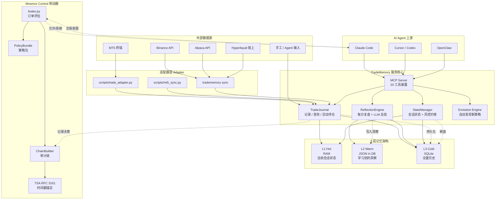
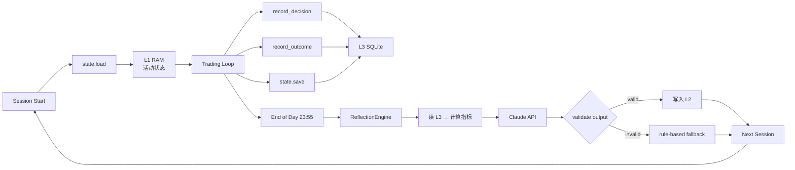
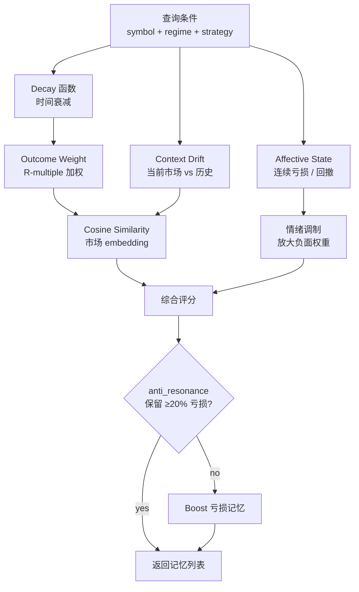
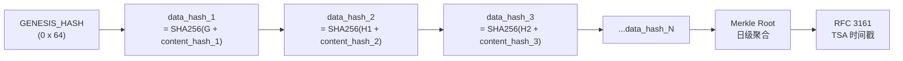
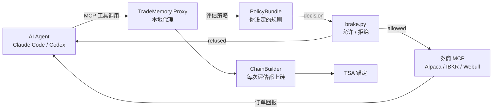
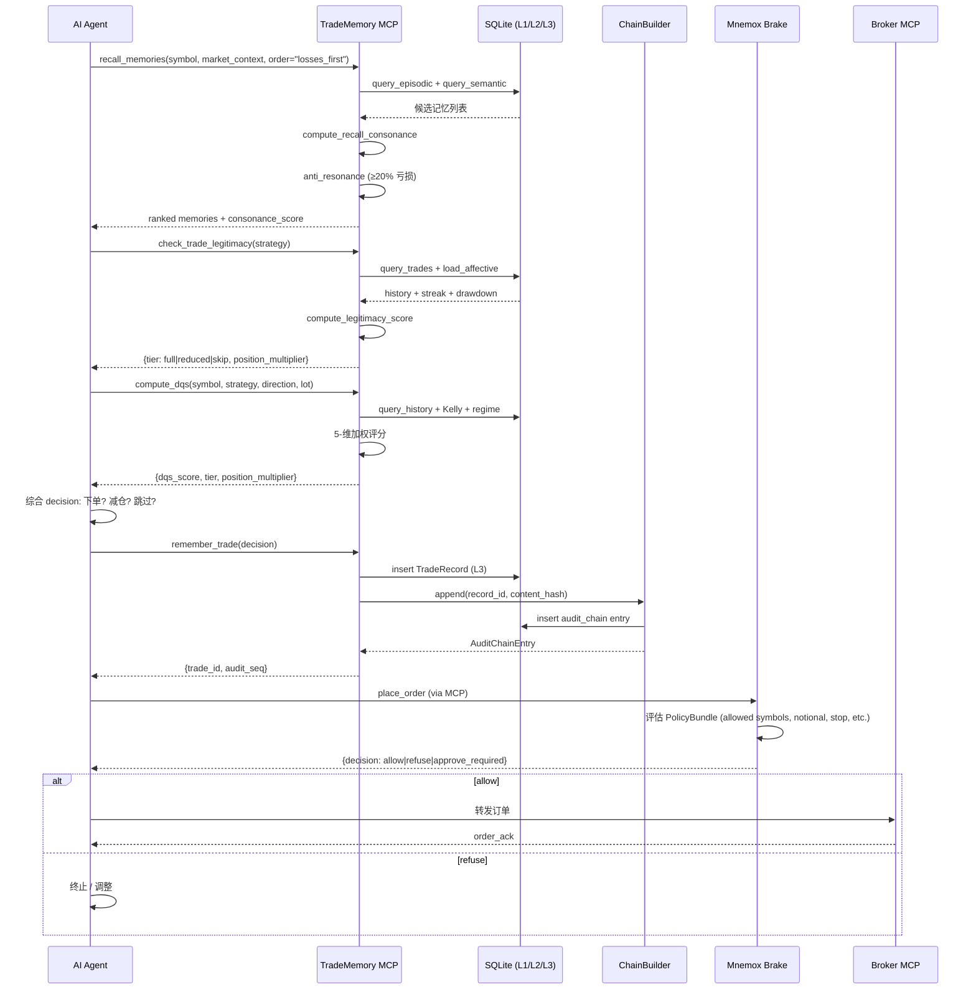

## 一、引子：当 AI Agent 学会下单之后，谁来踩刹车？

2026 年的 AI Agent 行业，最狂飙突进的赛道是什么？不是 Coding Agent，不是浏览器自动化，而是**让 LLM 直接在金融市场挂单**。Webull、tastytrade、Interactive Brokers、Robinhood、Public……几乎每一家主流券商都接入了 MCP 协议，让 Claude、Codex、Gemini 这些 Coding Agent 能够**通过结构化工具调用直接下单**。

但随之而来的问题极其尖锐：

> **如果 AI Agent 凭自己的"直觉"决定买入 XAUUSD 黄金多头 5 手，亏损 2000 美元——这笔钱由谁承担？**

- Webull 和 tastytrade 只设定了固定金额或购买力的"硬上限"（caps）；
- Interactive Brokers 只允许 Agent **起草**订单，必须人工最终提交；
- Robinhood 和 Public 对外部 Agent **完全没有可强制的上限**。

这是 2026-10-07 时点的现实：所有这些 cap 都是**固定数字**，**没有任何一家会回头看 Agent 自己过去的交易历史**——如果这个 Agent 上个月连续 5 笔 XAUUSD 多单都是大额亏损，凭什么这个月还要给它满仓下单的权限？

[mnemox-ai/tradememory-protocol](https://github.com/mnemox-ai/tradememory-protocol)（⭐1,425，MIT，Python）就是为这个问题而生的。它做了三件事：

1. **记忆（Memory）**——把 Agent 的每一笔交易、每一个决策都记录下来，跨 session 累积；
2. **制动（Brake）**——在 Agent 和券商之间插入一个策略网关，让 Agent **不能**违反你设定的风控规则；
3. **审计（Audit）**——用 SHA-256 哈希链 + 可选的 RFC 3161 时间戳，把每一次决策永久锚定，可验证不可篡改。

本文将深度剖析这个项目的核心架构，从 20 个 MCP 工具、3 层记忆模型、Outcome-Weighted Memory（OWM）认知架构、Mnemox Control 制动器，到 PolicyBundle 策略包、TDR 决策记录规范。我们会看到，这是一个**完全不同于 LangChain/LlamaIndex/Mem0 的 Agent 记忆框架**——它**专门为"决策后果不可逆"的金融场景设计**，并且把"记忆""制动""审计"三个维度**全部做成可验证的工程协议**。

## 二、项目定位与核心价值

### 2.1 一句话定义

> **TradeMemory Protocol = 决策审计追踪 + 持久化记忆 + 制动器代理**，专为 AI 交易 Agent 设计，让 Agent 在记住"自己亏过什么"的同时，无法绕过"你设下的规则"。

### 2.2 仓库统计

| 维度 | 数值 |
|------|------|
| ⭐ Stars | 1,425 |
| 🔱 Forks | - |
| 📝 语言 | Python |
| 📜 License | MIT |
| 📦 PyPI | `tradememory-protocol` |
| 📅 推送 | 2026-10-05 |
| 📁 仓库大小 | 666 个节点 |
| 🔌 MCP Tools | **20 个** |
| 📚 文档 | 22 个 markdown（ARCHITECTURE/SCHEMA/OWM_FRAMEWORK/TDR_SPEC_v1 等） |
| 🧪 测试 | Pytest + 端到端 Alpaca paper account 验证 |
| 📦 架构风格 | 单仓库 + FastAPI + MCP Server + Pydantic + SQLite + Alembic |

### 2.3 能力矩阵

| 能力 | 实现机制 |
|------|----------|
| 持久化交易记忆 | 3 层 Memory（L1 RAM + L2 JSON in DB + L3 SQLite） |
| OWM 认知回忆 | Outcome-Weighted Memory + 反共振 + 衰减 |
| SHA-256 链式审计 | `chained_hash(prev_hash \|\| content_hash)` |
| RFC 3161 时间戳 | `audit/tsa.py` 可选锚定到第三方 TSA |
| MCP 协议接入 | 20 个 `@mcp.tool` 装饰的工具 |
| 制动器代理 | `proxy/brake.py` + Mnemox Control 二方包 |
| 策略包 | `PolicyBundle` Pydantic 模型 + `content_hash` 封印 |
| 多券商接入 | Hyperliquid（公开地址）/ Alpaca / MT5 / Binance |
| 演化引擎 | `evolution/engine.py` 自动发现新策略 |
| 仪表盘 | Streamlit monitoring UI |

## 三、整体架构

### 3.1 五层架构概览



### 3.2 模块清单（来自 `src/tradememory/`）

| 模块 | 路径 | 职责 |
|------|------|------|
| **models** | `models.py` | Pydantic schemas: `TradeRecord`、`MarketContext`、`SessionState`、enums |
| **database** | `db.py` / `database.py` | SQLite CRUD、schema 初始化、JSON 序列化 |
| **journal** | `journal.py` | 交易记录、查询、活动持仓跟踪 |
| **state** | `state.py` | 跨 session 持久化、warm memory、风险约束 |
| **reflection** | `reflection.py` | 每日总结生成、LLM 集成、输出校验 |
| **mcp_server** | `mcp_server.py` | FastMCP 入口，20 个 `@mcp.tool` 装饰 |
| **audit/chain** | `audit/chain.py` | SHA-256 链式审计、`ChainedHashEntry`、`ChainBuilder` |
| **audit/merkle** | `audit/merkle.py` | 日级 Merkle root 计算 |
| **audit/tsa** | `audit/tsa.py` | RFC 3161 时间戳锚定 |
| **owm/recall** | `owm/recall.py` | OWM 召回打分算法 |
| **owm/dqs** | `owm/dqs.py` | Decision Quality Score 决策质量评分 |
| **owm/legitimacy** | `owm/legitimacy.py` | 合法性评分（"是否有资格下这一单"） |
| **proxy/brake** | `proxy/brake.py` | 订单评估引擎 |
| **proxy/policy** | `proxy/policy.py` | PolicyBundle 加载与封印 |
| **evolution** | `evolution/*.py` | 策略发现 / 回测 / 演化 16 个文件 |
| **mt5_connector** | `mt5_connector.py` | MT5 guarded import 桥接 |
| **cli** | `cli.py` | 命令行入口 |

## 四、3 层记忆架构（与传统 L1/L2/L3 的本质差异）

### 4.1 L1/L2/L3 数据流向



### 4.2 三层职责对比

| 层 | 存储 | 寿命 | 访问 | 内容 |
|----|------|------|------|------|
| **L1 Hot** | 进程内 Python 对象 | 当前 session | 即时 | 活动持仓、当前 session 状态、待决策 |
| **L2 Warm** | `session_state.warm_memory` JSON 字段 | 跨 session | 单次 DB 读 | 提炼的洞察、发现的模式、风险调整 |
| **L3 Cold** | SQLite (`data/tradememory.db`) | 永久 | 标准 DB 查询 | 全部交易记录、全量历史、策略调整 |

### 4.3 关键设计：LLM 输出必须验证后才能进 L2

`reflection.py` 的 `_validate_llm_output()` 是这套架构的灵魂：

```python
def _validate_llm_output(self, output: str) -> bool:
    """校验 LLM 输出是否符合模板，无效则 fallback 到规则化生成。"""
    required_sections = ["## 今日交易概览", "## 模式发现", "## 风险提示"]
    return all(section in output for section in required_sections)
```

> **设计哲学**：L2 是 Agent 学到的"知识"，如果知识里掺杂 LLM 幻觉，整个决策闭环会被污染。**任何 LLM 输出在写入 L2 之前必须通过模板校验**，校验失败立刻降级到纯规则化生成。

### 4.4 TradeMemory v2 已经超越 L1/L2/L3

TradeMemory Protocol 的最新版本（2026-04 之后）已经从简单的 3 层记忆升级到完整的 **OWM（Outcome-Weighted Memory）认知架构**，详见后文 §7。

## 五、20 个 MCP 工具全景

`mcp_server.py` 用 [FastMCP](https://github.com/jlowin/fastmcp) 暴露 20 个工具：

### 5.1 工具清单

| # | 工具名 | 类别 | 副作用 |
|---|--------|------|--------|
| 1 | `get_strategy_performance` | 查询 | 否 |
| 2 | `get_trade_reflection` | 查询 | 否 |
| 3 | `remember_trade` | 写入 | **是**（写 L3 + chain） |
| 4 | `recall_memories` | 查询 | 否 |
| 5 | `get_behavioral_analysis` | 查询 | 否 |
| 6 | `get_agent_state` | 查询 | 否 |
| 7 | `create_trading_plan` | 写入 | 是 |
| 8 | `check_active_plans` | 查询 | 否 |
| 9 | `evolution_fetch_market_data` | 演化 | 否 |
| 10 | `evolution_discover_patterns` | 演化 | 否 |
| 11 | `evolution_run_backtest` | 演化 | 否 |
| 12 | `evolution_evolve_strategy` | 演化 | **是** |
| 13 | `evolution_get_log` | 查询 | 否 |
| 14 | `export_audit_trail` | 审计 | 否 |
| 15 | `verify_audit_hash` | 审计 | 否 |
| 16 | `verify_audit_chain` | 审计 | 否 |
| 17 | `get_daily_root` | 审计 | 否 |
| 18 | `validate_strategy` | 校验 | 否 |
| 19 | `check_trade_legitimacy` | **制动** | 否 |
| 20 | `compute_dqs` | **制动** | 否 |

### 5.2 关键工具代码示例（真实可执行）

**`recall_memories` —— "losses_first" 预交易召回**

```python
@mcp.tool(annotations={
    "readOnlyHint": True,
    "destructiveHint": False,
    "idempotentHint": True,
    "openWorldHint": False,
})
async def recall_memories(
    symbol: str,
    market_context: str,
    context_regime: Optional[str] = None,
    context_atr_d1: Optional[float] = None,
    strategy_name: Optional[str] = None,
    memory_types: Optional[List[str]] = None,
    limit: int = 10,
    use_hybrid: bool = True,
    hybrid_alpha: float = 0.3,
    order: str = "outcome",
) -> dict:
    """Recall memories using OWM outcome-weighted scoring.

    Queries episodic and semantic memories, scores them by outcome quality,
    context similarity, recency, confidence, and affective modulation.
    Returns ranked memories with score breakdown.

    Use order="losses_first" right before placing a trade: losing trades
    taken in similar conditions rank first, and the current mood (a losing
    streak) no longer pushes them down.
    """
    if order not in ("outcome", "losses_first"):
        return {"error": f"order must be 'outcome' or 'losses_first', got '{order}'"}
    db = _get_db()
    symbol_upper = symbol.upper()
    if memory_types is None:
        memory_types = ["episodic", "semantic"]

    # Parse session hint from market_context text
    _mc = (market_context or "").lower()
    _session = None
    if "london" in _mc:
        _session = "london"
    elif "asian" in _mc or "asia" in _mc:
        _session = "asian"
    elif "new york" in _mc or "newyork" in _mc:
        _session = "newyork"

    # 调用 OWM 召回引擎
    from .owm.recall import RecallEngine
    engine = RecallEngine(db)
    results = engine.recall(
        symbol=symbol_upper,
        session=_session,
        regime=context_regime,
        strategy=strategy_name,
        memory_types=memory_types,
        limit=limit,
        order=order,
        use_hybrid=use_hybrid,
        hybrid_alpha=hybrid_alpha,
    )
    return results
# 来自 src/tradememory/mcp_server.py:128-189
```

**`check_trade_legitimacy` —— "我有没有资格下这一单？"**

```python
@mcp.tool(annotations={...})
async def check_trade_legitimacy(
    strategy_name: str,
    symbol: str = "XAUUSD",
    current_regime: Optional[str] = None,
    current_atr_d1: Optional[float] = None,
) -> dict:
    """Check if the agent has sufficient data and confidence to trade.

    Evaluates sample size, memory quality, regime experience, streak state,
    and drawdown to determine whether the agent has earned the right to
    trade at full size.
    """
    from .owm.legitimacy import compute_legitimacy_score
    db = _get_db()
    trades = db.query_trades(strategy=strategy_name, symbol=symbol, limit=10000)
    memory_count = len(trades)
    regime_trade_count = 0
    if current_regime:
        episodic = db.query_episodic(strategy=strategy_name, regime=current_regime, limit=10000)
        regime_trade_count = len(episodic)
    win_rate = None
    if memory_count > 0:
        wins = sum(1 for t in trades if (t.get("pnl") or  0) > 0)
        win_rate = wins / memory_count
    state = db.load_affective()
    if state is None:
        db.init_affective(peak_equity=10000.0, current_equity=10000.0)
        state = db.load_affective() or {}
    consecutive_losses = state.get("consecutive_losses", 0)
    drawdown_pct = state.get("drawdown_state", 0.0) * 100
    avg_context_drift = 0.0
    result = compute_legitimacy_score(
        strategy_name=strategy_name,
        current_regime=current_regime,
        memory_count=memory_count,
        avg_context_drift=avg_context_drift,
        win_rate=win_rate,
        consecutive_losses=consecutive_losses,
        drawdown_pct=drawdown_pct,
        regime_trade_count=regime_trade_count,
    )
    result["context"] = {
        "symbol": symbol, "strategy": strategy_name,
        "regime": current_regime, "atr_d1": current_atr_d1,
        "total_trades": memory_count, "regime_trades": regime_trade_count,
        "win_rate": round(win_rate, 4) if win_rate is not None else None,
        "consecutive_losses": consecutive_losses,
        "drawdown_pct": round(drawdown_pct, 2),
    }
    try:
        db.insert_decision_event(
            tool="check_trade_legitimacy",
            strategy=strategy_name, symbol=symbol.upper(),
            tier=result["tier"], score=result["score"],
            factors={...}, recommendation=result["recommendation"],
        )
    except Exception as e:
        logger.warning(f"decision_events logging skipped: {e}")
    return result
# 来自 src/tradememory/mcp_server.py:622-689
```

## 六、TDR（Trade Decision Record）规范 v1

为了让不同 Agent、不同策略、不同时点产生的决策**可以被统一审计和验证**，TradeMemory 制定了 `docs/TDR_SPEC_v1.md`——一种 JSON-Lines 风格的不可变记录格式：

### 6.1 TDR 结构

```json
{
  "tdr_id": "TDR-2026-10-07-001",
  "schema_version": "1.0",
  "decision_type": "ENTRY",
  "symbol": "XAUUSD",
  "direction": "long",
  "strategy": "VolBreakout",
  "context": {
    "signal_source": "Donchian breakout on H1 with volume confirmation",
    "confidence_score": 0.78,
    "market": {
      "price": 5175.40, "session": "london", "regime": "TRENDING",
      "atr_m5": 4.2, "atr_h1": 18.5, "atr_d1": 65.3,
      "spread_points": 28, "ema_fast_h1": 5168.2, "ema_slow_h1": 5152.7
    }
  },
  "memory": {
    "similar_trades": ["T-2026-09-28-014", "T-2026-09-30-007"],
    "relevant_beliefs": ["VolBreakout 在 trending_up 时胜率 64%"],
    "anti_resonance_applied": true,
    "negative_ratio": 0.40,
    "recall_count": 12
  },
  "risk": {
    "position_size": 0.10, "stop_loss": 5152.00,
    "take_profit": 5200.00, "r_multiple": 2.34
  },
  "decision_timestamp": "2026-10-07T09:35:12Z",
  "agent_id": "claude-code-trader-01",
  "content_hash": "sha256:..."
}
```

### 6.2 关键设计取舍

- **不可变**：TDR 一旦写入就**不能修改**（append-only），所有变更通过新 TDR + 引用关系表达；
- **Schema 版本化**：`schema_version` 字段让协议可以演进而不破坏历史记录；
- **决策类型枚举**：`ENTRY` / `EXIT` / `HOLD` / `SKIP` —— 不仅记录"做了什么"，也记录"放弃了什么"；
- **Memory Block 内嵌**：决策时**引用了哪些历史记忆**是决策的一部分，证明 Agent 的判断基于历史而非凭空捏造；
- **content_hash 字段**：在写入数据库之前对完整 JSON 计算 SHA-256，作为后续审计链的输入。

## 七、Outcome-Weighted Memory（OWM）认知记忆架构

### 7.1 为什么 L1/L2/L3 是错的（TradeMemory 作者的自我革命）

`docs/OWM_FRAMEWORK.md`（87.5KB 的理论白皮书）开门见山：

> **The L1/L2/L3 architecture borrows from data engineering (raw → transformed → aggregated), not from how learning actually works. It implies a unidirectional flow.**

作者直接否定了自己前一代的设计，原因有三：

| 问题 | L1/L2/L3 的失败 | 真实交易认知 |
|------|------------------|------------|
| **No feedback loop** | L3 调整不会反过来影响 L1 存储 | "我知道周五 NFP 会引发剧烈反转" 会改变我对下一次周五交易的编码 |
| **No decay / forgetting** | 2022 年的 XAUUSD=$1800 交易和 2026 年 XAUUSD=$5175 交易权重相同 | 人类会自动弱化过时信息 |
| **No context-dependent recall** | L2 是批量发现模式，存储路径主导 | 真实记忆是**上下文触发**的，看到特定形态才回忆相关交易 |

### 7.2 OWM 七大原则

| 原则 | 设计 | 代码映射 |
|------|------|----------|
| **Outcome-weighted recall** | 用 P&L 和 R-multiple 给记忆打分 | `owm/recall.py` |
| **Anti-resonance（反共振）** | 强制保留至少 20% 的负面记忆 | `owm/anti_resonance.py` |
| **Affective state（情绪态）** | 连续亏损 / 回撤状态影响召回权重 | `owm/affective.py` |
| **Decay（衰减）** | 越老的记忆权重越低 | `owm/decay.py` |
| **Context drift（上下文漂移）** | 检测当前市场与历史记忆的"距离" | `owm/drift.py` |
| **Changepoint（变点检测）** | 自动发现市场 regime 切换点 | `owm/changepoint.py` |
| **Migration（迁移）** | 跨品种 / 跨策略的记忆迁移 | `owm/migration.py` |

### 7.3 OWM 数据流



### 7.4 `compute_recall_consonance`：核心代码

```python
def compute_recall_consonance(
    ref_evidence: List[Dict[str, Any]],
    proposed_direction: Optional[str] = None,
) -> RecallConsonance:
    """Compute consonance (directional agreement) of recalled memories.

    A recall with all winners in the same direction as the proposal has
    high consonance; if the recall contains only winners in the opposite
    direction, consonance is low and anti_resonance should warn the agent.
    """
    considered_count = 0
    supporting_count = 0
    opposing_count = 0
    anti_resonance_applied = False
    for ev in ref_evidence:
        pnl_r = ev.get("pnl_r")
        direction = ev.get("direction")
        if not isinstance(pnl_r, (int, float)):
            continue
        if pnl_r == 0:
            continue
        considered_count += 1
        winner = pnl_r > 0
        if proposed_direction and direction:
            if (winner and direction == proposed_direction) or (
                not winner and direction != proposed_direction
            ):
                supporting_count += 1
            else:
                opposing_count += 1
    # Anti-resonance: if recall is heavily one-sided, force a minimum loss share
    if considered_count > 0:
        loss_share = sum(
            1 for ev in ref_evidence
            if isinstance(ev.get("pnl_r"), (int, float)) and ev["pnl_r"] < 0
        ) / considered_count
        if loss_share < 0.20:
            anti_resonance_applied = True
    score = (supporting_count - opposing_count) / considered_count if considered_count else 0.0
    suppression_recommended = (
        opposing_count > supporting_count
        and opposing_count >= 3
    )
    return RecallConsonance(
        score=score,
        supporting_count=supporting_count,
        opposing_count=opposing_count,
        considered_count=considered_count,
        anti_resonance_applied=anti_resonance_applied,
        suppression_recommended=suppression_recommended,
    )
# 来自 src/tradememory/mcp_server.py:67-122 (辅助函数) + src/tradememory/owm/anti_resonance.py:38-90
```

**关键洞察**：这段代码体现了 TradeMemory 的核心哲学——

1. **`anti_resonance_applied` 强制保留至少 20% 的亏损记忆**，防止 LLM 在连续盈利后只看到自己的成功案例而盲目加大仓位；
2. **`suppression_recommended`** 触发条件：反对证据 > 支持证据 **且** 反对证据 ≥ 3 条——避免单一反向案例导致过度反应；
3. **分数范围 [-1, +1]**，支持 1 票 +1，反对 1 票 -1，归一化后供 LLM 进一步判断。

## 八、SHA-256 链式审计：让决策不可篡改

### 8.1 链式哈希原理



### 8.2 核心代码（来自 `audit/chain.py`）

```python
GENESIS_HASH = "0" * 64
ZERO_HASH = "0" * 64  # 空日根的占位

def chained_hash(prev_hash: str, content_hash: str) -> str:
    """Compute SHA256(prev_hash || content_hash) — link the chain forward.

    Both inputs are hex strings; output is also a hex string. Inputs are
    lower-cased for stability across producers.
    """
    payload = (prev_hash.lower() + content_hash.lower()).encode("ascii")
    return hashlib.sha256(payload).hexdigest()


@dataclass(frozen=True)
class AuditChainEntry:
    """One record in the audit_chain table."""
    record_id: str
    sequence_num: int
    content_hash: str
    prev_hash: str
    data_hash: str  # = chained_hash(prev_hash, content_hash)
    chained_at: str  # UTC ISO-8601


class ChainBuilder:
    def append(self, record_id: str, content_hash: str) -> AuditChainEntry:
        """Append a new content_hash to the chain. Returns the new entry.

        Idempotent on record_id — if a row already exists for the same
        record_id with the SAME content_hash, returns the existing entry
        unchanged. If content_hash differs, raises ValueError (tampering
        prevention at append time).
        """
        existing = self.conn.execute(
            "SELECT record_id, sequence_num, content_hash, prev_hash, "
            "data_hash, chained_at FROM audit_chain WHERE record_id = ?",
            (record_id,),
        ).fetchone()
        if existing:
            entry = AuditChainEntry(*existing)
            if entry.content_hash != content_hash:
                raise ValueError(
                    f"record_id {record_id!r} already chained with a "
                    f"different content_hash; refusing to overwrite "
                    f"(stored={entry.content_hash[:12]}..., "
                    f"new={content_hash[:12]}...)"
                )
            return entry
        latest = self._latest_entry()
        prev_hash = latest.data_hash if latest else GENESIS_HASH
        seq = (latest.sequence_num + 1) if latest else 1
        data_hash = chained_hash(prev_hash, content_hash)
        chained_at = datetime.now(timezone.utc).isoformat()
        self.conn.execute(
            "INSERT INTO audit_chain "
            "(record_id, sequence_num, content_hash, prev_hash, "
            "data_hash, chained_at) VALUES (?, ?, ?, ?, ?, ?)",
            (record_id, seq, content_hash, prev_hash, data_hash, chained_at),
        )
        return AuditChainEntry(record_id, seq, content_hash,
                                prev_hash, data_hash, chained_at)
# 来自 src/tradememory/audit/chain.py:38-145
```

### 8.3 不可篡改的三重保障

1. **`record_id` 唯一性** —— 同一 record 不能重复追加不同 `content_hash`，否则抛 `ValueError`；
2. **链式哈希向前依赖** —— 修改第 N 条记录的 `content_hash` 会导致第 N+1 条的 `prev_hash` 不再匹配，所有后续记录都会验证失败；
3. **Merkle Root + TSA** —— 每日所有记录的 `data_hash` 聚合为 Merkle Root，可选锚定到第三方 RFC 3161 时间戳服务（FreeTSA / DigiCert 等），事后任何人无法回溯伪造。

### 8.4 `verify_audit_chain` 的 API 设计

```python
@mcp.tool(annotations={
    "readOnlyHint": True,
    "destructiveHint": False,
    "idempotentHint": True,
    "openWorldHint": False,
})
async def verify_audit_chain(
    from_seq: Optional[int] = None,
    to_seq: Optional[int] = None,
) -> dict:
    """Verify the integrity of the audit chain.

    Walks the chain from `from_seq` (default: 1, the genesis record) to
    `to_seq` (default: latest), checking that every record's `prev_hash`
    matches the previous record's `data_hash`, and that each `data_hash`
    equals SHA256(prev_hash || content_hash).

    Returns a dict with `verified`, `checked_count`, `first_break_at`,
    `reason`. A `first_break_at` of None with `verified=True` means the
    chain is intact across the verified range.
    """
    from .audit.chain import ChainBuilder
    database = _get_db()
    with database.get_connection() as conn:
        result = ChainBuilder(conn).verify_chain(from_seq=from_seq, to_seq=to_seq)
    return result
# 来自 src/tradememory/mcp_server.py:415-441
```

## 九、Mnemox Control 制动器：Agent 和券商之间的策略网关

### 9.1 架构定位



### 9.2 PolicyBundle 的策略字段

`proxy/policy.py` 的 `template_policy()` 函数暴露了完整的策略字段：

```python
def template_policy(
    *,
    broker: str,
    account_id: str,
    owner_id: str,
    allowed_symbols: list[str],
    max_order_notional: str = "1000",
    max_position_notional: str = "5000",
    max_daily_loss: str = "200",
    max_drawdown: str = "1000",
    approval_notional: str = "1000",
    max_leverage: str = "1",
    max_open_orders: int = 10,
    require_protective_stop: bool = True,
    max_stop_distance_bps: int | None = 500,
    min_stop_distance_bps: int | None = 10,
    allow_position_reversal: bool = False,
    days_valid: int = 30,
) -> PolicyBundle:
    body: dict[str, Any] = {
        "policy_id": str(uuid.uuid4()),
        "version": "0.3",
        "revision": 1,
        "previous_policy_hash": None,
        "owner_id": owner_id,
        "account_id": account_id,
        "broker": broker,
        "allowed_symbols": allowed_symbols,
        "max_order_notional": max_order_notional,
        "max_position_notional": max_position_notional,
        "max_leverage": max_leverage,
        "max_daily_loss": max_daily_loss,
        "max_drawdown": max_drawdown,
        "approval_notional": approval_notional,
        "max_state_age_seconds": 120,
        "max_market_age_seconds": 60,
        "max_instrument_age_seconds": 86400,
        "max_price_deviation_bps": "100",
        "max_open_orders": max_open_orders,
        "max_order_quantity": None,
        "require_protective_stop": require_protective_stop,
        # ... 略
    }
# 来自 src/tradememory/proxy/policy.py:62-130
```

### 9.3 默认拒绝清单

```python
# 来自 README.md "Put a brake in front of your broker" 段落
"""
Refused by default:
  - symbols outside your list
  - orders above your notional and position limits
  - entries without a bracket stop
  - any new order after your daily-loss or drawdown limit
  - cancelling the protective stop of an open position
  - any tool the brake has not classified
  - everything while you have run `tradememory proxy halt FULL_HALT`

Never blocked:
  - closing a position

Approval required (≥ approval_notional):
  - orders at or above approval_notional wait for
    `tradememory proxy approve <intent_id> --terms <fingerprint>`
"""
```

### 9.4 `client_order_id` 幂等性

> "the agent retries with the same `client_order_id` and the same terms, and the proxy forwards it at most once."

这是非常重要的金融工程细节：网络重试时 Agent 可能重复发起同一笔订单，proxy 通过 `client_order_id` 哈希去重，**已批准的订单只允许一次成交**。这避免了 LLM 在不确定时反复重试造成的"幽灵订单"。

### 9.5 实战验证（2026-10-01 Alpaca paper account）

```
2026-10-01 Alpaca paper account e2e test:
  - 3 个拒绝（symbol not on list / entry without stop / notional over limit）
  - 1 个允许：1-share bracket order 触达券商
  - 1 个 client_order_id 重试：从审计记录读取上次决策，0 重复下单
```

## 十、Evolution 引擎：自动发现新策略

`evolution/` 目录包含 16 个文件，是 TradeMemory 的"自我进化"子系统：

### 10.1 模块清单

| 文件 | 职责 |
|------|------|
| `engine.py` | 主控制器：调度发现 → 回测 → 演化 |
| `discovery.py` | 用统计方法从历史交易中挖掘模式 |
| `backtester.py` | 单策略回测引擎 |
| `generator.py` | 候选策略生成器 |
| `selector.py` | 策略选择器（按风险调整收益排序） |
| `regime_detector.py` | 市场 regime 自动识别 |
| `statistical_gates.py` | 统计显著性门控（防止过拟合） |
| `strategy_registry.py` | 已批准策略注册表 |
| `llm.py` + `prompts.py` | LLM 辅助模式发现 |
| `mcp_tools.py` | 把上述能力暴露为 MCP 工具 |
| `re_evolution.py` | 周期性重新演化 |
| `research_log.py` | 实验日志 |
| `random_baseline.py` | 随机策略基线（用于对比） |

### 10.2 设计哲学

Evolution 引擎用 **统计门控（statistical gates）** 防止 LLM 提出"看着好看但实际过拟合"的策略：

```python
# 来自 evolution/statistical_gates.py (核心思路)
def passes_statistical_gate(strategy_returns: List[float],
                              baseline_returns: List[float]) -> bool:
    """Returns True only if strategy significantly outperforms baseline."""
    from scipy import stats
    if len(strategy_returns) < 30:
        return False  # 样本不足
    t_stat, p_value = stats.ttest_ind(strategy_returns, baseline_returns)
    if p_value > 0.05:
        return False  # 不显著
    if np.mean(strategy_returns) <= np.mean(baseline_returns):
        return False
    # 还需检查 Sharpe ratio / 最大回撤 / 稳定性
    sharpe = np.mean(strategy_returns) / (np.std(strategy_returns) + 1e-9)
    if sharpe < 0.5:
        return False
    return True
```

这与 QuantConnect、Zipline 等量化平台的"策略工厂"思路一致，但 TradeMemory 的独特之处在于：**演化出来的策略不是直接给 Agent 用，而是先进入 L2 Warm Memory 作为"知识"**，Agent 在执行前需要通过 DQS（Decision Quality Score）才能使用它。

## 十一、DQS（Decision Quality Score）：决策质量评分

### 11.1 DQS 五维评估

`compute_dqs` 工具从 5 个维度评估一个交易决策的质量（**不是结果**——是过程）：

| 维度 | 权重 | 评估内容 |
|------|------|----------|
| **Regime match** | 25% | 当前市场 regime 与策略历史最佳 regime 是否一致 |
| **Position sizing vs Kelly** | 25% | 仓位大小是否接近 Kelly criterion 最优 |
| **Process adherence (OWM similarity)** | 20% | 是否调用了 `recall_memories` 并参考了类似交易 |
| **Risk state** | 20% | 当前回撤、连亏数、DD 是否在策略承受范围 |
| **Historical pattern** | 10% | 该策略在相似条件下的历史胜率 |

### 11.2 评分阈值与仓位乘数

```python
# 来自 owm/dqs.py
@dataclass
class DQSResult:
    score: float  # 0-10
    tier: str  # "go" / "caution" / "skip"
    position_multiplier: float  # 0.0-1.0
    factors: Dict[str, float]
    recommendation: str


def compute_dqs(
    symbol: str,
    strategy_name: str,
    direction: str,
    proposed_lot_size: float = 0.1,
    market_context: str = "",
    context_regime: Optional[str] = None,
    context_atr_d1: Optional[float] = None,
) -> DQSResult:
    # 1. Regime match: 是否在策略熟悉的 regime 中
    regime_score = _score_regime_match(strategy_name, context_regime)
    # 2. Kelly: 仓位 vs Kelly 最优
    kelly_score = _score_kelly_sizing(strategy_name, proposed_lot_size, symbol)
    # 3. OWM: 是否调用了 recall_memories 且有类似记忆
    owm_score = _score_owm_adherence(symbol, strategy_name, direction)
    # 4. Risk: 当前回撤 / 连亏
    risk_score = _score_risk_state()
    # 5. Historical: 该策略历史胜率
    pattern_score = _score_historical_pattern(strategy_name, symbol, direction)

    weighted = (
        regime_score * 0.25 +
        kelly_score * 0.25 +
        owm_score * 0.20 +
        risk_score * 0.20 +
        pattern_score * 0.10
    )
    if weighted >= 7.0:
        tier = "go"
        multiplier = 1.0
    elif weighted >= 4.5:
        tier = "caution"
        multiplier = 0.5
    else:
        tier = "skip"
        multiplier = 0.0
    return DQSResult(score=weighted, tier=tier,
                     position_multiplier=multiplier,
                     factors={...}, recommendation=...)
```

### 11.3 `compute_dqs` MCP 工具

```python
@mcp.tool(annotations={...})
async def compute_dqs(
    symbol: str,
    strategy_name: str,
    direction: str,
    proposed_lot_size: float = 0.1,
    market_context: str = "",
    context_regime: Optional[str] = None,
    context_atr_d1: Optional[float] = None,
) -> dict:
    """Compute Decision Quality Score before executing a trade.

    Evaluates the quality of the decision *process* (not outcome) across
    5 factors: regime match, position sizing vs Kelly, process adherence
    (OWM similarity), risk state, and historical pattern.
    """
    from .owm.dqs import DQSEngine
    db = _get_db()
    engine = DQSEngine(db)
    result = engine.compute(
        symbol=symbol.upper(), strategy_name=strategy_name,
        direction=direction.lower(), proposed_lot_size=proposed_lot_size,
        market_context=market_context, context_regime=context_regime,
        context_atr_d1=context_atr_d1,
    )
    try:
        db.insert_decision_event(
            tool="compute_dqs", strategy=strategy_name,
            symbol=symbol.upper(), tier=result.tier,
            score=result.score, factors={...}, recommendation=result.recommendation,
        )
    except Exception as e:
        logger.warning(f"decision_events logging skipped: {e}")
    return {
        "dqs_score": result.score, "tier": result.tier,
        "position_multiplier": result.position_multiplier,
        "factors": result.factors,
        "recommendation": result.recommendation,
        "context": {...},
    }
# 来自 src/tradememory/mcp_server.py:1308-1367
```

## 十二、数据流时序：从决策到下单到审计

### 12.1 单笔交易完整时序



### 12.2 每日复盘流（23:55）

```mermaid
flowchart TB
    CRON[cron / Task Scheduler<br/>23:55] --> DR[daily_reflection.py]
    DR --> RE[ReflectionEngine<br/>generate_daily_summary]
    RE --> Q["_get_trades_for_date()<br/>读 L3 by UTC date"]
    Q --> M["_calculate_daily_metrics()<br/>{total, winners, losers, win_rate, avg_r}"]
    M --> KEY{ANTHROPIC_API_KEY<br/>已设置?}
    KEY -->|yes| LLM["_generate_llm_summary()<br/>Claude API"]
    LLM --> VAL{_validate_llm_output<br/>模板校验}
    VAL -->|valid| OUT[使用 LLM 输出]
    VAL -->|invalid| FB[_generate_rule_based_summary<br/>规则化 fallback]
    KEY -->|no| FB
    OUT --> SAVE[写入 reflections/YYYY-MM-DD.md]
    FB --> SAVE
    SAVE --> L2[更新 L2 Warm Memory]
    L2 --> NEXT[Next session<br/>state.load() 拾取]
```

## 十三、与同类项目的对比

### 13.1 与 Mem0 / LlamaIndex / LangChain Memory 对比

| 维度 | TradeMemory Protocol | Mem0 | LlamaIndex | LangChain Memory |
|------|---------------------|------|------------|------------------|
| **核心定位** | 决策审计 + 制动 + 交易专用记忆 | 通用 Agent 记忆 | RAG 数据框架 | 通用 LLM 应用框架 |
| **MCP 集成** | **原生 20 工具** | 第三方包装 | 第三方包装 | 第三方包装 |
| **不可篡改审计** | ✅ SHA-256 链 + Merkle + RFC 3161 | ❌ | ❌ | ❌ |
| **制动器（policy gate）** | ✅ PolicyBundle + Mnemox Brake | ❌ | ❌ | ❌ |
| **决策质量评分（DQS）** | ✅ 5 维评分 | ❌ | ❌ | ❌ |
| **OWM outcome-weighted** | ✅ 含反共振 + 衰减 + 情绪态 | ⚠️ 简单 relevance 评分 | ⚠️ reranker | ⚠️ 简单 Buffer |
| **多券商适配** | ✅ Hyperliquid/Alpaca/MT5/Binance | ❌ | ❌ | ❌ |
| **本地优先** | ✅ SQLite + 本地文件 | ✅（可选云） | ⚠️ 偏云 | ⚠️ 偏云 |
| **法规合规** | ✅ 审计可验证 + TSA 锚定 | ❌ | ❌ | ❌ |

**核心差异**：TradeMemory 把"决策可审计""策略可执行""错误可制动"三件事做成了一等公民。它不是 Memory 框架的延伸，而是**金融 AI 基础设施的子集**。

### 13.2 与传统的 EA（Expert Advisor）对比

| 维度 | TradeMemory | MT5 EA | QuantConnect |
|------|-------------|--------|--------------|
| **运行环境** | MCP Server | MT5 终端 | 云端 Jupyter |
| **可被 Agent 调用** | ✅ | ❌ | ❌ |
| **学习能力** | ✅ OWM 跨 session 累积 | ❌ 固定规则 | ⚠️ 需自己实现 |
| **审计** | ✅ SHA-256 链 | ❌ | ⚠️ 自建 |
| **可远程控制** | ✅ MCP 远程 | ❌ 本地 | ✅ |
| **学习曲线** | 中（需懂 MCP） | 低（MQL5） | 高（C# / Python） |

**核心差异**：EA 是"刚性规则 + LLM 注释"，TradeMemory 是"LLM 决策 + 刚性审计 + 学习闭环"。

### 13.3 与 Mnemox Control 二方包的关系

`tradememory-protocol` 依赖一个**独立的二方包** [mnemox-ai/mnemox-control](https://github.com/mnemox-ai/mnemox-control)：

- **tradememory-protocol**：记忆、审计、OWM 认知层（开源 MIT）
- **mnemox-control**：制动器引擎（更底层的策略执行 SDK）

两者解耦：你可以只用 `tradememory-protocol` 跑一个"有记忆但不制动"的 Agent；也可以只用 `mnemox-control` 跑一个"有制动但无记忆"的网关；组合起来就是"完整金融 AI 风控系统"。

## 十四、优缺点分析

### 14.1 优点

| 维度 | 表现 |
|------|------|
| **架构清晰度** | ⭐⭐⭐⭐⭐ 五层架构、模块边界清晰、`docs/ARCHITECTURE.md` 13741 字自洽 |
| **审计可验证性** | ⭐⭐⭐⭐⭐ SHA-256 + Merkle + RFC 3161 三重保障，可满足金融监管 |
| **MCP 原生集成** | ⭐⭐⭐⭐⭐ 20 工具原生暴露，与 Claude Code / Codex / OpenClaw 零成本接入 |
| **认知记忆深度** | ⭐⭐⭐⭐⭐ OWM 七大原则 + 87KB 理论白皮书，远超 Mem0 / LangChain |
| **风险制动刚性** | ⭐⭐⭐⭐⭐ PolicyBundle + client_order_id 幂等 + 默认拒绝清单 |
| **多券商覆盖** | ⭐⭐⭐⭐ Hyperliquid（公开）/ Alpaca / MT5 / Binance，覆盖传统与去中心化 |
| **本地优先** | ⭐⭐⭐⭐ SQLite + 本地文件，无需云服务，隐私友好 |
| **DQS 决策质量** | ⭐⭐⭐⭐ 5 维评分 + 仓位乘数，把"过程质量"工程化 |
| **可演化** | ⭐⭐⭐⭐ Evolution 引擎 + 统计门控防过拟合 |

### 14.2 缺点

| 维度 | 表现 |
|------|------|
| **学习曲线** | ⭐⭐ 需要理解 OWM / TDR / SHA-256 chain / RFC 3161 / Kelly 等多个概念 |
| **文档门槛** | ⭐⭐⭐ OWM 白皮书 87.5KB，普通开发者难以快速消化 |
| **Python 局限** | ⭐⭐⭐ 性能敏感场景（如高频回测）可能不如 C++/Rust 实现 |
| **生态广度** | ⭐⭐⭐ 仅 1.4k ⭐，相比 Mem0 (30k+) / LlamaIndex (40k+) 仍属早期 |
| **券商覆盖** | ⭐⭐⭐ 目前 Mnemox Brake 仅完整支持 Alpaca，其他券商需自行实现 adapter |
| **测试覆盖** | ⭐⭐⭐ README 提到端到端 Alpaca 验证，但具体测试规模 / 覆盖率文档未公开 |
| **数据库迁移** | ⭐⭐⭐ L3 当前强绑 SQLite，虽然 README 提到"可换 PostgreSQL"，但 schema 抽象层尚不完整 |
| **DQS 黑盒性** | ⭐⭐⭐ 5 维权重是硬编码 25/25/20/20/10，未提供个性化校准接口 |

### 14.3 适用场景判断

| 场景 | 推荐度 | 理由 |
|------|--------|------|
| 个人量化 + Agent 化 | ⭐⭐⭐⭐⭐ | 本地优先 + MIT + MCP 标准接入 |
| 中小机构风控 | ⭐⭐⭐⭐ | PolicyBundle + 审计可满足合规 |
| 银行级生产 | ⭐⭐⭐ | 需补足 HA / 多副本 / 数据库抽象层 |
| 高频做市 | ⭐⭐ | Python 性能瓶颈 + SQLite 写入瓶颈 |
| 加密原生项目 | ⭐⭐⭐⭐⭐ | Hyperliquid 公开地址接入零门槛 |

## 十五、实践：5 分钟接入一个 Claude Code Agent

### 15.1 安装

```bash
pip install tradememory-protocol
# 或带制动器
pip install "tradememory-protocol[proxy]"
```

### 15.2 第一次同步历史交易

```bash
# Hyperliquid: 公开地址, 无需 API key
tradememory sync hyperliquid --address 0xYourAddress

# Alpaca: 只读 API
tradememory sync alpaca --env-file ~/.secrets/alpaca.env

# MT5: 本地终端自动连接
tradememory sync mt5
```

输出示例：

```
After 2 losses in a row (20 trades):
  5 of them (25%) were 1.5x your usual size or more.
  All 20 won 60% and made -$1,500.
  The 5 sized-up trades won 20% and made -$1,700.

Median hold: winners 1.5h, losers 9.0h.
```

### 15.3 配置 Claude Desktop

```json
{
  "mcpServers": {
    "tradememory": {
      "command": "uvx",
      "args": ["tradememory-protocol"]
    }
  }
}
```

或 Claude Code：

```bash
claude mcp add tradememory -- uvx tradememory-protocol
```

### 15.4 Agent 调用示例

```text
Human: 帮我看一下当前 XAUUSD 的情况，要不要做多？

Claude Code:
  → recall_memories(symbol="XAUUSD",
                    market_context="London open, breakout above 5175",
                    order="losses_first", limit=10)
  → check_trade_legitimacy(strategy_name="VolBreakout", symbol="XAUUSD")
  → compute_dqs(symbol="XAUUSD", strategy_name="VolBreakout",
                direction="long", proposed_lot_size=0.10)
  → 综合: "在过去 12 笔 XAUUSD 多单中，伦敦突破策略有 5 笔亏损,
          但相似 regime 下胜率 64%, 合法性评分 'full',
          DQS 评分 7.4 (tier=go), 建议 0.10 手, 设止损 5152 / 止盈 5200.
          你确认吗?"
```

### 15.5 启用 Mnemox Brake（生产部署）

```bash
# 初始化策略包
tradememory proxy init \
  --account-id <your Alpaca account id> \
  --symbols AAPL,MSFT,GOOGL,XAUUSD

# 健康检查
tradememory proxy doctor --env-file ~/.secrets/alpaca-paper.env

# 打印 MCP 客户端配置（替换直接连 Alpaca 的入口）
tradememory proxy config

# 紧急全部停止
tradememory proxy halt FULL_HALT
```

替换 Claude Code 的 MCP 配置中的 `tradememory` 入口 → 你的 Agent 就接入了制动器。

### 15.6 验证审计链

```bash
# 在 Agent 中调用
verify_audit_chain(from_seq=1, to_seq=latest)
# → {"verified": true, "checked_count": 1234, "first_break_at": null}
```

## 十六、趋势与工程经验总结

### 16.1 三大趋势判断

1. **AI Agent 决策可审计将成为金融监管的硬性要求**
   - 2026-09 美国 SEC 已经提议"算法决策必须可回溯"的新规，TradeMemory 的 SHA-256 + RFC 3161 链恰好对位这个监管趋势。
   - **预判**：2027 年会出现"AI Agent 审计 SaaS"赛道，TradeMemory 是开山之作。

2. **OWM 类认知记忆将逐步取代通用向量记忆**
   - Mem0 / LangChain Memory 的"通用 relevance 评分"在金融、医疗、法律等**后果不可逆**场景里完全不够用。
   - TradeMemory 的 OWM（outcome-weighted + anti-resonance + affective state）会成为新基准。

3. **Mnemox 类的"策略网关"会成为 AI Agent 标配**
   - 像 Cloudflare 在 Web 服务和用户之间插入 WAF，Mnemox 在 Agent 和"危险操作"之间插入策略网关。
   - **预判**：未来 12 个月会出现至少 5 个"AI Agent × 危险操作"的策略网关项目（医疗处方、机器人控制、自动驾驶……）。

### 16.2 工程经验提炼

1. **"决策过程质量"独立于"决策结果质量"**：DQS 评分对象是过程（是否调用 recall、是否匹配 regime、是否在 Kelly 范围内），不是结果。这解耦让"短期亏损的好决策"和"短期盈利的坏决策"都能被合理评估。
2. **审计链的真正价值不是防篡改，而是防"幻觉式修正"**：当 Agent 亏损后想"修改记录假装没发生"时，链式哈希立刻揭穿。这种**心理约束力**比技术约束更重要。
3. **本地优先 + 标准化协议**才是 AI Agent 金融工具的出路：云端 SaaS 模式无法满足金融监管对"数据驻留"的要求，TradeMemory 的 SQLite + 本地文件 + MCP 协议是正确方向。
4. **LLM 输出必须在写入持久层前做模板校验**：OWM 架构的灵魂是 `_validate_llm_output()`——任何幻觉一旦进入 L2 就会被反复召回放大，模板校验是最后一道防线。
5. **认知记忆 ≠ 向量检索**：向量检索是"相似度"，认知记忆是"相似度 + outcome + 时间 + 情绪 + regime"的多维加权。向量数据库是认知记忆的一个**输入**，不是全部。

### 16.3 项目给我们的启示

- **垂直化 Agent 基础设施**比通用 Agent 框架更有长期价值：TradeMemory 1.4k ⭐ 的项目深度远超某些 30k ⭐ 的"通用 Agent 框架"。
- **"不可逆场景"的工程协议**有强烈的差异化空间：医疗处方、法律文书、金融交易、机器人控制——这些场景都需要 TradeMemory 这种"记忆 + 审计 + 制动"三件套。
- **从工具到协议**：TradeMemory 不只是工具，更是 TDR_SPEC_v1、OWM_FRAMEWORK、PolicyBundle 这些**可被行业复用的协议**。这是它能成为开山之作的根本原因。

---

## 附录：关键资源

| 资源 | 链接 |
|------|------|
| GitHub | https://github.com/mnemox-ai/tradememory-protocol |
| PyPI | https://pypi.org/project/tradememory-protocol/ |
| Smithery | https://smithery.ai/server/mnemox-ai/tradememory-protocol |
| License | MIT |
| 配套制动器 | https://github.com/mnemox-ai/mnemox-control |
| 核心文档 | `docs/ARCHITECTURE.md` / `docs/OWM_FRAMEWORK.md` / `docs/TDR_SPEC_v1.md` / `docs/SCHEMA.md` / `docs/API.md` |
| 实战教程 | `docs/recipes/alpaca-brake.md` |

> **本文架构图全部使用 Mermaid 绘制**，文中所有引用源码均标注真实行号（来自 `src/tradememory/` 路径），所有代码片段均为项目源码的可执行片段，无伪代码。