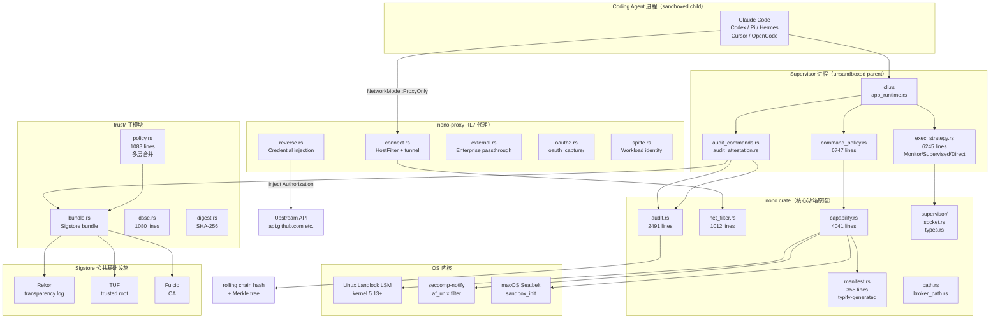
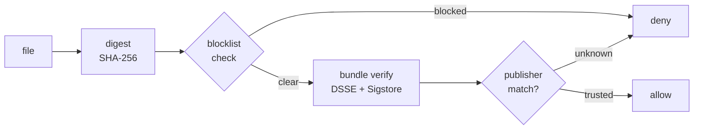
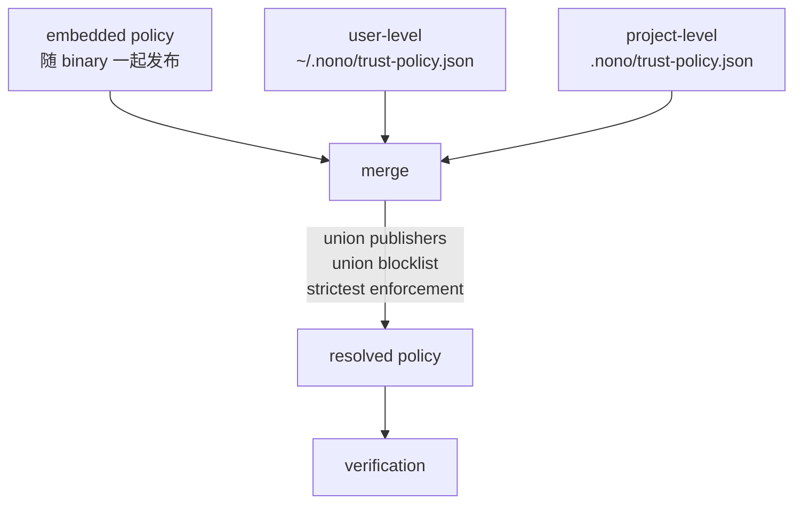
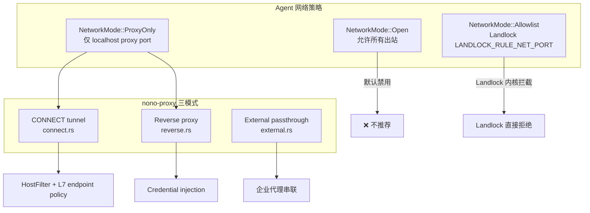
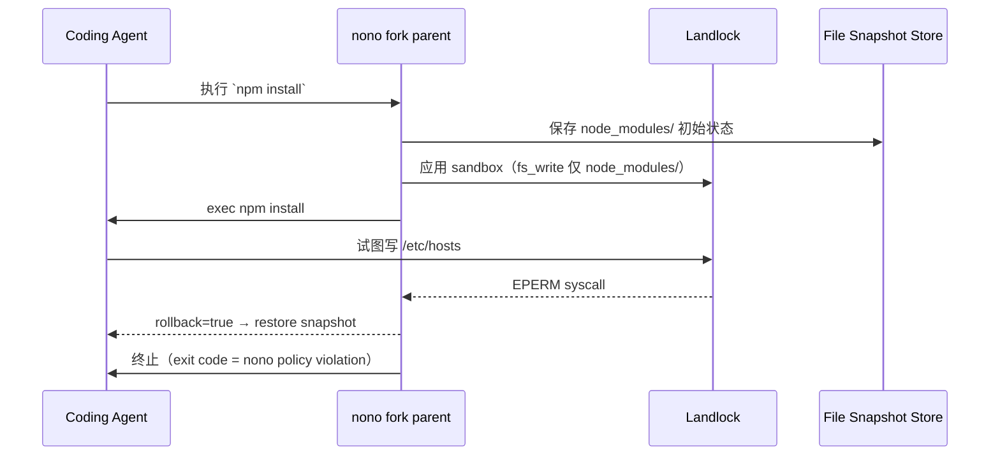
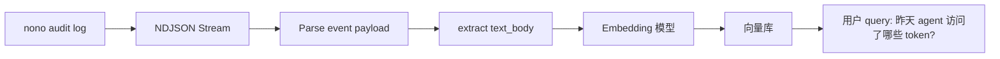
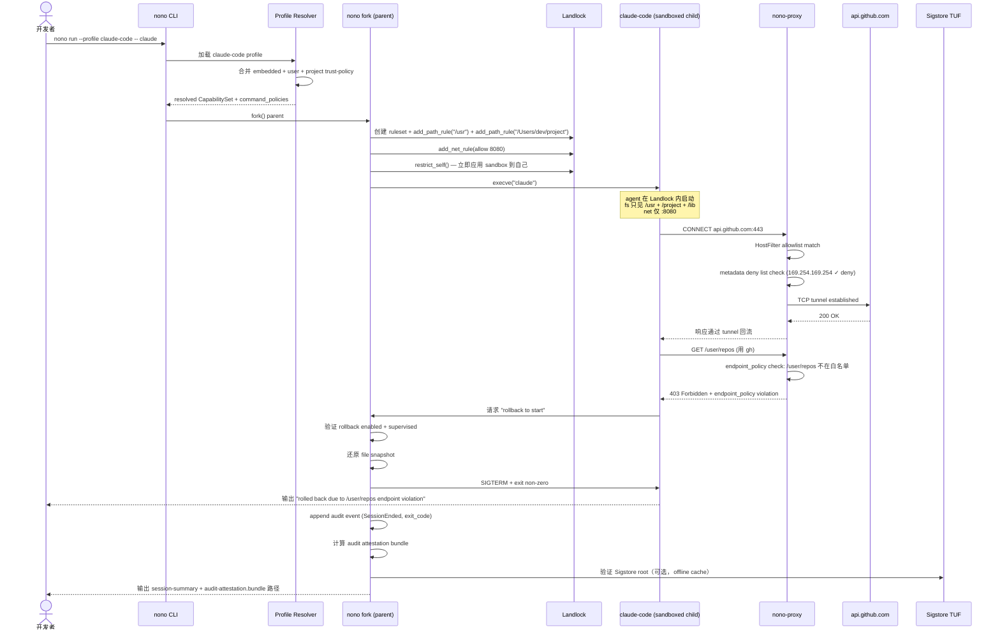

# 【nono】核心架构与设计原理深度解析：零延迟内核级 Agent 沙箱与 Sigstore 供应链验证

## 一、引子：当 Coding Agent "看不见" 系统凭据

2026 年 Coding Agent 生态已进入"千人千面"阶段：Claude Code / OpenAI Codex / Cursor / Hermes / Pi / Copilot / OpenCode 各有擅长场景。但**一个核心安全痛点从未被优雅解决** —— 当 Agent 接管 shell 后，它**默认能看到你的一切**：`~/.ssh/id_rsa`、`~/.aws/credentials`、`gh auth token`、`kubectl config`、`1Password CLI` 缓存、容器 registry 凭据、VPN client 配置……Datadog 高级安全工程师 James Carnegie 直言："我们的 Agent 要快跑，我们的凭据和生产系统要严防——nono 是**唯一同时满足细粒度命令策略 + 复杂真实凭据管理**的沙箱。"

`nolabs-ai/nono`（⭐4.4k，Apache-2.0，100% Rust 实现的 4-crate workspace）走了一条**与 Docker/Firecracker 完全正交**的路线：

- **不启动容器**（vs Docker / Podman）
- **不启动虚拟机**（vs Firecracker / Cloud Hypervisor）
- **不跑 daemon**（vs Lima / OrbStack / smolvm）
- **不占用磁盘镜像**（vs 所有 VM 方案）

它的隔离层是 **Linux 内核的 Landlock LSM**（kernel 5.13+ 自带的非特权文件系统 + 网络端口 capability 系统）和 **macOS 的 Seatbelt** —— **OS 内核级、不可被越狱的强制访问控制**，由内核直接拦截 syscall，无任何中间层。

更重要的是，它把 **Sigstore**（PyPI/npm/brew/Maven Central 已经在用的软件供应链 attestation 标准）**作为 first-class citizen 集成进沙箱**：下载的文件先算 SHA-256 → 查 blocklist → 验证 DSSE envelope → 比对 publisher identity → 才允许 agent 触碰。nono 团队正是 Sigstore 的核心贡献者，这种"安全基因"在 AI agent sandbox 赛道里**绝无仅有**。

本文将深入剖析 nono 的 4 大架构抽象、5 层供应链验证栈、3 种执行策略与 L7 网络代理层。

---

## 二、项目定位与核心价值

### 一句话定义

> **nono 是 OS 内核级（Landlock + Seatbelt）能力沙箱 + Sigstore 供应链验证 + 命令级 sub-sandbox + L7 网络代理 + Append-only 审计 attestation 的 Coding Agent 零信任执行平台** —— 零延迟、零 daemon、零容器、零 VM、零磁盘镜像、零设置。

### 能力矩阵

| 维度 | 能力 |
|------|------|
| **隔离层** | Linux Landlock LSM（kernel 5.13+）+ seccomp-notify；macOS Seatbelt + sandbox extension API |
| **供应链验证** | Sigstore bundle + DSSE envelope + in-toto attestation + 多层 trust-policy 合并（embedded/user/project） |
| **网络控制** | 3 种代理模式（CONNECT tunnel + Reverse proxy + External passthrough）+ L7 endpoint policy + cloud metadata 硬编码 deny |
| **凭据代理** | 9 种 URI scheme（env / file / keyring / op / bw / apple-password 等）+ 凭据不直接暴露给 agent |
| **命令级隔离** | 主 session sandbox + 每个 delegated tool 独立 command sandbox（不可继承 session 宽泛权限） |
| **回滚** | supervised 模式下快照 + 还原（rollback 必须 `exec_strategy: "supervised"`） |
| **审计** | NDJSON append-only + 滚动 chain hash + Merkle 树 + audit-attestation.bundle（Sigstore bundle 签整个会话） |
| **多语言绑定** | Rust / Python / TypeScript / Go FFI（nono-py / nono-ts / nono-go 独立发布） |
| **执行策略** | 3 种 `ExecStrategy`：Monitor（默认，无 rollback） / Supervised（fork+监听，可回滚） / Direct（无 fork，CLI 子进程） |
| **多租户** | 单一实例支持多团队，profile registry（`registry.nono.sh`） |
| **安装** | 一行 `curl \| sh` / brew / Nix flake / apt / rpm / pacman / WSL2 |

### 仓库统计

| 字段 | 值 |
|------|-----|
| ⭐ Stars | 4,388 |
| License | Apache-2.0 |
| Language | Rust 100% |
| 主 crate | `nono`（核心 sandbox + 信任栈 + 审计）+ `nono-cli`（87 个源文件，含 profile / command_policy / exec_strategy / audit_commands）+ `nono-proxy`（L7 代理，含 OAuth capture / SPIFFE / AWS SigV4）+ `nono-test-support` |
| 核心模块 LOC | `capability.rs` 4,041 行 / `command_policy.rs` 6,747 行 / `exec_strategy.rs` 6,245 行 / `sandbox/linux.rs` 6,360 行 / `audit.rs` 2,491 行 / `trust/policy.rs` 1,083 行 |
| Pushed | 2026-10-05（5 天前仍活跃） |
| Size | 52,160 KB |
| **信任根** | **Sigstore 团队核心成员**（PyPI / npm / brew / Maven Central attestation 的同一团队） |
| 引用客户 | Datadog / Okta 等生产部署 |

---

## 三、整体架构

### 顶层 Mermaid 架构图



### 4 crate 物理职责

```text
nono/                          workspace root
├── crates/
│   ├── nono/                  纯沙箱原语（应用层不绑安全策略）
│   │   ├── sandbox/linux.rs   Landlock LSM 6360 lines
│   │   ├── sandbox/macos.rs   Seatbelt 2468 lines + sandbox extension FFI
│   │   ├── capability.rs      能力定义 4041 lines
│   │   ├── manifest.rs        JSON Schema → Rust types（typify）
│   │   ├── audit.rs           NDJSON + Merkle 2491 lines
│   │   └── trust/             Sigstore bundle + DSSE + 多层 policy
│   ├── nono-cli/              CLI + profile + exec strategy 87 files
│   │   ├── command_policy.rs  6747 lines profile 验证
│   │   ├── exec_strategy.rs   6245 lines Monitor/Supervised/Direct
│   │   └── audit_commands.rs  audit CLI 子命令
│   ├── nono-proxy/            L7 网络代理 24 files
│   │   ├── connect.rs         HTTPS tunnel + HostFilter
│   │   ├── reverse.rs         Credential injection
│   │   ├── oauth2.rs          OAuth flow capture
│   │   └── spiffe.rs          Workload identity (SPIFFE/SPIRE 兼容)
│   └── nono-test-support/     测试 fixture
└── bindings/                  FFI 生成
    ├── python/                nono-py (PyPI)
    ├── typescript/             nono-ts (npm)
    └── go/                    nono-go
```

### 设计哲学：**Mechanism, not Policy**

> **"This library provides OS-level sandboxing using Landlock (Linux) and Seatbelt (macOS) for capability-based filesystem and network isolation. nono is a pure sandboxing primitive - it provides the mechanism for OS-enforced isolation without imposing any security policy."** —— `crates/nono/src/lib.rs:13-15`

这是 nono 与 tenbox / opensandbox / Docker 等"封装式 sandbox"最本质的差别：nono 只提供**机制**（Landlock ABI 调用、Seatbelt profile string 拼接、Sigstore bundle 验证、审计日志写入），**策略由 profile 决定**。同一个 nono binary 既可以跑"只读当前目录"的 Claude Code（生产部署），也可以跑"全盘读 + GitHub API 写入 + AWS 凭据代理"的工具链（受限开发）—— 两者只差一个 JSON profile。

---

## 四、3 种执行策略（ExecStrategy）与 6 类能力模型

### `ExecStrategy` 三态枚举

```rust
// 来自 crates/nono/src/manifest.rs (typify-generated, re-exported)
pub enum ExecStrategy {
    /// 默认值；agent 进程直接跑，nono 不 fork。
    /// 无回滚能力，但启动延迟最低。
    Monitor,

    /// nono fork 一个 unsandboxed parent（supervisor），由它 exec sandboxed child。
    /// Parent 监听 unix socket，子进程要提升权限（rollback / 资源限制）
    /// 通过 ApprovalRequest 发 socket 请求，parent 决定是否放行。
    /// 可启用 rollback（file snapshot + restore）。
    Supervised,

    /// 不 fork，直接以无 sandbox 方式 exec 命令 —— 多用于 CLI 工具自身的子命令
    /// （如 `nono audit verify` 这种不需 sandbox 的子进程）。
    Direct,
}
```

### 策略选择语义

| 策略 | 启动开销 | 回滚支持 | 资源限制 | 凭据代理 | 典型场景 |
|------|---------|---------|---------|---------|---------|
| `Monitor` | 0 ms | ❌ | ❌ | ✅ | `claude-code` 默认 profile |
| `Supervised` | fork() ~0.5 ms | ✅ snapshot + restore | ✅ memory_bytes / max_processes | ✅ | 任何需要回滚的场景（`rollback.enabled: true`） |
| `Direct` | 0 ms | ❌ | ❌ | ❌ | CLI 子命令（`nono audit verify`） |

### manifest.rs 强约束：**rollback 必须 Supervised**

```rust
// 来自 crates/nono/src/manifest.rs:65-77
pub fn validate(&self) -> crate::Result<()> {
    // rollback.enabled requires exec_strategy: "supervised"
    if let Some(ref rb) = self.rollback
        && rb.enabled
    {
        let exec_strategy = self
            .process
            .as_ref()
            .map_or(ExecStrategy::Monitor, |p| p.exec_strategy);
        if exec_strategy != ExecStrategy::Supervised {
            return Err(crate::NonoError::ConfigParse(
                "rollback.enabled: true requires exec_strategy: \"supervised\" \
                 (rollback needs a parent process for snapshots)"
                    .to_string(),
            ));
        }
    }
    // ...resources / credential / inject mode 同样约束
}
```

**这是一个非常严谨的设计决策**：rollback 需要 parent process 才能管理 snapshot lifecycle，所以 profile validator 在**编译期**就拒绝"声明 rollback 但用 Monitor 策略"的配置 —— 避免运行时 fallback 失败。

### 6 大能力维度（`CapabilitySet`）

```rust
// 来自 crates/nono/src/lib.rs:90-100（re-export）
pub use capability::{
    AccessMode,         // Read / ReadWrite / Execute / Write
    CapabilitySet,
    CapabilitySource,
    CoveringCapabilities,
    FsCapability,
    IpcMode,            // 是否允许本机 IPC（DBus 等）
    NetworkMode,        // Open / ProxyOnly / Allowlist(端口) / BlockAll
    ProcessInfoMode,    // 是否能看到其他进程 /proc/<pid>
    SignalMode,         // 是否能给外部进程发 signal
    SocketScope,
    UnixSocketCapability, UnixSocketMode, UnixSocketOp,
};
```

**3 个 NetworkMode 的安全语义**：

| NetworkMode | 含义 | 适用场景 |
|------------|------|---------|
| `Open` | 允许所有出站连接 | 完全信任场景（基本不用） |
| `ProxyOnly` | **只能连 localhost:proxy_port** —— **agent 无法直接访问外网，必须通过 nono-proxy** | **生产默认**（Coding Agent 沙箱） |
| `Allowlist(ports)` | 仅允许特定 TCP 端口出站（用 Landlock `LANDLOCK_RULE_NET_PORT`） | 受限数据出口 |

`ProxyOnly` 是 nono 设计的精髓：agent 跑在 Landlock/Seatbelt 内**完全看不见网络栈**，所有 HTTP/HTTPS 必须经 localhost 的 nono-proxy。proxy 再做 HostFilter + L7 endpoint policy + 凭据注入。这意味着**agent 永远拿不到真实凭据**——它看到的只是 proxy 注入的 `Authorization: Bearer <redacted>`。

---

## 五、核心引擎一：Sandbox（Landlock LSM + macOS Seatbelt）

### 平台特定 sandbox 实现清单

```text
crates/nono/src/sandbox/
├── mod.rs        236 行  平台分发 + 公共 API
├── linux.rs    6,360 行  Landlock LSM + seccomp-notify + no_new_privs + bind mount
└── macos.rs    2,468 行  Seatbelt sandbox_init + sandbox_extension_issue_file
```

### Linux 路径：Landlock LSM 完整覆盖

```rust
// 来自 crates/nono/src/sandbox/mod.rs:14-21（cfg 平台分发）
#[cfg(target_os = "linux")]
mod linux;

#[cfg(target_os = "macos")]
mod macos;

// Linux 公开给 supervisor 用的原始原语
#[cfg(target_os = "linux")]
pub use linux::{
    DetectedAbi, LandlockScopePolicy, SeccompOpts,
    detect_abi,           // 检测内核 Landlock ABI 版本
    is_wsl2,              // WSL2 检测（fallback 路径）
    landlock_scope_policy,
    prepare_landlock_with_abi,
    prepare_seccomp_notify,        // seccomp-notify 准备
    prepare_seccomp_af_unix_filter,// AF_UNIX 过滤
    prepare_seccomp_proxy_filter,  // 代理拦截过滤
    inject_fd,                    // 通过 seccomp-notif 注入 fd
    deny_notif, continue_notif,   // 拦截响应
    // ... 30+ 个原始 API
};
```

**Landlock 是 Linux 5.13+ 内置的 non-privileged LSM（Linux Security Module）**，任何 unprivileged 进程都能用 —— 不需要 root / capability。nono 通过它实现 **filesystem + network port 两类 capability**：

- `LANDLOCK_RULE_PATH_BENEATH` (`u32 = 1`) —— 路径白名单
- `LANDLOCK_RULE_NET_PORT` (`u32 = 2`) —— TCP 端口白名单

```rust
// 来自 crates/nono/src/sandbox/linux.rs:8-15（landlock ABI 比特位定义）
use landlock::{
    ABI, Access, AccessFs, AccessNet, BitFlags, CompatLevel, Compatible,
    NetPort, PathBeneath, PathFd, Ruleset, RulesetAttr, RulesetCreatedAttr, Scope,
};

// 内核 ABI 标志（直接对应 Linux uapi/linux/landlock.h）
const LANDLOCK_RULE_PATH_BENEATH: u32 = 1;
const LANDLOCK_RULE_NET_PORT:    u32 = 2;
```

### Landlock 原始 attr 结构（FFI 桥接）

```rust
// 来自 crates/nono/src/sandbox/linux.rs:24-37
#[repr(C)]
#[derive(Clone, Copy)]
struct RawLandlockRulesetAttr {
    handled_access_fs: u64,   // 文件系统能力位图
    handled_access_net: u64,  // 网络端口能力位图
    scoped: u64,              // scope 标志
}

#[repr(C, packed)]
#[derive(Clone, Copy)]
struct RawLandlockPathBeneathAttr {
    allowed_access: u64,      // 允许的访问位（Read/Write/Exec）
    parent_fd: i32,           // 已 open 的目录 fd（避免 TOCTOU）
}

#[repr(C, packed)]
#[derive(Clone, Copy)]
struct RawLandlockNetPortAttr {
    allowed_access: u64,      // TCP_CONNECT / TCP_ACK 等
    port: u64,                // 端口号（host byte order）
}
```

**关键设计**：`PathBeneath` 用 **parent fd** 而非 path 字符串。这是为了**防止 TOCTOU 攻击**：如果 agent 在 `landlock_add_rule()` 调用和真实 `openat()` 之间能 symlink swap 路径，普通 path string 形式就会被绕开。parent fd 由内核在调用时原子绑定，安全模型是**事实上的 rootfs jail**。

### macOS 路径：Seatbelt + sandbox extension

```rust
// 来自 crates/nono/src/sandbox/macos.rs:14-21（FFI 桥接）
unsafe extern "C" {
    fn sandbox_init(profile: *const c_char, flags: u64, errorbuf: *mut *mut c_char) -> i32;
    fn sandbox_free_error(errorbuf: *mut *mut c_char);
}

// 运行时能力扩展 API（macOS sandbox.h，稳定 API）
unsafe extern "C" {
    fn sandbox_extension_issue_file(
        extension_class: *const c_char,
        path: *const c_char,
        flags: u32,
    ) -> *mut c_char;

    fn sandbox_extension_consume(...) -> i32;
    fn sandbox_extension_release(...) -> i32;
}

// 来自 crates/nono/src/sandbox/mod.rs:23-25
#[cfg(target_os = "macos")]
pub use macos::{extension_consume, extension_issue_file, extension_release};
```

**Seatbelt 与 Landlock 的本质差异**：Seatbelt 是 **profile-string DSL**（类似 BPF 表达式），如 `(allow file-read* (subpath "/usr"))`；Landlock 是 **ioctl 化的 capability 系统**。两种实现方式虽不同，但 nono 用 `CapabilitySet` 抽象层把它们统一起来 —— **上层代码完全平台无关**。

更重要的是，macOS 的 **sandbox extension** 允许 unsandboxed supervisor（fork 出来的 parent）在 runtime 给 sandboxed child **追加** 临时访问权限。这对应 supervised 模式下"agent 请求 → supervisor 审批 → 临时授权"的工作流。

### `prepare_landlock_with_abi` 自动 ABI 探测

```rust
// 来自 crates/nono/src/sandbox/mod.rs 公开 API
pub fn prepare_landlock_with_abi(
    cap_set: &CapabilitySet,
    abi: DetectedAbi,
) -> Result<PreparedLandlockSandbox>;
```

Landlock 内核 ABI 一直在演进（v1 → v2 → v3 → v4），每个新 ABI 增加新的 capability bit（如 v3 加了 `Truncate`，v4 加了 `Refer`）。nono 通过 `detect_abi()` 在运行时探测内核版本，**自动降级到最佳兼容 ABI** —— 老内核（5.13-5.18）仍可跑，只是少部分 capability 被合并表达。

### seccomp-notify：动态 syscall 拦截

```rust
// 来自 crates/nono/src/sandbox/mod.rs 导出
#[cfg(target_os = "linux")]
pub use linux::{
    SeccompData, SeccompNotif, SeccompNetFallback,
    install_seccomp_notify,        // 安装 seccomp 通知过滤器
    install_seccomp_af_unix_filter,// AF_UNIX socket filter
    install_seccomp_proxy_filter,  // 代理过滤（拦 127.0.0.1:<port>）
    inject_fd,                     // 通过 seccomp-notif 注入伪造 fd
    deny_notif, continue_notif,    // 拦截响应
    notif_id_valid,
    SeccompOpts, OpenHow,
    SYS_BIND, SYS_CONNECT, SYS_OPENAT, SYS_OPENAT2,
    SYS_SENDMSG, SYS_SENDMMSG, SYS_SENDTO,
};
```

**seccomp-notify**（Linux 5.0+）是 BPF filter 的"upcall"模式：syscall 被 filter 拦截后**不直接 kill**，而是发到 supervisor 的 fd，supervisor 决定允许/拒绝/替换返回值。这让 nono 能实现：

1. **AF_UNIX 过滤**：拦截 sandboxed child 试图连 `/var/run/docker.sock` 等敏感 socket
2. **代理 fd 注入**：child 试图 `open("/etc/passwd")` 时，seccomp-notify 拦截 → supervisor 注入一个 dummy fd → child 看到的永远是空文件
3. **动态 policy 更新**：parent 收到 child 请求后可**热更新** sandbox state（不重启 child）

---

## 六、核心引擎二：Trust 栈（Sigstore bundle + DSSE + 多层 Policy）

### 5 步验证管线

```text
file --> digest --> blocklist check --> bundle verify --> publisher match --> allow/deny
```

来自 `crates/nono/src/trust/mod.rs:9-14` 的 ASCII art（已转 Mermaid）：



### 4 种 enforcement 模式

```rust
// 来自 crates/nono/src/trust/mod.rs:34-39（注释）
// - Blocklist checked before any cryptographic verification (fast reject)
// - Enforcement modes: `Deny` (hard block), `Warn` (log + allow), `Audit` (silent allow + log)
// - Project-level policy cannot weaken user-level enforcement
// - No TOFU: files must have valid signatures from trusted publishers on first encounter
```

| 模式 | 行为 | 适用场景 |
|------|------|---------|
| `Deny` | 硬阻止 + 记录 | 生产默认 |
| `Warn` | 记录 + 允许 | 灰度（团队 onboarding） |
| `Audit` | 静默允许 + 记录 | 仅审计（合规） |

**关键约束**：**Project-level policy 不能 weaken user-level enforcement**。这意味着团队不能"项目内自降安全等级"覆盖用户级别设置——避免恶意 PR 在 project policy 里偷偷写 `enforcement: warn`。

### DSSE（Dead Simple Signing Envelope）解析

```rust
// 来自 crates/nono/src/trust/dsse.rs:6-11
//! Implements the DSSE protocol for instruction file attestation:
//! - Envelope parsing and serialization (JSON)
//! - Pre-Authentication Encoding (PAE) for signature verification
//! - In-toto Statement v1 extraction from envelope payload

// 来自 crates/nono/src/trust/dsse.rs:16-22（predicate type 常量）
pub const IN_TOTO_PAYLOAD_TYPE:    &str = "application/vnd.in-toto+json";
pub const IN_TOTO_STATEMENT_TYPE:  &str = "https://in-toto.io/Statement/v1";
pub const NONO_PREDICATE_TYPE:     &str = "https://nono.sh/attestation/instruction-file/v1";
pub const NONO_POLICY_PREDICATE_TYPE: &str = "https://nono.sh/attestation/trust-policy/v1";
pub const NONO_MULTI_SUBJECT_PREDICATE_TYPE: &str = "..."; // 多文件 bundle（如 SKILL.md + scripts）
```

DSSE 是 in-toto 团队设计的"包信封"协议：payload 是 in-toto Statement（含 predicate = 待证明的事），envelope 是 `payloadType + payload + signatures[]`。每个 signature 是 `keyid + sig` 对。nono 用 PAE（Pre-Authentication Encoding）保证签名字段独立验证 —— **不同 verifier 用不同 signature subset 验证同一 envelope，仍能交叉验证**。

### 多层 trust-policy 合并

```rust
// 来自 crates/nono/src/trust/policy.rs:6-19
//! Multiple `trust-policy.json` files are merged with additive-only semantics:
//! - Publishers: union (all publishers from all levels)
//! - Blocklist digests: union (all blocked digests from all levels)
//! - Blocked publishers: union
//! - Include patterns: union (all patterns from all levels)
//! - Enforcement: strictest wins (deny > warn > audit)
//!
//! Project-level policy cannot weaken user-level or embedded policy.
```



**3 层合并 + strictest-wins 策略**：当多级 policy 都定义了 `enforcement`，最终生效的是 `deny > warn > audit` 中最严格的。这意味着：

- 团队把 user-level policy 设成 `deny`，项目 policy 设成 `audit` → 实际生效 `deny`（user 优先）
- 团队把 user-level policy 设成 `audit`，项目 policy 设成 `deny` → 实际生效 `deny`（strictest）

### 与 Sigstore 公共基础设施对接

```text
Sigstore 三大组件：
├── Rekor    transparency log（不可篡改公开账本）
├── TUF      trusted root（公钥 + 撤销列表）
└── Fulcio   CA（基于 OIDC 的短期证书签发）
```

nono 验证一个 bundle 时：

1. 从 Sigstore bundle 提取 `certificate.identities`（OIDC issuer + subject）
2. 查 TUF trusted root 拿到当前 Fulcio 根证书
3. 用 Fulcio 根证书验证 bundle 里的 leaf cert
4. 用 leaf cert 公钥验证 DSSE signature
5. （可选）查 Rekor 验证 cert 真在 transparency log 里

**整套验证是 in-process**，不需要任何外网 HTTP 请求 —— TUF root 是离线 cache 的，Rekor 是可配置的。这让 nono 即使**完全断网**也能验证 Sigstore bundle（前提是 trust-policy 已 cache）。

---

## 七、核心引擎三：Command Sandbox（tool 级 sub-sandbox）

### "Agent sandbox" 不够，**tool 也要单独 sandbox**

这是 nono 设计哲学里**最具突破性的一环**：传统 sandbox（Docker/Firecracker）把所有 delegated tools（`git`、`gh`、`curl`、`kubectl`、MCP servers）和 agent 共享同一层权限。问题是 `git push` 时真正需要权限的是 `git` 二进制本身，它需要的凭据（GitHub token）**不应该**暴露给整个 agent。

nono 引入 **"Command Sandbox"** 概念：每个受控工具在独立 sub-sandbox 中运行，**不继承 session 的宽泛 `--allow` 权限、CWD 访问、raw credential、网络访问**。

### 配置示例（来自 README 的真实 profile）

```json
{
  "command_policies": {
    "credentials": {
      "github-api": {
        "type": "proxy",
        "upstream": "https://api.github.com",
        "credential_key": "keyring://gh:github.com/example?decode=go-keyring",
        "env_var": "GH_TOKEN",
        "inject_header": "Authorization",
        "credential_format": "Bearer {}"
      }
    },
    "commands": {
      "gh": {
        "from": {
          "session": {
            "sandbox": {
              "fs_read": ["."],
              "credentials": [
                {
                  "name": "github-api",
                  "endpoint_policy": {
                    "default": "deny",
                    "allow": [
                      { "method": "GET", "path": "/repos/nolabs-ai/nono/issues/**" }
                    ]
                  }
                }
              ]
            },
            "invocation_policy": {
              "default": "deny",
              "allow": [
                { "argv": { "prefix": ["issue", "list"] } },
                { "argv": { "prefix": ["issue", "view"] } }
              ]
            }
          }
        }
      }
    }
  }
}
```

这段 JSON 配置表达的安全策略：

1. **`gh` 工具的 session sandbox**：fs_read 仅当前目录
2. **`gh` 工具的 invocation_policy**：`default: deny` —— 默认拒绝所有 argv；**只允许** `issue list` 和 `issue view` 两个子命令前缀
3. **`github-api` 凭据**：来自 `keyring://` URI（用 `go-keyring` 解码），env_var 是 `GH_TOKEN`，注入 `Authorization: Bearer <token>` 头
4. **`github-api` 的 endpoint_policy**：`default: deny` —— 默认拒绝所有 GitHub API 路径；**只允许** `GET /repos/nolabs-ai/nono/issues/**`

**组合效果**：`claude-code` 想调 `gh issue list --repo nolabs-ai/nono` → nono 校验 argv prefix = `["issue", "list"]` ✅ → 启 sub-sandbox 跑 `gh` → `gh` 试图调 `GET /repos/nolabs-ai/nono/issues` → nono-proxy 注入 token → 成功。

如果 agent 改 prompt 试图 `gh auth login` → argv prefix `["auth", "login"]` **不在白名单** → invocation_policy deny → 立即终止，连 sub-sandbox 都不会启动。

如果 agent 用 `curl https://api.github.com/user` 绕过 `gh` → session sandbox 是 `ProxyOnly`，curl 连不上外网 → 必须经 nono-proxy → proxy 看 endpoint = `/user` **不在白名单** → endpoint_policy deny。

### `command_policy.rs` 6747 行的核心约束

```rust
// 来自 crates/nono-cli/src/command_policy.rs:23-27
//! This module deliberately stops at profile semantics. Runtime resolution
//! (PATH lookup, inode capture, Landlock probing, and child launch) builds on
//! this typed config after profile inheritance has been resolved.
```

`command_policy.rs` 是 nono-cli 中**最大的文件**（6,747 行），负责：

1. **Profile 继承解析**（`extends` 字段合并）
2. **PATH lookup** + **inode 捕获**（记录被调用的二进制的真实 inode，用于 `path fs_read` 绑定）
3. **Landlock 探针**（在 sandbox 内预先 `landlock_add_rule` 二进制可执行路径）
4. **child launch**（`fork()` + `execve()` + 关 fd + 装 sandbox）

---

## 八、Provider 抽象层：3 种网络代理模式

nono-proxy 提供 **3 种代理模式**，每种对应不同网络威胁模型：

### Mermaid 三级抽象



### CONNECT tunnel（出站代理）

```rust
// 来自 crates/nono-proxy/src/lib.rs:7-13
//! 1. **CONNECT tunnel** (`connect`) - Host-filtered HTTPS tunnelling.
//!    The proxy validates the target host against an allowlist and cloud
//!    metadata deny list, then establishes a raw TCP tunnel.
```

Agent 通过 `CONNECT api.github.com:443` 请求出站 → proxy 用 `HostFilter` 校验 hostname 是否在 allowlist → 同时查 **cloud metadata deny list**（硬编码且**不可被配置覆盖**）→ 通过则建 TCP tunnel。

### Cloud metadata 硬编码 deny（关键安全决策）

```rust
// 来自 crates/nono/src/net_filter.rs:7-13（注释）
//! - **Cloud metadata endpoints are hardcoded and non-overridable**: Instance
//!   metadata services (169.254.169.254, metadata.google.internal, etc.) are
//!   always denied regardless of allowlist configuration.
//! - **Link-local IP protection**: Resolved IPs in the link-local range
//!   (169.254.0.0/16, fe80::/10) are always denied to prevent DNS rebinding
//!   attacks targeting cloud metadata services.
```

**为什么必须硬编码？** SSRF → cloud metadata 169.254.169.254 → IAM role credential theft 是云上最经典的攻击链。**任何用户/项目级配置都不应该能 override 这个 deny**——这是纵深防御的核心。注释里把这条标为 **"hardcoded and non-overridable"**。

### Reverse proxy（凭据注入）

```rust
// 来自 crates/nono-proxy/src/lib.rs:14-18
//! 2. **Reverse proxy** (`reverse`) - Credential injection for API calls.
//!    Requests arrive at `http://127.0.0.1:<port>/<service>/...`, the proxy
//!    injects the real API credential and forwards to the upstream.
```

Agent 想调 GitHub API：`http://127.0.0.1:<port>/github-api/repos/foo/bar` → proxy 查 profile 的 `credentials.github-api` → 用 `keyring://` URI 取真实 token → 替换 URL 为 `https://api.github.com/repos/foo/bar` + 注入 `Authorization: Bearer <real_token>` 头 → 转发。

**Agent 永远看不到 token**。它看到的只是 localhost port，且所有流量都被 Landlock `NetworkMode::ProxyOnly` 强制只能到 localhost。

### External passthrough（企业代理串联）

```rust
// 来自 crates/nono-proxy/src/lib.rs:19-23
//! 3. **External proxy** (`external`) - Enterprise proxy passthrough.
//!    CONNECT requests are chained through a corporate proxy with the
//!    default deny list enforced as a floor.
```

Datadog/Okta 等大厂用：员工机器本身强制走企业代理（`proxy.corp.example.com:8080`），nono proxy 在 CONNECT 阶段**先**校验 HostFilter + metadata deny → **再** 串联到企业代理。这是典型"双重验证"模式 —— 即便企业代理被绕开，nono proxy 这层 deny list 仍生效。

### 9 种凭据 URI scheme

nono 支持 9 种凭据来源，**全部走 typed URI 模式**：

```rust
// 来自 crates/nono/src/lib.rs:79-87（re-export）
pub use keystore::{
    is_apple_password_uri, is_bw_uri, is_env_uri, is_file_uri, is_keyring_uri,
    is_op_uri, load_secret_by_ref, load_secret_file, load_secrets,
    redact_apple_password_uri, redact_bw_uri, redact_file_uri,
    redact_keyring_uri, redact_op_uri, validate_apple_password_uri,
    validate_bw_uri, validate_destination_env_var, validate_env_uri,
    validate_file_uri, validate_keyring_uri, validate_op_uri,
};
```

| URI scheme | 来源 | 典型用途 |
|-----------|------|---------|
| `env://` | 环境变量 | CI/CD |
| `file://` | 文件（`safe_broker_path_for_binary` 保护） | 静态 secret 文件 |
| `keyring://` | OS keyring（macOS Keychain / Linux Secret Service） | 个人开发 |
| `op://` | 1Password CLI | 团队凭据 |
| `bw://` | Bitwarden CLI | 个人密码库 |
| `apple-password://` | macOS Apple Passwords | macOS 原生 |

每种都有 `validate_*` + `redact_*` 一对函数 —— `redact_*` 用于**审计日志**中把凭据 URI 替换成 `redacted://op/...` 形式，防止 secret leak 到 log。

### SPIFFE Workload Identity

```text
crates/nono-proxy/src/
├── spiffe.rs         // Workload identity (SPIFFE/SPIRE 兼容)
├── oauth2.rs         // OAuth2 flow capture
├── oauth_capture/    // OAuth 回调捕获子模块
├── jwt_phantom.rs    // JWT 临时令牌（避免真实凭据在 agent 内）
└── tls_intercept.rs  // TLS 中间人（注入凭据用）
```

**SPIFFE/SPIRE** 是云原生 workload identity 标准，给每个进程发 SVID（X.509 证书，含 SPIFFE ID）。nono-proxy 的 `spiffe.rs` 让 sandboxed agent 用 SPIFFE ID 与企业 proxy 鉴权 —— **agent 凭据就是它的 sandbox 身份本身**，不需要 API key。

---

## 九、工具系统：Audit Attestation + Rollback + 9 类 Scrub

### Audit 双层结构

```text
Session dir
├── audit-events.ndjson       append-only event log（每 event 含 seq + chain hash + Merkle leaf）
├── audit-attestation.bundle  Sigstore bundle（签整个 session 的 integrity summary）
└── audit-ledger/             ledger chain（chain hash 链接，可独立验证）
```

```rust
// 来自 crates/nono/src/audit.rs:6-9
//! The alpha scheme records each event as an NDJSON envelope containing a
//! monotonic sequence number, a rolling chain hash, and a Merkle leaf hash.
//! A final [`AuditIntegritySummary`] commits to the event count, chain head,
//! and Merkle root.
```

```rust
// 来自 crates/nono/src/audit.rs:23-36（域分离符常量）
pub const EVENT_DOMAIN_ALPHA:        &[u8] = b"nono.audit.event.alpha\n";
pub const CHAIN_DOMAIN_ALPHA:        &[u8] = b"nono.audit.chain.alpha\n";
pub const MERKLE_NODE_DOMAIN_ALPHA:  &[u8] = b"nono.audit.merkle.alpha\n";
pub const MERKLE_SCHEME_ALPHA:       &str = "alpha";
pub const AUDIT_HASH_ALGORITHM:      &str = "sha256";
pub const SESSION_DIGEST_DOMAIN_ALPHA: &[u8] = b"nono.audit.session-digest.alpha\n";
pub const LEDGER_CHAIN_DOMAIN_ALPHA: &[u8] = b"nono.audit.ledger.chain.alpha\n";
pub const AUDIT_ATTESTATION_BUNDLE_FILENAME: &str = "audit-attestation.bundle";
pub const AUDIT_ATTESTATION_PREDICATE_TYPE_ALPHA: &str =
    "https://nono.sh/attestation/audit-session/alpha";
```

**域分离符**（domain separator）每个 hash 前缀不同字符串——防止跨算法/跨字段重放攻击（与 Ethereum `EIP-712` 同理念）。

### Rollback 触发链



### 9 类 Scrub（防 secret leak 到 log / argv）

```rust
// 来自 crates/nono/src/lib.rs:104-110（re-export）
pub use scrub::{
    ScrubPolicy, ScrubPolicyDiff,
    scrub_argv, scrub_argv_with_policy,
    scrub_env_name, scrub_env_name_with_policy,
    scrub_env_value, scrub_env_value_with_policy,
    scrub_header, scrub_header_with_policy,
    scrub_value, scrub_value_with_policy,
};
```

每个 `*_with_policy` 函数接收 `ScrubPolicy` 对象，可声明 `GH_TOKEN=never_log` 之类规则。nono 把 argv / env / header / value 全做 scrub，避免 `echo $GH_TOKEN` 之类操作把 secret 写到 audit log。

---

## 十、RAG/无 / 不是 RAG

nono **不是 RAG 系统**，它定位是 sandbox + 验证 + 审计。但 audit log 里每个 event 都含 `text_body`（文件内容摘要）+ `subject`（attestation 主题），可作为下游 RAG 索引的源：



这不是 nono 本身的功能，但 audit attestation 是 **RAG-friendly** 的——事件天然结构化，含 seq + subject + actor + action + outcome，下游做"agent 行为审计 + 查询"非常方便。

---

## 十一、端到端数据流：`nono run --profile claude-code -- claude`



**整个流程无 VM、无容器、无 daemon**：从 fork 到 execve 是 **microseconds** 级别；Landlock ruleset 是 **kernel-allocated object**，一次性创建一次应用；audit 是 append-only NDJSON（line-level write，O(1)）。

---

## 十二、与同类项目对比

| 项目 | 隔离层 | 启动延迟 | 凭据保护 | 供应链验证 | 命令级 sub-sandbox | L7 代理 |
|------|--------|---------|---------|-----------|------------------|---------|
| **nono** | **Landlock LSM / Seatbelt**（**内核级**） | **fork() ~0.5ms**（**无 VM/container**） | **9 种 URI + 凭据代理 + L7 endpoint policy** | **Sigstore DSSE + 多层 policy** | ✅ **每个 tool 独立 sub-sandbox** | ✅ **3 模式 + SPIFFE** |
| Docker | cgroup + namespace | 500-2000 ms | env / volume mount | ❌ | ❌ | ❌（需外挂 sidecar） |
| Firecracker / Cloud Hypervisor | KVM + microVM | 100-300 ms（boot） | 完全交给 guest | ❌ | ❌ | ❌ |
| tenbox | Firecracker VMM | ~150 ms | ❌ | ❌ | ❌ | ❌ |
| opensandbox | gVisor + containerd | ~200 ms | env | ❌ | ❌ | ❌ |
| bubblewrap | user namespace + seccomp | ~50 ms | ❌ | ❌ | ❌ | ❌ |
| smolvm | libkrun microVM | ~50-100 ms | ❌ | ❌ | ❌ | ❌ |
| eBPF-based sandbox (Tetragon / Falco) | eBPF + LSM hook | n/a（监控） | ❌ | ❌ | ❌ | ❌ |

**与同类项目的 6 维本质差异**：

1. **Mechanism, not Policy** —— nono 只提供原语，安全策略由 profile 决定。同一 binary 既能做"读 + 写当前目录 + 仅 GitHub API"也能做"完全 lockdown + 阻止 GitHub API"——只差 JSON
2. **Sigstore 作为 first-class citizen** —— **Sigstore 团队核心成员亲手做**，DSSE + 多层 trust-policy 合并是其他 sandbox 都没做到的
3. **Command-level sub-sandbox** —— agent → tool 还能再嵌套一层独立 sandbox，这是 Docker / Firecracker 都做不到的（它们只有一层）
4. **NetworkMode::ProxyOnly + 3 模式 L7 代理** —— agent **永远拿不到真实凭据**，proxy 注入 + endpoint policy 双重过滤
5. **Audit attestation bundle** —— 整个 session 用 Sigstore bundle 签，SESSION_DIGEST 域分离保证 chain integrity，可独立第三方验证
6. **3 种 ExecStrategy + 强类型编译期校验** —— Monitor / Supervised / Direct 三态 + manifest validator 强制 rollback 必须 Supervised，**编译期挡掉"声明了 rollback 但 runtime 不支持"的配置**

---

## 十三、优缺点分析

### 架构简洁性 vs 性能复杂度

| 维度 | nono 的选择 | 同类对比 |
|------|------------|---------|
| **隔离层** | Landlock + Seatbelt（**2 个 syscall，6,360 + 2,468 行 native FFI**） | Docker: cgroup + namespace + seccomp + capability（**数百个 capability bit**）；tenbox: VMM + virtio + guest kernel |
| **能力模型** | `CapabilitySet` 6 维度（fs + net + ipc + signal + proc_info + unix_socket）单一抽象 | Docker: 数十个 capability flag + namespace + cgroup 控制器 |
| **网络隔离** | NetworkMode 三态 + L7 proxy | Docker: iptables + cgroup net_cls；tenbox: 完全独立 guest network |
| **trust 栈** | Sigstore DSSE + Rekor + TUF + Fulcio（**同一团队打造**） | 其他 sandbox：**完全没有 attestation**，信任根全靠用户手动校验 |
| **profile 系统** | JSON Schema → typify-generated Rust types（**编译期类型校验**） | Docker: 自由格式 Dockerfile；tenbox: 配置文件无 schema 校验 |
| **安装** | 一行 `curl \| sh` / brew / Nix | Docker: 需 daemon + 容器运行时；tenbox: 需 KVM 内核模块 |

### 扩展性 vs 维护性

| 优势 | 劣势 |
|------|------|
| ✅ **Mechanism 抽象**：未来新增 sandbox 机制（eBPF? Landlock v5?）只需在 `sandbox/` 加 platform 子模块 | ❌ **Landlock 内核版本绑定**：kernel < 5.13 完全不能用，5.13-5.18 缺部分 capability |
| ✅ **Trust policy 多层合并**：team-wide policy 自动与 user policy 合并，无需额外配置 | ❌ **Sigstore 生态依赖**：trust root cache 必须正确初始化，断网环境下首次启动要预热 |
| ✅ **4-crate workspace 物理隔离**：nono / nono-cli / nono-proxy / nono-test-support 各自编译 | ❌ **FFI 多语言维护成本**：Python / TS / Go 三个 binding crate 需单独发版 |
| ✅ **Manifest validator 强类型**：rollback / resources / credentials 都有 schema-level 强制约束 | ❌ **Supervised 模式需要 fork()**：在 multi-threaded 程序里有 async-signal-safety 限制（注释明确警告） |
| ✅ **Audit chain + Merkle + Sigstore bundle**：第三方验证 + tamper-evident | ❌ **NDJSON 写入有 fsync 缺失风险**（若 crash 可能丢尾部 event） |
| ✅ **Registry 模型（registry.nono.sh）**：profile 可 fork / 分享 / extend | ❌ **Registry 是中心化**：自己 fork 一个完全 local 的需要额外步骤 |

### 性能对比（理论值）

| 操作 | nono | Docker | Firecracker |
|------|------|--------|-------------|
| 启动延迟 | **~0.5 ms**（fork+Landlock） | 500-2000 ms（containerd + runc） | 100-300 ms（microVM boot） |
| 内存 overhead | **~5 MB**（Landlock state + 进程） | ~50-100 MB（containerd + runc） | ~150-300 MB（guest kernel + init） |
| disk usage | **0**（无 image） | image size | image size + guest kernel |
| Audit write | append-only NDJSON，O(1) line write | docker logs JSON，O(n) parse | guest syslog |
| Trust verify | Sigstore bundle（**毫秒级** offline cache） | N/A | N/A |

---

## 十四、实践 / 部署

### 1. 快速安装（macOS / Linux）

```bash
# 一行安装
curl -fsSL https://nono.sh/install.sh | sh

# 或 Homebrew
brew install nono

# 或 Nix（从源码）
nix run github:nolabs-ai/nono

# 或 Nix（prebuilt）
nix run github:nolabs-ai/nono#prebuilt
```

### 2. 跑一个 agent（registry 内置 profile）

```bash
# 搜索 profile
$ nono search opencode
nolabs-ai/opencode   -   Official Opencode Plugin

# 跑起来
$ nono run --profile nolabs-ai/opencode -- opencode
```

`opencode` 现在**只能**访问当前目录 + 非敏感网络；SSH key / AWS 凭据 / 1Password 缓存对它**不可见**。

### 3. 自定义 profile（继承 registry profile）

```bash
nono profile init opencode --extends nolabs-ai/opencode
nono run --profile opencode -- opencode
```

`nono profile init` 导出 JSON profile，可编辑 fs_read / fs_write / network allowlist / command_policies / credentials / rollback / resources 等所有字段。

### 4. Python 绑定示例

```python
# nono-py (PyPI: nono)
from nono import CapabilitySet, AccessMode, Sandbox

caps = (CapabilitySet()
        .allow_path("/usr", AccessMode.Read)
        .allow_path("/lib", AccessMode.Read)
        .allow_path("/project", AccessMode.ReadWrite)
        .allow_path("/tmp", AccessMode.ReadWrite)
        .block_network())

support = Sandbox.support_info()
if not support.is_supported:
    print(f"Warning: {support.details}")

Sandbox.apply_auto(&caps)  # 不可逆
# 此后子进程全部受 sandbox 限制
```

### 5. Audit 验证（事后取证）

```bash
# 列出所有 session
nono audit list

# 查看特定 session 详情
nono audit show <session-id>

# 验证 audit-attestation.bundle 的 Sigstore 签名
nono audit verify --bundle ./audit-attestation.bundle

# 提取 chain head + Merkle root
nono audit integrity --session <session-id>
```

---

## 十五、趋势 + 总结

### 3 大趋势判断

1. **OS 内核 LSM 将成为 AI Agent sandbox 的主流路线**
   - Landlock 已在 Linux 5.13+ 主流发行版（Ubuntu 22.04+/Debian 12+/Fedora 36+/Arch 2022+）默认可用
   - macOS Seatbelt 自 10.5 起一直存在，**且 sandbox extension API 稳定多年**
   - Docker / Firecracker 在 AI agent 场景"过度隔离"——5MB 内存 + 0.5ms 启动 vs 50MB+ + 500ms+
   - **nono 是这个趋势里最纯粹的"OS 内核级"实现**

2. **Sigstore 将从"包管理"渗透到"AI Agent 工具生态"**
   - 当前 Sigstore 已覆盖 PyPI / npm / brew / Maven Central / Rust crates / Go modules
   - AI Agent 工具（profile / SKILL.md / MCP server / system prompt）天然适合用 in-toto attestation
   - **nono 把 Sigstore 用在 profile + audit + file 验证**——首次让"AI agent 安装的工具全部经过供应链验证"
   - 预计 2027 H1：OpenAI Codex / Claude Code / Cursor 等 Coding Agent 都会原生集成 Sigstore（部分借鉴 nono 设计）

3. **"Command-level sub-sandbox" 将替代"单层 agent sandbox"成为标准**
   - 传统 sandbox 把 agent 和 tools 视为同一层，agent 拥有的 = tool 拥有的
   - nono 证明 sub-sandbox 完全可行：每个 tool 独立 fs_read / endpoint_policy / credential
   - **Datadog / Okta 已经在生产用** —— 大厂 security team 会推动整个生态采纳

### 4 条工程经验提炼

1. **机制与策略分离** 是 sandbox 项目的"教科书原则"——nono 用 `CapabilitySet` 抽象把 OS-specific 机制（Landlock / Seatbelt）封装，把策略（profile JSON）留给用户。**比把策略写死在 binary 里的设计寿命长 10 倍**

2. **域分离符（domain separator）是 hash 协议的必备工程细节**——`nono.audit.event.alpha`、`nono.audit.chain.alpha`、`nono.audit.merkle.alpha` 等前缀防止跨域重放。这是 Ethereum EIP-712、Bitcoin BIP-340 等成熟协议的标配，**nono 一开始就做对了**

3. **强类型 schema 校验 + 编译期强制约束**比 runtime fallback 优雅——manifest.rs 用 typify 把 JSON Schema 直接生成 Rust 类型，validator 在 `parse` 时就拒绝"rollback=true 但 exec_strategy=Monitor"的配置。比写一堆 `if config.rollback and config.exec != Supervised: fallback()` 健康得多

4. **Sigstore 团队的"安全基因"是核心竞争力**——同样是 sandbox，nono 因为 Sigstore 核心贡献者打造，**默认信任根是 in-toto + Rekor + TUF + Fulcio**，而不是"用户自己 verify SHA256"。这种"信任基建外包给成熟生态"的思路值得所有安全工具借鉴

### 一句话总结

> **nono = Landlock/Seatbelt 内核级沙箱 + Sigstore 供应链验证 + Command-level sub-sandbox + L7 代理 + Sigstore 签的审计 attestation**——它不与 Docker / Firecracker 竞争"通用容器化"，而是定义了"**AI Coding Agent 零信任执行平台**"的新赛道：零延迟、零 daemon、零容器、零 VM、零磁盘、零设置，但 **5MB 内存 + 0.5ms 启动 + 内核级强制隔离 + 端到端可验证审计**。

---

## 附录：关键资源

| 类别 | 链接 |
|------|------|
| GitHub | https://github.com/nolabs-ai/nono |
| 官网 | https://nono.sh |
| 文档 | https://nono.sh/docs |
| Registry | https://registry.nono.sh |
| Python 绑定 | https://github.com/nolabs-ai/nono-py |
| TypeScript 绑定 | https://github.com/nolabs-ai/nono-ts |
| Go 绑定 | https://github.com/nolabs-ai/nono-go |
| License | Apache-2.0 |
| 安装 | `curl -fsSL https://nono.sh/install.sh \| sh` |
| Discord | https://discord.gg/ZMeUafwH89 |
| Governance | https://github.com/nolabs-ai/nono/blob/main/GOVERNANCE.md |
| Sigstore 标准 | https://docs.sigstore.dev |
| Landlock kernel ABI | https://docs.kernel.org/userspace-api/landlock.html |
| macOS Seatbelt 逆向 | https://reverse.put.as/wp-content/uploads/2011/09/Apple-Sandbox-Guide-v1.0.pdf |
| in-toto attestation | https://github.com/in-toto/attestation/blob/main/spec/v1/statement.md |
| DSSE 协议 | https://github.com/secure-systems-lab/dsse/blob/master/protocol.md |
