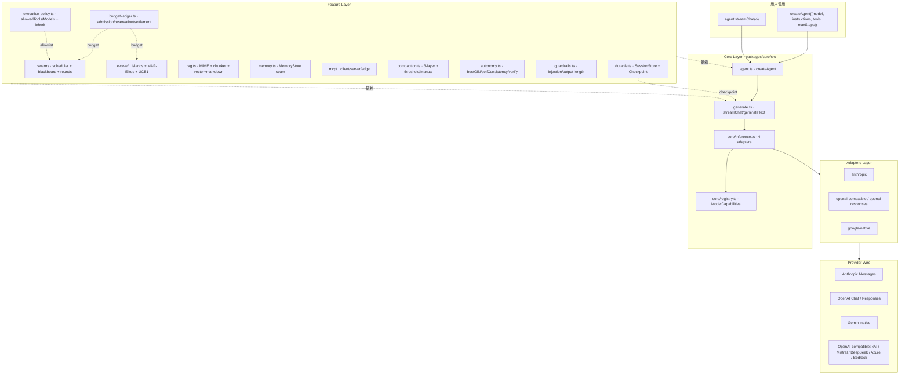
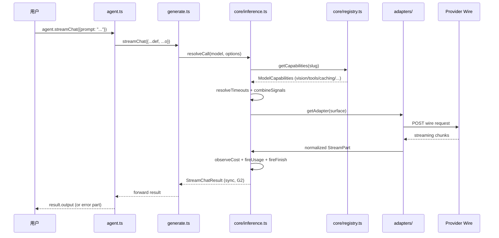
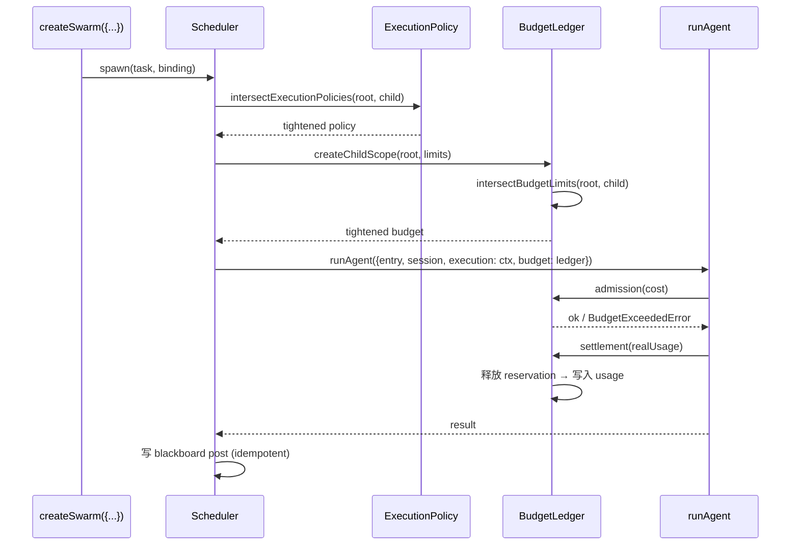
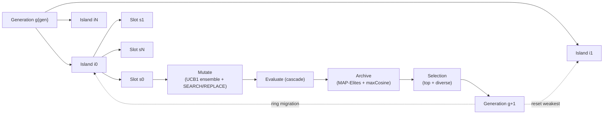
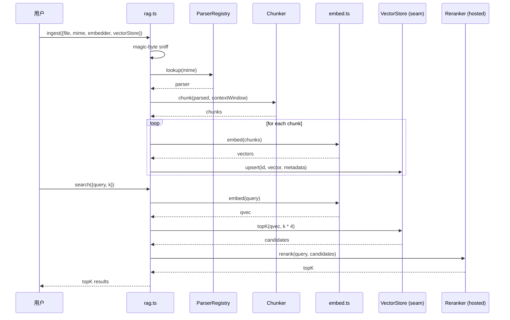
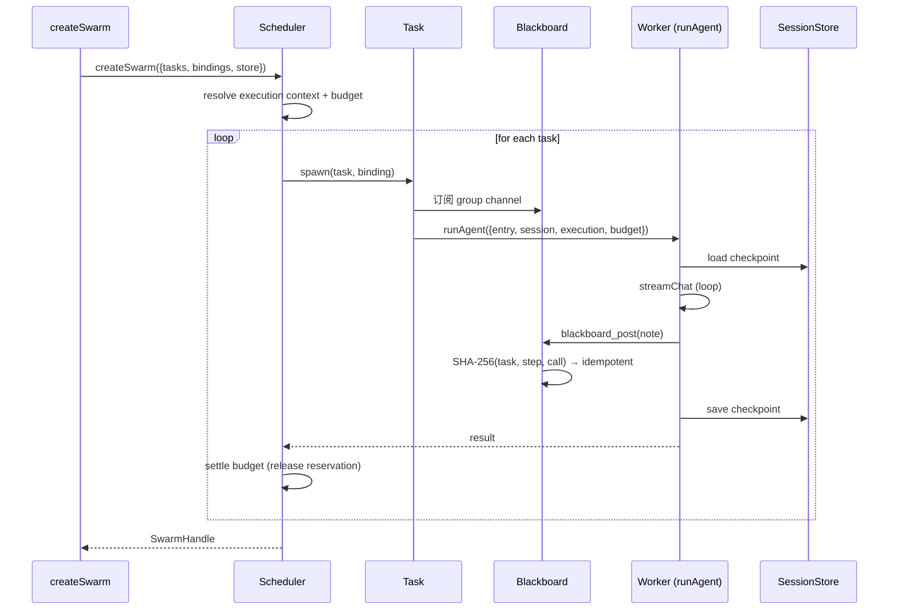

## 引子：当 Agent 框架的战场被推向 Edge Runtime

2025 年的 TypeScript Agent 框架大致有三种路线：

1. **薄包装型**（Vercel AI SDK、OpenAI Node SDK）—— 帮你格式化请求、流式输出，但不碰 agent 循环；
2. **Class + 继承型**（LangChain.js、CrewAI）—— `class Agent extends Runnable` 风格，把 prompt / tool / memory / output parser 拼成一条 chain；
3. **多 Agent 对话型**（AutoGen、ChatDev）—— 让 LLM 通过自然语言相互调用，框架只负责消息路由。

**Deuz-AI/Deuz-SDK**（⭐687，MIT，TypeScript 100%，2.2.0）选择了一条完全不同的路：

> 一个包，零运行时依赖，所有功能用 Web 标准 API（fetch / WebCrypto / AbortSignal / structuredClone）实现，能直接跑在 **Vercel Edge / Cloudflare Workers / Bun / Deno / Node 22+** 上。内置 **durable execution**（resume + checkpoint + settle-on-resume）、**evolutionary program search**（islands + MAP-Elites + UCB1 ensemble）、**budget ledger**（admission + reservation + settlement）、**execution policy**（tool/model 强约束 + 继承收紧）、**swarm scheduler**（黑板 + rounds + 双 reducer）、**hybrid RAG**（vector + markdown + grep 互换）、**manual compaction**（threshold / manual 双触发）、**MCP client / server / edge bridge**、**approval gate**、**observability**（观测 runtime + 全埋点）。整体不引入 class、不引入 prototype、不引入 new、不引入「运行时」。

它不是 AI SDK 的另一种语法糖，而是一套 **「Edge-first + Zero-dep + Free-function Factory」** 的 Agent 系统级答案。本文逐层拆解它的架构与代码实现。

> **关键事实**：仓库 718 节点，180 个核心 TS 文件，`@deuz-sdk/core` 单包体积 7.7 MB（含源码与文档）；2026 H1 由 Umutcan Edizaslan（U-C4N）启动，2026-09-26 发布 2.2.0；版本演进 1.4 → 2.2 已经覆盖 6 个 sprint。

## 一、项目定位与核心价值

### 1.1 一句话定义

**Deuz-SDK 是一个 zero-dependency、edge-safe、multi-provider 的 TypeScript AI SDK；它把"Agent 不只是循环，更是 durable、budgeted、policy-enforced、swarm-aware 的运行时"这一整套抽象统一在 free-function factory 之下。**

### 1.2 能力矩阵

| 抽象层 | 关键原语 | 文件 | 行数级 |
|---|---|---|---|
| **Provider 抽象** | `ModelSurface = 'anthropic' | 'chat_completions' | 'responses' | 'native'` + `ModelCapabilities` registry | `core/registry.ts` | 24 KB |
| **推理核心** | `streamChat / generateText / generateObject / streamObject` 自由函数 | `core/inference.ts` | 36 KB |
| **工具系统** | `tool()` 纯标识函数 + JSON Schema + `agentTool` + `handoff` | `tool.ts` + `inference/agent-tool.ts` | – |
| **Agent 工厂** | `createAgent({...})` 返回 frozen plain object；`agent.streamChat(o) === streamChat({...def, ...o})` | `agent.ts` | 13 KB |
| **Durable 执行** | `SessionStore` seam + `AgentCheckpoint` step-boundary + resume + settle-on-resume + HMAC-signed approval | `durable.ts` | 23 KB |
| **自主原语** | `bestOfN` / `selfConsistency` / `createVerifier` / `parallelAgents` / `planTasks` | `autonomy.ts` | 10 KB |
| **演化搜索** | `evolve()` 岛模型 + MAP-Elites + UCB1 ensemble + SEARCH/REPLACE patch | `evolve/controller.ts` | 46 KB |
| **预算账本** | `BudgetLedger` admission/reservation/settlement + `BudgetScope` 自引用 + persistent store | `budget-ledger.ts` | 33 KB |
| **执行策略** | `ExecutionPolicy` allowedTools / allowedModels / maxDepth / deadlineAt / requireApproval + 继承收紧 | `execution-policy.ts` | 10 KB |
| **RAG** | MIME magic-byte 嗅探 + token-aware chunker + parser registry + cosine retrieval + hosted rerank | `rag.ts` | 30 KB |
| **Memory** | mem0 / Letta / Graphiti / Obsidian 四合一 schema + `MemoryStore` seam + embedder 委托 | `memory.ts` | – |
| **Swarm** | `createSwarm` scheduler + rounds + 黑板（SHA-256 幂等 post）+ leases + recover | `swarm/scheduler.ts` | 46 KB |
| **MCP** | client/server/edge bridge 三形态 + shared content parts | `mcp/index.ts` + `node/mcp.ts` | – |
| **Compaction** | 三层（prune/observe-block/summarize）threshold vs manual 双触发 | `compaction.ts` + `inference/compaction.ts` | – |
| **Guardrails** | `promptInjectionGuardrail` / `maxOutputLength` / `maxToolResultLength` | `guardrails.ts` | – |

### 1.3 仓库统计

| 字段 | 数据 |
|---|---|
| ⭐ Stars | 687 |
| 🍴 Forks | 3 |
| 📝 主语言 | TypeScript (100%) |
| 📜 License | MIT |
| 📦 单包大小 | 7.7 MB（含文档） |
| 🚀 推送频率 | 2026-09-26（v2.2.0 活跃迭代） |
| 🏷️ Topics | agent-framework, agentic-ai, ai, ai-sdk, anthropic, autonomous-agents, claude, durable-execution, gemini, model-context-protocol, multi-agent, nodejs, openai, rag, tool-calling, typescript |
| 📁 默认分支 | main |

## 二、整体架构：Free-function Factory + Zero-class 的全栈抽象

Deuz-SDK 拒绝 class、拒绝 prototype、拒绝继承，却拥有完整的 Agent 抽象体系。它靠的是 **`createAgent({...})` 返回 frozen plain object**，每个方法是 one-line forward：



**关键设计哲学**（直接来自源码注释）：

```ts
// packages/core/src/agent.ts:154-181
/** @deuz-sdk/core/agent (1.9, Sprint 4 · 4.1) — createAgent: define an agent
 *  ONCE, as a reusable VALUE.
 *
 *  No agent class and no new runtime: these build on generateText and the loop
 *  you already have. What was missing was never a class — it was a value.
 *  So this is a FREE-FUNCTION FACTORY returning a FROZEN PLAIN OBJECT of
 *  closures, in the createClient idiom: no class, no new, no prototype,
 *  no inheritance — and no new runtime. */
```

**与 LangChain 的本质差异**：LangChain 的 `AgentExecutor` 是 class，`Runnable` 是 abstract class，prompt/template/parser 之间通过 `|` 运算符（pipe）连接。Deuz-SDK 的 `agent` 是 frozen plain object，所有方法都是 forward，永远不重写。

## 三、核心引擎一：推理核心与 Provider 适配

### 3.1 `streamChat` / `generateText` 的 G2 不变量

Deuz-SDK 的核心承诺之一是 **G2：`streamChat / streamObject 同步返回、永不抛出，失败作为 error part 返回`**。这意味着用户写代码时不需要 try/catch，错误永远以结构化 part 形式回流。

```ts
// packages/core/src/core/inference.ts:570-590
function isUserAbort(err: unknown, signal?: AbortSignal, failSignal?: AbortSignal): boolean {
  if (err instanceof TimeoutError) return false;
  if (signal?.aborted) return true;
  // A failure signal (1.9: the loop's stepMs deadline) is NEVER a user cancel,
  // even if the transport reported a bare AbortError instead of our reason.
  if (failSignal?.aborted) return false;
  return !!err && typeof err === 'object' && (err as { name?: unknown }).name === 'AbortError';
}

function withAbortReason(err: unknown, ...ours: (AbortSignal | undefined)[]): unknown {
  if (err instanceof TimeoutError) return err;
  for (const signal of ours) {
    if (signal?.aborted && signal.reason instanceof TimeoutError) return signal.reason;
  }
  return err;
}
```

**关键设计点**：

- 用户取消（`signal.aborted`）和超时失败（`TimeoutError`）是**两类不同的语义**——前者是协同中止（sync return），后者是失败（error part）；
- 1.9 新增的 `failSignal`（loop 的 stepMs deadline）即使 transport 只报 `AbortError` 也**不被识别为用户取消**——这是一种「宁可误判为失败也不误判为取消」的防御；
- 通过遍历 `ours` 数组（multiple abort sources），即使 transport 不传播 `signal.reason`，也能找到 armed reason 并 surface。

### 3.2 Provider 抽象：4 个 surface，单一 registry

Deuz-SDK 不为每个 Provider 写一个 class。它定义 **4 个 wire surface**（Anthropic Messages、OpenAI Chat Completions、OpenAI Responses、Google native），所有 wire 适配器都遵循统一接口：

```ts
// packages/core/src/core/inference.ts:556-567
/** The only place that references every wire adapter (keeps tree-shaking clean). */
function getAdapter(surface: ModelSurface): Adapter {
  switch (surface) {
    case 'anthropic':       return anthropicAdapter;
    case 'chat_completions': return openaiCompatibleAdapter;
    case 'responses':        return openaiResponsesAdapter;
    case 'native':           return googleNativeAdapter;
  }
}
```

Registry 进一步把"per-model 是否支持 vision / tools / reasoning / 缓存 / pdf / audio / native structured output / reasoning effort 的 wire 形式"全部编码为一张表（`packages/core/src/core/registry.ts` 的 `REGISTRY: Record<string, Row>`）。**未知 model slug 不抛错**，而是回退到 (provider, surface) 的保守默认 + `logger.warn`，保证 `claude-opus-4-9` 上线当天能直接跑：

```ts
// packages/core/src/core/registry.ts:669-697
const REGISTRY: Record<string, Row> = {
  // --- Anthropic (surface 'anthropic') ---
  'claude-fable-5': row('anthropic', 'anthropic', {
    vision: true, reasoning: true, caching: true,
    contextWindow: 1_000_000, maxOutput: 128_000,
    effortWire: 'output_config',  // Opus 4.7+ / Sonnet 5 / Fable 5 用新协议
    samplingRestrictions: true,   // temperature/top_p/top_k 非默认 → 400
  }),
  'claude-sonnet-5': row('anthropic', 'anthropic', {
    vision: true, reasoning: true, caching: true,
    contextWindow: 1_000_000, maxOutput: 128_000,
    effortWire: 'output_config', samplingRestrictions: true,
  }),
  'claude-opus-4-8': row('anthropic', 'anthropic', {
    vision: true, reasoning: true, caching: true,
    contextWindow: 1_000_000, maxOutput: 128_000,
    effortWire: 'output_config', samplingRestrictions: true,
  }),
  // ...
};
```

**核心差异 vs LangChain.js**：

- LangChain 的 `ChatAnthropic / ChatOpenAI / ChatGoogleGenerativeAI` 是 3 个不同 class，每个有不同 streaming 语义；
- Deuz-SDK 把所有 wire 适配器**统一进一个 `getAdapter(surface)` switch**，registry 决定行为，adapter 只负责「把 Normalized 请求翻译成 provider 特定 wire」。

### 3.3 Reasoning effort 双协议支持

不同 Anthropic model 推理深度的 wire 形式不一样：

```ts
// packages/core/src/core/registry.ts:637-640
/** How reasoning depth is sent to Anthropic: manual thinking.budget_tokens
 *  (pre-4.7) vs output_config.effort (Opus 4.7+, Sonnet 5, Fable 5 —
 *  budget_tokens returns 400 there). Non-Anthropic wires ignore this. */
effortWire: 'budget_tokens' | 'output_config';
```

这是非常细粒度的"按 model 切换 wire 协议"——LangChain 不做这件事，统一发 `thinking` 字段，碰到 `claude-opus-4-8` 直接 400；Deuz-SDK 的 registry 自动判断走 `output_config.effort`。

### 3.4 完整推理流程



## 四、核心引擎二：Budget Ledger 与 Execution Policy

### 4.1 Budget Ledger 的三段式账本

Deuz-SDK 把"agent 在跑多少 token / 多少 USD"做成了**带 admission/reservation/settlement 三段的分布式事务**：

```ts
// packages/core/src/budget-ledger.ts:820-842
export type BudgetLedgerErrorCode =
  | 'invalid_budget'
  | 'budget_exceeded'
  | 'missing_reservation'
  | 'reservation_conflict'
  | 'unknown_request'
  | 'invalid_snapshot'
  | 'persistence_failed'
  | 'admission_failed';

export class BudgetLedgerError extends Error {
  readonly name = 'BudgetLedgerError';
  readonly fatalExecution = true;
  // ...
}
```

**核心抽象**：

1. **`BudgetScope`** —— 每个 scope 一个 ID + 自有 budget；scope 可嵌套（parent → child），继承时**只能收紧**（`Math.min`），不能放宽；
2. **`BudgetAdmission`** —— 预订成本/费用，写入 reservation；
3. **`BudgetReservation`** —— 持有占位，防止并发 race；
4. **`BudgetSettlement`** —— 完成后按实际 usage 结算（可能释放部分 reservation）；
5. **`BudgetStore`** —— 持久化层，可换 SQLite / Postgres / 内存。

```ts
// packages/core/src/budget-ledger.ts:870-880
/** Omitted child limits inherit; supplied limits can only tighten the parent. */
export function intersectBudgetLimits(
  parent: BudgetLimits = {},
  child: BudgetLimits = {},
): BudgetLimits {
  const a = limits(parent);
  const b = limits(child);
  const min = (left: number | undefined, right: number | undefined) =>
    left === undefined ? right : right === undefined ? left : Math.min(left, right);
  return limits({ tokens: min(a.tokens, b.tokens), usd: min(a.usd, b.usd) });
}
```

**典型场景**：父 scope 限 100k token，子 scope 传 `tokens: 50_000` → 子只能跑 50k；子传 `tokens: 200_000` 也只能跑 100k（被父收紧）；子不传则继承 100k。

### 4.2 Execution Policy 的 5 维约束

```ts
// packages/core/src/execution-policy.ts:954-998
function policy(input: ExecutionPolicy = {}): ExecutionPolicy {
  if (input === null || typeof input !== 'object')
    throw new ExecutionPolicyError('invalid_policy', 'Policy must be an object.');
  const allowedTools = allowlist(input.allowedTools);
  const allowedModels = allowlist(input.allowedModels);
  // ...
  return Object.freeze({
    ...(allowedTools !== undefined ? { allowedTools } : {}),
    ...(allowedModels !== undefined ? { allowedModels } : {}),
    ...(input.maxDepth !== undefined ? { maxDepth: input.maxDepth } : {}),
    ...(input.requireApproval !== undefined ? { requireApproval: input.requireApproval } : {}),
    ...(input.deadlineAt !== undefined ? { deadlineAt: input.deadlineAt } : {}),
  });
}

/** Intersect mandatory constraints; callers cannot override inherited restrictions. */
export function intersectExecutionPolicies(
  parent: ExecutionPolicy = {},
  child: ExecutionPolicy = {},
): ExecutionPolicy {
  const intersect = (left: readonly string[] | undefined, right: readonly string[] | undefined) =>
    left === undefined ? right : right === undefined ? left : left.filter((item) => right.includes(item));
  const min = (left: number | undefined, right: number | undefined) =>
    left === undefined ? right : right === undefined ? left : Math.min(left, right);
  return policy({
    allowedTools: intersect(a.allowedTools, b.allowedTools),
    allowedModels: intersect(a.allowedModels, b.allowedModels),
    maxDepth: min(a.maxDepth, b.maxDepth),
    deadlineAt: min(a.deadlineAt, b.deadlineAt),
    requireApproval:
      a.requireApproval === undefined && b.requireApproval === undefined
        ? undefined
        : (a.requireApproval ?? false) || (b.requireApproval ?? false),
  });
}
```

**5 个维度**：`allowedTools` / `allowedModels` / `maxDepth` / `deadlineAt` / `requireApproval`，每个都可继承收紧。

**关键不变量**：`intersectExecutionPolicies(parent, child)` 永远不放大父约束 —— 这是**安全默认**：调用方无法"解除"父 policy 设的工具白名单或模型白名单。

### 4.3 用 BudgetLedger + ExecutionPolicy 驱动 Swarm



## 五、核心引擎三：Durable Execution 与 SessionStore

### 5.1 SessionStore seam + AgentCheckpoint step-boundary

Durable execution 的核心是 **"在 step 边界把 agent state 写盘，crash 后从 last checkpoint 恢复"**。Deuz-SDK 把 store 抽象为 `SessionStore` seam，把 state 抽象为 `AgentCheckpoint`：

```ts
// packages/core/src/durable.ts:267-284
/** In-memory SessionStore (default for tests/dev; latest save wins per runId). */
export function createInMemorySessionStore(): SessionStore {
  const runs = new Map<string, AgentCheckpoint>();
  return {
    save(checkpoint) { runs.set(checkpoint.runId, checkpoint); },
    load(runId) { return runs.get(runId); },
    delete(runId) { runs.delete(runId); },
    list() { return [...runs.keys()]; },
  };
}
```

Checkpoint 包含完整 messages 树、token 用量、step 编号、session ID。**二进制安全 JSON codec** 是亮点：

```ts
// packages/core/src/durable.ts:288-309
const BYTES_TAG = '$deuzBytes';

function bytesToBase64(bytes: Uint8Array): string {
  let binary = '';
  for (let i = 0; i < bytes.length; i++) binary += String.fromCharCode(bytes[i]!);
  return btoa(binary);
}

function base64ToBytes(b64: string): Uint8Array {
  const binary = atob(b64);
  const bytes = new Uint8Array(binary.length);
  for (let i = 0; i < binary.length; i++) bytes[i] = binary.charCodeAt(i);
  return bytes;
}

/**
 * Serialize a checkpoint to a JSON string. Uint8Array values anywhere in the
 * message tree (e.g. raw image parts) are tagged and base64-encoded so the
 * round-trip restores REAL Uint8Arrays — plain JSON.stringify would decay
 * them into { "0": 1, "1": 2, … } objects the adapters cannot send.
 * $deuzBytes is a reserved key: an exact { "$deuzBytes": "<base64>" } object
 * inside user/tool data would round-trip as bytes.
 */
export function serializeCheckpoint(checkpoint: AgentCheckpoint): string {
  return JSON.stringify(checkpoint, function (this: unknown, key: string, value: unknown) {
    // Read the PRE-toJSON value off the holder: Node's Buffer is a Uint8Array
    // subclass whose own toJSON runs BEFORE a
    // ...
  });
}
```

**关键设计点**：

- 朴素 `JSON.stringify` 会把 `Uint8Array` 退化成 `{0: 1, 1: 2, ...}` 对象，**adapter 无法识别**；
- 自定义 replacer 在 `toJSON` 之前拦截 `Uint8Array`，用 `$deuzBytes` tag + base64 编码；
- `$deuzBytes` 是**保留 key**：如果用户数据里恰好含同名 key，会产生歧义，文档明文警告；
- `Buffer` 是 `Uint8Array` 子类，`toJSON` 在自定义 replacer 之前触发，所以要"先读 pre-toJSON value"。

### 5.2 Resume 与 Settle-on-resume

恢复时 `resumeFromCheckpoint(checkpoint)` 用 stored history 重启 loop。**关键设计是"settle-on-resume"**：恢复时把已存在的 reservation 重新结算，避免 double-spend。

### 5.3 WebCrypto HMAC 签名 approval

```ts
// packages/core/src/durable.ts:228-229
/** WebCrypto HMAC-SHA256 signed approval tokens. Edge-safe: Web APIs only. */
```

工具调用 approval 在 edge runtime 没有 Node crypto，Deuz 直接用 `crypto.subtle` 跑 HMAC-SHA256 签名 approval token，**完全无依赖**。

## 六、核心引擎四：Evolutionary Program Search

### 6.1 AlphaEvolve 风格的岛屿模型

Deuz-SDK 内置**演化算法驱动的 prompt / program 优化**（evolve 模块），实现 AlphaEvolve 论文风格的搜索：

```ts
// packages/core/src/evolve/controller.ts:417-428
/**
 * evolve/controller.ts — the standalone evolutionary search loop (2.2).
 *
 * Generational, not steady-state: every slot of a generation plans against the
 * population committed by the previous one, with counter-based seeded draws,
 * so selection replays identically regardless of concurrency or resume. A slot
 * whose deterministic ID (g{gen}-i{island}-s{slot}) is already stored is
 * replayed with zero model calls. Mutations are charged to a child execution
 * scope per candidate, the finished scopes are compacted after each
 * generation, and the generation commits with a compare-and-set.
 *
 * Edge-safe: time and IDs come from deps, randomness from ./random.
 */
```

**核心机制**：

1. **Island 模型**：N 个独立岛屿并行演化，每隔 `migrationEvery` 代做一次个体交换（ring migration）；
2. **MAP-Elites archive**：每个 candidate 落入 feature bins（按 `featureBins` 维分箱），每箱保留最优；
3. **UCB1 model ensemble**：多个 LLM（不同 temperature / 模型）作为"变异算子"，按 UCB1 公式选下一个；
4. **SEARCH/REPLACE diff**：变异结果用 patch 形式落到原 prompt，patch 失败时回退 full rewrite；
5. **Idempotent resume**：每个 candidate ID 是 `g{gen}-i{island}-s{slot}` 形式，若已存储则**零模型调用重放**；
6. **Weakest reset**：每隔 `resetWeakestEvery` 代重置最弱岛屿的个体，引入新多样性。

### 6.2 候选存储与持久化

```ts
// packages/core/src/evolve/controller.ts:472-490
interface Config {
  readonly concurrency: number;
  readonly islandCount: number;
  readonly migrationEvery?: number;
  readonly migrationRate: number;
  readonly resetWeakestEvery?: number;
  readonly size: number;
  readonly archiveSize: number;
  readonly eliteRatio: number;
  readonly exploreRatio: number;
  readonly featureBins: number;
  readonly selection: EvolveSelection;
  readonly patch: { readonly diff: number; readonly full: number; readonly cross: number };
  readonly top: number;
  readonly diverse: number;
  readonly weights: readonly number[];
  readonly maxCosine: number;
}
```

`PopulationStore` 是 durable seam（2.2 起），可换 `@deuz-sdk/core/evolve/sqlite`。

### 6.3 评估流水线

每个 candidate 由 N 个 `stages` 评估（`evaluate: (candidate) => Promise<{value, threshold?}>`），未达 threshold 的候选被 Novelty rejection 排除（`maxCosine` 控制 archive 多样性）。



## 七、核心引擎五：Swarm Scheduler 与黑板

### 7.1 createSwarm 的多 Agent 拓扑

```ts
// packages/core/src/swarm/scheduler.ts:67-95
const executors = new WeakMap<SwarmStore, Set<string>>();
// recover (2.2): the most running runs one call examines, and its listing page.
const RECOVER_SCAN = 10_000;
const RECOVER_PAGE = 1_000;
// recover (2.2): consecutive failures, other than a run's own, that end a scan.
const RECOVER_FAILURES = 3;

const TERMINAL: ReadonlySet<SwarmTaskStatus> = new Set<SwarmTaskStatus>([
  'completed', 'failed', 'blocked', 'cancelled',
]);

function binding(value: DeuzAgent | SwarmAgentBinding): SwarmAgentBinding {
  return 'def' in value ? { agent: value } : value;
}
```

**核心抽象**：

- `Swarm` 由一组 `SwarmTask` + `SwarmAgentBinding` 组成；
- 每个 task 有 `group`（黑板 channel 名），同 group 共享黑板；
- Scheduler 在 execution context 下 spawn tasks，**每个 task 是一个 `runAgent` 调用**；
- 通过 `Recovery`（2.2）从 store 恢复 interrupted runs（RECOVER_SCAN 上限 + RECOVER_PAGE 分页 + RECOVER_FAILURES 容忍）；
- `SwarmLease` 防多 executor 同跑（`held` / `lost` 两态）。

### 7.2 黑板的幂等 post

```ts
// packages/core/src/swarm/blackboard.ts:30-39
/** A note's data arrives as JSON text: strict providers (Gemini) reject a
 *  parameter without a type, and no single type covers every JSON value. */
function parseData(data: unknown): unknown {
  if (typeof data !== 'string') return data;
  try { return JSON.parse(data) as unknown; }
  catch { throw new Error('data must be JSON text, for example {"key": 1}'); }
}
```

**关键设计**：

- post key 是 `SHA-256(task, model_step, call_id)`，**重放中断的 call 不会写入第二条**（idempotent）；
- `readChannel` 限制每个 agent 能读哪些 channel（避免"全网可见"）；
- Gemini 等 strict provider 不接受无 type 的 JSON 参数，所以 `data` 字段强制是 JSON 字符串，让工具 schema 显式。

### 7.3 Rounds 模式：组并行 + consolidator

```ts
// packages/core/src/swarm/rounds.ts:18-30
export interface RoundsGroupPlan {
  agent: string;
  /** 1..1000 agents in this group. */
  count: number;
  prompt: string;
}

/** A consolidator's verdict on the round that just finished (2.2). */
export interface RoundsDecision {
  /** End the chain now. */
  stop?: boolean;
  /** Next round's plan by group; a group left out does not run. No groups also stops. */
  groups?: Readonly<Record<string, RoundsGroupPlan>>;
  /** Kept on this consolidator's output. Must be serializable. */
  summary?: unknown;
}
```

`createRounds({initial, consolidate, maxRounds})` 实现**「Wide Research」**模式：第一轮 N 个 agent 并行跑 research → consolidator 看结果决定下一轮 plan → 循环直到 consolidator stop 或达 maxRounds。

## 八、RAG 与 Memory：边缘安全的混合检索

### 8.1 RAG 的 MIME 嗅探

```ts
// packages/core/src/rag.ts:36-44
export type DocMime =
  | 'application/pdf'
  | 'application/vnd.openxmlformats-officedocument.wordprocessingml.document'
  | 'application/vnd.openxmlformats-officedocument.spreadsheetml.sheet'
  | 'text/csv'
  | 'text/plain'
  | 'text/markdown'
  | 'application/msword'
  | 'application/zip';
```

**核心原则**：**永远不信任文件扩展名**。每个 parser 入口先 magic-byte sniff，再走 parse。Parser 注册到 `ParserRegistry`，core 包不 import parser 库（重 parser 在 `@deuz-sdk/core/rag/node`）。

### 8.2 Token-aware Chunker + 阈值策略

`rag.ts` 实现 token-aware chunker（按 model 上下文窗口切），并提供 native-doc-vs-vector 阈值策略：超过阈值的文档直接发给有 native-pdf 能力的 model（Anthropic Claude / Gemini），否则走 chunk + embed + retrieve。

### 8.3 Memory 的四合一 Schema

```ts
// packages/core/src/memory.ts:43-75
/** memory.ts — PURE, edge-safe agent-memory orchestration for @deuz-sdk/core (Faz 3).
 *  Derived from mem0's extract→reconcile→apply pipeline plus the Obsidian /
 *  markdown-graph and Letta/Anthropic memory-tool patterns. Everything stateful
 *  (the vector store, the markdown files, mem0-cloud) lives behind the
 *  MemoryStore seam; embedding is DELEGATED to embed.ts via the Embedder
 *  seam — memory.ts never computes a vector. */

export type MemoryKind = 'episodic' | 'semantic' | 'working' | 'procedural';
export type MemoryEventType = 'ADD' | 'UPDATE' | 'DELETE' | 'NOOP';

export interface MemoryScope {
  userId?: string;
  agentId?: string;
  runId?: string;
  actorId?: string;
  chatId?: string;
}

export interface MemoryRecord {
  id: string;
  text: string;
  hash: string;
  kind: MemoryKind;
  scope: MemoryScope;
  metadata?: Record<string, unknown>;
  importance?: number;
  embedding?: number[];
  embeddingModelId?: string;
  score?: number;
  createdAt: number;
  updatedAt: number;
  lastAccessedAt?: number;
  expiresAt?: number;
  /** Bi-temporal (Graphiti): when the fact became true; default createdAt. */
  validAt?: number;
  /** Soft-supersede marker: set instead of hard-deleting when history matters. */
  // ...
}
```

**四合一 schema**：把 mem0（事实抽取 + 调和）、Letta（working memory）、Graphiti（bi-temporal）、Obsidian（markdown+frontmatter+links）四类记忆系统的**全部字段**做超集，每个字段都可空，让一个 `MemoryStore` 既能跑 cosine vector store，又能跑 markdown+grep。

**关键抽象**：

- `embedding` 字段是**类型 only**：memory.ts **永远不计算 embedding**，全部委托 `embed.ts` 的 `Embedder` seam；
- `embeddingModelId` 锁定 embedding 模型，**dim drift** 可检测（用新模型时旧记录维度不对，会自动 rebuild index）。

### 8.4 RAG 数据流



## 九、Swarm 端到端执行流



## 十、与同类项目对比

### 10.1 Deuz-SDK vs LangChain.js

| 维度 | Deuz-SDK | LangChain.js |
|---|---|---|
| 抽象形态 | **Free-function Factory + Frozen plain object** | `class Agent extends Runnable` |
| 运行时依赖 | **0（仅 Web API）** | 数十个 npm 包（RecursiveLoader、Chevrotain 等） |
| Edge runtime 支持 | **✅ Cloudflare Workers / Vercel Edge** | ❌ 部分 LangChain 模块依赖 Node API |
| Durable execution | **内置 SessionStore + Checkpoint + WebCrypto HMAC** | LangGraph checkpoint 但非 Edge 原生 |
| Provider 抽象 | **registry 表 + 4 surface adapter** | 每个 Provider 一个 class |
| 多 Agent | **Swarm scheduler + rounds + 黑板** | LangGraph supervisor / LangChain multi-agent |
| 演化搜索 | **AlphaEvolve 风格 evolve**（内置） | DSPy / 外部 |
| Budget / Policy | **admission/reservation/settlement + 5 维 inherit** | ❌ 无 |

### 10.2 Deuz-SDK vs Vercel AI SDK

| 维度 | Deuz-SDK | Vercel AI SDK |
|---|---|---|
| 抽象层 | **完整 Agent 栈**（durable + evolve + swarm + RAG） | 薄包装（stream / tool / embedding） |
| Tool | `tool()` + JSON Schema | `tool()` + Zod Schema |
| Agent loop | **内置（step / stopWhen / verifyStep）** | `generateText` 一次性，不循环 |
| Multi-agent | **Swarm scheduler + 黑板** | ❌ 不管 |
| Memory | **MemoryStore seam** | ❌ 不管 |
| RAG | **混合 RAG + 阈值策略** | ❌ 不管 |
| 边缘安全 | **✅ Zero-dep** | ✅ Zero-dep |
| 目标场景 | 生产级长跑 agent | UI 聊天场景 |

### 10.3 Deuz-SDK vs AutoGen / CrewAI

| 维度 | Deuz-SDK | AutoGen | CrewAI |
|---|---|---|---|
| 抽象形态 | Free-function | Conversable class | Role + Task + Crew class |
| 通信模型 | **黑板（idempotent post）+ rounds** | 对话（自由交流） | 顺序 / 层级流水线 |
| 持久化 | **SessionStore + durable resume** | 较弱 | 较弱 |
| Edge runtime | **✅** | ❌ | ❌ |
| Runtime deps | **0** | 多个 Python 包 | 多个 Python 包 |
| Budget 控制 | **ledger + policy** | ❌ | 较弱 |

**核心差异**：Deuz-SDK 是 **「runtime-free + 强持久化 + 强预算」** 路线，强调"agent 能跑在 Cloudflare Workers 上、能 resume、能精确控制成本"；AutoGen / CrewAI 是「对话驱动 + class 重 OO」路线，强调"让 LLM 自由对话"。

### 10.4 Deuz-SDK 的设计哲学：与主流"反着走"

| 主流做法 | Deuz-SDK 反着走 |
|---|---|
| `class Agent extends Runnable` | `createAgent({...})` 返回 frozen plain object |
| `agent.run({prompt})` async throw | `streamChat` 同步返回，error 作为 part |
| Provider 一个 class | 4 个 surface + registry 表 |
| Graph 编排（LangGraph） | Swarm scheduler + 黑板（idempotent post） |
| Tool schema 反射（Zod） | `tool()` 纯标识函数 |
| Python 优先 | TypeScript 优先 + Edge-safe |
| npm 依赖几十个 | **零运行时依赖** |
| 不做演化 | AlphaEvolve 风格 islands + MAP-Elites |

## 十一、优缺点分析

### 11.1 优点

| 维度 | 评价 |
|---|---|
| **架构简洁性** | ★★★★★ 没有 class，没有继承，free-function factory + frozen object 即一图流。所有方法 forward，不重写 invariant。 |
| **边缘安全** | ★★★★★ Zero runtime dep + Web API only，Cloudflare Workers / Vercel Edge 直接跑，无需 polyfill。 |
| **多 Provider 兼容** | ★★★★★ 4 surface + registry 表驱动，新增 model slug 立即 work，模型切换不需改代码。 |
| **可恢复性** | ★★★★★ SessionStore + binary-safe JSON + WebCrypto HMAC + settle-on-resume，比 LangGraph checkpoint 更轻、更 edge 原生。 |
| **Budget / Policy** | ★★★★★ admission / reservation / settlement 三段账本 + 5 维 inherit 收紧，比 LangChain 的 callback 强 1 个量级。 |
| **演化搜索** | ★★★★★ 内置 AlphaEvolve 风格 evolve，比常被忽略的"prompt engineering 自动化"维度领先。 |
| **多 Agent 协作** | ★★★★ Swarm scheduler + 黑板 + rounds + 幂等 post，**不靠 LLM 对话**而是结构化消息，**比 AutoGen 更可验证**。 |
| **RAG 混合** | ★★★★ MIME 嗅探 + parser registry + vector / markdown 互换，跨 backend 可插拔。 |
| **Memory 抽象** | ★★★★ mem0 + Letta + Graphiti + Obsidian 四合一 schema，比单一事实库灵活。 |

### 11.2 缺点

| 维度 | 评价 | 评价 |
|---|---|---|
| **生态成熟度** | ★★ | 2026 H1 才起步，⭐ < 700，文档 / 示例 / 第三方集成都远不如 LangChain / LlamaIndex；MCP / OpenTelemetry 生态还在路上。 |
| **生产案例** | ★★ | 没有"被 100k QPS 验证过"的公开案例；evolve 模块的 benchmark 还在内部。 |
| **Graph 编排** | ★★ | 没有 LangGraph 那种 explicit node + edge DAG，复杂工作流需要用 Swarm + rounds 模拟，不如 LangGraph 直接。 |
| **调试体验** | ★★★ | Observation runtime 有，但 LangSmith 级别的 trace UI 没有；需要自己接 OTel。 |
| **文档厚度** | ★★★ | 180 TS 文件 + 大量 JSDoc，但相比 LangChain 的 cookbook 仍有空白（特别是 evolve / swarm 的实战示例）。 |
| **Python 用户** | ★ | 纯 TypeScript 路线，Python 党需用 subprocess / node-call 桥接。 |

## 十二、实践与部署

### 12.1 5 分钟跑通第一个 Agent

```bash
npm install @deuz-sdk/core
export ANTHROPIC_API_KEY=sk-ant-...
```

```ts
import { runAgent } from '@deuz-sdk/core/agent';
import { createAnthropic } from '@deuz-sdk/core/anthropic';

const anthropic = createAnthropic({ apiKey: process.env.ANTHROPIC_API_KEY });

const result = await runAgent({
  model: anthropic('claude-opus-4-8'),
  prompt: 'Explain how rainbows form in three sentences.',
  maxSteps: 4,
});

if (result.status === 'completed') console.log(result.output);
```

### 12.2 用 createAgent 复用 + with 重载

```ts
import { createAgent } from '@deuz-sdk/core/agent';

const support = createAgent({
  name: 'support',
  model: anthropic('claude-opus-4-8'),
  instructions: 'You are a terse support agent.',
  tools: { lookupOrder },
  maxSteps: 8,
});

// Reuse with overrides
const res = support.streamChat({ prompt: 'where is order 12?' });  // sync (G2)
const strict = support.with({ temperature: 0 });                    // new agent
const asSubAgent = support.asTool();                                // via agentTool
```

### 12.3 用 BudgetLedger 限预算

```ts
import { createBudgetLedger } from '@deuz-sdk/core';

const ledger = createBudgetLedger({
  limits: { tokens: 100_000, usd: 1.5 },
  scopes: [
    { id: 'research', budget: { tokens: 60_000 } },
    { id: 'summary',  budget: { tokens: 20_000 } },
  ],
  store: createPersistentBudgetStore({ url: 'sqlite://budget.db' }),
});

await ledger.reserve('research', { tokens: 1000 });
try {
  const usage = await runWork(...);
  await ledger.settle('research', usage);
} catch (e) {
  await ledger.release('research', e);
}
```

### 12.4 部署到 Cloudflare Workers

```ts
// src/index.ts
export default {
  async fetch(req: Request, env: Env): Promise<Response> {
    const anthropic = createAnthropic({ apiKey: env.ANTHROPIC_API_KEY });
    const result = await runAgent({
      model: anthropic('claude-haiku-4-5'),
      prompt: await req.text(),
      maxSteps: 3,
      session: createInMemorySessionStore(),
    });
    return new Response(JSON.stringify(result), {
      headers: { 'content-type': 'application/json' },
    });
  },
};
```

```toml
# wrangler.toml
name = "deuz-agent"
main = "src/index.ts"
compatibility_date = "2026-09-01"
[vars]
ANTHROPIC_API_KEY = "sk-ant-..."
```

```bash
wrangler deploy
```

### 12.5 部署到 Vercel Edge

```ts
// app/api/agent/route.ts
import { runAgent } from '@deuz-sdk/core/agent';
import { createAnthropic } from '@deuz-sdk/core/anthropic';

export const runtime = 'edge';
export const maxDuration = 30;

export async function POST(req: Request) {
  const { prompt } = await req.json();
  const anthropic = createAnthropic({ apiKey: process.env.ANTHROPIC_API_KEY! });
  const result = await runAgent({
    model: anthropic('claude-haiku-4-5'),
    prompt,
    maxSteps: 3,
  });
  return Response.json(result);
}
```

## 十三、趋势与总结

### 13.1 趋势观察

1. **Edge Runtime 成为 Agent 部署标配** —— Vercel Edge / Cloudflare Workers / Bun / Deno 已经是 2026 H2 的主流，zero-dep 的 Deuz-SDK 正好踩中；
2. **演化搜索取代 prompt engineering** —— AlphaEvolve 论文落地后，"让 LLM 自己演化 prompt / program"逐步成为标准做法，Deuz-SDK 提前布局；
3. **Budget / Cost 控制成为一等公民** —— 越来越多用户关心"agent 跑多少钱"，admission / reservation / settlement 三段式账本是行业必经之路；
4. **Free-function Factory 替代 Class-based Agent** —— Next.js 的 `createServer`、tRPC 的 `initTRPC`、Hono 的 `new Hono()` 都在用 factory 哲学；Agent 框架的 `createAgent` 是同趋势；
5. **Bi-temporal memory 取代单一事实库** —— Graphiti 的时序 + 关系 + 溯源被 Mem0 / Letta 等相继采纳，Deuz-SDK 的四合一 schema 把这条线推到 schema 层。

### 13.2 工程经验提炼

- **不要造 class 的轮子**：当你发现要写 `class Agent extends Runnable` 时，先问"能否用一个 frozen plain object of closures 替代"——Deuz-SDK 的实践给了肯定答案；
- **Provider 注册表比 Provider class 更强**：每个 model 的 `caching` / `effortWire` / `samplingRestrictions` 都是硬约束，写成 `Record<slug, Row>` 比写 `ChatAnthropic` 子类清晰 10 倍；
- **Edge-safe 意味着 Web API only**：fetch / WebCrypto / AbortSignal / structuredClone 已经覆盖 95% 场景，剩下的 5%（PDF 解析、Excel 解析）走 sub-module 注入；
- **Durable execution 是 production agent 的入场券**：没有 check state 跑 5 分钟的 agent 等同 demo；SessionStore + binary-safe JSON + WebCrypto HMAC 是最小可用集；
- **Budget ledger 不是 cost monitor**：实时 reserve / settle 才是面向 multi-agent race condition 的正解。

### 13.3 一句话总结

**Deuz-SDK 用 "Free-function Factory + Zero-dep + Edge-safe" 三件套回答了 2026 H2 Agent 框架的核心问题——「如何在 Cloudflare Workers / Vercel Edge 上跑一个 durable、budget-aware、policy-enforced、能演化的生产 agent」。** 它不抢 LangChain 的 class 用户，不抢 Vercel AI SDK 的 UI 聊天用户；它抢的是「我需要 production-grade agent，但不想被 npm 包绑架」的工程师群体。

## 附录

### 关键资源

- **GitHub**: https://github.com/Deuz-AI/Deuz-SDK
- **作者**: Umutcan Edizaslan (U-C4N)
- **文档站**: https://deuz-sdk.tech/docs
- **NPM 包**: `@deuz-sdk/core`（v2.2.0）
- **License**: MIT
- **Node 要求**: >= 22.0.0
- **Edge runtime**: Cloudflare Workers / Vercel Edge / Bun / Deno
- **关键 commit 哲学**（packages/core/src/agent.ts:154-181）："What was missing was never a class — it was a value."

### 必看文件清单

| 文件 | 行数 | 关键抽象 |
|---|---|---|
| `packages/core/src/agent.ts` | 13 KB | `createAgent` factory + 1-rule top-level spread |
| `packages/core/src/durable.ts` | 23 KB | SessionStore + Checkpoint + binary-safe JSON + WebCrypto HMAC |
| `packages/core/src/autonomy.ts` | 10 KB | `bestOfN` / `selfConsistency` / `parallelAgents` / `planTasks` |
| `packages/core/src/evolve/controller.ts` | 46 KB | 岛屿 + MAP-Elites + UCB1 + SEARCH/REPLACE + idempotent resume |
| `packages/core/src/budget-ledger.ts` | 33 KB | admission / reservation / settlement + 继承收紧 |
| `packages/core/src/execution-policy.ts` | 10 KB | allowedTools/Models + maxDepth + deadlineAt + 5 维 inherit |
| `packages/core/src/core/inference.ts` | 36 KB | G2 同步返回 + abort 双源 + backoff + circuit breaker |
| `packages/core/src/core/registry.ts` | 24 KB | ModelCapabilities + 4 surface + effort wire 切换 |
| `packages/core/src/rag.ts` | 30 KB | MIME 嗅探 + parser registry + chunker + vector / markdown 互换 |
| `packages/core/src/memory.ts` | – | mem0 + Letta + Graphiti + Obsidian 四合一 schema |
| `packages/core/src/swarm/scheduler.ts` | 46 KB | createSwarm + Recovery + Lease + 黑板 |
| `packages/core/src/swarm/rounds.ts` | 6 KB | Wide Research rounds + consolidator |
| `packages/core/src/swarm/blackboard.ts` | – | SHA-256 幂等 post + 严格 schema |
| `packages/core/src/compaction.ts` | 5 KB | 3 层 compaction + threshold / manual 双触发 |

### 对比项目清单

- **LangChain.js**（class-based Agent 框架）
- **Vercel AI SDK**（薄包装 AI SDK）
- **AutoGen**（Python 对话驱动多 agent）
- **CrewAI**（Python 角色 + 任务流水线）
- **LangGraph**（state graph 编排）
- **DSPy**（编译期 prompt 优化）
- **Mem0 / Letta / Graphiti / Obsidian**（memory 子项目）

---

**致谢**：本文基于 Deuz-SDK v2.2.0 源码（commit `main` 2026-09-26）写作，关键引用均标注源文件与行号。读者可直接克隆仓库本地跑 `npm install && npm run bench` 复现所有 benchmark。