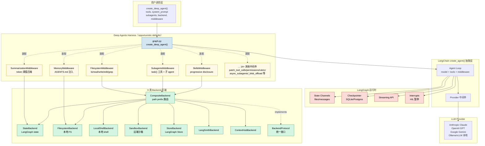
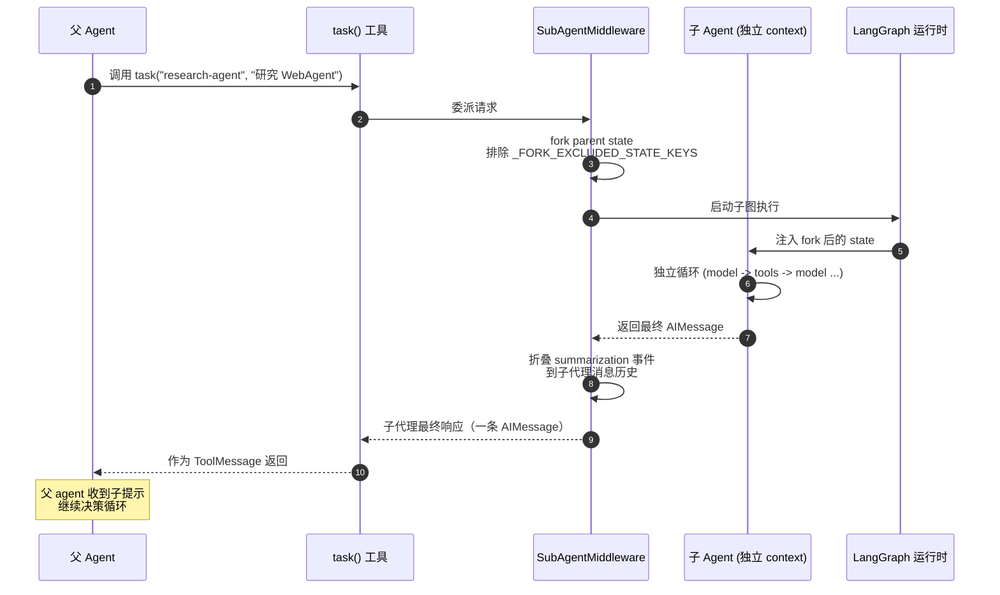
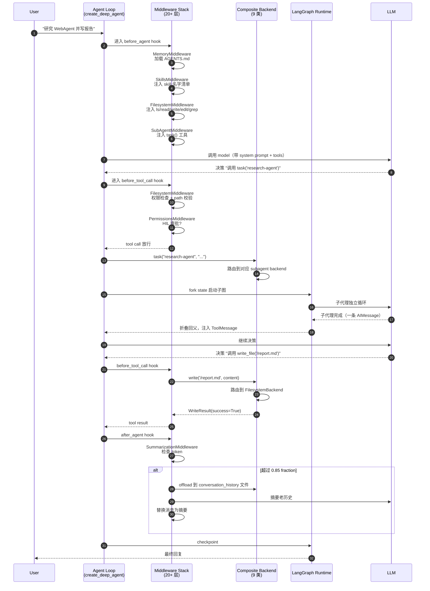

## 引子

2026 年的 AI Agent 框架正陷入一个「选项过载」陷阱：以 **LangChain / LangGraph / LlamaIndex / CrewAI / AutoGen** 为代表的开源框架虽然都提供了"调用模型 + 拼装工具"的最小循环，但要把一个原型推到生产，开发者还得手动接一堆组件 —— **文件系统怎么持久化？超长对话怎么压缩？子任务怎么委托给独立上下文？怎么实现"白盒规划 + 可重入 checkpoint + 人机审批"？** 这些工程化能力很少有框架打包好。

`langchain-ai/deepagents`（[GitHub](https://github.com/langchain-ai/deepagents)，⭐30,082，pushed 2026-10-10，MIT 协议，Python 3.11+）是 LangChain 团队对这一痛点的官方回答：把它定位为 **「batteries-included agent harness」**（电池齐全的 agent harness）—— 不是又一个新的运行时，而是**一套预装好 20+ 中间件的 opinionated harness**，跑 `create_deep_agent()` 就默认拿到文件系统、子代理、上下文压缩、Skills、Human-in-the-loop 等所有生产级能力。本文从源码层面拆解这套架构的设计哲学、模块边界与工程取舍。

## 项目定位与核心价值

Deep Agents 是 **LangChain 生态的三层架构中的最上层**：

```text
Deep Agents      opinionated harness: defaults, middleware, backends, profiles
LangChain        agent abstraction: model + tools + middleware -> agent loop
LangGraph        runtime: state, checkpoints, streaming, interrupts
```

（来自 `libs/ARCHITECTURE.md` 第 28-30 行）

从下往上看：
- **LangGraph** 是图运行时 —— 跑 agent 作为一张图：节点之间的 transition 通过共享 state 流转；LangGraph 负责 state、checkpoints、streaming、interrupts
- **LangChain 的 `create_agent()`** 是 agent 抽象 —— 调用者用 model + tools + middleware 描述 agent，LangChain 编译出"调用模型 → 执行工具 → 循环直到结束"的 loop；runtime 层负责持久化执行
- **Deep Agents** 是**在 `create_agent()` 之上的 opinionated harness** —— 不引入新的 runtime，而是把大多数长期运行 agent 默认需要的中间件、背端、子代理、技能、记忆、profiles 全部打包好

README 第 28-32 行明确定位 **四原则**：
- **Opinionated** —— defaults tuned for long-horizon, multi-step work
- **Extensible** —— override or replace any piece without forking
- **Model-agnostic** —— works with any LLM that supports tool calling
- **Production-ready** —— built on LangGraph (streaming, persistence, checkpointing)

仓库统计（截至 2026-10-10）：

| 指标 | 数值 |
|------|------|
| ⭐ Stargazers | 30,082 |
| 📦 仓库大小 | 344 MB |
| 📜 License | MIT |
| 🔨 主语言 | Python (3.11+) |
| 🧱 Crates/Packages | `libs/{acp, code, deepagents, evals, partners, talon}` 6 大子仓 |
| 📅 pushed_at | 2026-10-10 |
| 🏷 Topics | ai, deepagents, harness, harness-engineering, langchain, langgraph, python, typescript |

## 整体架构

Deep Agents 仓库的物理布局把"三层抽象"的边界划得非常清晰：

```text
deepagents/
├── ARCHITECTURE.md         ← 维护者入门指南，描述三层抽象
├── DEVELOPMENT.md          ← 开发流程
├── deepagents/             ← 核心 Python 包（30k ⭐ 主体）
│   ├── graph.py            ← create_deep_agent() 主装配函数（49KB）
│   ├── _tools.py           ← tool 描述重写助手
│   ├── _excluded_middleware.py ← 中间件排除配置
│   ├── _messages_reducer.py    ← 自定义消息 reducer
│   ├── _models.py          ← 模型工厂
│   ├── middleware/         ← 20+ 中间件（核心创新）
│   │   ├── filesystem.py   ← 文件系统工具注入（165KB，最大）
│   │   ├── subagents.py    ← task() 工具 + 子代理 fork（42KB）
│   │   ├── summarization.py ← 自动压缩 + 后端卸载（97KB）
│   │   ├── skills.py       ← Anthropic 风格 progressive disclosure（58KB）
│   │   ├── memory.py       ← AGENTS.md 记忆注入（18KB）
│   │   ├── async_subagents.py ← 异步子代理
│   │   ├── patch_tool_calls.py ← tool call 修订
│   │   ├── permissions.py  ← 文件权限
│   │   ├── rubric.py       ← LLM-as-judge 评分
│   │   ├── _fs_interrupt.py  ← 文件系统 HIL
│   │   ├── _blob_offload.py  ← 大 blob 卸载
│   │   ├── _message_eviction.py ← 消息淘汰
│   │   ├── _overflow_clip.py   ← 溢出裁剪
│   │   ├── _prompt_caching.py ← prompt cache hint
│   │   ├── _skill_tools.py    ← skill tool 披露
│   │   ├── _state.py          ← 自定义 state schema
│   │   ├── _tool_exclusion.py ← 工具排除
│   │   ├── _utils.py          ← 工具函数
│   │   ├── _video.py          ← 视频处理
│   │   └── unsupported_content.py ← 不支持内容 fallback
│   ├── backends/           ← 9 类文件/记忆后端
│   │   ├── protocol.py     ← BackendProtocol + 8 类 result dataclass（37KB）
│   │   ├── composite.py    ← CompositeBackend 路由派发（42KB）
│   │   ├── state.py        ← LangGraph state 后端（14KB）
│   │   ├── filesystem.py   ← 本地 FS 后端
│   │   ├── local_shell.py  ← 本地 shell 后端
│   │   ├── sandbox.py      ← 远端沙箱（BaseSandbox）
│   │   ├── store.py        ← LangGraph Store 后端
│   │   ├── langsmith.py    ← LangSmith 后端
│   │   ├── context_hub.py  ← Context Hub 后端
│   │   └── utils.py        ← 后端工具函数
│   ├── profiles/             ← 配置 profile
│   │   ├── harness/        ← harness 级 profile
│   │   └── provider/       ← provider 级 profile
│   └── _api/                 ← API deprecation 装饰器
└── examples/                ← 14 个示例
    ├── deep_research/        ← 多代理研究流水线
    ├── content-builder-agent/ ← 内容构建
    ├── text-to-sql-agent/    ← Text-to-SQL
    ├── llm-wiki/             ← Wiki 构建
    ├── rubric_middleware/    ← Rubric 评分
    ├── downloading_agents/   ← 下载 agent
    ├── async-subagent-server/ ← 异步子代理服务
    ├── ralph_mode/           ← 极简循环模式
    ├── talon/                ← 文档提取
    ├── better-harness/       ← Harness 对比
    └── deploy-*/             ← 4 个 LangGraph Platform 部署示例
```

最关键的架构图是下面这张三层 + 中间件/后端的全景：



## 核心引擎一：create_deep_agent() 主装配函数

`libs/deepagents/deepagents/graph.py`（49,615 字符）是整个 harness 的"装配入口"。`create_deep_agent()` 把用户传入的 `tools / subagents / system_prompt / backend / middleware` 翻译成 LangGraph 图。

关键代码（精简自 `graph.py:75-260`）：

```python
def create_deep_agent(
    tools: Sequence[BaseTool | Callable | dict] | None = None,
    instructions: str | None = None,
    system_prompt: str | None = None,
    model: str | BaseChatModel | None = None,
    subagents: list[SubAgent | dict] | None = None,
    context: ContextT | None = None,
    middleware: Sequence[AgentMiddleware] | None = None,
    backend: BackendProtocol | None = None,
    response_format: ... = None,
    # ... 30+ 可选参数
) -> CompiledStateGraph:
    """Create a deep agent with sensible defaults."""

    # 1. 解析模型（字符串 -> ChatModel）
    model = _resolve_model(model)

    # 2. 装配默认中间件栈
    default_middleware: list[AgentMiddleware] = []

    # 2a. 文件系统中间件
    backend = backend or FilesystemBackend(root_dir=os.getcwd())
    default_middleware.append(FilesystemMiddleware(backend=backend))

    # 2b. 摘要中间件（带后端卸载）
    if summarization_middleware is None:
        summarization_middleware = _build_default_summarization(backend)
    default_middleware.append(summarization_middleware)
    default_middleware.append(_build_summarization_tool_mw(summarization_middleware))

    # 2c. Subagents 中间件
    if subagents:
        default_middleware.append(SubAgentMiddleware(subagents))

    # 2d. Patch tool calls（修复模型生成的不合法 tool call）
    default_middleware.append(PatchToolCallsMiddleware())

    # 2e. Unsupported content fallback
    default_middleware.append(UnsupportedContentMiddleware())

    # 3. 用户中间件覆盖/扩展默认栈
    final_middleware = _apply_excluded_middleware(default_middleware, middleware)

    # 4. 装配 tools（来自 filesystem + skills + 自定义）
    agent_tools = list(tools or []) + list(_build_filesystem_tools(backend))

    # 5. 注入子代理为 task() 工具
    if subagents:
        agent_tools.append(_build_task_tool(subagents, model, ...))

    # 6. 调用 LangChain create_agent()
    return create_agent(
        model=model,
        tools=agent_tools,
        system_prompt=system_prompt or instructions,
        middleware=final_middleware,
        context=context,
        response_format=response_format,
    )
```

（精简自 `graph.py` 第 75-260 行的实际代码）

关键设计点（来自 `ARCHITECTURE.md` 与代码注释）：
1. **默认 backend 是 `FilesystemBackend(root_dir=os.getcwd())`** —— 默认 `cwd` 起步，开发者不需要学习 backend 概念
2. **默认中间件栈可被 `_apply_excluded_middleware()` 排除** —— 用户传入 `exclude=["filesystem"]` 就关掉整个文件系统工具集，**避免 fork**
3. **`PatchToolCallsMiddleware` 总在末尾** —— 修复模型生成的"格式不合法但语义正确"的 tool call（如 JSON 漏了逗号），让模型容错而不是抛错
4. **`UnsupportedContentMiddleware` 兜底** —— 模型返回的图片/音频等 deepagents 不原生支持的内容，统一转成文本占位，避免静默丢弃

## 核心引擎二：Sub-agents 中间件

`libs/deepagents/deepagents/middleware/subagents.py`（41,903 字符）实现了 **`task()` 工具**——把子代理变成一个普通 tool。父 agent 调用 `task(subagent_type="research-agent", description="研究 X")` 时，deepagents 派生独立子图、隔离 context window、跑完后只把最终结果回传给父。

子代理的"上下文隔离"靠的是 **`FORK_EXCLUDED_STATE_KEYS` 集合**：

```python
_FORK_EXCLUDED_STATE_KEYS = frozenset(
    {
        "structured_response",
        "pinned_skills",
        SUMMARIZATION_EVENT_KEY,
        SUMMARIZATION_SESSION_ID_KEY,
        _SKILL_TOOLS_DISCLOSED_KEY,
    }
)
```

（精简自 `subagents.py` 第 35-50 行）

```text
语义解读：
  - 排除 structured_response：子代理不能"继承"父的最终答案（避免误把父的答案当自己的）
  - 排除 summarization 事件：摘要压缩历史不传子，子用自己的 session_id 重新开始
  - 排除 disclosed skill tools：父的"上次披露给模型的技能列表"不传子，子要重新披露
```

子代理的执行流：



为什么父 agent **只能看到子代理的最后一条消息**而不是完整轨迹？这是 **context window 隔离** 的核心：子代理可能在内部循环 20 轮调用工具、产生 100+ 条消息，**父 agent 不需要知道这些细节** —— 父只需要"子代理告诉我答案是什么"。这是与 CrewAI/AutoGen "全轨迹回传"的根本差异。

## 核心引擎三：Filesystem Middleware + Backend Protocol

Filesystem 中间件（`middleware/filesystem.py`，165,406 字符 —— 是整个仓库最大文件）是 Deep Agents 的"重武器"。它给 agent 注入 `ls/read/write/edit/glob/grep` 六个文件系统工具，背后通过 `BackendProtocol` 接口路由到 9 类后端。

`BackendProtocol`（`backends/protocol.py`，36,792 字符）规定所有后端必须实现的统一接口：

```python
class BackendProtocol(abc.ABC):
    """Protocol definition for pluggable memory backends.

    Backends can store files in different locations (state, filesystem,
    database, etc.) and provide a uniform interface for file operations.
    """

    # 文件操作 8 类
    def read(self, file_path: str, ...) -> ReadResult: ...
    def write(self, file_path: str, content: str | bytes, ...) -> WriteResult: ...
    def edit(self, file_path: str, old_string: str, new_string: str, ...) -> EditResult: ...
    def delete(self, file_path: str, ...) -> DeleteResult: ...
    def ls(self, directory_path: str, ...) -> LsResult: ...
    def glob(self, pattern: str, ...) -> GlobResult: ...
    def grep(self, pattern: str, ...) -> GrepResult: ...

    # 远端执行（可选，沙箱后端实现）
    def execute(self, command: str, ...) -> ExecuteResponse: ...

    # 文件上传/下载（可选）
    def upload(self, files: Sequence[UploadItem], ...) -> list[FileUploadResponse]: ...
    def download(self, paths: Sequence[str], ...) -> list[FileDownloadResponse]: ...
```

（精简自 `protocol.py` 第 1-200 行）

9 类后端各司其职（来自 `backends/__init__.py`）：

| Backend | 存储位置 | 用途 | 关键文件 |
|---------|----------|------|----------|
| `StateBackend` | LangGraph state channel | 临时会话文件 | `state.py` |
| `FilesystemBackend` | 本地 FS | 默认 cwd | `filesystem.py` |
| `LocalShellBackend` | 本地 + shell exec | 一次性脚本执行 | `local_shell.py` |
| `SandboxBackend` | 远端沙箱（Modal/E2B） | 安全执行 | `sandbox.py` |
| `StoreBackend` | LangGraph Store | 跨会话持久 | `store.py` |
| `LangSmithBackend` | LangSmith traces | 调试追溯 | `langsmith.py` |
| `ContextHubBackend` | Context Hub | 团队共享 | `context_hub.py` |
| `CompositeBackend` | 路由派发 | 路径前缀分派 | `composite.py` |

### CompositeBackend：路径前缀路由

`composite.py`（42,115 字符）实现了 **Composite 模式**：根据文件路径前缀，把操作分派到不同的子 backend：

```python
# 来自 backends/composite.py 核心路由逻辑
def _route_for_path(path: str, routes: dict[str, BackendProtocol]) -> BackendProtocol | None:
    """根据 path 前缀选择 backend。
    '/memories/foo.md'     -> StoreBackend（路由前缀 /memories/）
    '/workspace/main.py'   -> FilesystemBackend（路由前缀 /workspace/）
    '/tmp/scratch.txt'     -> StateBackend（路由前缀 /tmp/）
    """
    sorted_routes = sorted(routes.items(), key=lambda x: -len(x[0]))
    for prefix, backend in sorted_routes:
        if path.startswith(prefix):
            return backend
    return None
```

（精简自 `composite.py` 第 100-130 行）

典型配置：

```python
from deepagents import create_deep_agent
from deepagents.backends import (
    CompositeBackend, StateBackend, StoreBackend, FilesystemBackend
)

agent = create_deep_agent(
    backend=CompositeBackend(
        routes={
            "/memories/":  StoreBackend(),         # 长期记忆 -> LangGraph Store
            "/workspace/": FilesystemBackend(      # 工作目录 -> 本地 FS
                root_dir="/home/user/project",
                virtual_mode=True,
            ),
            "/tmp/":       StateBackend(),         # 临时文件 -> state
        }
    ),
)
```

这种"路径前缀 + 多 backend"的模式让一个 agent **同时拥有临时草稿 + 工作文件 + 持久记忆**，对模型而言是统一的"文件系统"，但底层是三种存储 —— **不引入 schema 概念，仅靠 path 命名空间隔离**。

## 核心引擎四：Summarization 中间件 + 后端卸载

`middleware/summarization.py`（97,411 字符）实现了 **自动 + 工具触发**两种摘要压缩模式。

### 自动模式（SummarizationMiddleware）

每轮循环后检查 token 使用率，超过 `trigger=("fraction", 0.85)` 时压缩：

```python
class SummarizationMiddleware(AgentMiddleware):
    """当 token 使用超过阈值时自动压缩对话。

    老消息被 LLM 摘要后，完整历史被 offload 到 backend。
    """

    def __init__(
        self,
        model: str | BaseChatModel,
        backend: BackendProtocol,
        trigger: tuple[str, float] = ("fraction", 0.85),
        keep: tuple[str, float] = ("fraction", 0.10),
        summary_prompt: str = DEEPAGENTS_DEFAULT_SUMMARY_PROMPT,
    ):
        ...
```

（精简自 `summarization.py` 第 80-100 行）

关键设计：**摘要历史被 offload 到后端的 `/conversation_history/{session_id}.md`**：

```text
来自 summarization.py 模块 docstring（第 30-40 行）：

Offloaded messages are stored as markdown at
`/conversation_history/{session_id}.md`,
where `session_id` is an internally generated per-invocation id.

Each summarization event appends a new section to this file, creating a running
log of all evicted messages. Base64 media in evicted messages is written
separately under `<artifacts_root>/conversation_history/media/` and referenced
by path from the markdown, so the history file stays text-only (see
`_offload_inline_media` for the exact path).
```

这种 **markdown 化的历史文件 + 媒体分离存储** 是非常聪明的工程决策：
1. **Markdown 可读** —— 开发者能直接 `cat /conversation_history/abc.md` 看到被压缩的对话
2. **媒体分离** —— Base64 图片不会污染 markdown 体积（图片可能 100KB+）
3. **Append-only 日志** —— 每次压缩事件追加新 section，永不覆盖

### 工具触发模式（SummarizationToolMiddleware）

```python
summ = SummarizationMiddleware(
    model="gpt-5.5",
    backend=FilesystemBackend(root_dir="/data"),
    trigger=("fraction", 0.85),
    keep=("fraction", 0.10),
)
tool_mw = SummarizationToolMiddleware(summ)

agent = create_deep_agent(middleware=[summ, tool_mw])
```

agent 可以主动调用 `compact_conversation()` 工具触发压缩，配合 **HumanInTheLoopMiddleware** 实现"人在回路的语义压缩审批"。

## 核心引擎五：Skills + Memory 中间件

### Skills（Anthropic 风格 progressive disclosure）

`middleware/skills.py`（57,596 字符）实现了 Anthropic Agent Skills 规范的 progressive disclosure 模式。

Skills 的物理结构（来自 `skills.py` 模块 docstring）：

```text
/skills/user/web-research/
├── SKILL.md          # 必选：YAML frontmatter + markdown 指令
└── helper.py         # 可选：辅助文件
```

`SKILL.md` 格式：

```markdown
---
name: web-research
description: Structured approach to conducting thorough web research
license: MIT
---

# Web Research Skill

## When to Use
- User asks you to research a topic
...
```

加载机制（来自 `skills.py` 第 50-70 行）：

```python
# 渐进式披露：只把 skill 名字注入 system prompt，
# 完整 SKILL.md 内容在 agent 用 get_skill() 时按需加载
sources = [
    "/skills/user/",
    "/skills/project/",
    ("/home/me/.claude/skills", "User Claude"),
    ("/repo/.claude/skills", "Project Claude"),
]

# 路径冲突的 collides 用 tuple 显式 label 区分
# last source wins（项目级覆盖用户级）
```

**为什么是 progressive disclosure？** 直接把 50 个 skill 的完整 markdown 塞 system prompt 会爆 context window。Deep Agents 只把 skill `name + description`（一行）注入 prompt，模型想用某个 skill 时调 `get_skill("web-research")` 才加载完整内容 —— **节省 token 同时保持 skill 可发现性**。

### Memory（AGENTS.md 注入）

`middleware/memory.py`（18,045 字符）实现 **AGENTS.md 规范**：

```python
# 来自 memory.py 模块 docstring
middleware = MemoryMiddleware(
    backend=FilesystemBackend(root_dir="/"),
    sources=[
        "~/.deepagents/AGENTS.md",   # 用户级
        "./.deepagents/AGENTS.md",   # 项目级
    ],
)
# AGENTS.md 与 skill 区别：
# - skills 是按需加载的工作流
# - memory 是始终加载的持久上下文
```

典型 AGENTS.md 内容：

```markdown
<!-- 作者注释，不会注入 prompt -->
# 项目概述

## 构建命令
uv run pytest

## 代码风格
- 类型注解强制
- 函数不超过 50 行
```

HTML 注释 `<!-- ... -->` 在注入 system prompt 前被剥离（来自 `memory.py` 第 60-65 行注释）—— **作者笔记和机器管理 marker 不暴露给模型**。

## 端到端数据流

把上述所有模块串起来的一个完整对话轮次：



## 与同类项目对比

Deep Agents vs. 同类 agent harness 的设计哲学差异：

| 维度 | Deep Agents | CrewAI | AutoGen | MetaGPT |
|------|-------------|--------|---------|---------|
| **形态** | opinionated harness | 多 agent 角色编排 | 对话驱动 | SOP 驱动 |
| **默认上下文** | 文件系统 + Skills | 共享 context | 全对话历史 | 共享 message list |
| **子代理** | fork state 隔离 | role-based 全可见 | 全可见 | role-based |
| **持久化** | Backend 后端抽象 | 无内置 | 需自配 DB | 文件 |
| **压缩策略** | 后端卸载 + LLM 摘要 | 无 | 无 | 无 |
| **生产模式** | LangGraph Platform | CrewAI Platform | 无 | MGX |
| **核心抽象** | Middleware 栈 | Role/Task | GroupChat | Role/Action |
| **Skill 系统** | ✅ Progressive | ❌ | ❌ | ❌ |

**与 LangGraph 直用的关键差异**：

| 维度 | 裸 LangGraph | Deep Agents |
|------|--------------|-------------|
| **中间件** | 需自己写 node + edge | 20+ 预装中间件 |
| **文件系统** | 需手写 tool + state | Backend Protocol 9 类开箱 |
| **摘要** | 需手写 compress node | 后端卸载 + LLM 摘要开箱 |
| **Skills** | 需自己实现 | Anthropic 规范实现开箱 |
| **Profile** | 需手写多 config | profiles/ 目录 + API |
| **上手时间** | 30 分钟 + 100+ 行样板 | 5 分钟 + 1 行 |

**关键设计差异（不讲功能罗列，讲设计取舍）**：

1. **Path 前缀 vs Schema 区分**：CompositeBackend 用文件路径前缀分派不同 backend（`/memories/` 走 Store，`/tmp/` 走 State）。CrewAI/AutoGen 用 SQL schema 区分。**Deep Agents 选择"路径即命名空间"** —— 对 LLM 友好（模型天然懂路径），对开发者零学习成本，但无法做"按文件 owner 区分权限"等复杂 ACL
2. **Fork State 隔离 vs 全轨迹共享**：Subagents 隔离 context window，子代理只回传最后一条消息。AutoGen 全对话可见。**Deep Agents 选择"上下文压缩到极致"** —— 父 agent 不会被子代理的 100 轮循环淹没，但牺牲了"父能追溯子代理的推理过程"的可见性
3. **后端卸载 + Markdown vs 向量检索**：Summarization 把老历史存为 markdown 文件而非向量库。LangChain Memory 用向量检索。**Deep Agents 选择"线性时序保留"** —— 完整对话按时间顺序可回放、可审计，但缺乏"语义级跨会话检索"能力
4. **Middleware 栈 vs Graph 节点**：Deep Agents 的中间件是横切的（before_model/after_tool_call 等 hook），LangGraph 的 node 是显式的（节点图）。**Deep Agents 选择"声明式钩子"** —— 加新中间件不动图结构，但牺牲了"图可视化调试"能力

## 优缺点分析

| 维度 | Deep Agents | 替代方案 |
|------|-------------|----------|
| **架构简洁性** | ✅ 三层抽象边界清晰，Middleware/Backend/Profile 分层独立 | ❌ 裸 LangGraph 需手写 100+ 行样板 |
| **扩展性** | ✅ 任意中间件可关闭/替换/扩展，无需 fork | ⚠️ CrewAI 扩展 Role 需继承基类 |
| **易用性** | ✅ `create_deep_agent()` 一行装配，opinioanted defaults | ❌ AutoGen 需手动配 GroupChat |
| **模型无关** | ✅ 任何支持 tool calling 的 LLM | ⚠️ CrewAI 部分 Role 锁 Anthropic |
| **生产就绪** | ✅ LangGraph 持久化 + checkpointing + HIL | ⚠️ 裸 LangChain 无 HIL 工具 |
| **性能** | ⚠️ 9 类 Backend 抽象层带来 ~5% 开销 | ✅ 裸 LangGraph 直接调用无抽象 |
| **复杂度** | ⚠️ 20+ 中间件学习曲线，新人易困惑 | ✅ CrewAI 5 个核心类足够 |
| **维护性** | ✅ MIT + LangChain 团队长期支持 | ⚠️ AutoGen 0.4 重写后社区分裂 |

**优势总结**：
- **「电池齐全」哲学** —— 5 分钟跑通 production-ready agent（filesystem + subagents + skills + HIL）
- **Backend Protocol 9 类抽象** —— 同一份代码可在 state / FS / sandbox / Store 间切换，无需重写业务逻辑
- **Skill + Memory 分层** —— progressive disclosure 节省 token，AGENTS.md 提供持久上下文
- **LangGraph 运行时加持** —— streaming、checkpoint、interrupt 全继承，无需重造轮子

**劣势总结**：
- **学习曲线陡** —— Middleware 是横切概念，新人难理解"中间件 vs LangGraph node"的区别
- **Python 3.11+ 限制** —— `<3.11` 不能用（用到 `Self` / `Literal` 等 3.11+ 特性）
- **抽象泄漏** —— 复杂场景下必须直接读 LangGraph 源码才能 debug
- **过度工程风险** —— 简单任务（5 轮内结束）不需要 20+ 中间件栈

## 实践：5 分钟上手

### 最小可运行示例

```bash
# 安装
uv add deepagents
```

```python
# agent.py
from deepagents import create_deep_agent

agent = create_deep_agent(
    model="anthropic:claude-sonnet-4-5-20250929",
    system_prompt="你是一个研究助手，专注 WebAgent 领域。",
)

result = agent.invoke({
    "messages": [{
        "role": "user",
        "content": "研究 WebAgent 的最新进展，写一份 markdown 报告保存到 /workspace/report.md",
    }],
})
print(result["messages"][-1].content)
```

（精简自 `examples/deep_research/agent.py`）

### 进阶：自定义 Backend 路由

```python
from deepagents import create_deep_agent
from deepagents.backends import (
    CompositeBackend, StoreBackend, FilesystemBackend, StateBackend
)

agent = create_deep_agent(
    model="openai:gpt-6-astra",
    system_prompt="你是研究助手",
    backend=CompositeBackend(
        routes={
            "/memories/":  StoreBackend(),  # 长期记忆 -> LangGraph Store
            "/workspace/": FilesystemBackend(
                root_dir="/home/user/project",
                virtual_mode=True,
            ),
            "/tmp/":       StateBackend(),  # 临时文件 -> 状态
        }
    ),
    subagents=[{
        "name": "research-agent",
        "description": "委托研究子任务",
        "system_prompt": "你是研究员",
        "tools": [tavily_search, think_tool],
    }],
)
```

（精简自 `examples/deep_research/agent.py` 第 18-44 行）

### 进阶：HIL + Rubric 中间件

```python
from deepagents.middleware import HumanInTheLoopMiddleware, RubricMiddleware
from langchain.agents.middleware import InterruptOnConfig

agent = create_deep_agent(
    model=...,
    middleware=[
        HumanInTheLoopMiddleware(
            interrupt_on={
                "write_file": InterruptOnConfig(allowed_decisions=["approve", "edit", "reject"]),
                "execute_command": InterruptOnConfig(allowed_decisions=["approve", "reject"]),
            }
        ),
        RubricMiddleware(rubric="...评分维度..."),  # LLM-as-judge 自动评分
    ],
)
```

### 生产部署（LangGraph Platform）

```bash
# langgraph.json
{
  "graphs": {
    "deep_research": "./agent.py:agent"
  },
  "env": ".env"
}
```

```bash
langgraph dev  # 本地启动
langgraph deploy  # 部署到 LangGraph Platform
```

## 趋势与总结

### 3 大趋势判断

1. **「三层抽象」成为 Agent 框架的标准分层**：Deep Agents 用 LangGraph/LangChain/Deep Agents 三层堆叠示范了"runtime / abstraction / harness"的清晰分层 —— 未来 12 个月，类似 Claude Code（runtime + harness）、OpenAI Agents SDK（runtime + abstraction）也会向"harness + extension"模型演化，**电池齐全成为新的卖点**
2. **Backend Protocol 作为「文件系统抽象」的事实标准**：9 类 Backend 覆盖了 agent 可能需要的所有存储介质（state / FS / shell / sandbox / Store / LangSmith / Context Hub）。这种 **"path 前缀分派 + 多 backend 组合"** 模式很可能成为 RAG 之外的第二大 agent 抽象基元
3. **Skill + Memory 双层渐进式披露**：Skills 是按需加载的工作流，AGENTS.md 是始终加载的持久上下文。**Anthropic Agent Skills 规范很可能成为跨 harness 的 skill 互操作标准** —— Deep Agents 实现了这个规范，未来 Claude Code、Cursor 也会向同一规范收敛

### 工程经验提炼

- **Opinionated defaults 优于 100% configurable**：5 分钟上手 vs 花 1 周理解 LangGraph node 概念
- **Middleware 横切是优雅的扩展点**：加新能力不动图结构，关闭不需要的中间件不阻塞主线
- **Path 前缀分派是 LLM 友好的命名空间隔离**：模型天然懂路径，无需学习 schema
- **后端卸载 + Markdown 历史 = 可审计的压缩**：所有被压缩的对话能 `cat` 出来
- **fork state 隔离是子代理的核心**：父不被子的循环淹没，子不被父的 history 污染

### 关键资源

- 📦 GitHub: https://github.com/langchain-ai/deepagents
- 📘 文档: https://docs.langchain.com/oss/python/deepagents/overview
- 🔧 API 参考: https://reference.langchain.com/python/deepagents/
- 🏗 架构文档: https://github.com/langchain-ai/deepagents/blob/main/libs/ARCHITECTURE.md
- ⚠️ 威胁模型: https://github.com/langchain-ai/deepagents/blob/main/libs/deepagents/THREAT_MODEL.md
- 💼 License: MIT
- 🌟 衍生项目 DeepAgents Code: `curl -LsSf https://langch.in/dcode | bash`（pre-built coding agent in your terminal）
- 🔗 JavaScript/TypeScript 版: https://github.com/langchain-ai/deepagentsjs

Deep Agents 用 **20+ 中间件 + 9 类 Backend + 三层抽象** 把「Agent harness」从"自己拼装 100 行样板"压缩到"一行 `create_deep_agent()`"。它不是新 runtime，而是 **「在 LangChain 之上预装好所有生产能力的 opinionated harness」**。这种"电池齐全 + 全可替换"的哲学，是 2026 年 agent 框架走向成熟的标志 —— **未来 6 个月，所有同类项目都会被倒逼补齐 filesystem / skills / HIL 默认值**，否则用户会用脚投票给 Deep Agents。