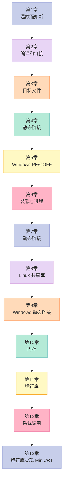

# 程序员的自我修养 · 系列总览

> **为什么你写的 `printf("Hello World\n")` 能跑到屏幕上？**
>
> 这 15 篇文章，会沿着这条问号，把答案从 CPU 寄存器、一路挖到内核的 `sys_write`。

## 0. 为什么要写这个系列

2009 年，俞甲子、石凡、潘爱民三位作者把"链接、装载与库"这四个字写成了一本薄书。12 年过去了，C++ 多了 `std::move`、Rust 已经登堂入室、Web 后端换了一茬又一茬——但**程序从 `.c` 到屏幕的这条链路，没有变过**。

> "**计算机科学领域的任何问题都可以通过增加一个间接的中间层来解决。**" —— Butler Lampson

这个系列就是要把这十几个**中间层**一层一层剥开：从 `cpp → cc1 → as → ld → execve → ld.so → syscall` 直到 `tty_write` 把字符送到显示器。

读完这 15 篇，你会获得三种**工程师内功**：

| 能力 | 对应文章 | 直接收益 |
|:--|:--|:--|
| 看懂 `linker error` 报的"undefined reference to..."是哪一层在作怪 | 02、04、05、07 | 调试编译问题不再靠 Google 盲搜 |
| 解释 `ldd` 输出的 `.so` 关系，理解"动态链接"为何要 `-fPIC` | 05、07、08、15 | 排查 ABI 兼容性问题不再玄学 |
| 理解 `malloc` 返回的指针为什么有时要 `mmap`、有时要 `brk` | 09、10 | 调优内存占用、性能瓶颈分析 |
| 明白 `pthread_create` 背后内核做了什么、用户态做了什么 | 12 | 多线程 bug 排查有据可循 |
| 看懂 `gdb` 输出的栈帧、寄存器，理解 `core` 文件的每一个字节 | 13、14 | 生产环境 crash 定位速度 10x |

## 1. 全书脉络



## 2. 系列目录（15 篇）

| # | 文章 | 对应书中章节 | 核心问题 | 状态 |
|:--|:--|:--|:--|:--|
| 01 | [温故而知新](/2024/03/21/01-温故而知新/) | Ch1 | Hello World 怎么从源码变成屏幕上的字符？ | ✅ |
| 02 | [编译和链接](/2024/03/21/02-编译和链接/) | Ch2 | `gcc` 背后到底跑了哪 4 个工具？ | ✅ |
| 03 | [目标文件里有什么](/2024/03/21/03-目标文件里有什么/) | Ch3 | `.o` 文件为什么不是乱码？它分几段？ | ✅ |
| 04 | [静态链接](/2024/03/21/04-静态链接/) | Ch4 | 两个 `.o` 文件是怎么拼成一个 `a.out` 的？ | ✅ |
| 05 | [Windows PE/COFF](/2024/06/16/05-windows-pe-coff/) | Ch5 | Windows 的 `.exe` 跟 Linux 的 ELF 有什么本质区别？ | 🆕 |
| 06 | [可执行文件的装载与进程](/2024/03/21/06-可执行文件的装载与进程/) | Ch6 | `execve` 之后，内核做了什么？ | ✅ |
| 07 | [动态链接](/2024/03/21/05-动态链接/) | Ch7 | 为什么要动态链接？`.so` 何时被加载？ | ✅ |
| 08 | [动态链接的实现](/2024/03/21/07-动态链接的实现/) | Ch7 实现 | GOT/PLT/延迟绑定的代码长什么样？ | ✅ |
| 09 | [Linux 共享库的组织](/2024/03/21/08-Linux共享库的组织/) | Ch8 | `ldconfig` 做了什么？SONAME 是什么？ | ✅ |
| 10 | [内存管理](/2024/03/21/09-内存管理/) | Ch10 | `malloc` 背后是 `brk` 还是 `mmap`？ | ✅ |
| 11 | [运行库](/2024/03/21/10-运行库/) | Ch11 | C++ 全局对象构造函数什么时候被调？ | ✅ |
| 12 | [系统调用](/2024/03/21/11-系统调用/) | Ch12 | `int 0x80` 跟 `syscall` 有什么区别？ | ✅ |
| 13 | [线程库](/2024/03/21/12-线程库/) | 补充 | NPTL 线程的栈、TCB、TLS 在哪？ | ✅ |
| 14 | [调试](/2024/03/21/13-调试/) | 补充 | `gdb` 怎么在另一个进程里改我的内存？ | ✅ |
| 15 | [Windows 下的动态链接](/2024/06/16/15-windows-dynamic-linking/) | Ch9 | DLL 加载、`IAT` 表、DLL 注入是怎么回事？ | 🆕 |

> ✅ = 已发布（已增强）　🆕 = 本次新增

## 3. 阅读建议

| 你是谁 | 推荐路径 | 预计耗时 |
|:--|:--|:--|
| **计算机系大二/大三学生** | 01 → 02 → 03 → 04 → 06 → 07 → 10 → 12 | 8-10 小时 |
| **C/C++ 后端工程师** | 03 → 04 → 07 → 08 → 10 → 11 → 12 → 13 | 6-8 小时 |
| **面试突击（系统底层）** | 03 → 04 → 07 → 09 → 10 → 12 | 4-5 小时 |
| **嵌入式 / OS 开发** | 01 → 02 → 06 → 10 → 12 → 13 | 6-8 小时 |
| **想完整读一遍** | 01 → 02 → ... → 15 | 20-25 小时 |

## 4. 配套实验环境

本系列所有代码均在以下环境验证：

```bash
$ uname -a
Linux x86_64 #1 SMP Debian 6.1.0
$ gcc --version
gcc (Debian 12.2.0) 12.2.0
$ ld --version
GNU ld 2.40
$ readelf --version
GNU readelf 2.40
$ gdb --version
GNU gdb 13.2
```

Windows 章节（05、15）使用：

```
Windows 10 22H2 x64
Visual Studio 2022 17.5
cl.exe 19.35
dumpbin.exe (VS 自带)
```

## 5. 一句话总结

> **一个程序，从 `.c` 到屏幕，走了 12 层间接。这 15 篇文章就是那 12 层的解剖图。**

---

下一篇 → [第一章：温故而知新](/2024/03/21/01-温故而知新/)

<details>
<summary>📖 完整 15 篇目录（点击展开）</summary>

1. [第一章：温故而知新](/2024/03/21/01-温故而知新/) **← 系列起点**
2. [第二章：编译和链接](/2024/03/21/02-编译和链接/)
3. [第三章：目标文件里有什么](/2024/03/21/03-目标文件里有什么/)
4. [第四章：静态链接](/2024/03/21/04-静态链接/)
5. [第五章：Windows PE/COFF](/2024/06/16/05-windows-pe-coff/) 🆕
6. [第六章：可执行文件的装载与进程](/2024/03/21/06-可执行文件的装载与进程/)
7. [第七章：动态链接](/2024/03/21/05-动态链接/)
8. [第八章：动态链接的实现](/2024/03/21/07-动态链接的实现/)
9. [第九章：Linux 共享库的组织](/2024/03/21/08-Linux共享库的组织/)
10. [第十章：内存管理](/2024/03/21/09-内存管理/)
11. [第十一章：运行库](/2024/03/21/10-运行库/)
12. [第十二章：系统调用](/2024/03/21/11-系统调用/)
13. [第十三章：线程库](/2024/03/21/12-线程库/)
14. [第十四章：调试](/2024/03/21/13-调试/)
15. [第十五章：Windows 下的动态链接](/2024/06/16/15-windows-dynamic-linking/) 🆕

</details>
